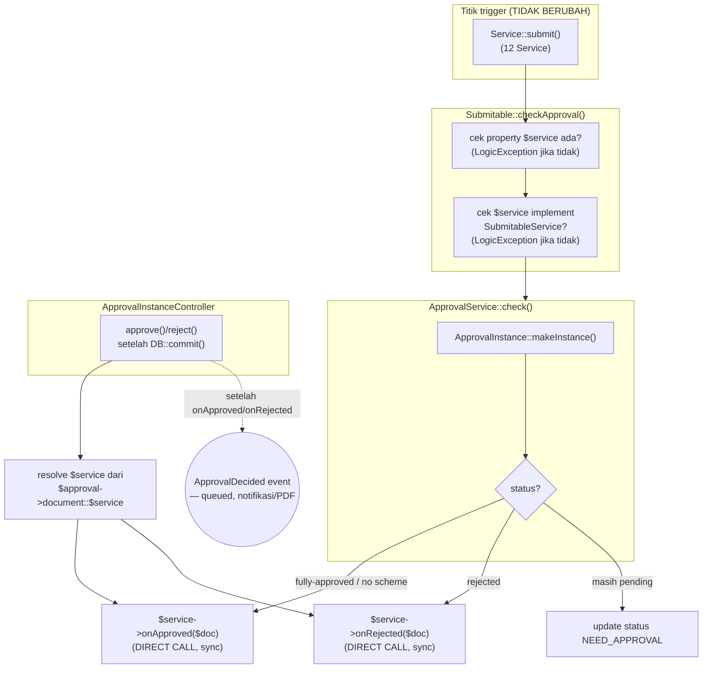

# Design Document: Approval System Rewrite

## Overview

Migrasi ini menghilangkan seluruh string-based dynamic dispatch (`app()->call("$controller@method")`) pada alur approval, menggantinya dengan resolusi eksplisit: property `$service` pada Model, dan dua interface kontrak (`CrudService`, `SubmitableService`) yang diimplementasikan Service dokumen.

Pattern utama: **Model tetap jadi titik trigger** (`checkApproval()` di `Submitable`, konsisten dengan precedent `DocumentCanceled`), tapi resolusi Service-nya eksplisit lewat property, bukan lewat nama Controller yang disimpan sebagai string di database. `onApproved()`/`onRejected()` dipanggil **langsung** (bukan lewat Event/Listener) karena return value-nya dipakai untuk response HTTP.

Yang berubah: `Submitable::checkApproval()`, `ApprovalInstanceController::approve()/reject()/callDocumentCallback()`, 12 Service dokumen submitable (implement interface baru), 12 Model dokumen submitable (tambah property `$service`), 2 interface baru, 1 Service baru (`ApprovalService`), 1 trait baru (`HasDefaultDelete`).

Yang TIDAK berubah: urutan evaluasi step approval (sequence, is_advanced, dst), isi/logic method `onApproved`/`onRejected`/`submit`/`cancel`/`amend` di tiap Service (hanya signature/kontrak yang distandarkan), skema database `ApprovalInstance` (kolom `options` tetap ada, jadi dead data untuk record lama).

Ini adalah **prasyarat** untuk `event-listener-migration-phase-1` Requirement 2 — spec tersebut ditunda sampai rewrite ini selesai.

## Architecture



### Data Flow — submit hingga fully-approved

1. `SalesOrderService::submit($salesOrder)` — tidak berubah, memanggil `$salesOrder->checkApproval()` di akhir seperti sekarang.
2. `Submitable::checkApproval()` — cek `property_exists(static::class, 'service')`, lempar `LogicException` jika tidak ada. Cek `is_subclass_of(static::$service, SubmitableService::class)`, lempar jika tidak.
3. Panggil `app(ApprovalService::class)->check($this, static::$service, $options, $triggerOn)`.
4. `ApprovalService::check()` — buat `ApprovalInstance` (logic `makeInstance()` tidak berubah). Jika tidak ada scheme aktif atau langsung fully-approved: `app($serviceClass)->onApproved($document)` — **direct call**, return value diteruskan sebagai return `checkApproval()`.
5. Response HTTP dari controller yang memanggil `submit()` memakai return value ini — behavior sama seperti sekarang.

### Data Flow — approve dari UI (setelah step sebelumnya PENDING)

1. `ApprovalInstanceController::approve()` — logic step/sequence TIDAK berubah.
2. Setelah `DB::commit()`, jika `$isApproved`: resolve `$serviceClass = $approval->document::$service`, panggil `app($serviceClass)->onApproved($approval->document)` — **direct call**, hasilnya dipakai untuk `return`.
3. **Setelah** `onApproved()` selesai (baik sukses atau — lihat Error Handling untuk kasus exception): `event(new ApprovalDecided($approval, 'approved'))` — queued, untuk `AttachApprovalPdf`/`NotifyApprovalDecision` (sesuai desain `event-listener-migration-phase-1`, akan diimplementasikan saat spec itu dilanjutkan).

## Components and Interfaces

### `App\Contracts\CrudService`

```php
namespace App\Contracts;

use App\Models\Model;

interface CrudService {
    public function create(array $data): Model;
    public function update(Model $model, array $data): Model;
    public function delete(Model $model): void;
}
```

### `App\Contracts\SubmitableService`

```php
namespace App\Contracts;

interface SubmitableService extends CrudService {
    public function submit(Model $model): mixed;
    public function cancel(Model $model): mixed;
    public function amend(Model $model): mixed;
    public function onApproved(Model $model): mixed;
    public function onRejected(Model $model): mixed;
}
```

### `App\Traits\HasDefaultDelete`

```php
namespace App\Traits;

use App\Models\Model;

trait HasDefaultDelete {
    public function delete(Model $model): void {
        $model->delete();
    }
}
```

Dipakai oleh 12 Service submitable yang belum punya logic delete khusus. Service yang butuh logic tambahan (mis. cascade cleanup) meng-override method ini setelah `use HasDefaultDelete`.

### `App\Services\Core\Approval\ApprovalService`

```php
namespace App\Services\Core\Approval;

use App\Contracts\SubmitableService;
use App\Enums\FormStatus;
use App\Models\Core\ApprovalInstance;
use App\Models\Model;

class ApprovalService {
    public function check(Model $document, string $serviceClass, array $options, string $triggerOn): mixed {
        $instance = ApprovalInstance::makeInstance($document, $options, $triggerOn);

        /** @var SubmitableService $service */
        $service = app($serviceClass);

        if (! $instance || $instance->status === FormStatus::APPROVED) {
            return $service->onApproved($document);
        }
        if ($instance->status === FormStatus::REJECTED) {
            return $service->onRejected($document);
        }

        $document->update(['status' => FormStatus::NEED_APPROVAL]);

        return null;
    }
}
```

Catatan: `ApprovalInstance::makeInstance()` saat ini menerima `options` yang berisi `controller`/`parameters` (dipakai untuk resolusi lama). Parameter `$options` pada `check()` di atas tetap diteruskan untuk kompatibilitas dengan penggunaan `options` LAIN yang tidak terkait resolusi controller (mis. custom approval condition per model) — lihat Data Models untuk detail field mana yang masih relevan.

### `Submitable::checkApproval()` (perubahan)

```php
public function checkApproval(array $options = [], string $triggerOn = 'submit') {
    if (! \property_exists(static::class, 'service')) {
        throw new \LogicException(static::class . ' harus mendeklarasikan property $service untuk memakai checkApproval().');
    }
    if (! \is_subclass_of(static::$service, SubmitableService::class)) {
        throw new \LogicException(static::$service . ' harus implement ' . SubmitableService::class . '.');
    }

    return DB::transaction(function () use ($options, $triggerOn) {
        $result = app(ApprovalService::class)->check($this, static::$service, $options, $triggerOn);
        $this->logForSubmitted();
        DB::commit();

        return $result;
    });
}
```

Catatan: blok `DB::transaction`/`logForSubmitted()` dipertahankan dari `ApprovalInstanceController::checkApproval()` versi lama (dipindah ke sini karena logic ini sekarang berjalan sepenuhnya dari sisi Model, tidak lagi lewat Controller).

### `ApprovalInstanceController::approve()`/`reject()` (perubahan)

Bagian logic step/sequence (baris awal hingga `DB::commit()`) **TIDAK berubah**. Bagian setelah commit:

```php
// approve() — setelah if ($isApproved) { ...; DB::commit(); }
$document    = $approval->document;
$serviceClass = $document::$service;
$result      = app($serviceClass)->onApproved($document);

event(new ApprovalDecided($approval, 'approved')); // queued — lihat event-listener-migration-phase-1

return $result;
```

`callDocumentCallback()` **dihapus** — tidak ada lagi resolusi lewat `$approval->options['controller']`.

### 12 Model dokumen submitable (perubahan)

Tiap Model menambahkan satu baris:
```php
// app/Models/Sales/SalesOrder.php
protected static string $service = SalesOrderService::class;
```

Diterapkan pada: `SalesOrder`, `PurchaseOrder`, `PurchaseRequest`, `PurchaseReceipt`, `PurchaseInvoice`, `SalesInvoice`, `PaymentEntry`, `DeliveryNote`, `StockEntry`, `InternalOrder`, `WorkOrder`, `Quotation`.

### 12 Service dokumen submitable (perubahan)

Tiap Service menambahkan `implements SubmitableService` dan `use HasDefaultDelete` (kecuali sudah punya logic delete sendiri — perlu dicek per-Service saat implementasi apakah ada delete custom; berdasarkan grep sebelumnya, TIDAK ada Service yang punya `delete()`, jadi seluruhnya memakai default). Method `create`/`update`/`submit`/`cancel`/`amend`/`onApproved`/`onRejected` yang sudah ada disesuaikan signature-nya (return type `mixed`/`Model` sesuai interface) TANPA mengubah isi logic.

**Catatan gap**: berdasarkan Requirement 1.4, 12 Service ini "TIDAK implement interface apapun untuk `cancel`" saat ini — `cancel()` sekarang ditangani `Controller::cancel()` (base) yang memanggil `$this->service->cancel($data)` **hanya jika Service punya method itu** (perlu verifikasi konkret per-Service saat implementasi apakah `cancel()` sudah ada atau perlu dibuat baru sebagai bagian migrasi ini).

### Controller dokumen (mis. `SalesOrderController`)

Method `onApproved()`/`onRejected()` **dihapus** dari seluruh Controller dokumen — sepenuhnya pindah ke Service.

## Data Models

Tidak ada perubahan skema database. `ApprovalInstance.options` (kolom JSON existing) tetap ada; alur baru tidak menulis `controller`/`parameters` ke dalamnya lagi, tapi field lain di dalam `options` (jika ada, mis. custom condition config) tetap diteruskan apa adanya melalui parameter `$options` pada `ApprovalService::check()`.

## Correctness Properties

**Property 1 — Resolusi Service selalu eksplisit atau gagal cepat.**
_For any_ Model yang memanggil `checkApproval()`, SELALU salah satu dari: (a) `$service` terdeklarasi dan implement `SubmitableService` → proses lanjut normal, atau (b) `LogicException` dilempar sebelum ada side-effect apapun (tidak ada `ApprovalInstance` dibuat, tidak ada status berubah).
**Validates: Requirement 2.3, 2.4**

**Property 2 — Hasil approval funsional tidak berubah.**
_For any_ dokumen dengan urutan step approval yang sama, hasil akhir (status dokumen, status tiap step, dokumen turunan yang dibuat `onApproved()`) SHALL identik dengan hasil sebelum migrasi — hanya jalur pemanggilan internal yang berbeda.
**Validates: Requirement 4.1, 4.2, 5.1**

**Property 3 — Return value approve/reject terjaga.**
_For any_ approval yang mencapai fully-approved, response HTTP `ApprovalInstanceController::approve()` SHALL berisi hasil `onApproved()` (mis. redirect ke dokumen turunan bila `onApproved()` membuatnya) — bukan generic `back()` yang kehilangan konteks tersebut.
**Validates: Requirement 4.1, 5.4**

## Error Handling

| Scenario | Behavior |
|----------|----------|
| Model memanggil `checkApproval()` tanpa `$service` | `LogicException` saat itu juga, sebelum `ApprovalInstance` dibuat — fail-fast di layer Model. |
| `$service` ada tapi class tidak implement `SubmitableService` | `LogicException` saat itu juga (guard di `checkApproval()`, sebelum `ApprovalService::check()` dipanggil). |
| `onApproved()`/`onRejected()` melempar exception | Propagate apa adanya ke pemanggil (`ApprovalInstanceController::approve()`/`reject()` atau `Submitable::checkApproval()`). `ApprovalInstance`/`ApprovalInstanceStep` yang sudah commit sebelumnya TETAP tersimpan sebagai APPROVED/REJECTED — dokumen approval-nya konsisten meski efek samping gagal (sama seperti perilaku `app()->call()` sekarang: exception dari callback juga propagate apa adanya). |
| `ApprovalInstance.options` lama (data existing) masih berisi `controller`/`parameters` | Tidak dibaca oleh kode baru sama sekali — dead data, tidak memerlukan migration, tidak menyebabkan error. |
| Service dokumen belum di-migrasi (lupa `implements SubmitableService`) tapi Model-nya sudah punya `$service` menunjuk ke Service tersebut | `is_subclass_of()` check di `checkApproval()` menangkap ini sebagai `LogicException` — mencegah runtime error yang lebih membingungkan (mis. `Call to undefined method`) di titik yang lebih jauh dari akar masalah. |

## Testing Strategy

- **Contract test**: satu test yang iterasi 12 Service dokumen submitable, assert masing-masing `is_subclass_of($service, SubmitableService::class)` — mencegah drift di masa depan (Service baru lupa implement kontrak).
- **Unit test `ApprovalService`**: test dengan `SubmitableService` fake/mock untuk 3 skenario (fully-approved, rejected, masih pending) — assert method yang benar terpanggil, assert return value diteruskan dari `check()`.
- **Unit test `Submitable::checkApproval()`**: assert `LogicException` dilempar untuk Model tanpa `$service` dan Model dengan `$service` yang class-nya tidak implement kontrak.
- **Regression**: seluruh test approval existing (`ApprovalNotificationTest`, `ApprovalPdfAutoAttachTest`, `ApprovalAutoApproveTest`, `CancelPendingApprovalStepsTest`) harus tetap PASS.
- **Regresi response HTTP**: test baru untuk minimal satu dokumen (mis. `SalesOrder` — `onApproved()`-nya membuat `DeliveryNote`) yang memverifikasi response `approve()` tetap redirect ke dokumen turunan seperti sebelum migrasi — ini adalah test yang paling sensitif terhadap kesalahan resolusi `$service` atau kehilangan return value.
