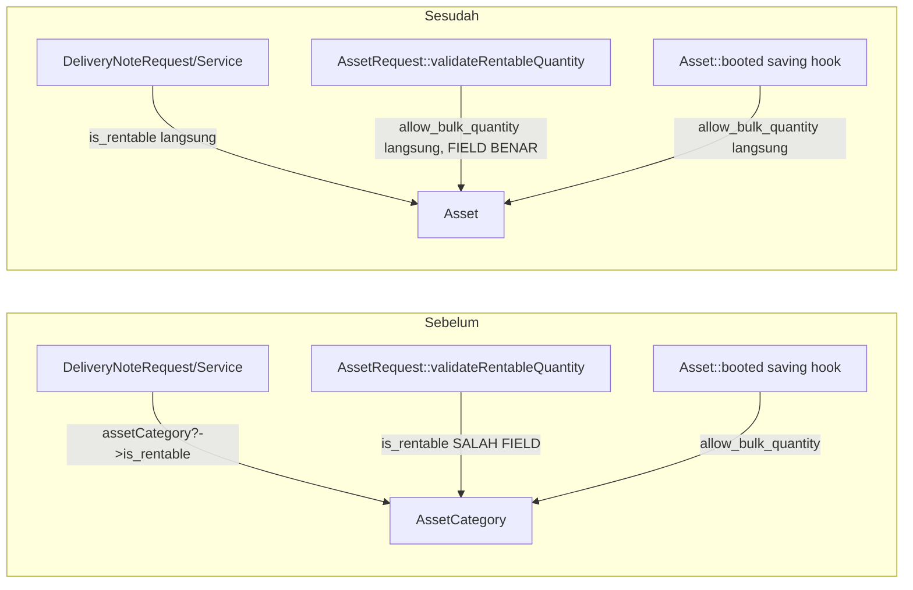

# Design Document: Asset Category Simplification

## Overview

Memindahkan `is_rentable` dan `allow_bulk_quantity` dari `AssetCategory` (per-kategori) ke `Asset` (per-unit). Perubahan menyentuh 4 layer:

1. **Skema**: 2 migration baru — tambah kolom ke `assets` + copy data dari `AssetCategory` induk (inline di `up()`), lalu migration terpisah drop kolom dari `asset_categories`.
2. **Backend read-path**: `Asset::booted()`, `AssetRequest::validateRentableQuantity()`, `DeliveryNoteRequest`, `DeliveryNoteService` — semua baca field dari `$asset` langsung, bukan `$asset->assetCategory`.
3. **Form React**: 2 checkbox pindah dari `Categories/Form.jsx` ke `Assets/Form.jsx`; `Categories/Index.jsx` hapus badge `is_rentable`.
4. **Factory & test**: `AssetCategoryFactory` lepas 2 field + state terkait, `AssetFactory` menambahkannya; seluruh test yang set field ini via `AssetCategory::factory()` diaudit ulang.

**Temuan tambahan saat analisis (bukan cuma pindah field)**: `AssetRequest::validateRentableQuantity()` — nama method menyebut "Rentable" tapi isinya mengecek `AssetCategory.is_rentable` untuk memutuskan boleh-tidaknya `asset_quantity > 1`, sedangkan `Asset::booted()` mengecek field BEDA (`allow_bulk_quantity`) untuk validasi yang SAMA. Ini bukan cuma soal sumber data (Category vs Asset) — field yang dibaca pun salah di `AssetRequest`. Perbaikan ini sekaligus menutup root cause bug asli (lihat [requirements.md](requirements.md) Introduction): setelah perubahan, KEDUA titik membaca `allow_bulk_quantity` dari `Asset` yang sama.

**Tidak berubah**: `non_depreciable_category`, `enable_cwip_accounting`, default setting depresiasi — tetap di `AssetCategory`. Relasi `Asset::assetCategory()` tidak dihapus (masih dipakai untuk `non_depreciable_category` default saat create, lihat `Asset::booted()` baris ~352-361).

## Architecture



**Data flow migrasi** (urutan wajib, lihat Data Models):
1. Migration A: `ALTER TABLE assets ADD is_rentable, allow_bulk_quantity` (default `false`) → lalu di migration yang sama, UPDATE tiap `Asset` dengan nilai dari `AssetCategory` induknya saat itu.
2. Migration B (timestamp setelah A): `ALTER TABLE asset_categories DROP is_rentable, allow_bulk_quantity`.

Kalau urutan dibalik, migration A kehilangan sumber data untuk di-copy — karenanya 2 migration terpisah dengan timestamp berurut, bukan digabung jadi 1 file.

## Components and Interfaces

### 1. Migration — `assets` (tambah kolom + copy data)

```php
// database/migrations/2026_09_08_xxxxx_add_rentable_flags_to_assets_table.php
public function up(): void {
    Schema::table('assets', function (Blueprint $table) {
        $table->boolean('is_rentable')->default(false)->after('asset_quantity');
        $table->boolean('allow_bulk_quantity')->default(false)->after('is_rentable');
    });

    // Copy per-kategori: portable MySQL/SQLite (hindari UPDATE...JOIN,
    // tidak didukung seragam oleh grammar Eloquent di kedua driver).
    DB::table('asset_categories')
        ->select('id', 'is_rentable', 'allow_bulk_quantity')
        ->orderBy('id')
        ->each(function ($category) {
            DB::table('assets')
                ->where('asset_category_id', $category->id)
                ->update([
                    'is_rentable'         => (bool) $category->is_rentable,
                    'allow_bulk_quantity' => (bool) $category->allow_bulk_quantity,
                ]);
        });
}

public function down(): void {
    Schema::table('assets', function (Blueprint $table) {
        $table->dropColumn(['is_rentable', 'allow_bulk_quantity']);
    });
}
```

### 2. Migration — `asset_categories` (drop kolom, timestamp SETELAH migration 1)

```php
// database/migrations/2026_09_08_yyyyy_drop_rentable_flags_from_asset_categories_table.php
public function up(): void {
    Schema::table('asset_categories', function (Blueprint $table) {
        $table->dropColumn(['is_rentable', 'allow_bulk_quantity']);
    });
}

public function down(): void {
    Schema::table('asset_categories', function (Blueprint $table) {
        $table->boolean('is_rentable')->default(false);
        $table->boolean('allow_bulk_quantity')->default(false);
    });
    // Catatan: down() migration B TIDAK mengembalikan data lama (hilang saat drop) —
    // batasan standar rollback migration, bukan gap yang perlu ditutup.
}
```

### 3. `app/Models/Asset/AssetCategory.php`

- Hapus `is_rentable`, `allow_bulk_quantity` dari `$casts`.
- Hapus entry `'is_rentable' => [...]` dari `$configColumns` (kalau tidak, DataTable/List coba render kolom yang sudah tidak ada di skema).

### 4. `app/Models/Asset/Asset.php`

- Tambah `is_rentable` dan `allow_bulk_quantity` ke `$casts` sebagai `'boolean'`.
- `booted()` saving hook (baris ~363-372): ganti query `AssetCategory::find($asset->asset_category_id)->allow_bulk_quantity` jadi baca `$asset->allow_bulk_quantity` langsung — hilangkan query DB tambahan sekalian.

```php
// Sebelum
if (($asset->isDirty('asset_category_id') || $asset->isDirty('asset_quantity')) && $asset->asset_quantity > 1) {
    $category = AssetCategory::find($asset->asset_category_id);
    if ($category && ! $category->allow_bulk_quantity) {
        throw new LogicException(__('asset/asset.rentable_must_be_single_unit'));
    }
}

// Sesudah
if (($asset->isDirty('allow_bulk_quantity') || $asset->isDirty('asset_quantity')) && $asset->asset_quantity > 1 && ! $asset->allow_bulk_quantity) {
    throw new LogicException(__('asset/asset.rentable_must_be_single_unit'));
}
```

### 5. `app/Http/Requests/Asset/AssetRequest.php`

- Tambah rules: `'is_rentable' => ['boolean']`, `'allow_bulk_quantity' => ['boolean']`.
- `validateRentableQuantity()` — baca `allow_bulk_quantity` dari INPUT REQUEST (fallback ke record existing saat update), bukan query `AssetCategory`:

```php
private function validateRentableQuantity(Validator $validator): void {
    $receiptItemId = $this->input('purchase_receipt_item_id');
    $quantity      = $receiptItemId
        ? (int) (PurchaseReceiptItem::find($receiptItemId)?->quantity ?? $this->input('asset_quantity', 1))
        : (int) $this->input('asset_quantity', 1);

    if ($quantity <= 1) {
        return;
    }

    $allowBulk = $this->has('allow_bulk_quantity')
        ? $this->boolean('allow_bulk_quantity')
        : (bool) $this->route('asset')?->allow_bulk_quantity;

    if (! $allowBulk) {
        $validator->errors()->add('asset_quantity', __('asset/asset.rentable_must_be_single_unit'));
    }
}
```

*Catatan*: fallback ke `$this->route('asset')?->allow_bulk_quantity` diperlukan untuk request UPDATE partial yang tidak mengirim ulang `allow_bulk_quantity` — pola sama dipakai di validator lain pada file ini (`validatePurchaseLinkConsistency` pakai `$this->route('asset')?->id`).

### 6. `app/Http/Requests/Asset/AssetCategoryRequest.php`

- Hapus rules `'is_rentable'`, `'allow_bulk_quantity'`.

### 7. `app/Http/Requests/Inventory/DeliveryNoteRequest.php` (baris ~103)

```php
// Sebelum
if (! $asset->assetCategory?->is_rentable) {
// Sesudah
if (! $asset->is_rentable) {
```

Query eager-load `Asset::with('assetCategory')` di baris ~97 SHALL tetap ada (masih dipakai relasi lain / konsistensi pola), TIDAK perlu dihapus — hanya pemakaian `is_rentable` yang pindah sumber.

### 8. `app/Services/Inventory/DeliveryNoteService.php` (baris ~431)

```php
// Sebelum
if (! $asset->assetCategory?->is_rentable) {
// Sesudah
if (! $asset->is_rentable) {
```

Eager-load `$item->assetLines()->with('asset.assetCategory')` (baris ~419) idem — tetap ada, hanya pemakaian field yang berubah.

### 9. Lang keys

- `lang/id/asset/asset.php`, `lang/en/asset/asset.php`:
  - Rename `category_not_rentable` → `asset_not_rentable`, teks disesuaikan ("Aset ini tidak dapat disewakan/ditransaksikan." / "This asset is not rentable/transactable.").
  - Sesuaikan teks `rentable_must_be_single_unit` — hilangkan kata "kategori" ("Aset ini tidak mengizinkan kuantitas lebih dari 1..." — key TIDAK di-rename, hanya teks).
  - Tambah `columns.is_rentable`, `columns.allow_bulk_quantity` (pindahan dari `category.php`, teks sama: "Dapat Disewakan" / "Izinkan Kuantitas Massal").
- `lang/id/asset/category.php`, `lang/en/asset/category.php`: hapus `columns.is_rentable`, `columns.allow_bulk_quantity`.

### 10. `resources/js/Pages/Asset/Categories/Form.jsx`

Hapus 2 blok `FormCheckbox` (`is_rentable`, `allow_bulk_quantity`), sisakan `non_depreciable_category`.

### 11. `resources/js/Pages/Asset/Categories/Index.jsx`

Hapus blok kondisional `{dataRow.is_rentable && (...)}`.

### 12. `resources/js/Pages/Asset/Assets/Form.jsx`

Tambah 2 `FormCheckbox` baru di section Identity, setelah field `custodian` — independen dari `asset_category` (Requirement 4.3):

```jsx
<FormCheckbox
  checked={data?.is_rentable ?? false}
  onCheckedChange={(val) => setData("is_rentable", val)}
>
  {t("asset.asset.columns.is_rentable")}
</FormCheckbox>
<FormCheckbox
  checked={data?.allow_bulk_quantity ?? false}
  onCheckedChange={(val) => setData("allow_bulk_quantity", val)}
>
  {t("asset.asset.columns.allow_bulk_quantity")}
</FormCheckbox>
```

### 13. `database/factories/Asset/AssetCategoryFactory.php`

Hapus `'is_rentable' => false` dari `definition()`, hapus method `rentable()` dan `bulkQuantity()`.

### 14. `database/factories/Asset/AssetFactory.php`

Tambah ke `definition()`: `'is_rentable' => false, 'allow_bulk_quantity' => false`. Tambah state:

```php
public function rentable(): static {
    return $this->state(fn (array $attributes) => ['is_rentable' => true]);
}

public function bulkQuantity(): static {
    return $this->state(fn (array $attributes) => ['allow_bulk_quantity' => true]);
}
```

## Data Models

| Tabel | Kolom | Sebelum | Sesudah |
|---|---|---|---|
| `asset_categories` | `is_rentable` (boolean, default false) | Ada | **Dihapus** |
| `asset_categories` | `allow_bulk_quantity` (boolean, default false) | Ada | **Dihapus** |
| `assets` | `is_rentable` (boolean, default false) | Tidak ada | **Ditambah**, posisi `after('asset_quantity')` |
| `assets` | `allow_bulk_quantity` (boolean, default false) | Tidak ada | **Ditambah**, posisi `after('is_rentable')` |

## Correctness Properties

**Property 1 — Migrasi data lossless-copy**
_For any_ `Asset` existing sebelum migrasi dengan `asset_category_id` terisi, setelah migrasi `$asset->is_rentable === $oldCategory->is_rentable` DAN `$asset->allow_bulk_quantity === $oldCategory->allow_bulk_quantity` (nilai dari kategori SAAT migrasi dijalankan). Asset dengan `asset_category_id` null mendapat `false`/`false`.
**Validates: Requirement 1.2**

**Property 2 — Satu sumber kebenaran quantity>1**
_For any_ `Asset`, baik `AssetRequest::validateRentableQuantity()` (422) maupun `Asset::booted()` saving hook (LogicException) SHALL membaca field YANG SAMA (`allow_bulk_quantity` milik `Asset` itu sendiri) untuk memutuskan apakah `asset_quantity > 1` diperbolehkan — tidak ada lagi 2 field berbeda untuk validasi yang sama.
**Validates: Requirement 2.1, 2.2**

**Property 3 — Gatekeeper rental konsisten**
_For any_ `Asset` dan alur `DeliveryNote` (submit via Request, approve via Service), keputusan boleh/tidaknya Asset masuk `asset_lines` SHALL konsisten — keduanya membaca `$asset->is_rentable` langsung, tidak ada gap antara validasi submit dan enforcement approve.
**Validates: Requirement 5.1, 5.2**

**Property 4 — Field ownership mutually exclusive**
_For any_ payload ke `AssetCategoryRequest`, field `is_rentable`/`allow_bulk_quantity` SHALL diabaikan (tidak ada rule untuk field tsb, tidak tersimpan). _For any_ payload ke `AssetRequest`, field tsb SHALL divalidasi dan tersimpan ke `Asset`.
**Validates: Requirement 3.2, 4.2**

## Error Handling

| Scenario | Behavior |
|---|---|
| `asset_quantity > 1` dikirim tanpa `allow_bulk_quantity=true` (create/update via form) | 422, `asset_quantity`: pesan `rentable_must_be_single_unit` (teks disesuaikan, tanpa kata "kategori") |
| `asset_quantity > 1` lolos validasi Request tapi disimpan tanpa `allow_bulk_quantity` (race/API langsung) | `LogicException` dari `Asset::booted()` (HTTP 500) — defense-in-depth, gap `LogicException→500` ini sudah ada sebelumnya, TIDAK diperbaiki di spec ini (di luar scope) |
| `DeliveryNote` submit dengan `Asset` yang `is_rentable=false` | 422 di `DeliveryNoteRequest`, key `asset_not_rentable` |
| `DeliveryNote` approve lolos validasi submit tapi `Asset.is_rentable` berubah jadi `false` di antara submit-approve | `LogicException` dari `DeliveryNoteService` (HTTP 500) — pola defense-in-depth sama, sudah ada sebelum spec ini |
| Migration dijalankan pada `Asset` dengan `asset_category_id` NULL | `is_rentable`/`allow_bulk_quantity` tetap `false` (default kolom, tidak ter-update karena tidak match `WHERE asset_category_id = ?` manapun) |

## Testing Strategy

**Unit Tests**
- `tests/Unit/Asset/AssetTest.php` — update assertion `is_rentable`/`allow_bulk_quantity` dari `AssetCategory::factory()` ke `Asset::factory()`.
- `tests/Unit/Asset/AssetCategoryTest.php` — hapus assertion terkait 2 field yang sudah pindah.

**Feature Tests**
- `tests/Feature/Asset/AssetControllerTest.php` — audit semua `AssetCategory::factory()->create(['is_rentable' => ..., 'allow_bulk_quantity' => ...])`, pindah ke `Asset::factory()->create([...])` atau state `rentable()`/`bulkQuantity()`.
- `tests/Feature/Asset/AssetCategoryControllerTest.php` — hapus test yang menguji 2 field ini via `AssetCategoryRequest`.
- `tests/Feature/Inventory/DeliveryNoteRequestAssetLinesTest.php`, `tests/Feature/Inventory/DeliveryNoteServiceAssetBranchTest.php` — ganti `AssetCategory::factory()->create(['is_rentable' => false])` jadi `Asset::factory()->create(['is_rentable' => false, ...])`.
- Migration data-copy: 1 test baru (mis. `tests/Feature/Asset/AssetCategorySimplificationMigrationTest.php`) — buat `AssetCategory` dengan `is_rentable=true`, `Asset` anaknya sebelum kolom baru ada TIDAK bisa disimulasikan langsung (migration sudah jalan duluan di `RefreshDatabase`) — sebagai gantinya, test cukup verifikasi kolom baru ADA di skema `assets` dan TIDAK ADA di `asset_categories` (`Schema::hasColumn()`), plus verifikasi default `false` untuk Asset baru tanpa override.

**Frontend Tests**
- `resources/js/Pages/Asset/Categories/Form.rtl.test.jsx` — hapus test 2 checkbox yang dihapus.
- `resources/js/Pages/Asset/Categories/Index.rtl.test.jsx` — hapus assertion badge `is_rentable`.
- `resources/js/Pages/Asset/Assets/Form.rtl.test.jsx` — tambah test 2 checkbox baru, pastikan independen dari `asset_category` (bisa dicentang tanpa kategori dipilih).
