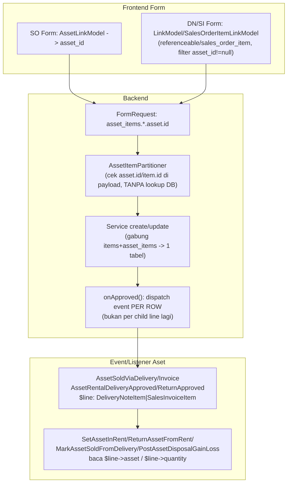

# Design Document: Asset Items Section (revisi — `asset_id` kolom langsung)

## Overview

Ganti mekanisme nested `asset_lines` (1 baris = banyak Asset via child table `SalesInvoiceItemAsset`/`DeliveryNoteItemAsset`) dengan **1 kolom `asset_id` langsung** di baris `sales_order_items`/`sales_invoice_items`/`delivery_note_items` (1 baris = 1 Asset, sejajar dengan `item_id`, mutually exclusive). Payload split `items[]`/`asset_items[]` — digabung ke tabel yang sama di service — TIDAK berubah dari implementasi pertama.

Field UI SO diganti `AssetLinkModel` langsung (pilih Asset, isi `asset_id`). Field UI DN/SI **TIDAK** diganti — tetap LinkModel/`SalesOrderItemLinkModel` yang pilih baris `referenceable`/`sales_order_item` (mekanisme sudah seragam Items/Asset Items sejak awal) — hanya filter & tampilan (`templateLink`) yang berubah, lewat token ternary baru di `convertTemplateLink()` (sudah dikerjakan & lulus test sebelum dokumen ini ditulis).

Konsekuensi yang TIDAK terlihat dari sisi UI tapi wajib dikerjakan: 4 event domain aset (`AssetRentalDeliveryApproved`, `AssetRentalReturnApproved`, `AssetSoldViaDelivery`, `AssetSoldViaInvoice`) dan listener-nya saat ini bertumpu pada child table `asset_lines` sebagai payload event — dengan child table dihapus, event ini harus retype ke parent row (`DeliveryNoteItem`/`SalesInvoiceItem`).

## Architecture



## Components and Interfaces

### 1. Migration baru — `add_asset_id_to_items_tables`

Tambah kolom, TIDAK drop kolom lama (append migration, bukan edit migration lama — proyek ini pakai append per konvensi migration Laravel).

```php
Schema::table('sales_order_items', function (Blueprint $table) {
    $table->foreignUlid('asset_id')->nullable()->after('item_id')
        ->references('id')->on('assets')->nullOnDelete();
});
Schema::table('sales_invoice_items', function (Blueprint $table) {
    $table->foreignUlid('asset_id')->nullable()->after('item_id')
        ->references('id')->on('assets')->nullOnDelete();
});
Schema::table('delivery_note_items', function (Blueprint $table) {
    $table->foreignUlid('asset_id')->nullable()->after('item_id')
        ->references('id')->on('assets')->nullOnDelete();
});
```

`item_id` di ketiga tabel saat ini **NOT NULL** (`foreignUlid('item_id')->references(...)->cascadeOnDelete()`, tanpa `->nullable()` — diverifikasi baca file migration langsung, bukan asumsi). Migration terpisah ubah jadi nullable via `$table->foreignUlid('item_id')->nullable()->change()` (Laravel butuh `doctrine/dbal` utk `->change()` — cek `composer.json` sudah terpasang sebelum implementasi; kalau belum, alternatif raw `DB::statement` per driver SQLite/MySQL).

### 2. Migration drop — `drop_asset_lines_tables`

```php
Schema::dropIfExists('sales_invoice_item_assets');
Schema::dropIfExists('delivery_note_item_assets');
```
Hapus juga: model `App\Models\Finances\SalesInvoiceItemAsset`, `App\Models\Inventory\DeliveryNoteItemAsset`; relasi `assetLines()` di `SalesInvoiceItem`/`DeliveryNoteItem`; factory-nya; event `AssetSoldViaInvoice`'s `use` import lama.

### 3. Model — relasi `asset()` baru

`SalesOrderItem`, `SalesInvoiceItem`, `DeliveryNoteItem`:
```php
public function asset(): BelongsTo {
    return $this->belongsTo(\App\Models\Asset\Asset::class);
}
```

`SalesOrderItem::templateLink()`:
```php
public static function templateLink() {
    return ':asset_id ? :asset | :item';
}
```
(`InternalOrderItem::templateLink()` TIDAK berubah — IO di luar scope, tidak pernah punya `asset_id`.)

### 4. Event retype (Requirement 2)

```php
// AssetRentalDeliveryApproved, AssetRentalReturnApproved, AssetSoldViaDelivery
public function __construct(
    public readonly \App\Models\Inventory\DeliveryNoteItem $line, // dulu DeliveryNoteItemAsset
) {}

// AssetSoldViaInvoice
public function __construct(
    public readonly \App\Models\Finances\SalesInvoiceItem $line, // dulu SalesInvoiceItemAsset
) {}
```

Listener (`SetAssetInRent`, `ReturnAssetFromRent`, `MarkAssetSoldFromDelivery`, `PostAssetDisposalGainLoss`) baca `$event->line->asset` / `->quantity` / `->id` — SAMA nama properti persis (baris sekarang punya kolom itu langsung), jadi body listener kemungkinan **tidak berubah**, cuma type-hint constructor event yang berubah. `PostAssetDisposalGainLoss` baris 109-110 nulis `referenceable_type/id` = `$event->line::class`/`->id` — otomatis ikut jadi `DeliveryNoteItem`/`SalesInvoiceItem` (bukan child table lagi); cek konsumen morph itu (Show page `AssetValueAdjustment`, kalau ada) tidak hardcode nama class lama.

### 5. Service — dispatch per row, bukan per child line

`DeliveryNoteService::handleAssetDeliveryItem()` — SEDERHANAKAN, hapus pengecekan Σ quantity (tidak relevan, 1 baris = 1 asset):
```php
private function handleAssetDeliveryItem(DeliveryNoteItem $item, DeliveryNote $deliveryNote, bool $returnAgainst): void {
    if (! $item->asset_id) return;

    $isRentSo = $item->referenceable instanceof SalesOrderItem
        ? (bool) ($item->referenceable->salesOrder?->is_rent ?? false)
        : false;

    if ($returnAgainst) {
        event(new AssetRentalReturnApproved($item));
    } elseif ($isRentSo) {
        event(new AssetRentalDeliveryApproved($item));
    } else {
        event(new AssetSoldViaDelivery($item));
    }
}
```

`SalesInvoiceService::onApproved()` baris ~328-332 — ganti loop `assetLines`:
```php
if ($item->asset_id) {
    event(new AssetSoldViaInvoice($item));
}
```

`syncAssetLines()` di kedua service — **DIHAPUS TOTAL** (dan pemanggilnya di `create()`/`update()`; `unset($item['asset_lines'])` dihapus, tidak ada lagi key itu di payload).

### 6. Partisi payload — `AssetItemPartitioner` disederhanakan

Ganti dari lookup `Item.is_fixed_asset` via `item.id` (ItemVariant) jadi cek langsung keberadaan `asset.id`/`item.id` di baris payload:
```php
$isAssetRow = filled(data_get($row, 'asset.id'));
```
Tidak ada lagi query DB saat partisi (`ItemVariant::whereIn(...)`), jadi hapus juga helper `fetchFixedAssetVariantIds`/`partitionRowsByVariantIds` sisi FE (`resources/js/lib/assetItems.js`) yang query `/model` buat resolve flag — diganti cek `row.asset?.id` langsung di FE juga.

### 7. FormRequest — validasi `asset_items.*.asset.id`

```php
'asset_items.*.asset.id' => ['required', 'exists:assets,id'],
```
Ganti dari `asset_items.*.item.id'`. Rule Σ-quantity/`asset_lines.*` **dihapus**.

### 8. Frontend — SO

Field "item" section Asset Items ganti `AssetLinkModel` (`resources/js/Pages/Asset/Assets/AssetLinkModel.jsx`, sudah ada — dipakai di kolom asset_lines lama), isi `asset_id`. Hapus kolom Source Warehouse dari kolom Asset Items (`buildItemColumns("asset")` di SO Form.jsx — filter kolom `source_warehouse` keluar untuk kind `asset`).

### 9. Frontend — DN & SI

`buildItemColumns(kind)` TETAP satu fungsi shared, field "item" TETAP `LinkModel`/`SalesOrderItemLinkModel` (TIDAK diganti komponen) — ubah:
- filter: `"item.item.is_fixed_asset": kind === "asset"` → `asset_id: kind === "asset" ? { "!=": null } : null`
- label kolom (`titleTrans`) untuk kind `"asset"`: "Asset" (bukan "Item")
- hapus kolom `asset_lines` (nested FormTable) total dari `kind === "asset"` branch
- DN: hapus kolom `source_warehouse` dari kind `"asset"`
- DN: section Asset Items hanya tampil/aktif bila `data.reference_to?.model === "App\\Models\\Sales\\SalesOrder"` (InternalOrder di luar scope, tidak pernah punya baris `asset_id`)

### 10. Unit dan Tax pada Asset Items

Asset Items tidak memakai Unit: hapus kolom Unit dan rule `asset_items.*.unit.*` pada SO/SI/DN. Pada persistensi service, jika `asset_id` terisi, paksa `item_unit_id = null` dan `conversion_factor = 1`; semua tabel sudah memiliki `item_unit_id` nullable sehingga tidak perlu migrasi baru.

Tax tetap wajib untuk SO/SI, sama dengan Items pada dokumen tersebut. Tandai kolom Tax `required: true` agar FormTable selalu menampilkannya dan tidak dapat disembunyikan dari pemilih kolom; FormRequest tetap memvalidasi Tax. Delivery Note mengikuti Items DN, yang tidak memiliki Tax.

### 11. Sales Order rental dengan Asset

`SalesOrderService::submit()` harus eager-load relasi `asset` pada baris dokumen. Bila SO rental memiliki baris `asset_id` dengan `Asset.is_rentable=true`, baris tersebut memenuhi syarat validitas rental. Validasi ItemVariant bertipe `vehicle` tetap dipertahankan untuk baris Items.

## Data Models

| Tabel | Kolom baru | Kolom diubah |
|---|---|---|
| `sales_order_items` | `asset_id` nullable FK `assets` | `item_id` → nullable |
| `sales_invoice_items` | `asset_id` nullable FK `assets` | `item_id` → nullable |
| `delivery_note_items` | `asset_id` nullable FK `assets` | `item_id` → nullable |

Dihapus: `sales_invoice_item_assets`, `delivery_note_item_assets`.

## Correctness Properties

**Property 1 — Mutual exclusivity**: _For any_ baris `items`/`asset_items` tersimpan, SHALL `item_id` XOR `asset_id` terisi (tidak keduanya, tidak tidak-satupun).
**Validates: Requirement 1, 4**

**Property 2 — Event fired sekali per baris beraset**: _For any_ DN/SI approve dengan N baris `asset_id` terisi, SHALL tepat N event (`AssetSoldViaDelivery`/`AssetRentalDeliveryApproved`/`AssetRentalReturnApproved`/`AssetSoldViaInvoice`) ter-dispatch, satu per baris — TIDAK lagi tergantung jumlah child `asset_lines` (sudah tidak ada).
**Validates: Requirement 2**

**Property 3 — templateLink ternary tidak mengubah token biasa**: _For any_ model lain (~78 model) yang `templateLink()`-nya TIDAK memakai `?`/`|`, `convertTemplateLink()` SHALL berperilaku identik dengan sebelum perubahan.
**Validates**: sudah diverifikasi via test `linkModelUtils.test.js` (regresi eksplisit).

## Error Handling

| Scenario | Behavior |
|---|---|
| Baris `items` kirim `asset.id` | 422, pesan arahkan ke `asset_items` |
| Baris `asset_items` kirim `item.id` (bukan `asset.id`) | 422 |
| DN Asset Items row referenceable tak ketemu match `asset_id` di SO (create-from-source gagal partial) | Baris tetap tersimpan dgn `referenceable` apa adanya (mekanisme lama, tidak berubah — user selalu pilih manual via LinkModel, bukan auto-match) |
| Migration `item_id` nullable butuh `doctrine/dbal` tak terpasang | Fallback raw `DB::statement` per driver, dicek di awal task migration |

## Testing Strategy

- **Unit**: `linkModelUtils.test.js` ternary (SUDAH lulus). `AssetItemPartitioner` baru (cek `asset.id`/`item.id`, tanpa query DB — assert query count).
- **Feature**: retype 4 test listener aset (`SetAssetInRentTest`, dst) ke event bertipe row baru. `SalesOrderRequestAssetItemsTest`/`SalesInvoiceServiceAssetItemsTest`/`DeliveryNoteServiceAssetItemsTest` — update assertion `asset_id` kolom, hapus assertion `asset_lines`.
- **Hapus**: `DeliveryNoteItemAssetTest`, `SalesInvoiceItemAssetTest`, `SalesInvoiceItemAssetLateFillTest`, `DeliveryNoteAssetLinesPersistenceTest`, `DeliveryNoteRequestAssetLinesTest` (test child table yang sudah di-drop).
- **Browser**: create SO dgn Asset Items (AssetLinkModel), create-from-source DN & SI, verifikasi templateLink tampil identitas Asset di dropdown, approve DN/SI verifikasi event lama tetap trigger (asset jadi status rented/sold).
