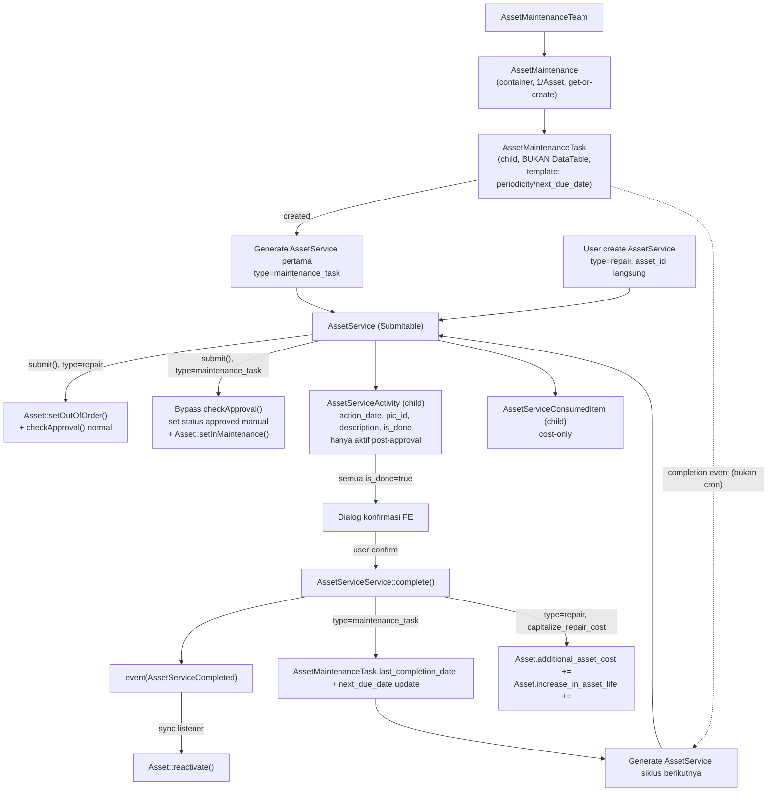

# Design Document: Asset Maintenance & Repair

## Overview

Spec 5 menambahkan domain perawatan (maintenance) dan perbaikan (repair) ke modul Asset Management. Ada dua jalur berbeda yang bermuara ke satu bentuk dokumen kerja yang sama:

- **Jalur maintenance** (terjadwal, berulang): `AssetMaintenanceTeam` (master data tim) → `AssetMaintenance` (container, 1 per Asset) → `AssetMaintenanceTask` (child non-Submitable, template jadwal — periodicity/next_due_date) → generate `AssetService` (`type=maintenance_task`) tiap siklus.
- **Jalur repair** (insidental, sekali jadi): `AssetService` (`type=repair`) dibuat langsung, `asset_id` tertaut langsung ke Asset, tanpa melalui AssetMaintenance/AssetMaintenanceTask sama sekali.

Kedua jalur bermuara di `AssetService` — dokumen Submitable tunggal yang memuat log kerja (`AssetServiceActivity`, dobel fungsi sebagai checklist) dan pencatatan biaya part (`AssetServiceConsumedItem`, cost-only tanpa potong stok).

Pattern utama yang direuse: `Submitable` trait + `SubmitableService` contract (pola SO/PO/AssetMovement), Event/Listener sinkron untuk efek samping status Asset (pola Spec 4 `UpdateAssetLocationFromMovement`), method status-transition dedicated di `Asset.php` (`setInMaintenance()`, `setOutOfOrder()`, `reactivate()` — SUDAH ADA dari Spec 1, tidak perlu dibuat ulang).

Yang TIDAK berubah: struktur `Asset.php` tidak disentuh (hanya dipanggil method existing-nya), tidak ada perubahan pada `FormStatus` enum (semua status yang dibutuhkan — `IN_MAINTENANCE`, `OUT_OF_ORDER`, `ACTIVE` — sudah ada), tidak ada integrasi Stock/SO/PO/DN (lihat Non-Goals di requirements.md).

## Architecture



### Data Flow — Maintenance
1. User buka halaman show `AssetMaintenance` (get-or-create otomatis saat pertama kali diakses/task pertama dibuat untuk Asset tsb).
2. User tambah `AssetMaintenanceTask` inline (nested form, bukan halaman terpisah) — isi periodicity, assign_to_id, dst.
3. `AssetMaintenanceTaskService::create()` (dipanggil dari `AssetMaintenanceService`, bukan controller/route sendiri) langsung generate `AssetService` pertama (`type=maintenance_task`, status draft) tertaut via `asset_maintenance_task_id`.
4. User submit `AssetService` → bypass approval → `Asset::setInMaintenance()`.
5. Post-approval, tab Activity Log terbuka. PIC isi baris `AssetServiceActivity`, centang `is_done` satu-satu.
6. Saat semua `is_done=true`, FE tampilkan dialog konfirmasi. User confirm → `AssetServiceService::complete()`.
7. `complete()`: dispatch `AssetServiceCompleted` (sync listener → `Asset::reactivate()`), update `AssetMaintenanceTask` (`last_completion_date`, `next_due_date` += periodicity), generate `AssetService` siklus berikutnya (auto-approve lagi, ulang dari langkah 4).

### Data Flow — Repair
1. User create `AssetService` (`type=repair`) langsung, isi `asset_id`, `failure_date`, `description`.
2. Submit → validasi Asset tidak dalam status terminal → `checkApproval()` normal (approval chain sungguhan) → setelah approved, `Asset::setOutOfOrder()`.
3. Post-approval, Activity Log + Consumed Items diisi sama seperti maintenance.
4. Semua checklist selesai → dialog konfirmasi → `complete()` → dispatch event → `Asset::reactivate()`. TIDAK generate AssetService baru (repair kejadian tunggal).
5. Jika `capitalize_repair_cost=true`: `complete()` juga update `Asset.additional_asset_cost` += `total_repair_cost`, `Asset.increase_in_asset_life` jika diisi.

## Components and Interfaces

### Models (`app/Models/Asset/Maintenance/`)

```php
// AssetMaintenanceTeam.php
class AssetMaintenanceTeam extends Model {
    use DataTable, HasUlids, SoftDeletes;
    protected static $service = AssetMaintenanceTeamService::class;
    protected $guarded = ['id'];
    public function members(): HasMany { return $this->hasMany(MaintenanceTeamMember::class); }
    public function manager(): BelongsTo { return $this->belongsTo(User::class, 'manager_id'); }
    public function branch(): BelongsTo { return $this->belongsTo(Branch::class); }
}

// MaintenanceTeamMember.php — child, no DataTable
class MaintenanceTeamMember extends Model {
    use HasUlids, SoftDeletes;
    public static $parentRelation = 'maintenanceTeam';
    protected $guarded = ['id'];
    public function maintenanceTeam(): BelongsTo { return $this->belongsTo(AssetMaintenanceTeam::class); }
    public function user(): BelongsTo { return $this->belongsTo(User::class); }
}

// AssetMaintenance.php — container, NOT Submitable
class AssetMaintenance extends Model {
    use DataTable, HasUlids, SoftDeletes;
    protected static $service = AssetMaintenanceService::class;
    protected $guarded = ['id'];
    public function asset(): BelongsTo { return $this->belongsTo(Asset::class); }
    public function maintenanceTeam(): BelongsTo { return $this->belongsTo(AssetMaintenanceTeam::class); }
    public function tasks(): HasMany { return $this->hasMany(AssetMaintenanceTask::class); }
}

// AssetMaintenanceTask.php — child, NOT DataTable, NOT Submitable
class AssetMaintenanceTask extends Model {
    use HasUlids, SoftDeletes;
    public static $parentRelation = 'assetMaintenance';
    protected $guarded = ['id'];
    protected $casts = ['next_due_date' => 'date', 'last_completion_date' => 'date', 'certificate_required' => 'boolean'];
    public function assetMaintenance(): BelongsTo { return $this->belongsTo(AssetMaintenance::class); }
    public function assignTo(): BelongsTo { return $this->belongsTo(User::class, 'assign_to_id'); }
    public function services(): HasMany { return $this->hasMany(AssetService::class, 'asset_maintenance_task_id'); }
}
```

```php
// app/Models/Asset/AssetService.php — Submitable, flat (bukan nested Maintenance/)
class AssetService extends Model {
    use DataTable, HasFactory, HasUlids, SoftDeletes, Submitable;

    protected static $service = AssetServiceService::class;
    public string $formComponent = 'Asset/Services/Form';
    public string $translateKey  = 'asset.service';
    protected $guarded = ['id'];
    protected $casts = [
        'type' => AssetServiceType::class,
        'failure_date' => 'datetime',
        'completion_date' => 'datetime',
        'capitalize_repair_cost' => 'boolean',
    ];

    public function asset(): BelongsTo { return $this->belongsTo(Asset::class); }
    public function assetMaintenanceTask(): BelongsTo { return $this->belongsTo(AssetMaintenanceTask::class); }
    public function activities(): HasMany { return $this->hasMany(AssetServiceActivity::class); }
    public function consumedItems(): HasMany { return $this->hasMany(AssetServiceConsumedItem::class); }

    public function isFullyChecked(): bool {
        return $this->activities()->count() > 0
            && $this->activities()->where('is_done', false)->doesntExist();
    }
}
```

`asset_id` untuk `type=maintenance_task` diturunkan via accessor, bukan kolom yang diisi manual saat create — dihitung dari `assetMaintenanceTask.assetMaintenance.asset_id`. Untuk `type=repair`, `asset_id` adalah kolom asli terisi langsung.

```php
// AssetServiceActivity.php — child, no DataTable
class AssetServiceActivity extends Model {
    use HasUlids, SoftDeletes;
    public static $parentRelation = 'assetService';
    protected $guarded = ['id'];
    protected $casts = ['action_date' => 'datetime', 'is_done' => 'boolean'];
    public function assetService(): BelongsTo { return $this->belongsTo(AssetService::class); }
    public function pic(): BelongsTo { return $this->belongsTo(User::class, 'pic_id'); }
}

// AssetServiceConsumedItem.php — child, no DataTable
class AssetServiceConsumedItem extends Model {
    use HasUlids, SoftDeletes;
    public static $parentRelation = 'assetService';
    protected $guarded = ['id'];
    protected $casts = ['quantity' => 'float', 'valuation_rate' => 'float', 'total_value' => 'float'];
    public function assetService(): BelongsTo { return $this->belongsTo(AssetService::class); }
    public function item(): BelongsTo { return $this->belongsTo(Item::class); }
}
```

### Services

**`AssetMaintenanceTeamService`** — CRUD sederhana, tidak Submitable.

**`AssetMaintenanceService`** (implements `CrudService`, bukan `SubmitableService`):
- `create(array $data)`: get-or-create `AssetMaintenance` by `asset_id` (Requirement 2.4).
- Nested task management: `createTask(AssetMaintenance $am, array $data)` — buat `AssetMaintenanceTask`, langsung panggil `AssetServiceService::generateForTask($task)` untuk buat `AssetService` pertama.

**`AssetServiceService`** (implements `SubmitableService`):
```php
class AssetServiceService implements SubmitableService {
    public function submit(Model $assetService): mixed {
        if ($assetService->type === AssetServiceType::REPAIR) {
            $this->validateAssetNotTerminal($assetService->asset);
            $assetService->checkApproval(); // approval chain normal
            return $assetService;
        }

        // maintenance_task: bypass checkApproval() sepenuhnya
        return DB::transaction(function () use ($assetService) {
            $assetService->update(['status' => FormStatus::APPROVED]); // atau status setara "disetujui"
            $this->onApproved($assetService);
            return $assetService;
        });
    }

    public function onApproved(Model $assetService): mixed {
        $asset = $assetService->type === AssetServiceType::REPAIR
            ? $assetService->asset
            : $assetService->assetMaintenanceTask->assetMaintenance->asset;

        if ($assetService->type === AssetServiceType::REPAIR) {
            $asset->setOutOfOrder();
        } else {
            $asset->setInMaintenance();
        }
        return $assetService;
    }

    public function complete(AssetService $assetService): AssetService {
        if (! $assetService->isFullyChecked()) {
            throw new LogicException(__('asset/service.checklist_not_complete'));
        }

        return DB::transaction(function () use ($assetService) {
            $assetService->update(['completion_date' => now()]);

            if ($assetService->type === AssetServiceType::REPAIR && $assetService->capitalize_repair_cost) {
                $asset = $assetService->asset;
                $asset->additional_asset_cost += $assetService->total_repair_cost;
                if ($assetService->increase_in_asset_life) {
                    $asset->increase_in_asset_life += $assetService->increase_in_asset_life;
                }
                $asset->save();
            }

            event(new AssetServiceCompleted($assetService));

            if ($assetService->type === AssetServiceType::MAINTENANCE_TASK) {
                $this->regenerateNextTask($assetService->assetMaintenanceTask);
            }

            return $assetService;
        });
    }

    private function regenerateNextTask(AssetMaintenanceTask $task): void {
        $task->update([
            'last_completion_date' => now(),
            'next_due_date' => now()->addDays($task->periodicityInDays()),
        ]);
        $this->generateForTask($task);
    }

    public function generateForTask(AssetMaintenanceTask $task): AssetService {
        $newService = AssetService::create([
            'type' => AssetServiceType::MAINTENANCE_TASK,
            'asset_maintenance_task_id' => $task->id,
        ]);
        $newService->submit(); // langsung lewat submit() -> bypass approval
        return $newService;
    }
}
```

### Events/Listeners (sync, konsisten Spec 4)

```php
// app/Events/Asset/AssetServiceCompleted.php
class AssetServiceCompleted {
    use Dispatchable;
    public function __construct(public readonly AssetService $assetService) {}
}

// app/Listeners/Asset/Maintenance/ReactivateAssetFromService.php
class ReactivateAssetFromService {
    public function handle(AssetServiceCompleted $event): void {
        $asset = $event->assetService->type === AssetServiceType::REPAIR
            ? $event->assetService->asset
            : $event->assetService->assetMaintenanceTask->assetMaintenance->asset;
        $asset->reactivate();
    }
}
```

Didaftarkan sync (bukan `ShouldQueue`) di `EventServiceProvider` — alasan sama seperti Spec 4: cuma panggil method status-transition yang sudah ada di `Asset.php`, tidak ada GL/retry-worthy work.

### Enum baru

```php
// app/Enums/AssetServiceType.php
enum AssetServiceType: string {
    case MAINTENANCE_TASK = 'maintenance_task';
    case REPAIR = 'repair';

    public function label() {
        return __("asset/service.type.{$this->value}");
    }
}
```

## Data Models

**`asset_maintenance_teams`**: `id`, `team_name` (unique), `manager_id` (FK users, nullable), `branch_id` (FK branches), timestamps, soft delete.

**`maintenance_team_members`**: `id`, `maintenance_team_id` (FK, cascade), `user_id` (FK users), timestamps, soft delete.

**`asset_maintenances`**: `id`, `asset_id` (FK assets, **unique**), `maintenance_team_id` (FK, nullable), timestamps, soft delete.

**`asset_maintenance_tasks`**: `id`, `asset_maintenance_id` (FK, cascade), `task_name`, `maintenance_type`, `periodicity` (int, hari — atau enum periodicity seperti draft awal memory, TBD saat implementasi), `next_due_date` (date), `last_completion_date` (date, nullable), `assign_to_id` (FK users, nullable), `certificate_required` (bool, default false), `description` (text, nullable), timestamps, soft delete.

**`asset_services`**: `id`, `type` (string enum), `asset_id` (FK assets, nullable — hanya diisi utk type=repair), `asset_maintenance_task_id` (FK, nullable, hanya utk type=maintenance_task), `failure_date` (datetime, nullable), `completion_date` (datetime, nullable), `capitalize_repair_cost` (bool, default false), `description` (text, nullable), full Submitable field set (`code`, `status` json, `submitted_at`, `canceled_at`, `amended_from_id`, `revision_number`, `created_by_id`, `additional_data`, `is_example`, `branch_id`), timestamps, soft delete.

**`asset_service_activities`**: `id`, `asset_service_id` (FK, cascade), `action_date` (datetime), `pic_id` (FK users, nullable), `description` (text), `is_done` (bool, default false), timestamps, soft delete.

**`asset_service_consumed_items`**: `id`, `asset_service_id` (FK, cascade), `item_id` (FK items), `quantity` (decimal), `valuation_rate` (decimal), `total_value` (decimal, computed di app-layer saat save — bukan generated column DB, konsisten pola `total_asset_cost` di `Asset.php`), timestamps, soft delete.

Constraint penting: `asset_services.asset_id` XOR `asset_service_activities.asset_maintenance_task_id` — divalidasi di FormRequest/Service layer (bukan DB CHECK constraint, konsisten pola codebase yang tidak pakai CHECK constraint eksplisit di migration lain).

## Correctness Properties

1. **Uniqueness container**: Untuk setiap Asset, paling banyak ada 1 `AssetMaintenance` — dijamin unique index di `asset_maintenances.asset_id`.
2. **Mutual exclusivity type field**: Untuk setiap `AssetService`, tepat satu dari (`asset_id` terisi DAN `asset_maintenance_task_id` null) atau (`asset_id` null DAN `asset_maintenance_task_id` terisi) — sesuai `type`.
3. **Checklist-gated completion**: `AssetServiceService::complete()` SELALU menolak (LogicException) jika ada minimal satu `AssetServiceActivity.is_done = false` — tidak ada jalur bypass.
4. **No orphan regeneration**: Regenerasi `AssetService` siklus berikutnya HANYA terjadi jika `type=maintenance_task` — repair TIDAK PERNAH memicu `generateForTask()`.
5. **Reactivate idempotent terhadap status**: `Asset::reactivate()` (method existing) sudah menjamin exception jika Asset tidak dalam status `IN_MAINTENANCE`/`OUT_OF_ORDER`/`ISSUED` — listener tidak perlu guard tambahan.

## Error Handling

| Scenario | Behavior |
|----------|----------|
| Create AssetMaintenanceTask tanpa AssetMaintenance existing utk Asset tsb | Auto get-or-create AssetMaintenance (bukan error) |
| `complete()` dipanggil saat masih ada `is_done=false` | `LogicException`, pesan `asset/service.checklist_not_complete` |
| `submit()` type=repair, Asset dalam status terminal (scrapped/sold/dst) | `LogicException`, pesan `asset/service.asset_status_terminal` (reuse pola pesan Spec 5's Requirement 4.4) |
| Activity Log diakses sebelum AssetService approved | 403/validasi FE — tab disabled, BE juga reject create AssetServiceActivity kalau status belum sesuai (defense in depth) |
| AssetMaintenanceTask diakses lewat route langsung (bukan nested) | Tidak ada route terdaftar — 404 by design (tidak pakai `resourceDetail`) |
| `generateForTask()` gagal di tengah (mis. validasi AssetService gagal) | Seluruh `complete()` dalam 1 `DB::transaction()` — rollback total, AssetMaintenanceTask TIDAK ter-update sebagian |

## Testing Strategy

- **Unit tests**: relasi tiap model (AssetMaintenanceTeam↔Member, AssetMaintenance↔Task, AssetService↔Activity/ConsumedItem, `asset()` accessor untuk type=maintenance_task via assetMaintenanceTask chain), `isFullyChecked()` helper.
- **Feature tests**: `AssetServiceService::submit()` tiap cabang (repair validasi status terminal, repair approval normal, maintenance_task bypass), `complete()` (checklist gate, capitalize_repair_cost effect, event dispatch, regenerasi next task), `AssetMaintenanceService` get-or-create.
- **Listener tests**: `ReactivateAssetFromService` untuk kedua type, mirroring `UpdateAssetLocationFromMovementTest`.
- **Integration tests**: alur end-to-end maintenance (create task → service pertama → complete → next service auto-generated → task next_due_date terupdate) dan repair (create → submit → approve → complete → capitalize).
