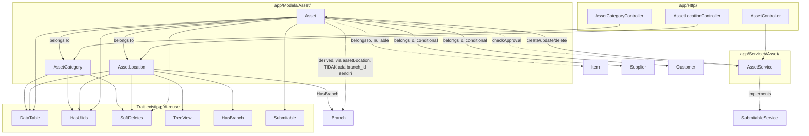

# Design Document: Asset Management Core (Fase 1)

## Overview

Fase ini membangun domain `Asset` baru berisi tiga model: `AssetCategory` (kategori, flat), `AssetLocation` (lokasi, hierarki pohon via `TreeView`), dan `Asset` (entitas inti). Pola arsitektur yang dipakai murni **mengikuti konvensi yang sudah ada** di codebase ini — tidak ada abstraksi baru yang diperkenalkan:

- `AssetCategory`/`AssetLocation` mengikuti pola `Category`/`Warehouse` (Inventory): trait `DataTable, HasUlids, SoftDeletes`, Controller tipis yang delegasikan CRUD ke model, `FormRequest` untuk validasi.
- `AssetLocation` menambahkan trait `TreeView` (nested set, pola identik `Account`) dan `HasBranch` (pola identik `Warehouse`).
- `Asset` menggunakan trait `Submitable` penuh (pola identik `SalesOrder`/`PurchaseOrder`), sehingga membutuhkan `AssetService implements SubmitableService` untuk menjalankan `create/update/delete/submit/cancel/amend/onApproved/onRejected`.
- Status operasional Asset (Scrap/Sell/Maintenance/OutOfOrder) adalah method dedicated DI LUAR siklus `Submitable` — karena `Submitable` hanya memodelkan siklus dokumen generik (draft/submit/cancel), bukan status bisnis domain-spesifik.

**Yang TIDAK berubah / TIDAK dibangun pada fase ini**: tidak ada kalkulasi depresiasi, tidak ada posting jurnal (GL), tidak ada integrasi Purchase/Inventory (`item_id` tetap nullable tanpa auto-fill), tidak ada Asset Movement/Maintenance/Repair, tidak ada perubahan pada `SalesOrder`/`Item` existing. Field-field yang mengantisipasi fase depan (`item_id`, kolom depresiasi, `journal_entry_for_scrap_id`) disiapkan di skema tapi tanpa logic aktif.

## Architecture



**Data Flow — pembuatan Asset baru sampai aktif:**

1. User mengisi form `Asset` (kategori, lokasi, ownership, nilai perolehan) → `AssetController::store()` → `AssetRequest` validasi → `AssetService::create()`.
2. `AssetService::create()` menetapkan default dari `AssetCategory` (`is_depreciable` dari `non_depreciable_category`, field depresiasi default) sebelum `Asset::create()`.
3. `Asset` disimpan berstatus `Draft` (bawaan `Submitable::bootSubmitable()`).
4. User menekan "Submit" → `AssetController::submit()` → `Asset::checkApproval()` (bawaan `Submitable`) → `ApprovalService::check()` dengan `AssetService` sebagai `$service`.
5. Approval selesai → `AssetService::onApproved()` dipanggil oleh `ApprovalService` → status `Asset` berubah menjadi `Submitted`/`Active` sesuai `available_for_use_date`.
6. Setelah aktif, aksi bisnis (`scrap()`, `sell()`, dst.) dipanggil langsung dari `AssetController` action route terpisah, TIDAK melalui `checkApproval()`.

## Components and Interfaces

### `App\Models\Asset\AssetCategory`

```php
namespace App\Models\Asset;

class AssetCategory extends Model {
    use DataTable, HasUlids, SoftDeletes;

    protected $guarded = ['id'];
    protected $casts = [
        'non_depreciable_category' => 'boolean',
        'enable_cwip_accounting'   => 'boolean',
        'is_rentable'              => 'boolean',
    ];

    public string $formComponent = 'Asset/Categories/Form';
    public string $translateKey  = 'asset.category';

    public function accounts(): HasMany {
        return $this->hasMany(AssetCategoryAccount::class);
    }
}
```

`AssetCategoryAccount` adalah model child table baru (bukan Eloquent morph, FK biasa `asset_category_id`), field: `branch_id`, `fixed_asset_account_id`, `accumulated_depreciation_account_id`, `depreciation_expense_account_id`, `capital_work_in_progress_account_id` — semua `belongsTo(Account::class)`.

### `App\Models\Asset\AssetLocation`

```php
namespace App\Models\Asset;

class AssetLocation extends Model {
    use DataTable, HasUlids, SoftDeletes, TreeView, HasBranch;

    protected $guarded = ['id'];
    protected $casts = ['is_group' => 'boolean'];

    public static function templateLink() {
        return ':location_name';
    }

    public function parent(): BelongsTo {
        return $this->belongsTo(self::class, 'parent_id');
    }
}
```

Guard hapus (Requirement 2.5) diimplementasikan di `AssetLocationController::destroy()` (atau override `deleting` event di model) — cek `Asset::whereIn('asset_location_id', $descendantIds)->exists()` sebelum delegasi ke `TreeView::bootTreeView()`'s deleting hook, karena `TreeView` sendiri tidak tahu soal `Asset` yang mereferensikannya.

### `App\Models\Asset\Asset`

```php
namespace App\Models\Asset;

class Asset extends Model {
    use DataTable, HasUlids, SoftDeletes, Submitable;

    protected static $service = AssetService::class;
    protected $guarded = ['id'];
    protected $casts = [
        'asset_type'         => AssetType::class,      // enum baru
        'ownership_type'     => AssetOwnershipType::class, // enum baru
        'calculate_depreciation' => 'boolean',
        'is_depreciable'     => 'boolean',
        'maintenance_required' => 'boolean',
        'insurance_comprehensive' => 'boolean',
        'purchase_date'      => 'date',
        'available_for_use_date' => 'date',
        'disposal_date'      => 'date',
        // ...decimal casts utk gross_purchase_amount, dst.
    ];

    public function assetCategory(): BelongsTo {
        return $this->belongsTo(AssetCategory::class);
    }

    public function assetLocation(): BelongsTo {
        return $this->belongsTo(AssetLocation::class);
    }

    // Asset TIDAK punya branch_id sendiri — cabang diturunkan dari AssetLocation
    // (lihat catatan cabang di Data Models). Accessor ini murni kenyamanan akses.
    public function branch(): ?Branch {
        return $this->assetLocation?->branch;
    }

    public function item(): BelongsTo {
        return $this->belongsTo(\App\Models\Inventory\Item::class);
    }

    public function ownershipSupplier(): BelongsTo {
        return $this->belongsTo(\App\Models\Purchase\Supplier::class, 'ownership_supplier_id');
    }

    public function ownershipCustomer(): BelongsTo {
        return $this->belongsTo(\App\Models\Sales\Customer::class, 'ownership_customer_id');
    }

    public function ownershipEntity(): ?BelongsTo {
        return match ($this->ownership_type) {
            AssetOwnershipType::SUPPLIER => $this->ownershipSupplier(),
            AssetOwnershipType::CUSTOMER => $this->ownershipCustomer(),
            default => null,
        };
    }

    // --- Status operasional, di luar Submitable ---
    public function scrap(): void {
        $this->assertStatusTransition(allowedFrom: [FormStatus::ACTIVE], to: FormStatus::SCRAPPED);
        $this->status = [...array_diff($this->status, [FormStatus::ACTIVE]), FormStatus::SCRAPPED];
        $this->disposal_date = now();
        $this->save();
    }

    public function sell(): void { /* placeholder Fase 4, lempar LogicException "belum diimplementasikan" */ }
    public function setInMaintenance(): void { /* ... */ }
    public function setOutOfOrder(): void { /* ... */ }
    public function reactivate(): void { /* ... */ }

    protected function assertStatusTransition(array $allowedFrom, FormStatus $to): void {
        $current = $this->status;
        if (empty(array_intersect($allowedFrom, $current))) {
            throw new \LogicException(
                "Asset tidak dapat bertransisi ke {$to->value} dari status saat ini."
            );
        }
    }
}
```

### `App\Services\Asset\AssetService implements SubmitableService`

Mengikuti pola `StockEntryService`/`SalesOrderService` — implementasi 8 method kontrak (`create`, `update`, `delete` dari `CrudService`; `submit`, `cancel`, `amend`, `onApproved`, `onRejected` dari `SubmitableService`).

```php
namespace App\Services\Asset;

class AssetService implements SubmitableService {
    // [DIREVISI setelah implementasi] create()/update() dibungkus try/catch+rollback
    // (bug produksi ditemukan+diperbaiki: transaksi manual tanpa rollback bisa
    // menggantung). create() juga menghasilkan kode DRAFT via
    // FormatingSeries::generate(Asset::class, $data, true) — kode final baru
    // di-generate ulang saat submit() (isDraft=false).
    public function create(array $data): Model {
        DB::beginTransaction();
        try {
            $asset = Asset::create([
                'code' => FormatingSeries::generate(Asset::class, $data, true),
                ...Arr::only($data, [/* field inti */]),
            ]);
            DB::commit();
        } catch (\Throwable $e) {
            DB::rollBack();
            throw $e;
        }
        return $asset;
    }

    public function update(Model $model, array $data): Model { /* fill + save (dibungkus try/catch+rollback), guard field read-only pasca-submit */ }
    public function delete(Model $model): void { $model->delete(); }

    public function submit(Model $model): mixed {
        return $model->checkApproval();
    }

    public function cancel(Model $model): mixed {
        // [REVISI] Asset TIDAK mendukung cancel — konsisten siklus hidup Asset di
        // ERPNext (aset fisik tidak dibatalkan seperti dokumen transaksional biasa).
        // Guard tambahan: Asset::canCancel()/canDelete() override false di level model,
        // dicek Controller::cancel() generik SEBELUM method ini sempat dipanggil.
        throw new \LogicException(__('asset.cannot_cancel'));
    }
    public function amend(Model $model): mixed { return $model->amend(); }

    public function onApproved(Model $model): mixed {
        // set status Submitted -> Active jika available_for_use_date <= now()
    }

    public function onRejected(Model $model): mixed {
        // kembalikan ke Draft
    }
}
```

### Enum baru

- `App\Enums\AssetType`: `EXISTING_ASSET = 'existing_asset'`, `COMPOSITE_ASSET = 'composite_asset'`, `COMPOSITE_COMPONENT = 'composite_component'`.
- `App\Enums\AssetOwnershipType`: `COMPANY = 'company'`, `SUPPLIER = 'supplier'`, `CUSTOMER = 'customer'`.
- `App\Enums\FormStatus` (existing, DITAMBAH case baru): `SCRAPPED`, `SOLD`, `OUT_OF_ORDER`, `IN_MAINTENANCE`, `ISSUED`, `PARTIALLY_DEPRECIATED`, `FULLY_DEPRECIATED`, `CAPITALIZED`, `WORK_IN_PROGRESS`.

### Controller & Routing

`AssetController`, `AssetCategoryController`, `AssetLocationController` di `app/Http/Controllers/Asset/`, mengikuti pola `CategoryController` (constructor `parent::__construct($request, Asset::class)`, `index/create/store/show/update`). `AssetController` menambah dua route action khusus: `POST /assets/{asset}/submit` dan `POST /assets/{asset}/{action}` (dispatch ke `scrap|setInMaintenance|setOutOfOrder|reactivate` berdasar parameter, `sell` mengembalikan 501 pada fase ini).

## Data Models

### Tabel `asset_categories`

| Kolom | Tipe | Constraint |
|---|---|---|
| id | ulid | PK |
| category_name | string | unique, not null |
| non_depreciable_category | boolean | default false |
| enable_cwip_accounting | boolean | default false |
| is_rentable | boolean | default false |
| default_depreciation_method | string, nullable | |
| default_frequency_of_depreciation | integer, nullable | |
| default_total_number_of_depreciations | integer, nullable | |
| created_at, updated_at, deleted_at | timestamp | |

### Tabel `asset_category_accounts` (child, bukan polymorphic)

| Kolom | Tipe | Constraint |
|---|---|---|
| id | ulid | PK |
| asset_category_id | ulid | FK → asset_categories, cascade on delete |
| branch_id | ulid | FK → branches |
| fixed_asset_account_id | ulid, nullable | FK → accounts |
| accumulated_depreciation_account_id | ulid, nullable | FK → accounts |
| depreciation_expense_account_id | ulid, nullable | FK → accounts |
| capital_work_in_progress_account_id | ulid, nullable | FK → accounts |

### Tabel `asset_locations`

| Kolom | Tipe | Constraint |
|---|---|---|
| id | ulid | PK |
| location_name | string | unique, not null |
| parent_id | ulid, nullable | FK self |
| is_group | boolean | default false |
| branch_id | ulid | FK → branches (via HasBranch) |
| lft, rgt, depth | integer | dikelola TreeView |
| created_at, updated_at, deleted_at | timestamp | |

### Tabel `assets`

| Kolom | Tipe | Constraint |
|---|---|---|
| id | ulid | PK |
| asset_name | string | not null |
| code | string | unique (via FormatingSeries) |
| asset_category_id | ulid | FK, not null, restrict on delete |
| asset_location_id | ulid | FK, not null, restrict on delete |
| asset_type | string (enum) | default `existing_asset` |
| item_id | ulid, nullable | FK → items |
| asset_quantity | integer | default 1 |
| ownership_type | string (enum) | default `company` |
| ownership_company_id | ulid, nullable | |
| ownership_supplier_id | ulid, nullable | FK → suppliers |
| ownership_customer_id | ulid, nullable | FK → customers |
| custodian_id | ulid, nullable | FK → users |
| purchase_date, available_for_use_date, disposal_date | date, nullable | |
| purchase_receipt_id, purchase_invoice_id | ulid, nullable | |
| net_purchase_amount, gross_purchase_amount, additional_asset_cost | decimal(15,2) | default 0 |
| total_asset_cost | decimal(15,2) | computed via accessor, TIDAK disimpan sbg kolom fisik |
| calculate_depreciation, is_depreciable | boolean | default false |
| opening_accumulated_depreciation | decimal(15,2) | default 0 |
| opening_number_of_booked_depreciations | integer | default 0 |
| depreciation_method | string, nullable | |
| frequency_of_depreciation, total_number_of_depreciations, total_number_of_booked_depreciations | integer, nullable | |
| next_depreciation_date | date, nullable | |
| expected_value_after_useful_life, salvage_value_percentage, rate_of_depreciation | decimal, nullable | |
| daily_prorata_based | boolean | default false |
| increase_in_asset_life | integer, nullable | |
| insurance_policy_number, insurance_insurer | string, nullable | |
| insurance_insured_value | decimal, nullable | |
| insurance_start_date, insurance_end_date | date, nullable | |
| insurance_comprehensive | boolean, nullable | |
| status | json (array FormStatus, via FormStatusesCast) | |
| maintenance_required | boolean | default false |
| journal_entry_for_scrap_id | ulid, nullable | |
| submitted_at, canceled_at | timestamp, nullable | (Submitable) |
| amended_from_id | ulid, nullable | (Submitable) |
| revision_number | integer | default 0 (Submitable) |
| created_by_id | ulid, nullable | (Submitable) |
| additional_data | json, nullable | (Submitable) |
| created_at, updated_at, deleted_at | timestamp | |

**Catatan `total_asset_cost`**: dideklarasikan sebagai accessor Eloquent (`Attribute::get()`), BUKAN kolom fisik — karena murni hasil penjumlahan dua kolom lain, menyimpannya sebagai kolom fisik berisiko out-of-sync.

**Catatan cabang (Branch) — `Asset` TIDAK memiliki `branch_id` sendiri.** Cabang tempat sebuah Asset berada DITURUNKAN dari `AssetLocation.branch_id` (via relasi `assetLocation`), bukan disimpan duplikat di tabel `assets`. Ini mengikuti pola `Item` (master data lintas cabang, cabang ditentukan lewat `Stock`/`Warehouse`) — BUKAN pola `Warehouse` yang memang punya `branch_id` sendiri karena representasi tempat fisik. `AssetLocation` yang berperan sebagai representasi tempat fisik di sini, sehingga `branch_id` semestinya cuma ada di `asset_locations`, bukan digandakan ke `assets`. Menyimpan `branch_id` di kedua tabel berisiko out-of-sync: jika Asset dipindah ke `AssetLocation` cabang lain (via `AssetMovement`, Fase 4), kolom `Asset.branch_id` bisa lupa ikut diperbarui sementara `AssetLocation.branch_id` sudah benar, menghasilkan dua sumber kebenaran yang berkontradiksi.

## Correctness Properties

**Property 1 — Ownership exclusivity.** _For any_ `Asset` yang disimpan, tepat satu dari `ownership_company_id`/`ownership_supplier_id`/`ownership_customer_id` yang bernilai non-null, ditentukan oleh `ownership_type`, dan dua lainnya SELALU null. _Validates: Requirement 4.3–4.5._

**Property 2 — Rentable quantity invariant.** _For any_ `Asset` dengan `assetCategory.is_rentable === true`, `asset_quantity` SELALU sama dengan `1` setelah disimpan. _Validates: Requirement 3.5._

**Property 3 — Depreciability monotonic default.** _For any_ `Asset` dengan `ownership_type !== 'company'`, `is_depreciable` SELALU `false` KECUALI method `update()` dipanggil dengan flag override eksplisit dari pengguna. _Validates: Requirement 4.7._

**Property 4 — Status transition legality.** _For any_ pemanggilan method transisi status (`scrap`, `sell`, `setInMaintenance`, `setOutOfOrder`, `reactivate`), transisi HANYA berhasil jika status Asset saat ini termasuk dalam himpunan status asal yang diizinkan untuk method tersebut; jika tidak, method SELALU melempar exception dan TIDAK mengubah state. _Validates: Requirement 9.2._

**Property 5 — Tree deletion guard.** _For any_ `AssetLocation` yang dihapus, penghapusan HANYA berhasil jika tidak ada `Asset` (berstatus apapun selain soft-deleted) yang mereferensikan lokasi tersebut atau node manapun dalam subtree-nya. _Validates: Requirement 2.5._

## Error Handling

| Scenario | Behavior |
|---|---|
| `ownership_type` diisi tapi FK ownership yang sesuai kosong (mis. `supplier` tapi `ownership_supplier_id` null) | `AssetRequest` menolak dengan pesan validasi spesifik field, HTTP 422 |
| `asset_quantity > 1` pada kategori `is_rentable = true` | `AssetRequest` menolak dengan pesan validasi, HTTP 422 (early, sebelum sampai model) |
| Method transisi status dipanggil pada status asal tidak valid | `\LogicException` dilempar dari model, ditangkap Controller → redirect back dengan flash error |
| `AssetCategory`/`AssetLocation` dihapus padahal masih direferensikan | `\Illuminate\Database\QueryException` (FK constraint) ATAU guard eksplisit di Controller yang melempar pesan lebih jelas sebelum delete dieksekusi (didahulukan, supaya pesan error informatif bukan raw SQL error) |
| `Asset::checkApproval()` dipanggil tapi `AssetService` belum terdaftar sebagai `$service` | `\LogicException` bawaan `Submitable::checkApproval()` (sudah ada di trait, tidak perlu ditangani ulang) |
| `sell()` dipanggil pada fase ini | Melempar `\LogicException` eksplisit "Sell Asset belum tersedia, akan diimplementasikan pada Fase 4" |
| `PUT /assets/{asset}/cancel` diakses (Asset tidak mendukung cancel) | Guard `Controller::cancel()` generik (`abort_unless($data->canCancel ?? false, 422)`) menolak lebih dulu dengan HTTP 422 sebelum sempat memanggil `AssetService::cancel()` — yang juga melempar `\LogicException` sebagai lapisan pertahanan kedua kalau guard di-bypass |
| `Asset::delete()` dipanggil langsung (bukan lewat cancel) | `Asset::canDelete()` override `false` — guard serupa `canCancel()`, mencegah penghapusan Asset di luar siklus status resmi (scrap/sell) |

## Testing Strategy

- **Unit Tests**: `AssetTest` — factory `Asset`, `AssetCategory`, `AssetLocation`; assert relasi (`assetCategory`, `assetLocation`, `ownershipEntity`), assert cast enum, assert `total_asset_cost` accessor.
- **Property-Based Tests** (via test data-provider, bukan library PBT eksternal — konsisten pola test existing codebase):
  - Test matrix `ownership_type` × required-field (Property 1): 3 kasus valid + kombinasi invalid.
  - Test matrix status-transition legal/ilegal (Property 4): tabel `[status asal, method, expected: berhasil/exception]` mencakup seluruh method transisi.
  - Test `is_rentable=true` dengan `asset_quantity` 1 vs >1 (Property 2).
- **Integration Tests**:
  - `AssetControllerTest`: CRUD penuh via HTTP, termasuk validasi `AssetRequest`.
  - `AssetSubmitApprovalTest`: submit Asset → verifikasi `ApprovalInstance` dibuat → simulasi approve → verifikasi status berubah via `AssetService::onApproved()`.
  - `AssetLocationTreeTest`: reuse pola assertion dari test `TreeView`/`Account` existing — create nested location, assert `lft/rgt`, assert guard hapus saat masih direferensikan `Asset`.
  - `AssetCategoryDeletionGuardTest`: assert restrict saat masih dipakai Asset.
