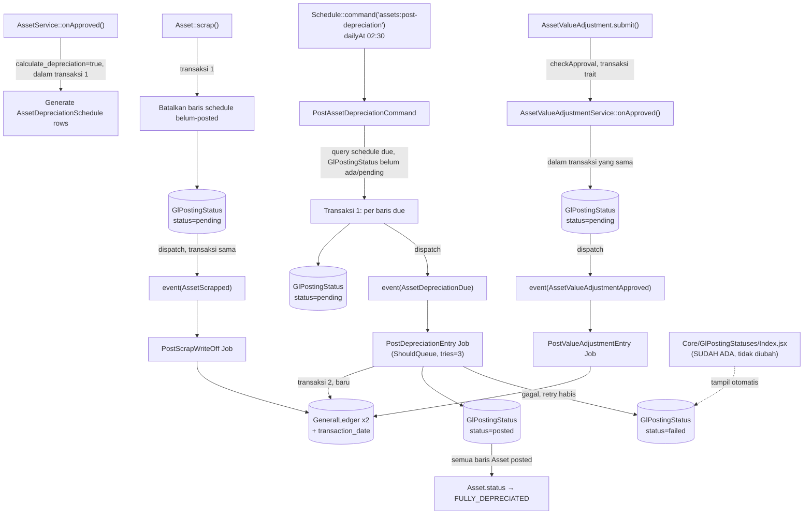

# Design Document: Asset Management — Depreciation

## Overview

Spec ini menambahkan mekanisme kalkulasi dan posting depresiasi otomatis ke modul Asset yang sudah ada (Spec 1: Core, Spec 2: Purchase Integration). Pola utama yang dipakai:

- **Schedule-then-post**: `AssetDepreciationSchedule` (baris pre-computed per periode) digenerate sekali saat Asset disetujui (`AssetService::onApproved()`), lalu diposting satu-satu ke `GeneralLedger` oleh Artisan command terjadwal harian.
- **REUSE PENUH infrastruktur `GlPostingStatus`** (dari commit lokal `dev-rahmad-5`, migrasi Fase 3 event-listener "GL posting via queue" — `app/Models/Core/GlPostingStatus.php`, tabel `gl_posting_statuses`, halaman monitoring `Core/GlPostingStatuses/Index.jsx`) — TIDAK membuat mekanisme tracking status/retry sendiri. `AssetDepreciationSchedule` TIDAK punya kolom `posted`/`journal_entry_id` sendiri; status posting sepenuhnya dilacak lewat `GlPostingStatus` (polymorphic `referenceable`), sama seperti `PurchaseReceipt`/`DeliveryNote`/`PurchaseInvoice`.
- **Pola dispatch event WAJIB ikuti Fase 3, bukan Fase 1/2**: `GlPostingStatus::create(['status' => 'pending'])` DAN `event(new XxxGeneralLedgerPostingRequested(...))` di-dispatch **DI DALAM transaksi yang sama** dengan mutasi yang memicunya (generate schedule / scrap / value adjustment approval) — BUKAN setelah commit. Ini beda dari intuisi awal (event dispatch setelah commit, pola `FixedAssetItemApproved` Spec 2) — dikonfirmasi salah generalisasi, lihat `requirements.md` Fase 3 Requirement 3.2: kalau transaksi utama rollback, baris `pending` juga tidak boleh pernah tercipta.
- **Listener WAJIB `ShouldQueue` dengan `$tries`/`$backoff` + method `failed()`** — retry otomatis pakai queue Laravel standar, BUKAN skip manual + `Log::warning()`. Pola persis `PostPurchaseReceiptGeneralLedger`.
- **Kolom `transaction_date` di `GeneralLedger::create()`** — WAJIB diisi (NOT NULL sejak Fase 3), berisi waktu dokumen sumber diproses, BUKAN `now()` saat Job benar-benar dieksekusi worker.
- **Tidak ada approval workflow untuk posting** — beda dari `Asset.submit()` yang approval-gated, posting depresiasi berkala bersifat mekanis/rutin.

Yang TIDAK berubah: struktur `Asset` model dasar, `Submitable` trait, `AssetCategoryAccount`, `GlPostingStatus` (reuse as-is), halaman monitoring generik (sudah ada, cukup menampilkan baris baru `referenceable_type = AssetDepreciationSchedule::class` dkk otomatis tanpa perubahan kode).

## Architecture



**Kenapa `onApproved()` Asset AMAN untuk dispatch di dalamnya (beda dari asumsi awal)**: `Submitable::checkApproval()` membungkus `ApprovalService::check()` (yang memanggil `onApproved()`) dalam `DB::transaction()` (`app/Traits/Submitable.php:190-196`). Dispatch `GlPostingStatus::create()` + `event()` di dalam `onApproved()` itu SENGAJA — kalau transaksi submit Asset gagal/rollback karena sebab lain, baris `pending` juga otomatis batal (tidak pernah ter-commit). Job baru benar-benar dieksekusi worker SETELAH job row ter-commit ke tabel `jobs` (queue Laravel `database` driver) — jadi TIDAK ada race condition membaca data yang belum commit.

### Pemetaan Event → Listener (3 titik, pola identik Fase 3)

| Trigger | Event | Listener (Job) | GL entry |
|---|---|---|---|
| `PostAssetDepreciationCommand`, per baris due | `App\Events\Asset\AssetDepreciationDue` | `App\Listeners\Asset\Depreciation\PostDepreciationEntry` | 2 (debit `depreciationExpenseAccount`, credit `accumulatedDepreciationAccount`) |
| `Asset::scrap()`, jika ada sisa nilai buku | `App\Events\Asset\AssetScrapped` | `App\Listeners\Asset\Depreciation\PostScrapWriteOff` | 2 (debit `accumulatedDepreciationAccount` sisa, credit `fixedAssetAccount`) |
| `AssetValueAdjustmentService::onApproved()` | `App\Events\Asset\AssetValueAdjustmentApproved` | `App\Listeners\Asset\Depreciation\PostValueAdjustmentEntry` | 2 (`difference_amount` antara `difference_account_id` dan akun nilai Asset) |

Semua listener `implements ShouldQueue`, `$tries = 3`, `$backoff = [10, 30, 60]` (identik `PostPurchaseReceiptGeneralLedger`), method `failed(Event $event, Throwable $e)` update `GlPostingStatus` → `failed` + `retry_count++` + `last_error`.

**Data flow generate schedule** (tidak lewat event — murni derivasi data dari Asset yang baru disetujui, tidak ada efek finansial langsung):
1. `Asset` disetujui via `checkApproval()` → `AssetService::onApproved()`.
2. Jika `calculate_depreciation === true`, panggil `DepreciationScheduleGenerator::generate($asset)` — pilih strategy sesuai `depreciation_method`, `AssetDepreciationSchedule::insert()` bulk. TIDAK ada `GlPostingStatus` dibuat di sini (baru dibuat saat command posting berjalan, per baris due).

**Data flow posting berkala:**
1. Command `assets:post-depreciation` jalan harian (`dailyAt('02:30')`).
2. Query `AssetDepreciationSchedule` yang `schedule_date <= today` DAN belum punya `GlPostingStatus` dengan status `pending`/`posted` (`whereDoesntHave` morphMany, atau `leftJoin` — cegah bikin `GlPostingStatus` dobel untuk baris yang sudah diproses run sebelumnya).
3. Per baris due, DALAM 1 `DB::transaction()`: `GlPostingStatus::create(['referenceable_type' => AssetDepreciationSchedule::class, 'referenceable_id' => $schedule->id, 'status' => 'pending'])`, lalu `event(new AssetDepreciationDue($schedule))`.
4. `PostDepreciationEntry` Job (queued) menangkap event, buka transaksi baru, lock akun, `GeneralLedger::create()` sepasang (`transaction_date` = waktu baris `pending` dibuat, dibawa lewat event), update `GlPostingStatus` → `posted`.
5. Setelah update `posted`, Job cek: semua `AssetDepreciationSchedule` milik Asset itu sudah punya `GlPostingStatus.status = posted`? → jika ya, `Asset.status` tambah `FULLY_DEPRECIATED`, `is_fully_depreciated = true`.

## Components and Interfaces

### `App\Models\Asset\AssetDepreciationSchedule` (baru)

```php
class AssetDepreciationSchedule extends Model {
    use DataTable, HasUlids, SoftDeletes;

    protected $guarded = ['id'];
    protected $casts = [
        'schedule_date' => 'date',
        'depreciation_amount' => 'decimal:2',
        'accumulated_depreciation_amount' => 'decimal:2',
    ];

    public function asset(): BelongsTo;
    public function glPostingStatus(): MorphOne {
        return $this->morphOne(GlPostingStatus::class, 'referenceable');
    }
}
```

Catatan: TIDAK ada kolom `posted`/`journal_entry_id` — status dan referensi jurnal sepenuhnya di `GlPostingStatus` (`status`, `posted_at`). Query "baris yang sudah posted" pakai `whereHas('glPostingStatus', fn ($q) => $q->where('status', 'posted'))`.

### `App\Services\Asset\Depreciation\DepreciationScheduleGenerator` (baru, nested — >1 file terkait: generator + 4 strategy class)

```php
class DepreciationScheduleGenerator {
    public function generate(Asset $asset): void {
        $strategy = DepreciationMethodFactory::make($asset->depreciation_method);
        $rows = $strategy->calculate($asset);
        AssetDepreciationSchedule::insert($this->toInsertable($asset, $rows));
    }
}
```

### `App\Services\Asset\Depreciation\Methods\{StraightLine,DoubleDecliningBalance,WrittenDownValue,Manual}DepreciationMethod` (baru)

Interface bersama:
```php
interface DepreciationMethodContract {
    /** @return array<int, array{schedule_date: Carbon, depreciation_amount: float, accumulated_depreciation_amount: float}> */
    public function calculate(Asset $asset): array;
}
```

Pseudocode `StraightLineDepreciationMethod`:
```php
public function calculate(Asset $asset): array {
    $depreciableBase = $asset->total_asset_cost - $asset->expected_value_after_useful_life;
    $perPeriod = round($depreciableBase / $asset->total_number_of_depreciations, 2);
    $accumulated = $asset->opening_accumulated_depreciation ?? 0;
    $rows = [];
    $date = $asset->depreciation_start_date ?? $asset->available_for_use_date;

    for ($i = 0; $i < $asset->total_number_of_depreciations; $i++) {
        $date = $date->copy()->addMonths($asset->frequency_of_depreciation);
        $accumulated += $perPeriod;
        if ($accumulated > $depreciableBase) {
            $perPeriod -= ($accumulated - $depreciableBase);
            $accumulated = $depreciableBase;
        }
        $rows[] = ['schedule_date' => $date, 'depreciation_amount' => $perPeriod, 'accumulated_depreciation_amount' => $accumulated];
    }
    return $rows;
}
```

`DoubleDecliningBalanceDepreciationMethod`/`WrittenDownValueDepreciationMethod` mengikuti pola sama, formula per-periode beda (nilai buku menurun). `ManualDepreciationMethod::calculate()` mengembalikan baris `depreciation_amount = 0` (user isi manual sebelum posting).

### Events (baru, `app/Events/Asset/`) — pola persis `PurchaseReceiptGeneralLedgerPostingRequested`

```php
class AssetDepreciationDue {
    use Dispatchable;
    public function __construct(
        public readonly AssetDepreciationSchedule $schedule,
        public readonly \DateTimeInterface $transactionDate,
    ) {}
}

class AssetScrapped {
    use Dispatchable;
    public function __construct(
        public readonly Asset $asset,
        public readonly float $writeOffAmount,
        public readonly \DateTimeInterface $transactionDate,
    ) {}
}

class AssetValueAdjustmentApproved {
    use Dispatchable;
    public function __construct(
        public readonly AssetValueAdjustment $adjustment,
        public readonly \DateTimeInterface $transactionDate,
    ) {}
}
```

### Listeners (baru, `app/Listeners/Asset/Depreciation/`) — pola persis `PostPurchaseReceiptGeneralLedger`

```php
class PostDepreciationEntry implements ShouldQueue {
    use InteractsWithQueue, Queueable, SerializesModels;

    public int $tries = 3;
    public array $backoff = [10, 30, 60];

    public function handle(AssetDepreciationDue $event): void {
        DB::transaction(function () use ($event) {
            $schedule = $event->schedule;
            $accounts = $schedule->asset->assetCategory->accounts()
                ->where('branch_id', $schedule->asset->branch?->id)->first();

            if (! $accounts) {
                // Requirement 3.4: TIDAK exception — biarkan status tetap pending,
                // akan tercoba lagi run command berikutnya (bukan retry queue,
                // karena bukan error transient tapi data belum lengkap)
                return;
            }

            $expenseAccount = $accounts->depreciationExpenseAccount()->lockForUpdate()->first();
            $accumAccount   = $accounts->accumulatedDepreciationAccount()->lockForUpdate()->first();

            GeneralLedger::create([
                'account_id' => $expenseAccount->id,
                'against_account_id' => $accumAccount->id,
                'debit' => $schedule->depreciation_amount,
                'credit' => 0,
                'transaction_date' => $event->transactionDate,
                'referenceable_type' => AssetDepreciationSchedule::class,
                'referenceable_id' => $schedule->id,
            ]);
            GeneralLedger::create([
                'account_id' => $accumAccount->id,
                'against_account_id' => $expenseAccount->id,
                'debit' => 0,
                'credit' => $schedule->depreciation_amount,
                'transaction_date' => $event->transactionDate,
                'referenceable_type' => AssetDepreciationSchedule::class,
                'referenceable_id' => $schedule->id,
            ]);
        });

        $glPostingStatus = GlPostingStatus::where('referenceable_type', AssetDepreciationSchedule::class)
            ->where('referenceable_id', $event->schedule->id)->first();

        if (! $glPostingStatus) {
            return; // dibatalkan di awal (akun belum lengkap), tidak ada status untuk diupdate
        }

        $glPostingStatus->update(['status' => 'posted', 'posted_at' => now()]);

        $this->maybeMarkFullyDepreciated($event->schedule->asset);
    }

    public function failed(AssetDepreciationDue $event, Throwable $e): void {
        GlPostingStatus::where('referenceable_type', AssetDepreciationSchedule::class)
            ->where('referenceable_id', $event->schedule->id)
            ->update([
                'status' => 'failed',
                'retry_count' => DB::raw('retry_count + 1'),
                'last_error' => $e->getMessage(),
            ]);
    }
}
```

`PostScrapWriteOff`/`PostValueAdjustmentEntry` mengikuti pola identik (transaksi 2, GL pasangan, update `GlPostingStatus`, `failed()`).

Didaftarkan di `EventServiceProvider::$listen` (pola sama entri Fase 2/3 existing — array manual, TIDAK pakai auto-discovery, konsisten `shouldDiscoverEvents(): false`).

### `App\Console\Commands\Asset\PostAssetDepreciationCommand` (baru)

```php
class PostAssetDepreciationCommand extends Command {
    protected $signature = 'assets:post-depreciation';

    public function handle(): void {
        AssetDepreciationSchedule::where('schedule_date', '<=', now())
            ->whereDoesntHave('glPostingStatus') // belum pernah diproses sama sekali
            ->with('asset.assetCategory.accounts')
            ->orderBy('asset_id')->orderBy('schedule_date')
            ->chunkById(100, function ($schedules) {
                foreach ($schedules as $schedule) {
                    DB::transaction(function () use ($schedule) {
                        GlPostingStatus::create([
                            'referenceable_type' => AssetDepreciationSchedule::class,
                            'referenceable_id' => $schedule->id,
                            'status' => 'pending',
                        ]);
                        event(new AssetDepreciationDue($schedule, now()));
                    });
                }
            });
    }
}
```

Terdaftar di `routes/console.php`:
```php
Schedule::command('assets:post-depreciation')
    ->timezone('Asia/Jakarta')
    ->dailyAt('02:30')
    ->withoutOverlapping();
```

Baris yang `GlPostingStatus`-nya `failed` ditindaklanjuti lewat halaman monitoring existing (`Core/GlPostingStatuses/Index.jsx`, retry manual) — TIDAK diambil ulang otomatis oleh command ini (`whereDoesntHave` mengecualikan baris yang SUDAH punya `GlPostingStatus` apapun statusnya, termasuk `failed`, supaya tidak dobel dengan mekanisme retry manual).

### Perubahan `App\Services\Asset\AssetService`

```php
public function onApproved(Model $model): mixed {
    // ...existing status update...

    if ($model->calculate_depreciation) {
        app(DepreciationScheduleGenerator::class)->generate($model);
    }

    return null;
}
```

### Perubahan `App\Models\Asset\Asset::scrap()`

```php
public function scrap(): void {
    $this->assertStatusTransition(/* ...existing... */);

    DB::transaction(function () {
        $this->depreciationSchedules()
            ->whereDoesntHave('glPostingStatus', fn ($q) => $q->where('status', 'posted'))
            ->delete();

        $writeOffAmount = $this->bookValue();

        $this->status = [...];
        $this->disposal_date = now();
        $this->save();

        if ($this->is_depreciable && $writeOffAmount > 0) {
            GlPostingStatus::create([
                'referenceable_type' => static::class,
                'referenceable_id' => $this->id,
                'status' => 'pending',
            ]);
            event(new AssetScrapped($this, $writeOffAmount, now()));
        }
    });
}
```

`bookValue()` accessor baru: `total_asset_cost - SUM(depreciation_amount baris yang GlPostingStatus.status = posted)`.

### `App\Models\Asset\AssetValueAdjustment` + `AssetValueAdjustmentService` (baru, submittable — pola sama `AssetService`)

```php
public function onApproved(Model $model): mixed {
    if ((float) $model->difference_amount !== 0.0) {
        GlPostingStatus::create([
            'referenceable_type' => AssetValueAdjustment::class,
            'referenceable_id' => $model->id,
            'status' => 'pending',
        ]);
        event(new AssetValueAdjustmentApproved($model, now()));
    }

    return null;
}
```

Aman didispatch langsung di `onApproved()` (lihat penjelasan Architecture di atas — `checkApproval()` transaksi trait, konsisten pola Fase 3).

`PostValueAdjustmentEntry` Job memposting jurnal (`difference_amount` antara `difference_account_id` dan akun nilai Asset terkait), update `GlPostingStatus`, update nilai buku Asset terkait.

## Data Models

### Migration: `asset_depreciation_schedules`

| Kolom | Tipe | Catatan |
|---|---|---|
| `id` | ulid, PK | |
| `asset_id` | FK → assets, restrictOnDelete | |
| `schedule_date` | date | |
| `depreciation_amount` | decimal(15,2) | |
| `accumulated_depreciation_amount` | decimal(15,2) | snapshot akumulasi s/d baris ini |
| `is_example` | boolean, default false, indexed | konsisten `HasExampleData` |
| timestamps, softDeletes | | |

TIDAK ADA kolom `posted`/`journal_entry_id` — dilacak via `GlPostingStatus` (morphTo `referenceable`, sudah ada dari Fase 3).

### Migration: `asset_value_adjustments`

| Kolom | Tipe | Catatan |
|---|---|---|
| `id` | ulid, PK | |
| `code` | string, unique | via `FormatingSeries` |
| `asset_id` | FK → assets, restrictOnDelete | |
| `date` | date | |
| `current_asset_value` | decimal(15,2) | snapshot read-only |
| `new_asset_value` | decimal(15,2) | |
| `difference_amount` | decimal(15,2) | computed accessor, bukan kolom fisik |
| `difference_account_id` | FK → accounts, restrictOnDelete | |
| `branch_id` | FK → branches | |
| Submitable fields | `status` (json), `submitted_at`, `canceled_at`, `amended_from_id`, `revision_number`, `created_by_id`, `additional_data` | pola standar |
| `is_example`, timestamps, softDeletes | | |

TIDAK ADA `journal_entry_id` di sini juga — dilacak via `GlPostingStatus`.

### Migration: tambahan kolom `assets`

| Kolom | Tipe | Catatan |
|---|---|---|
| `depreciation_start_date` | date, nullable | belum ada di migration Spec 1 — basis awal generate schedule |

(Semua kolom depresiasi lain sudah ada dari Spec 1.)

**TIDAK ADA migration baru untuk `gl_posting_statuses`/`transaction_date` di `general_ledgers`** — sudah tersedia dari commit lokal `dev-rahmad-5` (Fase 3), yang harus di-rebase/merge ke branch ini SEBELUM implementasi Spec 3 dimulai (lihat Notes di `tasks.md`).

## Correctness Properties

**Property 1 — Total depresiasi tidak melebihi depreciable base.**
_For any_ Asset dengan schedule tergenerate penuh, `SUM(depreciation_amount) + opening_accumulated_depreciation` SHALL tidak pernah melebihi `total_asset_cost - expected_value_after_useful_life`.
**Validates: Requirement 1.4**

**Property 2 — Setiap baris due yang diproses selalu punya `GlPostingStatus`.**
_For any_ `AssetDepreciationSchedule` yang `schedule_date <= today`, SETELAH command `assets:post-depreciation` jalan, baris tersebut SHALL selalu punya tepat 1 `GlPostingStatus` (pending/posted/failed) — TIDAK PERNAH ada baris due yang lolos tanpa tracking status (pola sama Fase 3 Property 2).
**Validates: Requirement 3.1, 3.2**

**Property 3 — GL selalu seimbang (balanced).**
_For any_ posting (periodik atau write-off atau adjustment) yang statusnya `posted`, SUM(debit) SHALL selalu sama dengan SUM(credit) dalam 1 `referenceable_id` yang sama.
**Validates: Requirement 3.2, 4.2, 5.2**

**Property 4 — Write-off hanya sekali per Asset.**
_For any_ Asset, `scrap()` yang dipanggil setelah write-off sebelumnya sudah terjadi SHALL tidak memposting write-off kedua (dicegah `assertStatusTransition` — status sudah bukan lagi Active/Issued/OutOfOrder setelah Scrapped).
**Validates: Requirement 4.3**

**Property 5 — Job gagal permanen selalu terlihat.**
_For any_ Job GL posting yang gagal setelah retry habis, `GlPostingStatus.status` SHALL menjadi `failed` — tidak pernah diam-diam stuck di `pending` selamanya (pola sama Fase 3 Property 4).
**Validates: Requirement 3.4**

## Error Handling

| Scenario | Behavior |
|----------|----------|
| `AssetCategoryAccount` tidak ditemukan untuk branch Asset saat Job jalan | Job `return` lebih awal TANPA membuat GL/update status — `GlPostingStatus` tetap `pending` (bukan `failed`, karena bukan exception) sampai data akun dilengkapi dan command berikutnya... **CATATAN**: karena command pakai `whereDoesntHave('glPostingStatus')`, baris ini TIDAK akan diambil ulang otomatis run berikutnya (sudah punya `GlPostingStatus` pending). Perlu halaman monitoring/retry manual menangani ini juga — didesain sebagai kasus yang sama dengan `failed` dari sisi UX (staf harus intervensi manual), TAPI status teknisnya tetap `pending`. Opsi implementasi: listener throw `LogicException` alih-alih `return` diam-diam, supaya Job tercatat `failed` via mekanisme retry standar (LEBIH KONSISTEN, direkomendasikan saat implementasi) |
| `depreciation_method === 'manual'` dan baris belum diisi user | Command tetap dispatch event (amount = 0) — Job posting GL senilai 0 SHALL di-skip di listener (jangan buat `GeneralLedger` amount 0), tapi `GlPostingStatus` tetap ditandai `posted` (tidak ada yang perlu diposting) |
| `total_number_of_depreciations` = 0 atau null saat generate | `DepreciationScheduleGenerator` throw `LogicException` sebelum insert |
| Command menemukan Asset dengan `assetCategory` null | Sama treatment dengan akun tidak ditemukan (lihat baris pertama tabel ini) |
| `scrap()` dipanggil dua kali (race condition) | Dicegah `assertStatusTransition` existing |
| `AssetValueAdjustment.new_asset_value` sama dengan `current_asset_value` | `difference_amount = 0`, submit diizinkan tapi TIDAK membuat `GlPostingStatus`/dispatch event sama sekali |
| Staf klik retry pada `GlPostingStatus` `failed` milik `AssetDepreciationSchedule`/`AssetScrapped`/`AssetValueAdjustmentApproved` | Ditangani OTOMATIS oleh `GlPostingStatusController::retry()` existing (Fase 3) — perlu ditambah 1 cabang `match(true)` di `resolveRetryEvent()` untuk 3 tipe `referenceable` baru ini (lihat Task) |

## Testing Strategy

**Unit Tests:**
- 4 strategy kalkulasi diuji terisolasi (Asset dummy, tanpa DB), verifikasi jumlah baris, akumulasi, clamp salvage floor.

**Property-Based Tests:**
- Property 1 (salvage floor), Property 3 (GL balanced) — variasi random input, assert invariant hold.

**Feature Tests:**
- `AssetDepreciationScheduleGenerationTest` — submit Asset menghasilkan N baris schedule.
- `PostAssetDepreciationCommandTest` — command bikin `GlPostingStatus` pending + dispatch event per baris due, tidak dobel run kedua.
- `PostDepreciationEntryListenerTest` — Job posting GL seimbang, update status `posted`, transisi `FULLY_DEPRECIATED` saat semua baris posted, `failed()` update status benar.
- `AssetScrapWriteOffTest` — scrap dengan sisa schedule membatalkan baris belum-posted, `GlPostingStatus`+event untuk write-off dibuat kondisional.
- `AssetValueAdjustmentControllerTest` — submit adjustment membuat `GlPostingStatus`+event, Job posting GL & update nilai Asset.
- `GlPostingStatusRetryAssetTest` — retry manual untuk 3 tipe `referenceable` baru (schedule/scrap/adjustment) berfungsi lewat controller existing.
