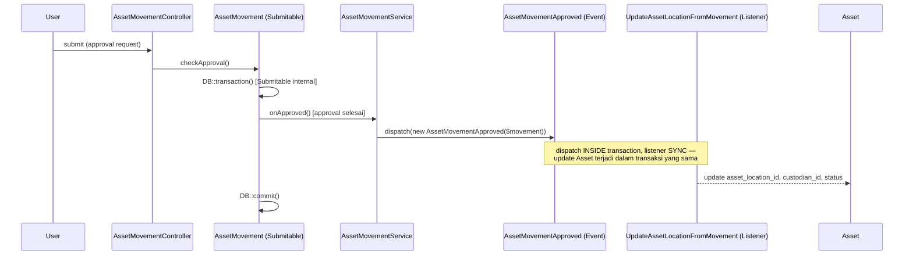

# Design Document: asset-management-movement

## Overview

`AssetMovement` adalah dokumen submittable baru (`App\Models\Asset\AssetMovement`, trait `Submitable` penuh) yang mencatat perpindahan `Asset` — transfer lokasi internal, issue (keluar sementara), receipt (kembali), atau kombinasi transfer_and_issue. Setiap Movement punya banyak baris `AssetMovementItem` (child table), 1 baris = 1 Asset yang dipindahkan.

Efek nyata ke data Asset (update `asset_location_id`, `custodian_id`, status `ISSUED`) HANYA terjadi setelah approval chain selesai — dispatch lewat event `AssetMovementApproved` di dalam transaksi `Submitable::checkApproval()`, ditangani listener **sync** (bukan `ShouldQueue`). Berbeda dari Spec 3 (`PostDepreciationEntry` dkk, queued karena posting GL — kompleks, butuh resolve akun, dan layak retry-able terpisah dari approval flow), listener di sini cuma melakukan update kolom sederhana pada `Asset` (`asset_location_id`, `custodian_id`, `status`) tanpa GL/external resource — tidak ada alasan kuat untuk async, dan sync memberi UX lebih baik (user langsung lihat Asset ter-update di respons approval yang sama, tanpa jeda worker). Event/Listener tetap dipakai (bukan logic langsung di controller/model) untuk menjaga decoupling & testability, konsisten arsitektur wajib proyek — tapi eksekusinya sinkron.

Tidak ada model baru di luar `AssetMovement`/`AssetMovementItem`/1 event/1 listener/1 service — scope sengaja sempit sesuai keputusan brainstorming (Maintenance/Repair/Report/Rental fix didefer ke spec lain).

## Architecture



**Alur create-time (bukan approval-time)**: saat user membuka form create AssetMovement dengan Asset tertentu (mis. dari halaman Show Asset, tombol "Pindahkan"), `AssetMovementController::create()` mengecek draft existing milik user yang sama sebelum menampilkan form — redirect jika ditemukan (Requirement 4). Ini murni query check, tidak melibatkan event/listener.

## Components and Interfaces

### Model: `App\Models\Asset\AssetMovement`

```php
class AssetMovement extends Model {
    use DataTable, HasFactory, HasUlids, SoftDeletes, Submitable;

    protected static $service = AssetMovementService::class;
    public string $formComponent = 'Asset/Movements/Form';
    public string $translateKey = 'asset.movement';
    protected $casts = [
        'purpose' => AssetMovementPurpose::class,
        'transaction_date' => 'date',
    ];

    public function items(): HasMany {
        return $this->hasMany(AssetMovementItem::class);
    }

    public function branch(): BelongsTo {
        return $this->belongsTo(Branch::class);
    }
}
```

### Model: `App\Models\Asset\AssetMovementItem`

```php
class AssetMovementItem extends Model {
    use HasFactory, HasUlids;

    protected $guarded = ['id'];

    public function assetMovement(): BelongsTo { return $this->belongsTo(AssetMovement::class); }
    public function asset(): BelongsTo { return $this->belongsTo(Asset::class); }
    public function sourceLocation(): BelongsTo { return $this->belongsTo(AssetLocation::class, 'source_location_id'); }
    public function targetLocation(): BelongsTo { return $this->belongsTo(AssetLocation::class, 'target_location_id'); }
    public function fromCustodian(): BelongsTo { return $this->belongsTo(User::class, 'from_custodian_id'); }
    public function toCustodian(): BelongsTo { return $this->belongsTo(User::class, 'to_custodian_id'); }
}
```

### Enum: `App\Enums\AssetMovementPurpose`

```php
enum AssetMovementPurpose: string {
    case ISSUE = 'issue';
    case RECEIPT = 'receipt';
    case TRANSFER = 'transfer';
    case TRANSFER_AND_ISSUE = 'transfer_and_issue';
}
```

### Service: `App\Services\Asset\AssetMovementService implements SubmitableService`

Tanggung jawab: validasi Requirement 2 (konsistensi lokasi per purpose, status Asset ACTIVE) di titik submit/approval, dan `onApproved()` yang dispatch `AssetMovementApproved` — pola persis `AssetService::onApproved()` (Spec 3) dan `AssetValueAdjustmentService::onApproved()`.

```php
public function onApproved(Model $model): void {
    event(new AssetMovementApproved($model));
}
```
Dispatch terjadi di dalam transaksi `Submitable::checkApproval()` (lihat `app/Traits/Submitable.php:190-196`) — konfirmasi ulang dari Spec 3: `onApproved()` dipanggil dari dalam `DB::transaction()` closure, jadi dispatch di sini otomatis aman memakai pola "inside transaction" (bukan "after commit").

### Event: `App\Events\Asset\AssetMovementApproved`

```php
class AssetMovementApproved {
    use Dispatchable;
    public function __construct(public readonly AssetMovement $movement) {}
}
```

### Listener: `App\Listeners\Asset\Movement\UpdateAssetLocationFromMovement`

Sync (bukan `ShouldQueue`) — dijalankan langsung dalam request/transaksi yang sama dengan approval. Untuk tiap `AssetMovementItem` di `$event->movement->items`:

```php
public function handle(AssetMovementApproved $event): void {
    foreach ($event->movement->items as $item) {
        $asset = $item->asset;
        if ($item->target_location_id) {
            $asset->asset_location_id = $item->target_location_id;
        }
        if ($item->to_custodian_id) {
            $asset->custodian_id = $item->to_custodian_id;
        }

        $status = collect($asset->status);
        $status = match ($event->movement->purpose) {
            AssetMovementPurpose::ISSUE, AssetMovementPurpose::TRANSFER_AND_ISSUE
                => $status->push(FormStatus::ISSUED)->unique(),
            AssetMovementPurpose::RECEIPT
                => $status->reject(fn ($s) => $s === FormStatus::ISSUED),
            default => $status,
        };
        $asset->status = $status->values()->all();
        $asset->save();
    }
}
```

`FormStatus::ISSUED` sudah ditambahkan ke enum sejak brainstorming Spec 1 (lihat memory `project_asset_management_module_plan.md`, list case baru) — perlu diverifikasi ulang eksis sebelum implementasi (lihat Correctness Properties di bawah, dan task checklist).

### Controller: `App\Http\Controllers\Asset\AssetMovementController`

Mengikuti pola standar CRUD+submit `AssetController`/`AssetValueAdjustmentController`. Tambahan khusus di `create()`:

```php
public function create(Request $request) {
    if ($assetId = $request->query('asset_id')) {
        $existingDraft = AssetMovement::whereHas('items', fn ($q) => $q->where('asset_id', $assetId))
            ->where('created_by_id', $request->user()->id)
            ->get()
            ->first(fn (AssetMovement $m) => in_array(FormStatus::DRAFT, $m->status ?? [], true));
        if ($existingDraft) {
            return redirect()->route('assetMovements.show', $existingDraft);
        }
    }
    // ... render form seperti biasa
}
```
Pola ini diadaptasi dari `QuotationController::create()` (baris 39-46) — bedanya dua hal: (1) query lewat relasi child `items` (`whereHas`), bukan kolom `referenceable_type`/`referenceable_id` di header, karena Asset dipilih di level item bukan sebagai dokumen sumber header; (2) filter status draft dilakukan di PHP (`in_array` pasca-`get()`), BUKAN `whereRaw('json_overlaps(...))` seperti Quotation — `json_overlaps` adalah fungsi MySQL yang tidak eksis di SQLite, dan test suite proyek ini jalan di SQLite `:memory:` (`phpunit.xml`). Ditemukan saat implementasi (task 8.4): query MySQL-only itu gagal dengan `no such function: json_overlaps`. Deviasi ini murni SQLite-compat untuk testability, jumlah draft per Asset per user diperkirakan kecil sehingga filter PHP-side tidak jadi masalah performa.

## Data Models

### Migration: `asset_movements`
| Kolom | Tipe | Keterangan |
|---|---|---|
| `id` | ulid, PK | |
| `code` | string, unique | via `FormatingSeries` |
| `purpose` | string | enum `AssetMovementPurpose` |
| `transaction_date` | date | |
| `branch_id` | ulid FK → branches | |
| `reference_type` / `reference_id` | string / ulid, nullable | morphTo generik, disiapkan untuk Spec 6 |
| ...field standar Submitable | | `status` (json), `submitted_at`, `canceled_at`, `amended_from_id`, `revision_number`, `created_by_id`, `additional_data`, timestamps, `deleted_at` |

### Migration: `asset_movement_items`
| Kolom | Tipe | Keterangan |
|---|---|---|
| `id` | ulid, PK | |
| `asset_movement_id` | ulid FK → asset_movements | |
| `asset_id` | ulid FK → assets | |
| `source_location_id` | ulid FK → asset_locations, nullable | |
| `target_location_id` | ulid FK → asset_locations, nullable | |
| `from_custodian_id` | ulid FK → users, nullable | |
| `to_custodian_id` | ulid FK → users, nullable | |
| timestamps | | |

## Correctness Properties

**Property 1 — Konsistensi lokasi pra-submit.** _For any_ `AssetMovementItem` dengan purpose yang mewajibkan `source_location_id` (transfer/receipt), submit SHALL ditolak jika `source_location_id !== Asset.asset_location_id` pada saat itu. **Validates: Requirement 2.4**

**Property 2 — Efek lokasi hanya pasca-approval.** _For any_ AssetMovement yang masih berstatus draft/pending-approval, `Asset.asset_location_id`/`custodian_id` SHALL TIDAK berubah. Perubahan HANYA terjadi setelah listener `UpdateAssetLocationFromMovement` diproses pasca event `AssetMovementApproved`. **Validates: Requirement 3.1-3.2**

**Property 3 — Redirect draft idempoten.** _For any_ user yang membuka create-form dengan `asset_id` yang sudah ada di draft milik user tersebut, sistem SHALL selalu redirect ke draft yang sama (bukan membuat draft baru), terlepas berapa kali dicoba. **Validates: Requirement 4.1-4.2**

## Error Handling

| Scenario | Behavior |
|---|---|
| `source_location_id` tidak match `Asset.asset_location_id` saat submit | Submit ditolak, pesan error field-level |
| Asset berstatus bukan `ACTIVE` disertakan di item | Submit ditolak, pesan error menyebut kode Asset & status saat ini |
| Purpose `transfer`/`transfer_and_issue` tapi `target_location_id` kosong | Validasi FormRequest gagal sebelum submit terjadi |
| Listener gagal (mis. Asset di salah satu item sudah dihapus sebelum approval diproses) | Exception dilempar dalam transaksi sync yang sama — seluruh approval AssetMovement (termasuk `checkApproval()`) ikut rollback, user melihat error langsung di respons submit, bukan gagal senyap di background |
| User buka create-form dengan `asset_id` yang sudah ada di draft ORANG LAIN (bukan miliknya) | Tidak ada redirect, form baru tetap ditampilkan — sesuai Requirement 4.3 |

## Testing Strategy

- **Unit**: `AssetMovementItem` relasi (`asset()`, `sourceLocation()`, dst); `AssetMovementPurpose` enum cases.
- **Feature**: `AssetMovementService::onApproved()` dispatch event (`Event::fake()`); listener `UpdateAssetLocationFromMovement` update Asset location/custodian/status per purpose (4 kasus: issue/receipt/transfer/transfer_and_issue); validasi Requirement 2 (location mismatch, status Asset bukan ACTIVE) via FormRequest/Service test; redirect-to-draft di `AssetMovementController::create()` (found + not-found case, beda user case).
- **Regresi**: pastikan `FormStatus::ISSUED` case sudah ada di enum sebelum test listener ditulis (cek `app/Enums/FormStatus.php` di awal implementasi task, bukan asumsi dari memory).
