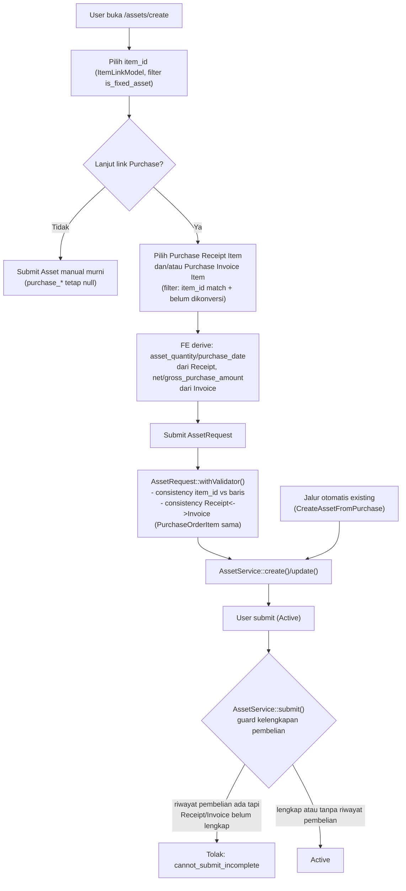

# Design Document: Asset Management Purchase Integration v2

## Overview

Fitur ini menambah jalur kedua pembuatan `Asset`: dari form manual (`/assets/create`), user membuka `item_id` (difilter `is_fixed_asset`) dan bisa link ke `PurchaseReceiptItem`/`PurchaseInvoiceItem` secara independen, dengan field turunan di-derive otomatis. Ditambah guard baru di titik submit yang berlaku universal (jalur manual maupun otomatis existing).

**Pattern utama yang dipakai** (semua sudah ada di codebase, tidak ada pattern baru):
- **LinkModel React component** (`@/Components/LinkModel`) — dua LinkModel baru (`PurchaseReceiptItemLinkModel`, `PurchaseInvoiceItemLinkModel`) mengikuti pola persis `AssetLinkModel.jsx` (wrapper tipis, prop `model="App\Models\..."`).
- **`scopeLinkModel(Builder $query, string $search)` override** pada model backend — base query kustom (filter fixed-asset + belum-dikonversi), dipanggil generic `ModelController::__invoke()` bila method ini ada pada model.
- **`filters` prop generic** (`ModelController::applyLinkModelFilters`) — untuk filter dinamis dari FE (kolom langsung, non-relasi, 0-level) seperti `item_id IN (...)`.
- **`withValidator()` pada FormRequest** — pola sudah dipakai `AssetRequest::validateOwnershipExclusivity()`, ditambah method serupa untuk consistency check Receipt↔Invoice.
- **Pengecekan kelengkapan di `AssetService::submit()`** — pola sudah ada untuk `asset_category_id`/`asset_location_id` ([AssetService.php:123-135](../../../app/Services/Asset/AssetService.php)), ditambah pengecekan serupa untuk riwayat pembelian.

**Yang TIDAK berubah**:
- `CreateAssetFromPurchase` listener (pembuatan Asset otomatis) — tidak disentuh, cuma perilaku Asset yang *dihasilkannya* kena guard submit baru yang sama.
- `CompleteAssetDataRequest`/dialog "Lengkapi Data Asset" — tetap eksklusif untuk kategori/lokasi pada Asset hasil jalur otomatis.
- Skema tabel `assets` — semua kolom (`item_id`, `purchase_receipt_id`, `purchase_invoice_id`, `purchase_receipt_item_id`, `purchase_invoice_item_id`) sudah ada sejak migrasi awal, tidak perlu migration baru.

**Temuan penting yang membentuk desain**: kolom `item_id` pada `purchase_receipt_items`/`purchase_invoice_items` **bukan** FK ke `items`, melainkan ke `item_variants` (nama kolom membingungkan tapi konvensi lama, lihat `PurchaseReceiptItem::item(): belongsTo(ItemVariant::class, 'item_id')`). Sedangkan `Asset.item_id` adalah FK langsung ke `items`. Jadi mencocokkan "Item yang sama" antara Asset dan baris pembelian butuh resolve lewat `ItemVariant.item_id` (lihat Components and Interfaces).

## Architecture



**Data flow filter baris pembelian** (LinkModel `PurchaseReceiptItemLinkModel`/`PurchaseInvoiceItemLinkModel`):
1. FE resolve daftar `item_variants.id` milik `item_id` (Item) yang sudah dipilih — didapat dari relasi `variants` yang ikut di-load saat memilih Item (`with=['variants']` pada `ItemLinkModel`).
2. FE kirim request ke endpoint generic `/model` dengan `model=App\Models\Purchase\PurchaseReceiptItem`, `filters={item_id: {in: [...variantIds]}}` (kalau Item sudah dipilih) — filter ini kolom langsung, 0-level relasi, jalur normal `ModelController::applyLinkModelFilters()`.
3. Base query (fixed-asset only + belum dikonversi) dari `scopeLinkModel()` override di model — dijalankan otomatis oleh `ModelController::__invoke()` sebelum filter di atas diterapkan.

## Components and Interfaces

### Backend

**`app/Models/Purchase/PurchaseReceiptItem.php`** — tambah relasi balik + scope:
```php
public function asset(): HasOne
{
    return $this->hasOne(Asset::class, 'purchase_receipt_item_id');
}

public function scopeLinkModel(Builder $query, string $search): Builder
{
    return $query
        ->whereHas('item.item', fn ($q) => $q->where('is_fixed_asset', true))
        ->whereDoesntHave('asset')
        ->when($search !== '', fn ($q) => $q->whereHas(
            'item.item',
            fn ($q2) => $q2->where('name', 'like', "%{$search}%"),
        ));
}
```
(`item.item` = `PurchaseReceiptItem::item()` → `ItemVariant`, lalu `ItemVariant::item()` → `Item`. Native Eloquent `whereHas` nested, tidak kena batas depth-1 milik filter generic — batas itu cuma berlaku untuk filter yang dikonstruksi dari request client.)

**`app/Models/Finances/PurchaseInvoiceItem.php`** — tambah relasi `asset()` (hasOne, FK `purchase_invoice_item_id`) dan `scopeLinkModel()` setara.

**`app/Http/Requests/Asset/AssetRequest.php`**:
```php
'item_id'                  => ['nullable', 'string', 'exists:items,id'],
'purchase_receipt_id'      => ['nullable', 'string', 'exists:purchase_receipts,id'],
'purchase_invoice_id'      => ['nullable', 'string', 'exists:purchase_invoices,id'],
'purchase_receipt_item_id' => ['nullable', 'string', 'exists:purchase_receipt_items,id'],
'purchase_invoice_item_id' => ['nullable', 'string', 'exists:purchase_invoice_items,id'],
```
Tambah ke `withValidator()`:
```php
private function validateItemIsFixedAsset(Validator $validator): void
{
    $itemId = $this->input('item_id');
    if (!$itemId) return;
    if (!Item::where('id', $itemId)->where('is_fixed_asset', true)->exists()) {
        $validator->errors()->add('item_id', __('asset/asset.item_must_be_fixed_asset'));
    }
}

private function validatePurchaseLinkConsistency(Validator $validator): void
{
    $receiptItem = $this->input('purchase_receipt_item_id')
        ? PurchaseReceiptItem::with('item.item', 'purchaseOrderItem')->find($this->input('purchase_receipt_item_id'))
        : null;
    $invoiceItem = $this->input('purchase_invoice_item_id')
        ? PurchaseInvoiceItem::with('item.item', 'purchaseOrderItem')->find($this->input('purchase_invoice_item_id'))
        : null;

    // Guard idempoten server-side (Requirement 4.3) — race condition dua user
    // pilih baris yang sama.
    if ($receiptItem && Asset::where('purchase_receipt_item_id', $receiptItem->id)
            ->when($this->route('asset'), fn ($q, $asset) => $q->where('id', '!=', $asset->id))
            ->exists()) {
        $validator->errors()->add('purchase_receipt_item_id', __('asset/asset.purchase_item_already_converted'));
    }
    if ($invoiceItem && Asset::where('purchase_invoice_item_id', $invoiceItem->id)
            ->when($this->route('asset'), fn ($q, $asset) => $q->where('id', '!=', $asset->id))
            ->exists()) {
        $validator->errors()->add('purchase_invoice_item_id', __('asset/asset.purchase_item_already_converted'));
    }

    // item_id harus sama dengan Item pada baris yang dipilih (Requirement 4.4).
    foreach (['receipt' => $receiptItem, 'invoice' => $invoiceItem] as $label => $row) {
        if ($row && $this->input('item_id') && $row->item->item->id !== $this->input('item_id')) {
            $validator->errors()->add("purchase_{$label}_item_id", __('asset/asset.purchase_item_mismatch'));
        }
    }

    // asset_quantity harus sama dengan quantity Receipt (Requirement 4.4).
    if ($receiptItem && (float) $this->input('asset_quantity') !== (float) $receiptItem->quantity) {
        $validator->errors()->add('asset_quantity', __('asset/asset.derived_field_mismatch'));
    }

    // net/gross_purchase_amount harus sama dengan hasil hitung Invoice (Requirement 4.4).
    if ($invoiceItem) {
        $expectedAmount = $invoiceItem->rate * $invoiceItem->quantity; // pola sama CreateAssetFromPurchase::createFromInvoice
        if ((float) $this->input('net_purchase_amount') !== round($expectedAmount, 2)) {
            $validator->errors()->add('net_purchase_amount', __('asset/asset.derived_field_mismatch'));
        }
    }

    // Requirement 2.7 & 4.5: kalau KEDUANYA terisi, wajib merujuk PurchaseOrderItem yang sama.
    if ($receiptItem && $invoiceItem) {
        $receiptPoItemId = $receiptItem->purchase_order_item_id;
        $invoicePoItemId = $invoiceItem->purchase_order_item_id;
        if (!$receiptPoItemId || !$invoicePoItemId || $receiptPoItemId !== $invoicePoItemId) {
            $validator->errors()->add('purchase_invoice_item_id', __('asset/asset.purchase_receipt_invoice_mismatch'));
        }
    }
}
```
Dipanggil dari `withValidator()` yang sudah ada, setelah `validateOwnershipExclusivity`/`validateRentableQuantity` (pola sama: skip kalau sudah ada error lain).

**`app/Services/Asset/AssetService.php`** — tambah guard di `submit()` (setelah cek `asset_category_id`/`asset_location_id`, sebelum `DB::beginTransaction()`):
```php
$hasPurchaseHistory = $model->purchase_receipt_id || $model->purchase_invoice_id;
if ($hasPurchaseHistory && !($model->purchase_receipt_id && $model->purchase_invoice_id)) {
    $missingFields[] = __('asset/asset.purchase_receipt_or_invoice');
}
```
(Ditambahkan ke array `$missingFields` yang sudah ada — reuse pesan error `cannot_submit_incomplete` yang sama, sesuai keputusan requirements.)

`item_id`/`purchase_*` sudah ada di `Arr::only()` list `create()`/`update()` — tidak perlu perubahan di situ.

### Frontend

**`resources/js/Pages/Purchase/PurchaseReceipts/PurchaseReceiptItemLinkModel.jsx`** (baru) dan **`resources/js/Pages/Finances/PurchaseInvoice/PurchaseInvoiceItemLinkModel.jsx`** (baru) — wrapper tipis mengikuti pola `AssetLinkModel.jsx`:
```jsx
import LinkModel from "@/Components/LinkModel";
import { forwardRef } from "react";

export default forwardRef(function PurchaseReceiptItemLinkModel(
  { value, onValueChange, placeholder, ...props },
  ref,
) {
  return (
    <LinkModel
      placeholder={placeholder}
      value={value}
      onValueChange={onValueChange}
      model="App\Models\Purchase\PurchaseReceiptItem"
      {...props}
      ref={ref}
    />
  );
});
```

**`resources/js/Pages/Asset/Assets/Form.jsx`** — perubahan pada field `item_id` (baris ~75-81 saat ini):
- Hapus `disabled`.
- Tambah `filters={{ is_fixed_asset: true }}` (kolom langsung di `items`, 0-level).
- `with={["variants"]}` supaya `data.item.variants` (array `{id,...}`) tersedia untuk filter baris pembelian.

Tambah 2 `FormInput` baru (link Receipt & Invoice), dengan logic (disederhanakan, detail state management di implementasi):
```jsx
const itemVariantIds = data?.item?.variants?.map((v) => v.id) ?? [];

<FormInput name="purchase_receipt_item" label={t("asset.asset.columns.purchase_receipt_item_id")}>
  <PurchaseReceiptItemLinkModel
    value={data?.purchase_receipt_item}
    onValueChange={handlePurchaseReceiptItemChange} // derive quantity/purchase_date/item (jika kosong)
    filters={itemVariantIds.length ? { item_id: { in: itemVariantIds } } : {}}
    with={["item.item", "purchaseReceipt"]}
  />
</FormInput>
<FormInput name="purchase_invoice_item" label={t("asset.asset.columns.purchase_invoice_item_id")}>
  <PurchaseInvoiceItemLinkModel
    value={data?.purchase_invoice_item}
    onValueChange={handlePurchaseInvoiceItemChange} // derive net/gross_purchase_amount/item (jika kosong)
    filters={itemVariantIds.length ? { item_id: { in: itemVariantIds } } : {}}
    with={["item.item", "purchaseInvoice"]}
  />
</FormInput>
```

`asset_quantity` dan `net_purchase_amount`/`gross_purchase_amount` (`NumberInput` yang sudah ada) mendapat prop `disabled` kondisional: `disabled={!!data?.purchase_receipt_item}` untuk `asset_quantity`, `disabled={!!data?.purchase_invoice_item}` untuk nilai perolehan (Requirement 3.3/3.4).

WHEN `item_id` diubah SEDANGKAN sudah ada link (Requirement 2.6/2.8) — `useEffect` yang mereset `purchase_receipt_item`/`purchase_invoice_item` (dan field derived-nya) ketika `data.item.id` berubah dan sudah tidak match dengan Item pada baris yang ter-link (perbandingan lewat `row.item.item.id` yang di-eager-load via `with`).

## Data Models

Tidak ada perubahan skema — seluruh field yang dipakai (`item_id`, `purchase_receipt_id`, `purchase_invoice_id`, `purchase_receipt_item_id`, `purchase_invoice_item_id`) sudah ada di tabel `assets` sejak migrasi Fase 1/2.

Relasi baru (kode, bukan skema):
- `PurchaseReceiptItem::asset(): HasOne` (FK `purchase_receipt_item_id` di `assets`)
- `PurchaseInvoiceItem::asset(): HasOne` (FK `purchase_invoice_item_id` di `assets`)

## Correctness Properties

**Property 1 — Filter fixed-asset konsisten dua arah**
_For any_ Item yang ditampilkan sebagai pilihan `item_id` di form manual Asset, THE Item SHALL punya `is_fixed_asset = true`. _For any_ baris pembelian yang ditampilkan sebagai pilihan Link Receipt/Invoice, THE Item pada baris tersebut SHALL punya `is_fixed_asset = true`.
**Validates: Requirement 1.2, 2.2/2.3 (turunan dari 1.2)**

**Property 2 — Baris pembelian yang sudah dikonversi tidak pernah muncul dua kali**
_For any_ `PurchaseReceiptItem`/`PurchaseInvoiceItem` yang sudah punya `Asset` terkait (tidak soft-deleted), THE baris tersebut SHALL TIDAK muncul di hasil pencarian LinkModel manapun, dan submit dengan baris tersebut SHALL ditolak validasi backend.
**Validates: Requirement 2.4, 4.3**

**Property 3 — Field derived selalu konsisten dengan sumbernya**
_For any_ Asset dengan `purchase_receipt_item_id` terisi, `asset_quantity` SHALL sama dengan `quantity` pada baris tersebut. _For any_ Asset dengan `purchase_invoice_item_id` terisi, `net_purchase_amount`/`gross_purchase_amount` SHALL sama dengan hasil hitung dari `rate`/`quantity` baris tersebut.
**Validates: Requirement 3.1, 3.2, 4.4**

**Property 4 — Receipt dan Invoice yang linked bersamaan selalu berasal dari PO yang sama**
_For any_ Asset dengan `purchase_receipt_item_id` DAN `purchase_invoice_item_id` keduanya terisi, kedua baris tersebut SHALL merujuk `purchase_order_item_id` yang sama dan bukan null.
**Validates: Requirement 2.7, 4.5**

**Property 5 — Guard Active universal**
_For any_ Asset dengan `purchase_receipt_id` dan/atau `purchase_invoice_id` terisi (riwayat pembelian ada), submit ke Active SHALL ditolak KECUALI `purchase_receipt_id` DAN `purchase_invoice_id` keduanya terisi. _For any_ Asset TANPA riwayat pembelian sama sekali, guard ini SHALL tidak berlaku.
**Validates: Requirement 7.1, 7.2, 7.3**

## Error Handling

| Scenario | Behavior |
|----------|----------|
| `item_id` diisi tapi Item bukan `is_fixed_asset` | 422, error di field `item_id` (`asset/asset.item_must_be_fixed_asset`) |
| `purchase_receipt_item_id`/`purchase_invoice_item_id` sudah dipakai Asset lain (race condition) | 422, error di field terkait (`asset/asset.purchase_item_already_converted`) |
| Baris pembelian dipilih tapi Item-nya beda dari `item_id` yang dikirim | 422, error di field baris terkait (`asset/asset.purchase_item_mismatch`) |
| `asset_quantity`/nilai perolehan yang dikirim tidak sama dengan hasil derive (FE dimanipulasi) | 422, error di field derived terkait (`asset/asset.derived_field_mismatch`) |
| Receipt DAN Invoice sama-sama terisi tapi `purchase_order_item_id` beda (atau salah satu null) | 422, error di `purchase_invoice_item_id` (`asset/asset.purchase_receipt_invoice_mismatch`) |
| Submit Asset dengan riwayat pembelian tapi Receipt/Invoice belum lengkap | 422 (LogicException, pola existing), pesan gabung `cannot_submit_incomplete` |
| Asset tanpa riwayat pembelian sama sekali | Submit berjalan seperti biasa, guard baru tidak dievaluasi |

## Testing Strategy

- **Unit Tests**: `AssetRequest` — tiap skenario validasi (`validateItemIsFixedAsset`, `validatePurchaseLinkConsistency`) dengan factory data yang sengaja mismatch.
- **Feature Tests** (`tests/Feature/Asset/AssetControllerTest.php`):
  - Buat Asset dengan `item_id` fixed-asset tanpa link Purchase → sukses (perilaku manual murni tetap jalan).
  - Buat Asset dengan Link Receipt saja → `asset_quantity` ter-derive, `net_purchase_amount` tetap terima input manual/0.
  - Buat Asset dengan Link Receipt + Invoice dari PO yang sama → sukses, kedua field derived benar.
  - Buat Asset dengan Link Receipt + Invoice dari PO **berbeda** → 422.
  - Baris pembelian yang sudah dipakai Asset lain tidak bisa dipakai lagi → 422.
  - Submit Asset dengan riwayat pembelian tapi Invoice belum ada → 422 (`cannot_submit_incomplete`).
  - Submit Asset dengan riwayat pembelian LENGKAP (Receipt + Invoice) → sukses jadi Active.
  - Submit Asset TANPA riwayat pembelian sama sekali → sukses seperti sebelumnya (regresi guard baru tidak mempengaruhi Asset manual murni).
  - Regresi: Asset hasil jalur otomatis (`CreateAssetFromPurchase`, factory/seed manual mensimulasikan) yang cuma py Invoice tanpa Receipt → tidak bisa submit (mengonfirmasi guard universal benar-benar menyentuh jalur lama).
- **Component Tests** (`.rtl.test.jsx`, `Form.rtl.test.jsx` Assets): `item_id` tidak lagi disabled, filter `is_fixed_asset` terkirim; field derived jadi read-only saat link aktif dan editable saat link dikosongkan.
