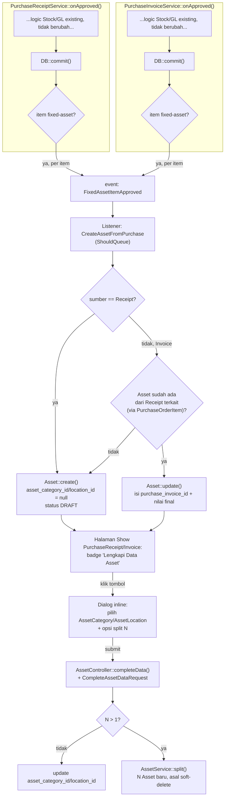

# Design Document: Asset Management — Purchase Integration (Fase 2)

## Overview

Menghubungkan domain Purchase/Inventory ke Asset lewat pola Event/Listener (bukan inline di service, menyimpang sengaja dari pola `StockLedgerEntry`/`GeneralLedger` existing — keputusan eksplisit demi modularitas: logic "bagaimana Asset terbentuk" terpisah dari logic "apa yang terjadi pada dokumen Purchase"). Komponen baru: kolom `Item.is_fixed_asset`/`Item.asset_category_id`, event `FixedAssetItemApproved`, listener `CreateAssetFromPurchase` yang meng-create-atau-update `Asset`, endpoint dialog "lengkapi data" (kategori/lokasi/split) di halaman Show Purchase.

**Yang TIDAK berubah**: `PurchaseReceiptService`/`PurchaseInvoiceService::onApproved()` — cuma ditambah SATU baris dispatch event per item fixed-asset di akhir method (setelah `DB::commit()`), tidak menyentuh logic Stock/GL existing sama sekali. `AssetService::create()`/`update()` dipakai apa adanya (whitelist field-nya diperluas, bukan diubah struktur).

## Architecture



### Data Flow

1. **Approval time**: `onApproved()` selesai seperti biasa → dispatch `FixedAssetItemApproved` per baris item yang `Item.is_fixed_asset = true` (bukan sebelum commit, supaya listener queue baca data Stock/GL yang sudah final).
2. **Listener (queued)**: menentukan create-baru vs update-existing berdasar sumber dokumen dan pencarian Asset via relasi `PurchaseOrderItem` bersama.
3. **UI completion**: halaman Show Purchase menampilkan status Asset terkait tiap baris item; tombol buka dialog inline untuk isi kategori/lokasi/split.
4. **Split**: hanya terjadi manual dari dialog ini, tidak otomatis saat create.

## Components and Interfaces

### 1. Migration: `items` + `assets`

```php
// database/migrations/xxxx_add_fixed_asset_fields_to_items_table.php
Schema::table('items', function (Blueprint $table) {
    $table->boolean('is_fixed_asset')->default(false)->after('is_stock_item');
    $table->foreignUlid('asset_category_id')->nullable()
        ->after('is_fixed_asset')->constrained('asset_categories')->nullOnDelete();
});
```

```php
// EDIT LANGSUNG database/migrations/2026_08_08_000004_create_assets_table.php (Spec 1, belum production)
// asset_category_id, asset_location_id: hapus ->restrictOnDelete() eksplisit non-nullable, tambah ->nullable()
$table->foreignUlid('asset_category_id')->nullable()->references('id')->on('asset_categories')->restrictOnDelete();
$table->foreignUlid('asset_location_id')->nullable()->references('id')->on('asset_locations')->restrictOnDelete();
```

### 2. `App\Models\Inventory\Item` (edit)

Tambah ke `$casts`: `'is_fixed_asset' => 'boolean'`. Tambah relasi:
```php
public function assetCategory(): BelongsTo {
    return $this->belongsTo(AssetCategory::class);
}
```

### 3. `App\Events\Asset\FixedAssetItemApproved` (baru)

```php
namespace App\Events\Asset;

class FixedAssetItemApproved {
    use Dispatchable, SerializesModels;

    public function __construct(
        public readonly Model $sourceDocument,   // PurchaseReceipt | PurchaseInvoice
        public readonly Model $sourceItem,       // PurchaseReceiptItem | PurchaseInvoiceItem
        public readonly Item $item,
    ) {}
}
```

### 4. `App\Listeners\Asset\CreateAssetFromPurchase` (baru, `implements ShouldQueue`)

```php
namespace App\Listeners\Asset;

class CreateAssetFromPurchase implements ShouldQueue {
    public function __construct(private AssetService $assetService) {}

    public function handle(FixedAssetItemApproved $event): void {
        $isReceipt = $event->sourceDocument instanceof PurchaseReceipt;

        if ($isReceipt) {
            $this->createFromReceipt($event->sourceItem, $event->item);
            return;
        }

        $existing = $this->findAssetFromRelatedReceipt($event->sourceItem);
        if ($existing) {
            $this->syncFromInvoice($existing, $event->sourceItem);
            return;
        }

        $this->createFromInvoice($event->sourceItem, $event->item);
    }

    private function findAssetFromRelatedReceipt(PurchaseInvoiceItem $invoiceItem): ?Asset {
        $poItem = $invoiceItem->purchaseOrderItem;
        if (! $poItem) {
            return null;
        }

        return Asset::whereNull('purchase_invoice_id')
            ->whereHas('purchaseReceiptItem', fn ($q) => $q->where('purchase_order_item_id', $poItem->id))
            ->first();
    }
    // createFromReceipt() / createFromInvoice() / syncFromInvoice(): lihat Requirement 3/4
}
```

Catatan desain: `Asset` butuh relasi baru `purchaseReceiptItem()`/`purchaseInvoiceItem()` (belongsTo, via `purchase_receipt_id`+lookup item, ATAU lebih simpel — tambah kolom `purchase_receipt_item_id`/`purchase_invoice_item_id` langsung di `assets` supaya pencarian Requirement 4.1 jadi query langsung tanpa join tebak-tebak lewat `purchase_receipt_id` saja (satu Receipt bisa punya banyak item fixed-asset, `purchase_receipt_id` saja tidak cukup unik). **Keputusan**: tambah `purchase_receipt_item_id`/`purchase_invoice_item_id` (nullable FK) di migration `items` pada poin 1 di atas — lebih murah dan akurat daripada reverse-lookup.

### 5. `App\Services\Asset\AssetService` (edit)

- `createInTransaction()`: tambah `purchase_receipt_id`, `purchase_invoice_id`, `purchase_receipt_item_id`, `purchase_invoice_item_id` ke whitelist `Arr::only()`.
- `submit()`: tambah validasi awal:
  ```php
  if (! $model->asset_category_id || ! $model->asset_location_id) {
      throw new LogicException(__('asset/asset.cannot_submit_incomplete'));
  }
  ```
- Method baru `split(Asset $asset, int $parts): Collection` — dipakai Requirement 6.4. Distribusi qty: `intdiv($qty, $parts)` untuk semua bagian, sisa (`$qty % $parts`) ditambahkan ke bagian PERTAMA (qty 5 split 3 → `[3, 1, 1]`). Field moneter (`net_purchase_amount`, `gross_purchase_amount`, `additional_asset_cost`) dibagi proporsional per qty bagian; field lain (nama, kategori, lokasi, tanggal, dokumen sumber) disalin identik ke semua hasil split. Asset asal di-soft-delete di akhir, dalam transaction yang sama.

### 6. `App\Http\Requests\Asset\CompleteAssetDataRequest` (baru)

```php
public function rules(): array {
    return [
        'asset_category_id' => ['required', 'string', 'exists:asset_categories,id'],
        'asset_location_id' => ['required', 'string', 'exists:asset_locations,id'],
        'split_into'         => ['nullable', 'integer', 'min:1', 'max:' . $this->route('asset')->asset_quantity],
    ];
}
```

### 7. `App\Http\Controllers\Asset\AssetController::completeData()` (method baru)

```php
public function completeData(CompleteAssetDataRequest $request, Asset $asset) {
    abort_unless($asset->status->contains(FormStatus::DRAFT), 422);

    $splitInto = $request->validated('split_into', 1);
    if ($splitInto > 1) {
        $this->assetService->split($asset, $splitInto, $request->validated());
    } else {
        $this->assetService->update($asset, $request->validated());
    }

    return back();
}
```

Route baru: `Route::put('/assets/{asset}/completeData', [AssetController::class, 'completeData'])->name('assets.completeData');`

### 8. FE — badge + dialog di Show PurchaseReceipt/PurchaseInvoice

- `resources/js/Pages/Purchase/PurchaseReceipts/Show.jsx` dan `resources/js/Pages/Finances/PurchaseInvoices/Show.jsx`: per baris item, jika `item.asset` ada DAN (`!item.asset.asset_category_id || !item.asset.asset_location_id`), tampilkan `Badge` "Lengkapi Data Asset" + tombol buka dialog.
- Dialog baru `resources/js/Pages/Asset/Assets/CompleteDataDialog.jsx` (komponen reusable, dipakai kedua halaman): form `useForm` dengan `AssetCategoryLinkModel`, `AssetLocationLinkModel` (reuse Spec 1), input number `split_into` (muncul hanya jika `asset.asset_quantity > 1`), submit ke `route('assets.completeData', asset.id)` via `router.put`.

## Data Models

```
items (edit)
  + is_fixed_asset: boolean, default false
  + asset_category_id: ulid, nullable, FK -> asset_categories, nullOnDelete

assets (edit, Spec 1 migration diedit langsung — belum production)
  ~ asset_category_id: nullable (semula NOT NULL)
  ~ asset_location_id: nullable (semula NOT NULL)
  + purchase_receipt_item_id: ulid, nullable, FK -> purchase_receipt_items, nullOnDelete
  + purchase_invoice_item_id: ulid, nullable, FK -> purchase_invoice_items, nullOnDelete
```

## Correctness Properties

**Property 1 — No duplicate Asset per source row**: _For any_ `PurchaseReceiptItem` dengan `Item.is_fixed_asset = true`, memanggil alur approval untuk baris yang sama lebih dari sekali SHALL menghasilkan tepat satu `Asset` non-deleted dengan `purchase_receipt_item_id` yang menunjuk baris tersebut.
**Validates: Requirement 3.5**

**Property 2 — Invoice never orphans a Receipt-created Asset**: _For any_ `PurchaseInvoiceItem` yang `purchaseOrderItem`-nya sama dengan `purchaseOrderItem` milik `PurchaseReceiptItem` yang sudah punya Asset (`purchase_invoice_id` masih null), listener SHALL meng-update Asset tersebut, TIDAK membuat Asset baru — total jumlah Asset untuk `PurchaseOrderItem` tersebut tetap sama sebelum dan sesudah Invoice diproses.
**Validates: Requirement 4.1, 4.2, 4.4**

**Property 3 — Split preserves total quantity and monetary value**: _For any_ Asset dengan `asset_quantity = Q` dan `gross_purchase_amount = V` di-split menjadi `N` bagian, jumlah `asset_quantity` seluruh hasil split SHALL sama dengan `Q`, dan jumlah `gross_purchase_amount` seluruh hasil split SHALL sama dengan `V` (dalam toleransi pembulatan desimal terkecil mata uang).
**Validates: Requirement 6.4**

**Property 4 — Incomplete Asset cannot be submitted**: _For any_ Asset dengan `asset_category_id = null` OR `asset_location_id = null`, memanggil `AssetService::submit()` SHALL selalu melempar `LogicException`, TIDAK PERNAH mengubah status Asset.
**Validates: Requirement 5.2**

## Error Handling

| Scenario | Behavior |
|----------|----------|
| `Item.is_fixed_asset = true` tapi `Item.asset_category_id` kosong | Asset dibuat dengan `asset_category_id = null` (bukan error) — dilengkapi manual lewat dialog (Requirement 3.2) |
| Listener `CreateAssetFromPurchase` gagal (mis. constraint DB) di queue | `ShouldQueue` default retry Laravel berlaku (tidak override `$tries`/`failed()` khusus di fase ini) — gagal permanen tercatat di `failed_jobs`, TIDAK mempengaruhi status PurchaseReceipt/Invoice yang sudah approved (event dispatch terpisah dari transaction dokumen) |
| User coba `completeData()` pada Asset yang sudah `SUBMITTED` | HTTP 422, pesan lang `asset/asset.cannot_complete_after_submit` |
| User input `split_into` > `asset_quantity` | Validasi `CompleteAssetDataRequest` menolak (rule `max`), 422 sebelum masuk service |
| `PurchaseInvoiceItem.purchaseOrderItem` null (invoice tanpa PO — dimungkinkan di alur existing?) | Diperlakukan sebagai "Asset tidak ditemukan" → jalur create baru (Requirement 4.3) |
| Dua `PurchaseReceiptItem` berbeda (baris terpisah) merujuk `PurchaseOrderItem` yang sama, keduanya fixed-asset | Masing-masing punya `purchase_receipt_item_id` sendiri → masing-masing bikin Asset sendiri, TIDAK saling menimpa (Property 1 berbasis `purchase_receipt_item_id`, bukan `purchase_order_item_id`) |

## Testing Strategy

- **Unit Tests**: `AssetService::split()` — verifikasi Property 3 (distribusi qty `[3,1,1]` utk qty=5/parts=3, distribusi nilai proporsional, soft-delete asal). `AssetService::submit()` — Property 4 (reject saat category/location null).
- **Feature Tests**: 
  - `PurchaseReceiptControllerTest`/Service test — approve PurchaseReceipt berisi item fixed-asset → assert 1 Asset baru DRAFT tercipta dengan field termapping benar (Requirement 3).
  - Approve PurchaseReceipt lalu PurchaseInvoice (PO sama) → assert Asset SAMA (id tidak berubah), `purchase_invoice_id` terisi, nilai ter-update (Requirement 4, Property 2).
  - Approve PurchaseInvoice TANPA Receipt sebelumnya → assert Asset baru tercipta dari Invoice (Requirement 4.3).
  - `AssetControllerTest::completeData` — submit dialog tanpa split → update category/location. Submit dengan split=3 → assert 3 Asset baru + asal soft-deleted (Requirement 6).
  - Regression: approve PurchaseReceipt/Invoice untuk item BUKAN fixed-asset → assert TIDAK ada event `FixedAssetItemApproved` di-dispatch (`Event::fake()` assertNotDispatched), StockLedgerEntry/GL tetap terbentuk seperti biasa (Requirement 7.4).
- **Queue behavior**: test listener dengan `Queue::fake()` untuk assert job di-push, dan test `handle()` langsung (bypass queue) untuk assert logic bisnis Property 1/2.
