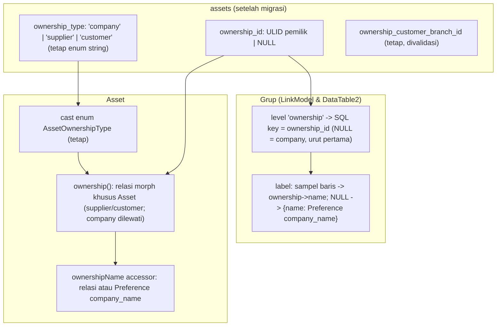

# Design Document: Asset Ownership Morph

## Overview

Ownership `Asset` saat ini dimodelkan dengan tiga kolom FK terpisah (`ownership_company_id`, `ownership_supplier_id`, `ownership_customer_id`) ditambah `ownership_type` (enum `company|supplier|customer`) dan dispatch manual `Asset::ownershipEntity()`. Dua masalah:

1. **Supplier dan Customer disimpan di kolom berbeda** padahal merupakan "satu pemilik polimorfik". Cukup satu relasi morph (`ownership_type` + `ownership_id`).
2. **`ownership_company_id` tidak berfungsi.** Sistem tidak multi-company: tidak ada relasi/model `company`, kolom hanya ikut disalin di `AssetRequest`/`AssetService` dan divalidasi "harus kosong" untuk tipe lain. Nama perusahaan ada di Preference `company_name`.

Spec ini (a) merefaktor ownership menjadi morph dan menghapus ketiga kolom lama beserta migrasi datanya, dan (b) membuat **grup LinkModel/DataTable2 berdasarkan ownership menampilkan langsung nama pemiliknya**: nama Customer/Supplier untuk pemilik eksternal, dan nama perusahaan (Preference `company_name`) untuk Asset milik perusahaan, grup perusahaan **di urutan paling atas**.

Spec rujukan: [`linkmodel-grouping-search`](../linkmodel-grouping-search/design.md) (gerbang kolom aman, `LinkModelGroupGate`), [`datatable2-group-tree`](../datatable2-group-tree/design.md) (mesin grup, `GroupColumnGate`, `GroupNodeQuery`).

**Keputusan user (sesi ini):** (1) refactor penuh lewat spec; (2) nama perusahaan dari Preference `company_name`; (3) migration baru + konversi data (bukan edit migration lama); (4) `ownership_customer_branch_id` ikut dirapikan (validasi hanya untuk customer + auto-clear saat tipe berganti); (5) company **tetap disimpan sebagai string `'company'`** (bukan NULL); (6) `AssetLinkModel` memakai level `ownership` saja; (7) **index Asset** memakai grup bawaan `[ownership, asset_type]` (`$defaultGroups` di model `Asset`); (8) `morphMap` tidak dipakai global -- relasi khusus Asset (lihat §2).

## Temuan penelusuran kode

| # | Temuan | Dampak |
|---|---|---|
| F1 | `Asset::ownershipEntity()` berkomentar *"NOT a morphTo — Laravel morph stores FQCN, not enum string"*; `ownership_type` di-cast ke enum `AssetOwnershipType`. | Morph murni bentrok dengan cast enum; perlu cast kustom + `morphMap`. |
| F2 | `ownership_company_id` hanya muncul di `AssetRequest` (validasi), `AssetService` (daftar field + snapshot), `AssetFactory`, migration, lang, dan 2 file tes. Tidak ada relasi/model `company`. | Aman dihapus; tak ada konsumen fungsional. |
| F3 | Konsumen fungsional `ownershipCustomer`/`ownershipCustomerBranch`: `SalesOrderController` (resolve customer billing untuk Asset ber-ownership customer), `Asset::loadRelationsOnShow`, `configColumns`. | Harus dipindah ke relasi morph `ownership`. |
| F4 | Form (`Pages/Asset/Assets/Form.jsx`) menampilkan `LinkModel` supplier/customer secara kondisional lewat `ownership_type`, dan mengirim `ownership_supplier`/`ownership_customer`. `AssetRequest::prepareForValidation` mengubah objek LinkModel jadi id. | Form diganti satu pemilih ownership bergantung tipe. |
| F5 | Gerbang grup `GroupColumnGate::relationSqlColumn()` **mengecualikan eksplisit `MorphTo`** ("butuh kombinasi id+type"). | Grup berdasarkan ownership butuh perluasan terkontrol gerbang ini. |
| F6 | `Relation::morphMap()` belum dipakai di app. | Alias morph bisa didaftarkan tanpa bentrok. |
| F7 | Pada Laravel, `MorphTo` dengan `*_type` yang tak terpetakan (mis. `company`) mencoba `new <type>` saat eager-load. | Pemilik "company" TIDAK boleh disimpan sebagai tipe morph tak terpetakan. |

## Architecture

## Components and Interfaces

### 1. Skema & migrasi

Migration baru `convert_asset_ownership_to_morph`:

- **up():** tambah `ownership_id` (`ulid`, nullable, index). Konversi data: `ownership_type='supplier'` → `ownership_id = ownership_supplier_id`; `'customer'` → `ownership_id = ownership_customer_id`; `'company'` → `ownership_id = NULL` (`ownership_type` tetap `'company'`). Lalu `dropColumn` `ownership_company_id`, `ownership_supplier_id`, `ownership_customer_id` (drop FK/index bila ada). Kolom `ownership_type` tidak berubah (string, default `'company'`).
- **down():** pulihkan tiga kolom, salin balik dari `ownership_id` sesuai `ownership_type`, `ownership_company_id` dibiarkan NULL (tak pernah berisi data bermakna), hapus `ownership_id`. (Lossy untuk `ownership_company_id` -- didokumentasikan.)
- Konversi dijalankan dengan `chunkById` (aman untuk data besar), dalam transaksi.
- **TODO[konfirmasi]:** DB dev/staging yang sudah migrate: cek ada baris `ownership_type` di luar tiga nilai enum sebelum menjalankan.

### 2. Model `Asset`

- **Tanpa `morphMap` global** (risiko mengubah `getMorphClass()` morph lain yang menunjuk Customer/Supplier -- mis. log/todo/lampiran -- sehingga baris lama ber-FQCN bisa tak ketemu). `ownership(): MorphTo` dibangun dari subclass kecil `AssetOwnershipMorphTo` (di `app/Models/Asset/`) yang menerjemahkan `ownership_type` ke model lewat peta lokal `['supplier' => Supplier::class, 'customer' => Customer::class]`, **melewati tipe `company`** (tak pernah mencoba `new company`, F7) dan baris ber-`ownership_id` NULL. Eager-load (`with('ownership')`) dan `$asset->ownership` bekerja untuk supplier/customer; `company` menghasilkan `null`.
- `ownership_type` **tetap** di-cast enum `AssetOwnershipType` (`company|supplier|customer`); nilai DB tetap string enum, tanpa cast baru.
- `ownershipEntity()` (dispatch manual) **dihapus**; relasi `ownershipSupplier`/`ownershipCustomer` **dihapus**; pemakai dialihkan ke `ownership`.
- `ownershipCustomerBranch()` dipertahankan; rapikan: hanya bermakna untuk `ownership_type=customer` -- validasi `AssetRequest`: wajib kosong untuk tipe selain customer; saat tipe diubah ke non-customer nilainya dikosongkan di `saving` event. **[TODO: konfirmasi — "ikut dirapikan" diinterpretasi sebagai validasi + auto-clear; ada keinginan lain (mis. rename/pindah ke tabel pivot)?]**
- Accessor `ownershipName` (appended, dipakai grup & label): `ownership?->name ?? ownership?->templateLink`; bila `company` → `Preference company_name` (cache request-scope).
- Konfigurasi kolom: `ownership` (relasi morph, `groupable: true`, `groupMorph: true`, `type: relation`, `typeRelation: morph`) menjadi level grup; `ownership_type` tetap `groupable` string. **`$defaultGroups = ['ownership', 'asset_type']`** pada model `Asset` (grup bawaan index DataTable2 dan fallback LinkModel/Advance Search). `AssetLinkModel` memakai prop `group={["ownership"]}` (lihat §4).
- `loadRelationsOnShow`: `ownership` menggantikan `ownershipSupplier`/`ownershipCustomer`.

### 3. Request, service, controller, form

- `AssetRequest`: hapus `ownership_company_id|supplier_id|customer_id` dan `validateOwnershipExclusivity()`; ganti dengan `ownership_type` (`in:company,supplier,customer`) + `ownership` (objek LinkModel `{id, thisModel}` → `ownership_id`); aturan: `ownership_id` wajib bila tipe supplier/customer, wajib kosong bila company; model objek harus sesuai tipe (supplier→Supplier, customer→Customer). `prepareForValidation` memetakan `ownership` → `ownership_id`.
- `AssetService`: daftar field fillable/snapshot (baris 43-44, 73-74, 166-170, 297-300) diganti `ownership_type`, `ownership_id`; `ownership_customer_branch_id` tetap.
- `SalesOrderController` (baris 119-132): `asset.ownershipCustomer` → `asset.ownership` (hanya bila `ownership_type === CUSTOMER`); pemakai `ownershipCustomerBranch` tetap.
- `Pages/Asset/Assets/Form.jsx` (baris 248-290): satu `FormInput` ownership: `ownership_type` (select) + satu `LinkModel` yang `model`-nya mengikuti tipe (`Supplier`/`Customer`); `company` tanpa pemilih (menampilkan nama perusahaan read-only). Kirim `ownership` (objek) alih-alih `ownership_supplier`/`ownership_customer`.
- Lang id/en: hapus `ownership_company_id|supplier_id|customer_id`; tambah `ownership` dan pesan validasi baru.
- Factory & seeder: `AssetFactory` memakai `ownership_type`/`ownership_id`.

### 4. Grup berdasarkan ownership (inti permintaan user)

Kebutuhan: level grup `ownership` menampilkan **nama pemilik** langsung; pemilik perusahaan menampilkan **nama perusahaan di grup teratas**.

**Kunci grup:** `ownership_id` (ULID unik lintas tabel, jadi tak ambigu tanpa `ownership_type`). Pemilik perusahaan = `ownership_id IS NULL` → grup NULL yang **sudah selalu tampil pertama** pada urutan `key ASC` (aturan `datatable2-group-tree` Req 5.8), tanpa kode urutan tambahan. Arah `groupSort=desc` membalik (perilaku sama grup lain).

**Perluasan gerbang `GroupColumnGate`:** `MorphTo` tetap ditolak secara umum (F5); ditambahkan **opt-in eksplisit per kolom** `'groupMorph' => true` pada config kolom relasi morph, dengan syarat: relasi `MorphTo` memakai konvensi `{name}_id` + `{name}_type`; kolom SQL grup = `{name}_id`. Tanpa flag, perilaku lama (ditolak) tak berubah (Property: zero-overhead).

**Label:** `GroupNodeQuery::descriptors()` memuat `label` dari baris sampel (`MIN(pk)`) lewat relasi `ownership` (eager-load morph: `with('ownership')`, ditambahkan ke `extraKeys` seperti relasi level lain). Untuk grup NULL, config kolom menyediakan **label bawaan**: `'groupNullLabel' => ['preference' => 'company_name']` → deskriptor `label = ['name' => <nilai Preference>, 'templateLink' => ':name']`. Bentuk label identik objek relasi biasa, sehingga FE (`GroupLabel` tipe `relation` → `convertTemplateLink`) tak berubah. Label morph disaring kolom aman model targetnya (`filterRowColumns` per `thisModel`, sama jalur `linkmodel-grouping-search` Req 3).

**LinkModel/dialog:** `AssetLinkModel` memakai `group={["ownership"]}` (menggantikan `["ownership_type", "asset_type"]`; keputusan user: satu level). Prop menimpa `$defaultGroups` model, jadi dropdown satu level sementara **index Asset** tetap `[ownership, asset_type]`. Gerbang kolom aman: `ownership` bertipe relasi → lolos tanpa `linkable` (sama relasi lain).

**DataTable2:** karena gerbang ada di `GroupColumnGate`, `ownership` tersedia sebagai kolom "Group by" di index Asset (`groupable: true` + `groupMorph: true`) dan menjadi level pertama grup bawaan (`[ownership, asset_type]`); `ownership_type` tetap ada untuk grup kasar manual.

## Data Models

| Kolom | Sebelum | Sesudah |
|---|---|---|
| `ownership_type` | `string`, default `'company'` (enum) | tidak berubah (`'company'`/`'supplier'`/`'customer'`) |
| `ownership_id` | — | `ulid` nullable, index; NULL untuk `company` |
| `ownership_company_id` | ULID nullable | **dihapus** |
| `ownership_supplier_id` | ULID nullable | **dihapus** |
| `ownership_customer_id` | ULID nullable | **dihapus** |
| `ownership_customer_branch_id` | FK ke `branches` | tetap; divalidasi hanya untuk customer |

Kontrak API form (`POST/PATCH assets`): `ownership_type` (`company|supplier|customer`) + `ownership` (objek `{id,...}` atau null). Respons `Asset` menyertakan `ownership_type` (enum) dan relasi `ownership`.

## Correctness Properties

**P1 — Konversi lossless.** Untuk setiap baris sebelum migrasi: `supplier` → (`ownership_type='supplier'`, `ownership_id=ownership_supplier_id`), `customer` → (`'customer'`, `ownership_customer_id`), `company` → (`NULL`, `NULL`); `down()` mengembalikan nilai supplier/customer yang sama.

**P2 — Relasi morph khusus Asset.** `ownership` untuk `supplier`/`customer` me-resolve Supplier/Customer yang benar (termasuk eager-load banyak baris campuran); untuk `company` mengembalikan `null` tanpa error; tak ada `morphMap` global (morph lain tak berubah).

**P3 — Eksklusivitas.** `AssetRequest`: tipe `company` ⇒ `ownership` kosong; tipe `supplier`/`customer` ⇒ `ownership` wajib dan bermodel sesuai tipe; `ownership_customer_branch_id` hanya untuk `customer`.

**P4 — Label grup.** Level `ownership` pada daftar grup: setiap grup non-NULL membawa `label` = objek pemilik (tersaring kolom aman); grup NULL membawa nama perusahaan dari Preference; grup NULL (company) berada pertama pada `groupSort=asc`; index Asset memakai `[ownership, asset_type]` secara bawaan.

**P5 — Zero-overhead & aman.** Kolom morph tanpa `groupMorph` tetap ditolak gerbang; request tanpa grup identik dengan sebelumnya; `SalesOrder` mengambil customer billing yang sama dari Asset ber-ownership customer.

## Error Handling

| Skenario | Perilaku |
|---|---|
| `ownership_type` supplier/customer tanpa `ownership` | 422 `required` pada `ownership` |
| `ownership` bermodel salah untuk tipe | 422 |
| Tipe `company` dengan `ownership` terisi | 422 `ownership_must_be_empty` |
| Data lama dengan `ownership_type` di luar enum | Migration berhenti dengan pesan baris bermasalah (tak mengubah data) |
| Preference `company_name` kosong | Label grup perusahaan memakai `core.datatable.no_group_value` |
| Baris `company` dengan `ownership_id` terisi | Data tak konsisten: validasi menolak, migration mengosongkan `ownership_id` |
| Pemilik (Customer/Supplier) sudah soft-delete | Label tetap dimuat `withTrashed` (pola relasi lain) |

## Testing Strategy

- **Migrasi (PHPUnit):** konversi tiga tipe + `down()`; baris dengan `ownership_type` tak dikenal menghentikan migrasi.
- **Model:** cast bolak-balik, relasi `ownership` (supplier/customer/null), accessor `ownershipName`, auto-clear `ownership_customer_branch_id`.
- **Request/Service:** eksklusivitas, model sesuai tipe, snapshot AssetService.
- **SalesOrder:** customer billing dari `asset.ownership`.
- **Grup:** `GroupColumnGate` menerima `groupMorph`, menolak morph tanpa flag; `GroupNodeQuery` mengembalikan grup NULL pertama dengan label Preference, grup lain berlabel nama pemilik; endpoint lookup `model` (`LinkModelGroupGate`) menyaring label morph; `AllModelsGroupableConfigTest` diperluas.
- **FE:** `Form.jsx` (ganti tipe → pemilih berubah, payload `ownership`), `AssetLinkModel` grup `ownership`; verifikasi browser (`npm run build`).
- **Dampak tes lama:** `AssetControllerTest`, `AssetTest`, `AssetOwnershipCustomerResolutionTest`, `AssetServiceLinkModelSearchTest`, factory -- diperbarui ke skema baru.

## Keputusan yang sudah dijawab user

1. Company tetap string `'company'` (bukan NULL) -- konsekuensi: relasi morph khusus Asset yang melewati tipe `company`.
2. `ownership_customer_branch_id`: validasi hanya untuk customer + auto-clear saat tipe berganti.
3. `AssetLinkModel`: level `["ownership"]` saja.
4. Index Asset: grup bawaan `[ownership, asset_type]`.
5. `morphMap`: dijelaskan ke user; default mengikuti rekomendasi **tanpa `morphMap` global** (relasi khusus Asset) -- **[TODO: konfirmasi akhir user]**.
