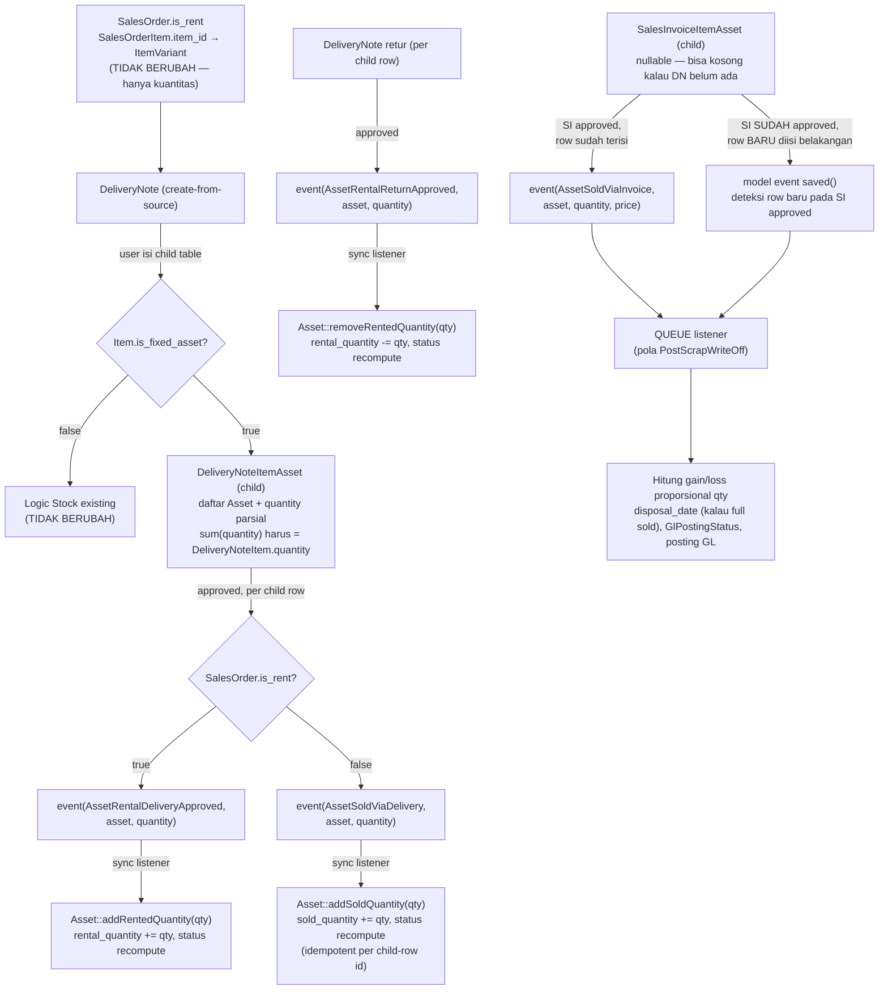

# Design Document: Asset Rental Migration

## Overview

Spec ini migrasikan gate kelayakan rental dari `ItemVariant.type == 'vehicle'` (hardcode) ke `AssetCategory.is_rentable`, dan sekaligus mengimplementasikan `Asset::sell()` (masih stub sejak Spec 1) — keduanya berbagi mekanisme yang sama.

**Keputusan arsitektur kunci 1**: `SalesOrder`/`SalesOrderItem` TIDAK berubah sama sekali — tetap murni `ItemVariant`-based, cukup ditandai `Item.is_fixed_asset` (sudah ada sejak Spec 2). SO hanya menyatakan "baris ini butuh N unit dari Item fixed-asset X", BUKAN menunjuk unit fisik tertentu — identik dengan cara SO menangani barang stok biasa (SO pilih ItemVariant+quantity, unit/serial spesifik resolve di level DeliveryNote). Unit `Asset` spesifik BARU dipilih user di level `DeliveryNoteItem`/`SalesInvoiceItem` — inilah yang berubah, bukan `SalesOrderItem`.

**Keputusan arsitektur kunci 2 — quantity parsial**: Satu `Asset` bisa punya `asset_quantity > 1` HANYA kalau `AssetCategory.allow_bulk_quantity = true` (field baru, DIIMPLEMENTASI di sesi ini — lihat Data Models & catatan di bawah; menggantikan validasi lama yang keliru mengizinkan bulk secara implisit untuk SEMUA kategori non-rentable). Contoh: 50 kursi kantor dalam 1 baris Asset (kategori "Furniture", `allow_bulk_quantity=true`) — lihat Spec 1 "Field Asset Utama". Satu `DeliveryNoteItem`/`SalesInvoiceItem` (quantity bisa > 1) tidak bisa direpresentasikan 1 FK `asset_id` tunggal — butuh child table (`DeliveryNoteItemAsset`, `SalesInvoiceItemAsset`) berisi daftar Asset + quantity parsial per Asset yang mengisi baris itu. `Asset` sendiri dapat 2 kolom counter baru (`rental_quantity`, `sold_quantity`) untuk mencegah over-transaksi across banyak dokumen, dan status Asset dapat 2 case baru (`PARTIALLY_RENTED`, `PARTIALLY_SOLD`) untuk merepresentasikan kondisi "sebagian keluar, sebagian masih available" — pola ini SESUAI SEMANGAT array-status yang sudah diputuskan sejak Spec 1 (status bisa merepresentasikan banyak dimensi independen sekaligus).

Untuk kasus Asset rental (SELALU `asset_quantity=1`, dipaksa `Asset::booted()` existing sejak Spec 1), child table ini secara natural collapse jadi 1 baris (`quantity=1`) — behavior binary lama (ACTIVE↔IN_RENT) tetap berlaku tanpa perubahan tambahan untuk kasus paling umum ini.

Pattern utama yang direuse: `DeliveryNoteItem` skip-stock (pola "Jual Asset" dari brainstorming awal modul), `assertStatusTransition()`/method dedicated Asset (pola Spec 1: `scrap()`, `setInMaintenance()`), Event/Listener (sync untuk transisi status ringan — pola Spec 4/5 — queue untuk posting GL kompleks — pola Spec 3 `PostScrapWriteOff`), `Item.is_fixed_asset` (sudah ada sejak Spec 2), `AssetService::split()` (Spec 1/2, TIDAK dipakai wajib di sini tapi tetap tersedia sebagai alternatif user kalau mau pecah Asset fisik).

Yang TIDAK berubah: `SalesOrder`/`SalesOrderItem` — form, validasi, dan struktur data TIDAK disentuh. `AssetMovement` (Spec 4) tetap khusus Issue/Receipt/Transfer internal. `RentalDurationService` (spec `rental-actual-duration`, live) tidak disentuh — baca `DeliveryNote.delivery_date` apa adanya. Logic Stock untuk baris item_variant biasa (non-fixed-asset) tidak berubah.

## Architecture



### Data Flow — Rental
1. User buat `SalesOrder` (`is_rent=true`), baris pilih `ItemVariant` yang `Item.is_fixed_asset=true` — TIDAK ada perubahan form/validasi SO.
2. Create-from-source `DeliveryNote` — baris `DeliveryNoteItem` untuk Item fixed-asset menampilkan child table `DeliveryNoteItemAsset` KOSONG, user isi manual: pilih 1+ Asset (filter: `Asset.item_id` cocok, `available_quantity > 0`) + quantity per Asset — total harus sama dengan `DeliveryNoteItem.quantity`.
3. `DeliveryNote` approve → `DeliveryNoteService::onApproved()` deteksi baris py child `DeliveryNoteItemAsset` → skip logic Stock sepenuhnya → per child row: dispatch `AssetRentalDeliveryApproved(asset, quantity)` → listener sync → `Asset::addRentedQuantity(quantity)`.
4. Barang kembali: `DeliveryNote` retur (create-from-source dari DN awal, child row `asset_id`+`quantity` tersalin dari DN asal — bukan pilih ulang, TAPI user boleh kurangi quantity kalau retur sebagian) → approve → dispatch `AssetRentalReturnApproved(asset, quantity)` → listener sync → `Asset::removeRentedQuantity(quantity)`.
5. `RentalDurationService`/`SalesInvoiceController` prefill amount — TIDAK BERUBAH.

### Data Flow — Jual Putus
1. User buat `SalesOrder` (`is_rent=false`), baris pilih `ItemVariant` Item fixed-asset — sama seperti rental di level SO.
2. `DeliveryNote` — user isi child table `DeliveryNoteItemAsset` (Asset+quantity). Approve → per child row: dispatch `AssetSoldViaDelivery(asset, quantity)` → listener sync → `Asset::addSoldQuantity(quantity)` (status `SOLD`/`PARTIALLY_SOLD` sesuai threshold, TIDAK hitung gain/loss di titik ini).
3. `SalesInvoice` — dibuat dari SO. Child table `SalesInvoiceItemAsset` **boleh kosong saat SI dibuat** (kalau DN belum ada) — user isi manual atau di-prefill dari `DeliveryNoteItemAsset` yang match kalau DN sudah ada. SI tetap boleh disubmit/di-approve walau child table kosong.
4. WHEN SI approve DAN child row sudah terisi saat itu → dispatch `AssetSoldViaInvoice(asset, quantity, proportionalPrice)` per row.
5. WHEN SI SUDAH approved (child table masih kosong/sebagian) DAN belakangan row baru ditambahkan → model event `saved()` pada `SalesInvoiceItemAsset` mendeteksi row baru pada parent SI yang sudah approved → dispatch `AssetSoldViaInvoice` saat itu juga.
6. Listener `PostAssetDisposalGainLoss` (queue, per child row) hitung `gain/loss = (SalesInvoiceItem.price / SalesInvoiceItem.quantity * row.quantity) - (Asset::bookValue() proporsional row.quantity/asset.asset_quantity)`, buat `GlPostingStatus`, posting GL. `disposal_date` Asset diisi HANYA ketika `available_quantity` Asset mencapai 0 (full terjual — untuk Asset qty=1 ini selalu terjadi sekaligus).
7. Idempotency: `Asset::addSoldQuantity()` per child-row-id (bukan per Asset) — 1 child row hanya boleh trigger increment counter TEPAT SEKALI, dijamin via kolom `processed_at`/event-sourcing sederhana di child row (lihat Correctness Property 4).

## Components and Interfaces

### Migrations

```php
// create_delivery_note_item_assets_table
Schema::create('delivery_note_item_assets', function (Blueprint $table) {
    $table->ulid('id')->primary();
    $table->foreignUlid('delivery_note_item_id')->references('id')->on('delivery_note_items')->cascadeOnDelete();
    $table->foreignUlid('asset_id')->references('id')->on('assets')->restrictOnDelete();
    $table->decimal('quantity', 15, 4);
    $table->timestamp('processed_at')->nullable(); // guard idempotency dispatch event, diisi saat listener selesai proses
    $table->timestamps();
});

// create_sales_invoice_item_assets_table
Schema::create('sales_invoice_item_assets', function (Blueprint $table) {
    $table->ulid('id')->primary();
    $table->foreignUlid('sales_invoice_item_id')->references('id')->on('sales_invoice_items')->cascadeOnDelete();
    $table->foreignUlid('asset_id')->references('id')->on('assets')->restrictOnDelete();
    $table->decimal('quantity', 15, 4);
    $table->timestamp('processed_at')->nullable();
    $table->timestamps();
});

// add_rental_sold_quantity_to_assets_table
Schema::table('assets', function (Blueprint $table) {
    $table->decimal('rental_quantity', 15, 4)->default(0);
    $table->decimal('sold_quantity', 15, 4)->default(0);
});

// add_gain_loss_disposal_account_id_to_asset_category_accounts_table
Schema::table('asset_category_accounts', function (Blueprint $table) {
    $table->foreignUlid('gain_loss_disposal_account_id')->nullable()
        ->references('id')->on('accounts')->nullOnDelete();
});
```
CATATAN: `sales_order_items` TIDAK mendapat kolom/tabel baru apapun — sesuai Keputusan arsitektur kunci 1. `delivery_note_items`/`sales_invoice_items` sendiri TIDAK mendapat kolom `asset_id` langsung (beda dari draft sebelumnya) — semua lewat child table.

### Model changes

```php
// app/Models/Inventory/DeliveryNoteItem.php
public function assetLines(): HasMany {
    return $this->hasMany(DeliveryNoteItemAsset::class);
}

// app/Models/Inventory/DeliveryNoteItemAsset.php (baru, child, no DataTable)
class DeliveryNoteItemAsset extends Model {
    use HasUlids, SoftDeletes;
    public static $parentRelation = 'deliveryNoteItem';
    protected $guarded = ['id'];
    protected $casts = ['quantity' => 'float', 'processed_at' => 'datetime'];

    public function deliveryNoteItem(): BelongsTo {
        return $this->belongsTo(DeliveryNoteItem::class);
    }
    public function asset(): BelongsTo {
        return $this->belongsTo(Asset::class);
    }
}

// app/Models/Finances/SalesInvoiceItem.php
public function assetLines(): HasMany {
    return $this->hasMany(SalesInvoiceItemAsset::class);
}

// app/Models/Finances/SalesInvoiceItemAsset.php (baru, child, no DataTable)
class SalesInvoiceItemAsset extends Model {
    use HasUlids, SoftDeletes;
    public static $parentRelation = 'salesInvoiceItem';
    protected $guarded = ['id'];
    protected $casts = ['quantity' => 'float', 'processed_at' => 'datetime'];

    public function salesInvoiceItem(): BelongsTo {
        return $this->belongsTo(SalesInvoiceItem::class);
    }
    public function asset(): BelongsTo {
        return $this->belongsTo(Asset::class);
    }

    protected static function booted(): void {
        static::created(function (self $row) {
            $invoice = $row->salesInvoiceItem->salesInvoice;
            if (\in_array(FormStatus::APPROVED, $invoice->status ?? [], true)) {
                event(new AssetSoldViaInvoice($row));
            }
        });
    }
}

// app/Models/Asset/AssetCategoryAccount.php
public function gainLossDisposalAccount(): BelongsTo {
    return $this->belongsTo(Account::class, 'gain_loss_disposal_account_id');
}
```

### Asset.php — accessor + method baru (kuantitas-aware, pola sama `scrap()`)

```php
protected function availableQuantity(): Attribute {
    return Attribute::get(fn () => (float) $this->asset_quantity - (float) $this->rental_quantity - (float) $this->sold_quantity);
}

public function addRentedQuantity(float $quantity): void {
    if ($quantity > $this->available_quantity) {
        throw new LogicException(__('asset/asset.insufficient_available_quantity'));
    }
    $this->rental_quantity += $quantity;
    $this->recomputeStatus(FormStatus::IN_RENT, FormStatus::PARTIALLY_RENTED, $this->rental_quantity);
    $this->save();
}

public function removeRentedQuantity(float $quantity): void {
    $this->rental_quantity = max(0, $this->rental_quantity - $quantity);
    $this->recomputeStatus(FormStatus::IN_RENT, FormStatus::PARTIALLY_RENTED, $this->rental_quantity);
    $this->save();
}

public function addSoldQuantity(float $quantity): void {
    if ($quantity > $this->available_quantity) {
        throw new LogicException(__('asset/asset.insufficient_available_quantity'));
    }
    $this->sold_quantity += $quantity;
    $this->recomputeStatus(FormStatus::SOLD, FormStatus::PARTIALLY_SOLD, $this->sold_quantity);
    if ($this->available_quantity <= 0) {
        $this->disposal_date ??= now();
    }
    $this->save();
}

/**
 * Tambah/hapus status full/partial berdasar threshold quantity, JAGA ACTIVE
 * tetap ada selama available_quantity > 0 (Correctness Property 6).
 */
private function recomputeStatus(FormStatus $fullStatus, FormStatus $partialStatus, float $movedQuantity): void {
    $statuses = $this->removeStatuses([$fullStatus, $partialStatus, FormStatus::ACTIVE]);
    if ($movedQuantity <= 0) {
        $statuses[] = FormStatus::ACTIVE;
    } elseif ($this->available_quantity <= 0) {
        $statuses[] = $fullStatus;
    } else {
        $statuses = [...$statuses, FormStatus::ACTIVE, $partialStatus];
    }
    $this->status = $statuses;
}
```

`sell()` (stub lama, dipanggil manual dari Controller action utk kasus non-SO) TETAP ADA sbg one-shot penuh: `addSoldQuantity($this->asset_quantity)` — sell manual selalu jual semua sisa quantity sekaligus, beda dari alur SO/DN yang kuantitas-parsial.

### DeliveryNoteService::onApproved() — branch di awal loop

```php
foreach ($items as $item) {
    if ($item->item->is_fixed_asset) {
        $this->handleAssetDeliveryItem($item, $deliveryNote, $returnAgainst);
        continue; // skip SEMUA logic Stock existing — Item fixed-asset TIDAK generate StockLedgerEntry
    }

    $availableToRent = $toReference->is_rent; // gate lama '$item->item->type == vehicle' DIHAPUS total
    // ... logic existing tidak berubah untuk baris item_variant biasa
}
```

```php
private function handleAssetDeliveryItem($item, $deliveryNote, $returnAgainst): void {
    $item->referenceable->increment('delivered_quantity', $item->quantity); // field existing

    $so = $item->referenceable->salesOrder;
    foreach ($item->assetLines as $line) {
        if ($returnAgainst) {
            event(new AssetRentalReturnApproved($line));
        } elseif ($so->is_rent) {
            event(new AssetRentalDeliveryApproved($line));
        } else {
            event(new AssetSoldViaDelivery($line));
        }
    }
}
```

Untuk DN retur, `DeliveryNoteItemAsset` disalin otomatis (asset_id + quantity, quantity boleh dikurangi user kalau retur sebagian) dari child DN asal saat create-from-source retur.

### Events/Listeners

```php
// app/Events/Asset/AssetRentalDeliveryApproved.php, AssetRentalReturnApproved.php, AssetSoldViaDelivery.php
// Constructor: public readonly DeliveryNoteItemAsset $line

// app/Listeners/Asset/Rental/SetAssetInRent.php (sync)
public function handle(AssetRentalDeliveryApproved $event): void {
    if ($event->line->processed_at) return; // idempotency guard
    $event->line->asset->addRentedQuantity($event->line->quantity);
    $event->line->update(['processed_at' => now()]);
}

// ReturnAssetFromRent.php, MarkAssetSoldFromDelivery.php — pola identik (sync, guard processed_at)
```

```php
// app/Events/Asset/AssetSoldViaInvoice.php
// Constructor: public readonly SalesInvoiceItemAsset $line
// Dispatch dari: SalesInvoiceItemAsset::booted() created() hook (row baru pada SI approved)
// DAN SalesInvoiceService::onApproved() (loop assetLines existing saat approval pertama kali)

// app/Listeners/Asset/Rental/PostAssetDisposalGainLoss.php implements ShouldQueue (pola PostScrapWriteOff)
public function handle(AssetSoldViaInvoice $event): void {
    DB::transaction(function () use ($event) {
        $line  = $event->line->fresh();
        if ($line->processed_at) return; // idempotency guard — 1 row = proses 1x
        $asset = $line->asset;

        $parentItem      = $line->salesInvoiceItem;
        $proportionPrice = $parentItem->quantity > 0 ? ($parentItem->price / $parentItem->quantity) * $line->quantity : 0;
        $proportionBook  = $asset->asset_quantity > 0 ? $asset->bookValue() * ($line->quantity / $asset->asset_quantity) : 0;
        $gainLoss        = $proportionPrice - $proportionBook;

        $accounts = $asset->assetCategory?->accounts()->where('branch_id', $asset->branch()?->id)->first();
        // ... posting GL: debit/credit fixedAssetAccount, accumulatedDepreciationAccount,
        //     gainLossDisposalAccount sesuai tanda $gainLoss, proporsional line->quantity

        $line->update(['processed_at' => now()]);
        // GlPostingStatus create + update status POSTED, pola persis PostScrapWriteOff
    });
}
```

### FormRequest — TIDAK ADA perubahan di SalesOrderRequest

Validasi child table ada di **`DeliveryNoteRequest`**/**`SalesInvoiceRequest`** (bukan SO):
```php
'items.*.assetLines'            => ['nullable', 'array'],
'items.*.assetLines.*.asset_id' => ['required_with:items.*.assetLines', 'string', 'exists:assets,id'],
'items.*.assetLines.*.quantity' => ['required_with:items.*.assetLines', 'numeric', 'min:0.0001'],
```
Validasi `sum(assetLines.*.quantity) == item.quantity`, `AssetCategory.is_rentable`, dan `available_quantity >= requested` dilakukan di service layer (`DeliveryNoteService`/`SalesInvoiceService`), konsisten pola `AssetServiceService::validateAssetNotTerminal()` Spec 5.

### Frontend

**`resources/js/Pages/Sales/SalesOrders/*`** — TIDAK ADA perubahan (Correctness Property 1).

**`resources/js/Pages/Inventory/DeliveryNotes/Form.jsx`** (nama file perlu dikonfirmasi saat implementasi) — baris item dengan `item.is_fixed_asset` menampilkan nested `FormTable` kedua (mirip `AssetMovementItems`/`AssetServiceConsumedItems` Spec 4/5) di bawah baris utama: kolom `asset` (`AssetLinkModel`, filter item cocok + `available_quantity > 0`) dan `quantity`. Validasi FE: `sum(quantity)` harus sama dengan `quantity` baris induk sebelum submit.

**`resources/js/Pages/Finances/SalesInvoice/Form.jsx`** — sama, nested `FormTable` child asset lines per baris fixed-asset — boleh dikosongkan kalau DN belum tersedia, atau di-prefill dari `DeliveryNoteItemAsset` yang match.

**`resources/js/Pages/Sales/SalesOrders/Show.jsx`** — `RentalDurationTable`: TIDAK berubah, nama baris tetap `item.item_name ?? item.item?.name` (SO tidak py Asset spesifik).

**`resources/js/Pages/Asset/Categories/Form.jsx`** — gap pre-existing (`AssetCategoryAccount` tidak py UI sejak Spec 1) TETAP TIDAK diperbaiki di spec ini — `gain_loss_disposal_account_id` diisi manual via seeder/tinker untuk testing.

## Data Models

**`asset_categories`**: + `allow_bulk_quantity` (boolean, default false) — **SUDAH DIIMPLEMENTASI** (mendahului task lain di spec ini, atas permintaan eksplisit saat brainstorming). Migration `2026_08_16_000001_add_allow_bulk_quantity_to_asset_categories_table.php`, cast di `AssetCategory.php`, validasi `Asset::booted()` direvisi (cek `category.allow_bulk_quantity` bukan lagi `!category.is_rentable`), FormRequest, lang (`asset/category.php` key baru + `asset/asset.php` pesan `rentable_must_be_single_unit` direvisi wordingnya), FE checkbox di `Categories/Form.jsx`, test `AssetTest.php` direvisi (`non_rentable_category_allows_quantity_greater_than_one` → 2 test baru: `category_with_allow_bulk_quantity_allows_...` dan `non_bulk_category_rejects_...`). Semua sudah pass, Pint/ESLint clean.

**`delivery_note_item_assets`** (baru): `delivery_note_item_id` (FK cascade), `asset_id` (FK restrict), `quantity` (decimal), `processed_at` (nullable, idempotency guard).

**`sales_invoice_item_assets`** (baru): struktur identik, `sales_invoice_item_id` (FK cascade) sbg pengganti `delivery_note_item_id`.

**`assets`**: + `rental_quantity` (decimal, default 0), + `sold_quantity` (decimal, default 0). Accessor `available_quantity` (computed, TIDAK disimpan) = `asset_quantity - rental_quantity - sold_quantity`.

**`asset_category_accounts`**: + `gain_loss_disposal_account_id` (FK accounts, nullable).

**`sales_order_items`**, **`delivery_note_items`**, **`sales_invoice_items`**: TIDAK ADA kolom baru langsung — semua akses Asset lewat child table relasi `assetLines`.

**`FormStatus` enum**: + 2 case baru `PARTIALLY_RENTED` (`partially_rented`), `PARTIALLY_SOLD` (`partially_sold`) — mengikuti konvensi `PARTIALLY_X` existing (`PARTIALLY_PAID`, `PARTIALLY_DELIVERED`, dst). `IN_RENT` dan `SOLD` sudah ada, dipakai untuk kasus full (available_quantity=0).

## Correctness Properties

1. **SalesOrder tak tersentuh**: Tidak ada baris kode di `app/Models/Sales/SalesOrder.php`, `SalesOrderItem.php`, `SalesOrderRequest.php`, `resources/js/Pages/Sales/SalesOrders/Form.jsx` yang berubah — diverifikasi diff kosong di akhir implementasi.
2. **Stock isolation**: Baris `DeliveryNoteItem` dengan `item.is_fixed_asset=true` TIDAK PERNAH menghasilkan `StockLedgerEntry` — dijamin branch awal (`continue`) sebelum logic Stock manapun tereksekusi.
3. **Availability guard natural (DN-time)**: `Asset::addRentedQuantity()`/`addSoldQuantity()` menolak (`LogicException`) kalau `quantity` yang diminta melebihi `available_quantity` saat itu — SO TIDAK melakukan reservasi apapun, konflik antar-SO terdeteksi natural saat DN submit (mirip race-condition stock biasa).
4. **Idempotency per child row (bukan per Asset)**: Tiap `DeliveryNoteItemAsset`/`SalesInvoiceItemAsset` row hanya boleh memicu efek samping (increment counter Asset, posting GL) TEPAT SEKALI — dijamin kolom `processed_at`: listener SKIP kalau `processed_at` sudah terisi, guard ini independen dari status Asset (beda dari `Asset::sell()` versi lama yang idempotent berdasar status).
5. **Quantity conservation**: `sum(assetLines.*.quantity)` pada satu `DeliveryNoteItem`/`SalesInvoiceItem` SELALU sama dengan `quantity` baris induk — divalidasi service layer sebelum submit/approve.
6. **ACTIVE dipertahankan selama available_quantity > 0**: Status Asset SELALU mengandung `ACTIVE` selama `available_quantity > 0`, ditambah `PARTIALLY_RENTED`/`PARTIALLY_SOLD` kalau ada quantity yang sedang keluar — kombinasi bisa lebih dari 1 (mis. `[ACTIVE, PARTIALLY_RENTED, PARTIALLY_SOLD]`). Status `IN_RENT`/`SOLD` (tanpa `ACTIVE`) HANYA saat `available_quantity = 0`.
7. **RentalDurationService tak tersentuh**: Tidak ada baris kode di `RentalDurationService.php` yang berubah — diverifikasi diff kosong di akhir implementasi.

## Error Handling

| Scenario | Behavior |
|----------|----------|
| Child row `asset_id` dipilih tapi `AssetCategory.is_rentable = false` | `LogicException` di service, pesan `asset/asset.category_not_rentable` |
| Child row quantity melebihi `available_quantity` Asset saat itu | `LogicException` dari `addRentedQuantity()`/`addSoldQuantity()`, pesan `asset/asset.insufficient_available_quantity` — SATU-SATUNYA titik guard availability (Correctness Property 3) |
| Child row `asset_id` dipilih tapi `Asset.item_id` tidak cocok `item_variant_id` baris induk | `LogicException`, pesan `asset/asset.item_mismatch` |
| `sum(assetLines.*.quantity) != DeliveryNoteItem.quantity` saat submit | Validasi ditolak `422`, pesan `asset/asset.quantity_mismatch` |
| `DeliveryNote` retur untuk baris jual-putus (`is_rent=false`) — seharusnya tidak terjadi di FE | Tidak dispatch event apapun (jual-putus tidak py retur), qty referenceable tetap di-decrement field existing |
| Listener dipanggil ulang pada row yang `processed_at` sudah terisi (retry queue/race) | SKIP total, tidak ada efek samping kedua kali (Correctness Property 4) |
| `PostAssetDisposalGainLoss` gagal (mis. `gain_loss_disposal_account_id` belum diisi) | `ShouldQueue` retry (`$tries=3`), `GlPostingStatus` di-mark `FAILED` setelah retry habis |

## Testing Strategy

- **Unit tests**: `Asset::addRentedQuantity()`/`removeRentedQuantity()`/`addSoldQuantity()` (threshold status ACTIVE/PARTIALLY_X/full-X, guard insufficient quantity), accessor `available_quantity`, relasi `assetLines()` baru di `DeliveryNoteItem`/`SalesInvoiceItem`.
- **Feature tests**: `DeliveryNoteService::onApproved()` per child row (rental: `rental_quantity` bertambah + status tepat; jual-putus: `sold_quantity` bertambah, TIDAK ada `StockLedgerEntry`), validasi `sum(quantity)` mismatch, guard availability lintas-dokumen (2 DN rebutan Asset sama), listener `PostAssetDisposalGainLoss` (gain/loss proporsional benar, idempotent via `processed_at`), model event `created()` `SalesInvoiceItemAsset` (dispatch tepat sekali saat row baru pada SI approved).
- **Regression tests**: jalankan ulang test existing `tests/Feature/Sales/*`, `tests/Unit/Sales/*`, `tests/Unit/RentalDurationServiceTest.php`, `tests/Feature/RentalDurationCalculationTest.php`, `tests/Feature/SalesInvoiceRentalPrefillTest.php` — SEMUA harus tetap pass tanpa modifikasi (Correctness Property 1, 7).
