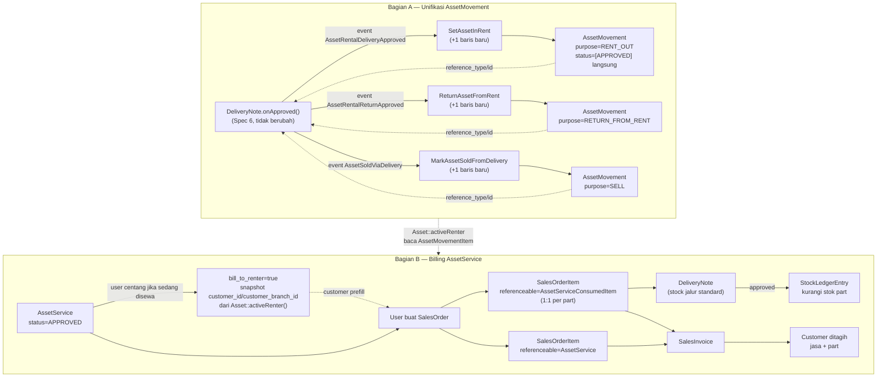

# Design Document: asset-service-billing

## Overview

Dua bagian berurutan (Bagian A jadi fondasi Bagian B):

**Bagian A** memperluas `AssetMovement`/`AssetMovementItem` (Spec 4) supaya mencakup rental dan sale (gap dari `asset-rental-migration`/Spec 6, yang hanya mencatat `Asset.rental_quantity`/`sold_quantity` tanpa identitas penyewa/pembeli). `AssetMovement` untuk rental/sale dibuat OTOMATIS (status langsung `APPROVED`, bypass approval chain) di dalam listener Spec 6 yang sudah ada (`SetAssetInRent`, `ReturnAssetFromRent`, `MarkAssetSoldFromDelivery`), dipicu saat `DeliveryNote` terkait di-approve — bukan proses independen.

**Bagian B** menghubungkan `AssetService` (Spec 5, repair/maintenance) ke billing customer lewat `SalesOrder → DeliveryNote → SalesInvoice`. Arah referensi baru SELALU dari Sales/Inventory menunjuk KE Asset domain (`SalesOrderItem.referenceable` → `AssetService`/`AssetServiceConsumedItem`), bukan sebaliknya — kecuali 1 pengecualian sengaja: `AssetService` mendapat kolom snapshot `customer_id`/`customer_branch_id` (FK ke master data, bukan ke dokumen transaksi) untuk kasus Asset company-owned yang sedang disewa.

**Yang TIDAK berubah**: `SalesOrder`/`SalesOrderItem` untuk kasus ItemVariant biasa (perilaku existing 100% sama — `referenceable` nullable, default null). Logic `Asset.rental_quantity`/`sold_quantity`/status transition Spec 6 tidak diubah sama sekali, hanya ditambah 1 baris kode per listener. `DeliveryNoteService::onApproved()` stock logic existing tidak disentuh — baris part AssetService memakai jalur stock STANDARD (ItemVariant biasa), bukan jalur `is_fixed_asset` Spec 6.

## Architecture



### Data Flow — Bagian A

1. `DeliveryNoteService::onApproved()` (tidak berubah) memproses baris fixed-asset, dispatch event Spec 6 seperti biasa.
2. Listener (`SetAssetInRent` dkk) — SETELAH baris `addRentedQuantity()`/`addSoldQuantity()` existing — menambah 1 pemanggilan baru: `AssetMovementService::createFromRentalSale($line, purpose)` (helper baru, lihat Components).
3. Helper ini membuat `AssetMovement` (status `[FormStatus::APPROVED]` langsung, `reference_type=DeliveryNote::class`, `reference_id=$deliveryNote->id`) + `AssetMovementItem` (asset_id, quantity dari `$line->quantity`, customer_id/customer_branch_id diambil dari `$line->deliveryNoteItem->deliveryNote->referenceable` yaitu `SalesOrder`).
4. Idempotency: guard SAMA dengan guard `processed_at` yang sudah ada di listener (helper dipanggil di dalam blok yang sama, setelah guard `if ($line->processed_at) return;`).

### Data Flow — Bagian B

1. `AssetService` mencapai status `APPROVED` (existing, Spec 5).
2. JIKA `Asset::activeRenter()` (baca dari Bagian A) mengembalikan hasil non-null, FE menampilkan checkbox `bill_to_renter`. User centang → backend snapshot `customer_id`/`customer_branch_id` ke kolom AssetService, dibekukan (tidak berubah lagi otomatis).
3. User membuat `SalesOrder` baru (alur normal, FE), lalu menambah baris via `LinkModel` baru `AssetServiceLinkModel`/`AssetServiceConsumedItemLinkModel` yang mengisi `referenceable`. Customer di-prefill dari `AssetService.customer_id` (jika `bill_to_renter`) atau `Asset.ownershipCustomer` (jika ownership customer) — user tetap bisa override manual.
4. `SalesOrderRequest` divalidasi: setiap `referenceable_type=AssetService`/`AssetServiceConsumedItem` harus mengarah ke record berstatus `APPROVED`.
5. `DeliveryNote` dibuat dari baris part (jalur stock STANDARD, bukan `is_fixed_asset`) — approve mengurangi stok seperti biasa.
6. `SalesInvoice` dibuat dari baris jasa dan/atau part, urutan bebas terhadap DeliveryNote (sama seperti alur SO normal, `unbilled_quantity`).

## Components and Interfaces

### Bagian A

**`app/Enums/AssetMovementPurpose.php`** — tambah 3 case:
```php
enum AssetMovementPurpose: string {
    case ISSUE              = 'issue';
    case RECEIPT            = 'receipt';
    case TRANSFER           = 'transfer';
    case TRANSFER_AND_ISSUE = 'transfer_and_issue';
    case RENT_OUT           = 'rent_out';
    case RETURN_FROM_RENT   = 'return_from_rent';
    case SELL                = 'sell';
}
```

**Migration** `add_customer_columns_to_asset_movement_items_table`:
```php
Schema::table('asset_movement_items', function (Blueprint $table) {
    $table->foreignUlid('customer_id')->nullable()->after('to_custodian_id')
        ->references('id')->on('customers')->nullOnDelete();
    $table->foreignUlid('customer_branch_id')->nullable()->after('customer_id')
        ->references('id')->on('branches')->nullOnDelete();
    $table->decimal('quantity', 15, 4)->default(1)->after('asset_id');
});
```

**`app/Models/Asset/AssetMovementItem.php`** — tambah relasi + cast:
```php
protected $casts = ['quantity' => 'float'];

public function customer(): BelongsTo {
    return $this->belongsTo(Customer::class);
}
public function customerBranch(): BelongsTo {
    return $this->belongsTo(Branch::class, 'customer_branch_id');
}
```

**`app/Services/Asset/AssetMovementService.php`** — tambah method baru (dipanggil listener Spec 6, TIDAK mengubah method existing):
```php
public function createFromRentalSale(
    DeliveryNoteItemAsset $line,
    AssetMovementPurpose $purpose,
): AssetMovement {
    $salesOrder = $line->deliveryNoteItem->deliveryNote->referenceable;

    $movement = AssetMovement::create([
        'code'             => FormatingSeries::generate(AssetMovement::class, [], true),
        'purpose'          => $purpose,
        'transaction_date' => now(),
        'status'           => [FormStatus::APPROVED],
        'reference_type'   => DeliveryNote::class,
        'reference_id'     => $line->deliveryNoteItem->delivery_note_id,
    ]);

    $movement->items()->create([
        'asset_id'           => $line->asset_id,
        'quantity'           => $line->quantity,
        'customer_id'        => $salesOrder instanceof SalesOrder ? $salesOrder->customer_id : null,
        'customer_branch_id' => $salesOrder instanceof SalesOrder ? $salesOrder->customer_branch_id : null,
    ]);

    return $movement;
}
```

**Listener Spec 6, contoh `SetAssetInRent.php`** (+1 baris, TIDAK ubah logic existing):
```php
class SetAssetInRent {
    public function __construct(private AssetMovementService $assetMovementService) {}

    public function handle(AssetRentalDeliveryApproved $event): void {
        $line = $event->line;
        if ($line->processed_at) {
            return;
        }

        $line->asset->addRentedQuantity($line->quantity);
        $this->assetMovementService->createFromRentalSale($line, AssetMovementPurpose::RENT_OUT); // BARU
        $line->update(['processed_at' => now()]);
    }
}
```
Pola sama untuk `ReturnAssetFromRent` (`RETURN_FROM_RENT`) dan `MarkAssetSoldFromDelivery` (`SELL`).

**`app/Models/Asset/Asset.php`** — tambah method baru:
```php
public function activeRenter(): ?AssetMovementItem {
    $lastRentOut = $this->assetMovementItems()
        ->whereHas('assetMovement', fn ($q) => $q->where('purpose', AssetMovementPurpose::RENT_OUT))
        ->latest('created_at')
        ->first();

    if (! $lastRentOut) {
        return null;
    }

    $hasReturn = $this->assetMovementItems()
        ->whereHas('assetMovement', fn ($q) => $q->where('purpose', AssetMovementPurpose::RETURN_FROM_RENT))
        ->where('created_at', '>', $lastRentOut->created_at)
        ->exists();

    return $hasReturn ? null : $lastRentOut;
}

public function assetMovementItems(): HasMany {
    return $this->hasMany(AssetMovementItem::class);
}
```

### Bagian B

**Migration** `add_referenceable_to_sales_order_items_table`:
```php
Schema::table('sales_order_items', function (Blueprint $table) {
    $table->string('referenceable_type')->nullable()->after('item_id');
    $table->ulid('referenceable_id')->nullable()->after('referenceable_type');
    $table->index(['referenceable_type', 'referenceable_id']);
});
```

**Migration** `add_ownership_customer_branch_id_to_assets_table`:
```php
Schema::table('assets', function (Blueprint $table) {
    $table->foreignUlid('ownership_customer_branch_id')->nullable()->after('ownership_customer_id')
        ->references('id')->on('branches')->nullOnDelete();
});
```

**Migration** `add_bill_to_renter_columns_to_asset_services_table`:
```php
Schema::table('asset_services', function (Blueprint $table) {
    $table->boolean('bill_to_renter')->default(false)->after('completion_date');
    $table->foreignUlid('customer_id')->nullable()->after('bill_to_renter')
        ->references('id')->on('customers')->nullOnDelete();
    $table->foreignUlid('customer_branch_id')->nullable()->after('customer_id')
        ->references('id')->on('branches')->nullOnDelete();
});
```

**`app/Models/Sales/SalesOrderItem.php`** — tambah morph relasi (generik, TIDAK spesifik AssetService):
```php
public function referenceable(): MorphTo {
    return $this->morphTo();
}
```

**`app/Models/Asset/Asset.php`** — tambah relasi baru:
```php
public function ownershipCustomerBranch(): BelongsTo {
    return $this->belongsTo(Branch::class, 'ownership_customer_branch_id');
}
```

**`app/Models/Asset/AssetService.php`** — tambah field guarded biasa (bukan relasi baru ke Sales, sesuai Requirement 10.2):
```php
protected $casts = [
    // ...existing...
    'bill_to_renter' => 'boolean',
];

public function customer(): BelongsTo {
    return $this->belongsTo(Customer::class);
}
public function customerBranch(): BelongsTo {
    return $this->belongsTo(Branch::class, 'customer_branch_id');
}

public function billToRenter(): void {
    $renter = $this->resolvedAsset()?->activeRenter();
    if (! $renter) {
        throw new LogicException(__('asset/service.not_currently_rented'));
    }
    $this->update([
        'bill_to_renter' => true,
        'customer_id' => $renter->customer_id,
        'customer_branch_id' => $renter->customer_branch_id,
    ]);
}
```

**`app/Http/Requests/Sales/SalesOrderRequest.php`** — tambah validasi baris referenceable (custom rule/`withValidator`):
```php
'items.*.referenceable.type' => ['nullable', 'string', Rule::in([AssetService::class, AssetServiceConsumedItem::class])],
'items.*.referenceable.id'   => ['nullable', 'string'],
```
Plus `withValidator()` closure: untuk tiap item dengan `referenceable`, resolve model, cek `status` mengandung `APPROVED`, dan untuk `AssetServiceConsumedItem` cek belum ada `SalesOrderItem` lain yang menunjuk row yang sama (Requirement 4.3).

**`app/Services/Sales/SalesOrderService.php`** — di `fillItemRelations()`/method serupa yang existing, tambah pengisian `referenceable_type`/`referenceable_id` dari payload FE (tidak mengubah logic ItemVariant existing, cuma tambah cabang baru untuk field baru).

## Data Models

**`asset_movement_items`** (kolom baru):
| Kolom | Tipe | Keterangan |
|---|---|---|
| `quantity` | decimal(15,4), default 1 | Baru — sebelumnya tidak ada (Spec 4 selalu implisit 1 Asset penuh) |
| `customer_id` | FK nullable → customers | Terisi hanya purpose RENT_OUT/RETURN_FROM_RENT/SELL |
| `customer_branch_id` | FK nullable → branches | idem |

**`asset_movements.purpose`** (enum, tambahan): `rent_out`, `return_from_rent`, `sell`

**`sales_order_items`** (kolom baru): `referenceable_type` (string nullable), `referenceable_id` (ulid nullable)

**`assets`** (kolom baru): `ownership_customer_branch_id` (FK nullable → branches)

**`asset_services`** (kolom baru): `bill_to_renter` (boolean, default false), `customer_id` (FK nullable → customers, snapshot), `customer_branch_id` (FK nullable → branches, snapshot)

## Correctness Properties

**P1 (Bagian A)**: Untuk Asset manapun yang tidak pernah punya `AssetMovementItem` purpose `RENT_OUT`, `Asset::activeRenter()` SHALL selalu mengembalikan null.

**P2 (Bagian A)**: Untuk Asset dengan urutan `AssetMovementItem` [RENT_OUT, RETURN_FROM_RENT], `Asset::activeRenter()` SHALL mengembalikan null (sudah diretur).

**P3 (Bagian A)**: Untuk Asset dengan urutan [RENT_OUT, RETURN_FROM_RENT, RENT_OUT lagi], `Asset::activeRenter()` SHALL mengembalikan `AssetMovementItem` RENT_OUT yang KEDUA (paling baru), bukan yang pertama.

**P4 (Bagian A)**: `AssetMovement` untuk rental/sale SHALL selalu dibuat dengan status `[APPROVED]` langsung (tidak pernah `DRAFT`) — konsisten "bypass approval, DeliveryNote adalah gate".

**P5 (Bagian B)**: `SalesOrderItem` dengan `referenceable=AssetServiceConsumedItem` X SHALL ditolak jika sudah ada `SalesOrderItem` lain (non-soft-deleted) dengan `referenceable` yang sama.

**P6 (Bagian B)**: `SalesOrderItem` dengan `referenceable` manapun yang status AssetService-nya BUKAN `[..., APPROVED, ...]` SHALL selalu ditolak validasi.

**P7 (Bagian B)**: `AssetService.customer_id`/`customer_branch_id` (snapshot), setelah di-set oleh `billToRenter()`, SHALL TIDAK BERUBAH lagi walau `Asset::activeRenter()` untuk Asset yang sama berubah kemudian (mis. Asset diretur, disewa customer lain).

**P8**: `SalesOrderItem` dengan `referenceable=null` (default) SHALL berperilaku identik dengan `SalesOrderItem` sebelum spec ini ada — tidak ada regresi.

## Error Handling

| Scenario | Behavior |
|----------|----------|
| SalesOrderItem dibuat dengan referenceable ke AssetService berstatus DRAFT | ValidationException, pesan `sales/order.referenceable_not_approved` |
| SalesOrderItem dibuat dengan referenceable ke AssetServiceConsumedItem yang sudah dipakai baris lain | ValidationException, pesan `sales/order.referenceable_already_used` |
| `AssetService::billToRenter()` dipanggil padahal Asset tidak sedang disewa | LogicException, pesan `asset/service.not_currently_rented` |
| DeliveryNoteItem quantity > AssetServiceConsumedItem.quantity | ValidationException (existing validation pattern, pesan baru `asset/service.consumed_item_quantity_exceeded`) |
| Listener rental/sale gagal buat AssetMovement (mis. FormatingSeries error) | Exception menggelembung ke `DB::rollBack()` existing di `DeliveryNoteService::onApproved()` (pola sama seperti fix transaction-leak di Spec 6) — DeliveryNote gagal approve, user lihat error, retry aman |

## Testing Strategy

- **Unit Tests**: `Asset::activeRenter()` (P1-P3), `AssetMovementService::createFromRentalSale()` (P4), `AssetService::billToRenter()` (P7, guard "tidak sedang disewa")
- **Integration Tests**: listener Spec 6 (SetAssetInRent dkk) sekarang JUGA membuat AssetMovement — extend test existing Spec 6, jangan buat file baru terpisah kalau bisa nempel
- **Feature Tests**: SalesOrderRequest validasi referenceable (P5, P6), SalesOrderItem referenceable=null tidak regresi (P8), DeliveryNote approve baris part AssetService mengurangi stok standard, SalesInvoice bill baris jasa+part
- **Regression**: full re-run test suite Spec 6 (`tests/Unit/Asset/AssetQuantityTest.php`, `tests/Unit/Listeners/Asset/Rental/*`, `tests/Feature/Inventory/DeliveryNoteServiceAssetBranchTest.php`) — pastikan +1 baris di listener tidak mengubah assertion existing manapun
