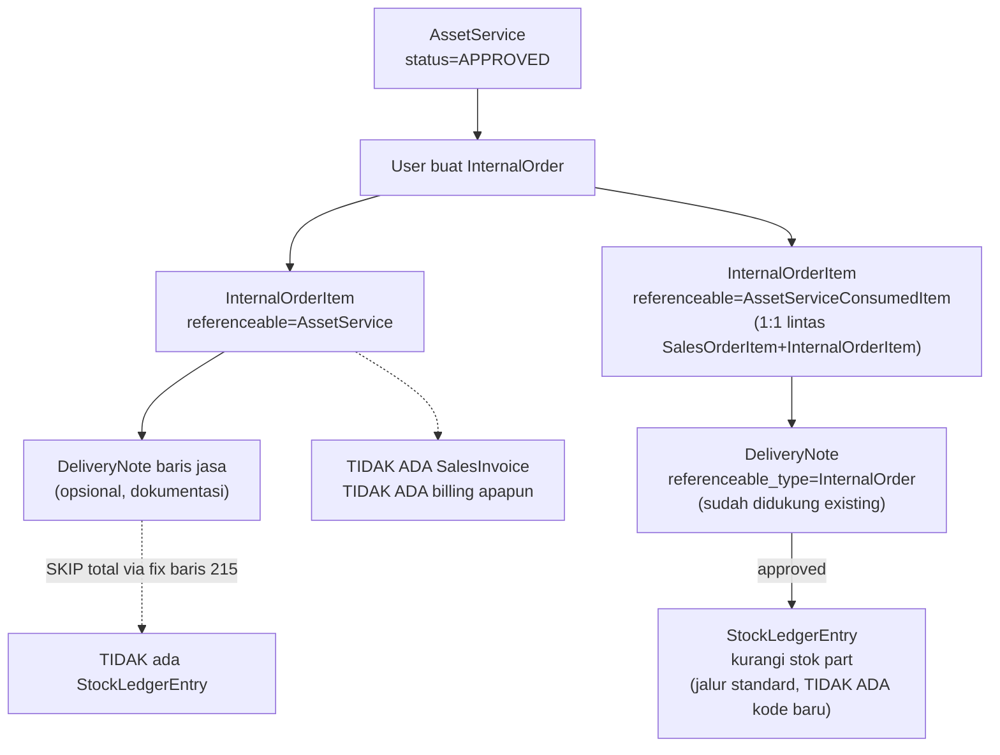

# Design Document: asset-service-internal-order

## Overview

Mirror arsitektur `asset-service-billing` (Spec 7a) ke `InternalOrder`, minus billing. `InternalOrderItem.referenceable` (morph generik yang sudah ada sejak migration awal, TIDAK pernah dipakai fitur apapun — beda dari `SalesOrderItem.referenceable` yang bentrok dengan `mergeItems()`) menghubungkan baris InternalOrder ke `AssetService` (jasa) atau `AssetServiceConsumedItem` (part, 1:1). Tidak ada `SalesInvoice`, tidak ada resolusi customer, tidak ada `bill_to_renter` — servis internal selesai tanpa tagihan apapun.

**Yang TIDAK berubah**: `InternalOrder`/`InternalOrderItem` untuk kasus ItemVariant biasa (referenceable=null, default) — perilaku existing 100% sama. Logic Stock/StockLedgerEntry standar untuk baris part InternalOrder — TIDAK perlu kode baru sama sekali, sudah otomatis lewat jalur `fillItemRelations()` existing yang sudah polymorphic terhadap `SalesOrderItem`/`InternalOrderItem`.

**Perbaikan wajib (bukan fitur baru, bug-fix kecil dalam scope)**: `DeliveryNoteService::onApproved()` baris "skip stok baris jasa AssetService" (ditambahkan di Spec 7a) hardcode `instanceof SalesOrderItem` — tanpa diperluas ke `InternalOrderItem`, baris jasa dari InternalOrder akan salah masuk jalur stock standar. Juga `InternalOrderRequest.rules()` punya `'items.*.item.id' => [..., 'distinct']` yang akan salah menolak dua baris `AssetServiceConsumedItem` berbeda yang kebetulan pakai `ItemVariant` sama — perlu dikecualikan untuk baris referenceable.

## Architecture



### Data Flow

1. `AssetService` mencapai status `APPROVED` (existing, Spec 5) — gate sama Spec 7a.
2. User membuat `InternalOrder` baru (alur normal FE), menambah baris via LinkModel baru (`AssetServiceLinkModel`/`AssetServiceConsumedItemLinkModel`, SUDAH ADA dari Spec 7a — reuse langsung, tidak perlu komponen baru) yang mengisi `referenceable`.
3. `InternalOrderRequest` divalidasi: setiap `referenceable_type=AssetService`/`AssetServiceConsumedItem` harus mengarah ke record berstatus `APPROVED`; `AssetServiceConsumedItem` harus belum dipakai baris manapun (SalesOrderItem MAUPUN InternalOrderItem, gabungan).
4. `DeliveryNote` (referenceable_type=`InternalOrder`, sudah didukung `DeliveryNoteRequest` existing) dibuat dari baris part — approve mengurangi stok lewat jalur standard, TANPA kode baru.
5. Baris jasa (referenceable=AssetService) di DeliveryNote — SETELAH fix baris 215 `DeliveryNoteService.php` — di-skip total dari Stock, hanya increment `delivered_quantity`.
6. TIDAK ADA langkah billing apapun — InternalOrder selesai begitu DeliveryNote (kalau ada baris part) approved, atau langsung dianggap selesai untuk baris jasa murni.

## Components and Interfaces

**`app/Models/Sales/InternalOrderItem.php`** — tambah relasi generik (pola identik `SalesOrderItem::referenceable()`):
```php
public function referenceable(): MorphTo {
    return $this->morphTo();
}
```

**`app/Services/Inventory/DeliveryNoteService.php`** — perluas kondisi existing (Spec 7a, baris ~215):
```php
// SEBELUM (Spec 7a, hanya SalesOrderItem):
if ($item->referenceable instanceof SalesOrderItem
    && $item->referenceable->referenceable_type === AssetService::class) {

// SESUDAH (spec ini, tambah InternalOrderItem):
if (($item->referenceable instanceof SalesOrderItem || $item->referenceable instanceof InternalOrderItem)
    && $item->referenceable->referenceable_type === AssetService::class) {
```
`InternalOrderItem` sudah diimport di file ini (dipakai di komentar `fillItemRelations()`), tinggal dipakai di kondisi.

**`app/Http/Requests/Sales/InternalOrderRequest.php`** — tambah rule + `withValidator()` (pola identik `SalesOrderRequest`, Spec 7a):
```php
'items.*.referenceable.type' => ['nullable', 'string', Rule::in([AssetService::class, AssetServiceConsumedItem::class])],
'items.*.referenceable.id'   => ['nullable', 'string', 'required_with:items.*.referenceable.type'],
```
**Perbaikan rule `distinct` existing**: `'items.*.item.id' => [..., 'distinct']` HARUS diubah supaya tidak berlaku untuk baris dengan `referenceable` terisi — dua `AssetServiceConsumedItem` berbeda bisa saja pakai `ItemVariant` yang sama (part identik dipakai 2 servis beda), rule `distinct` polos akan salah menolak. Ganti jadi custom rule/`Rule::when` yang skip `distinct` kalau `referenceable.type` terisi.

`withValidator()` — logic sama persis `SalesOrderRequest::validateAssetServiceReferenceables()`, DIPERLUAS supaya cek 1:1 `AssetServiceConsumedItem` lintas TABEL (`SalesOrderItem` DAN `InternalOrderItem` sekaligus, bukan cuma `InternalOrderItem`):
```php
$alreadyUsed = SalesOrderItem::where('referenceable_type', AssetServiceConsumedItem::class)
    ->where('referenceable_id', $id)->exists()
    || InternalOrderItem::where('referenceable_type', AssetServiceConsumedItem::class)
        ->where('referenceable_id', $id)
        ->where('id', '!=', $item['id'] ?? null)
        ->exists();
```

**Catatan**: `SalesOrderRequest::validateAssetServiceReferenceables()` (Spec 7a) SEBAIKNYA JUGA diperbarui simetris (cek InternalOrderItem juga) supaya validasi 1:1 benar-benar lintas kedua tabel dari kedua sisi — kalau tidak, race yang sama bisa lolos dari sisi SalesOrder. Masuk scope spec ini (perbaikan kecil di file Spec 7a).

**`app/Services/Sales/InternalOrderService.php`** — tambah cabang baru di `fillItemRelations()` (pola identik `SalesOrderService`, Spec 7a):
```php
if (! empty($data['referenceable']['type']) && ! empty($data['referenceable']['id'])) {
    $data['referenceable_type'] = $data['referenceable']['type'];
    $data['referenceable_id']   = $data['referenceable']['id'];
}
```

**FE — `resources/js/Pages/Sales/InternalOrders/Form.jsx`** — tambah kolom `referenceable` (reuse `AssetServiceLinkModel`/`AssetServiceConsumedItemLinkModel` dari Spec 7a, TIDAK ada komponen baru), pola identik kolom yang ditambahkan ke `SalesOrders/Form.jsx`.

## Data Models

Tidak ada migration baru — semua kolom (`internal_order_items.referenceable_type`/`referenceable_id`) sudah ada sejak awal.

## Correctness Properties

**P1**: `InternalOrderItem` dengan `referenceable=null` (default) SHALL berperilaku identik dengan sebelum spec ini ada — tidak ada regresi.

**P2**: `AssetServiceConsumedItem` X yang sudah dipakai `SalesOrderItem` manapun SHALL ditolak jika dicoba dipakai `InternalOrderItem` manapun, dan sebaliknya (1:1 lintas tabel).

**P3**: Baris jasa (referenceable=AssetService) yang berasal dari `InternalOrderItem` SHALL TIDAK PERNAH memicu StockLedgerEntry — sama seperti baris jasa dari `SalesOrderItem` (Spec 7a Requirement 8.4).

**P4**: Dua `InternalOrderItem` dengan `referenceable_type=AssetServiceConsumedItem` berbeda yang kebetulan `item_id`-nya sama (`ItemVariant` sama) SHALL TIDAK ditolak oleh rule `distinct` — rule tersebut hanya berlaku untuk baris non-referenceable.

**P5**: `InternalOrder` yang seluruh barisnya adalah baris jasa (tanpa baris part) SHALL bisa selesai tanpa DeliveryNote sama sekali (tidak ada gate stok untuk baris jasa).

## Error Handling

| Scenario | Behavior |
|----------|----------|
| InternalOrderItem referenceable ke AssetService berstatus DRAFT | ValidationException, pesan sama `sales/salesOrder.referenceable_not_approved` (reuse key, bukan bikin baru — pesan generik cukup) |
| InternalOrderItem referenceable ke AssetServiceConsumedItem yang sudah dipakai (SalesOrderItem ATAU InternalOrderItem lain) | ValidationException, pesan sama `sales/salesOrder.referenceable_already_used` |
| DeliveryNoteItem quantity (dari InternalOrder) > AssetServiceConsumedItem.quantity | ValidationException, pesan sama `asset/service.consumed_item_quantity_exceeded` (Spec 7a, sudah generik lintas dokumen) |

## Testing Strategy

- **Unit Tests**: `InternalOrderItem::referenceable()` relasi, `distinct` rule exception untuk baris referenceable
- **Feature Tests**: `InternalOrderRequest` validasi (P2, P4), `DeliveryNoteService` baris jasa dari InternalOrder tidak sentuh stok (P3), baris part InternalOrder kurangi stok standard
- **Regression**: `SalesOrderRequest`/`SalesOrderService`/`DeliveryNoteService` existing test Spec 7a (38 test) HARUS tetap hijau — perubahan di file yang sama harus additive, tidak mengubah assertion existing
- **Cross-table test khusus**: `AssetServiceConsumedItem` dipakai `SalesOrderItem` dulu → coba pakai di `InternalOrderItem` → ditolak. Dan sebaliknya (InternalOrder dulu → SalesOrder ditolak) — pastikan validasi 1:1 benar-benar dua arah.
