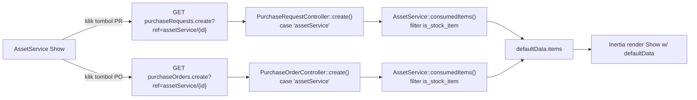

# Design Document: asset-service-procurement

## Overview

Replikasi mekanisme `$ref`-based switch existing (dipakai WorkOrder) ke AssetService. Dua controller (`PurchaseRequestController`, `PurchaseOrderController`) dapat `case 'assetService':` baru. Dua tombol baru di Show AssetService, gated permission via `usePermission().canGlobal()`. Prasyarat: `AssetServiceConsumedItem` dapat kolom `item_unit_id` (gap existing — quantity saat ini tanpa satuan eksplisit).

Tidak berubah: struktur `PurchaseRequest`/`PurchaseOrder` itu sendiri, mekanisme permission (`Controller::__construct`), pola `referenceable` morph pada item PR/PO (sudah ada, tidak perlu migration baru di tabel PR/PO).

## Architecture



**Data Flow**: user klik tombol → Inertia `Link` GET request dengan query `ref` → controller `create()` parse `$ref` via `explode('/', ...)` → switch match `'assetService'` → load `AssetService` + `consumedItems` (eager via `loadRelations()`) → map ke shape item PR/PO → render form kosong dengan `defaultData` terisi → user submit seperti form baru biasa (tidak ada endpoint baru, `store()` existing dipakai apa adanya).

## Components and Interfaces

### 1. Migration: `add_item_unit_id_to_asset_service_consumed_items_table`

```php
public function up(): void {
    Schema::table('asset_service_consumed_items', function (Blueprint $table) {
        $table->foreignUlid('item_unit_id')->nullable()->after('item_id')
            ->references('id')->on('item_units')->restrictOnDelete();
    });

    // Item::defaultUom() = ItemUnit dengan unit_id sama dengan items.default_unit_id
    DB::table('asset_service_consumed_items')
        ->whereNull('item_unit_id')
        ->orderBy('id')
        ->each(function ($row) {
            $item = DB::table('items')->find($row->item_id);
            $defaultUomId = DB::table('item_units')
                ->where('item_id', $item->id)
                ->where('unit_id', $item->default_unit_id)
                ->value('id');
            if ($defaultUomId) {
                DB::table('asset_service_consumed_items')
                    ->where('id', $row->id)
                    ->update(['item_unit_id' => $defaultUomId]);
            }
        });

    Schema::table('asset_service_consumed_items', function (Blueprint $table) {
        $table->foreignUlid('item_unit_id')->nullable(false)->change();
    });
}

public function down(): void {
    Schema::table('asset_service_consumed_items', function (Blueprint $table) {
        $table->dropForeign(['item_unit_id']);
        $table->dropColumn('item_unit_id');
    });
}
```

Terverifikasi: `Item::defaultUom()` (`app/Models/Inventory/Item.php:90`) — `hasOne(ItemUnit::class)` yang di-join `whereColumn('item_units.unit_id', 'items.default_unit_id')`. Backfill di atas mereplikasi logic ini lewat query builder (bukan Eloquent relation) karena dijalankan dalam migration.

### 2. Model: `AssetServiceConsumedItem.php`

Tambah:
```php
public function itemUnit(): BelongsTo {
    return $this->belongsTo(ItemUnit::class);
}
```

### 3. Service layer (pengisian `item_unit_id`)

Cari service yang menangani create/update `AssetServiceConsumedItem` (kemungkinan `AssetServiceService::fillItemRelations()` atau setara, pola sama `InternalOrderService::fillItemRelations()`). Tambah baris pengisian `item_unit_id` dari payload FE (`data['unit']['id']`), sejajar dengan pengisian `item_id`.

### 4. FE: `resources/js/Pages/Asset/Services/Form.jsx`

Tambah kolom `unit` di `consumedItemColumns` (setelah `item`), pakai `ItemUnitLinkModel` — pola identik `InternalOrders/Form.jsx` kolom `unit`:
```jsx
{
  name: "unit",
  titleTrans: "asset.service.columns.unit",
  required: true,
  cell({ data, setData, attributes, dataRow }) {
    return (
      <ItemUnitLinkModel
        disabled={!dataRow?.item}
        value={data}
        onValueChange={(val) => setData("unit", val)}
        {...attributes}
        filters={{ item_id: dataRow?.item?.id }}
      />
    );
  },
},
```
Kolom `item` cell (`ItemLinkModel onValueChange`) diperluas: saat item dipilih, auto-isi `unit` dari default UOM item (pola sama kolom `item` di `InternalOrders/Form.jsx`).

### 5. Backend: `PurchaseRequestController::create()`

Tambah case baru sejajar `case 'workOrder':` (baris ~30-61 file existing):
```php
case 'assetService':
    $svc = AssetService::find($split[1]);
    if ($svc) {
        $svc->loadRelations();
        $defaultData = [
            'date'  => now(),
            'items' => $svc->consumedItems->filter(fn ($item) => $item->item->is_stock_item)
                ->map(fn ($item) => [
                    'id'                 => Utils::generateRandom(5),
                    'item'               => $item->item,
                    'quantity'           => $item->quantity,
                    'unit'               => $item->itemUnit,
                    'referenceable'      => $item,
                    'referenceable_type' => AssetServiceConsumedItem::class,
                    'referenceable_id'   => $item->id,
                ]),
        ];
    }
    break;
```
Import baru: `use App\Models\Asset\AssetService;`, `use App\Models\Asset\AssetServiceConsumedItem;`.

### 6. Backend: `PurchaseOrderController::create()`

Tambah case baru sejajar `case 'workOrder':` (baris 51-66 file existing), pola spread seperti case existing controller ini. BEDA dari `case 'workOrder':` existing (yang tidak filter): case `assetService` DI SINI tetap filter `is_stock_item`, sama seperti case PR — keputusan eksplisit, bukan mengikuti pola lama yang dianggap gap, bukan filter baru yang disengaja:
```php
case 'assetService':
    $svc = AssetService::find($split[1]);
    if ($svc) {
        $svc->loadRelations();
        $defaultData = [
            'items' => $svc->consumedItems->filter(fn ($item) => $item->item->is_stock_item)
                ->map(fn ($item) => [
                    ...$item,
                    'id'                 => Utils::generateRandom(5),
                    'item'               => $item->item,
                    'quantity'           => $item->quantity,
                    'unit'               => $item->itemUnit,
                    'referenceable_type' => AssetServiceConsumedItem::class,
                    'referenceable_id'   => $item->id,
                ]),
        ];
    }
    break;
```
Import sama seperti di atas.

### 7. FE: `resources/js/Pages/Asset/Services/Show.jsx`

```jsx
import { Button } from "@/Components/ui/button";
import Link from "@/Components/Link";
import usePermission from "@/Hooks/usePermission";
import { usePage } from "@inertiajs/react";

export default function Show({ assetService, defaultData }) {
  const { t } = useLaravelReactI18n();
  const { model } = usePage().props;
  const { canGlobal } = usePermission(model);
  const isApproved = (assetService?.status ?? []).includes("approved");
  const canRequestPurchase = assetService?.submitted_at;

  return (
    <FormPage
      ...
      controls={() => {
        if (!canRequestPurchase) return null;
        return (
          <>
            {canGlobal("App\\Models\\Purchase\\PurchaseRequest", "create") && (
              <Button type="button" className="p-2! size-fit h-8" variant="secondary" asChild>
                <Link href={route("purchaseRequests.create", { ref: `assetService/${assetService.id}` })}>
                  {t("asset.service.actions.create_pr")}
                </Link>
              </Button>
            )}
            {canGlobal("App\\Models\\Purchase\\PurchaseOrder", "create") && (
              <Button type="button" className="p-2! size-fit h-8" variant="secondary" asChild>
                <Link href={route("purchaseOrders.create", { ref: `assetService/${assetService.id}` })}>
                  {t("asset.service.actions.create_po")}
                </Link>
              </Button>
            )}
          </>
        );
      }}
    >
      <Form />
      {assetService && isApproved && <ServiceActivityLog assetService={assetService} />}
    </FormPage>
  );
}
```

### 8. Lang keys

`lang/id/asset/service.php` + `lang/en/asset/service.php`, tambah:
```php
'actions' => [
    'create_pr' => 'Buat Purchase Request', // en: 'Create Purchase Request'
    'create_po' => 'Buat Purchase Order',   // en: 'Create Purchase Order'
],
'columns' => [
    ...,
    'unit' => 'Unit',
],
```

## Data Models

`asset_service_consumed_items` (setelah migration):

| Kolom | Tipe | Keterangan |
|---|---|---|
| `item_unit_id` | `foreignUlid`, NOT NULL | Baru. FK → `item_units.id`, `restrictOnDelete` |

Tidak ada perubahan skema di `purchase_request_items`/`purchase_order_items` — kolom `nullableUlidMorphs('referenceable')` sudah ada dan generik, dipakai apa adanya.

## Correctness Properties

**Property 1 — Quantity preservation**
_For any_ `AssetServiceConsumedItem` yang di-map ke baris PR/PO, `quantity` baris hasil SHALL sama persis dengan `quantity` sumber (tidak ada kalkulasi shortfall/pengurangan stok).

**Validates: Requirement 4.2**

**Property 2 — Stock-item filter di PR dan PO**
_For any_ `AssetServiceConsumedItem` dengan `item.is_stock_item = false`, baris tersebut SHALL tidak muncul di `defaultData.items`, baik hasil `purchaseRequests.create` maupun `purchaseOrders.create` — beda dengan `case 'workOrder':` existing di `PurchaseOrderController` (yang tidak filter), keputusan disengaja untuk case `assetService` di kedua controller.

**Validates: Requirement 2.3, 3.3**

**Property 3 — Referenceable traceability**
_For any_ baris PR/PO yang dihasilkan dari AssetService, `referenceable_type` SHALL selalu `AssetServiceConsumedItem::class` dan `referenceable_id` SHALL selalu id baris consumed item sumber (bukan id AssetService itu sendiri).

**Validates: Requirement 2.4, 3.3**

**Property 4 — Backfill idempoten**
_For any_ baris `asset_service_consumed_items` existing sebelum migration, `item_unit_id` hasil backfill SHALL sama dengan default UOM dari `item_id` baris tersebut — dijalankan sekali, tidak mengubah baris yang sudah punya `item_unit_id`.

**Validates: Requirement 1.2**

## Error Handling

| Scenario | Behavior |
|---|---|
| AssetService pada `$ref` tidak ditemukan | `$defaultData` tidak di-set, form render kosong (parity `case 'workOrder':`) |
| `consumedItems` kosong | `items` map jadi array kosong, form buka dengan 0 baris |
| User akses route `create` tanpa permission `create` pada PurchaseRequest/PurchaseOrder | Tombol tidak tampil (client); akses URL langsung → `abort(403)` dari `Controller::__construct` (server, existing, tidak perlu kode baru) |
| Item tanpa `item_unit_id` (skenario mustahil setelah migration NOT NULL, tapi race saat deploy) | Tidak ditangani khusus — dijamin oleh constraint DB level |
| Migration backfill: item tanpa default UOM sama sekali (data cacat) | Baris tetap NULL setelah backfill loop → langkah `nullable(false)->change()` akan GAGAL (fail-fast, migration tidak silent-corrupt data) — perlu dicek manual sebelum deploy jika ada data legacy bermasalah |

## Testing Strategy

- **Unit**: `AssetServiceConsumedItem::itemUnit()` relation mengembalikan `ItemUnit` yang benar.
- **Unit/Feature**: migration backfill — buat baris tanpa `item_unit_id` (raw insert sebelum kolom NOT NULL diberlakukan dalam test migration terpisah, atau test service-layer fill saja jika migration sulit di-unit-test terisolasi).
- **Feature**: `PurchaseRequestController::create` dengan `ref=assetService/{id}` → assert `defaultData.items` count, `quantity`, `unit`, `referenceable_type`/`id` sesuai consumed items, DAN item non-stock terfilter keluar.
- **Feature**: `PurchaseOrderController::create` dengan `ref=assetService/{id}` → assert sama, TERMASUK filter stock-item (assert item non-stock ikut terfilter keluar, beda dengan `case 'workOrder':` existing di controller ini).
- **Feature**: `PurchaseRequestController::create` dengan `ref=assetService/{invalid-id}` → assert `defaultData` null/absent, tidak error.
- **Feature**: service layer fill `item_unit_id` saat create/update AssetServiceConsumedItem via payload FE.
