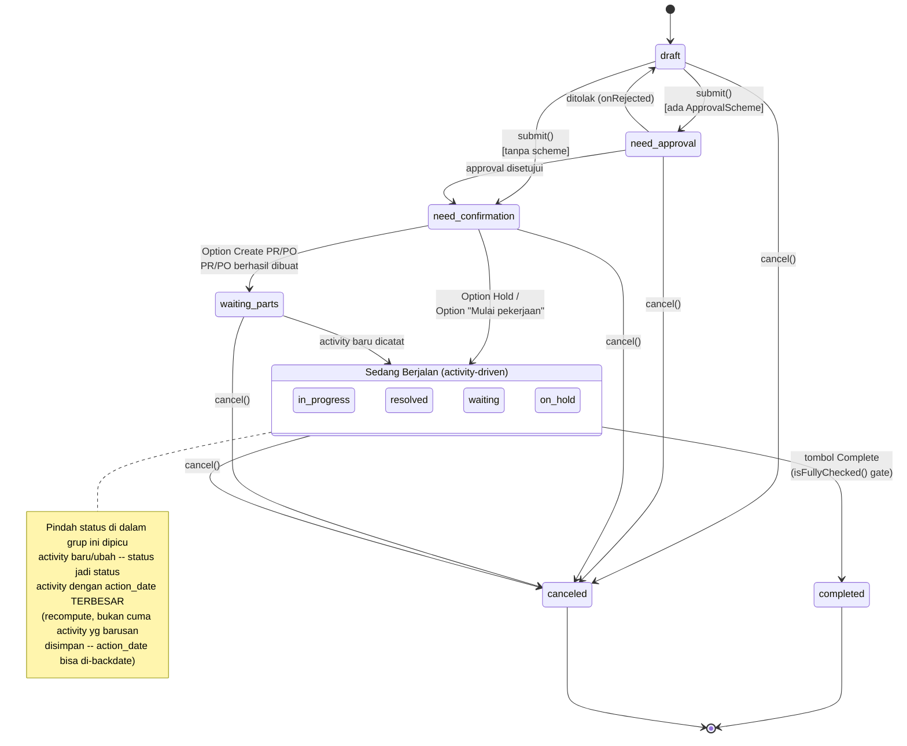

# Design Document: asset-service-progress-workflow

## Overview

Redesain lifecycle `AssetService` pasca-approval jadi state machine single-value (`status` di-replace total tiap transisi, bukan multi-flag) yang di-drive terutama oleh `AssetServiceActivity` — status dokumen `AssetService` SELALU mengikuti status activity dengan `action_date` TERBESAR (bukan activity yang barusan disimpan — direvisi karena `action_date` bisa di-backdate, lihat §5), di-**recompute** tiap kali ada activity disimpan (Requirement 9). Redesain `AssetServiceActivity` sendiri dari checklist boolean (`is_done`) jadi ticket-like (`status` enum 5 nilai), dengan 2 guard baru: `action_date` tidak boleh sebelum activity pertama, dan activity tidak bisa ditambah lagi setelah `COMPLETED`.

Pattern utama:
- **Model event sebagai satu-satunya penulis `AssetService.status`** pasca-`NEED_CONFIRMATION` — `AssetServiceActivity::booted()` (`static::saved()`) me-**recompute** (requery activity dengan `action_date` terbesar, BUKAN sekadar pakai status activity yang barusan disimpan) lalu sinkron ke parent. Semua aksi (Hold, Complete, activity biasa) cukup membuat/ubah activity lewat endpoint `storeActivity`/`updateActivity` yang SUDAH ADA — TIDAK ada endpoint baru untuk Hold maupun Complete, cuma beda prefill di FE.
- **1 endpoint baru** (`startWork`) — satu-satunya transisi yang butuh kerja atomik di luar activity murni (validasi stok server-side + `start_date` + auto-create activity).
- **`WAITING_PARTS` di-set dari LUAR domain Asset** (`PurchaseRequestController`/`PurchaseOrderController::store()`) — konsisten arah domain-boundary yang sudah dipatenkan (Sales/Purchase boleh menunjuk balik ke Asset, bukan sebaliknya; di sini Purchase MENULIS ke Asset, bukan MEMBACA/menunjuk — masih searah, cuma sisi lain dari relasi `referenceable` yang sudah ada).
- **Konsolidasi guard `FormStatus::APPROVED`** jadi 1 method (`AssetService::hasPassedApproval()`), dipakai ulang di 5 titik yang sebelumnya cek literal `APPROVED` (Requirement 8).

**Tidak berubah**: struktur `AssetServiceConsumedItem`, mekanisme permission, route `purchaseRequests.create`/`purchaseOrders.create` (`case 'assetService':`, spec `asset-service-procurement` — dipakai apa adanya), `App\Traits\Submitable`/`FormStatusesCast` (dipakai sesuai kontraknya, cuma array isinya sekarang selalu 1 elemen bukan multi-flag).

## Architecture



### Data Flow — mekanisme sinkronisasi (Requirement 9, inti desain)

1. User memicu perubahan activity lewat salah satu dari 3 jalur: (a) dialog Tambah Aktivitas biasa (`ActivityFormDialog`, `status` di-prefill dari activity dengan `action_date` terbesar), (b) Option "Hold" di dialog Confirm (`ActivityFormDialog` yang SAMA, `status` di-prefill `on_hold`), (c) tombol "Complete" (`ActivityFormDialog` yang SAMA, `status` di-prefill `completed`).
2. Ketiganya POST/PUT ke endpoint YANG SUDAH ADA: `assetServices.activities.store`/`assetServices.activities.update` — TIDAK ada percabangan endpoint per opsi.
3. `AssetServiceActivityRequest` validasi: `status` masuk rule `in:` 5 nilai baru; `description` SUDAH `required` (tidak berubah); **BARU (Requirement 9 AC8)** — `action_date` SHALL TIDAK boleh lebih awal dari `action_date` activity pertama (`oldest('id')`) milik AssetService yang sama, `withValidator()` custom rule.
4. `AssetServiceController::storeActivity()` — guard `assertApproved()` diganti `hasPassedApproval()` (Requirement 8); **BARU (Requirement 9 AC9)** — tolak (`LogicException`) kalau `AssetService.status` SUDAH `COMPLETED` (activity tidak bisa ditambah lagi, CREATE saja — `updateActivity()` TIDAK kena guard ini, lihat catatan cakupan di `requirements.md` Req 9 AC9). Lolos guard → `$assetService->activities()->create()`/`$activity->update()` seperti biasa.
5. `AssetServiceActivity::booted()` — hook `static::saved()` (create MAUPUN update — bukan cuma create): **recompute**, requery SEMUA activity milik parent, urut `action_date DESC, id DESC`, ambil yang PALING ATAS, `update()` `$activity->assetService` dengan `status = [$activityTerbesar->status]` (replace total). Ini SATU-SATUNYA tempat penulisan status di titik ini — controller TIDAK menulis status AssetService secara terpisah. BUKAN sekadar pakai `$activity->status` dari row yang barusan disimpan (desain awal, direvisi — lihat §5).
6. (Khusus tombol "Complete", Requirement 7 AC3) SETELAH langkah 2-5 sukses (activity tersimpan, status AssetService sudah `completed` lewat langkah 5 — dengan syarat activity yang barusan disimpan itu MEMANG yang `action_date`-nya terbesar, biasanya `now()` jadi otomatis terbesar), FE kirim request KEDUA ke endpoint existing `assetServices.complete` — `AssetServiceService::complete()` jalan, gate `isFullyChecked()` (disederhanakan, lihat Komponen §4) dicek, `completion_date` diisi.

### Data Flow — "Mulai pekerjaan" (Requirement 5 + 9 AC3)

1. FE cek `assetService.has_available_stock` (computed prop, dikirim `show()`, dipakai sebagai gate visibilitas tombol — TIDAK dipercaya sebagai validasi, cuma UX).
2. Klik → POST `assetServices.{id}.startWork` (endpoint BARU, TANPA payload).
3. `AssetServiceService::startWork()` — DB transaction: (a) validasi ULANG stok server-side (`hasStockAvailable()`, sama method dipakai `show()` — TIDAK percaya state FE), tolak `LogicException` kalau nihil; (b) `update(['start_date' => now()])`; (c) `activities()->create(['status' => IN_PROGRESS, 'action_date' => now(), 'pic_id' => Auth::id(), 'description' => ''])` — TANPA lewat `AssetServiceActivityRequest` (dipanggil langsung dari service, bukan lewat HTTP form biasa, jadi validasi `description required` tidak nyentuh path ini, sesuai Requirement 6 AC7 pengecualian).
4. Langkah 3c memicu `AssetServiceActivity::booted()` `static::saved()` (langkah 5 alur umum di atas) — `status` AssetService otomatis jadi `[IN_PROGRESS]`. `startWork()` TIDAK menulis `status` secara terpisah — konsisten Requirement 9 AC3 ("SATU-SATUNYA mekanisme").

### Data Flow — "Create PR"/"Create PO" → WAITING_PARTS (Requirement 4)

1. Klik Option → `<Link href={route('purchaseRequests.create', {ref: 'assetService/{id}'})}>` — navigasi biasa, TIDAK ada request ke `AssetServiceController` sama sekali (konsisten `asset-service-procurement`, tidak diubah).
2. User isi form PR/PO (pre-filled dari `case 'assetService':` existing), submit.
3. `PurchaseRequestController::store()`/`PurchaseOrderController::store()` (SETELAH `$this->service->create($data)` sukses, SEBELUM `DB::commit()`) — panggil BARU: `app(AssetServiceService::class)->markWaitingPartsForConsumedItems($createdItemReferenceableIds)`.
4. `AssetServiceService::markWaitingPartsForConsumedItems()` — resolve `AssetServiceConsumedItem` dari id yang di-passed → group by `assetService` → utk tiap AssetService yang statusnya SAAT INI `NEED_CONFIRMATION`, `update(['status' => [FormStatus::WAITING_PARTS]])` LANGSUNG (BUKAN lewat activity — beda dari mekanisme Requirement 9 AC1, method terpisah, disengaja: klik "Create PR/PO" tidak menghasilkan activity apapun per requirements).

## Components and Interfaces

### 1. `app/Enums/FormStatus.php` — 2 case baru

```php
case NEED_CONFIRMATION = 'need_confirmation';
case WAITING_PARTS      = 'waiting_parts';
```

### 2. Migration: `add_start_date_to_asset_services_table`

```php
public function up(): void {
    Schema::table('asset_services', function (Blueprint $table) {
        $table->dateTime('start_date')->nullable()->after('failure_date');
    });
}

public function down(): void {
    Schema::table('asset_services', function (Blueprint $table) {
        $table->dropColumn('start_date');
    });
}
```

### 3. Migration: `replace_is_done_with_status_on_asset_service_activities_table`

Terverifikasi skema existing (`database/migrations/2026_08_15_000008_create_asset_service_activities_table.php`): `description` SUDAH `text` NOT NULL (bukan nullable — validasi `required` di `AssetServiceActivityRequest` sudah cukup, TIDAK perlu diubah). `is_done` `boolean default(false)`.

```php
public function up(): void {
    Schema::table('asset_service_activities', function (Blueprint $table) {
        $table->string('status')->nullable()->after('description');
    });

    // Backfill TIDAK dilakukan (keputusan user, Requirement 6 AC3) —
    // baris lama kehilangan representasi checklist, status tetap NULL
    // sampai activity itu di-edit ulang oleh user.
    Schema::table('asset_service_activities', function (Blueprint $table) {
        $table->dropColumn('is_done');
    });
}

public function down(): void {
    Schema::table('asset_service_activities', function (Blueprint $table) {
        $table->boolean('is_done')->default(false);
        $table->dropColumn('status');
    });
}
```

`status` SENGAJA `nullable` (bukan `NOT NULL`) — baris lama (pre-migration) akan punya `status = NULL` selamanya sampai diedit; kode yang membaca `status` (booted() sync, tampilan FE) HARUS toleran `null` (activity lama tidak memicu sync ke AssetService, dan render badge status skip kalau null).

### 4. Model: `app/Models/Asset/AssetService.php`

```php
// Cast baru
protected $casts = [
    // ...existing
    'start_date' => 'datetime',
];

/**
 * Requirement 8 AC6: satu-satunya definisi "AssetService sudah lewat
 * tahap approval" — dipakai ulang di 5 titik consumer FormStatus::APPROVED
 * literal (lihat §9). Status APAPUN selain draft/need_approval/canceled
 * dianggap sudah lewat approval (need_confirmation, on_hold, waiting_parts,
 * in_progress, resolved, waiting, completed).
 */
public function hasPassedApproval(): bool {
    return array_intersect(
        array_map(fn ($s) => $s->value, $this->status ?? []),
        [FormStatus::DRAFT->value, FormStatus::NEED_APPROVAL->value, FormStatus::CANCELED->value],
    ) === [];
}

/**
 * Requirement 6 AC4 (redefinisi), disederhanakan menyusul revisi
 * Requirement 9 AC1 — karena AssetServiceActivity::booted() (§5) SELALU
 * menjaga status AssetService sinkron dengan status activity ber-action_date
 * terbesar SETIAP KALI activity disimpan, cukup baca `status` AssetService
 * LANGSUNG (sudah dijamin up-to-date), TIDAK perlu requery activities lagi
 * di sini (requery terpisah dulu perlu SEBELUM revisi ini, saat sync masih
 * pakai insertion-order sederhana).
 */
public function isFullyChecked(): bool {
    return in_array(FormStatus::COMPLETED, $this->status ?? [], true);
}

/**
 * Requirement 6 AC8 — urutan tampilan activity (FE) DAN basis "activity
 * terakhir" (prefill, dst) SAMA: action_date ASC, id ASC sebagai
 * tie-break. `.at(-1)` di FE (§9, §12) mengasumsikan urutan INI —
 * activity paling akhir dalam array = action_date terbesar.
 */
public function activities(): HasMany {
    return $this->hasMany(AssetServiceActivity::class)
        ->orderBy('action_date')
        ->orderBy('id');
}
```

### 5. Model: `app/Models/Asset/AssetServiceActivity.php`

```php
use App\Casts\FormStatusCast; // singular — 1 nilai, bukan array (beda dari FormStatusesCast dipakai Submitable)

protected $casts = [
    'action_date' => 'datetime',
    'status'      => FormStatusCast::class,
];
// 'is_done' cast dihapus (kolom di-drop, migration §3)

/**
 * Requirement 9 AC1 (REVISI) — sync status AssetService berdasar activity
 * dengan action_date TERBESAR, BUKAN activity yang barusan disimpan.
 * Dipicu create MAUPUN update (edit action_date/status activity existing
 * juga bisa mengubah siapa yang "terkini" -- lihat requirements.md Req 9
 * catatan revisi: action_date bisa di-backdate, insertion-order saja
 * TIDAK cukup merepresentasikan kronologi kejadian yang benar).
 */
protected static function booted(): void {
    static::saved(function (self $activity) {
        // reorder() WAJIB -- relasi activities() (AssetService.php) sudah
        // default orderBy('action_date')->orderBy('id') ASCENDING
        // (Requirement 6 AC8). orderByDesc() TANPA reorder() di sini cuma
        // NAMBAH clause ORDER BY baru di belakang, TIDAK meng-override yang
        // sudah ada -- TERVERIFIKASI via test unit (bug nyata, ketauan lewat
        // test gagal saat implementasi: activity ber-action_date PALING
        // AWAL yang kepilih, bukan paling akhir, sebelum reorder() ditambah).
        $latest = $activity->assetService->activities()
            ->whereNotNull('status')
            ->reorder('action_date', 'desc')
            ->orderByDesc('id') // tie-break: action_date sama persis -> paling baru disimpan menang
            ->first();

        if ($latest === null) {
            return; // seharusnya tidak pernah terjadi (activity yg barusan disimpan pasti match whereNotNull kecuali statusnya sendiri null)
        }

        $activity->assetService->update(['status' => [$latest->status]]);
    });
}
```

`FormStatusCast` (singular) sudah dipakai model lain untuk 1 nilai `FormStatus` (mis. `ApprovalInstanceStep::status`, `app/Casts/FormStatusCast.php`) — reuse langsung, TIDAK perlu cast baru.

**Validasi nilai**: `status` HANYA boleh salah satu dari 5 nilai Requirement 6 AC2 (`IN_PROGRESS`, `RESOLVED`, `WAITING`, `ON_HOLD`, `COMPLETED`) — validasi ini di level `AssetServiceActivityRequest` (rule `in:`), BUKAN di model/cast (yang menerima `FormStatus` apapun). `booted()` di atas TIDAK mem-filter ulang — kalau request-level validasi lolos, asumsinya sudah salah satu dari 5 itu.

### 6. Service: `app/Services/Asset/AssetServiceService.php`

```php
// onApproved() — 2 titik ganti FormStatus::APPROVED -> FormStatus::NEED_CONFIRMATION:

// (a) submit(), cabang maintenance_task (baris ~142-144 existing):
$model->update([
    'code'   => FormatingSeries::generate(AssetService::class, $model),
    'status' => [FormStatus::NEED_CONFIRMATION],
]);
$this->onApproved($model); // TIDAK dihapus -- tetap trigger Asset::setInMaintenance() dst

// (b) onApproved() sendiri (baris ~197 existing):
$model->update(['status' => [FormStatus::NEED_CONFIRMATION]]);
// Komentar existing di baris 190-196 soal "APPROVED (bukan SUBMITTED)"
// perlu direvisi -- konteksnya sekarang NEED_CONFIRMATION.
```

```php
// BARU
public function startWork(AssetService $model): AssetService {
    if (! $this->hasStockAvailable($model)) {
        throw new LogicException(__('asset/service.no_stock_available'));
    }

    return DB::transaction(function () use ($model) {
        $model->update(['start_date' => now()]);
        $model->activities()->create([
            'status'      => FormStatus::IN_PROGRESS,
            'action_date' => now(),
            'pic_id'      => Auth::id(),
            'description' => '',
        ]); // -> AssetServiceActivity::booted() sinkron status AssetService

        return $model->fresh();
    });
}

/**
 * Requirement 5 AC1/AC2 — dipakai server-side (gate startWork()) DAN
 * dikirim sebagai computed prop `has_available_stock` di show() (FE,
 * gating visibilitas tombol "Mulai pekerjaan" -- UX saja, bukan sumber
 * kebenaran, startWork() TETAP validasi ulang).
 *
 * TERVERIFIKASI: pakai model `Stock` (app/Models/Inventory/Stock.php,
 * balance per item+warehouse yang SUDAH di-maintain), BUKAN agregasi
 * manual `StockLedgerEntry` (itu cuma log transaksi, bukan balance)
 * seperti draft desain sebelumnya.
 *
 * **Keputusan user**: pakai `ready_quantity` (BUKAN `quantity`/
 * `actual_quantity`) — konsisten dengan §14 (kartu stok, user eksplisit
 * minta "jumlah stock yang ready"). Gate visibilitas tombol dan angka
 * yang ditampilkan di kartu stok HARUS pakai field yang SAMA — kalau beda
 * (mis. gate pakai `quantity` tapi kartu tampilkan `ready_quantity`),
 * tombol bisa muncul padahal kartu nunjukkin 0 ready, membingungkan user.
 */
public function hasStockAvailable(AssetService $model): bool {
    $itemVariantIds = $model->consumedItems()
        ->whereHas('item', fn ($q) => $q->where('is_stock_item', true))
        ->pluck('item_id');

    if ($itemVariantIds->isEmpty()) {
        return false;
    }

    return Stock::whereIn('item_variant_id', $itemVariantIds)
        ->where('ready_quantity', '>', 0)
        ->whereHas('warehouse', fn ($q) => $q->where('branch_id', $model->branch_id))
        ->exists();
}

/**
 * Requirement 4 AC3/AC4 -- dipanggil dari PurchaseRequestController/
 * PurchaseOrderController::store() SETELAH item PR/PO berhasil disimpan.
 * TIDAK lewat mekanisme AssetServiceActivity (WAITING_PARTS bukan activity).
 *
 * @param  array<int, string>  $consumedItemIds  id AssetServiceConsumedItem yang jadi referenceable baris PR/PO baru
 */
public function markWaitingPartsForConsumedItems(array $consumedItemIds): void {
    if ($consumedItemIds === []) {
        return;
    }

    AssetServiceConsumedItem::whereIn('id', $consumedItemIds)
        ->with('assetService')
        ->get()
        ->pluck('assetService')
        ->filter()
        ->unique('id')
        ->each(function (AssetService $assetService) {
            if (in_array(FormStatus::NEED_CONFIRMATION, $assetService->status ?? [], true)) {
                $assetService->update(['status' => [FormStatus::WAITING_PARTS]]);
            }
        });
}
```

```php
// complete() (existing, app/Services/Asset/AssetServiceService.php:212) --
// UBAH sumber completion_date. Requirement 9 AC5 (revisi): completion_date
// = action_date milik activity COMPLETED, BUKAN now() (waktu klik tombol).
public function complete(AssetService $assetService): AssetService {
    if (! $assetService->isFullyChecked()) {
        throw new LogicException(__('asset/service.checklist_not_complete'));
    }

    return DB::transaction(function () use ($assetService) {
        // reorder() WAJIB -- relasi activities() sudah default ASC
        // (Requirement 6 AC8), latest('action_date') tanpa reorder() cuma
        // nambah clause, tidak override (bug sama persis ditemukan &
        // difix di AssetServiceActivity::booted() -- lihat catatan di sana).
        $completedActivity = $assetService->activities()
            ->where('status', FormStatus::COMPLETED)
            ->reorder('action_date', 'desc')
            ->first();

        $assetService->update(['completion_date' => $completedActivity->action_date]);

        // ...sisa body method (capitalize_repair_cost, event AssetServiceCompleted,
        // regenerateNextTask) TIDAK berubah.
    });
}
```
**Catatan**: `isFullyChecked()` (§4) sudah menjamin activity `COMPLETED` ada saat method ini dipanggil (via cek `AssetService.status`, yang sudah sinkron ke activity `action_date` terbesar) — query di atas re-fetch activity itu spesifik utk ambil `action_date`-nya. Berkat Requirement 9 AC10 (`action_date` activity `COMPLETED` dijamin TERBESAR saat disimpan) DAN AC9 (tidak ada activity baru pasca-`COMPLETED`), `$completedActivity` di atas SELALU sama dengan activity ber-`action_date` terbesar keseluruhan — `latest('action_date')` dgn filter `status=COMPLETED` cuma sebagai extra safety, bukan strictly perlu andai kedua guard itu benar2 tegak.

### 7. Migration Request: `app/Http/Requests/Asset/AssetServiceActivityRequest.php`

```php
public function rules(): array {
    return [
        'action_date' => ['required', 'date'],
        'pic_id'      => ['nullable', 'string', 'exists:users,id'],
        'description' => ['required', 'string'], // TIDAK berubah -- sudah required
        'status'      => ['required', Rule::in([
            FormStatus::IN_PROGRESS->value,
            FormStatus::RESOLVED->value,
            FormStatus::WAITING->value,
            FormStatus::ON_HOLD->value,
            FormStatus::COMPLETED->value,
        ])],
        // 'is_done' dihapus
    ];
}

/**
 * Requirement 9 AC8 (BARU) — action_date tidak boleh lebih awal dari
 * action_date activity PERTAMA (oldest('id')) milik AssetService yang
 * sama. Route param beda antara store() ({assetService}) dan update()
 * ({activity}) -- resolve AssetService dari salah satu.
 *
 * CATATAN EDGE CASE (belum diselesaikan sepenuhnya di sini): saat
 * MENGEDIT activity yang KEBETULAN activity pertama itu sendiri,
 * query oldest('id') di bawah akan menemukan DIRINYA SENDIRI (row belum
 * ter-update saat validasi jalan, request lifecycle PRE-save) --
 * perbandingan jadi trivial (action_date baru vs action_date lama row
 * yang sama). Perilaku ini KEMUNGKINAN sudah cukup (mengedit activity
 * pertama mengubah definisi "batas bawah" itu sendiri, masuk akal), tapi
 * belum di-cross-check ke requirements -- perlu perhatian ekstra saat
 * ditulis test-nya.
 */
public function withValidator($validator): void {
    $validator->after(function ($validator) {
        $assetService = $this->route('assetService')
            ?? $this->route('activity')?->assetService;
        if (! $assetService) {
            return;
        }

        // relasi activities() (AssetService.php) sudah default orderBy
        // action_date ASC, id ASC -- oldest('id') di sini konsisten
        // (ASCENDING), aman dipakai apa adanya TANPA reorder().
        $firstActionDate = $assetService->activities()->oldest('id')->value('action_date');
        $newActionDate   = $this->date('action_date');

        if ($firstActionDate && $newActionDate?->lt($firstActionDate)) {
            $validator->errors()->add(
                'action_date',
                __('asset/service.action_date_before_first'),
            );
        }

        // Requirement 9 AC10 (BARU) -- khusus status=COMPLETED: action_date
        // WAJIB lebih besar dari action_date TERBESAR yang sudah ada (bukan
        // batas bawah generik AC8 di atas, ini batas ATAS -- "selesai"
        // harus jadi titik paling akhir).
        //
        // reorder() WAJIB di sini -- KEBALIKAN dari AC8 di atas: kita butuh
        // DESCENDING, tapi relasi activities() sudah baked-in ASCENDING
        // (Requirement 6 AC8) -- orderByDesc() TANPA reorder() cuma NAMBAH
        // clause baru di belakang, TIDAK meng-override yang sudah ada (bug
        // nyata ketemu & difix di AssetServiceActivity::booted(), pola sama
        // persis berlaku di sini).
        if ($this->input('status') === FormStatus::COMPLETED->value) {
            $currentLatest = $assetService->activities()
                ->when($this->route('activity'), fn ($q, $activity) => $q->whereKeyNot($activity->id))
                ->reorder('action_date', 'desc')->orderByDesc('id')
                ->value('action_date');

            if ($currentLatest && ! $newActionDate?->gt($currentLatest)) {
                $validator->errors()->add(
                    'action_date',
                    __('asset/service.completed_action_date_must_be_latest'),
                );
            }
        }
    });
}
```

### 8. Controller: `app/Http/Controllers/Asset/AssetServiceController.php`

```php
// assertApproved() -> ganti isi (nama method tetap, cuma dalemannya
// delegasi ke AssetService::hasPassedApproval() -- Requirement 8 AC1):
private function assertApproved(AssetService $assetService): void {
    if (! $assetService->hasPassedApproval()) {
        throw new LogicException(__('asset/service.activity_requires_approval'));
    }
}

// storeActivity() -- TAMBAH guard baru (Requirement 9 AC9), SETELAH
// assertApproved(), SEBELUM create(). HANYA di storeActivity() (CREATE) --
// updateActivity() SENGAJA TIDAK kena guard ini, sesuai cakupan keputusan
// user ("activity tidak bisa DITAMBAHKAN lagi" -- lihat requirements.md
// Req 9 AC9 catatan cakupan, edit activity existing pasca-COMPLETED
// belum diputuskan).
public function storeActivity(AssetServiceActivityRequest $request, AssetService $assetService) {
    $this->assertApproved($assetService);
    if (in_array(FormStatus::COMPLETED, $assetService->status ?? [], true)) {
        throw new LogicException(__('asset/service.activity_locked_after_completed'));
    }

    $activity = $assetService->activities()->create($request->validated());
    BufferedAttachmentService::attach($activity, $request);

    return back();
}

// BARU
public function startWork(AssetService $assetService) {
    $this->assetServiceService->startWork($assetService);

    return back();
}

// show() -- tambah 2 computed prop (pola sama has_active_renter existing):
return array_merge($assetService->toArray(), [
    // ...existing
    'has_active_renter'   => (bool) $assetService->resolvedAsset()?->activeRenter(),
    'has_available_stock' => $this->assetServiceService->hasStockAvailable($assetService), // Requirement 5
    'has_passed_approval' => $assetService->hasPassedApproval(), // Requirement 8 -- FE pakai ini, BUKAN cek "approved" literal
]);
```

```php
// enforcePermission() -- tambah 'startWork' ke daftar 'write':
protected function enforcePermission(string $method) {
    return match ($method) {
        'complete', 'storeActivity', 'updateActivity', 'billToRenter',
        'addActivityFile', 'removeActivityFile', 'startWork' => 'write',
        default => parent::enforcePermission($method),
    };
}
```

### 9. Audit consumer `FormStatus::APPROVED` (Requirement 8) — 4 titik lain

| File | Sebelum | Sesudah |
|---|---|---|
| `app/Http/Requests/Sales/SalesOrderRequest.php:124` | `! $assetService \|\| ! in_array(FormStatus::APPROVED, $assetService->status ?? [], true)` | `! $assetService \|\| ! $assetService->hasPassedApproval()` |
| `app/Http/Requests/Sales/SalesOrderRequest.php:136` | `! $consumedItem \|\| ! in_array(FormStatus::APPROVED, $consumedItem->assetService?->status ?? [], true)` | `! $consumedItem \|\| ! $consumedItem->assetService?->hasPassedApproval()` |
| `app/Http/Requests/Sales/InternalOrderRequest.php:136,148` | Pola identik 2 baris di atas | Sama |
| `resources/js/Pages/Asset/Services/Show.jsx:21` | `isApproved = (assetService?.status ?? []).includes("approved")` | `const hasPassedApproval = assetService?.has_passed_approval ?? false;` (pakai computed prop §8, BUKAN cek literal) |
| `resources/js/Pages/Asset/Services/Form.jsx:34,39` | `isApproved = (data?.status ?? []).includes("approved")` | Lihat catatan di bawah |

**`Form.jsx` — beda pola dari `Show.jsx`**: `data` di `Form.jsx` berasal dari `useFormPage()` (draft/local form state via `FormPage`), BUKAN langsung prop `show()` — `has_passed_approval` tidak otomatis tersedia di `data` kecuali diteruskan lewat `defaultData`. Dua opsi: (a) pastikan `defaultData` yang dikirim `FormPage`/`Show.jsx` MENYERTAKAN `has_passed_approval` dari payload `show()` (butuh cross-check `FormPage.jsx` meneruskan field ini apa adanya — kemungkinan besar YA karena `defaultData` biasanya spread dari props), atau (b) definisikan helper FE kecil yang mirror logic backend:
```js
// resources/js/Pages/Asset/Services/statusUtils.js (BARU)
const PRE_APPROVAL_STATUSES = ["draft", "need_approval", "canceled"];
export function hasPassedApproval(status) {
  return !(status ?? []).some((s) => PRE_APPROVAL_STATUSES.includes(s));
}
```
Opsi (b) lebih aman (tidak bergantung asumsi propagasi `defaultData` yang belum diverifikasi sesi ini) — **dipilih sebagai desain**, dipakai di `Form.jsx` (`hasPassedApproval(data?.status)`) DAN opsional di `Show.jsx` juga (konsisten satu sumber, walau `Show.jsx` sebenarnya bisa pakai computed prop backend). Konsekuensi: 2 sisi (PHP `hasPassedApproval()` §4 dan JS `hasPassedApproval()` di atas) HARUS dijaga sinkron manual (daftar 3 status yang sama) — tidak ada mekanisme share-source-of-truth lintas bahasa di codebase ini (tidak ditemukan pola generate-JS-dari-PHP-enum saat investigasi sesi ini).

### 10. Hook Purchase → WAITING_PARTS (Requirement 4 AC3/AC4)

**`app/Http/Controllers/Purchase/PurchaseRequestController.php::store()`** (setelah `$wo = $this->service->create($data);`, sebelum `DB::commit();`):
```php
$assetServiceConsumedItemIds = $wo->items()
    ->where('referenceable_type', AssetServiceConsumedItem::class)
    ->pluck('referenceable_id')
    ->all();
app(AssetServiceService::class)->markWaitingPartsForConsumedItems($assetServiceConsumedItemIds);
```

**`app/Http/Controllers/Purchase/PurchaseOrderController.php::store()`** — pola SAMA, **TERVERIFIKASI** (`PurchaseOrderController.php:123-137`): struktur identik persis (`$po = $this->service->create($data); DB::commit();`) — hook ditaruh di antara dua baris itu, sama seperti `PurchaseRequestController`.

Import baru kedua file: `use App\Models\Asset\AssetServiceConsumedItem;`, `use App\Services\Asset\AssetServiceService;`.

### 11. Routes: `routes/web.php`

```php
Route::post('/assetServices/{assetService}/startWork', [AssetServiceController::class, 'startWork'])->name('assetServices.startWork');
```
Ditaruh sejajar route `assetServices.complete`/`assetServices.billToRenter` existing (baris ~338-339).

### 12. FE: `resources/js/Pages/Asset/Services/ServiceActivityLog.jsx` — rombak besar

- **`ActivityFormDialog`**: tambah prop `prefillStatus` (opsional, string) — dipakai HANYA saat mode create (`!isEdit`) DAN belum ada `activity` yang di-edit:
  ```jsx
  function ActivityFormDialog({ assetService, activity, prefillStatus, open, onOpenChange }) {
    const lastActivityStatus = assetService?.activities?.at(-1)?.status ?? null;
    const [form, setForm] = useState(
      activity ?? {
        action_date: now(), // Requirement 6 AC5 -- prefill now() saat create
        pic: null,
        description: "",
        status: prefillStatus ?? lastActivityStatus, // Requirement 6 AC6
        files: [],
      },
    );
    // useEffect [activity?.id] -- pola SAMA existing, cuma initial value ikut berubah
  ```
  Checkbox `is_done` DIHAPUS, ganti `Select` (5 opsi status, `Rule::in` sama dgn backend) memakai pola `Select`/`SelectContent`/`SelectItem` yang sudah dipakai `Form.jsx` (`asset.service.type`) — bukan komponen baru.
  Payload `submit()`: `status: form.status` (bukan `is_done`).

- **`CompleteConfirmDialog`**: DIHAPUS TOTAL — diganti reuse `ActivityFormDialog` dengan `prefillStatus="completed"`. Alur submit-nya (Requirement 7 AC3, panggil `complete()` SETELAH activity tersimpan) perlu hook TAMBAHAN di `ActivityFormDialog.submit()` — BUKAN generik untuk semua create, HANYA saat dialog ini dibuka dari tombol "Complete". Opsi implementasi: prop baru `onSavedCallback` (dipanggil di `submit()`'s `onFinish`, opsional) — dipassing `() => router.post(route('assetServices.complete', assetService.id))` HANYA dari pemanggil tombol "Complete".

- **`ServiceActivityLog` (komponen utama)**:
  - `allDone`/`toggleDone` DIHAPUS (logic `is_done` sudah tidak ada).
  - Tombol "Complete" (Requirement 7 AC1) — ganti kondisi:
    ```jsx
    const lastActivity = activities.at(-1);
    const showComplete = lastActivity && lastActivity.status !== "completed";
    ```
    (activities KOSONG secara praktis tidak terjadi — Requirement 9 AC3 menjamin minimal 1 activity begitu status lewat `NEED_CONFIRMATION` — tapi guard `lastActivity &&` tetap dipertahankan sebagai defensive check, bukan diasumsikan mustahil di level kode.)
  - Render badge `status` tiap activity (pengganti Checkbox `is_done` yang dihapus di baris list) — pakai `BadgeStatus` (`resources/js/Components/...`, SUDAH dipakai kolom `formStatus`/`formStatuses` di `Table2.jsx` — reuse, bukan komponen baru).
  - Klik tombol "Complete" → buka `ActivityFormDialog` dgn `prefillStatus="completed"` + `onSavedCallback` seperti di atas (BUKAN buka `CompleteConfirmDialog` yang sudah dihapus).

### 13. FE: Komponen BARU — dialog Confirm (Requirement 2/3/4/5)

`resources/js/Pages/Asset/Services/ConfirmWorkflowDialog.jsx` (BARU):
- Props: `assetService`.
- Render 4 opsi (Requirement 2 AC2): tombol "Lihat Stok" (buka `StockAvailabilityCard`, lihat §14), Option Hold (buka `ActivityFormDialog` dgn `prefillStatus="on_hold"` — import dari `ServiceActivityLog.jsx`, PERLU `export` eksplisit component itu, saat ini `ActivityFormDialog` tidak di-export, HARUS diubah jadi named export), Option Create PR/Create PO (`<Link href={route(...)}>`, pola identik tombol existing `asset-service-procurement` di `Show.jsx`), Option "Mulai pekerjaan" (`router.post(route('assetServices.startWork', assetService.id))`, disembunyikan `WHEN !assetService.has_available_stock`, Requirement 5 AC1/AC2).

### 14. FE: Komponen BARU — kartu stok (Requirement 2 AC3)

`resources/js/Pages/Asset/Services/StockAvailabilityCard.jsx` (BARU, simple — bukan reuse `StockLedgers/`):
- Endpoint BARU: `GET assetServices/{id}/stockAvailability` → `AssetServiceController::stockAvailability()` (BARU):
  ```php
  public function stockAvailability(AssetService $assetService) {
      $itemVariantIds = $assetService->consumedItems()
          ->whereHas('item', fn ($q) => $q->where('is_stock_item', true)) // Requirement 2 AC4
          ->pluck('item_id');

      return Stock::whereIn('item_variant_id', $itemVariantIds)
          ->whereHas('warehouse', fn ($q) => $q->where('branch_id', $assetService->branch_id))
          ->with(['itemVariant.item', 'warehouse'])
          ->get(['id', 'item_variant_id', 'warehouse_id', 'ready_quantity']); // "ready", BUKAN quantity/actual_quantity -- Requirement 2 AC4
  }
  ```
  Model `Stock`, BUKAN `StockLedgerEntry` (§6). Field `ready_quantity` — SAMA dengan yang dipakai `hasStockAvailable()` (§6), harus konsisten (lihat catatan di situ).
- Render tabel per item×gudang: `itemVariant.item.name`, `warehouse.name`, `ready_quantity`. Item non-stock (`is_stock_item=false`) TIDAK muncul sama sekali (sudah difilter di query, bukan di FE).

**Catatan**: endpoint ini TIDAK disebut eksplisit di `requirements.md` (yang cuma bilang "komponen baru, simple") — desain ini MENAMBAHKAN 1 endpoint read-only baru sebagai konsekuensi teknis wajar, bukan requirement tersembunyi baru. Kalau ternyata representasi yang diinginkan user beda (mis. lightsweight tanpa endpoint terpisah, langsung dari data `consumedItems` yang sudah ter-load di `assetService` prop tanpa network call tambahan), ini titik yang perlu dikonfirmasi ulang sebelum implementasi.

### 15. FE: `resources/js/Pages/Asset/Services/Show.jsx`

- Tombol primary "Confirm" (Requirement 2 AC1) — `WHEN assetService.status.includes("need_confirmation")` → buka `ConfirmWorkflowDialog`.
- `start_date`/`completion_date` (Requirement 5 AC5, Requirement 9 AC7) — render conditional, pola sederhana:
  ```jsx
  {assetService?.start_date && (
    <FormInput label={t("asset.service.columns.start_date")}>
      <Input value={formatDate(assetService.start_date)} disabled readOnly />
    </FormInput>
  )}
  {assetService?.completion_date && (
    <FormInput label={t("asset.service.columns.completion_date")}>
      <Input value={formatDate(assetService.completion_date)} disabled readOnly />
    </FormInput>
  )}
  ```
  **Catatan**: field ini sebenarnya lebih pas di `Form.jsx` (kumpulan field AssetService) daripada `Show.jsx` (yang isinya kontrol dropdown menu + `<Form />` + `<ServiceActivityLog />`) — perlu dicek ulang penempatan pas implementasi; `Form.jsx` kemungkinan lokasi yang lebih konsisten dengan field lain (`failure_date` dst yang sudah di sana).
- `isApproved` (dipakai gate render `<ServiceActivityLog />`, baris 21+118) — ganti pakai `hasPassedApproval` §9.

### 16. FE: `resources/js/Pages/Asset/Services/Form.jsx`

- `isApproved` (baris 34) → `hasPassedApproval(data?.status)` (helper §9).

### 17. Lang keys

`lang/id/asset/service.php` + `lang/en/asset/service.php` — tambah:
```php
'columns' => [
    // ...existing
    'start_date'      => 'Tanggal Mulai', // en: 'Start Date'
    'completion_date' => 'Tanggal Selesai', // en: 'Completion Date'
],
'activity' => [
    // ...existing
    'status' => 'Status', // pengganti label is_done
],
'no_stock_available' => 'Tidak ada stok tersedia untuk memulai pekerjaan.', // en: 'No stock available to start work.'
'activity_locked_after_completed' => 'Activity tidak dapat ditambahkan lagi setelah pekerjaan selesai.', // en: 'Activity can no longer be added after the work is completed.'
'action_date_before_first' => 'Tanggal aktivitas tidak boleh sebelum aktivitas pertama.', // en: 'Activity date cannot be before the first activity.'
'completed_action_date_must_be_latest' => 'Tanggal aktivitas "selesai" harus setelah aktivitas terakhir yang sudah ada.', // en: 'The "completed" activity date must be after the latest existing activity.'
```
`status.*` (label per-value `in_progress`/`resolved`/`waiting`/`on_hold`/`completed`/`need_confirmation`/`waiting_parts`) — SUDAH ADA sebagai key generik `lang/*/status.php` (dipakai `FormStatus::label()`) untuk value existing; `need_confirmation`/`waiting_parts` PERLU ditambah key baru di situ (bukan di `asset/service.php`).

## Data Models

`asset_services` (setelah migration §2):

| Kolom | Tipe | Keterangan |
|---|---|---|
| `start_date` | `dateTime`, nullable | BARU. Diisi `startWork()`. |

`asset_service_activities` (setelah migration §3):

| Kolom | Tipe | Keterangan |
|---|---|---|
| `status` | `string`, nullable | BARU. Cast `FormStatusCast`. `NULL` = activity lama (pre-migration, tidak di-backfill). |
| ~~`is_done`~~ | — | DIHAPUS. |

## Correctness Properties

**Property 1 — Status AssetService selalu mirror activity dengan action_date terbesar**
_For any_ kumpulan `AssetServiceActivity` milik satu `AssetService`, SETELAH operasi save (create/update) manapun selesai, `AssetService.status` SHALL sama dengan `status` activity yang `action_date`-nya PALING BESAR di antara SEMUA activity milik AssetService itu (tie-break `id` terbesar) — BUKAN sekadar activity yang barusan disimpan (activity yang barusan disimpan BISA jadi bukan yang `action_date` terbesar, kalau di-backdate).

**Validates: Requirement 9 AC1, AC4**

**Property 2 — `hasPassedApproval()` konsisten 5 consumer**
_For any_ `AssetService` dengan `status` tertentu, hasil `AssetService::hasPassedApproval()` (backend) SHALL sama dengan hasil helper FE `hasPassedApproval()` (§9) untuk `status` array yang sama — kedua sisi HARUS dijaga pakai daftar 3 status (`draft`/`need_approval`/`canceled`) yang identik.

**Validates: Requirement 8 AC1-6**

**Property 3 — `startWork()` atomik, tidak pernah set status tanpa activity**
_For any_ pemanggilan `startWork()` yang sukses, SHALL selalu ada TEPAT SATU `AssetServiceActivity` baru dengan `status=IN_PROGRESS` DAN `AssetService.status` SHALL `[IN_PROGRESS]` — tidak ada state "status IN_PROGRESS tanpa activity pendukung" (Requirement 9 AC3).

**Validates: Requirement 5 AC3-4, Requirement 9 AC3**

**Property 4 — `isFullyChecked()` hanya true kalau activity terakhir completed**
_For any_ `AssetService` dengan activity terakhir (`latest('action_date')`) berstatus SELAIN `COMPLETED` (termasuk `null`, activity lama), `isFullyChecked()` SHALL `false` — `complete()` SHALL ditolak.

**Validates: Requirement 6 AC4, Requirement 7 AC3**

**Property 5 — WAITING_PARTS hanya dari transisi NEED_CONFIRMATION**
_For any_ pemanggilan `markWaitingPartsForConsumedItems()`, AssetService yang status-nya SAAT DIPANGGIL BUKAN `NEED_CONFIRMATION` (mis. sudah `IN_PROGRESS` duluan lewat jalur lain) SHALL TIDAK diubah statusnya — mencegah PR/PO susulan (Requirement 4 di `asset-service-procurement`, "tidak ada guard pembuatan berulang") menimpa balik status yang sudah maju.

**Validates: Requirement 4 AC3**

## Error Handling

| Scenario | Behavior |
|---|---|
| `startWork()` dipanggil tapi stok nihil (race — tombol sempat tampil, stok habis sebelum klik diproses) | `LogicException` (`asset/service.no_stock_available`), transaksi rollback, tidak ada activity/status berubah |
| `storeActivity`/`updateActivity` dipanggil saat `AssetService.status` masih `draft`/`need_approval`/`canceled` | `hasPassedApproval()` `false` → `LogicException` (`asset/service.activity_requires_approval`, pesan TIDAK berubah) — sama seperti guard existing, cuma implementasi internalnya beda |
| `AssetServiceActivity` lama (`status = NULL`, tidak ter-backfill) dibaca `booted()` `saved()` (mis. hasil `touch()`/update field lain tanpa ganti status) | Sync SKIP (guard `if ($activity->status === null) return;`) — AssetService.status TIDAK berubah jadi `null` |
| `complete()` dipanggil manual (API/tinker) tanpa activity `COMPLETED` sebagai activity terakhir | `LogicException` (`asset/service.checklist_not_complete`, message existing tidak berubah) — `isFullyChecked()` `false` |
| User buka dialog Tambah Aktivitas biasa saat BELUM ada activity sama sekali (skenario harusnya mustahil pasca `startWork()`, tapi data lama/edge case) | `lastActivityStatus` `null` → `status` prefill `null` → validasi `required` `Rule::in` MENOLAK submit kosong — user WAJIB pilih status manual di skenario ini |
| `PurchaseRequestController::store()`/`PurchaseOrderController::store()` — item PR/PO TIDAK ada yang `referenceable_type=AssetServiceConsumedItem` (PR/PO biasa, tidak dari AssetService) | `markWaitingPartsForConsumedItems([])` — `return` awal, no-op, tidak ada query tambahan |
| `storeActivity` dipanggil saat `AssetService.status` SUDAH `COMPLETED` (Requirement 9 AC9) | `LogicException` (`asset/service.activity_locked_after_completed`), activity TIDAK dibuat |
| Activity baru `status=COMPLETED` dengan `action_date` <= `action_date` activity terbesar yang sudah ada (Requirement 9 AC10) | `ValidationException` (`asset/service.completed_action_date_must_be_latest`), activity TIDAK disimpan |
| Requirement 9 AC6 (completion_date/status bisa ke-set lewat dialog biasa, motong gate `isFullyChecked()`) | **SENGAJA TIDAK DITANGANI** — keputusan user eksplisit "diabaikan sementara" (lihat `requirements.md` Req 9 AC6). Behavior SAAT INI: dialog biasa BOLEH pilih `status=completed` manual, akan trigger sync (Property 1) tanpa lewat `complete()`/`isFullyChecked()` sama sekali — `completion_date` TIDAK ikut ter-update, DAN (BARU, sejak AC9 ditambah) AssetService jadi PERMANEN terkunci tanpa `completion_date` — lihat risiko diperbarui di §"Open Design Questions". |

## Open Design Questions

**Resolved (terverifikasi sesi ini, dipindah dari draft sebelumnya)**:
- ~~Urutan "activity terakhir"~~ → `latest('id')`, terverifikasi via `HasUlids` (§4).
- ~~Query `hasStockAvailable()`~~ → pakai model `Stock` (balance resmi), bukan agregasi manual `StockLedgerEntry` (§6, §14).
- ~~Struktur `PurchaseOrderController::store()`~~ → terverifikasi simetris persis `PurchaseRequestController::store()` (§10).

**Masih terbuka, perlu dikonfirmasi sebelum/saat `tasks.md`**:

1. **§13, `ActivityFormDialog` perlu di-export** — saat ini local function di `ServiceActivityLog.jsx`, dipakai `ConfirmWorkflowDialog.jsx` (file baru) berarti perlu jadi named export (atau dipindah ke file util `Components/` sendiri kalau dianggap lebih rapi — keputusan struktur file, bukan requirement, tidak butuh verifikasi lebih lanjut, tinggal dieksekusi).
2. **`completion_date` vs sync-tanpa-gate (Req 9 AC6, tabel Error Handling) — RISIKO NAIK, perlu ditinjau ulang keputusan "diabaikan"**: gap ini SEBELUMNYA (sebelum Req 9 AC9 "lock activity pasca-COMPLETED" ditambah) cuma bikin state ganjil sementara (`completion_date` NULL walau status `COMPLETED`) — masih bisa "diperbaiki" user dengan nambah activity baru lagi. SEKARANG, dengan AC9 aktif, kalau status ke-`COMPLETED` lewat dialog Tambah Aktivitas biasa (bypass tombol "Complete" + gate `isFullyChecked()`), AssetService PERMANEN terkunci — TIDAK BISA ditambah activity apapun lagi (AC9), TAPI `completion_date` tetap NULL selamanya (tidak pernah lewat `complete()`). Dokumen jadi stuck di state tanpa jalan keluar. **User sudah eksplisit minta diabaikan sebelumnya** — ini bukan keputusan baru dari saya, cuma flag bahwa taruhannya sekarang lebih besar dari saat pertama kali "diabaikan".

## Testing Strategy

- **Unit**: `AssetService::hasPassedApproval()` — semua kombinasi status (draft/need_approval/canceled → false; sisanya → true).
- **Unit**: `AssetService::isFullyChecked()` — `status` mengandung `COMPLETED` → true; status lain → false.
- **Unit**: `AssetServiceActivity::booted()` `saved()`, kasus INTI backdate (Property 1) — buat activity A (`action_date`=hari ini, status=`in_progress`), lalu activity B (`action_date`=KEMARIN, status=`waiting`, disimpan SETELAH A) → assert `AssetService.status` TETAP `[in_progress]` (activity A, `action_date` terbesar, BUKAN activity B yang barusan disimpan). Lalu edit activity A ubah `action_date` jadi BESOK → assert `AssetService.status` masih ikut A (tetap terbesar). Tie-break: 2 activity `action_date` PERSIS sama → assert yang menang `id` terbesar.
- **Feature**: `AssetServiceService::startWork()` — stok ada (1 item cukup) → sukses, `start_date` terisi, 1 activity baru `IN_PROGRESS`, `AssetService.status = [IN_PROGRESS]`. Stok nihil semua item → `LogicException`, tidak ada perubahan (assert DB unchanged).
- **Feature**: `AssetServiceService::markWaitingPartsForConsumedItems()` — AssetService `NEED_CONFIRMATION` → jadi `WAITING_PARTS`. AssetService SUDAH `IN_PROGRESS` (Property 5) → TIDAK berubah.
- **Feature**: `storeActivity`/`updateActivity` ditolak saat `status` masih `draft`/`need_approval`/`canceled`, DITERIMA saat `need_confirmation`/`on_hold`/`waiting_parts`/`in_progress`/dst (regression utk 5 titik Requirement 8 — termasuk test `SalesOrderRequest`/`InternalOrderRequest` existing TETAP hijau pasca refactor `hasPassedApproval()`).
- **Feature**: `AssetServiceActivityRequest` — `action_date` SEBELUM activity pertama → `ValidationException` (AC8). Activity `status=completed` dengan `action_date` <= activity terbesar yang sudah ada → `ValidationException` (AC10); `action_date` SETELAH → lolos.
- **Feature**: `storeActivity` ditolak (AC9) WHEN `AssetService.status` sudah `COMPLETED` — assert activity TIDAK dibuat, count activities tidak bertambah.
- **Feature**: `complete()` — ditolak kalau `isFullyChecked()` false; sukses kalau activity `COMPLETED` ada, assert `completion_date` SAMA DENGAN `action_date` activity `COMPLETED` tersebut (BUKAN `now()` saat `complete()` dipanggil — test dgn `action_date` di-backdate dari waktu request, assert `completion_date` ikut `action_date`, bukan waktu request).
- **Regression**: seluruh test existing `AssetServiceServiceTest.php`, `AssetServiceActivityAttachmentTest.php` (spec lain) HARUS tetap hijau — terutama titik yang assert status literal `approved` (kemungkinan besar ADA test lama yang assert `$assetService->status` mengandung `FormStatus::APPROVED` pasca `onApproved()` — WAJIB diupdate assert-nya jadi `NEED_CONFIRMATION`, bukan sekadar ditinggal).
- **FE (`.rtl.test.jsx`)**: `ActivityFormDialog` — prefill `status` dari activity ber-`action_date` terbesar (mode create biasa, BUKAN activity terakhir DIBUAT) vs prefill fixed (`prefillStatus` prop, mode Hold/Complete). `ServiceActivityLog` — tombol Complete tampil/sembunyi sesuai status activity ber-`action_date` terbesar; urutan daftar activity tampil sesuai `action_date` (Requirement 6 AC8), bukan urutan simpan.
- **Feature**: `AssetServiceController::stockAvailability()` — assert item non-stock (`is_stock_item=false`) TIDAK muncul di response; assert `ready_quantity` yang dikembalikan (bukan `quantity`/`actual_quantity`), difilter `branch_id` AssetService.
