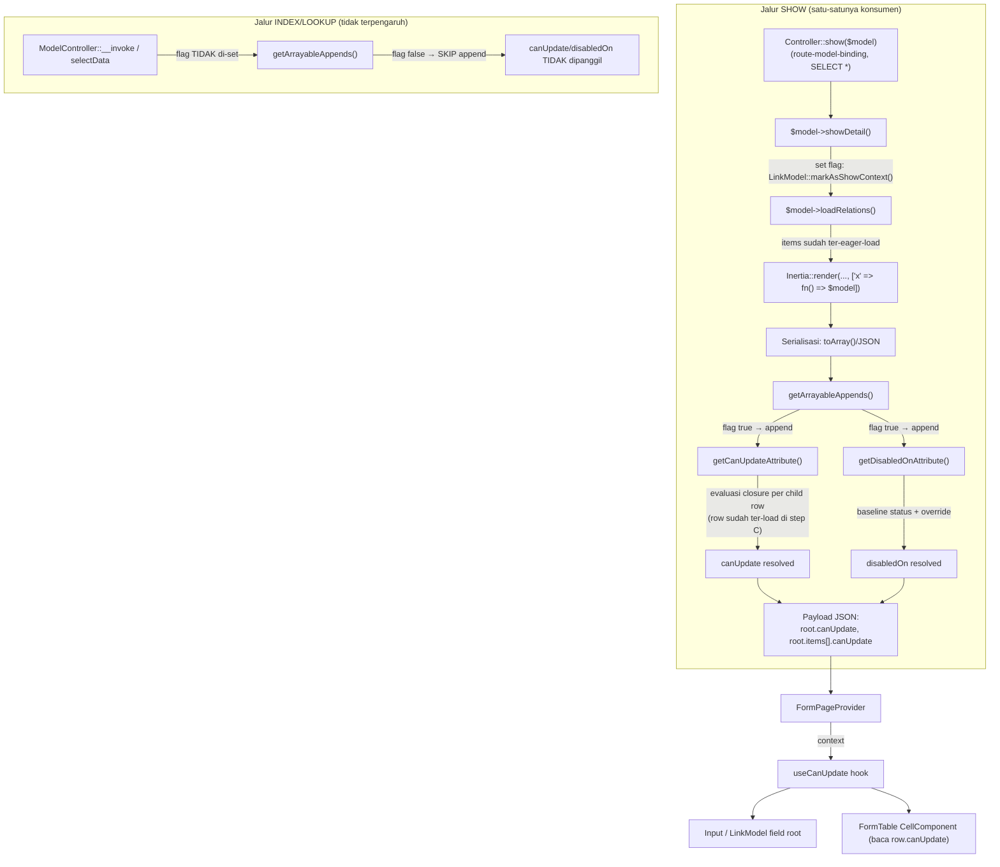

# Design Document: canUpdate Field Permission Contract

## Overview

Spec ini menambahkan satu computed attribute baru (`canUpdate`) dan
merombak satu computed attribute existing (`disabledOn`) pada model yang
memakai `App\Traits\LinkModel`. **Scope kritikal**: kedua attribute HANYA
computed pada model ROOT halaman `show`, TIDAK PERNAH pada endpoint
index/DataTable maupun lookup/dropdown, dan TIDAK PERNAH sbg attribute
independen milik child model.

**Pattern yang dipakai (semuanya sudah eksis di codebase, tidak ada
mekanisme generik baru diperkenalkan):**

1. **Computed attribute + `method_exists()` override** — pola identik
   `getCanDeleteAttribute()`/`getCanCancelAttribute()`.
2. **Runtime instance flag** — pola BARU tapi minimal: satu boolean
   property di-set oleh titik generic yang SUDAH dilalui semua controller
   `show()`, yaitu `DataTable::showDetail()`. Accessor `canUpdate`/
   `disabledOn` membaca flag ini utk memutuskan apakah dirinya perlu
   dihitung sama sekali.
3. **Closure sbg value dinamis** — pola yang sudah lazim di `configColumns`
   (`dependsOn`, `titleTrans` kadang closure). `canUpdate` memakai closure
   utk logic per-child-row, dievaluasi backend, HASILNYA di-attach ke
   representasi row — closure itu SENDIRI milik parent, bukan attribute
   child.
4. **React Context existing (`FormPageContext`)** — sudah membawa
   `disabled` global; tinggal ditambah pembacaan `canUpdate`/`disabledOn`
   dari `defaultData`, tanpa context baru.

**Yang TIDAK berubah / TIDAK disentuh:**
- `canDelete`, `canCancel` — tidak disentuh.
- `DataTableColumnSelector::resolveForSafe`/`dependsOn` metadata — TIDAK
  relevan spec ini, karena halaman `show` memakai Laravel route-model-
  binding standar (`SELECT *` implisit), bukan `ModelController`. Lihat
  "Architecture" poin 2.
- Mekanisme `evaluate()`/`evaluateExpression()` di FE — tetap ada utk
  keperluan lain, hanya pemanggilannya utk `disabledOn` yang dihapus.
- `PurchaseOrderItem` (dan child model lain) TIDAK mendapat accessor baru
  apa pun.

## Architecture



**Data flow ringkas:**
1. `Controller::show()` (mis. `PurchaseOrderController::show`) memanggil
   `$purchaseOrder->showDetail()` — titik generic dipakai SEMUA controller
   `show()` (46 file, tidak satupun perlu diubah).
2. Di dalam `showDetail()`, tambah SATU baris: tandai instance ini sedang
   dalam konteks show (lihat "Components and Interfaces" #2).
3. `loadRelations()` (dipanggil setelahnya, di closure lazy Inertia prop)
   meng-eager-load `items` seperti biasa — TIDAK ada perubahan di sini.
4. Saat model diserialize (`toArray()`), `getArrayableAppends()` cek flag:
   HANYA jika true, `canUpdate`/`disabledOn` masuk daftar appends dan
   accessor-nya dipanggil.
5. `getCanUpdateAttribute()` (di model ROOT) evaluasi seluruh closure di
   dalam struktur `canUpdate()` — termasuk closure level-relasi (mis.
   `items: fn($item) => [...]`) yang di-loop utk SETIAP child row yang
   SUDAH ter-load di langkah 3. Hasilnya di-attach ke representasi array
   `items` SEBELUM response dikirim.
6. `ModelController::__invoke` (index) dan `selectData` (lookup) TIDAK
   PERNAH memanggil `showDetail()` — flag tidak pernah ter-set di jalur
   ini, sehingga `getArrayableAppends()` tidak menambahkan `canUpdate`/
   `disabledOn`, accessor tidak terpanggil sama sekali (bukan cuma
   dibuang dari response).
7. FE terima payload flat: `canUpdate`/`disabledOn` di root, DAN
   `canUpdate` (tanpa `disabledOn`) di tiap elemen `items[]` — hasil
   closure parent yang sudah di-attach.

## Components and Interfaces

### 1. Backend — Flag runtime "show context" (`App\Traits\LinkModel`)

Property instance sederhana, default `false`:

```php
trait LinkModel {
    // ...
    protected bool $isShowContext = false;

    public function markAsShowContext(): static {
        $this->isShowContext = true;

        return $this;
    }
    // ...
}
```

### 2. Backend — Titik integrasi (`App\Traits\DataTable::showDetail()`)

```php
public function showDetail() {
    $this->markAsShowContext();

    if (static::$is_submitable ?? false) {
        Inertia::share([
            'prints' => Inertia::defer(...),
            // ... (tidak berubah)
```

Satu baris ditambahkan di awal method — SEMUA 46 controller `show()`
otomatis kebagian tanpa diubah satu per satu (Requirement 1 Kriteria 8).

**Kenapa property instance (bukan static/global flag):** model ROOT show
adalah SATU instance spesifik per request (`$purchaseOrder` yang di-resolve
route-model-binding) — tidak ada risiko flag "bocor" ke instance model lain
yang mungkin di-query dalam request yang sama (mis. saat `service->update()`
dipanggil dari endpoint lain), karena flag melekat ke OBJECT itu sendiri,
bukan ke class/request global. Ini juga menghindari kebutuhan reset/cleanup
di akhir request yang harus diingat manual — konsisten dengan prinsip least
surprise dibanding static property.

### 3. Backend — `getCanUpdateAttribute()` (App\Traits\LinkModel)

Lihat implementasi lengkap di #4 (evaluasi closure level-relasi butuh
dijelaskan bersamaan dengan `getCanUpdateAttribute()` karena keduanya
saling terkait — closure level-relasi adalah bagian dari method yang
sama, bukan komponen terpisah). Poin ringkas dulu:

- `canUpdate()` (override model, opsional) return
  `bool|array<string, bool|array|Closure>`.
- Closure level-FIELD biasa (bukan relasi many) dievaluasi dengan `$row =
  $this` (instance model saat ini) via `resolveCanUpdateValue()` — method
  private rekursif yang menggantikan tiap Closure yang ditemukan di
  struktur (di level manapun) dengan hasil pemanggilannya.
- Closure/array level-RELASI many butuh penanganan berbeda (dipanggil
  PER CHILD ROW, bukan dengan `$this`) — lihat #4.

Catatan: signature di atas MASIH generic (closure selalu terima `$row =
$this` di level manapun) — TIDAK cukup untuk closure level-relasi yang
harus dipanggil PER CHILD ROW dengan `$row` = instance child, bukan
instance parent. Lihat #4 di bawah untuk mekanisme sesungguhnya.

### 4. Backend — Evaluasi closure level-relasi (attach ke child row)

Closure level-relasi (`items: fn($item) => [...]`) BEDA dari closure
level-field biasa: ia harus dipanggil SEKALI PER CHILD ROW pada koleksi
relasi tsb, bukan sekali dengan `$this` (parent).

**Kendala teknis penting (ditemukan saat implementasi, bukan asumsi
awal):** child model (mis. `PurchaseOrderItem`) JUGA memakai trait
`LinkModel`, sehingga ia PUNYA `getCanUpdateAttribute()`-nya sendiri
(accessor generic dari trait — bukan method `canUpdate()` custom, lihat
Requirement 2 Kriteria 6). Eloquent SELALU memprioritaskan accessor di
atas raw attribute bernama sama — artinya `$childRow->setAttribute
('canUpdate', ...)` yang lalu dibaca via `$childRow->canUpdate`
(magic getter) TIDAK akan mengembalikan nilai yang di-set, melainkan
tetap memanggil `getCanUpdateAttribute()` milik child (yang defaultnya
`true`, karena child tidak override `canUpdate()`). Solusinya: property
PHP terpisah (`canUpdateOverride`, BUKAN Eloquent attribute) yang
diprioritaskan DI DALAM `getCanUpdateAttribute()` sebelum logic normal:

```php
trait LinkModel {
    private bool|array|null $canUpdateOverride = null;

    public function setCanUpdateOverride(bool|array $value): static {
        $this->canUpdateOverride = $value;

        return $this;
    }

    protected function getCanUpdateAttribute(): bool|array {
        if ($this->canUpdateOverride !== null) {
            return $this->canUpdateOverride;
        }

        $raw = \method_exists(static::class, 'canUpdate') ? $this->canUpdate() : true;
        if (! \is_array($raw)) {
            return $raw; // bool murni, tidak ada relasi untuk di-iterate.
        }

        $resolved = [];
        foreach ($raw as $key => $value) {
            $relationValue = $this->relationLoaded($key) ? $this->getRelation($key) : null;
            $isManyRelation = $relationValue instanceof \Illuminate\Support\Collection
                && ($value instanceof \Closure || \is_array($value));

            if ($isManyRelation) {
                // Field relasi many: closure/array dievaluasi PER CHILD ROW,
                // hasilnya di-set via property override (BUKAN setAttribute —
                // accessor child akan menang atas raw attribute bernama sama).
                $relationValue->each(function ($childRow) use ($value) {
                    $childRow->setCanUpdateOverride($this->resolveCanUpdateValue($value, $childRow));
                    $childRow->append('canUpdate'); // agar ikut toArray() child.
                });
                $resolved[$key] = true; // field relasi di root: whole-relation tetap allowed.

                continue;
            }
            $resolved[$key] = $this->resolveCanUpdateValue($value, $this);
        }

        return $resolved;
    }
}
```

**Kenapa `append('canUpdate')` juga wajib**: child TIDAK PERNAH masuk
show context (`isShowContext` tetap `false` pada child — hanya model ROOT
yang di-`markAsShowContext()`), sehingga `getAppends()` child TIDAK
otomatis menyertakan `canUpdate`. Tanpa `append()` eksplisit di sini,
`getArrayableAppends()` child tidak akan memanggil `getCanUpdateAttribute()`
sama sekali saat parent men-serialize koleksi `items`, walau
`canUpdateOverride` sudah ter-set. `append()` adalah method Eloquent
bawaan (`Illuminate\Database\Eloquent\Concerns\HasAttributes::append()`)
yang menambah nama ke `$this->appends` milik instance ybs — instance-scoped,
tidak memengaruhi instance child lain yang tidak diproses closure ini.

**Konsekuensi desain**: `canUpdate` pada representasi `items[]` MUNCUL
hasil `getCanUpdateAttribute()` milik `PurchaseOrderItem` SENDIRI (bukan
di-inject sbg raw attribute dari luar) — TAPI isinya `canUpdateOverride`
yang di-set parent, BUKAN hasil `canUpdate()` custom milik child (child
tidak override method tsb sama sekali, tetap konsisten Requirement 2
Kriteria 6: satu-satunya SUMBER KEBENARAN kontrak permission tetap
`canUpdate()` milik parent — child hanya jadi tempat penyimpanan/
serialisasi hasil komputasi itu).

**Bila `value` bukan closure/array** (mis. `items: true` — whole-relation
toggle tanpa detail per-field): TIDAK ada apa pun yang di-attach ke child
row — `items[]` pada payload TIDAK punya key `canUpdate` sama sekali
(child balik ke default `getCanUpdateAttribute()`-nya = `true`, TAPI
karena `append('canUpdate')` juga tidak dipanggil, key tsb tidak muncul
di `toArray()` — konsisten "field absen = allowed" tanpa payload bengkak),
dan `resolved['items'] = true` (field root level, dibaca FE sbg
"relasi items secara keseluruhan boleh diedit"). FE `useCanUpdate` (lihat
#7) menganggap absennya `row.canUpdate` sbg "allowed" (Property 2),
konsisten dengan semantik "field/attribute tak disebut = allowed".

### 5. Backend — `getDisabledOnAttribute()` (dirombak)

```php
protected function getDisabledOnAttribute(): bool {
    if (! (static::$is_submitable ?? false)) {
        return \method_exists(static::class, 'disabledOn') ? $this->disabledOn() : false;
    }

    $status = (array) $this->status;
    if (\in_array(FormStatus::CANCELED, $status, true) || \in_array(FormStatus::REJECTED, $status, true)) {
        return true; // short-circuit mutlak — override TIDAK dipanggil.
    }

    $baseline = ! \in_array(FormStatus::DRAFT, $status, true);

    return \method_exists(static::class, 'disabledOn') ? $this->disabledOn() : $baseline;
}
```

- Baseline `draft` → `false`; status lain → `true`; override (bila ada)
  SELALU dipanggil kecuali locked-mutlak, hasilnya REPLACE murni (bukan
  AND) — sesuai Requirement 3.

### 6. Backend — `getAppends()` (LinkModel.php:203-211)

```php
public function getAppends() {
    return array_values(array_unique(array_merge(
        $this->appends,
        ['route', 'canDelete', 'keyModel', 'appendStatus', 'thisModel'],
        method_exists(static::class, 'templateLink') ? ['templateLink'] : [],
        (static::$is_submitable ?? false) ? ['canCancel'] : [],
        $this->isShowContext ? ['canUpdate', 'disabledOn'] : [],
    )));
}
```

Hanya SATU baris tambahan (`$this->isShowContext ? [...] : []`) — inilah
mekanisme utama yang menegakkan Requirement 1 Kriteria 7 (show-only).
Di luar konteks show, `canUpdate`/`disabledOn` TIDAK masuk daftar
append sama sekali → `getArrayableAppends()` tidak memanggil accessornya.

### 7. Backend — `getColumns()` TIDAK didaftarkan (keputusan sadar)

`computeColumnsFlat()` (`LinkModel.php:594`) membangun daftar `$appends`
dari `$instance->getAppends()` pada instance BARU (`new static`, baris
617) — instance ini TIDAK PERNAH di-`markAsShowContext()`. Karena
`getAppends()` sekarang gated show-context (Komponen #6), `canUpdate`/
`disabledOn` TIDAK PERNAH masuk `$appends` di titik ini, sehingga
TIDAK PERNAH terdaftar sbg kolom metadata (`getColumns()`) — SAMA
SEKALI, bukan cuma `dependsOn`-nya.

**Ini keputusan disengaja, bukan bug**: `getColumns()` adalah metadata
SKEMA (dipakai picker/filter/whitelist DataTable) — scope-nya index/
lookup, tempat yang JUSTRU TIDAK boleh mengenal `canUpdate`/`disabledOn`
(Requirement 1 Kriteria 7). Menambahkan cabang `dependsOn` khusus untuk
keduanya di sini akan jadi DEAD CODE (tidak pernah tereksekusi, karena
prasyaratnya — attribute muncul di `$appends` instance metadata — tidak
pernah true). Exclusion dari UI picker/filter CUKUP ditegakkan lewat
`ALWAYS_ALLOWED_ATTRIBUTES`/`META_APPEND_COLUMN_NAMES` (#8-#9) — daftar
statis yang tidak bergantung pada instance/show-context.

### 8. Backend — `ModelController::ALWAYS_ALLOWED_ATTRIBUTES`

```php
private const ALWAYS_ALLOWED_ATTRIBUTES = [
    'route', 'canDelete', 'canUpdate', 'keyModel', 'appendStatus', 'thisModel', 'templateLink', 'disabledOn',
];
```

Tetap ditambahkan WALAU jalur `ModelController` tidak pernah menampilkan
`canUpdate` (flag show-only mencegahnya) — daftar ini juga dipakai
`safeLookupColumns` sbg ALLOWED METADATA generik (mencegah exception/
mismatch bila suatu saat kolom `canUpdate` ditanya lewat jalur lain),
konsisten perannya dengan `disabledOn` yang sudah lebih dulu terdaftar
di sana meski juga (setelah spec ini) show-only.

### 9. Frontend — `resources/js/lib/utils.js`

```js
export const META_APPEND_COLUMN_NAMES = [
  "route",
  "canDelete",
  "canUpdate",
  "keyModel",
  "appendStatus",
  "thisModel",
  "templateLink",
  "disabledOn",
];
```

### 10. Frontend — `useCanUpdate` hook

```jsx
// resources/js/Hooks/useCanUpdate.js
import { useContext } from "react";
import { get } from "lodash";
import { FormPageContext } from "@/Pages/Core/FormPage";

export default function useCanUpdate(fieldPath, row) {
  const context = useContext(FormPageContext);
  const { defaultData, disabled: propDisabled } = context ?? {};

  if (propDisabled) return false;
  if (defaultData?.disabledOn) return false;

  // row diberikan (dipanggil dari dalam FormTable child) → baca canUpdate
  // MILIK REPRESENTASI ROW itu (hasil attach closure parent, lihat
  // Components #4) — BUKAN accessor independen child.
  const source = row ? row?.canUpdate : defaultData?.canUpdate;

  if (typeof source === "boolean") return source;
  if (source == null) return true; // absen = allowed.

  const value = get(source, fieldPath);
  if (typeof value === "boolean") return value;

  return true; // field tak disebut / value object tanpa field spesifik = allowed.
}
```

- Dipanggil TANPA `row` di field root form: `useCanUpdate('customer')`.
- Dipanggil DENGAN `row` di dalam `FormTable`/`CellComponent`:
  `useCanUpdate('qty', item)` → baca `item.canUpdate.qty`.
- TIDAK butuh context terpisah utk row-level — `FormTable.jsx` sudah
  meneruskan `item` (row data) sbg prop langsung ke `CellComponent`
  (existing, tidak berubah); hook cukup terima `row` sbg parameter.

### 11. Frontend — Konsumen: `Input`/`FormInput`, `CellComponent`, `LinkModel`

```jsx
// field root (mis. dalam FormInput/LinkModel wrapper)
const canUpdate = useCanUpdate("customer");
<LinkModel disabled={disabled || !canUpdate} ... />

// dalam CellComponent (FormTable.jsx, per-row)
const canUpdateField = useCanUpdate(col.name, item);
<CellComponent disabled={disabled || !canUpdateField} ... />
```

Komponen `Input` primitif (`ui/input.jsx`) TIDAK perlu tahu soal
`canUpdate` — resolusi terjadi di level WRAPPER field (`FormInput`,
`LinkModel`, `CellComponent`), konsisten Requirement 5 Kriteria 4 (dibaca
sbg "komponen wrapper field", bukan tiap elemen `<input>` HTML).

### 12. Frontend — `FormPage.jsx` (baris 739-744) & `gjsRelationsTable.js`

```jsx
const disabled = useMemo(() => {
  return !!_disabled || !!defaultData?.disabledOn;
}, [_disabled, defaultData?.disabledOn]);
```

Hapus pemanggilan `evaluate(defaultData?.disabledOn, defaultData)` —
`disabledOn` sekarang boolean langsung. Audit `gjsRelationsTable.js` untuk
pemanggilan `evaluateExpression` yang sumbernya `disabledOn` spesifik;
ganti ke pembacaan boolean langsung. Pemanggilan `evaluateExpression`
untuk keperluan LAIN tidak disentuh.

## Data Models

### Struktur `canUpdate` (PHP, method override model)

```php
// PurchaseOrder.php (model ROOT)
protected function canUpdate(): bool|array {
    return [
        'customer' => true,
        'items' => fn ($item) => [
            'qty' => ! $item->have_stock_movement,
            'warehouse' => true,
        ],
        'payment_schedules' => true,
    ];
}
```

`PurchaseOrderItem` (child) **TIDAK** punya method `canUpdate()` sendiri
— closure di atas SATU-SATUNYA sumber kebenaran utk permission field
`items`.

### Payload JSON (hasil akhir dikirim ke FE, HANYA di halaman show)

```json
{
  "id": "...",
  "customer": {"...": "..."},
  "status": ["draft"],
  "disabledOn": false,
  "canUpdate": {
    "customer": true,
    "items": true,
    "payment_schedules": true
  },
  "items": [
    {
      "id": "...",
      "item": {"...": "..."},
      "canUpdate": { "qty": false, "warehouse": true }
    },
    {
      "id": "...",
      "item": {"...": "..."},
      "canUpdate": { "qty": true, "warehouse": true }
    }
  ]
}
```

Payload endpoint index (`ModelController::__invoke`) / lookup
(`selectData`) atas model & data YANG SAMA **TIDAK** mengandung key
`canUpdate`/`disabledOn` sama sekali — baik di root maupun di `items[]`.

### Shape kontrak (dokumentasi, bukan enforced types)

```
type CanUpdateValue = boolean | { [field: string]: boolean };
// root: object (hasil canUpdate() model), atau boolean murni (blanket).
// child row (items[].canUpdate): object hasil closure parent, atau ABSEN
// (bila field relasi valuenya bool/tanpa closure).
```

## Correctness Properties

**Property 1 — Default allowed.**
_For any_ model M yang memakai `LinkModel`, dalam konteks show, TIDAK
meng-override `canUpdate()`: `M->canUpdate SHALL === true`.
**Validates: Requirement 1.2, 6.1**

**Property 2 — Field/row absen = allowed.**
_For any_ hasil `canUpdate` berupa object O dan field F yang bukan key
di O (root ATAU child row), resolusi FE (`useCanUpdate`) atas F SHALL
`=== true`.
**Validates: Requirement 1.5, 5.5**

**Property 3 — Closure tidak bocor ke payload.**
_For any_ struktur `canUpdate()` yang mengandung Closure di level manapun
(termasuk level-relasi), `json_encode` hasil akhir (root DAN tiap child
row `items[].canUpdate`) SHALL tidak melempar exception.
**Validates: Requirement 2.4**

**Property 4 — Scope show-only ditegakkan di getAppends(), bukan response filtering.**
_For any_ model M dengan `$isShowContext === false` (default),
`M->getAppends()` SHALL TIDAK mengandung `'canUpdate'` maupun
`'disabledOn'` — DAN accessor `getCanUpdateAttribute()`/
`getDisabledOnAttribute()` SHALL TIDAK pernah dipanggil (verifiable via
spy/mock method call count = 0).
**Validates: Requirement 1.7, 6.2**

**Property 5 — disabledOn locked mutlak pada canceled/rejected.**
_For any_ model submitable M (dalam show context) dengan status
mengandung CANCELED atau REJECTED, DAN untuk SEMUA implementasi
`disabledOn()` override (termasuk yang mengembalikan `false`),
`M->disabledOn SHALL === true`.
**Validates: Requirement 3.5**

**Property 6 — disabledOn short-circuit di FE.**
_For any_ `defaultData.disabledOn === true`, `useCanUpdate(field)` SHALL
mengembalikan `false` utk field root APA PUN, TANPA bergantung isi
`defaultData.canUpdate`.
**Validates: Requirement 3.9, 5.2**

**Property 7 — Non-submitable baseline stabil.**
_For any_ model M yang TIDAK memakai `Submitable` DAN TIDAK override
`disabledOn()` (dalam show context): `M->disabledOn SHALL === false`.
**Validates: Requirement 3.3**

**Property 8 — Child TIDAK punya accessor independen.**
_For any_ child model class C yang dipakai sbg relasi many pada model
ROOT: `method_exists(C, 'getCanUpdateAttribute')` dan
`method_exists(C, 'canUpdate')` yang DIDEKLARASIKAN LANGSUNG di C (bukan
di trait `LinkModel` yang di-inherit) SHALL `false`, KECUALI C juga
independen jadi model ROOT show di halaman lain (dalam hal itu C
memakai mekanisme yang SAMA sbg root, bukan sbg child).
**Validates: Requirement 2.6**

## Error Handling

| Scenario | Behavior |
|----------|----------|
| Model override `canUpdate()` return tipe selain `bool`/`array` | PHP union return type `bool\|array` → `TypeError` otomatis (fail-fast) |
| Closure dalam `canUpdate()` melempar exception saat dievaluasi | TIDAK di-catch khusus — exception menjalar keluar (konsisten `getCanDeleteAttribute()`) |
| Model submitable tapi kolom `status` NULL (race condition sebelum hook `creating`) | `(array) null` → `[]`, tidak match DRAFT/CANCELED/REJECTED → baseline `disabledOn = true` (fail-closed) |
| `useCanUpdate` dipanggil di luar `FormPageProvider` (context `undefined`) | `context ?? {}` → seluruh field allowed & tidak disabled (fail-open FE, konsisten `useFormPageMeta` existing) |
| Relasi many disebut di `canUpdate()` TAPI relasi tsb TIDAK ter-eager-load (mis. `items` tidak masuk `loadRelationsOnShow()`) | `getRelationValue($key)` return `null` (bukan Collection) → closure/array TIDAK di-iterate ke child (tidak ada child row utk diproses); `resolved[$key]` tetap diisi via `resolveCanUpdateClosures` biasa dgn `$row = $this` (closure menerima instance PARENT, bukan child — developer WAJIB pastikan relasi yang dipakai closure level-relasi memang ter-load saat show) |
| `showDetail()` dipanggil TAPI kode lama memanggil `loadRelations()` SEBELUM `showDetail()` (urutan terbalik) | Tidak masalah — flag `isShowContext` dan proses `loadRelations()` independen; accessor dipanggil belakangan saat serialize (`toArray()`), setelah keduanya selesai. Urutan showDetail vs loadRelations tidak signifikan asalkan keduanya terjadi sebelum response dikirim |

## Testing Strategy

### Unit Tests (PHPUnit)
- `getAppends()`: tanpa `markAsShowContext()` → tidak mengandung
  `canUpdate`/`disabledOn`. Setelah `markAsShowContext()` → mengandung
  keduanya.
- `getCanUpdateAttribute()` default `true` tanpa override (dalam show
  context).
- `getCanUpdateAttribute()` dengan override array berisi closure level-
  field biasa — assert hasil tidak mengandung instance `Closure`.
- `getCanUpdateAttribute()` dengan closure level-relasi: assert SETIAP
  child row pada koleksi punya attribute `canUpdate` ter-set sesuai hasil
  closure utk row tsb (assert per-row berbeda, mis. row A locked row B
  tidak).
- `getDisabledOnAttribute()`: seluruh kombinasi status × override, sama
  seperti draf sebelumnya (non-submitable, draft, canceled/rejected
  short-circuit, status lain replace) — SEMUA test case dijalankan dalam
  show context (`markAsShowContext()` dipanggil dulu).
- **Baru**: assert bahwa TANPA `markAsShowContext()`, method
  `canUpdate()`/`disabledOn()` override model (mock/spy) SAMA SEKALI
  TIDAK terpanggil.

### Property-Based Tests
- Property 1, 2, 5, 7 di atas via PHPUnit `#[DataProvider]` (kombinasi
  status × ada/tidaknya override × show-context flag).

### Integration Tests (Feature test)
- Request `show` model submitable dengan child items (salah satu
  `have_stock_movement = true`) → assert response JSON:
  `data.disabledOn`, `data.canUpdate` sesuai override, DAN
  `data.items[].canUpdate.qty` beda per row sesuai kondisi masing-masing.
- Request `index` (`ModelController::__invoke`) model & data YANG SAMA →
  assert response `data[].canUpdate`/`data[].disabledOn` TIDAK ADA
  (key absen, bukan `null`).
- Request lookup (`selectData`/`LinkModel`) → assert sama (key absen).
- Assert `canUpdate` tidak muncul di response `columns` (metadata picker)
  pada endpoint mana pun.

### Frontend Tests (bila konvensi Jest/RTL sudah ada di project)
- `useCanUpdate` hook: field absen → `true`; `defaultData.disabledOn`
  true → `false` semua field; `row` diberikan → baca `row.canUpdate`,
  bukan `defaultData.canUpdate`; `row.canUpdate` absen (relasi valuenya
  bool) → `true`.
