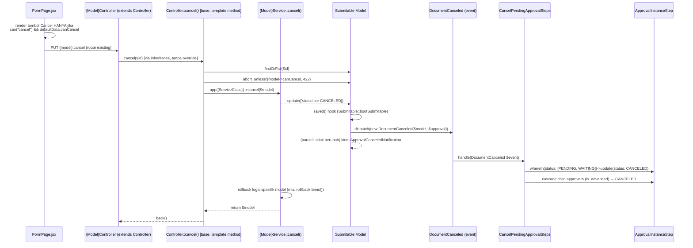

# Design Document: Cancel Workflow Improvements

## Overview

Design ini menstandardisasi alur cancel dokumen submitable lewat empat perubahan yang saling independen tapi terhubung:

1. **`canCancel` computed attribute** di trait `Submitable` — pola AND-override identik dengan `getCanDeleteAttribute()` di `LinkModel.php`, di-append otomatis lewat perluasan mekanisme `getAppends()`/`getArrayableAppends()` yang sudah ada.
2. **Frontend gating tambahan** — satu baris di `FormPage.jsx` menambah cek `defaultData?.canCancel`, mengikuti pola tombol Delete. Infrastruktur permission (`can("cancel", ...)`) SUDAH ADA, tidak dibuat baru.
3. **Event `DocumentCanceled` + Listener `CancelPendingApprovalSteps`** — pola arsitektur BARU untuk codebase ini (belum ada `app/Events`/`app/Listeners` sebelumnya). Ini keputusan sadar user untuk memulai transisi ke pola Event/Listener standar Laravel, bukan menambah lagi ke closure `saved()` inline yang sudah ada di `Submitable.php`.
4. **`Controller::cancel()` template method** — orkestrasi standar (resolve model → guard `canCancel` → panggil Service → response), Service tetap satu-satunya tempat rollback logic per-model.

**Yang TIDAK berubah:**

- Guard permission `cancel` di `Controller.php` konstruktor (baris ±154) — tetap seperti sekarang.
- Notifikasi `ApprovalCanceledNotification` di closure `saved()` `Submitable.php` (baris ±111-140) — tetap jalan seperti sekarang, event baru ini TAMBAHAN paralel, bukan pengganti.
- Signature dan isi `{Model}Service::cancel()` yang sudah ada (mis. `SalesOrderService::cancel()`) — tetap jadi tempat rollback logic, hanya dipanggil lewat jalur baru (base `Controller::cancel()`).
- Tiap `{Model}Controller` TIDAK wajib langsung migrasi ke base `cancel()` di iterasi ini — method `cancel()` yang sudah ada di 9 controller submitable boleh tetap ada; base method disediakan untuk dipakai controller yang menghapus override-nya (lihat Components di bawah, dan keputusan scope di Requirement 5.5 — akan dikonfirmasi ulang di tasks.md).

## Architecture



**Data flow ringkas:**

`canCancel` dihitung on-read (accessor), bukan disimpan sebagai kolom — sama seperti `canDelete`. Tiap kali model di-serialize (`toArray()`/response Inertia), Eloquent memanggil `getCanCancelAttribute()` yang menghitung ulang dari `status` saat itu. Tidak ada caching, tidak ada kolom DB baru untuk `canCancel`.

Cascade approval-step berjalan SETELAH `$model->update()` sukses (event `saved`, transaksi DB sudah commit di level model save) — konsisten dengan alasan notifikasi existing dipasang di `saved` bukan `saving` (lihat komentar `Submitable.php` baris ±106-110): efek samping tidak boleh terjadi untuk save yang gagal.

## Components and Interfaces

### 1. `app/Traits/Submitable.php` — tambah `canCancel` + dispatch event

```php
// Accessor baru — pola identik getCanDeleteAttribute() di LinkModel.php
protected function getCanCancelAttribute(): bool {
    $condition = ! \in_array(FormStatus::DRAFT, (array) $this->status)
        && ! \in_array(FormStatus::CANCELED, (array) $this->status);
    if (! \method_exists(static::class, 'canCancel')) {
        return $condition;
    }
    return $condition && $this->canCancel();
}
```

Di `bootSubmitable()`, closure `saved()` yang SUDAH ADA (baris ±111-140, yang kirim `ApprovalCanceledNotification`) ditambah SATU baris dispatch event, TANPA mengubah logic notifikasi yang sudah ada:

```php
self::saved(function ($model) {
    if (! ($model->isSubmitable() ?? false) || ! $model->wasChanged('status')) {
        return;
    }
    if (! \in_array(FormStatus::CANCELED, $model->status)) {
        return;
    }

    $approval = $model->approvalable;
    if (! $approval) {
        return;
    }

    // BARU: dispatch event — listener terpisah menangani cascade step.
    event(new DocumentCanceled($model, $approval));

    // (tidak berubah) logic notifikasi existing di bawah ini tetap jalan
    $pendingSteps = $approval->steps->whereIn('status', [FormStatus::PENDING, FormStatus::WAITING]);
    ...
});
```

**Alasan dispatch tetap di closure yang sama** (bukan closure `saved()` baru terpisah): kondisi guard-nya (`isSubmitable`, `wasChanged('status')`, `in_array(CANCELED, ...)`, `$approval` tidak null) IDENTIK antara trigger notifikasi dan trigger event. Duplikasi seluruh blok guard di closure kedua hanya untuk memisahkan satu baris `event()` menambah kompleksitas tanpa manfaat — satu-satunya hal yang benar-benar dipisah adalah APA yang terjadi setelah guard lolos (notifikasi vs cascade update), dan itu sudah tercapai lewat pemisahan Event/Listener.

### 2. `app/Events/Core/DocumentCanceled.php` (BARU)

**Struktur folder Event/Listener — keputusan user:** dipisah `{Domain}/{Feature}`, mengikuti konvensi domain existing (`Core`, `Sales`, `Purchase`, `Inventory`, `Finances`, `Service`, `Helpdesk`, `User` — dipakai di `app/Services/{Domain}/` dan `app/Models/{Domain}/`). Pemicu nested folder `{Feature}` adalah JUMLAH FILE yang saling terkait untuk satu fitur (nyata ATAU diprediksi tumbuh) — BUKAN sekadar "file ini spesifik ke satu fitur atau tidak" (revisi setelah klarifikasi user; lihat `app/Services/Core/PrintTemplate/` sebagai precedent: 9 file nested karena jumlahnya, bukan cuma karena spesifik). `DocumentCanceled` adalah SATU event tunggal, tidak diprediksi akan didampingi event sejenis lain (dokumen submitable yang dibatalkan tetap satu jenis event, siapa pun listener-nya) — TIDAK dibungkus folder Feature, cukup `Core/DocumentCanceled.php`.

```php
namespace App\Events\Core;

use App\Models\Core\ApprovalInstance;
use App\Models\Model;
use Illuminate\Foundation\Events\Dispatchable;
use Illuminate\Queue\SerializesModels;

class DocumentCanceled {
    use Dispatchable, SerializesModels;

    public function __construct(
        public readonly Model $document,
        public readonly ApprovalInstance $approvalInstance,
    ) {}
}
```

### 3. `app/Listeners/Core/Approval/CancelPendingApprovalSteps.php` (BARU)

Berbeda dengan event-nya, domain approval punya banyak aksi/listener terkait (approve, reject, pending, dan sekarang cancel) — diprediksi akan tumbuh menampung listener approval lain ke depan, bukan cuma menampung satu file ini selamanya. Sesuai aturan jumlah-file-diprediksi (bukan sekadar "spesifik"), listener ini nested `Approval/` secara preemptif. Hasil akhirnya sengaja ASIMETRIS antara Event dan Listener karena prediksi pertumbuhan masing-masing berbeda:
- `app/Events/Core/DocumentCanceled.php` (generik, tanpa Feature)
- `app/Listeners/Core/Approval/CancelPendingApprovalSteps.php` (spesifik Approval, dengan Feature)

```php
namespace App\Listeners\Core\Approval;

use App\Enums\FormStatus;
use App\Events\Core\DocumentCanceled;

class CancelPendingApprovalSteps {
    public function handle(DocumentCanceled $event): void {
        $steps = $event->approvalInstance->steps()
            ->whereIn('status', [FormStatus::PENDING->value, FormStatus::WAITING->value])
            ->get();

        foreach ($steps as $step) {
            $step->update(['status' => FormStatus::CANCELED]);

            if ($step->is_advanced) {
                $step->approvers()
                    ->where('status', FormStatus::PENDING->value)
                    ->update(['status' => FormStatus::CANCELED->value]);
            }
        }
    }
}
```

Idempotensi (Requirement 4.3): query `whereIn('status', [PENDING, WAITING])` secara alami idempoten — pemanggilan kedua untuk dokumen yang sama tidak menemukan step berstatus PENDING/WAITING lagi (sudah CANCELED dari pemanggilan pertama), sehingga `$steps` kosong dan loop tidak melakukan apa-apa. Tidak perlu flag/lock tambahan.

### 4. `app/Providers/AppServiceProvider.php` — registrasi listener

Tidak ada `EventServiceProvider` di codebase ini (dicek: hanya `AppServiceProvider.php` di `app/Providers/`). Registrasi ditambahkan di `boot()` memakai facade `Event`, konvensi Laravel 11/12 (menggantikan pola `$listen` array):

```php
use App\Events\Core\DocumentCanceled;
use App\Listeners\Core\Approval\CancelPendingApprovalSteps;
use Illuminate\Support\Facades\Event;

public function boot(): void {
    Vite::prefetch(concurrency: 3);
    Event::listen(DocumentCanceled::class, CancelPendingApprovalSteps::class);
    ...
}
```

### 5. `app/Http/Controllers/Controller.php` — template method `cancel()` + property `$service`

```php
use App\Enums\FormStatus;
use Illuminate\Support\Facades\DB;

abstract class Controller {
    protected string $model;
    protected $service;   // BARU — pola identik $this->model
    ...

    public function cancel(string $id) {
        $data = $this->model::findOrFail($id);
        abort_unless($data->canCancel ?? false, 422);

        DB::beginTransaction();
        try {
            $this->service->cancel($data);
            $data->logForCancelled();
            DB::commit();
        } catch (\Throwable $e) {
            DB::rollBack();
            throw $e;
        }

        return back();
    }
}
```

**Pencatatan log — `logForCancelled()`:** ditemukan SUDAH ADA di `app/Traits/DataTable.php` (baris 198-211), signature dan isi lengkap (buat entri `Log` dengan pesan `":user canceled this"` / `":user telah membatalkan"`, pola identik `logForCreated()`/`logForSubmitted()`/`logForDeleted()` yang sudah dipakai di controller lain). TEMUAN: method ini TIDAK PERNAH dipanggil di manapun di codebase saat ini (0 pemanggilan, dicek lewat pencarian `logForCancelled` di seluruh `app/`) — gap tersendiri di luar 5 poin awal spec ini, ditemukan saat riset komponen ini. Base `Controller::cancel()` memanggilnya SETELAH `$this->service->cancel($data)` sukses, DI DALAM transaksi yang sama (konsisten dengan pola `SalesOrderController::destroy()` yang memanggil `$salesOrder->logForDeleted()` sebelum `DB::commit()`).

**Transaksi dibungkus di base, BUKAN di tiap Service** (koreksi dari draft sebelumnya, dipicu pertanyaan user: "apakah event listener masih memungkinkan pakai DB transaction, atau listener jalan di polling mandiri?"). Investigasi kode menemukan: listener non-queued (`CancelPendingApprovalSteps`) berjalan SINKRON dalam call stack yang sama dengan `Service::cancel()` — dispatch event terjadi di closure `saved()` yang terpicu SAAT `update()` dipanggil, BUKAN setelah commit. Konsekuensinya, listener otomatis ikut transaksi DB manapun yang sedang terbuka — TAPI hanya 4 dari 9 `{Model}Service::cancel()` yang sebelumnya membungkus `DB::beginTransaction()`/`commit()` sendiri (`SalesOrderService`, `InternalOrderService`, `StockEntryService`, `PurchaseOrderService`); 5 lainnya (`SalesInvoiceService`, `PurchaseInvoiceService`, `DeliveryNoteService`, `PurchaseRequestService`, `PaymentEntryService`) TIDAK ber-transaksi sama sekali.

Memindah `DB::beginTransaction()`/`commit()` ke base `Controller::cancel()` (dibungkus SEBELUM memanggil `$this->service->cancel($data)`) menyelesaikan ini secara seragam untuk SEMUA 9 model, tanpa perlu menyunting isi tiap Service satu-satu. Laravel `DB::beginTransaction()` mendukung nested call secara aman (transaction-level counter internal — `beginTransaction()`/`commit()` yang SUDAH ADA di 4 Service tetap boleh dibiarkan, akan otomatis ter-nest di dalam transaksi base tanpa konflik atau perilaku ganda; TIDAK WAJIB dihapus dari 4 Service tersebut, meski secara teknis jadi redundan).

Tiap controller anak (9 controller submitable) TIDAK LAGI meredeklarasi property `$service` sendiri (`private SalesOrderService $service;` dihapus) — cukup assign ke property `$service` milik base di constructor:

```php
// SalesOrderController.php — SEBELUM
class SalesOrderController extends Controller {
    private SalesOrderService $service;   // redeclare property sendiri

    public function __construct(Request $request, SalesOrderService $service) {
        $this->service = $service;
        parent::__construct($request, SalesOrder::class);
    }

    public function cancel(SalesOrder $salesOrder) {   // override manual, boilerplate berulang di 9 file
        $this->service->cancel($salesOrder);
        return back();
    }
}

// SalesOrderController.php — SESUDAH
class SalesOrderController extends Controller {
    public function __construct(Request $request, SalesOrderService $service) {
        $this->service = $service;   // assign ke property base, TIPE tetap dijaga oleh type-hint constructor param
        parent::__construct($request, SalesOrder::class);
    }

    // method cancel() dihapus dari sini — otomatis pakai base Controller::cancel()
}
```

**Kenapa pendekatan ini, bukan resolve FQCN dari konvensi namespace (opsi yang dipertimbangkan sebelumnya):**
Pertanyaan user saat review — "kenapa tidak `$this->service` saja seperti pola `$this->model`?" — membongkar bahwa opsi konvensi-namespace (menebak `App\Services\{Domain}\{Model}Service` dari string `$this->model`) adalah workaround yang TIDAK PERLU. Base `Controller` sudah mendemonstrasikan pola yang benar lewat `protected string $model` — dideklarasikan di base, DIISI oleh controller anak lewat `parent::__construct()`. Tidak ada alasan `$service` diperlakukan beda: cukup deklarasikan `protected $service` di base yang sama, controller anak assign nilainya sebelum atau sesudah `parent::__construct()`. Ini menghilangkan seluruh risiko yang melekat pada pendekatan konvensi-namespace: tidak ada `BindingResolutionException` jika penamaan Service menyimpang, tidak ada asumsi implisit yang harus diverifikasi manual ke 9 model.

Type-hint `$service` di base sengaja TIDAK diberi tipe spesifik (bukan `protected SalesOrderService $service`) karena base class dipakai SEMUA controller submitable dengan Service class yang berbeda-beda — properti bertipe generik (tanpa deklarasi tipe, atau `protected mixed $service` bila ingin eksplisit) di base, sementara type-safety tetap terjaga di titik constructor tiap controller anak lewat parameter yang bertipe spesifik (`SalesOrderService $service`).

### 6. `resources/js/Pages/Core/FormPage.jsx` — ganti guard, bukan tambah

Baris ±1154-1158, kondisi render tombol Cancel. `isCompletedStatus(...)` DIHAPUS (bukan dipertahankan berdampingan) — `canCancel` menjadi satu-satunya sumber kebenaran:

```diff
-  : !isCompletedStatus(defaultData?.status) &&
+   defaultData?.canCancel &&
    can("cancel", submitable && { user_id: defaultData?.created_by_id }) && (
      <Button ... onClick={cancel} variant="destructive">
        {t("core.form.cancel")}
      </Button>
    ))
```

Import `isCompletedStatus` di baris ±52 dihapus juga jika tidak dipakai di tempat lain pada file ini (perlu dicek saat implementasi — grep menunjukkan hanya dipakai sekali di file ini, jadi kemungkinan besar import-nya juga dihapus seluruhnya).

**Konsekuensi langsung — 8 model WAJIB dapat override `canCancel()`:**
Baseline `canCancel` (Requirement 3.1/3.4) sengaja TIDAK mengenal status domain-spesifik. `isCompletedStatus()` (definisi lama: `["completed", "done", "delivered", "billed"]`) sebelumnya jadi satu-satunya penghalang tombol Cancel muncul untuk dokumen berstatus "selesai". Menghapusnya tanpa override per-model berarti REGRESI: tombol Cancel akan muncul untuk dokumen yang seharusnya sudah final.

Model dengan Service yang mengandung logic status selesai domain-spesifik (hasil pengecekan awal, WAJIB diverifikasi ulang per-model saat implementasi — daftar ini bisa tidak lengkap/tidak akurat):
`TicketService`, `SalesInvoiceService`, `SalesOrderService`, `WorkOrderService`, `PurchaseReceiptService`, `PurchaseInvoiceService`, `DeliveryNoteService`, `PurchaseOrderService`.

Tiap model terkait WAJIB menambahkan method `canCancel()` di class Model-nya (bukan Service — accessor `getCanCancelAttribute()` di `Submitable.php` memanggil `$this->canCancel()` pada MODEL, lihat Requirement 3.2), contoh untuk `DeliveryNote`:

```php
// app/Models/Inventory/DeliveryNote.php
public function canCancel(): bool {
    return ! \in_array(FormStatus::DELIVERED, (array) $this->status);
}
```

`[TODO: task implementasi WAJIB memverifikasi status enum persis apa yang dipakai tiap 8 model di atas — nama value FormStatus bisa berbeda dari string "completed"/"done"/"delivered"/"billed" yang dipakai isCompletedStatus() versi frontend (JS pakai string lepas, PHP kemungkinan pakai FormStatus enum case). Jangan asumsikan mapping 1:1 tanpa membaca FormStatus.php dan tiap Model/Service terkait.]`

## Data Models

Tidak ada perubahan skema database. `canCancel` adalah computed attribute (accessor), bukan kolom. `ApprovalInstanceStep.status` dan `ApprovalInstanceStepApprover.status` (jika ada tabel child approver terpisah — perlu diverifikasi nama tabel/model persis saat implementasi) menggunakan value enum `FormStatus::CANCELED` yang SUDAH ADA di `app/Enums/FormStatus.php` (dipakai dokumen induk) — tidak perlu menambah enum value baru, cukup memastikan `CANCELED` valid dipakai di context step approval (perlu dicek apakah ada constraint/validasi yang membatasi value status step ke subset tertentu).

## Correctness Properties

**Property 1 — canCancel monoton terhadap status**
_For any_ dokumen submitable dengan status BUKAN `DRAFT` dan BUKAN `CANCELED`, DAN model tidak mengimplementasikan `canCancel()` custom, THE `$model->canCancel` SHALL bernilai `true`.
**Validates: Requirement 3.1, 3.3**

**Property 2 — override hanya mempersempit**
_For any_ dokumen dengan baseline `canCancel` bernilai `true`, DAN model mengimplementasikan `canCancel()` yang mengembalikan `false`, THE `$model->canCancel` SHALL bernilai `false` (override tidak pernah bisa membuat `true` jika baseline `false`).
**Validates: Requirement 3.2**

**Property 3 — cascade lengkap tanpa sisa**
_For any_ `ApprovalInstance` dengan N step berstatus `PENDING`/`WAITING` SEBELUM dokumen dibatalkan, SETELAH `DocumentCanceled` listener selesai, THE jumlah step dengan status `PENDING`/`WAITING` pada instance tersebut SHALL menjadi 0.
**Validates: Requirement 4.2**

**Property 4 — idempotensi cascade**
_For any_ `ApprovalInstance` yang listener-nya sudah dijalankan sekali, pemanggilan `CancelPendingApprovalSteps::handle()` KEDUA kalinya dengan event yang sama SHALL tidak mengubah state apapun (no-op) dan tidak melempar exception.
**Validates: Requirement 4.3**

**Property 5 — notifikasi tidak terpengaruh**
_For any_ dokumen yang dibatalkan, THE `ApprovalCanceledNotification` SHALL tetap terkirim ke kandidat approver dengan payload identik seperti sebelum perubahan ini (regresi terhadap behavior existing).
**Validates: Requirement 4.4**

## Error Handling

| Scenario                                                                                                                                                   | Behavior                                                                                                                                                                                                                                                                                                                                                                                                              |
| ---------------------------------------------------------------------------------------------------------------------------------------------------------- | --------------------------------------------------------------------------------------------------------------------------------------------------------------------------------------------------------------------------------------------------------------------------------------------------------------------------------------------------------------------------------------------------------------------- |
| User klik Cancel tapi `canCancel` sudah `false` (mis. race condition — status berubah di request lain sebelum submit)                                      | Base `Controller::cancel()` melempar `abort(422)`. Frontend tampilkan error standar Inertia (validation error banner).                                                                                                                                                                                                                                                                                                |
| Dokumen submitable tidak punya `ApprovalInstance` (belum pernah masuk approval)                                                                            | Closure `saved()` sudah punya guard `if (! $approval) { return; }` — event `DocumentCanceled` TIDAK di-dispatch sama sekali. Listener tidak pernah dipanggil. Tidak ada error.                                                                                                                                                                                                                                        |
| `$this->service` belum di-assign di controller anak (lupa saat migrasi 9 controller ke pola base — lihat Requirement 5.5)                                  | PHP melempar error akses property tak terinisialisasi (typed property) saat `$this->service->cancel($data)` dipanggil. Terdeteksi langsung saat controller diakses pertama kali (bukan silent failure) — regresi test yang memanggil route `cancel` akan gagal segera.                                                                                                                                              |
| **[REVISI — lihat catatan di bawah tabel]** Listener `CancelPendingApprovalSteps` gagal (exception) SETELAH `$model->update()` dipanggil                   | Karena listener event non-queued berjalan SINKRON pada call stack yang sama dengan pemanggil, dan dispatch terjadi DI DALAM closure `saved()` yang terpicu SAAT `update()` dipanggil (bukan setelah `DB::commit()`) — **JIKA** `Service::cancel()` model tersebut dibungkus `DB::beginTransaction()`/`DB::commit()`, maka exception di listener OTOMATIS ikut merollback status dokumen (atomicity terjaga tanpa kode tambahan). **JIKA TIDAK** dibungkus transaksi, `update()` auto-commit dan kegagalan listener TIDAK BISA merollback status yang sudah CANCELED. Lihat Requirement 5.6 (BARU) — temuan aktual: 5 dari 9 Service (`SalesInvoiceService`, `PurchaseInvoiceService`, `DeliveryNoteService`, `PurchaseRequestService`, `PaymentEntryService`) SAAT INI TIDAK dibungkus transaksi sama sekali. |
| Step approval `is_advanced` (multi-approver) dengan SEBAGIAN child approver sudah `APPROVED`/`REJECTED` (bukan semua `PENDING`) sebelum dokumen dibatalkan | Listener HANYA meng-update child approver berstatus `PENDING` (lihat kode Listener) — approver yang sudah membuat keputusan (`APPROVED`/`REJECTED`) TIDAK ditimpa, historinya tetap terjaga.                                                                                                                                                                                                                          |

**Catatan revisi (menjawab pertanyaan user saat review — "apakah event listener masih memungkinkan pakai DB transaction, atau listener jalan di polling mandiri?"):**

Listener event non-queued (yang kita pakai, `CancelPendingApprovalSteps` TANPA `implements ShouldQueue`) BUKAN proses terpisah yang polling database — dia adalah pemanggilan fungsi biasa yang terjadi SINKRON di PHP call stack yang sama dengan kode yang men-dispatch event. Konsekuensinya: listener OTOMATIS ikut transaksi DB manapun yang sedang terbuka di koneksi tersebut, TANPA butuh kode tambahan — karena `DB::beginTransaction()` adalah scope per-koneksi database, bukan per-query/per-fungsi.

Titik krusialnya BUKAN pada Event/Listener itu sendiri, melainkan pada TITIK dispatch: closure `saved()` Eloquent terpicu SAAT `update()` dipanggil, BUKAN setelah `DB::commit()`. Jadi selama `update()` terjadi DI DALAM blok `DB::beginTransaction()` ... `DB::commit()`, listener yang ter-trigger di tengah situ otomatis "menumpang" transaksi yang sama.

**Temuan investigasi kode aktual** (dicek langsung ke 9 file `{Model}Service::cancel()`):
- **BER-transaksi** (aman, listener otomatis atomik): `SalesOrderService`, `InternalOrderService`, `StockEntryService`, `PurchaseOrderService`.
- **TIDAK ber-transaksi** (listener gagal = status CANCELED permanen tanpa rollback): `SalesInvoiceService`, `PurchaseInvoiceService`, `DeliveryNoteService`, `PurchaseRequestService`, `PaymentEntryService`.

Ini bukan masalah yang diperkenalkan oleh Event/Listener — 5 Service ini SUDAH tidak atomik SEBELUM spec ini (update status + kemungkinan operasi lain tanpa transaksi). Tapi menambah listener yang bisa gagal (query DB tambahan = permukaan kegagalan tambahan) MEMPERBESAR window risiko itu. Lihat Requirement 5.6 (BARU) untuk keputusan penanganannya.

## Testing Strategy

**Unit Tests**

- `Submitable::getCanCancelAttribute()` — assert baseline true/false untuk tiap kombinasi status (DRAFT, NEED_APPROVAL, APPROVED, CANCELED, REJECTED).
- `Submitable::getCanCancelAttribute()` dengan model dummy yang override `canCancel()` — assert AND-logic (baseline true + override false = false; baseline false + override true = tetap false).
- `CancelPendingApprovalSteps::handle()` — assert step PENDING/WAITING berubah CANCELED, step APPROVED/REJECTED/SKIPPED tidak berubah.

**Property-Based Tests**

- Property 2 (override hanya mempersempit) cocok untuk property-based test: generate kombinasi acak (baseline bool × override bool) dan assert hasil selalu `baseline && override`.
- Property 4 (idempotensi): jalankan listener N kali (N acak 1-5) pada state yang sama, assert state akhir identik dengan hasil 1 kali jalan.

**Integration Tests**

- End-to-end: submit dokumen → approval instance dengan 3 step (WAITING/WAITING/PENDING) → cancel dokumen → assert ketiga step berstatus CANCELED DAN `ApprovalCanceledNotification` terkirim ke kandidat approver step yang tadinya PENDING.
- `Controller::cancel()` base: request PUT ke route cancel model tanpa permission → assert 403 (guard existing, regresi check). Request dengan permission tapi `canCancel` false → assert 422.
- Regresi: pastikan test existing terkait `ApprovalCanceledNotification` (`tests/Feature/Core/Notification/ApprovalNotificationTest.php`) tetap lulus tanpa modifikasi.
