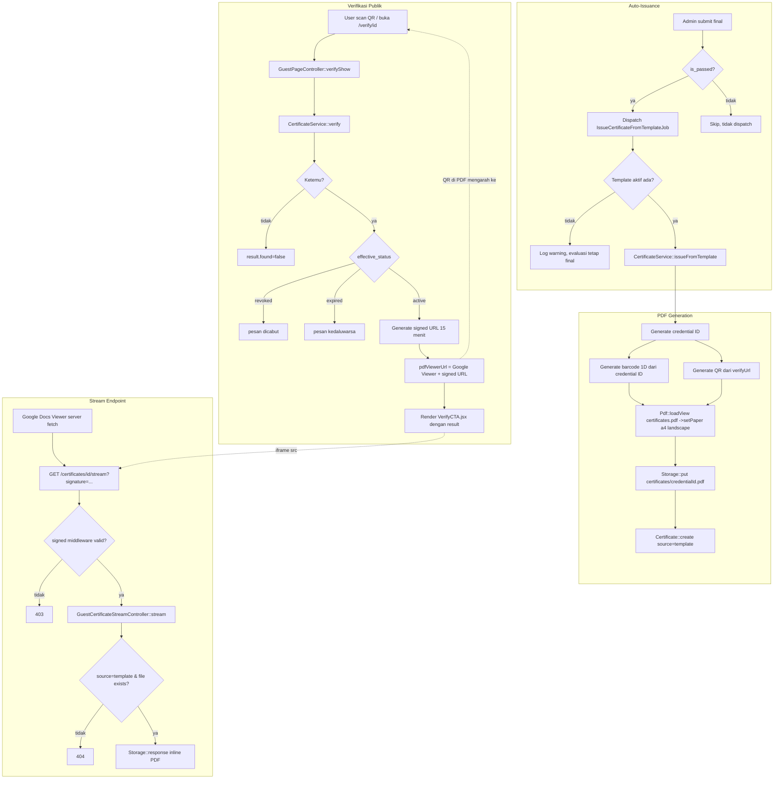

# Design Document: Certificate Template Redesign

## Overview

Solusi ini menyentuh tiga area yang saling terhubung tapi independen secara implementasi:

1. **PDF rendering** — `resources/views/certificates/pdf.blade.php` didesain ulang total ke A4 landscape, dengan barcode 1D (Code128, encode credential ID) dan QR (encode URL verifikasi) dirender sekali di server lalu di-embed sebagai `data:image/png;base64,...` di kedua halaman. `CertificateService::issueFromTemplate()` yang menyiapkan data ini, tidak ada perubahan pada bagaimana file disimpan (`Storage::put`, disk `local`, path `certificates/{credentialId}.pdf`).
2. **Verifikasi publik** — endpoint baru, terpisah total dari alur student. Halaman `/verify/{credentialId}` (guest, no-auth) menampilkan status sertifikat dan, jika aktif, meng-embed PDF via Google Docs Viewer memakai signed URL berumur 15 menit. Endpoint stream PDF ini juga baru, dilindungi middleware `signed` bawaan Laravel — bukan auth.
3. **Auto-issuance** — satu job baru (`IssueCertificateFromTemplateJob`) di-dispatch dari `Admin\EnrollmentEvaluationController::submitFinal()` setiap evaluasi yang baru difinalisasi dan lulus. Job ini membungkus logika yang sudah ada di `StudentCertificateUploadController::issueFromTemplate()` (resolve template → panggil `CertificateService::issueFromTemplate()`), gagal secara silent (log warning) tanpa membatalkan finalisasi evaluasi.

**Yang TIDAK berubah:**
- `CertificateService::verify()`, `Certificate::getEffectiveStatusAttribute()` — dipakai apa adanya.
- Jalur lama Google Docs (`issueCertificate()`, `IssueCertificateJob`) — tidak disentuh.
- Alur download student (`Student\CertificateController::download()`) — tetap dipakai apa adanya, tidak memakai signed URL (dilindungi auth + ownership check, bukan waktu).
- Kolom `front_content`/`back_content` di `certificate_templates` — tetap tidak dipakai (WYSIWYG ditunda).
- Tidak ada migrasi baru — semua kolom yang dibutuhkan sudah ada.

## Architecture



### Data Flow — ringkas

1. **Terbit** (manual atau auto) → `CertificateService::issueFromTemplate()` generate PDF (barcode+QR sudah ter-embed) → simpan `Certificate` row dengan `snapshot` json (termasuk `verifyUrl`, base64 barcode/QR sebagai arsip titik-waktu).
2. **Scan QR** → buka `/verify/{credentialId}` → server lookup status → jika aktif, server generate signed URL baru (fresh, bukan dari snapshot) tiap kali halaman dimuat → bungkus jadi Google Viewer URL → kirim ke frontend sebagai prop.
3. **Google Viewer fetch** → request ke `/certificates/{id}/stream?...signature` → divalidasi middleware `signed` → stream file dari `Storage` apa adanya (tidak regenerate PDF).

## Components and Interfaces

### 1. `app/Services/CertificateService.php` — `issueFromTemplate()`

Tambahan sebelum `$viewData` dibangun:

```php
$verifyUrl = route('guest.verify.show', ['credentialId' => $credentialId]);

$barcode1dBase64 = \Milon\Barcode\Facades\DNS1DFacade::getBarcodePNG($credentialId, 'C128', 2, 30);
$qrCodeBase64    = \Milon\Barcode\Facades\DNS2DFacade::getBarcodePNG($verifyUrl, 'QRCODE', 4, 4);
```

Ditambahkan ke `$viewData`: `verifyUrl`, `barcode1dBase64`, `qrCodeBase64`.

PDF call berubah dari:
```php
$pdf = Pdf::loadView('certificates.pdf', $viewData);
```
menjadi:
```php
$pdf = Pdf::loadView('certificates.pdf', $viewData)->setPaper('a4', 'landscape');
```

Signature method tidak berubah. `verify()` tidak berubah.

### 2. `resources/views/certificates/pdf.blade.php` (full rewrite)

```
@page { size: a4 landscape; margin: 0; }
```

**Halaman depan** — frame bordered, 3 zona vertikal:
- Header: logo → "INKINDO JATIM" → "SERTIFIKAT"
- Body: "diberikan kepada" → nama peserta → judul + periode pelatihan → (kondisional) nilai/grade
- Footer (row 3 kolom): tanda tangan (kiri) | nomor sertifikat + barcode 1D bertumpuk (tengah) | QR code (kanan)

**Halaman belakang** — 2 kolom:
- Kiri (~60%): "Rincian Pelatihan" + meta (judul/periode/instruktur/no. sertifikat) + daftar materi
- Kanan (~40%): nomor sertifikat + barcode 1D bertumpuk, QR code

Kedua halaman pakai base64 string yang sama (`$barcode1dBase64`, `$qrCodeBase64`) — di-generate sekali di service, dirender dua kali di view.

### 3. `routes/guest.php`

```php
Route::name('guest.')->group(function () {
    // ...existing routes...
    Route::get('/verify/{credentialId}', [GuestPageController::class, 'verifyShow'])->name('verify.show');
});
```

### 4. `routes/web.php`

```php
Route::get('/certificates/{certificate}/stream', [GuestCertificateStreamController::class, 'stream'])
    ->middleware('signed')
    ->name('certificates.stream');
```

Diletakkan top-level (di luar grup `auth`/`role`) — request datang dari server Google, bukan browser user.

### 5. `app/Http/Controllers/Guest/GuestPageController.php`

```php
public function __construct(
    private GuestPageContentService $guestPageContentService,
    private AdminPermissionService $adminPermissionService,
    private CertificateService $certificateService,
) {}

public function verifyShow(Request $request, string $credentialId): Response {
    $certificate = $this->certificateService->verify($credentialId);

    $result = $certificate === null
        ? ['found' => false]
        : $this->buildVerifyResult($certificate);

    return Inertia::render('Guest/VerifyCTA/VerifyCTA', [
        'content'      => $this->guestPageContentService->resolve(),
        'liveEditor'   => $this->resolveLiveEditor($request, 'verify'),
        'credentialId' => $credentialId,
        'result'       => $result,
    ]);
}

private function buildVerifyResult(Certificate $certificate): array {
    $result = [
        'found'        => true,
        'status'       => $certificate->effective_status,
        'studentName'  => $certificate->user->name,
        'courseTitle'  => $certificate->course->title,
        'credentialId' => $certificate->credential_id,
        'issuedDate'   => $certificate->issued_at->format('d F Y'),
        'expiresDate'  => $certificate->expires_at?->format('d F Y'),
        'pdfViewerUrl' => null,
    ];

    $canPreview = $certificate->effective_status === 'active'
        && $certificate->source === 'template'
        && $certificate->file_path;

    if ($canPreview) {
        $signedUrl = URL::temporarySignedRoute(
            'certificates.stream',
            now()->addMinutes(15),
            ['certificate' => $certificate->id],
        );

        $result['pdfViewerUrl'] = 'https://docs.google.com/viewerng/viewer?hl=en&embedded=true&url='
            . urlencode($signedUrl);
    }

    return $result;
}
```

Catatan: signed URL **tidak** dibuat dari `snapshot` yang tersimpan — selalu digenerate fresh saat halaman verify dimuat, supaya masa berlaku 15 menit selalu terhitung dari waktu akses terakhir, bukan waktu terbit.

### 6. `app/Http/Controllers/Guest/GuestCertificateStreamController.php` (baru)

```php
class GuestCertificateStreamController extends Controller {
    public function stream(Certificate $certificate): Response {
        abort_unless($certificate->source === 'template', 404);
        abort_unless($certificate->file_path && Storage::exists($certificate->file_path), 404);

        return Storage::response(
            $certificate->file_path,
            "Certificate_{$certificate->credential_id}.pdf",
            ['Content-Type' => 'application/pdf'],
        );
    }
}
```

`Storage::response()` (inline) dipakai, bukan `Storage::download()` (attachment) — supaya Google Viewer bisa fetch-and-render, bukan dipaksa unduh. Tidak ada tombol/link unduh dipasang di frontend halaman verify (Requirement 3.8) — pembatasan ini murni di sisi UI (`VerifyCTA.jsx` tidak merender elemen `<a download>`/tombol unduh apapun), karena secara teknis endpoint stream tetap bisa diakses langsung selama signature & window waktu valid — ini konsisten dengan keputusan "tanpa proteksi IP/session tambahan" yang sudah disepakati.

### 7. `resources/js/Pages/Guest/VerifyCTA/VerifyCTA.jsx`

Props baru: `credentialId` (nullable string), `result` (nullable object).

Branch rendering:
- `!result` → CTA statis (form input + tombol), seperti sekarang.
- `result.found === false` → pesan "Nomor sertifikat tidak ditemukan", input tetap tampil untuk retry.
- `result.status === 'revoked'` → pesan "Sertifikat telah dicabut".
- `result.status === 'expired'` → pesan "Sertifikat telah kedaluwarsa pada {expiresDate}".
- `result.status === 'active'` → blok identitas (nama, course, credential ID, tanggal terbit) + `<iframe src={result.pdfViewerUrl}>` full-screen jika `pdfViewerUrl` tidak null; identitas saja (tanpa iframe, tanpa error) jika null (kasus sertifikat non-template).

Submit handler baru (memperbaiki tombol yang sebelumnya tidak berfungsi):
```js
const handleVerify = () => {
  if (!hasValue) return;
  router.get(route('guest.verify.show', certId.trim()));
};
```
`certId` state di-inisialisasi dari prop `credentialId` jika ada (kasus datang dari scan QR).

Tidak ada elemen unduh di komponen ini sama sekali (Requirement 3.8).

### 8. `app/Jobs/IssueCertificateFromTemplateJob.php` (baru)

```php
class IssueCertificateFromTemplateJob implements ShouldQueue {
    use Queueable, InteractsWithQueue;

    public int $tries = 3;
    public int $timeout = 120;

    public function __construct(public readonly Enrollment $enrollment) {}

    public function handle(CertificateService $service, GradingService $gradingService): void {
        if ($this->enrollment->certificate) {
            return;
        }

        $template = CertificateTemplate::where('course_id', $this->enrollment->course_id)->where('is_active', true)->first()
            ?? CertificateTemplate::whereNull('course_id')->where('is_active', true)->first();

        if (! $template) {
            Log::warning('Auto-issue certificate skipped: no active template', [
                'enrollment_id' => $this->enrollment->id,
            ]);
            return;
        }

        try {
            $service->issueFromTemplate($this->enrollment, $template, $gradingService);
        } catch (\RuntimeException $e) {
            Log::warning('Auto-issue certificate failed', [
                'enrollment_id' => $this->enrollment->id,
                'error'         => $e->getMessage(),
            ]);
        }
    }
}
```

Pola ini mengikuti `app/Jobs/IssueCertificateJob.php` yang sudah ada (struktur `tries`/`timeout`/constructor-property), tapi memanggil `issueFromTemplate()` bukan `issueCertificate()`. Resolusi template diduplikasi dari `StudentCertificateUploadController::issueFromTemplate()` secara sengaja — konsisten dengan `CertificateService::resolveTemplate()` yang memang `private` (tidak dipakai lintas kelas di codebase ini).

### 9. `app/Http/Controllers/Admin/EnrollmentEvaluationController.php` — `submitFinal()`

Di dalam `foreach ($evaluations as $evaluation)`, setelah `$evaluation->update([...])`:

```php
if ($evaluation->is_passed) {
    IssueCertificateFromTemplateJob::dispatch($evaluation->enrollment);
}
```

## Data Models

Tidak ada perubahan skema. Struktur data baru yang dipakai murni di level aplikasi (bukan tabel):

**`$viewData` (dan otomatis `Certificate.snapshot`) — key baru:**
```
verifyUrl: string          // absolute URL ke /verify/{credentialId}
barcode1dBase64: string    // base64 PNG, no "data:" prefix, encode credentialId
qrCodeBase64: string       // base64 PNG, no "data:" prefix, encode verifyUrl
```

**Inertia props `Guest/VerifyCTA/VerifyCTA` — shape `result`:**
```
result: null | { found: false } | {
  found: true,
  status: 'active' | 'revoked' | 'expired',
  studentName: string,
  courseTitle: string,
  credentialId: string,
  issuedDate: string,
  expiresDate: string | null,
  pdfViewerUrl: string | null,
}
```

## Correctness Properties

### Property 1: Barcode content invariant

1D barcode SELALU encode `credential_id` string persis, tidak pernah encode URL. QR SELALU encode `verifyUrl`, tidak pernah encode `credential_id` mentah.

**Validates: Requirements 2.1, 2.2**

### Property 2: Signed URL freshness

Signed URL untuk stream PDF selalu dibuat baru pada saat `verifyShow()` dipanggil (bukan dibaca dari snapshot lama), sehingga window 15 menit konsisten terhitung dari akses terakhir ke halaman verify, bukan dari waktu penerbitan sertifikat.

**Validates: Requirements 4.1, 4.2**

### Property 3: No-download invariant di halaman publik

Tidak ada code path di `VerifyCTA.jsx` maupun `GuestPageController::verifyShow()` yang mengembalikan URL dengan `Content-Disposition: attachment` atau elemen unduh; endpoint stream selalu `Storage::response()` (inline).

**Validates: Requirements 3.8**

### Property 4: Idempotent issuance

`IssueCertificateFromTemplateJob` dan `issueFromTemplate()` sama-sama cek `$enrollment->certificate` sebelum generate; menjalankan job/tombol manual dua kali untuk enrollment yang sama tidak pernah menghasilkan dua `Certificate` row.

**Validates: Requirements 5.5**

### Property 5: Evaluasi final tidak pernah gagal karena isu sertifikat

Kegagalan apapun di dalam `IssueCertificateFromTemplateJob::handle()` (template tidak ada, exception dari service) tertangkap di dalam job itu sendiri dan tidak melempar balik ke `submitFinal()`; status evaluasi `final` sudah di-commit sebelum job dijalankan (dispatch terjadi setelah `$evaluation->update()`, bukan sebelum).

**Validates: Requirements 5.3, 5.4**

### Property 6: Ownership isolation

Akses stream PDF publik (`certificates.stream`) tidak pernah memeriksa `user_id`/auth sama sekali (murni signature+waktu); akses student (`student.certificates.download`) tidak pernah memeriksa signature (murni auth+ownership). Kedua mekanisme proteksi tidak saling menggantikan.

**Validates: Requirements 4.4, 6.2, 6.3**

## Error Handling

| Scenario | Behavior |
|----------|----------|
| Nomor sertifikat tidak ditemukan di `/verify/{id}` | `result = {found: false}`, tampil "Nomor sertifikat tidak ditemukan", tanpa iframe |
| Sertifikat status `revoked` | Tampil "Sertifikat telah dicabut", tanpa iframe |
| Sertifikat status `expired` | Tampil "Sertifikat telah kedaluwarsa pada {tanggal}", tanpa iframe |
| Sertifikat aktif tapi `source !== 'template'` (legacy Google Docs / manual upload) | Identitas tampil, `pdfViewerUrl = null`, tidak ada iframe, tidak ada pesan error (silent degrade) |
| Signed URL diakses lewat 15 menit | Middleware `signed` Laravel mengembalikan 403 otomatis |
| Signed URL signature tidak valid/diubah | Middleware `signed` mengembalikan 403 otomatis |
| Stream diminta untuk sertifikat `source !== 'template'` (URL dipalsukan manual) | `abort(404)` di `GuestCertificateStreamController::stream()` |
| File PDF tidak ada di storage saat stream diminta | `abort(404)` |
| Auto-issue: tidak ada template aktif untuk course | Log warning, evaluasi tetap `final`, tidak melempar exception ke controller |
| Auto-issue: `issueFromTemplate()` melempar `RuntimeException` (mis. evaluasi belum lulus — race condition) | Log warning, evaluasi tetap `final` |
| Auto-issue: enrollment sudah punya sertifikat | Job return awal, tidak generate ulang, tidak error |
| `gd` extension tidak terpasang saat `milon/barcode` dipanggil | Exception PHP fatal saat `issueFromTemplate()` — di luar auto-issue job, ini akan tertangkap sebagai job failure (retry hingga 3x lalu masuk failed_jobs); saat dipanggil dari tombol manual, akan jadi 500 — **prasyarat deployment**, bukan behavior yang di-handle secara khusus oleh kode |

## Testing Strategy

- **Unit Tests** (`tests/Unit/CertificateServiceTest.php`)
  - `issueFromTemplate()` menghasilkan PDF dengan orientasi landscape (assert lewat `$pdf` object atau isi file jika memungkinkan).
  - `snapshot` mengandung `verifyUrl`, `barcode1dBase64`, `qrCodeBase64` non-kosong.
  - `verifyUrl` mengandung `credential_id` yang benar sebagai path segment.
- **Feature Tests** (baru)
  - `tests/Feature/Guest/VerifyCertificateTest.php`: not-found, revoked, expired, active-with-iframe, active-non-template-source (no iframe) — masing-masing assert response Inertia props sesuai shape `result`.
  - `tests/Feature/Guest/CertificateStreamTest.php`: signature valid → 200 + `Content-Type: application/pdf`; signature invalid/hilang → 403; signature expired (pakai `Carbon::setTestNow()` lewat 15 menit) → 403; `source !== 'template'` dengan signature valid → 404.
  - `tests/Feature/Admin/EnrollmentEvaluationAutoIssueTest.php` (baru): submit final untuk evaluasi lulus → job ter-dispatch (`Queue::fake()` + `assertPushed`) → jalankan job secara sinkron di test → `Certificate` row tercipta; submit final tanpa template aktif → evaluasi tetap `final`, tidak ada exception, tidak ada `Certificate` row.
- **Regresi**
  - `tests/Feature/Student/CertificatePageTest.php` tetap hijau tanpa perubahan (jalur download student tidak disentuh).
  - Existing `tests/Unit/CertificateServiceTest.php::test_issue_from_template_generates_pdf_with_snapshot` tetap hijau, ditambah assertion baru di atas.
