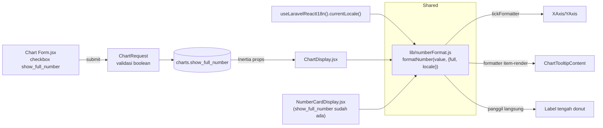

# Design Document: chart-compact-number-display

## Overview

Chart saat ini SELALU menampilkan angka penuh (`toLocaleString()`, tanpa notasi ribuan/juta disingkat) di tiga titik: axis, tooltip, dan label tengah donut/slice pie. NumberCard sudah punya toggle `show_full_number` untuk perilaku yang sama, TAPI formatnya (`Intl.NumberFormat(undefined, ...)`) ikut locale default BROWSER/OS, bukan lang aktif app (id/en) — dua sistem locale yang independen (`lang` cookie hanya untuk teks terjemahan, tidak dialirkan ke `Intl.NumberFormat`).

Keputusan (dikonfirmasi user): compact number format Chart **maupun** NumberCard SHALL ikut lang aktif app (via `useLaravelReactI18n().currentLocale()`), bukan browser default — supaya konsisten visual dengan teks UI lain yang sudah id/en-aware. Ini memperluas scope dari "Chart only" jadi "Chart + selaraskan NumberCard", dan mendorong satu utility format bersama (bukan duplikasi logic di 2 komponen) — dipusatkan di `resources/js/lib/numberFormat.js`, dipakai baik `ChartDisplay.jsx` maupun `NumberCardDisplay.jsx`.

Yang TIDAK berubah: struktur data chart (`chart_source_type`, `visual_type`, dsb), endpoint `charts.getData`/`numberCards.getValue`, kolom `show_full_number` NumberCard (sudah ada, tidak perlu migration baru untuk NumberCard — cuma ganti cara formatnya).

## Revisi Pasca-Implementasi: mode full delegasi ke NumberInput/formatNumber

**Ditemukan SETELAH implementasi awal** (user bertanya "apakah sudah cek yang ada?" — jawabannya waktu itu tidak): codebase ini SUDAH punya sumber tunggal "angka penuh" yang mapan — `resources/js/Components/NumberInput/formatNumber.js` (dari spec terpisah `.kiro/specs/number-input/`), dipakai di `Table2.jsx` dan `PrintTemplate` untuk SEMUA angka penuh di app ini. Formatnya bersumber dari `preferences.default_number_format` (pattern company-level, mis. `#.###,##`, di-share global via `HandleInertiaRequests` middleware ke `usePage().props.preferences`) — BUKAN dari locale lang app.

Desain awal (`num.toLocaleString(locale, ...)` untuk mode full, lihat versi lama section di bawah) SALAH ARAH — bikin Chart/NumberCard tampil beda gaya dari tabel/dokumen lain di app yang sama. **Revisi**: mode full DELEGASI ke `formatNumber` (NumberInput) via `numberFormat: preferences?.default_number_format`. Mode compact TETAP baru & TETAP pakai `currentLocale()` — `NumberInput/formatNumber` tidak punya konsep notasi singkat sama sekali (tidak ada `#`-pattern yang bisa mengekspresikan "1,2 jt"), dan kata singkatannya sendiri soal bahasa (beda sumbu dari pemisah desimal company).

Konsekuensi konkret: `formatNumber(0, {full:true, numberFormat:"#,###.##"})` → `"0.00"` (2 desimal SELALU tampil, ikut `decimalScale` dari pattern — bukan `toLocaleString`'s `maximumFractionDigits` yang cuma ceiling/trim trailing zero). Ini KONSISTEN dengan bagaimana angka penuh tampil di Table2/PrintTemplate — bukan bug, sengaja ikut konvensi app yang sudah ada, meski utk `function=count` hasilnya jadi "5,00" bukan "5".

## Architecture



Satu fungsi format tunggal (`formatNumber` di `lib/numberFormat.js`) dipakai di SEMUA titik (4 di Chart + 1 di NumberCard) — hindari duplikasi logic `Intl.NumberFormat` yang sebelumnya sudah ada 2x gaya beda-beda dan 2x locale beda-beda (implisit `undefined` di keduanya).

## Components and Interfaces

### `formatNumber(value, options)` — `resources/js/lib/numberFormat.js` (BARU, adapter tipis)

```js
import { formatNumber as formatFullNumber } from "@/Components/NumberInput/formatNumber";

export function formatNumber(value, { full = false, locale, numberFormat } = {}) {
  const num = Number(value ?? 0);
  return full
    ? formatFullNumber(num, { numberFormat })
    : Intl.NumberFormat(locale, { notation: "compact", maximumFractionDigits: 1 }).format(num);
}
```

`locale` (mode compact) dan `numberFormat` (mode full) diteruskan APA ADANYA (tidak di-resolve di sini) — pemanggil (komponen React) yang tahu locale/preferences aktif via hook, `numberFormat.js` sendiri TIDAK boleh punya dependency ke React (harus pure, testable tanpa render component — lihat Testing Strategy).

`currentLocale()` dari `laravel-react-i18n` mengembalikan kode singkat (`"id"`/`"en"`) — valid sebagai argumen locale `Intl.NumberFormat` (BCP 47 subset). `preferences?.default_number_format` dari `usePage().props` — sama persis pola `Table2.jsx` (`colProps?.numberFormat ?? preferences?.default_number_format`).

### `ChartDisplay.jsx` — pemanggil

```js
const { currentLocale } = useLaravelReactI18n();
const { preferences } = usePage().props;
const fmt = (v) => formatNumber(v, {
  full: chart.show_full_number,
  locale: currentLocale(),
  numberFormat: preferences?.default_number_format,
});
```

- **`XAxis`/`YAxis`**: saat ini hanya `<XAxis dataKey="period" .../>` tanpa formatter numerik (axis Y tidak dirender eksplisit, recharts auto-generate). Tambah `<YAxis tickFormatter={fmt} width={...} />`. **Catatan risiko**: menambah `<YAxis>` eksplisit adalah perubahan visual TAMBAHAN (axis Y jadi terlihat, sebelumnya auto-hide tergantung layout) — wajib diverifikasi browser saat implementasi, bukan diasumsikan aman.
- **`ChartTooltipContent`**: prop `formatter` di wrapper shadcn ini (beda dari recharts native) ambil alih render SATU BARIS item penuh `(value, name, item, index, payload)`, bukan cuma transform angka (lihat `ui/chart.jsx:172-173`). Perlu meniru markup default (indicator dot + label + value) dengan angka via `fmt()`, BUKAN cuma `return fmt(value)` (akan menghapus indicator/label).
- **Donut center label**: ganti `formatNumber(activeItem?.[metricKey] ?? 0)` lokal → `fmt(activeItem?.[metricKey] ?? 0)`, hapus fungsi `formatNumber` lokal yang lama (digantikan import dari `lib/numberFormat.js`).
- **Pie (non-donut) `LabelList`**: pakai `dataKey="period"` (nama kategori, BUKAN angka) — tidak relevan, tidak disentuh.

### `NumberCardDisplay.jsx` — diselaraskan

Ganti `formatNumber` lokal (`NumberCardDisplay.jsx:41-44`, saat ini `Intl.NumberFormat(undefined, ...)`) dengan import `formatNumber` dari `lib/numberFormat.js` + `currentLocale()` + `preferences?.default_number_format` (via `usePage()`), pola sama persis seperti Chart.

## Data Models

**Migration baru** `charts`: tambah kolom (BUKAN edit migration `create_charts_table` yang sudah pernah jalan):
```php
Schema::table('charts', function (Blueprint $table) {
    $table->boolean('show_full_number')->default(false)->after('currency');
});
```
Default `false` (singkat) — mirror persis default `number_cards.show_full_number`. NumberCard TIDAK butuh migration (kolomnya sudah ada sejak awal).

**`Chart.php` model**: tambah `show_full_number` ke `casts()` sebagai `'boolean'` (pola sama seperti `is_shared_all`, `timeseries`).

**`ChartRequest.php`**: tambah rule `'show_full_number' => ['nullable', 'boolean']` (pola sama `NumberCardRequest`).

**`Chart/Form.jsx`**: tambah `FormCheckbox` baru (pola persis `NumberCard/Form.jsx` — standalone, `label` + `description` sendiri, BUKAN dibungkus `FormInput`, sesuai perbaikan visual sebelumnya di sesi ini).

## Correctness Properties

**Property 1 — Default tanpa migrasi data.** Chart lama (dibuat sebelum kolom ini ada) SHALL tampil compact (`show_full_number=false` via default kolom), BUKAN error atau full-number tak sengaja — konsisten dengan cara kerja default kolom baru + `?? false`, tanpa perlu backfill data.

**Property 2 — Satu sumber format, semua titik konsumsi.** Untuk `chart`/`numberCard` manapun dengan `show_full_number` tertentu DAN lang aktif tertentu, SEMUA titik tampilan (axis, tooltip, donut label, NumberCard value) SHALL menampilkan angka dengan notasi (full/compact) DAN locale yang SAMA — dijamin karena semuanya memanggil `formatNumber` yang sama dari `lib/numberFormat.js`, bukan implementasi terpisah per titik/komponen.

**Property 3 — Locale ikut lang aktif, bukan browser.** Untuk locale app manapun (`id`/`en`) yang di-set via `setLocale()`/cookie `lang`, `formatNumber(value, {locale: currentLocale()})` SHALL menghasilkan notasi compact sesuai locale TERSEBUT (mis. `id` → "1,2 rb", `en` → "1.2K"), TERLEPAS dari `navigator.language` browser — inilah yang membedakan fitur ini dari perilaku lama.

## Error Handling

| Skenario | Perilaku |
|----------|----------|
| `chart.show_full_number` / `numberCard.show_full_number` undefined | `formatNumber(v, {full: undefined})` → falsy → compact (aman, bukan crash) |
| `value` bukan angka valid (null/NaN dari backend) | `Number(value ?? 0)` → `0`, diformat sebagai "0" (compact) / "0.00" (full, ikut decimalScale pattern), bukan "NaN"/crash |
| `preferences?.default_number_format` undefined (mis. company belum pernah set currency default) | `formatFullNumber` (NumberInput) sendiri sudah fallback ke `{groupSeparator:",", decimalSeparator:".", decimalScale: undefined}` bila `numberFormat` falsy — desimal dipertahankan apa adanya (tidak dipaksa 2 digit), TETAP tidak crash |
| `currentLocale()` mengembalikan kode locale yang tidak valid/tidak dikenal `Intl.NumberFormat` (seharusnya tidak terjadi — locale app dibatasi id/en) | `Intl.NumberFormat` native throw `RangeError` untuk tag benar-benar invalid; karena `currentLocale()` SELALU salah satu dari locale terdaftar app (id/en), risiko ini secara praktis nihil — tidak perlu try/catch tambahan |
| `YAxis` eksplisit baru mengubah layout existing chart yang sudah dipakai user | Diverifikasi visual manual sebelum dianggap selesai — bukan asumsi "pasti aman" |

## Testing Strategy

- **Unit (JS/vitest)**: `resources/js/lib/numberFormat.test.js` — BARU, mengikuti pola existing `diffUtils.test.js`/`discountAllocation.test.js` (infra vitest SUDAH ada & jalan, `npm run test`). Cover: `full=true` delegasi ke `NumberInput/formatNumber` (pattern id `#.###,##` vs pattern en `#,###.##` menghasilkan pemisah berbeda), fallback tanpa `numberFormat`, `full=false` compact locale `id` vs `en`, `value` null/undefined → "0" (compact) / "0.00" (full).
- **Unit/Feature (PHP)**: `ChartControllerTest` — store/update Chart dengan `show_full_number=true`, assert tersimpan; test default `false` saat field tidak dikirim.
- **Visual (browser, wajib)**: buka Chart bar/line existing (`Item per Kategori`) DAN NumberCard (`Total Items`), toggle checkbox, DAN ganti lang aktif app (id↔en) — screenshot before/after — pastikan compact↔full DAN notasi locale berubah konsisten di semua titik, dan layout `YAxis` baru tidak pecah.
