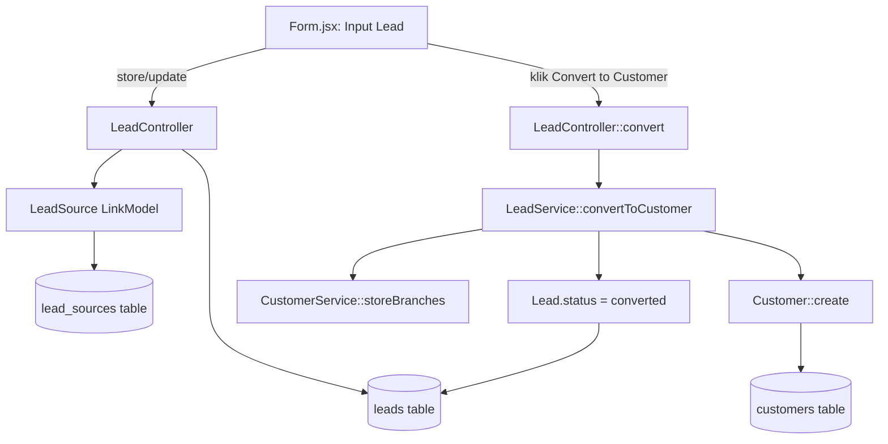

# Design Document: CRM Leads (Lead Management)

## Overview

Modul native untuk mencatat dan mengelola calon customer (lead) di dalam aplikasi ERP Laravel ini — **bukan** integrasi dengan produk Frappe CRM/ERPNext terpisah. Konsep data (Lead, Lead Source, konversi ke Customer) terinspirasi dari model Frappe CRM, tapi diimplementasikan sepenuhnya mengikuti pola arsitektur domain yang sudah ada di repo ini (referensi utama: modul `Sales\Customer`).

Tujuan akhir: tim bisa menginput calon customer, melacak sumber lead-nya, dan mengonversi lead yang qualified menjadi `Sales\Customer` — dengan UI dan RBAC yang konsisten dengan modul lain (Sales/Customer, Purchase/Supplier, dst).

## Ruang Lingkup v1

**Dikerjakan:**
- Model `Lead` (flat, tanpa Organization/Contact terpisah)
- Model `LeadSource` sebagai lookup ringan (pola `Country`, tanpa layar CRUD)
- Service konversi Lead → Customer
- CRUD backend lengkap (model/controller/request/service)
- Frontend Index/Form (tanpa Show.jsx — bukan submitable)
- `LeadLinkModel.jsx` untuk referensi FK dari domain lain
- Aksi "Convert to Customer"
- Registrasi route
- Permission otomatis (tanpa edit seeder manual)

**Di luar scope v1** (lihat bagian Follow-up):
- Endpoint intake web form publik
- Parsing email-to-lead
- Konten seed data Lead Source final
- Layar setting ala "CRM Settings"
- Entity `Deal`/pipeline — stage cukup field `status` string di `Lead`

**Catatan housekeeping**: branch kerja (`feeds/crm_leads_feature`) sudah berisi bugfix RBAC lama yang tidak terkait (fix `!disabledAdd` di `LinkModel.jsx`, `dd($file)` debug leftover di `UserController.php`). Ini diperlakukan sebagai concern terpisah yang dibereskan lebih dulu, sebelum commit CRM dimulai — lihat bagian Sequencing.

## Pola Arsitektur Acuan

Referensi utama: modul `Sales\Customer` — `app/Models/Sales/Customer.php`, `app/Http/Controllers/Sales/CustomerController.php`, `app/Http/Requests/Sales/CustomerRequest.php`, `app/Services/Sales/CustomerService.php`, `database/migrations/2025_03_15_110425_create_customers_table.php`.

- **Model**: `ulid` PK, `use DataTable, HasUlids, SoftDeletes;`, `$guarded = ['id']`, `$translateKey`, `$configColumns` (kolom tabel + config LinkModel), `templateLink()` static (render baris di autocomplete, mis. `':name'`), `getXAttribute()` + `$appends` untuk kolom computed, `loadRelationsOnShow()` static untuk eager-load saat `show()`.
- **Controller**: extends `Controller`, constructor panggil `parent::__construct($request, Model::class)` — otomatis wiring RBAC (cocokkan action→permission, 403 kalau `session('permissions')[Model::class]` tidak ada). `store()`/`update()` dibungkus `DB::transaction`, panggil `logForCreated()/logForUpdated()/logForDeleted()` (audit trail bawaan trait `DataTable`).
- **Request**: `FormRequest` biasa, `authorize() => true` (RBAC sudah dijaga di controller), field relasi FK dikirim sebagai object `{code: ...}` (kalau PK-nya `code`, seperti Country) atau `{id: ...}` (kalau PK-nya ulid `id`, seperti User).
- **Service**: dipakai untuk logika multi-step (Customer punya `CustomerService::storeBranches()`). Ini justifikasi untuk `LeadService::convertToCustomer()`.
- **Migration**: `ulid('id')->primary()`, `foreignUlid(...)->nullable()->references(...)->on(...)->nullOnDelete()`, `timestamps()`, `softDeletes()`. Kolom `code`/`status`/`branch_id`/`created_by_id` khusus workflow **hanya** di-inject otomatis oleh `DataTable::initPermissions()` kalau model set `$is_submitable`/`$generateCodeSeries` — Lead tidak pakai keduanya.

**Permission otomatis, tidak perlu seeder manual per model.** `database/seeders/PermissionSeeder.php` men-scan classmap Composer, cari semua class `App\Models\*` yang pakai trait `DataTable`, panggil `initPermissions()` pada masing-masing. Begitu `Lead` pakai trait ini, cukup jalankan ulang seeder — permission-nya otomatis terdaftar.

**`LeadSource` mengikuti pola `Country`** (`app/Models/Core/Country.php`), BUKAN pola `DataTable`: model polos, `$primaryKey='code'`, `$guarded=[]`, `$configColumns`, `templateLink()`. Country **tidak punya controller/route/Permission row** — cukup diisi via seeder dan dikonsumsi lewat komponen generik `LinkModel` (bekerja untuk semua class `App\Models\*` terlepas dari trait `DataTable`). `LeadSource` mereplikasi ini persis, tapi ditempatkan di folder domain `app/Models/CRM/` (bukan `Core`) karena ini kosakata spesifik CRM, bukan lookup universal seperti Country.

**`Customer` tidak punya `Show.jsx`** (non-submitable) — sehingga `Lead` juga tidak perlu Show.jsx. Ini record status-driven sederhana yang diedit inline lewat dialog `DataTable2`, bukan dokumen approval-gated.

**Field `status` (enum statis)** pakai komponen `@/Components/Select` (dropdown opsi statis) — beda dengan `SelectModel.jsx` (row-picker FK generik). Contoh pemakaian nyata: `resources/js/Pages/Settings/Branches/Form.jsx` untuk field `billing_address`.

**Tidak ada preseden custom action button** di luar CRUD standar (dokumen submitable pakai route bawaan macro `submit`/`cancel`/`amend`). "Convert to Customer" adalah penambahan baru pertama jenisnya: perlu override `matchMethodWithPermission()` di `LeadController` supaya method custom `convert` tidak kena 403 dari RBAC constructor.

## Architecture



## Components and Interfaces

### Data Model

**`Lead`** (flat, tanpa Organization/Contact terpisah)

Alasan: `Customer` sudah merepresentasikan "organisasi" — field `name`-nya sendiri adalah nama perusahaan. Lead yang dikonversi mapping 1:1 ke bentuk Customer. Entity `Organization`/`Contact` terpisah di v1 berarti relasi berlebihan untuk tujuan "input calon customer", dua CRUD surface tambahan tanpa consumer langsung, dan mapping konversi yang lebih rumit. Customer sendiri juga flat.

Field migrasi `create_leads_table`:
- `id` ulid primary
- `company_name` string, required (→ `Customer.name` saat konversi)
- `contact_name` string nullable
- `email` string nullable
- `phone` string nullable
- `lead_source_id` foreignUlid nullable → `references('code')->on('lead_sources')->nullOnDelete()`
- `status` string default `'new'` — salah satu dari `new|contacted|qualified|unqualified|converted`
- `notes` text nullable
- `assigned_to_id` foreignUlid nullable → `references('id')->on('users')->nullOnDelete()`
- `street`, `city`, `province`, `zip_code` string nullable (identik pola address Customer)
- `country_id` foreignUlid nullable → `references('code')->on('countries')->nullOnDelete()`
- `converted_customer_id` foreignUlid nullable → `references('id')->on('customers')->nullOnDelete()`
- `converted_at` timestamp nullable
- `timestamps()`, `softDeletes()`

Model `app/Models/CRM/Lead.php`:
- `use DataTable, HasUlids, SoftDeletes;`, `$guarded = ['id']`, `$translateKey = 'crm.lead'`
- `templateLink() => ':company_name'`
- `$configColumns`: `company_name` (isLink, show, order 0), `contact_name`, `email`, `phone`, `status`, `leadSource`, `assignedTo`, `country`
- Relasi: `leadSource()` belongsTo `LeadSource::class, 'lead_source_id', 'code'`; `assignedTo()` belongsTo `User::class, 'assigned_to_id'`; `country()` belongsTo `Country::class, 'country_id', 'code'`; `convertedCustomer()` belongsTo `Customer::class, 'converted_customer_id'`.
- `loadRelationsOnShow()`: `['leadSource', 'assignedTo', 'country', 'convertedCustomer']`

**`LeadSource`** (lookup ringan, pola Country)

Alasan: lookup model dipilih daripada enum hardcode karena biayanya nyaris nol (terbukti lewat preseden Country) dan dapat UX autocomplete gratis dari `LinkModel`, sementara enum hardcode butuh deploy kode tiap kali nambah source baru.

Field migrasi `create_lead_sources_table` (mirror `create_countries_table`):
- `code` string primary (mis. `web_form`, `email`, `manual`, `api`, `referral`, `call`)
- `name` string (label tampilan)
- `timestamps()` opsional, konfirmasi ke migration Country

Model `app/Models/CRM/LeadSource.php`:
- `protected $primaryKey = 'code'; public $incrementing = false; protected $keyType = 'string'; protected $guarded = [];`
- `$translateKey = 'crm.lead_source'`, `$configColumns`: `code`, `name`, `templateLink() => ':name'`
- Tanpa trait `DataTable`, tanpa controller, tanpa route entry, tanpa Permission row.

Seeder: `database/seeders/LeadSourceSeeder.php` (mirror `CountrySeeder.php`) — starter set 6 source (`web_form|email|manual|api|referral|call`).

### Backend

1. **Migrasi** (2 file, `LeadSource` dulu karena `Lead` FK ke situ): `create_lead_sources_table`, lalu `create_leads_table`.
2. **Model**: `app/Models/CRM/LeadSource.php`, `app/Models/CRM/Lead.php`.
3. **Request** `app/Http/Requests/CRM/LeadRequest.php`:
   ```php
   'company_name'     => ['required','string','min:3','max:255'],
   'contact_name'     => ['nullable','string','max:255'],
   'email'            => ['nullable','string','max:255','email:rfc'],
   'phone'            => ['nullable','string','max:255'],
   'lead_source.code' => ['nullable','string','exists:lead_sources,code'],
   'status'           => ['required','string','in:new,contacted,qualified,unqualified,converted'],
   'notes'            => ['nullable','string'],
   'assigned_to'      => ['nullable','array'], // shape LinkModel, ambil .id di controller
   'street'           => ['nullable','string','max:255'],
   'city'             => ['nullable','string','max:255'],
   'province'         => ['nullable','string','max:255'],
   'zip_code'         => ['nullable','string','max:255'],
   'country.code'     => ['nullable','string','exists:countries,code'],
   ```
   [TODO: verifikasi shape submission `assigned_to` saat implementasi — kemungkinan `{id: ...}` karena PK User adalah `id`.]
4. **Controller** `app/Http/Controllers/CRM/LeadController.php` — mirror `CustomerController` (index/create/store/show/update/destroy) + method baru:
   ```php
   public function convert(Lead $lead) {
       DB::beginTransaction();
       $customer = $this->leadService->convertToCustomer($lead);
       $lead->logForUpdated();
       DB::commit();
       return back()->with('id', $customer->id);
   }
   ```
   Constructor: `parent::__construct($request, Lead::class)`. Override `matchMethodWithPermission()` untuk map `'convert' => 'write'`.
5. **Service** `app/Services/CRM/LeadService.php`:
   ```php
   class LeadService {
       public function convertToCustomer(Lead $lead): Customer {
           if ($lead->converted_customer_id) {
               return $lead->convertedCustomer; // idempotent guard
           }
           $customer = Customer::create([
               'name'       => $lead->company_name,
               'email'      => $lead->email,
               'phone'      => $lead->phone,
               'street'     => $lead->street,
               'city'       => $lead->city,
               'province'   => $lead->province,
               'zip_code'   => $lead->zip_code,
               'country_id' => $lead->country_id,
           ]);
           app(CustomerService::class)->storeBranches($customer, []);
           $customer->logForCreated();
           $lead->update([
               'status'                => 'converted',
               'converted_customer_id' => $customer->id,
               'converted_at'          => now(),
           ]);
           return $customer;
       }
   }
   ```
   Catatan: `Customer::vat` wajib di `CustomerRequest`, tapi Lead tidak punya field VAT. Karena ini `Customer::create()` langsung (bypass `CustomerRequest`), hasilnya `vat = null` sampai diisi manual — diterima untuk v1.
6. **Permission**: tidak perlu langkah manual — cukup `composer dump-autoload && php artisan migrate && php artisan db:seed --class=PermissionSeeder` setelah model `Lead` dibuat. `LeadSource` sengaja TIDAK dapat Permission row, konsisten dengan Country.

### Frontend

Direktori: `resources/js/Pages/CRM/Leads/`

1. **`Index.jsx`** — nyaris identik Customer:
   ```jsx
   import DataTable2 from "@/Pages/Core/DataTable2";
   import Form from "./Form";
   function Index() {
     return <DataTable2 form={<Form />} classNameDialog="max-w-(--breakpoint-lg)!" />;
   }
   export default Index;
   ```
2. **`Form.jsx`** — section via `FormPageContent`:
   - "Lead Detail": `company_name` (Input, required), `contact_name`, `email`, `phone`, `status` (`Select` opsi statis), `lead_source` (`LeadSourceLinkModel`), `assigned_to` (reuse `UserLinkModel` di `resources/js/Pages/Users/ManageUsers/UserLinkModel.jsx`), `notes` (Textarea).
   - "Address": `street`/`city`/`province`/`zip_code`/`country` (reuse `CountryLinkModel`) — layout sama seperti Customer.
   - Tombol "Convert to Customer": tampil kondisional (`!isCreate && data.status !== 'converted' && can('write')`), panggil `router.put(route('leads.convert', data.id))`.
   - Kalau sudah `converted`: tampilkan badge/link read-only ke `data.convertedCustomer`.
3. **`LeadLinkModel.jsx`** (`resources/js/Pages/CRM/Leads/LeadLinkModel.jsx`) — mirror `CustomerLinkModel.jsx`.
4. **`LeadSourceLinkModel.jsx`** — mirror `CountryLinkModel.jsx` persis (`disabledAddButton disabledNavigation cache cacheStorage="sessionStorage"`, `model="App\Models\CRM\LeadSource"`).
5. **Tanpa `Show.jsx`**.
6. **i18n**: tambah `crm.lead.*` dan `crm.lead_source.*` (columns, options status, title, dst.).

### Routes

Di `routes/web.php`:
- Tambah `use App\Http\Controllers\CRM\LeadController;` di block `use`.
- Di dalam grup route yang sama tempat Customer terdaftar (sekitar baris 214-215):
  ```php
  // CRM
  Route::resourceDetail('lead', LeadController::class);
  Route::put('/leads/{lead}/convert', [LeadController::class, 'convert'])->name('leads.convert');
  ```
  Route `convert` dideklarasikan independen dengan path eksplisit `/leads/{lead}/convert` — tidak bentrok dengan route `update` bawaan macro karena jumlah segmen path berbeda.
- `LeadSource` tidak dapat route entry.

## Sequencing / Urutan Commit

**Rekomendasi**: commit bugfix RBAC yang sudah ada di working tree dulu, sebagai commit terpisah, SEBELUM mulai kerja CRM.

1. `fix: correct inverted disabledAddButton check in LinkModel`
2. `fix: remove leftover dd($file) debug statement in UserController`
3. `feat(crm): add LeadSource lookup model and seeder`
4. `feat(crm): add Lead model, migration, request, controller, routes`
5. `feat(crm): add Lead frontend Index/Form pages and LinkModel components`
6. `feat(crm): add Lead-to-Customer conversion (LeadService + convert action)`

Setiap commit harus tetap buildable/tidak rusak secara mandiri.

## Follow-up (Didokumentasikan, TIDAK Dikerjakan di v1)

- **Seed data Lead Source final**: finalisasi daftar source code, putuskan idempotent/upsert untuk re-run production.
- **Endpoint intake web form**: POST publik (rate-limited + CAPTCHA/honeypot) → `Lead` dengan `lead_source_id = 'web_form'`.
- **Pipeline email-to-lead**: webhook/IMAP polling → parse jadi `Lead` dengan `lead_source_id = 'email'`.
- **Tidak ada "CRM Settings" ala ERPNext/Frappe** — app ini tidak punya dependency ke Frappe/ERPNext. Setting masa depan (default lead source, round-robin assignee, mailbox email-to-lead) sebaiknya jadi `CRMSetting` singleton model, mengikuti pola `app/Models/Core/Preference.php`.
- **Deal/Opportunity pipeline**: ditunda — model `Deal` baru di v2 kalau dibutuhkan.

## File Kunci untuk Implementasi

- `app/Models/Sales/Customer.php` — template struktural untuk `app/Models/CRM/Lead.php`.
- `app/Http/Controllers/Sales/CustomerController.php` — template untuk `app/Http/Controllers/CRM/LeadController.php`.
- `app/Services/Sales/CustomerService.php` — template untuk `app/Services/CRM/LeadService.php`.
- `routes/web.php` (macro `resourceDetail` ~baris 56-89, registrasi Customer ~baris 214-215).
- `database/seeders/PermissionSeeder.php` — konfirmasi tidak perlu edit manual.
- `app/Models/Core/Country.php` dan `resources/js/Pages/Core/CountryLinkModel.jsx` — template untuk `LeadSource`.
- `resources/js/Pages/Settings/Branches/Form.jsx` — contoh pemakaian `Select` untuk field enum statis.
- `resources/js/Pages/Users/ManageUsers/UserLinkModel.jsx` — reuse langsung untuk field `assigned_to`.

## Testing Strategy / Verifikasi

- `php artisan migrate` sukses tanpa error, tabel `lead_sources` dan `leads` muncul dengan FK benar.
- `composer dump-autoload && php artisan db:seed --class=PermissionSeeder` → cek di UI Role management, permission "Leads" muncul dan bisa di-assign (LeadSource tidak muncul, sesuai desain).
- Buka `/leads` di browser (setelah permission di-assign ke role test): index tampil, bisa create lead baru, address block berfungsi sama seperti Customer, dropdown `lead_source`/`assigned_to`/`country` berfungsi.
- Isi lead lengkap → klik "Convert to Customer" → `Sales\Customer` baru muncul di `/customers` dengan data sesuai, lead berstatus `converted` dan `converted_customer_id` terisi, tombol convert berganti jadi badge/link ke customer.
- Klik convert dua kali (test idempotency guard) — tidak membuat duplicate Customer.
- Pastikan modul lain (Customer, Supplier, dst.) tetap normal — tidak ada regresi dari perubahan `routes/web.php`.
