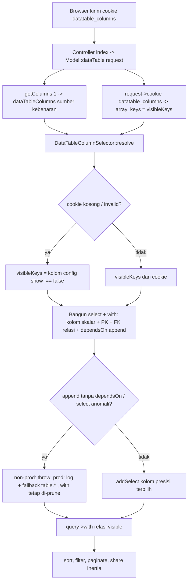

# Design Document: DataTable Adaptive Column & Relation Fetching

## Overview

`DataTableScope::dataTable()` saat ini selalu `SELECT <table>.*` dan selalu eager-load **semua**
relasi ber-`type == 'relation'` dari config kolom, tanpa peduli kolom mana yang benar-benar
ditampilkan user. Akibatnya payload baris membengkak dan ada query relasi yang sia-sia.

Desain ini menambahkan **pruning adaptif**:

1. **SELECT** hanya kolom DB yang visible (+ primary key + foreign key relasi yang visible).
2. **`with()`** hanya relasi yang kolomnya ditampilkan.

Daftar kolom visible diambil dari cookie `datatable_columns`. **Sumber kebenaran tetap
`configColumns`/`dataTableColumns`** — cookie hanya menandai *kolom mana yang tampil*. Atribut
cookie lain (width, order) murni kebutuhan frontend dan **diabaikan** backend.

Saat cookie kosong/invalid, fallback ke kolom dengan `show !== false` di config. Append (`attribute`)
yang tampil **wajib** mendeklarasikan `dependsOn` agar kolom sumbernya ikut di-SELECT (lihat bagian
khusus). Bila terjadi anomali (mis. tak ada kolom skalar valid, atau append tanpa `dependsOn` di
produksi), fallback aman ke `<table>.*` sehingga **tidak ada regresi**.

### Goals
- Kurangi lebar baris hasil query (peluang covering index, payload Inertia lebih kecil).
- Hilangkan eager-load relasi yang tidak ditampilkan.
- Tanpa mengubah kontrak frontend secara breaking (cookie tetap penanda visibilitas).

### Non-Goals
- Tidak mengoptimasi query nested relation (`items.item`, dst.) pada fase ini — hanya level-1 `with`.
- Tidak select presisi kolom anak relasi (tabel anak tetap `SELECT *`).
- Tidak menyentuh logika sort / pagination / saved filter / submitable selain memastikan tetap jalan.

## Architecture

### Aliran request



### Posisi komponen

| Lapisan | Berkas | Peran |
| --- | --- | --- |
| Service (baru) | `app/Services/Core/DataTableColumnSelector.php` | Resolusi murni `{select, with}` dari `dataTableColumns` + visibleKeys + model. Mudah diunit-test. |
| Service (reuse) | `app/Services/Core/FilterColumnResolver.php` | Sudah ada (commit `7ff3a1e`). `resolvePath($key)` mengubah key dot-notation → rantai relasi + kolom akhir; dipakai selektor utk meresolusi `dependsOn` append ber-dot (relasi + FK). |
| Scope (ubah) | `app/Models/Scopes/DataTableScope.php` | Baca cookie standar Laravel, panggil selector, terapkan ke query. **Catatan**: kini ada blok `FilterColumnResolver::expandColumnsForTree` saat `fid` (commit `7ff3a1e`) — urutan operasi harus disesuaikan. |
| Bootstrap (verifikasi) | `bootstrap/app.php:38` | `datatable_columns` sudah dikecualikan dari enkripsi cookie. |
| Frontend (ubah) | `resources/js/Components/Table/Table2.jsx`, `Table.jsx` | Tulis/baca cookie `datatable_columns` **tanpa suffix pathname**, `path: "/"`; prop baru `persistColumns` utk skip cookie saat di Dialog. |

## Components and Interfaces

### `DataTableColumnSelector`

Service tanpa akses `Request`/cookie (semua I/O di scope) agar deterministik & gampang ditest.
Bergantung pada `FilterColumnResolver` utk resolusi dot-notation; resolver dapat lazy-load kolom
model relasi (di-cache per FQCN), tapi selektor sendiri hanya mengonsumsi hasilnya.

```php
namespace App\Services\Core;

use Illuminate\Database\Eloquent\Model;

class DataTableColumnSelector
{
    /**
     * @param FilterColumnResolver $resolver Reuse resolusi dot-notation (key relasi -> rantai relasi
     *                                       + kolom). Sudah ada sejak commit 7ff3a1e.
     */
    public function __construct(private FilterColumnResolver $resolver) {}

    /**
     * @param array<int, array<string, mixed>> $dataTableColumns Hasil Model::getColumns(1).
     * @param array<int, string>|null          $visibleKeys      Nama kolom visible dari cookie;
     *                                                            null/[] => pakai default config.
     * @param array<int, string>               $extraKeys        Kolom skalar lokal yang wajib ikut
     *                                                            SELECT walau tak visible (mis. kolom
     *                                                            sort non-visible). TIDAK menambah `with`.
     * @return array{select: array<int, string>, with: array<int, string>, fallbackAll: bool}
     */
    public function resolve(
        array $dataTableColumns,
        Model $model,
        ?array $visibleKeys,
        array $extraKeys = [],
    ): array;
}
```

> Selektor menerima `FilterColumnResolver` di konstruktor agar key ber-dot dari `dependsOn` append
> di-resolve lewat jalur yang sama dgn filter (`resolvePath`) → rantai relasi (`with`) + relasi
> terdalam utk FK. Tak ada traversal tree duplikat.

#### Kontrak nilai balik
- `select`: daftar nama kolom DB **tanpa kualifikasi tabel** (scope yang menambahkan `<table>.`).
  Selalu memuat PK. Memuat FK tiap relasi BelongsTo/morph yang visible. `null`/kosong tidak dikembalikan.
- `with`: daftar `nameOfFunction` relasi yang visible (siap dipakai `$query->with(...)`).
- `fallbackAll`: `true` bila scope harus pakai `<table>.*` alih-alih `select` (lihat aturan 4).
  `with` tetap dipakai walau `fallbackAll == true` (relasi tetap di-prune).

#### Aturan resolusi
1. **visibleKeys efektif**
   - Jika `$visibleKeys` null/[] → ambil dari `dataTableColumns` semua kolom dgn `($col['show'] ?? true) !== false`.
   - Normalisasi: untuk key ber-dot (`customer.name`) ambil segmen pertama (`customer`) agar memetakan
     ke kolom top-level. Gabungkan `extraKeys` (kolom sort) ke himpunan ini.
   - Buang key yang tidak ada di `dataTableColumns` (kolom asing milik model lain → cross-page aman).
2. **SELECT** (kumpulkan dari himpunan top-level): untuk tiap key, lookup entri di `dataTableColumns`:
   - `type` skalar (`string|number|integer|float|date|datetime|boolean|json`) **dan** namanya kolom DB nyata → masukkan ke `select`.
   - `type == 'attribute'` (append) → proses `dependsOn` (langkah 4). **Tak** lagi memicu `fallbackAll`.
   - `type == 'relation'|'relations'` → diproses di langkah 3.
   - Selalu push PK (`$model->getKeyName()`).
3. **Relasi & FK**: hanya relasi **singular** (`type == 'relation'`: BelongsTo/HasOne/MorphTo/MorphOne)
   yang visible di-eager-load default — **meniru perilaku lama** (cegah regresi eager-load morphMany
   `files` global). Relasi **plural** (`type == 'relations'`: HasMany/MorphMany) **tidak** auto-`with`
   (tetap bisa via `?with` eksplisit di scope). Untuk relasi singular visible:
   - Push `nameOfFunction` ke `with`.
   - `BelongsTo` → resolve FK live: `$model->{fn}()->getForeignKeyName()`, push ke `select`.
   - `MorphTo` → push `getForeignKeyName()` + `getMorphType()` ke `select`.
   - `HasOne/MorphOne` → parent cukup PK (sudah ada), tak ada FK tambahan.
4. **Append `dependsOn`** (select presisi, gantikan fallback `*` lama): untuk tiap append (`type=='attribute'`) yang visible:
   - Ambil `$col['dependsOn']` (array). Untuk tiap entri:
     - **Kolom lokal** (tanpa dot, mis. `start_date`) → push ke `select` (walau kolomnya `ignore` di config).
     - **Relasi** (ber-dot, mis. `customer.name`) → segmen pertama (`customer`) diperlakukan sbg relasi
       visible: push `nameOfFunction` ke `with` + resolve FK seperti langkah 3 (reuse pipeline relasi).
   - Bila append **tidak punya** `dependsOn`: ini **kesalahan deklarasi**.
     - Non-produksi (`! app()->isProduction()`) → **throw** `\RuntimeException` (fail-fast, paksa dev deklarasi).
     - Produksi → **log** `warning` + set `fallbackAll = true` (fail-open, jangan jatuhkan halaman index).
5. **Fallback aman** → set `fallbackAll = true` bila salah satu:
   - Append visible tanpa `dependsOn` di produksi (langkah 4).
   - `select` efektif hanya berisi PK padahal ada kolom non-relasi yang seharusnya tampil (anomali).
   - decode cookie gagal saat `$visibleKeys` diberikan (defensif; scope yg menangkap parse).

### Konfigurasi append: `dependsOn`

Accessor PHP tak bisa diintrospeksi — backend tak tahu kolom DB apa yang dibaca closure `get:`.
Maka append yang ingin tampil di DataTable **wajib** mendeklarasikan kebergantungan kolomnya.

Contoh nyata (`SalesOrder`): append `rent_date` (accessor `rentDate()`) membaca `start_date` +
`end_date` — keduanya bahkan ditandai `'ignore' => true` di config (tak pernah jadi kolom tampil),
tapi DB-nya tetap perlu di-SELECT agar accessor menghasilkan nilai.

```php
// app/Models/Sales/SalesOrder.php  (configColumns)
'rent_date' => [
    'type'      => 'attribute',
    'dependsOn' => ['start_date', 'end_date'],   // kolom lokal
],

// contoh append yang baca relasi:
'customer_label' => [
    'type'      => 'attribute',
    'dependsOn' => ['code', 'customer.name'],     // 'customer.name' -> with('customer') + FK
],
```

Aturan:
- **Wajib** untuk setiap append yang dapat tampil (tidak `ignore`). Tanpa `dependsOn`:
  throw saat non-produksi, log + fallback `*` saat produksi (aturan resolusi #4).
- Entri **tanpa dot** = kolom tabel model ini → masuk `select`.
- Entri **ber-dot** (`relasi.kolom`) = tambahkan relasi (segmen pertama) ke `with` + resolve FK,
  lewat pipeline relasi yang sama (aturan #3). Kolom anak tak di-select presisi pada fase ini
  (level-1 `with` saja — lihat Batasan).

### Perubahan `DataTableScope`

**Kode terkini (commit `7ff3a1e`)** — yang akan diubah:
- `:36` `$configColumns = array_column(json_decode($_COOKIE['datatable_columns'] ...))` (dibaca, tak dipakai query).
- `:40` `$query->addSelect("$nameOfTable.*")`.
- `:61-77` bangun `$relations` (semua `type=='relation'`) → `$with` → `$query->with($with)`.
- `:88-99` blok `fid`: `FilterEvaluator::apply` **lalu** `$dataTableColumns = FilterColumnResolver::expandColumnsForTree(...)`
  (menimpa `$dataTableColumns` dgn salinan ter-expand utk transport ke frontend).

#### Prinsip: `with` hanya untuk kolom relasi VISIBLE
Pemisahan penting (dikonfirmasi dari kode `7ff3a1e`):
- **Filter** (`?fid`) memakai `whereHas` (`FilterEvaluator`), **bukan** `with` — tak meng-eager-load relasi.
  Label/value chip filter di frontend di-resolve dari **metadata** `dataTableColumns` (yang
  `expandColumnsForTree` perkaya), **bukan** dari baris relasi. → relasi yang **hanya** difilter
  **TIDAK** perlu `with`.
- **Sort** relasi tak dijalankan via `with` (with tak membuat `orderBy` relasi bekerja); sort kolom
  **lokal** non-visible hanya butuh kolomnya ikut **SELECT**.

Konsekuensi: `extraKeys` hanya memengaruhi **SELECT** (kolom skalar lokal yang dipakai sort), **tidak**
menambah `with`. `with` murni dari kolom **relasi visible**. Ini memperkuat optimasi (lebih sedikit `with`).

#### Urutan operasi
```php
// 1) Baca cookie (standar Laravel, plaintext krn di `except` encrypt).
$cookieRaw   = $request->cookie('datatable_columns');
$visibleKeys = is_string($cookieRaw)
    ? array_keys(json_decode($cookieRaw, true) ?: [])   // abaikan width/order
    : null;

// 2) extraKeys = kolom sort lokal non-visible (hanya pengaruhi SELECT, bukan with).
$extraKeys = $this->isTableIncluded($sortKeyRaw) ? [] : [$sortKeyRaw]; // sortKey tanpa prefix tabel

// 3) Resolusi select + with. dependsOn append (dot-notation) di-resolve via FilterColumnResolver.
$resolved = (new DataTableColumnSelector(new FilterColumnResolver($dataTableColumns)))
    ->resolve($dataTableColumns, $query->getModel(), $visibleKeys, extraKeys: $extraKeys);

// 4) Terapkan SELECT.
$resolved['fallbackAll']
    ? $query->addSelect("$nameOfTable.*")
    : $query->addSelect(array_map(fn ($c) => "$nameOfTable.$c", $resolved['select']));

// 5) Terapkan with (merge `?with` request, dedup).
$with = $resolved['with'];
if ($request->has('with')) { $with = [...$with, ...$request->with]; }
$query->with(array_values(array_unique($with)));
```

> `expandColumnsForTree` yang menimpa `$dataTableColumns` (transport frontend, saat `fid`) tetap
> berjalan **setelah** query dibentuk — ia hanya mengubah metadata yang di-`Inertia::share`, tak
> memengaruhi SELECT/`with`. Selektor memakai `$dataTableColumns` **sebelum** di-expand (level-1).

Tetap dipertahankan tanpa perubahan perilaku: pagination, `?id`, saved filter (`whereHas` via
`FilterEvaluator`), `expandColumnsForTree`, submitable, `Inertia::share`.

> Catatan extraKeys: hanya kolom **sort lokal** non-visible agar `orderBy` valid (kolomnya ikut SELECT).
> Tidak menambah `with` — relasi yang hanya difilter/disort tak di-eager-load.

### Perubahan Frontend (carrier cookie)

`Table2.jsx` & `Table.jsx`:
- `createHeaders` (`Table2.jsx:76`): baca `getCookieByName(DATATABLE_COLUMNS_KEY)` — hapus `_${window.location.pathname}`.
- `setCookie` (`Table2.jsx:425`): tulis ke `DATATABLE_COLUMNS_KEY` polos, opsi `path: "/"` agar
  cookie terkirim ke semua endpoint (bukan hanya pathname tabel).
- `onReset` (`Table2.jsx:695-698`): `removeCookie` harus pakai key polos `DATATABLE_COLUMNS_KEY`
  + `path: "/"` (sekarang masih ber-suffix pathname → reset tak menghapus cookie yang benar).
- Konsekuensi: satu cookie `datatable_columns` global. Aman karena backend hanya memakai key yang
  dikenal `dataTableColumns` model halaman; key asing diabaikan (aturan 1).

### Reusability Table2: opsi skip-persist (`persistColumns`)

`Table2` akan dipakai ulang, termasuk dibungkus `Dialog` sebagai tabel sekunder. Karena cookie
`datatable_columns` kini global (satu key, `path:"/"`), perubahan kolom di tabel dialog akan
**menimpa** preferensi kolom tabel halaman. Solusi: prop baru pemisah persist dari sumber data.

#### Konteks `isDynamicData` (eksisting)
Flag ini mencampur 3 concern sekaligus:
1. **Sumber data** manual via prop `data` (bukan alur Inertia `reload`/`router.get`).
2. **Skip cookie** read (`createHeaders(headers, isDynamicData)` `:315/:318`) **dan** write
   (`useEffect` `:416` `if (isDynamicData) return`).
3. **Empty-state** berbeda (`:628`): teks "no data" vs gambar `NoDataImg`.

Untuk tabel dialog yang **datanya tetap dari server** tapi **tak boleh persist cookie**,
`isDynamicData` tidak cocok (ikut mengubah empty-state & memperlakukan data sbg manual).

#### Prop baru: `persistColumns` (default `true`)
- `persistColumns={false}` → **skip read + write cookie SAJA**; empty-state & sumber data tak berubah.
- Kondisi efektif skip cookie diturunkan satu kali dan dipakai konsisten di `createHeaders` (read)
  dan `useEffect` write (`:415`) + `onReset`:
  ```js
  const skipCookie = isDynamicData || !persistColumns;
  // read:  createHeaders(headers, skipCookie)
  // write: useEffect(() => { if (skipCookie) return; setCookie(...) }, [showedColumns])
  ```

#### Alur perubahan kolom & `reload(val)`
Prop **`reload(val)`** adalah callback yang menerima daftar kolom baru, dipanggil di
`ColumnsFilter.onApply` (`Table2.jsx:689-693`): `setColumns(val)` → cookie write (bila tak skip)
→ `reload?.(val)`. Default `reload` = `loadData` (`DataTable2.jsx:285`) yang `router.get` ulang
sehingga request membawa cookie terbaru → backend prune sesuai kolom baru.

Implikasi untuk tabel dialog (`persistColumns={false}`):
- Refetch **tidak boleh** andalkan cookie (cookie tak ditulis). Maka tabel dialog **wajib** memberi
  `reload` sendiri yang mengirim kolom visible **eksplisit** (param/body), mis. `?cols=a,b,c`,
  bukan `router.get(pathname)` halaman utama. Inilah alasan `reload` menerima argumen `val`.
- Pasangan kontrak: `persistColumns={false}` selalu disertai `reload={fetchDialogSendiri}`.

> Catatan backend: bila tabel dialog mengirim kolom via query param eksplisit, `DataTableScope`
> dapat memprioritaskan param itu di atas cookie. Diperlakukan sebagai **extension** opsional —
> selektor sudah menerima `visibleKeys` dari sumber mana pun; scope tinggal pilih param > cookie.
> (Detail param eksplisit di luar scope inti spec ini; dicatat di Batasan/Tindak Lanjut.)

## Data Models

Tidak ada perubahan skema DB. Bentuk cookie tetap:

```json
{ "code": { "size": "200px", "order": 0 }, "customer": { "size": "max-content", "order": 1 } }
```

Backend hanya membaca `array_keys` → `["code", "customer"]`.

## Error Handling

- **Cookie absen** → `$visibleKeys = null` → default config `show !== false`.
- **Cookie JSON invalid** → `json_decode` mengembalikan `null`/`false` → diperlakukan kosong → default config.
- **Key tak dikenal** (cross-page / model lain) → dibuang di aturan 1.
- **Append visible tanpa `dependsOn`** → non-produksi: throw `RuntimeException` (fail-fast);
  produksi: `Log::warning` + `fallbackAll = true` (fail-open). `with` tetap di-prune.
- **Anomali select** (hanya PK padahal ada kolom non-relasi) → `fallbackAll = true`.
- **Relasi tanpa FK resolvable** (mis. config menandai relasi tapi method bukan Relation) → skip relasi itu;
  tetap masuk `with` hanya bila `nameOfFunction` valid (selaras dgn yang dideteksi `getColumns`).

## Testing Strategy

### Unit — `tests/Unit/Services/Core/DataTableColumnSelectorTest.php`
- Cookie kosong → `select` = kolom `show:true`, `fallbackAll=false`.
- Cookie subset skalar → `select` hanya subset + PK, `with` kosong.
- BelongsTo visible → FK ada di `select`, `nameOfFunction` ada di `with`.
- Morph visible → `*_type` + `*_id` di `select`.
- HasMany visible → `with` berisi relasi, tak ada FK tambahan di `select`.
- Append visible + `dependsOn` kolom lokal → kolom sumber masuk `select`, `fallbackAll=false`.
- Append visible + `dependsOn` ber-relasi (`customer.name`) → relasi masuk `with` + FK di `select`.
- Append visible **tanpa** `dependsOn` → throw (uji dgn `app()->isProduction()` di-fake false);
  saat produksi-fake → `fallbackAll=true` + log (uji `Log::shouldReceive('warning')`).
- `extraKeys` kolom sort lokal non-visible → ikut di `select`, **tak** menambah `with`.
- `dependsOn` dot-notation (`customer.name`) → memetakan ke relasi `customer` (via `FilterColumnResolver::resolvePath`).

### Feature — `tests/Feature/...DataTable...`
- Set cookie via `withCookie('datatable_columns', json_encode([...]))`, hit controller index.
- Assert relasi tak-visible **tidak** ter-load (`$row->relationLoaded('x') === false`).
- Assert kolom tersembunyi tak ada di atribut row (kecuali PK/FK).
- Regresi tanpa cookie: data + relasi sama seperti perilaku lama (kolom `show:true`).
- **Interaksi sort (kolom lokal)**: `?sort=-some_local_col` dgn kolom disembunyikan → kolom tetap
  ikut SELECT (lewat extraKeys), `orderBy` valid.
- **Interaksi filter `fid`**: saved filter memfilter `customer.name` dgn kolom `customer` disembunyikan →
  `whereHas` tetap jalan (filter benar) **dan** `customer` **TIDAK** ter-`with` (tak boros);
  `expandColumnsForTree` tetap memperkaya metadata utk frontend. Tak ada regresi vs commit `7ff3a1e`.

## Batasan & Tindak Lanjut
- **Append wajib `dependsOn`.** Append yang dapat tampil tanpa deklarasi `dependsOn` → throw
  (non-produksi) / log+fallback `*` (produksi). Konsekuensi: append eksisting yang tampil di
  DataTable harus dimigrasi (tambah `dependsOn`) sbg bagian implementasi. Inventaris append per model
  perlu dicek saat task.
- **Nested relation columns** (`items.item`, `customer.name` dari `dependsOn`) belum di-prune
  kolomnya — hanya level-1 `with`. Anak relasi tetap di-load penuh (`SELECT *` di tabel anak).
- **Kolom visible via query param eksplisit** (utk tabel dialog `persistColumns={false}`) adalah
  extension opsional: scope memprioritaskan param > cookie, selektor tak berubah. Detail param di
  luar scope inti; bisa jadi requirement terpisah bila dibutuhkan saat implementasi tabel dialog.

## Langkah berikutnya
1. ACC design ini.
2. `/spec-req datatable-adaptive-fetching` → susun `requirements.md` (user stories + acceptance criteria).
3. `/spec-task datatable-adaptive-fetching` → pecah jadi `tasks.md`.
