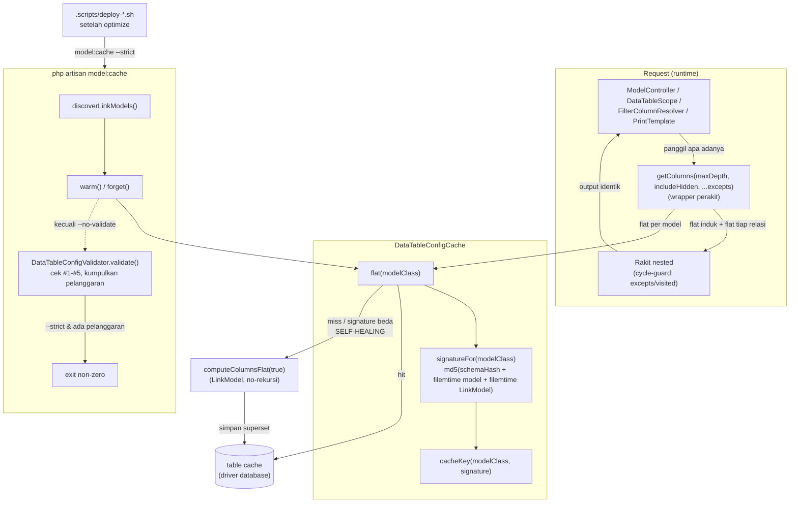

# Design Document: DataTable Config Cache

## Overview

`Model::getColumns()` (`app/Traits/LinkModel.php:486`) adalah method **panas**: dipanggil tiap request DataTable/lookup. Biayanya tinggi karena refleksi relasi (`$instance->$key()` per relasi), introspeksi skema (`Schema::getColumns`), **rekursi** ke `getColumns` relasi anak, parse cast per kolom, dan `usort`.

Output `getColumns` adalah **fungsi murni dari definisi kelas + skema DB** — tidak bergantung row data atau user → layak di-cache. Eksplorasi menyeluruh (ModelController, DataTableScope, FilterColumnResolver, FilterEvaluator, PrintTemplate, middleware) mengonfirmasi: **semua jalur metadata-config yang mahal bermuara ke `getColumns`** (`FilterColumnResolver::columnsForModel`, `ModelController::safeLookupColumns/relatedModelMap/columns`, `DataTableScope::dataTable`, `PrintTemplate::columns`). Cache `getColumns` saja → seluruh rantai ikut cepat.

Solusi: simpan hasil ke cache DB (driver `database`, table `cache` existing) sebagai **flat per-model**, dengan invalidasi **signature-based** dan self-healing saat request. Disertai command artisan `model:cache` untuk warm/clear di muka (jalan saat deploy) yang **sekaligus** memvalidasi config secara strict (shift-left: error config ketahuan saat deploy, bukan saat user kena).

**Out of scope** (temuan eksplorasi, query *data* bukan *config* — bukan bagian spec ini): `$user->branches()` tanpa version-gate di `AppMiddleware`, dan query duplikat `num_per_page` di `DataTableScope`.

## Keputusan Desain (disepakati)

| Aspek | Keputusan |
|-------|-----------|
| Storage | `Cache` facade, driver `database` (table `cache` existing — **tidak** bikin table/migration baru) |
| **Bentuk cache** | **FLAT per-model**: 1 key = daftar kolom model itu saja (skalar + append + relasi), **entri relasi `columns: []` (TIDAK nested)**. "1 model = representasi kolomnya sendiri." |
| Varian disimpan | Flat **superset `includeHidden=true`**. Varian not-includeHidden = superset minus baris ber-flag hidden (filter murah) |
| **Perakitan nested** | `getColumns($maxDepth, ...)` **tetap return nested seperti sekarang** — dirakit di runtime dari cache flat (induk + flat tiap relasi anak ditempel ke `columns`). Cycle dijaga saat rakit (`$excepts`/visited), **tidak** disimpan |
| Output ke pemanggil | **Tidak berubah** — semua call site terima struktur identik. Test existing tetap valid |
| templateLink columns | **TIDAK** di-cache — hitung on-the-fly (regex murah) |
| Invalidasi | **signature-based**: `md5(Schema columns hash + filemtime(model file) + filemtime(LinkModel.php))`, masuk ke cache key |
| Self-healing | request: cek cache by key(signature terkini); miss/signature beda → recompute flat + simpan (overwrite) |
| Command | `model:cache` |
| Flags | `--clear` · `--model=X` · `--no-warm` · `--no-validate` · `--strict` |
| Validasi strict | **selalu** saat warm (skip `--no-validate`); default **warn** (exit 0); `--strict` → exit non-zero (hentikan deploy `set -e`). Cakupan #1–#5 |
| Runtime throw existing | **dibiarkan** (`collectAppendStrict` tetap throw saat request) — defense-in-depth |
| Discovery model | scan `app/Models` via `File::allFiles`, filter `in_array(LinkModel::class, class_uses_recursive($class), true)` |
| Auto-run | `.scripts/deploy-staging.sh` & `deploy-production.sh`, setelah `php artisan optimize` (pakai `--strict`) |

## Architecture



## Components and Interfaces

### 1. `app/Services/Core/DataTableConfigCache.php` (baru)

Isolasi logika cache. Reuse pola `HaveTransactionsSyncService` (`rememberMetadata`/`metadataCacheKey`/`primeModelMaps`).

```
signatureFor(string $modelClass): string
    md5(json_encode([schemaColumnsHash, filemtime(reflectionFile model), filemtime(LinkModel.php)]))
cacheKey(string $modelClass, string $signature): string
    "datatable_columns:{conn}:{db}:{modelClass}:{signature}"
flat(string $modelClass): array          // cek cache (signature terkini); miss → computeColumnsFlat(true) + simpan; try/catch fallback compute mentah  ← SELF-HEALING
forget(string $modelClass): void          // Cache::forget(cacheKey(model, signatureFor(model)))
warm(string $modelClass): array           // paksa compute flat + simpan
discoverLinkModels(): array<class-string> // pola primeModelMaps + filter class_uses_recursive ∋ LinkModel
```

Flag enable/TTL dari `config/datatable.php`. TTL longgar (signature = invalidasi utama; TTL hanya housekeeping entri usang).

### 2. `app/Traits/LinkModel.php` (edit — split flat vs rakit)

**a. `private static function computeColumnsFlat(bool $includeHidden): array`** — logika kolom 1 model (skalar + append + relasi), **TANPA rekursi**. Diambil dari body `getColumns` sekarang; perubahan pada blok relasi (`:587-654`): entri relasi diisi `'columns' => []` (jangan panggil `$classRelation::getColumns(...)`). Pertahankan `$hiddenFlags` (superset) & `usort` by name.

**b. `getColumns(int $maxDepth = 0, bool $includeHidden = false, ...$excepts)`** — wrapper perakit, output **identik** dgn sekarang:
1. Ambil flat dari `DataTableConfigCache::flat(static::class)` (superset includeHidden=true).
2. Bila `! $includeHidden` → buang baris ber-flag hidden (`($col['hidden'] ?? false) === true`).
3. Rakit nested sesuai `maxDepth` (samakan semantik lama `:583-586`: `maxDepth==0` → semua level; `==1` → relasi `columns:[]`; `==2` → 1 level anak; dst). Untuk relasi yang di-expand: flat anak (cache) + filter includeHidden + cycle-guard (`$excepts` + `static::class`), tempel ke `columns`. Rekursi via wrapper.

Cache disabled / cache error → fallback: `computeColumnsFlat` langsung (tanpa cache), rakit sama → perilaku == lama.

### 3. `app/Services/Core/DataTableConfigValidator.php` (baru)

**Kumpulkan** (bukan throw) pelanggaran strict per model. Reuse resolver existing (`FilterColumnResolver::resolvePath`, helper `DataTableColumnSelector`).

```
validate(string $modelClass): array<int, array{rule:int, column?:string, message:string}>
```

| # | Cek | Acuan |
|---|-----|-------|
| 1 | Append (`type=attribute`, bukan kolom DB, bukan `forceAppend`) tanpa `dependsOn` non-kosong | `collectAppendStrict` (`DataTableColumnSelector.php:339`) |
| 2 | tiap `dependsOn` dep: tanpa-dot → harus kolom DB; ber-dot → relasi awal `method_exists` & `resolvePath` resolvable | `collectSafeDependsRelation` (`:371-378`) |
| 3 | key configColumns `method_exists` tapi `$instance->$key()` bukan `Relation` (atau throw) | `LinkModel.php:591-598` |
| 4 | token `templateLink` (placeholder head) tak resolvable (bukan kolom DB / relasi valid / accessor ber-dependsOn) | `resolveTemplateLink` / `templateLinkLocalColumns` |
| 5 | relasi anak: `related` class ada tapi tak punya `getColumns` | `FilterColumnResolver::isValidColumnModel` (`:258`) |

Murni dari definisi+skema (aman saat warm, tanpa data row).

### 4. `app/Console/Commands/ModelCacheCommand.php` (baru)

```
signature: model:cache
    {--clear : Kosongkan cache}
    {--model= : Batasi ke satu model class}
    {--no-warm : Jangan warm ulang setelah clear}
    {--no-validate : Lewati validasi strict}
    {--strict : Exit non-zero bila ada pelanggaran}
```

Inject `DataTableConfigCache` + `DataTableConfigValidator`. `handle()`:
- target = `--model` (normalisasi FQCN) atau `discoverLinkModels()`.
- `--clear` → `forget()` tiap target; `--no-warm` → selesai; else warm.
- default/non-clear → `warm()` tiap target.
- kecuali `--no-validate` → validasi tiap target, kumpulkan pelanggaran, cetak laporan per-model.
- return: pelanggaran & `--strict` → FAILURE; selain itu SUCCESS. Output pola `HaveTransactionsSyncCommand` (info + table count + table pelanggaran).

### 5. `config/datatable.php` (baru)

```
config_cache_enabled      (default true, env-overridable)
config_cache_ttl_seconds  (longgar, mis. 86400)
config_cache_prefix       (default "datatable_columns")
```

### 6. Deploy script (edit)

`.scripts/deploy-staging.sh` & `deploy-production.sh`, **setelah** `php artisan optimize` (line 60 — wajib setelah `optimize:clear`/`cache:clear` agar warm tak terhapus):
```bash
php artisan model:cache --strict
```

## Data Model

Tidak ada migration/model baru. Reuse table `cache` Laravel (key→value serialized, driver `database`). 1 entri per model: key memuat `(modelClass, signature)`, value = array flat (skalar+append+relasi, relasi `columns:[]`). Tidak ada Closure di payload (Closure child-select dibuat `DataTableColumnSelector` runtime, di luar cache).

## Error Handling

- Cache error / disabled → `getColumns` fallback `computeColumnsFlat` langsung (try/catch, pola `rememberMetadata`). Perilaku == lama.
- Signature beda (skema/kode berubah) → key baru → cache miss → recompute + overwrite (self-healing).
- Validator **mengumpulkan** error (tidak throw) agar command melaporkan SEMUA pelanggaran sekaligus, bukan mati di model pertama.
- Runtime `collectAppendStrict` tetap throw (defense-in-depth) — config rusak yang lolos command tetap tertangkap saat request.

## Testing Strategy

1. **Parity** — `getColumns(0/1/2)` & `getColumns(1,true)` identik sebelum vs sesudah cache aktif.
2. **Flat** — cache 1 model = relasi `columns:[]`; nested hanya setelah rakit.
3. **Signature** — mock filemtime/skema berubah → miss → recompute.
4. **includeHidden** — not-includeHidden = superset minus baris hidden (cocokkan `GetColumnsIncludeHiddenTest`).
5. **Validator** — tiap rule #1–#5 (stub melanggar → terdeteksi; bersih → kosong).
6. **Command** — warm mengisi; `--clear` kosongkan; `--model` scope; `--no-warm`; pelanggaran+`--strict` → exit non-zero; tanpa `--strict` → exit 0; `--no-validate` skip.
7. **Regression** — `php artisan test --compact --filter='GetColumns|DataTableColumnSelector|ModelSelectData|ModelControllerFilter|FilterColumnResolver'` hijau.
8. **Manual** — `php artisan model:cache` → `SELECT key FROM cache WHERE key LIKE '%datatable_columns%'` (1 entri/model); halaman DataTable + PrintTemplate render nested utuh, tak re-scan.

## Risks & Notes

- `getColumns`/`computeColumnsFlat` **static** → key wajib memuat `static::class`. Ditangani via param `$modelClass`.
- Flat tak punya `$excepts`-dependency → key sederhana `(modelClass, signature)`. Cycle murni urusan runtime assembly → "1 model = 1 representasi" tercapai.
- `PrintTemplate::columns` pakai `getColumns(2)` — **jangan diubah**; flat melayani depth-2 via perakitan runtime.
- Arsitektur flat = leverage tertinggi: `getColumns(1)`, `(1,true)`, `(2)` semua dirakit dari cache flat yang sama.

## [TODO: konfirmasi user]

- Lokasi config: file baru `config/datatable.php` (vs reuse gaya `have_transactions.php`). Asumsi: file baru.
- Nilai TTL default 86400s. Asumsi cukup; sesuaikan bila perlu.
