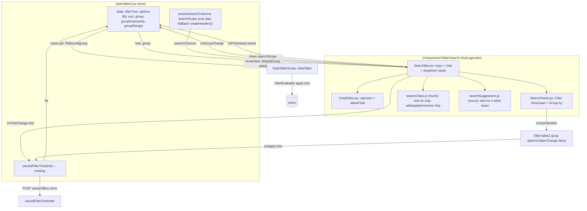

# Design Document: DataTable2 Advanced Search

## Overview

Search bar advance pada `DataTable2` — turunan dari fitur Filter (`FilterTable2`) yang dianggap sebagian user terlalu ribet. Terinspirasi Odoo (facet/chip + panel Filter/Group By) dan GitHub (autocomplete key saat mengetik). User mengetik di satu kotak untuk menjangkau semua fitur penyaringan: teks bebas, kondisi per kolom, nilai opsi, filter tersimpan (termasuk template shared), dan grouping. Kondisi aktif tampil sebagai chip yang bisa diedit langsung.

Saat ini `DataTable2` **tidak punya pencarian teks sama sekali** — toolbar hanya berisi Reload, Filter (dialog `FilterTable2`), Sort, dan Group by (`resources/js/Pages/Core/DataTable2.jsx:810-987`). State filter berupa nested tree yang di-persist sebagai row `SavedFilter` (ephemeral/named) lewat `persistFilterTree` → URL hanya membawa `?fid=` (`DataTable2.jsx:505`), dievaluasi backend oleh `FilterEvaluator` (`app/Models/Scopes/DataTableScope.php:485`).

**Keputusan brainstorming yang mengikat desain ini:**

1. **Model interaksi hybrid**: chip adalah state utama (gaya Odoo); mengetik memunculkan saran kolom (gaya GitHub) → pilih nilai → jadi chip. Tidak ada query string mentah yang di-parse dua arah.
2. **Satu sumber state: chip = filter tree** yang sama dengan `FilterTable2`. Tambah/edit/hapus chip = operasi pada tree → di-persist lewat jalur `persistFilterTree` yang sudah ada. Edit di builder → chip ikut berubah.
3. **Tombol Filter dan Group by pindah ke panel ▾** di ujung search bar; **Sort tetap di toolbar**, satu baris dengan search bar.
4. Saran kolom, opsi value, tipe kolom, operator dibaca dari `dataTableColumns` (configColumns) lewat `operators.js` / `ValueField` — **sama persis seperti `FilterTable2`** saat ini, bukan mekanisme baru.
5. **Teks bebas = grup OR `matches` di tree** (bukan param `?search=` baru). Kolom yang dicari: `searchScope` model (static property daftar kolom) → fallback kolom yang **tampil** + `searchable !== false` + tipe `string`.
6. **`searchScope` berbentuk daftar kolom** (Opsi A), bukan Eloquent scope — transparan ke user (tooltip + terlihat di builder), tanpa query logic baru di backend.
7. **Chip bisa diedit langsung** tanpa dihapus dulu (popover operator + `ValueField`).
8. **Komponen host-agnostic**: `SearchBar` tidak tahu Inertia/`fid`/router — transport tree diserahkan ke host via callback. DataTable2 host pertama; Advance Search Dialog LinkModel host kedua di **spec terpisah**.
9. **Penempatan**: baris sendiri di antara judul halaman dan kartu tabel (layout "B"), Sort satu baris bersama search bar. Tidak boleh mengganggu search global navbar.
10. Saran juga mencakup **filter tersimpan** dan **kolom groupable**; teks yang cocok ditandai `<mark>` via helper bersama `highlightMatch`.
11. Istilah "Favorit" **tidak dipakai** — memakai istilah yang sudah ada di UI: "Filter Tersimpan", badge "Shared", "Simpan sebagai baru", "Timpa".
12. **Saved filter menyimpan tree + sort + group** (snapshot tampilan utuh). Group disimpan di kolom JSON baru `saved_filters.group`.

**Batasan yang disengaja (bukan bug):**
- Teks bebas hanya `LIKE` pada kolom nyata — tidak bisa mencari nilai gabungan (CONCAT) atau angka terformat. Nilai terjemahan (mis. status "Selesai" vs `completed`) ditangani lewat **saran nilai** (§5.2), bukan pencarian fuzzy.
- Kolom `searchScope`/fallback **di-snapshot ke tree** saat chip "Cari" dibuat. Filter tersimpan tidak ikut berubah bila developer mengubah `searchScope` atau user menyembunyikan kolom belakangan.
- Setiap perubahan chip = 2 request berurutan (POST `saved-filters.store` → GET data), sama seperti perilaku Filter saat ini.

## Architecture



Alur utama:

```
ketik/pilih saran ──► searchChips.addChip(tree, …) ──► onTreeChange(tree) ──► persistFilterTree ──► fid ──► reload
tree dari host (fid di-fetch / builder / klik sel addFilter) ──► treeToChips(tree, columns) ──► render chip
```

## Components and Interfaces

### 1. File baru — `resources/js/Components/Table/Search/`

Folder `{Domain}/{Feature}` karena fitur butuh >1 file saling terkait (aturan CLAUDE.md).

| File | Tanggung jawab |
|---|---|
| `SearchBar.jsx` | Input + chip + dropdown saran (cmdk `Command` + `Popover`, keduanya sudah terpasang). Mengorkestrasi mode ketik (key/value), keyboard, busy state. |
| `ChipEditor.jsx` | Popover edit satu chip: label kolom (tetap), `Select` operator dari `getOperators()`, `ValueField` (dipakai ulang apa adanya — komponen murni props, `ValueField.jsx:41`). |
| `SearchPanel.jsx` | Panel ▾: kolom **Filter Tersimpan** (daftar + aksi simpan/timpa + Builder lanjutan + Hapus semua filter) dan kolom **Group by** (`SearchableOptionList` + granularity/range). Desktop = `Popover`; mobile = `Dialog`. |
| `searchChips.js` | **Fungsi murni**: `treeToChips`, `addLeafChip`, `addSearchChip`, `updateChip`, `removeChip`, `isSearchGroup`. |
| `searchSuggestions.js` | **Fungsi murni**: `buildSuggestions(text, ctx)` → daftar seksi saran. |
| `resolveSearchColumns.js` | **Fungsi murni**: `resolveSearchColumns({ searchScope, columns, visibleNames })`. |
| `*.test.js` / `*.rtl.test.jsx` | Co-located (lihat §9). |

### 2. Kontrak `SearchBar`

```jsx
<SearchBar
  columns={mapColumns}          // peta kolom hasil getColumns() — sumber tipe/opsi/operator/title
  tree={filterTree}             // controlled; null = tanpa filter
  onTreeChange={(tree) => …}    // transport milik host; BOLEH return Promise (busy state, §8)
  getSearchColumns={() => […]}  // dipanggil SAAT chip "Cari" dibuat (bukan state) — lihat §6.2
  model={model}                 // opsional → aktifkan saran & panel Filter Tersimpan
  activeFid={options.fid}       // opsional → deteksi badge sumber setelah reload (§5.5)
  onPickSaved={(saved) => …}    // opsional → host terapkan saved filter (tree + fid + sort + group)
  getViewSnapshot={() => ({ sort, group })} // opsional → dipakai "Simpan sebagai baru"/"Timpa"
  group={{ column, granularity, range }}    // opsional; tanpa groupOptions → seksi Group tak tampil
  groupOptions={groupOptions}
  onGroupChange={({ column, granularity, range }) => …}
  onOpenBuilder={() => …}       // buka FilterTable2
  placeholder={t("…", { name: title })}     // "Cari Sales Order…"
/>
```

`SearchBar` **tidak** mengimpor `router`, tidak membaca `usePage()`, dan tidak menulis `fid`. Satu-satunya I/O yang dilakukan sendiri: fetch `saved-filters.index` saat `model` diberikan — mengikuti preseden `FilterTable2` (`FilterTable2.jsx:192`), endpoint sama untuk kedua host.

### 3. Perubahan file existing (frontend)

| File | Perubahan |
|---|---|
| `resources/js/Pages/Core/DataTable2.jsx` | Toolbar desktop: hapus tombol `FilterTable2`, tombol `X` clear, Popover Group by, Select granularity/range. Tambah baris baru `[SearchBar ……… ▾] [Sort]` di antara header judul dan kartu tabel. Baris judul tinggal `[⟳] [+ Tambah]`. Mobile: baris sama full-width (Sort ikon saja); menu ⋯ tinggal Reload + Tampilkan per halaman (item Filter/Group/Sort dihapus dari menu). Tambah handler `onPickSaved`, `onGroupChange` (membungkus `setGroup`/`setGroupGranularity`/`setGroupRange` yang ada), `getSearchColumns`. `FilterTable2` dirender tanpa trigger, dikontrol `open`. |
| `resources/js/Components/Table/Filter/FilterTable2.jsx` | (a) Prop opsional `open`/`onOpenChange` (controlled); bila tidak diberikan tetap uncontrolled seperti sekarang — pemakai lama (`AdvanceSearchDialog` LinkModel dengan `trigger` custom) tidak berubah. Bila controlled tanpa `trigger`, trigger bawaan tidak dirender. (b) **Ekspor** `SaveFilterControl` (perilaku tidak berubah) + tambah prop opsional `getViewSnapshot` → payload PATCH menyertakan `sort` & `group`. (c) Ekstrak logika `isDirty` (`FilterTable2.jsx:217-240`) ke fungsi murni `isFilterTreeDirty(savedTree, currentTree)` di `resources/js/Components/Table/Filter/filterTreeCompare.js`, dipakai `FilterTable2` & `SearchBar`. |
| `resources/js/Pages/Core/FilterTemplate/Form.jsx` | Field Group by (+ granularity/range kondisional) di sebelah field Sort yang sudah ada. |
| `lang/id/core/datatable.php`, `lang/en/core/datatable.php`, `lang/*/core/filterTemplate.php` | Key i18n baru (§7). |

### 4. Perubahan backend

| File | Perubahan |
|---|---|
| `app/Traits/DataTable.php` | `public static function getSearchScope(): array` → `\property_exists(static::class, 'searchScope') ? static::$searchScope : []`. **Wajib pola `property_exists`** seperti `getDefaultGroupColumn()` (`DataTable.php:56-61`) — properti statis yang dideklarasi di trait lalu dideklarasi ulang di model dengan nilai berbeda = PHP fatal. Model: `protected static array $searchScope = ['code', 'customer.name'];` |
| `app/Models/Scopes/DataTableScope.php` | (1) Share prop `searchScope`: hasil `getSearchScope()` yang disanitasi — entri dibuang diam-diam bila tidak ter-resolve oleh `FilterColumnResolver::resolve()` (resolver yang sama dipakai `FilterTreeCleaner`, mendukung path relasi bertitik, `FilterColumnResolver.php:49`), `searchable === false`, atau tipe akhir bukan `string`. (2) Pindahkan resolusi `$appliedFilter` (`DataTableScope.php:347-356`) ke **sebelum** blok validasi group (`:295`). (3) Prioritas kolom grup: `$request->has('group')` (termasuk `group=` kosong = "Tidak ada") > `$appliedFilter->group['column']` > `getDefaultGroupColumn()`; granularity/range: query param > `$appliedFilter->group` > default. Kolom grup dari filter tetap wajib lolos gate `groupable` (salah → diabaikan diam-diam). (4) Prop `defaultGroup` yang di-share = group efektif tanpa param (filter aktif ?? model), plus `defaultGroupGranularity` / `defaultGroupRange`, agar state awal `options` di FE cocok dengan yang dieksekusi backend. |
| Migration baru `add_group_to_saved_filters_table` | `$table->json('group')->nullable()->after('sort');` — bentuk `{"column": string, "granularity": string\|null, "range": number\|null}`. |
| `app/Models/Core/SavedFilter.php` | Cast `'group' => 'array'`; configColumns `'group' => ['show' => false]` (pola sama dengan `sort`). |
| `app/Models/Scopes/DataTableScope.php` (tambahan) | Konstanta `public const GROUP_GRANULARITIES = ['day', 'month', 'quarter', 'half', 'year'];` — saat ini daftar hanya implisit di `match` `dateGroupExpression()` (`:114-133`), padanan FE `DATE_GROUP_GRANULARITIES` (`Table2.jsx:62`). `match` sendiri tidak diubah. |
| `app/Models/Core/SavedFilter.php` (tambahan) | `public static function groupValidationRules(): array` → `group` nullable array; `group.column` `required_with:group` string; `group.granularity` nullable `Rule::in(DataTableScope::GROUP_GRANULARITIES)`; `group.range` nullable numeric `gt:0`. Validasi **bentuk saja** — gate `groupable` tetap di runtime `DataTableScope` (salah → diabaikan diam-diam), karena FormRequest tidak punya konteks kolom model. Satu sumber aturan untuk 3 FormRequest di bawah. |
| `app/Http/Requests/Core/UpdateSavedFilterRequest.php` | Tambah `sort` (nullable string) + `SavedFilter::groupValidationRules()`. |
| `app/Http/Controllers/Core/SavedFilterController.php` | `update()`: simpan `sort` & `group` bila dikirim (`$request->has()`, pola sama dengan `filter`), response ikut mengembalikan `sort` & `group`. Tetap owner-only (`abort_if` 403, `:111`). `index()`: tambah `group` ke kolom yang dikembalikan. `store()` (jalur ephemeral) + `StoreSavedFilterRequest` **tidak diubah** — untuk filter ephemeral, sort/group hidup di URL. |
| `app/Http/Requests/Core/StoreFilterTemplateRequest.php`, `UpdateFilterTemplateRequest.php` | Tambah `SavedFilter::groupValidationRules()`. |
| `app/Http/Controllers/Core/FilterTemplateController.php` | `store()`/`update()` menyimpan `group` (pola sama dengan `sort`, `:55` & `:84-86`). |

## Data Models

### Filter tree (existing, tidak berubah)

```js
{ root: { k: "and" | "or", c: { [id]: Node } } }
// Node = group { k: "and"|"or", c: {...} } | leaf { k: "<kolom atau rel.kolom>", o: "<operator>", v: <value> }
```

Catatan dari kode existing yang memengaruhi desain:
- `FilterTreeCleaner::cleanGroup()` membangun ulang grup hanya sebagai `['k','c']` dan meng-collapse grup ber-anak tunggal (`FilterTreeCleaner.php:89`). **Penanda custom di grup tidak bertahan** setelah tree di-fetch ulang → chip "Cari" dikenali lewat **pola**, bukan penanda (§5.1).
- Value relasi (`linkmodel`) disimpan sebagai **objek record penuh**; backend mengekstrak `.id` (`ValueField.jsx:194`).

### Chip (turunan, tidak di-persist)

```js
{
  id: string,                 // id node di tree (untuk leaf/grup) atau "__group" / "__source"
  kind: "leaf" | "search" | "advanced" | "group" | "source",
  label: string,              // teks tampil, mis. "Status: Draft, Submitted"
  node?: object,              // referensi node tree (leaf/search/advanced)
  columns?: string[],         // kind "search": kolom yang dicari (tooltip)
  count?: number,             // kind "advanced": jumlah leaf
  dirty?: boolean,            // kind "source"
}
```

### Suggestion (turunan)

```js
{ section: "text" | "saved" | "column" | "value" | "group",
  key: string, label: string, match: string /* teks utk highlightMatch */, payload: object }
```

### `saved_filters.group` (baru)

```json
{ "column": "created_at", "granularity": "month", "range": null }
```

`null` = saved filter tidak mengatur group → **jangan override** group aktif saat diterapkan (preseden sama dengan `sort`, `FilterTable2.jsx:284-289`).

## 5. Perilaku Detail

### 5.1 Tree → chip (`treeToChips`)

| Node | Chip |
|---|---|
| Leaf anak langsung root AND | `leaf`: `Status: Draft`, `Total > 1.000.000`, `Nama mengandung laptop`, `Tanggal: Bulan ini`. Operator `=`/`in` ditulis `Kolom: nilai`; operator lain memakai label operator i18n yang sudah ada (`core.datatable.filter.operator.*`). |
| Grup OR anak langsung root yang **semua** anaknya leaf `o: "matches"` dengan `v` identik (≥2 anak) | `search`: `Cari: PT A`, tooltip daftar kolom. |
| Grup lain anak langsung root | `advanced`: `Filter lanjutan (n)`, n = jumlah leaf; klik → `onOpenBuilder`. |
| Root `k: "or"` dengan >1 anak | Seluruh tree = 1 chip `advanced`. |
| `group.column` terisi (bukan dari tree) | `group`: `≡ Tanggal › Bulan` / `≡ Total › 1.000`. |
| Saved filter sumber terdeteksi (§5.5) | `source`: `★ PO Bulan Ini` (+ titik kuning bila dirty) — dirender paling depan. |

Label nilai: opsi → label opsi / `parseTrans`; boolean → label parse; relasi → `convertTemplateLink(record, "")` (`resources/js/lib/linkModelUtils.js:31`) dengan fallback `record.name ?? record.code ?? record.id`; array → digabung `, `; `in_period` → label periode dari `DateSelector`. Kolom tak ter-resolve di `columns` → pakai key mentah (mis. kolom relasi yang belum di-expand).

Chip "Cari" dengan 1 kolom saja akan di-collapse cleaner jadi leaf `matches` → tampil sebagai chip `leaf` `Kode mengandung PT A`. Ini perilaku yang benar dan bisa ditebak, bukan bug.

### 5.2 Saran saat mengetik (`buildSuggestions`)

Urutan seksi dan batas:

| # | Seksi | Sumber | Batas | Saat dipilih |
|---|---|---|---|---|
| 1 | Teks bebas `Cari "x" di semua kolom` | `getSearchColumns()` tidak kosong | 1 | `addSearchChip` |
| 2 | Filter Tersimpan | `saved-filters.index` (named milik user + shared), cocok `name` | 3 | `onPickSaved` |
| 3 | Kolom | kolom `searchable !== false`, bukan hidden/ignore/meta, cocok `title` | 5 | masuk mode value |
| 4 | Nilai | label `options`/`parseTrans` dari kolom ber-opsi, cocok label | 5 | `addLeafChip` langsung (`=`/merge `in`) |
| 5 | Kelompokkan | `groupOptions`, cocok label | 3 | `onGroupChange` dgn granularity/range default |

- Pencocokan: case-insensitive, **per kata** (selaras dengan `highlightMatch` yang memecah `split(/\s+/)`).
- Seksi kosong tidak dirender. Seksi 2 hanya bila `model`; seksi 5 hanya bila `groupOptions`.
- Item default yang di-highlight saat dropdown terbuka = item pertama yang tampil (seksi 1 bila ada). cmdk dikontrol via `value`/`onValueChange` sendiri — auto-highlight bawaan cmdk hanya jalan sekali saat mount (gotcha yang sama sudah ditangani di `Select.jsx:139-154` & `MultiSelect.jsx`).
- **Highlight**: semua label dirender lewat `highlightMatch(label, text)` (`resources/js/lib/highlightMatch.jsx`) — bukan `highlightItem` lokal `Select.jsx` yang memakai `dangerouslySetInnerHTML`. Wajib karena nama saved filter shared adalah input user lain (risiko XSS).
- Label nilai dengan prefix kolom (`Status: Selesai`) hanya me-mark bagian yang cocok.

### 5.3 Mode value (setelah memilih kolom)

Input menampilkan prefix pill `[Status:]`. Operator default diambil dari `getOperators(type, { typeRelation, hasOptions })`:

| Tipe kolom | Perilaku |
|---|---|
| Punya opsi terbatas (`columnHasOptions` / enum / formStatus) atau `boolean` | Daftar nilai inline, bisa difilter dengan mengetik; pilih → chip `=` (merge ke `in` bila perlu). |
| `string` tanpa opsi | Ketik + Enter → leaf `matches`. |
| `number` / `currency` | Ketik + Enter → leaf `=` (input non-numerik ditolak inline, tidak commit). |
| `date`/`datetime`/`time`/`relation`/`relations`/lainnya | Langsung membuka `ChipEditor` dengan kolom terpilih + operator default. |

`Esc` atau `Backspace` pada input kosong di mode value → kembali ke mode key.

### 5.4 Aturan penggabungan

- Menambah leaf pada kolom yang sudah punya leaf `=`/`in` anak langsung root → **digabung** jadi satu leaf `in` (dedup nilai; relasi dibandingkan via `.id`). Mencegah AND `Status = Draft AND Status = Submitted` yang pasti kosong.
- Operator lain → leaf AND terpisah.
- Chip `Cari:` kedua → grup OR terpisah (AND antar-pencarian; kedua frasa wajib ada).
- Teks multi-kata `PT Abadi` → satu frasa `matches "PT Abadi"` (tidak dipecah per kata).

### 5.5 Badge sumber saved filter

- Set saat user memilih saved filter (saran seksi 2 atau panel) → state `sourceSaved = { id, name, filter }` di `SearchBar`.
- Setelah reload dengan `?fid=`: bila `activeFid` ada di daftar `saved-filters.index` sebagai named/shared → `sourceSaved` di-set dari sana. **Nama diambil dari `index`, bukan `show`** — `show()` sengaja menyembunyikan `name` dari non-owner (mitigasi IDOR, `SavedFilterController.php:40-49`), sedangkan `index` mengembalikan nama shared ke semua user. Karena itu, bila `activeFid` ada, daftar di-fetch saat mount (bukan menunggu fokus).
- `dirty = isFilterTreeDirty(sourceSaved.filter, tree) || (sourceSaved.sort != null && sourceSaved.sort !== sort) || (sourceSaved.group != null && !sameGroup(sourceSaved.group, group))` → titik kuning + tooltip `core.datatable.filter.saved.dirty` (key existing). `sort`/`group` aktif dibaca dari `getViewSnapshot()`; `null` di sumber = tidak mengatur, jadi tidak pernah membuat dirty.
- `×` pada badge → `onTreeChange(null)` (hapus semua chip dari filter itu) + `sourceSaved = null`.
- Memilih saved filter lain / tree dikosongkan → `sourceSaved` diganti / di-null.

### 5.6 Edit chip (`ChipEditor`)

| Chip | Klik badan chip → |
|---|---|
| `leaf` | Popover: label kolom, `Select` operator, `ValueField`, tombol Terapkan (Enter juga menerapkan) → `updateChip`. |
| `search` | Popover: input teks + info "Mencari di: …" → mengganti `v` semua anak grup. |
| `group` | Popover: `SearchableOptionList` kolom grup + granularity/range. |
| `advanced` | `onOpenBuilder()`. |
| `source` | Membuka panel ▾ (kolom Filter Tersimpan). |

Klik `×` pada chip → `removeChip` (untuk `group` → `onGroupChange({ column: null })`).

### 5.7 Keyboard

- `↑`/`↓` navigasi saran, `Enter` pilih item yang di-highlight, `Esc` keluar mode value / tutup dropdown.
- `Backspace` pada input kosong (mode key): tekan pertama **menyorot** chip terakhir, tekan kedua menghapusnya — mencegah reload tak sengaja. Tombol lain menghilangkan sorotan.
- **Tidak ada** shortcut global yang didaftarkan. `/` dan `Ctrl/⌘+K` milik `GlobalCommandPalette` (`resources/js/Layouts/GlobalCommandPalette.jsx:307`); handler-nya sudah diam saat fokus di input, jadi mengetik `/` di search bar aman.

### 5.8 Panel ▾ (`SearchPanel`)

```
┌─────────────────────────────┬──────────────────────┐
│ Filter Tersimpan            │ Group by             │
│ ✓ PO Bulan Ini     [Shared] │  Cari kolom…         │
│   Draft saya            🗑  │  ○ Tidak ada         │
│ ─────────────────────────── │  ● Customer          │
│ Simpan sebagai baru         │  ○ Tanggal           │
│ Timpa "PO Bulan Ini"        │     ↳ Bulan ▾        │
│ ─────────────────────────── │                      │
│ Builder lanjutan            │                      │
│ Hapus semua filter          │                      │
└─────────────────────────────┴──────────────────────┘
```

- Tombol hapus hanya untuk saved filter milik sendiri (bukan `is_shared`) — sama seperti `SavedFilterBar` (`FilterTable2.jsx:474-486`) agar tidak memicu 403.
- "Simpan sebagai baru" / "Timpa" = `SaveFilterControl` yang diekspor; "Timpa" hanya muncul bila `sourceSaved` ada, dirty (definisi §5.5, sudah mencakup sort/group), dan bukan `is_shared` — template shared dikelola lewat halaman Filter Templates; PATCH ke shared milik orang lain akan 403.
- Payload simpan menyertakan `sort` & `group` dari `getViewSnapshot()`.
- Kolom Group by hanya dirender bila `groupOptions` diberikan & tidak kosong.
- Mobile: `Dialog` dengan kedua seksi bertumpuk (preseden `DataTable2` memakai `Dialog` untuk Sort/Group di mobile; `Drawer`/`Sheet` ada di `ui/` tapi belum dipakai di halaman mana pun).

## 6. Host DataTable2

### 6.1 Toolbar

```
Sales Order                                          [⟳] [+ Tambah]
[⏷ [★ PO Bulan Ini •][Status: Draft ×][Cari: PT A ×] Cari Sales Order…  ▾] [↕ Dibuat]
┌──────────────────────────── tabel ─────────────────────────────┐
```

Mobile: baris kedua full-width, chip membungkus ke baris baru bila tidak muat, Sort ikon saja.

### 6.2 `getSearchColumns()`

```js
() => resolveSearchColumns({
  searchScope,                                   // prop Inertia (sudah disanitasi backend)
  columns: mapColumns,
  visibleNames: createHeaders({ ...mapColumns })           // Table2.jsx:134, baca cookie visibility
    .filter((h) => h.show).map((h) => h.name),
})
```

**Wajib salinan dangkal `{ ...mapColumns }`**: `createHeaders` memutasi argumennya (`headers[col.name] = {...}`, `Table2.jsx:149`) dan mengharapkan objek map berkunci nama. Memberi `mapColumns` langsung memutasi hasil `useMemo`; memberi array (`Object.values`) menghasilkan entri ganda (indeks numerik + kunci nama).

`resolveSearchColumns`: `searchScope` tidak kosong → pakai apa adanya; kosong → `visibleNames` ∩ kolom `searchable !== false` ∩ `type === "string"` (top-level). Dipanggil **saat Enter**, bukan disimpan sebagai state — cookie visibility bisa berubah di `Table2` tanpa me-render ulang `DataTable2`.

### 6.3 Handler

- `onTreeChange(tree)` → `persistFilterTree(tree)` (existing; tree kosong → `fid` null).
- `onPickSaved(saved)` → `setFilterTree(saved.filter)`; `setOptions(prev => ({ ...prev, fid: saved.id, sort: saved.sort ?? prev.sort, group/groupGranularity/groupRange: dari saved.group bila tidak null, page: 1 }))`. Tanpa POST (setara `useExisting`, `DataTable2.jsx:550-560`).
- `onGroupChange({ column, granularity, range })` → `setGroup(column)` lalu override granularity/range bila diberikan.
- `getViewSnapshot()` → `{ sort: options.sort, group: options.group ? { column, granularity, range } : null }`.
- `useImperativeHandle.addFilter` (klik sel) tidak diubah — hasilnya otomatis tampil sebagai chip karena chip = tree.
- State awal `options.group/groupGranularity/groupRange` memakai `defaultGroup`/`defaultGroupGranularity`/`defaultGroupRange` dari backend (§4 poin 4).

## 7. i18n (key baru)

`core.datatable.search.*`: `placeholder` (":name"), `search_all` ("Cari \":text\" di semua kolom"), `searching_in` ("Mencari di: :columns"), `section.saved`, `section.column`, `section.value`, `section.group`, `group_by_label` ("Kelompokkan: :column"), `advanced_chip` ("Filter lanjutan (:count)"), `advanced_builder` ("Builder lanjutan"), `clear_all` ("Hapus semua filter"), `apply` ("Terapkan"), `number_invalid`. `core.filterTemplate.form.group.*`. Istilah existing dipakai ulang: `core.datatable.filter.saved.*`, `core.datatable.group_by`, `core.datatable.no_grouping`, `core.datatable.granularity.*`, `core.datatable.group_range`.

## 8. Error Handling

| Kondisi | Penanganan |
|---|---|
| Persist gagal (422 tree kosong / 500) | `persistFilterTree` sudah toast + throw. Chip turunan dari prop `tree` yang hanya berubah bila host sukses → chip **otomatis kembali** tanpa rollback manual. Teks ketikan hanya dikosongkan saat sukses. |
| Commit beruntun saat persist berjalan | `onTreeChange` return Promise → `SearchBar` tampil spinner & menolak commit baru sampai selesai (cegah race POST yang saling menimpa `fid`; pola sama dengan freeze `busy` di `FilterTable2`). |
| Fetch `saved-filters.index` gagal | Seksi/panel Filter Tersimpan kosong; tidak memblokir fitur lain (sama dengan `FilterTable2.jsx:198`). |
| Semua entri `searchScope` tidak valid | Backend membuangnya → prop kosong → fallback kolom tampil. |
| Fallback juga kosong (tak ada kolom string tampil) | Seksi teks bebas tidak ditampilkan; Enter tanpa item terpilih = no-op. |
| Kolom group dari saved filter tidak groupable lagi | Backend abaikan diam-diam (gate `groupable` existing). |
| Input angka tidak valid di mode value `number` | Pesan inline `core.datatable.search.number_invalid`, tidak commit. |

## 9. Testing Strategy

Mengikuti `docs/frontend.md#testing` dan CLAUDE.md (prioritas unit test fungsi murni → RTL → hindari source-assertion).

**Unit (`.test.js`, environment node):**
- `searchChips.test.js` — semua baris tabel §5.1 (termasuk collapse 1 kolom, root OR, grup campuran), `addLeafChip` merge `=`→`in` + dedup relasi by id, `addSearchChip`, `updateChip`, `removeChip`, `isSearchGroup` (anak <2 / operator beda / `v` beda → false).
- `searchSuggestions.test.js` — urutan 5 seksi, batas per seksi, pencocokan per kata case-insensitive, seksi hilang tanpa `model`/`groupOptions`/`searchColumns`, kolom `searchable:false`/hidden/ignore/meta tidak muncul.
- `resolveSearchColumns.test.js` — scope menang; fallback = tampil ∩ searchable ∩ string.
- `filterTreeCompare.test.js` — `isFilterTreeDirty` urutan-independen, item belum lengkap ikut dihitung (perilaku existing dipertahankan).
- Property-based (`fast-check`, opsional): `removeChip(addLeafChip(tree, x))` ekuivalen dengan `tree` untuk leaf pada kolom baru. Precondition generator harus selaras persis dengan validasi source (aturan CLAUDE.md).

**RTL (`.rtl.test.jsx`, environment jsdom):**
- `SearchBar.rtl.test.jsx` — ketik + Enter → `onTreeChange` dipanggil dengan grup OR; pilih kolom → mode value → Enter; pilih saran nilai → merge `in`; Backspace dua kali menghapus chip terakhir; klik chip → `ChipEditor`; pilih saved filter → `onPickSaved`; badge sumber + dirty; spinner & commit ditolak saat Promise pending; mengetik `/` tidak di-`preventDefault`; label ter-`<mark>`.
- `SearchPanel.rtl.test.jsx` — daftar saved (hapus hanya non-shared), Builder lanjutan, Hapus semua, Group by + granularity.
- `ChipEditor.rtl.test.jsx` — operator berubah → `ValueField` menyesuaikan; Terapkan.
- `FilterTable2.rtl.test.jsx` — tambah kasus controlled `open`; kasus lama tetap hijau.
- `DataTable2.rtl.test.jsx` — sesuaikan test toolbar (Filter/Group pindah), tambah integrasi `onPickSaved` menerapkan sort + group.
- Gotcha yang sudah diketahui: jangan `vi.useFakeTimers()` dengan Radix Popover/cmdk (macet); pakai `waitFor` dari `@testing-library/react`.

**PHPUnit (feature):**
- `SavedFilterTest` — `update()` dengan `sort`/`group` valid & invalid (granularity asing, range ≤0, group tanpa column); `index()` mengembalikan `group`.
- `FilterTemplateControllerTest` — store/update `group`.
- `DataTableScopeGroupingTest` — group diambil dari `?fid=` saved filter; dari default shared filter tanpa fid; `?group=` kosong tetap menang atas group filter; group filter tak groupable diabaikan; granularity/range fallback dari filter.
- Test baru `DataTableScopeSearchScopeTest` — `searchScope` tersanitasi (kolom tak ada / searchable false / non-string / path relasi valid tetap), model tanpa `$searchScope` → `[]`.

**Visual:** verifikasi di browser memakai `npm run build` (bukan dev server) dan `php artisan migrate` di DB lokal terlebih dahulu (migration baru).

## 10. Out of Scope

- Adopsi `SearchBar` di Advance Search Dialog LinkModel — **spec terpisah** (UX live-as-you-type vs chip-on-Enter perlu diputuskan tersendiri). Kontrak §2 sengaja tidak menghalangi: host LinkModel cukup mengoper kolom templateLink sebagai `getSearchColumns` dan `setAdditiveFilters` sebagai `onTreeChange`.
- `searchScope` berbentuk Eloquent scope (CONCAT/fulltext) — bisa ditambahkan per model di spec lanjutan bila ada kebutuhan nyata; tampilan chip tetap sama.
- Shortcut keyboard khusus untuk fokus ke search bar.
- Multi-level grouping.
