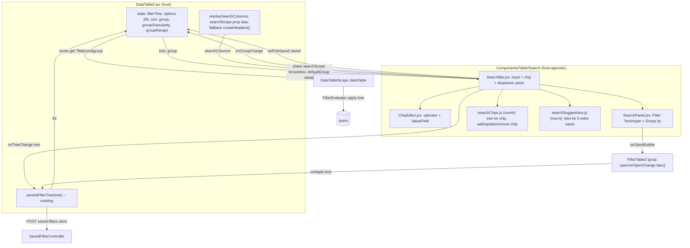

# Design Document: DataTable2 Advanced Search

## Overview

Search bar advance pada `DataTable2` — turunan dari fitur Filter (`FilterTable2`) yang dianggap sebagian user terlalu ribet. Terinspirasi Odoo (facet/chip + panel Filter/Group By) dan GitHub (autocomplete key saat mengetik). User mengetik di satu kotak untuk menjangkau semua fitur penyaringan: teks bebas, kondisi per kolom, nilai opsi, filter tersimpan (termasuk template shared), dan grouping. Kondisi aktif tampil sebagai chip yang bisa diedit langsung.

Saat ini `DataTable2` **tidak punya pencarian teks sama sekali** — toolbar hanya berisi Reload, Filter (dialog `FilterTable2`), Sort, dan Group by (`resources/js/Pages/Core/DataTable2.jsx:810-987`). State filter berupa nested tree yang di-persist sebagai row `SavedFilter` (ephemeral/named) lewat `persistFilterTree` → URL hanya membawa `?fid=` (`DataTable2.jsx:505`), dievaluasi backend oleh `FilterEvaluator` (`app/Models/Scopes/DataTableScope.php:485`).

**Keputusan brainstorming yang mengikat desain ini:**

1. **Model interaksi hybrid**: chip adalah state utama (gaya Odoo); mengetik memunculkan saran kolom (gaya GitHub) → pilih nilai → jadi chip. Tidak ada query string mentah yang di-parse dua arah.
2. **Satu sumber state: chip = filter tree** yang sama dengan `FilterTable2`. Tambah/edit/hapus chip = operasi pada tree → di-persist lewat jalur `persistFilterTree` yang sudah ada. Edit di builder → chip ikut berubah.
3. **Tombol Filter dan Group by pindah ke panel ▾** di ujung search bar; **Sort tetap di toolbar**, satu baris dengan search bar.
4. Saran kolom, opsi value, tipe kolom, operator dibaca dari `dataTableColumns` (configColumns) lewat `operators.js` / `ValueField` — **sama persis seperti `FilterTable2`** saat ini, bukan mekanisme baru.
5. **Teks bebas = grup OR `matches` di tree** (bukan param `?search=` baru). Kolom yang dicari: `searchScope` model (static property daftar kolom) → fallback kolom yang **tampil** + `searchable !== false` + tipe `string`.
6. **`searchScope` berbentuk daftar kolom** (Opsi A), bukan Eloquent scope — transparan ke user (tooltip + terlihat di builder), tanpa query logic baru di backend.
7. **Chip bisa diedit langsung** tanpa dihapus dulu (popover operator + `ValueField`).
8. **Komponen host-agnostic**: `SearchBar` tidak tahu Inertia/`fid`/router — transport tree diserahkan ke host via callback. DataTable2 host pertama; Advance Search Dialog LinkModel host kedua di **spec terpisah**.
9. **Penempatan**: baris sendiri di antara judul halaman dan kartu tabel (layout "B"), Sort satu baris bersama search bar. Tidak boleh mengganggu search global navbar.
10. Saran juga mencakup **filter tersimpan** dan **kolom groupable**; teks yang cocok ditandai `<mark>` via helper bersama `highlightMatch`.
11. Istilah "Favorit" **tidak dipakai** — memakai istilah yang sudah ada di UI: "Filter Tersimpan", badge "Shared", "Simpan sebagai baru", "Timpa".
12. **Saved filter menyimpan tree + sort + group** (snapshot tampilan utuh). Group disimpan di kolom JSON baru `saved_filters.group`.

**Batasan yang disengaja (bukan bug):**
- Teks bebas hanya `LIKE` pada kolom nyata — tidak bisa mencari nilai gabungan (CONCAT) atau angka terformat. Nilai terjemahan (mis. status "Selesai" vs `completed`) ditangani lewat **saran nilai** (§5.2), bukan pencarian fuzzy.
- Kolom `searchScope`/fallback **di-snapshot ke tree** saat chip "Cari" dibuat. Filter tersimpan tidak ikut berubah bila developer mengubah `searchScope` atau user menyembunyikan kolom belakangan.
- Setiap perubahan chip = 2 request berurutan (POST `saved-filters.store` → GET data), sama seperti perilaku Filter saat ini.

## Architecture



Alur utama:

```
ketik/pilih saran ──► searchChips.addChip(tree, …) ──► onTreeChange(tree) ──► persistFilterTree ──► fid ──► reload
tree dari host (fid di-fetch / builder / klik sel addFilter) ──► treeToChips(tree, columns) ──► render chip
```

## Components and Interfaces

### 1. File baru — `resources/js/Components/Table/Search/`

Folder `{Domain}/{Feature}` karena fitur butuh >1 file saling terkait (aturan CLAUDE.md).

| File | Tanggung jawab |
|---|---|
| `SearchBar.jsx` | Input + chip + dropdown saran (cmdk `Command` + `Popover`, keduanya sudah terpasang). Mengorkestrasi mode ketik (key/value), keyboard, busy state. |
| `ChipEditor.jsx` | Popover edit satu chip: label kolom (tetap), `Select` operator dari `getOperators()`, `ValueField` (dipakai ulang apa adanya — komponen murni props, `ValueField.jsx:41`). |
| `SearchPanel.jsx` | Panel ▾: kolom **Filter Tersimpan** (daftar + aksi simpan/timpa + Builder lanjutan + Hapus semua filter) dan kolom **Group by** (`SearchableOptionList` + granularity/range). Desktop = `Popover`; mobile = `Dialog`. |
| `searchChips.js` | **Fungsi murni**: `treeToChips`, `addLeafChip`, `addSearchChip`, `updateChip`, `removeChip`, `isSearchGroup`. |
| `searchSuggestions.js` | **Fungsi murni**: `buildSuggestions(text, ctx)` → daftar seksi saran. |
| `resolveSearchColumns.js` | **Fungsi murni**: `resolveSearchColumns({ searchScope, columns, visibleNames })`. |
| `*.test.js` / `*.rtl.test.jsx` | Co-located (lihat §9). |

### 2. Kontrak `SearchBar`

```jsx
<SearchBar
  columns={mapColumns}          // peta kolom hasil getColumns() — sumber tipe/opsi/operator/title
  tree={filterTree}             // controlled; null = tanpa filter
  onTreeChange={(tree) => …}    // transport milik host; BOLEH return Promise (busy state, §8)
  getSearchColumns={() => […]}  // dipanggil SAAT chip "Cari" dibuat (bukan state) — lihat §6.2
  model={model}                 // opsional → aktifkan saran & panel Filter Tersimpan
  activeFid={options.fid}       // opsional → deteksi badge sumber setelah reload (§5.5)
  onPickSaved={(saved) => …}    // opsional → host terapkan saved filter (tree + fid + sort + group)
  getViewSnapshot={() => ({ sort, group })} // opsional → dipakai "Simpan sebagai baru"/"Timpa"
  group={{ column, granularity, range }}    // opsional; tanpa groupOptions → seksi Group tak tampil
  groupOptions={groupOptions}
  onGroupChange={({ column, granularity, range }) => …}
  onOpenBuilder={() => …}       // buka FilterTable2
  placeholder={t("…", { name: title })}     // "Cari Sales Order…"
/>
```

`SearchBar` **tidak** mengimpor `router`, tidak membaca `usePage()`, dan tidak menulis `fid`. Satu-satunya I/O yang dilakukan sendiri: fetch `saved-filters.index` saat `model` diberikan — mengikuti preseden `FilterTable2` (`FilterTable2.jsx:192`), endpoint sama untuk kedua host.

### 3. Perubahan file existing (frontend)

| File | Perubahan |
|---|---|
| `resources/js/Pages/Core/DataTable2.jsx` | Toolbar desktop: hapus tombol `FilterTable2`, tombol `X` clear, Popover Group by, Select granularity/range. Tambah baris baru `[SearchBar ……… ▾] [Sort]` di antara header judul dan kartu tabel. Baris judul tinggal `[⟳] [+ Tambah]`. Mobile: baris sama full-width (Sort ikon saja); menu ⋯ tinggal Reload + Tampilkan per halaman (item Filter/Group/Sort dihapus dari menu). Tambah handler `onPickSaved`, `onGroupChange` (membungkus `setGroup`/`setGroupGranularity`/`setGroupRange` yang ada), `getSearchColumns`. `FilterTable2` dirender tanpa trigger, dikontrol `open`. |
| `resources/js/Components/Table/Filter/FilterTable2.jsx` | (a) Prop opsional `open`/`onOpenChange` (controlled); bila tidak diberikan tetap uncontrolled seperti sekarang — pemakai lama (`AdvanceSearchDialog` LinkModel dengan `trigger` custom) tidak berubah. Bila controlled tanpa `trigger`, trigger bawaan tidak dirender. (b) **Ekspor** `SaveFilterControl` (perilaku tidak berubah) + tambah prop opsional `getViewSnapshot` → payload PATCH menyertakan `sort` & `group`. (c) Ekstrak logika `isDirty` (`FilterTable2.jsx:217-240`) ke fungsi murni `isFilterTreeDirty(savedTree, currentTree)` di `resources/js/Components/Table/Filter/filterTreeCompare.js`, dipakai `FilterTable2` & `SearchBar`. |
| `resources/js/Pages/Core/FilterTemplate/Form.jsx` | Field Group by (+ granularity/range kondisional) di sebelah field Sort yang sudah ada. |
| `lang/id/core/datatable.php`, `lang/en/core/datatable.php`, `lang/*/core/filterTemplate.php` | Key i18n baru (§7). |

### 4. Perubahan backend

| File | Perubahan |
|---|---|
| `app/Traits/DataTable.php` | `public static function getSearchScope(): array` → `\property_exists(static::class, 'searchScope') ? static::$searchScope : []`. **Wajib pola `property_exists`** seperti `getDefaultGroupColumn()` (`DataTable.php:56-61`) — properti statis yang dideklarasi di trait lalu dideklarasi ulang di model dengan nilai berbeda = PHP fatal. Model: `protected static array $searchScope = ['code', 'customer.name'];` |
| `app/Models/Scopes/DataTableScope.php` | (1) Share prop `searchScope`: hasil `getSearchScope()` yang disanitasi — entri dibuang diam-diam bila tidak ter-resolve oleh `FilterColumnResolver::resolve()` (resolver yang sama dipakai `FilterTreeCleaner`, mendukung path relasi bertitik, `FilterColumnResolver.php:49`), `searchable === false`, atau tipe akhir bukan `string`. (2) Pindahkan resolusi `$appliedFilter` (`DataTableScope.php:347-356`) ke **sebelum** blok validasi group (`:295`). (3) Prioritas kolom grup: `$request->has('group')` (termasuk `group=` kosong = "Tidak ada") > `$appliedFilter->group['column']` > `getDefaultGroupColumn()`; granularity/range: query param > `$appliedFilter->group` > default. Kolom grup dari filter tetap wajib lolos gate `groupable` (salah → diabaikan diam-diam). (4) Prop `defaultGroup` yang di-share = group efektif tanpa param (filter aktif ?? model), plus `defaultGroupGranularity` / `defaultGroupRange`, agar state awal `options` di FE cocok dengan yang dieksekusi backend. |
| Migration baru `add_group_to_saved_filters_table` | `$table->json('group')->nullable()->after('sort');` — bentuk `{"column": string, "granularity": string\|null, "range": number\|null}`. |
| `app/Models/Core/SavedFilter.php` | Cast `'group' => 'array'`; configColumns `'group' => ['show' => false]` (pola sama dengan `sort`). |
| `app/Models/Scopes/DataTableScope.php` (tambahan) | Konstanta `public const GROUP_GRANULARITIES = ['day', 'month', 'quarter', 'half', 'year'];` — saat ini daftar hanya implisit di `match` `dateGroupExpression()` (`:114-133`), padanan FE `DATE_GROUP_GRANULARITIES` (`Table2.jsx:62`). `match` sendiri tidak diubah. |
| `app/Models/Core/SavedFilter.php` (tambahan) | `public static function groupValidationRules(): array` → `group` nullable array; `group.column` `required_with:group` string; `group.granularity` nullable `Rule::in(DataTableScope::GROUP_GRANULARITIES)`; `group.range` nullable numeric `gt:0`. Validasi **bentuk saja** — gate `groupable` tetap di runtime `DataTableScope` (salah → diabaikan diam-diam), karena FormRequest tidak punya konteks kolom model. Satu sumber aturan untuk 3 FormRequest di bawah. |
| `app/Http/Requests/Core/UpdateSavedFilterRequest.php` | Tambah `sort` (nullable string) + `SavedFilter::groupValidationRules()`. |
| `app/Http/Controllers/Core/SavedFilterController.php` | `update()`: simpan `sort` & `group` bila dikirim (`$request->has()`, pola sama dengan `filter`), response ikut mengembalikan `sort` & `group`. Tetap owner-only (`abort_if` 403, `:111`). `index()`: tambah `group` ke kolom yang dikembalikan. `store()` (jalur ephemeral) + `StoreSavedFilterRequest` **tidak diubah** — untuk filter ephemeral, sort/group hidup di URL. |
| `app/Http/Requests/Core/StoreFilterTemplateRequest.php`, `UpdateFilterTemplateRequest.php` | Tambah `SavedFilter::groupValidationRules()`. |
| `app/Http/Controllers/Core/FilterTemplateController.php` | `store()`/`update()` menyimpan `group` (pola sama dengan `sort`, `:55` & `:84-86`). |

## Data Models

### Filter tree (existing, tidak berubah)

```js
{ root: { k: "and" | "or", c: { [id]: Node } } }
// Node = group { k: "and"|"or", c: {...} } | leaf { k: "<kolom atau rel.kolom>", o: "<operator>", v: <value> }
```

Catatan dari kode existing yang memengaruhi desain:
- `FilterTreeCleaner::cleanGroup()` membangun ulang grup hanya sebagai `['k','c']` dan meng-collapse grup ber-anak tunggal (`FilterTreeCleaner.php:89`). **Penanda custom di grup tidak bertahan** setelah tree di-fetch ulang → chip "Cari" dikenali lewat **pola**, bukan penanda (§5.1).
- Value relasi (`linkmodel`) disimpan sebagai **objek record penuh**; backend mengekstrak `.id` (`ValueField.jsx:194`).

### Chip (turunan, tidak di-persist)

```js
{
  id: string,                 // id node di tree (untuk leaf/grup) atau "__group" / "__source"
  kind: "leaf" | "search" | "advanced" | "group" | "source",
  label: string,              // teks tampil, mis. "Status: Draft, Submitted"
  node?: object,              // referensi node tree (leaf/search/advanced)
  columns?: string[],         // kind "search": kolom yang dicari (tooltip)
  count?: number,             // kind "advanced": jumlah leaf
  dirty?: boolean,            // kind "source"
}
```

### Suggestion (turunan)

```js
{ section: "text" | "saved" | "column" | "value" | "group",
  key: string, label: string, match: string /* teks utk highlightMatch */, payload: object }
```

### `saved_filters.group` (baru)

```json
{ "column": "created_at", "granularity": "month", "range": null }
```

`null` = saved filter tidak mengatur group → **jangan override** group aktif saat diterapkan (preseden sama dengan `sort`, `FilterTable2.jsx:284-289`).

## 5. Perilaku Detail

### 5.1 Tree → chip (`treeToChips`)

| Node | Chip |
|---|---|
| Leaf anak langsung root AND | `leaf`: `Status: Draft`, `Total > 1.000.000`, `Nama mengandung laptop`, `Tanggal: Bulan ini`. Operator `=`/`in` ditulis `Kolom: nilai`; operator lain memakai label operator i18n yang sudah ada (`core.datatable.filter.operator.*`). |
| Grup OR anak langsung root yang **semua** anaknya leaf `o: "matches"` dengan `v` identik (≥2 anak) | `search`: `Cari: PT A`, tooltip daftar kolom. |
| Grup lain anak langsung root | `advanced`: `Filter lanjutan (n)`, n = jumlah leaf; klik → `onOpenBuilder`. |
| Root `k: "or"` dengan >1 anak | Seluruh tree = 1 chip `advanced`. |
| `group.column` terisi (bukan dari tree) | `group`: `≡ Tanggal › Bulan` / `≡ Total › 1.000`. |
| Saved filter sumber terdeteksi (§5.5) | `source`: `★ PO Bulan Ini` (+ titik kuning bila dirty) — dirender paling depan. |

Label nilai: opsi → label opsi / `parseTrans`; boolean → label parse; relasi → `convertTemplateLink(record, "")` (`resources/js/lib/linkModelUtils.js:31`) dengan fallback `record.name ?? record.code ?? record.id`; array → digabung `, `; `in_period` → label periode dari `DateSelector`. Kolom tak ter-resolve di `columns` → pakai key mentah (mis. kolom relasi yang belum di-expand).

Chip "Cari" dengan 1 kolom saja akan di-collapse cleaner jadi leaf `matches` → tampil sebagai chip `leaf` `Kode mengandung PT A`. Ini perilaku yang benar dan bisa ditebak, bukan bug.

### 5.2 Saran saat mengetik (`buildSuggestions`)

Urutan seksi dan batas:

| # | Seksi | Sumber | Batas | Saat dipilih |
|---|---|---|---|---|
| 1 | Teks bebas `Cari "x" di semua kolom` | `getSearchColumns()` tidak kosong | 1 | `addSearchChip` |
| 2 | Filter Tersimpan | `saved-filters.index` (named milik user + shared), cocok `name` | 3 | `onPickSaved` |
| 3 | Kolom | kolom `searchable !== false`, bukan hidden/ignore/meta, cocok `title` | 5 | masuk mode value |
| 4 | Nilai | label `options`/`parseTrans` dari kolom ber-opsi, cocok label | 5 | `addLeafChip` langsung (`=`/merge `in`) |
| 5 | Kelompokkan | `groupOptions`, cocok label | 3 | `onGroupChange` dgn granularity/range default |

- Pencocokan: case-insensitive, **per kata** (selaras dengan `highlightMatch` yang memecah `split(/\s+/)`).
- Seksi kosong tidak dirender. Seksi 2 hanya bila `model`; seksi 5 hanya bila `groupOptions`.
- Item default yang di-highlight saat dropdown terbuka = item pertama yang tampil (seksi 1 bila ada). cmdk dikontrol via `value`/`onValueChange` sendiri — auto-highlight bawaan cmdk hanya jalan sekali saat mount (gotcha yang sama sudah ditangani di `Select.jsx:139-154` & `MultiSelect.jsx`).
- **Highlight**: semua label dirender lewat `highlightMatch(label, text)` (`resources/js/lib/highlightMatch.jsx`) — bukan `highlightItem` lokal `Select.jsx` yang memakai `dangerouslySetInnerHTML`. Wajib karena nama saved filter shared adalah input user lain (risiko XSS).
- Label nilai dengan prefix kolom (`Status: Selesai`) hanya me-mark bagian yang cocok.

### 5.3 Mode value (setelah memilih kolom)

Input menampilkan prefix pill `[Status:]`. Operator default diambil dari `getOperators(type, { typeRelation, hasOptions })`:

| Tipe kolom | Perilaku |
|---|---|
| Punya opsi terbatas (`columnHasOptions` / enum / formStatus) atau `boolean` | Daftar nilai inline, bisa difilter dengan mengetik; pilih → chip `=` (merge ke `in` bila perlu). |
| `string` tanpa opsi | Ketik + Enter → leaf `matches`. |
| `number` / `currency` | Ketik + Enter → leaf `=` (input non-numerik ditolak inline, tidak commit). |
| `date`/`datetime`/`time`/`relation`/`relations`/lainnya | Langsung membuka `ChipEditor` dengan kolom terpilih + operator default. |

`Esc` atau `Backspace` pada input kosong di mode value → kembali ke mode key.

### 5.4 Aturan penggabungan

- Menambah leaf pada kolom yang sudah punya leaf `=`/`in` anak langsung root → **digabung** jadi satu leaf `in` (dedup nilai; relasi dibandingkan via `.id`). Mencegah AND `Status = Draft AND Status = Submitted` yang pasti kosong.
- Operator lain → leaf AND terpisah.
- Chip `Cari:` kedua → grup OR terpisah (AND antar-pencarian; kedua frasa wajib ada).
- Teks multi-kata `PT Abadi` → satu frasa `matches "PT Abadi"` (tidak dipecah per kata).

### 5.5 Badge sumber saved filter

- Set saat user memilih saved filter (saran seksi 2 atau panel) → state `sourceSaved = { id, name, filter }` di `SearchBar`.
- Setelah reload dengan `?fid=`: bila `activeFid` ada di daftar `saved-filters.index` sebagai named/shared → `sourceSaved` di-set dari sana. **Nama diambil dari `index`, bukan `show`** — `show()` sengaja menyembunyikan `name` dari non-owner (mitigasi IDOR, `SavedFilterController.php:40-49`), sedangkan `index` mengembalikan nama shared ke semua user. Karena itu, bila `activeFid` ada, daftar di-fetch saat mount (bukan menunggu fokus).
- `dirty = isFilterTreeDirty(sourceSaved.filter, tree) || (sourceSaved.sort != null && sourceSaved.sort !== sort) || (sourceSaved.group != null && !sameGroup(sourceSaved.group, group))` → titik kuning + tooltip `core.datatable.filter.saved.dirty` (key existing). `sort`/`group` aktif dibaca dari `getViewSnapshot()`; `null` di sumber = tidak mengatur, jadi tidak pernah membuat dirty.
- `×` pada badge → `onTreeChange(null)` (hapus semua chip dari filter itu) + `sourceSaved = null`.
- Memilih saved filter lain / tree dikosongkan → `sourceSaved` diganti / di-null.

### 5.6 Edit chip (`ChipEditor`)

| Chip | Klik badan chip → |
|---|---|
| `leaf` | Popover: label kolom, `Select` operator, `ValueField`, tombol Terapkan (Enter juga menerapkan) → `updateChip`. |
| `search` | Popover: input teks + info "Mencari di: …" → mengganti `v` semua anak grup. |
| `group` | Popover: `SearchableOptionList` kolom grup + granularity/range. |
| `advanced` | `onOpenBuilder()`. |
| `source` | Membuka panel ▾ (kolom Filter Tersimpan). |

Klik `×` pada chip → `removeChip` (untuk `group` → `onGroupChange({ column: null })`).

### 5.7 Keyboard

- `↑`/`↓` navigasi saran, `Enter` pilih item yang di-highlight, `Esc` keluar mode value / tutup dropdown.
- `Backspace` pada input kosong (mode key): tekan pertama **menyorot** chip terakhir, tekan kedua menghapusnya — mencegah reload tak sengaja. Tombol lain menghilangkan sorotan.
- **Tidak ada** shortcut global yang didaftarkan. `/` dan `Ctrl/⌘+K` milik `GlobalCommandPalette` (`resources/js/Layouts/GlobalCommandPalette.jsx:307`); handler-nya sudah diam saat fokus di input, jadi mengetik `/` di search bar aman.

### 5.8 Panel ▾ (`SearchPanel`)

```
┌─────────────────────────────┬──────────────────────┐
│ Filter Tersimpan            │ Group by             │
│ ✓ PO Bulan Ini     [Shared] │  Cari kolom…         │
│   Draft saya            🗑  │  ○ Tidak ada         │
│ ─────────────────────────── │  ● Customer          │
│ Simpan sebagai baru         │  ○ Tanggal           │
│ Timpa "PO Bulan Ini"        │     ↳ Bulan ▾        │
│ ─────────────────────────── │                      │
│ Builder lanjutan            │                      │
│ Hapus semua filter          │                      │
└─────────────────────────────┴──────────────────────┘
```

- Tombol hapus hanya untuk saved filter milik sendiri (bukan `is_shared`) — sama seperti `SavedFilterBar` (`FilterTable2.jsx:474-486`) agar tidak memicu 403.
- "Simpan sebagai baru" / "Timpa" = `SaveFilterControl` yang diekspor; "Timpa" hanya muncul bila `sourceSaved` ada, dirty (definisi §5.5, sudah mencakup sort/group), dan bukan `is_shared` — template shared dikelola lewat halaman Filter Templates; PATCH ke shared milik orang lain akan 403.
- Payload simpan menyertakan `sort` & `group` dari `getViewSnapshot()`.
- Kolom Group by hanya dirender bila `groupOptions` diberikan & tidak kosong.
- Mobile: `Dialog` dengan kedua seksi bertumpuk (preseden `DataTable2` memakai `Dialog` untuk Sort/Group di mobile; `Drawer`/`Sheet` ada di `ui/` tapi belum dipakai di halaman mana pun).

## 6. Host DataTable2

### 6.1 Toolbar

```
Sales Order                                          [⟳] [+ Tambah]
[⏷ [★ PO Bulan Ini •][Status: Draft ×][Cari: PT A ×] Cari Sales Order…  ▾] [↕ Dibuat]
┌──────────────────────────── tabel ─────────────────────────────┐
```

Mobile: baris kedua full-width, chip membungkus ke baris baru bila tidak muat, Sort ikon saja.

### 6.2 `getSearchColumns()`

```js
() => resolveSearchColumns({
  searchScope,                                   // prop Inertia (sudah disanitasi backend)
  columns: mapColumns,
  visibleNames: createHeaders({ ...mapColumns })           // Table2.jsx:134, baca cookie visibility
    .filter((h) => h.show).map((h) => h.name),
})
```

**Wajib salinan dangkal `{ ...mapColumns }`**: `createHeaders` memutasi argumennya (`headers[col.name] = {...}`, `Table2.jsx:149`) dan mengharapkan objek map berkunci nama. Memberi `mapColumns` langsung memutasi hasil `useMemo`; memberi array (`Object.values`) menghasilkan entri ganda (indeks numerik + kunci nama).

`resolveSearchColumns`: `searchScope` tidak kosong → pakai apa adanya; kosong → `visibleNames` ∩ kolom `searchable !== false` ∩ `type === "string"` (top-level). Dipanggil **saat Enter**, bukan disimpan sebagai state — cookie visibility bisa berubah di `Table2` tanpa me-render ulang `DataTable2`.

### 6.3 Handler

- `onTreeChange(tree)` → `persistFilterTree(tree)` (existing; tree kosong → `fid` null).
- `onPickSaved(saved)` → `setFilterTree(saved.filter)`; `setOptions(prev => ({ ...prev, fid: saved.id, sort: saved.sort ?? prev.sort, group/groupGranularity/groupRange: dari saved.group bila tidak null, page: 1 }))`. Tanpa POST (setara `useExisting`, `DataTable2.jsx:550-560`).
- `onGroupChange({ column, granularity, range })` → `setGroup(column)` lalu override granularity/range bila diberikan.
- `getViewSnapshot()` → `{ sort: options.sort, group: options.group ? { column, granularity, range } : null }`.
- `useImperativeHandle.addFilter` (klik sel) tidak diubah — hasilnya otomatis tampil sebagai chip karena chip = tree.
- State awal `options.group/groupGranularity/groupRange` memakai `defaultGroup`/`defaultGroupGranularity`/`defaultGroupRange` dari backend (§4 poin 4).

## 7. i18n (key baru)

`core.datatable.search.*`: `placeholder` (":name"), `search_all` ("Cari \":text\" di semua kolom"), `searching_in` ("Mencari di: :columns"), `section.saved`, `section.column`, `section.value`, `section.group`, `group_by_label` ("Kelompokkan: :column"), `advanced_chip` ("Filter lanjutan (:count)"), `advanced_builder` ("Builder lanjutan"), `clear_all` ("Hapus semua filter"), `apply` ("Terapkan"), `number_invalid`. `core.filterTemplate.form.group.*`. Istilah existing dipakai ulang: `core.datatable.filter.saved.*`, `core.datatable.group_by`, `core.datatable.no_grouping`, `core.datatable.granularity.*`, `core.datatable.group_range`.

## 8. Error Handling

| Kondisi | Penanganan |
|---|---|
| Persist gagal (422 tree kosong / 500) | `persistFilterTree` sudah toast + throw. Chip turunan dari prop `tree` yang hanya berubah bila host sukses → chip **otomatis kembali** tanpa rollback manual. Teks ketikan hanya dikosongkan saat sukses. |
| Commit beruntun saat persist berjalan | `onTreeChange` return Promise → `SearchBar` tampil spinner & menolak commit baru sampai selesai (cegah race POST yang saling menimpa `fid`; pola sama dengan freeze `busy` di `FilterTable2`). |
| Fetch `saved-filters.index` gagal | Seksi/panel Filter Tersimpan kosong; tidak memblokir fitur lain (sama dengan `FilterTable2.jsx:198`). |
| Semua entri `searchScope` tidak valid | Backend membuangnya → prop kosong → fallback kolom tampil. |
| Fallback juga kosong (tak ada kolom string tampil) | Seksi teks bebas tidak ditampilkan; Enter tanpa item terpilih = no-op. |
| Kolom group dari saved filter tidak groupable lagi | Backend abaikan diam-diam (gate `groupable` existing). |
| Input angka tidak valid di mode value `number` | Pesan inline `core.datatable.search.number_invalid`, tidak commit. |

## 9. Testing Strategy

Mengikuti `docs/frontend.md#testing` dan CLAUDE.md (prioritas unit test fungsi murni → RTL → hindari source-assertion).

**Unit (`.test.js`, environment node):**
- `searchChips.test.js` — semua baris tabel §5.1 (termasuk collapse 1 kolom, root OR, grup campuran), `addLeafChip` merge `=`→`in` + dedup relasi by id, `addSearchChip`, `updateChip`, `removeChip`, `isSearchGroup` (anak <2 / operator beda / `v` beda → false).
- `searchSuggestions.test.js` — urutan 5 seksi, batas per seksi, pencocokan per kata case-insensitive, seksi hilang tanpa `model`/`groupOptions`/`searchColumns`, kolom `searchable:false`/hidden/ignore/meta tidak muncul.
- `resolveSearchColumns.test.js` — scope menang; fallback = tampil ∩ searchable ∩ string.
- `filterTreeCompare.test.js` — `isFilterTreeDirty` urutan-independen, item belum lengkap ikut dihitung (perilaku existing dipertahankan).
- Property-based (`fast-check`, opsional): `removeChip(addLeafChip(tree, x))` ekuivalen dengan `tree` untuk leaf pada kolom baru. Precondition generator harus selaras persis dengan validasi source (aturan CLAUDE.md).

**RTL (`.rtl.test.jsx`, environment jsdom):**
- `SearchBar.rtl.test.jsx` — ketik + Enter → `onTreeChange` dipanggil dengan grup OR; pilih kolom → mode value → Enter; pilih saran nilai → merge `in`; Backspace dua kali menghapus chip terakhir; klik chip → `ChipEditor`; pilih saved filter → `onPickSaved`; badge sumber + dirty; spinner & commit ditolak saat Promise pending; mengetik `/` tidak di-`preventDefault`; label ter-`<mark>`.
- `SearchPanel.rtl.test.jsx` — daftar saved (hapus hanya non-shared), Builder lanjutan, Hapus semua, Group by + granularity.
- `ChipEditor.rtl.test.jsx` — operator berubah → `ValueField` menyesuaikan; Terapkan.
- `FilterTable2.rtl.test.jsx` — tambah kasus controlled `open`; kasus lama tetap hijau.
- `DataTable2.rtl.test.jsx` — sesuaikan test toolbar (Filter/Group pindah), tambah integrasi `onPickSaved` menerapkan sort + group.
- Gotcha yang sudah diketahui: jangan `vi.useFakeTimers()` dengan Radix Popover/cmdk (macet); pakai `waitFor` dari `@testing-library/react`.

**PHPUnit (feature):**
- `SavedFilterTest` — `update()` dengan `sort`/`group` valid & invalid (granularity asing, range ≤0, group tanpa column); `index()` mengembalikan `group`.
- `FilterTemplateControllerTest` — store/update `group`.
- `DataTableScopeGroupingTest` — group diambil dari `?fid=` saved filter; dari default shared filter tanpa fid; `?group=` kosong tetap menang atas group filter; group filter tak groupable diabaikan; granularity/range fallback dari filter.
- Test baru `DataTableScopeSearchScopeTest` — `searchScope` tersanitasi (kolom tak ada / searchable false / non-string / path relasi valid tetap), model tanpa `$searchScope` → `[]`.

**Visual:** verifikasi di browser memakai `npm run build` (bukan dev server) dan `php artisan migrate` di DB lokal terlebih dahulu (migration baru).

## 10. Out of Scope

- Adopsi `SearchBar` di Advance Search Dialog LinkModel — **spec terpisah** (UX live-as-you-type vs chip-on-Enter perlu diputuskan tersendiri). Kontrak §2 sengaja tidak menghalangi: host LinkModel cukup mengoper kolom templateLink sebagai `getSearchColumns` dan `setAdditiveFilters` sebagai `onTreeChange`.
- `searchScope` berbentuk Eloquent scope (CONCAT/fulltext) — bisa ditambahkan per model di spec lanjutan bila ada kebutuhan nyata; tampilan chip tetap sama.
- Shortcut keyboard khusus untuk fokus ke search bar.
- Multi-level grouping.

## 11. Revisi 3 — Staged-apply, sintaks ketik `kolom:operator?value`, bobot saran

Dipicu 2 putaran feedback verifikasi visual: (a) chevron tak beri sinyal terbuka/tertutup, tak ada tombol eksplisit untuk "jalankan pencarian", tiap pick chip langsung refetch tabel (Odoo-style instant-apply) padahal user ingin gaya GitHub yang lebih staged; (b) saran gabungan (Cari/Tersimpan/Kolom/Group) belum punya bobot relevansi, dan pemilihan kolom masih murni klik — tak ada jalur ketik cepat `kolom:nilai` ala GitHub.

**Keputusan mengikat revisi ini** (brainstorming 2026-09-24):
1. **Model staged-apply menggantikan instant-apply** untuk SEMUA aksi kecuali chip "Cari … di semua kolom" (teks bebas tetap instant, sesuai §5.2 seksi 1 — tidak berubah).
2. Trigger apply: **Enter di input selagi panel/dropdown tertutup**, **klik tombol Search baru**, atau **klik-luar** (`ClickAwayListener` yang sudah ada, diperluas memanggil apply juga — sudah terbukti tidak salah-trigger ke elemen internal/portal Radix, lihat §6.4).
3. **Sintaks ketik** `kolom:operator?value` — `:` menekan kolom yang lagi ke-highlight keyboard di saran "Kolom" (pola sama Tab-autocomplete `LinkModel.jsx`/`Select.jsx`), bukan parser fuzzy baru.
4. **Bobot saran**: prefix/awalan-kata menang atas substring biasa; kolom yang baru dipakai (per model, disimpan lokal) dapat boost peringkat. Section TIDAK berurutan tetap — ikut mengikuti skor tertinggi item di dalamnya.
5. **Chevron rotasi 180°** saat panel terbuka (murni CSS, tak ada keputusan lain).

### 11.1 State baru (`SearchBar`)

| State | Asal/Sync | Kegunaan |
|---|---|---|
| `draftTree` | `useState(tree)`, resync via `useEffect` tiap `tree` prop berubah | Chip di bar dirender dari SINI, bukan `tree` langsung lagi. |
| `draftGroup` | `useState(group)`, resync via `useEffect` tiap `group` prop berubah | Chip `group` dirender dari sini. |
| `pendingSaved` | `useState(null)` | Saved filter yang DIPILIH tapi belum di-apply — `{id, name, filter, sort, group, is_shared}` (snapshot item saved filter). |
| `lastUsedColumns` | `localStorage` key `searchbar.recent.<model>` (array nama kolom, terbaru di depan, cap 8) | Boost ranking §11.4; tanpa `model` fitur ini nonaktif (list selalu kosong). |

`draftTree`/`draftGroup` HANYA diubah oleh aksi user di dalam `SearchBar` (`setDraftTree`, `setDraftGroup` — pengganti pemanggilan `commitTree`/`onGroupChange` langsung yang lama). `pendingSaved` diisi saat user pilih saved filter (saran/Panel), dikosongkan setelah apply.

### 11.2 `applyDraft()` — satu-satunya jalur menuju host

```js
function applyDraft() {
  if (pendingSaved) {
    onPickSaved?.(pendingSaved);      // host: fid + sort + group + tree, existing §6.3, TIDAK berubah
    setPendingSaved(null);
    return;                            // draftTree/draftGroup resync otomatis dari prop tree/group baru
  }
  const treeChanged = isFilterTreeDirty(tree, draftTree); // pakai helper existing, true = tree BEDA
  const groupChanged = !sameGroup(group, draftGroup);
  if (!treeChanged && !groupChanged) return; // tak ada yg berubah -> no-op, tak ada round-trip kosong
  if (treeChanged) commitToHost(draftTree);  // -> onTreeChange, busy-state spinner spt §8 (tak berubah)
  if (groupChanged) onGroupChange?.(draftGroup);
}
```

`isFilterTreeDirty`/`sameGroup` = helper YANG SUDAH ADA (`filterTreeCompare.js`, `ChipEditor.jsx`), dipakai ulang apa adanya — bukan logic pembanding baru.

**Perubahan perilaku dari §8 (Error Handling) yang perlu disadari eksplisit**: sebelumnya chip "otomatis kembali" saat `onTreeChange` reject karena chip diturunkan dari prop `tree`. Sekarang chip diturunkan dari `draftTree` yang TIDAK ikut ter-revert saat apply gagal — draft milik user tetap utuh, bisa dicoba Terapkan lagi (dianggap perbaikan UX, bukan regresi: kegagalan network seharusnya tidak membuang ketikan/pick user). Toast error dari `persistFilterTree` tetap tampil seperti biasa.

### 11.3 Indikator "belum diterapkan" & Search button

Tombol Search baru (ikon kaca pembesar) diletakkan di ujung bar, sebelah tombol chevron. Dapat titik aksen (pola sama dgn titik dirty saved-filter §5.5, warna `bg-amber-500`) saat:

```js
const isDraftDirty =
  Boolean(pendingSaved) ||
  isFilterTreeDirty(tree, draftTree) ||
  !sameGroup(group, draftGroup);
```

Klik tombol Search = `applyDraft()`. Disabled + `LoadingIcon` selagi apply pending (busy state, sama pola dgn §8).

### 11.4 Trigger apply — 3 jalur

| Jalur | Kondisi | Implementasi |
|---|---|---|
| Enter di input | `!open` (dropdown/panel benar2 tertutup — saat `open`, Enter tetap dipakai cmdk/mode-value spt sekarang, TIDAK berubah) | Cabang baru PALING AWAL di `handleInputKeyDown`. |
| Tombol Search | Selalu aktif (disabled saat busy) | `onClick={applyDraft}`. |
| Klik-luar | `ClickAwayListener onClickAway` yang SUDAH ADA | `onClickAway={() => { closeDropdown(); applyDraft(); }}` — dipakai ulang, TIDAK bikin listener baru. Sudah terverifikasi test existing ("klik-luar menutup dropdown") bahwa klik ke elemen internal/portal Radix (Panel, ChipEditor, saran) TIDAK dianggap "di luar" — jalur ini aman dipakai ulang tanpa risiko auto-apply saat klik tombol Builder lanjutan/chevron/dsb (kekhawatiran user eksplisit). Regression test baru WAJIB membuktikan ini (§11.7). |

### 11.5 Sintaks ketik `kolom:operator?value`

`:` di keyboard, mode "key", ada item ter-highlight di seksi saran "Kolom" → **preventDefault**, panggil `pickColumn(highlighted.payload.column)` (fungsi YANG SUDAH ADA, sama persis dgn klik saran) — karakter `:` sendiri TIDAK pernah masuk ke `inputValue`. Kalau item ter-highlight BUKAN dari seksi Kolom (mis. lagi nyorot "Cari …"), `:` diketik apa adanya (tak ada aksi khusus).

Di mode value (setelah masuk lewat cara apa pun — klik ATAU `:`), `commitValueModeFreeText`/`buildLeafFromText` (`columnSearch.js`) dapat cabang parsing simbol AWAL teks, hanya utk kolom `text`/`number`/`relation` (list/boolean/date tetap klik-saja, TIDAK berubah):

| Awalan | Operator | Berlaku | Contoh ketik | Leaf |
|---|---|---|---|---|
| *(tanpa awalan)* | `matches` (text/relation) / `=` (number) | semua | `kategori:elektronik` | `{k, o:"matches", v:"elektronik"}` |
| `!` | `!matches` / `!=` | semua | `kategori:!elektronik` | `{k, o:"!matches", v:"elektronik"}` |
| `>` `>=` `<` `<=` | perbandingan | number saja | `total:>500000` | `{k:"total", o:">", v:500000}` |
| `a,b,c` (koma, tanpa awalan lain) | `in` | semua | `status:draft,submitted` | `{k, o:"in", v:["draft","submitted"]}` |

Kombinasi tak valid (mis. `>` pada kolom text, koma dicampur `!`) → diperlakukan sbg bagian dari VALUE literal (fallback aman ke default operator), bukan error blocking — konsisten dgn filosofi "tanpa dialog operator" revisi 2.

### 11.6 Bobot saran (`searchSuggestions.js`)

`scoreItem(label, text, { recent, columnName })`:
1. Prefix (case-insensitive) pada AWAL label atau AWAL salah satu kata dalam label → skor tertinggi.
2. Substring di tengah kata → skor sedang (perilaku lama, dipertahankan sbg lantai skor).
3. `columnName` ada di `lastUsedColumns` (hanya seksi Kolom) → tambahan skor tetap (boost), diposisikan DI BAWAH match prefix murni tapi DI ATAS match substring biasa yg tak pernah dipakai.

Item dalam tiap section diurutkan skor turun (stabil, `Array.prototype.sort` modern stabil di semua browser target). SECTION diurutkan ulang berdasar skor item TERTINGGI di dalamnya (bukan urutan tetap seksi 1-5 lama) — section kosong tetap tak dirender.

`pickColumn`/`selectSuggestion` seksi "column" menambahkan nama kolom ke `lastUsedColumns` (unshift + dedup + cap 8) SETIAP kali dipilih (klik maupun `:`).

### 11.7 Testing tambahan

- `searchSuggestions.test.js` — prefix > substring, boost `lastUsedColumns`, reorder section by top score.
- `columnSearch.test.js` — `buildLeafFromText` cabang simbol (`!`, `>`/`>=`/`<`/`<=` khusus number, koma → `in`), kombinasi tak valid fallback ke value literal.
- `SearchBar.rtl.test.jsx`:
  - Enter selagi `!open` → `applyDraft` (bukan langsung `onTreeChange` per pick).
  - Pick kolom lalu isi value lalu Enter TIDAK memanggil `onTreeChange` sampai Enter-di-panel-tertutup/tombol-Search/klik-luar dipanggil terpisah.
  - Klik tombol Search → `onTreeChange`/`onGroupChange` dgn draft terakumulasi.
  - **Regresi eksplisit** (permintaan user): klik tombol chevron, tombol Builder lanjutan, item di Panel/saran — TIDAK memicu `onClickAway`/`applyDraft` sama sekali (assert `onTreeChange` tidak terpanggil sampai trigger eksplisit).
  - Klik-luar SUNGGUHAN (klik `document.body`) DENGAN draft pending → `applyDraft` terpanggil.
  - Ketik nama kolom exact + `:` → masuk mode value tanpa `:` masuk `inputValue`; `:` saat highlight BUKAN kolom → `:` masuk apa adanya.
  - `onTreeChange` reject → draft TIDAK ter-revert (beda dari perilaku lama, §11.2).
  - Titik indikator Search button muncul/hilang sesuai `isDraftDirty`.
  - "Cari … di semua kolom" tetap instant-apply (tak perlu Enter-di-panel-tertutup/tombol Search) — regresi test lama dipertahankan.

## 12. Chevron (visual, tak butuh keputusan lain)

`ChevronDown` (lucide) dapat `className="transition-transform data-[state=open]:rotate-180"` (pola Tailwind data-attribute Radix yang sudah dipakai komponen lain di codebase, mis. `PopoverTrigger`/`AccordionTrigger`) — cukup CSS, tak ada state/logic baru.

## 13. Revisi 4 — Live-suggestion record untuk kolom relation

Dipicu 2 laporan verifikasi visual: (a) kolom bertipe `relation` (mis. Kategori) tidak punya saran nilai sama sekali — user harus ketik teks bebas tanpa umpan balik, beda jauh dari pengalaman `LinkModel` di Builder lanjutan yang live-search record dari server; (b) fokus tidak kembali ke input setelah pilih kolom string biasa (baik dari saran maupun Panel), dan placeholder tidak mencerminkan kolom yang sedang menunggu nilai.

**Keputusan mengikat revisi ini** (brainstorming 2026-09-24):
1. Kolom relation dapat live-suggestion record, fetch ke endpoint `route("model")` yang SAMA dipakai `LinkModel`/`ValueField.jsx` (`valueInput: "linkmodel"`) — reuse penuh hook `useLinkModelOptions` (`Hooks/useLinkModelOptions.js`), TANPA fetch/debounce baru.
2. Leaf yang terbentuk saat user pilih record: `{k: column.name, o: "=", v: record}` — persis pola Builder lanjutan/`ValueField.jsx` (record object utuh, bukan cuma id). BUKAN lagi `{k: "kolom.label_anak", o:"matches", v:teks}` seperti sekarang.
3. **Wajib pilih dari daftar** — tidak ada fallback "ketik lalu Enter tanpa pilih". Selama dropdown suggestion terbuka, Enter mengikuti perilaku cmdk biasa (pilih item ter-highlight), sama seperti mode `list`/`date` yang sudah ada — bukan jalur manual `commitValueModeFreeText` seperti sekarang.
4. Fetch kolom anak (`ensureRelationHydrated`, `model.columns`) untuk kolom relation **dihapus** — tidak diperlukan lagi karena tidak ada lagi pembentukan leaf `matches` untuk chip BARU (leaf `matches` lama tetap didukung untuk EDIT chip existing, lihat §13.2).
5. Fokus otomatis kembali ke `<input>` begitu mode value siap dipakai (kolom apa pun, bukan cuma relation) — root cause: `enterValueMode` tidak pernah memanggil `.focus()`, dan tombol `ColumnList` (`SearchPanel.jsx`) native `<button>` tanpa `onMouseDown preventDefault` (beda dari `CommandItem` saran yang sudah dilindungi `CommandList`'s `onMouseDown`) mengambil alih fokus browser.
6. Placeholder input berubah mengikuti kolom yang sedang menunggu nilai (`core.datatable.search.value_placeholder`, key baru) — selain prefix `[Kolom:]` yang sudah ada, sebagai penegasan visual tambahan.

### 13.1 Fokus & placeholder (semua kolom, bukan cuma relation)

```js
useEffect(() => {
  if (mode !== "value") return;
  if (loadingRelation && loadingRelation === valueColumn?.name) return;
  inputRef.current?.focus();
}, [mode, valueColumn, loadingRelation]);
```

Placeholder: `mode === "value" && valueColumn` → `t("core.datatable.search.value_placeholder", { name: valueColumnTitle })`, kalah prioritas dari placeholder loading-relation yang sudah ada. **Catatan implementasi**: sudah diterapkan lebih dulu sebagai bug fix bounded (di luar proses brainstorming ini, karena scope-nya kecil dan tidak arsitektural) — bagian ini didokumentasikan di sini untuk kelengkapan spec, bukan pekerjaan baru task 24 (lihat tasks.md).

### 13.2 Kontrak leaf & `openEditorForChip`

`searchChips.js`/`columnSearch.js` **tidak berubah** — `formatSingleValue` (`searchChips.js`) sudah menangani leaf relation bare `{k, o:"=", v:record}` via `convertTemplateLink(value, "")` (label chip "Kategori: VT Elektronik" otomatis benar), dan `mergeValues`/`valueDedupeKey` sudah general untuk object ber-`.id` (pilih record kedua pada kolom yang sama → merge jadi `in`, dedup by id). `buildLeafFromText`'s cabang relation TETAP DIPAKAI (bukan dead code) — untuk jalur backward-compat di bawah.

`openEditorForChip` (`SearchBar.jsx`) dapat **satu cabang baru di awal**:

```js
if (column?.type === "relation") {
  enterValueMode(column, { editId: chip.id }); // search kosong, user pilih ulang dari 0 — TIDAK prefill teks
  return;
}
```

Leaf lama gaya `matches` pada kolom anak (dari saved filter yang dibuat sebelum revisi ini, atau leaf dotted hasil Builder lanjutan manual) TETAP didukung lewat jalur fallback yang SUDAH ADA (`SearchBar.jsx` — kolom anak relasi dotted yang belum ter-hydrate → `enterValueMode` teks biasa) — backward-compatible, tanpa migrasi data.

### 13.3 UI & pembersihan dead code

- Var baru `showRelationResults = mode === "value" && vmode === "relation"`; `dropdownVisible` ikut menyertakan var ini.
- Begitu kolom relation dipilih, dropdown langsung fetch opsi awal (`useLinkModelOptions({ model: column.related, search: inputValue, open: showRelationResults, limit: 8 })`) — user bisa langsung pilih tanpa ketik, atau ketik untuk narrow (debounce 500ms sudah bawaan hook).
- Loading: `LoadingIcon` kecil di dalam `CommandList` (bukan lagi disable+placeholder input) — input **tidak** disabled lagi saat fetch relation, mengetik saat loading adalah alur normal (memicu pencarian baru).
- Empty state: reuse `CommandEmpty` (`t("core.form.not_found")`) yang sudah ada.
- Label item: `convertTemplateLink(record, "")` (fungsi SAMA yang membentuk label chip di §13.2) dengan fallback `record.name ?? record.code ?? record.id`.
- **Dihapus** (dead code, tidak dipanggil lagi oleh siapa pun): `ensureRelationHydrated`, state `relationChildren`/`relationFetchCacheRef`/`loadingRelation` (fungsinya digantikan `loading` dari `useLinkModelOptions`), cabang relasi khusus di `pickColumn` (relation jadi sesederhana kolom lain: `enterValueMode(col)` polos), merge `effectiveColumns`+`relationChildren`.
- Key i18n `core.datatable.search.loading_relation` (sudah ada) di-reuse untuk loading state baru ini — bukan key baru.

### 13.4 Testing tambahan

- `SearchBar.rtl.test.jsx`:
  - **Diganti total**: test "memilih kolom relasi belum ter-hydrate → fetch anak via `model.columns`, disable input saat memuat…" (mekanisme lama dihapus) — test baru mock `axios.post` untuk `route("model")`, assert dropdown record muncul begitu kolom dipilih (fetch opsi awal tanpa ketik), pilih satu record → leaf `{k, o:"=", v:record}`.
  - Loading state: fetch belum resolve → `LoadingIcon` tampil di dalam dropdown.
  - Empty state: fetch resolve array kosong → `CommandEmpty`.
  - Re-edit chip relation: klik chip leaf `{k, o:"=", v:record}` → masuk mode value relation (dropdown fetch ulang dari 0), BUKAN buka Builder lanjutan.
  - Merge: pilih record kedua pada kolom relation yang sudah punya leaf `=`/`in` → jadi satu leaf `in`, dedup by `.id`.
  - Fokus: pilih kolom string non-relation (dari saran ATAU dari Panel `ColumnList`) → `document.activeElement` adalah `<input>` search bar, TANPA klik manual tambahan.
  - Placeholder: masuk mode value → `input` attribute `placeholder` mengandung judul kolom terpilih.
  - Setup: `renderBar()` dibungkus `QueryClientProvider` (pola sama `LinkModel.rtl.test.jsx` — `QueryClient` baru per-render, `retry: false, gcTime: Infinity`, supaya cache tidak bocor antar test-case dengan query key sama).

## 14. Revisi 5 — 5 bug-fix bounded dari feedback verifikasi visual

Ditemukan saat user memakai fitur revisi 4 secara nyata (bukan lewat test): 5 gap kecil, masing-masing bounded (1-2 file), didokumentasikan retroaktif di sini.

1. **Loading + empty bareng**: `CommandEmpty` (cmdk) otomatis muncul begitu 0 `CommandItem` terdaftar — selama fetch relation pending, `options` masih `[]`, jadi pesan "tidak ditemukan" nongol berbarengan dengan `LoadingIcon`. Fix: bungkus `CommandEmpty` dengan `{!(showRelationResults && relationSearch.loading) && ...}`.
2. **Operator hilang saat edit ulang**: `openEditorForChip` sebelumnya hanya prefill `chip.node.v` (value), bukan `chip.node.o` (operator) — leaf `{o:"!=", v:500}` jadi teks "500" polos, commit ulang tanpa retype "!" diam-diam balik ke `=`. Fix: `leafToText(leaf)` baru di `columnSearch.js` (kebalikan `buildLeafFromText`) — rekonstruksi teks dengan simbol lengkap berdasar `NEGATED_OPERATORS`/`COMPARE_PREFIXES`/`in`-join, dipakai di kedua titik prefill.
3. **Builder lanjutan tidak dapat draft**: `onOpenBuilder` (SearchBar) sekarang kirim `draftTree` sebagai argumen di ketiga titik panggilnya; `DataTable2.jsx` simpan ke `builderDraftFilter` (sentinel `undefined` = belum pernah dibuka dari Search Bar sesi ini, BUKAN `null` — draft yang genuinely kosong tetap harus tampil kosong, bukan fallback ke `filterTree` lama) dan pakai itu sebagai `initialFilters` `FilterTable2` kalau ada.
4. **Input terlalu sempit saat chip numpuk**: `min-w-24` (96px) → `min-w-40` (160px) pada div pembungkus prefix `[Kolom:]` + `<input>`.
5. **Value string tanpa penanda**: `formatSingleValue` (`searchChips.js`) membungkus value dengan kutip (`"..."`) HANYA untuk kolom `type === "string"` polos (boolean/ber-opsi/relasi sudah punya representasi labelnya sendiri; number/currency tetap tanpa kutip karena bukan teks bebas).

Semua 5 fix diverifikasi via test (255/255 scoped Search, 529/529 checkpoint lebih luas) DAN visual browser langsung (chip `Nama Tidak Cocok Dengan "test"` menunjukkan fix 2+5 sekaligus; Builder lanjutan menampilkan draft itu dengan toggle negasi aktif, fix 3).

## 15. Revisi 6 — Grammar sintaks ketik terpadu, checkbox-multi, date picker embed

Dipicu 13 poin feedback pemakaian nyata (bukan lewat test): operator `!` belum bekerja untuk relation, koma-separator `in` konflik desimal locale, `between` belum ada, kolom list/boolean/date/relation tidak bisa multi-pilih tanpa trik tersembunyi, posisi Panel overflow keluar viewport saat chip menumpuk, Panel tanpa navigasi keyboard, chip terpotong tanpa cara lihat isi lengkap, dan date/datetime tidak fleksibel (cuma preset tetap). Dibahas via brainstorming penuh (bukan asumsi) — beberapa klaim awal dikoreksi setelah verifikasi kode (mis. `in` untuk text/number/relation TERNYATA sudah didukung; gap sebenarnya di UX multi-pilih list/boolean/relation, dan di `date`'s ketidakmungkinan teknis ikut pola yang sama karena backend `FilterEvaluator::applyPeriod()` cuma terima satu objek period per leaf, bukan array).

### 15.1 Grammar sintaks ketik terpadu (text/number/date/datetime)

| Sintaks | Operator | Berlaku pada | Contoh |
|---|---|---|---|
| *(polos)* | `matches`/`=` | semua | `total:500000` |
| `!nilai` | `!matches`/`!=`/`!in_period` | semua (termasuk relation, §15.3) | `total:!500000` |
| `>`/`>=`/`<`/`<=` | perbandingan | number, date/datetime | `total:>500000`, `tgl:>2026-01-01` |
| `a\|b\|c` (**ganti dari koma**) | `in` | text, number (list/boolean/relation pakai checkbox-multi §15.2, BUKAN ketik) | `kode:A1\|A2\|A3` |
| `a..b` | `between` | number, date/datetime | `total:100..500`, `tgl:2026-01-01..2026-03-31` |

Koma diganti pipe (`\|`) karena bentrok dengan desimal locale ID/EU (`"10,5"` ambigu angka atau list). `between` HANYA `..` (bukan `-` — dibuang dari draft awal karena rawan tabrakan dengan angka negatif; `..` tidak ambigu sama sekali). Kombinasi tak valid untuk tipe aktif tetap fallback ke literal (Requirement 19.6 lama, tidak berubah).

### 15.2 UX checkbox-multi (list, boolean, relation — BUKAN date)

Kolom list/boolean/relation: dropdown TIDAK langsung `exitValueMode()` sehabis 1 klik — tetap terbuka, opsi yang diklik jadi tercentang (checkbox, pola sama `MultiSelect.jsx`: `<CommandItem asChild><div><Checkbox checked=.. tabIndex={-1}/><span>label</span></div></CommandItem>`, TIDAK pakai `<label htmlFor>` — double-fire click forwarding, `CommandList` tetap `onMouseDown preventDefault` biar popover tak nutup tiap klik). User bisa centang beberapa; keluar dari mode value (commit SEMUA yang tercentang jadi SATU leaf `=`/`in`, dedup by value/`.id`) lewat: klik-luar, Escape, atau pilih kolom lain.

**REVISI implementasi (bukan draft awal)**: Enter SENGAJA TIDAK dijadikan jalur exit ke-4 — dibiarkan lewat ke perilaku native cmdk (toggle item ter-highlight, PERSIS sama seperti klik mouse, `onSelect` yang sama). Alasan: `MultiSelect.jsx` (komponen yang eksplisit diminta user sebagai acuan mirip) memakai pola Enter=toggle-tetap-terbuka, BUKAN Enter=commit-lalu-tutup — kalau Enter dibuat exit, keyboard-only user tak bisa mencentang >1 opsi tanpa mouse (Enter pertama sekaligus menutup). Draft desain awal (draft requirement 27.3) menyebut Enter sbg salah satu dari 4 trigger; setelah dicoba konkret & ketauan tabrakan dgn keyboard-multi-select, diperbaiki jadi 3 trigger. Konsekuensi: dropdown TIDAK bisa "diselesaikan" pakai Enter — user harus klik-luar/Escape/pilih kolom lain.

**Date TIDAK ikut pola ini** — `FilterEvaluator::applyPeriod()` (`app/Services/Core/FilterEvaluator.php:161-165`) menerima SATU objek period per leaf, tidak ada jalur array. Multi-preset date butuh GROUP OR berisi beberapa leaf `in_period` terpisah — scope jauh lebih besar (manipulasi tree, bukan extend array value), di luar Revisi 6. Date tetap radio-style: pilih satu preset/tanggal, langsung keluar mode value.

**Reorder + divider (checked di atas)**: opsi yang SUDAH tercentang direnrender DULU (kelompok atas), lalu `<CommandSeparator />`, lalu opsi belum tercentang (kelompok bawah). List/boolean: opsi TETAP tersedia semua (statis), tinggal `.sort()` sebelum render — trivial. Relation: LEBIH RUMIT (§15.3).

### 15.3 Relation — checkbox-multi TANPA kehilangan item saat search berubah

Kolom relation live-suggestion (revisi 4) fetch ULANG tiap kali `inputValue` berubah (debounce 500ms) — kalau user centang record A (search="elektronik"), lalu ketik ulang search text baru (search="furnitur"), fetch BARU tidak lagi mengandung record A. Tanpa penanganan khusus, record yang SUDAH tercentang akan "hilang" dari tampilan begitu tidak match search text SAAT INI.

Fix: state BARU `selectedRecords` (Map keyed by `.id`, terpisah dari `relationSearch.options` yang murni hasil fetch reaktif). Toggle checkbox nambah/hapus dari `selectedRecords`, BUKAN cuma dari options. Render gabung: `selectedRecords` (SELALU tampil di atas, TERLEPAS match search text sekarang atau tidak) → `<CommandSeparator />` → `relationSearch.options` (filter yang SUDAH ada di `selectedRecords`, biar tak dobel). Commit (keluar mode value) → SATU leaf `=`/`in` dari isi `selectedRecords` akhir.

### 15.4 Operator `!` universal (semua tipe, termasuk relation/list/boolean)

`!` di AWAL search box (sebelum filter teks apa pun) → badge kecil "Kecualikan" muncul di header dropdown (visual, mis. `<span className="text-xs text-destructive">{t("...exclude_badge")}</span>` di atas `CommandList`), SISA ketikan setelah `!` tetap jadi filter pencarian seperti biasa (relation: dikirim sbg `search` ke `useLinkModelOptions`; list/boolean: filter label lokal). User centang 1+ opsi seperti biasa (§15.2/§15.3) → commit → leaf terbentuk dengan operator NEGASI (`!=` untuk 1 pilihan, `!in` untuk beberapa) alih-alih `=`/`in`. Contoh: kolom Kategori, ketik `!elektronik` → badge "Kecualikan", suggestion tetap filter "elektronik" → centang "VT Elektronik" → leaf `{k:"category", o:"!=", v:record}`.

### 15.5 Date/datetime — embed `DateSelector` widget penuh + text-parse + partial-suggestion

Dropdown date SEKARANG: preset quick-pick (sudah ada, tidak berubah) → `<CommandSeparator />` → `<DateSelector>` (`resources/js/Components/ui/date-selector.jsx`, widget presentasional MURNI — TIDAK punya `Popover` internal, aman di-embed langsung tanpa nested-popover) di-render PENUH sbg calendar picker, controlled via `value`/`onChange` sama seperti dipakai `Filter/DateSelector.jsx` (wrapper Builder lanjutan). Text-parse (ketik token langsung) TETAP jalan via jalur commit yang sudah ada — TIDAK hilang, cuma ditambah alternatif visual.

**Reuse parser, bukan reinvent**: `parsePeriodToken`/`parseSummary`/`i18nLabels` (`Filter/DateSelector.jsx:213-326`) di-EXTRACT jadi modul murni terpisah (mis. `periodParsing.js`, di-import BALIK oleh `Filter/DateSelector.jsx` sendiri supaya tidak ada 2 implementasi yang bisa drift) — SearchBar reuse fungsi yang SAMA, bukan bikin parser baru. Format yang didukung (sudah ada & teruji, TIDAK ditambah scope baru untuk `Filter/DateSelector.jsx` sendiri):

| Ketik | Hasil |
|---|---|
| `2026` atau `26` (2-digit SELALU +2000 — app ERP tak butuh filter sebelum 2000, tanpa pivot 19xx) | tahun |
| `Q2 2025` | kuartal |
| `H1 2026` | half-year |
| `Januari 2025` / `Jan 2025` (nama bulan i18n) | bulan+tahun |
| **BARU**: `09/2026` (slash, konsisten `dd/MM/yyyy`) atau `2026-09` (dash, konsisten `yyyy-MM-dd`) | bulan+tahun (format angka) |
| `2026-01-01`, `dd/MM/yyyy`, `dd-MM-yyyy`, `01 Januari 2026` | tanggal harian |
| `token1..token2` (sama period) | `between` |
| `>`/`>=`/`<`/`<=`/`=` + token | perbandingan (`after`/`before`/dst, simbol sama `Filter/DateSelector.jsx`) |
| `!` + ekspresi apa pun di atas | negasi (`!in_period`) |

~~Batasan existing: slash-format cuma day-first~~ — **DIREVISI (§15.11.3)**: tabel di atas hanya format awal; parser kini mendukung lebih banyak varian (lihat §15.11.3).

**Partial-token suggestion**: token BELUM lengkap (tanpa tahun spesifik) → tampilkan kandidat lengkap dengan 3 tahun relevan (tahun lalu, ini, depan — default tetap, bukan query ke backend). `Q2` → "Q2 2025", "Q2 2026", "Q2 2027". `Jan`/`Januari` → 3 varian tahun sama. Token numerik ambigu (mis `09`, bisa bulan atau prefix tahun) → tampilkan KEDUA interpretasi (bulan September × 3 tahun, DAN prefix tahun match `09xx` bila ada). Begitu tahun spesifik ditambahkan (`Q2 2024`), suggestion menyempit ke exact match itu saja — tidak lagi expand ke 3 tahun.

### 15.6 Hint discoverability

Footer kecil (teks abu-abu, di bawah `CommandList`, dalam dropdown yang sama) muncul SELALU saat mode value aktif untuk kolom text/number/date/relation — bukan hover (lebih discoverable tanpa perlu tahu harus hover ke mana). Isi disesuaikan simbol yang RELEVAN untuk tipe kolom aktif (number: `!`, `>`/`>=`/`<`/`<=`, `..`, `|`; text: `!`, `|`; date: token+operator+`..`; relation: `!`, checkbox multi — tanpa `|`/`..` karena tak berlaku). ~~List/boolean TIDAK perlu hint~~ — **DIREVISI (§15.11.2)**: list/boolean/relation kini bisa diketik langsung (`a | b |`), jadi ikut dapat hint (`hint.list`/`hint.relation`).

### 15.7 Fix posisi Panel overflow

Root cause (dikonfirmasi via DOM measurement, BUKAN spekulasi): Panel (`showPanel`, lebar tetap `w-[min(90vw,42rem)]`) dan suggestion/value-list (lebar `w-(--radix-popper-trigger-width)`, ikut lebar trigger) SAAT INI anchor ke `PopoverTrigger` yang SAMA (`triggerDiv` kecil di dalam wrapper) — begitu chip menumpuk banyak baris, `triggerDiv` bergeser jauh ke kanan (posisi input baris terakhir), Panel yang lebarnya tetap 672px ikut anchor ke situ dan OVERFLOW keluar viewport.

Fix: `<PopoverAnchor>` Radix (primitif resmi untuk "anchor visual beda dari trigger interaksi") dipasang di `wrapperRef` (div terluar, POSISI STABIL — `left` selalu sama walau chip menumpuk berapa baris pun), sementara `PopoverTrigger` TETAP di `triggerDiv` kecil (interaksi fokus/klik tidak berubah). SEMUA Popover (Panel MAUPUN suggestion/value-list) pakai `PopoverAnchor` yang SAMA (wrapper) — suggestion/value-list yang lebarnya `w-(--radix-popper-trigger-width)` juga IKUT anchor situ (lebar tetap dihitung dari `triggerDiv`, cuma titik-anchor posisinya yang berubah jadi stabil).

**Implementasi REVISI (ketauan dari verifikasi visual browser sungguhan, bukan jsdom)**: percobaan pertama pakai `virtualRef` (anchor TANPA elemen DOM nyata) GAGAL EMPIRIS — `--radix-popper-anchor-width` selalu 0, popover malah collapse ke pojok kiri-atas viewport (lebih parah dari bug asli). Root cause pasti belum ketemu; diganti pola `<PopoverAnchor asChild>` standar (Anchor MEMBUNGKUS `wrapperRef` sbg children React sungguhan, BUKAN virtual ref) — ini MENGHARUSKAN `<Popover>` (Root) dipindah jadi pembungkus TERLUAR seluruh komponen SearchBar (sebelumnya nested 3 level di dalam `<Command>`/div), karena Anchor+Trigger+Content harus sama-sama descendant dari SATU `<Popover>` React context yang sama. Dikonfirmasi benar via `getBoundingClientRect()` nyata di browser (anchor width match wrapperRef persis, posisi popover sejajar kiri wrapper, tidak overflow) dengan skenario chip wrap 2 baris sungguhan.

### 15.8 Keyboard nav Panel

`SearchPanel.jsx` (3 kolom: Filter, Group, Kolom — murni native `<button>`, TANPA arrow-key nav sejak awal) dapat roving-tabindex: Up/Down pindah item DALAM kolom aktif; Left/Right pindah ANTAR kolom (Filter→Group→Kolom, wrap around); Enter pilih item ter-highlight (setara klik); Escape tutup Panel (sudah ada, tidak berubah).

### 15.9 Tooltip chip hover

Badan chip (`<button onClick={openEditorForChip}>`, `className="... truncate"`) dibungkus `Tooltip` — pola SAMA PERSIS yang sudah dipakai chip sumber saved-filter (baris ~986-996 `<Tooltip><TooltipTrigger asChild>...<TooltipContent>`). Isi tooltip = label leaf LENGKAP (kolom+operator+value, string yang SAMA dengan teks chip — berguna karena `truncate` bisa memotong chip yang panjang).

### 15.11 Feedback user setelah verifikasi (3 temuan)

**15.11.1 Enter pada item Panel tidak bekerja.** Akar: `<Command>` (cmdk) membungkus `<PopoverContent>` (portal Radix tetap DESCENDANT pohon React), sehingga `keydown` dari tombol Panel ikut bubble ke `onKeyDown` root cmdk yang `preventDefault()` pada Enter → klik native tombol terbatalkan. Fix: `SearchPanel.handlePanelKeyDown` memanggil `e.stopPropagation()` untuk Enter (aktivasi tetap native). Bukan penambahan trigger baru — hanya mencegah Enter dicuri cmdk.

**15.11.2 Search box ↔ checkbox dua arah + separator `|` (list, boolean, relation).** `inputValue` menjadi cerminan centangan: bentuk `!a | b | c` (`parseMultiValueText`/`formatMultiValueText`, `columnSearch.js`).
- Segmen SEBELUM `|` terakhir = **committed** (harus cocok PERSIS label opsi, tanpa beda huruf besar/kecil); segmen SESUDAH `|` terakhir = **pending** = HANYA filter pencarian (list: filter label lokal; relation: param `search`; date/text tak terpengaruh). Opsi tercentang (list) selalu dirender walau tak lolos filter (sama relation, §15.3).
- Centang/uncentang (checkbox / Enter cmdk) MENULIS ulang teks dari state (`Aktif | Draft | `, `|` terakhir dipertahankan supaya user lanjut mengetik opsi berikutnya; filter dikosongkan). Mengetik (`handleInputChange` → `syncMultiFromText`) MENCENTANG segmen committed yang cocok; segmen committed tak cocok → tidak tercentang + `valueError` (`search.option_not_found`); teks dibiarkan.
- Normalisasi teks (kapitalisasi label, spasi, `||` dobel) HANYA saat menyisipkan (`next.length >= prev.length`) — saat menghapus dibiarkan, kalau tidak Backspace "tertahan" separator terakhir (regresi yang diuji).
- Komit (klik-luar/Escape/Search): segmen pending yang cocok PERSIS satu opsi ikut dikomit (`computeCheckedLeafPatch`) — tanpa ini mengetik `Aktif` lalu klik Search membuang nilainya diam-diam. `!` di awal tetap negasi (§15.4); prefill edit chip = label digabung, diawali `!` bila leaf `!=`/`!in`.
- **Relation**: label dicocokkan ke `selectedRecords ∪ relationSearch.options ∪ knownRecordsRef`. Karena fetch reaktif di-debounce 500ms, label yang diketik lebih cepat tak ada di daftar → di-resolve lewat POST langsung ke endpoint `model` yang SAMA (`buildOptionsPayload`, `search=<label>`, limit 8), lalu teks disinkron ulang lewat `latestRef` (dibatalkan otomatis bila teks sudah berubah lagi). Tidak ada di server → `option_not_found` tetap tampil.
- Hint (§15.6): list ikut dapat footer hint.
- **Boolean maksimal SATU pilihan** (ditemukan di verifikasi browser sungguhan): `FilterTreeCleaner::$operatorsByType['boolean']` hanya `['=', '!=']` — leaf `in [false,true]` dari centang "Ya"+"Tidak" dibuang backend sebagai tak valid, sehingga bila itu satu-satunya leaf, `POST /saved-filters` → 422 `empty_tree` dan filter tak pernah ter-apply (bug laten sejak task 31, tak terlihat di jsdom karena tak menyentuh validasi backend). Fix di FE: `toggleCheckedValue`/`syncMultiFromText`/`computeCheckedLeafPatch` membuat pilihan boolean saling menggantikan (yang terakhir menang).

**15.11.3 Format tanggal & serialisasi.** `periodParsing.parsePeriodToken` ditulis ulang tanpa `date-fns parse` (regex + `matchMonthName`), menutup celah: hari 2-digit tahun (`15/09/26` sebelumnya jadi tahun 26), separator `. - /` dan spasi, tahun-dulu (`2026/09/15`), kuartal/half tahun-dulu (`2026 Q2`, `Q2-2026`), nama bulan (singkat/penuh/awalan ≥3 huruf, locale aktif + Inggris: `Agu`, `sept`, `August`), bulan-tahun angka (`9/2026`, `09.2026`, `2026/9`), hari-bulan tak valid jatuh ke bulan-hari ala AS, dan jam (`HH:mm[:ss]` atau `T`) untuk kolom datetime di SEMUA format hari. **Serialisasi**: leaf yang dikirim ke backend memakai string LOKAL (`toLocalDayString`: `YYYY-MM-DD` atau `YYYY-MM-DD HH:mm`), bukan `Date`/`toISOString()` — `FilterEvaluator::resolvePeriodBounds` memakai `Carbon::parse` dan menganggap jam ≠ 0 sebagai filter presisi-menit, jadi ISO UTC di zona +07 menggeser hari (tengah malam lokal → 17:00 hari sebelumnya). Berlaku utk teks yang diketik (`buildDateLeafFromText`) maupun widget ter-embed (`handleDatePickerChange`); `formatPeriodValue` menampilkan jam hanya bila ≠ 00:00. **Label chip** (ditemukan di verifikasi browser): leaf `!in_period` sebelumnya jatuh ke `formatValueLabel` → "Not In Period [object Object]" (cabang `isPeriod` hanya cek `in_period`) — kini `!in_period` ikut `formatPeriodValue`, dan negasinya tetap terbaca (tidak dilipat jadi `Kolom: nilai`). Operator perbandingan di dalam value (`after`/`on-or-after`/`before`/`on-or-before`) kini tampil sbg simbol (`>2026`) — sebelumnya chip `>2026` tampil sama persis dgn `2026`.

Catatan: widget Builder lanjutan `Filter/DateSelector.jsx` masih memakai `toISOString()` (di luar scope feedback ini, tidak diubah).

### 15.12 Testing tambahan

- `columnSearch.test.js`: `buildLeafFromText` separator `in` ganti `,`→`\|`; `between` (`a..b`) untuk number; kombinasi tak valid tetap fallback literal.
- `periodParsing.test.js` (BARU, hasil extract dari `Filter/DateSelector.jsx`): semua token existing (tahun 2/4-digit, kuartal, half-year, bulan nama+angka, harian) TETAP pass sama seperti `DateSelector.rtl.test.jsx` sebelumnya (regression guard ekstraksi tidak mengubah behavior) + token BARU (`09/2026`, `2026-09`) + partial-suggestion generator (3 tahun relevan).
- `SearchBar.rtl.test.jsx`: checkbox-multi list/boolean (centang 2, commit → leaf `in`, dropdown TETAP terbuka antar centang); relation checked-persist (centang record, ganti search text, assert record masih tercentang di atas + `CommandSeparator`); operator `!` universal (badge "Kecualikan" muncul, leaf jadi `!=`/`!in`); embed `DateSelector` widget (assert kalender ter-render di dalam dropdown, pilih tanggal via widget → leaf `in_period` yang sama seperti text-parse); Panel keyboard nav (arrow key pindah highlight antar/dalam kolom); tooltip chip (hover → `TooltipContent` muncul isi label lengkap); posisi Panel via `PopoverAnchor` (assert anchor element SAMA antara Panel & suggestion, TIDAK overflow saat chip disimulasikan banyak).

## 16. Revisi 7 — Chip nilai (`in`), Enter = selesai, Tab completion

Pemicu (feedback user setelah memakai §15.11.2): (a) teks `a | b | c` di search box makin panjang → sulit mencari opsi berikutnya (keluhan yang sama dgn `delimiters` `MultiSelect` dulu, lihat memori proyek — model "teks persisten" pernah ditolak di sana); (b) Enter ambigu; (c) Tab completion belum ada di SearchBar (hanya di `Select`/`LinkModel`/`MultiSelect`).

### 16.1 Model chip nilai

Sumber kebenaran nilai = STATE, bukan teks: list/boolean `checkedValues`, relation `selectedRecords` (Map by id), text/number `textChips` (string[] BARU). Search box (`inputValue`) hanya menyimpan ketikan sementara (+ awalan `!`, yang tetap tinggal setelah konversi). §15.11.2 (sinkron teks dua arah, `formatMultiValueText`, normalisasi saat menyisipkan) DIGANTIKAN: `handleInputChange` cukup memecah teks di `|` (`parseMultiValueText`) → segmen selesai diresolusi ATOMIK (semua atau tak satu pun) → jadi chip; sisa (`pending`) tetap di input. `valueChips` (memo) menyeragamkan tiga sumber jadi `{key, label}`; `removeValueChip(key)` menghapus dari sumbernya.

Resolusi: list → `allListOptions` (label persis, tanpa beda huruf); relation → `findRecordByLabel` (selected ∪ options ∪ knownRecordsRef; kandidat berlabel sama → pilih yang BELUM terpilih) lalu fallback fetch langsung (mekanisme §15.11.2, `latestRef`); number → `Number()` valid; text → apa pun. Boolean dipotong 1 chip. **Pemisah**: `|` dan `;` utk semua tipe ber-operator `in`, `,` HANYA non-number (`separatorsFor`; koma = desimal di locale ID/EU, keputusan revisi 6 tetap berlaku utk number). Konsekuensi: koma tak bisa lagi menjadi bagian nilai text biasa. Label opsi/record yang memuat karakter pemisah (mis. "PT Maju, Tbk") dilindungi: bila SELURUH ketikan (tanpa pemisah di ujung) = satu label yg dikenal, tidak dipecah (`parseMultiValueText` opsi `isLabel`; relation memakai record terpilih + `knownRecordsRef`, sehingga hasil Tab tidak rusak). Paste yang mengandung pemisah (`inputType === "insertFromPaste"`) memperlakukan segmen terakhir sbg selesai juga (preseden `MultiSelect`).

Komit leaf dari chip: satu → operator biasa (list/relation `=`/`!=`; text/number lewat `buildLeafFromText` supaya `matches`/perbandingan tetap); ≥2 → `in`/`!in` (`!in` LANGSUNG dibangun, bukan `!matches "a|b"` seperti jalur string lama). Date TIDAK memakai chip.

### 16.2 Enter = selesai

Semua vmode chip: Enter (`preventDefault` + `stopPropagation` supaya cmdk root tak men-toggle item ter-highlight) → `finishValueMode`: ketikan cocok/valid ikut jadi chip; komit; `exitValueMode()`; `closeDropdown()`. Enter berikutnya (dropdown tertutup) = `applyDraft()` (jalur trigger 1 yang sudah ada). Ketikan tak valid → pesan, tak selesai. Tak ada chip & tak ada ketikan → keluar tanpa mengubah draft. Date: aturan §15.5 tetap, plus `closeDropdown()`. (Sebelumnya Panel muncul lagi krn input kosong & fokus — kini ditutup; alasan: Enter kedua harus bisa meng-apply.) Klik item / checkbox tetap menambah chip (bukan Enter).

### 16.3 Navigasi & hapus chip

`highlightedValueChipKey` (state) — pola sama `highlightedChipId` chip utama (ring destruktif, 2 langkah). ArrowLeft (input kosong / kursor di awal) → chip terakhir; ArrowLeft/Right menggeser; ArrowRight lewat ujung → kembali ke input. Backspace input kosong → sorot terakhir; Backspace/Delete saat tersorot → hapus & reset sorotan. Mengetik/menggeser fokus melepas sorotan. Backspace input kosong tanpa chip → keluar mode value (existing).

### 16.4 Tab completion

Handler Tab di `handleInputKeyDown`: mode key + highlight saran kolom → `pickColumn` (setara `:`); mode value list/boolean/relation + ketikan tak kosong + opsi ter-highlight → tulis label ke input (`preventDefault`, awalan `!` dipertahankan), TIDAK memilih (dipilih lewat `|`/Enter, spt `Select.jsx`: "Tab cuma nulis label, commit lewat jalur biasa"); date → tulis label saran periode (awalan `!`/perbandingan dipertahankan); selain itu Tab normal. Highlight default melompati opsi yang sudah jadi chip (efek reset highlight memilih opsi belum-terpilih pertama) — kalau tidak, Tab/Enter memakai opsi yang sudah dipilih.

### 16.6 Susulan: daftar opsi tanpa checkbox, Enter berbasis niat

Karena nilai terpilih sudah jadi chip (§16.1), daftar opsi list/boolean/relation TIDAK lagi memakai checkbox: `CommandItem` biasa (`onSelect` -> `pickListValue`/`pickRecord`, hanya MENAMBAH), berisi hanya opsi/record yang belum jadi chip (`listUncheckedOptions`/`relationUncheckedOptions`); kelompok tercentang + `CommandSeparator` (Req 27.4/28) dihapus. Dengan checkbox hilang, ambiguitas "toggle vs selesai" tinggal soal Enter: Enter memilih opsi ter-highlight HANYA bila ada niat (`hasOptionIntent` = ada ketikan `pending`, atau state `optionNavigated` setelah panah atas/bawah); tanpa niat Enter = selesai (§16.2). Sorotan otomatis cmdk pada item pertama disembunyikan lewat kelas `data-[selected=true]:not-hover:bg-transparent!` selama tak ada niat (opsi nilai `value` sentinel dicoba dan dibuang: cmdk memilih ulang item pertama sendiri begitu item ter-highlight terhapus, jadi `value` bisa diverge); panah PERTAMA tanpa niat di-intersep (`preventDefault`+`stopPropagation`) hanya untuk memunculkan sorotan pada item yang sudah tersorot. Opsi ter-highlight harus cocok dgn ketikan (fetch relation di-debounce: daftar bisa milik ketikan sebelumnya) — sama utk Tab. Tab (§16.4) tak berubah.

### 16.7 Susulan: kolom tanpa operator `in` — Enter pertama = selesai + apply

`FilterTreeCleaner::$operatorsByType`: boolean hanya `=`/`!=`, date/datetime hanya `in_period`/`!in_period` — nilai tunggal, tak ada "kumpulan chip yang perlu dilengkapi". Maka `commitLeafAndApply(patch)`: hitung tree baru sinkron (`updateChip`/`addLeafChip`), `setDraftTree`, `exitValueMode`, `closeDropdown`, lalu `applyDraft(nextTree)` — dipakai (a) Enter boolean (memilih opsi ter-highlight, atau mengomit chip lewat `finishValueMode`), (b) Enter date (ketikan/widget, atau preset/saran ter-highlight yang kini ditangani sendiri — dulu diserahkan ke cmdk native yang hanya mengomit). Klik preset date / klik opsi boolean TIDAK otomatis meng-apply (di luar permintaan). Hint footer: `hint.boolean`, `hint.date` + "Enter menerapkan".

### 16.5 Hint footer

`hint.list/relation/text/number` diperbarui: `|` jadi chip · Enter selesai · Tab lengkapi (id + en).

## 17. Revisi 8 — Diisi/Tidak diisi, edit chip nilai, legend, navigasi chip utama, audit date/datetime

### 17.1 `set` / `!set` untuk semua tipe kolom

`SET_OPTIONS` (`__set__`/`__not_set__`, op `set`/`!set`, label `core.datatable.filter.operator.set`/`!set`) ditambahkan ke daftar opsi SEMUA vmode (`setOptions` memo; disaring ketikan hanya utk list/relation/date, selalu tampil utk text/number). `pickSetOperator(op, {apply})`: awalan `!` membalik (`set` ↔ `!set`), patch `{k, o, v: undefined}`; klik = staged, Enter = `commitLeafAndApply`. Backend tak berubah: `FilterTreeCleaner` menerima `set`/`!set` utk semua tipe tanpa value, `FilterEvaluator::applySet` (string: tak kosong; lain: `whereNotNull`; relation: `whereHas`). `searchChips.addLeafChip`/`leafToChip` mengizinkan leaf tanpa value utk `set`/`!set` (label `Kolom: Diisi`).

### 17.2 Edit chip nilai text

Chip text/number dirender sebagai `<button>`; klik → `startEditValueChip(key)`: chip dilepas dari daftar, teksnya dimuat ke input, `editingValueChipKey` menandai chip (`data-editing` + cincin `ring-primary`, juga utk chip utama yang sedang diedit). Hasil edit MENGGANTIKAN chip di posisi yang sama (`absorbTypedText` / cabang text `computeCheckedLeafPatch({withTyped})`); kosong = hapus; Escape membuang. Enter pada chip tersorot panah (§17.5) = edit.

### 17.3 Legend petunjuk

`SearchLegend.jsx` menggantikan kalimat panjang `search.hint`: pasangan `<kbd>` + penjelasan per fungsi, dipilih per tipe lewat `legendIdsFor(vmode, isBoolean)` dan SESUAI perilaku aktual (boolean/date: Enter menerapkan; list/relation: Enter memilih saat ada ketikan/panah, selesai bila kosong; text/number: Enter selesai). Kunci lang `core.datatable.search.legend.*` (id + en).

### 17.4 Tata letak

Area nilai (penanda kolom + chip nilai + input) pindah ke BARIS BARU selebar kotak (`basis-full order-last`) bila sudah ada chip utama; tombol busy/Search/Chevron di wrapper `ml-auto`. Tanpa chip lain tetap satu baris.

### 17.5 Navigasi panah chip utama

Blok di awal `handleInputKeyDown` (mode key + ada chip): ArrowLeft dari input kosong menyorot chip terakhir, ArrowLeft/Right menggeser, ArrowRight lewat ujung kembali ke input, Backspace/Delete menghapus chip tersorot, Enter membuka editornya (`openEditorForChip`). ArrowDown/Up tetap ke Panel; tanpa chip perilaku lama.

### 17.6 Audit date/datetime

Temuan (dibaca dari kode + diuji): (1) widget `ui/date-selector` SELALU emit saat mount & setelah ganti granularitas/operator — `handleDatePickerChange` menyimpan value KOSONG sehingga Enter pada preset ter-highlight mengomit leaf tanpa tanggal (test lama hanya menegaskan `o === "in_period"`, tak pernah memeriksa `v`); (2) wrapper Builder memakai `toISOString()` (UTC): di zona +07 tengah malam lokal jadi 17:00 hari sebelumnya, dibaca backend sebagai filter presisi-menit di hari salah; `toDate("YYYY-MM-DD")` dibaca UTC; (3) tombol X klik pertama pada nilai tersimpan no-op (`lastEmitted` mulai null) dan panel menyimpan pilihan lama sehingga tanggal yang sama tak bisa dipilih ulang; (4) pintasan "hari ini" & tombol Today/Now bawaan day-picker membawa jam sekarang → filter presisi-menit nyaris tak match, ganti hari mereset jam, tombol ganda berbahasa Inggris; (5) rentang tahun default terlalu sempit (10 tahun / berhenti tahun ini).

> **Revisi 9: perbaikan pada widget `ui/date-selector.jsx` dan wrapper `Filter/DateSelector.jsx` (prop `showToday`, `startOfDay`, `handleDayPick`, `clearValue`/`panelKey`, serialisasi lokal, rentang tahun wrapper) DIBATALKAN atas instruksi user — kedua file dikembalikan; temuan (3)-(5) hanya dilaporkan. Yang tetap: bagian Search Bar (`hasPeriodSelection`/`completeRange`, serialisasi lokal di SearchBar) dan parser.**

Perbaikan: helper bersama di `Filter/periodParsing.js` (`parseLocalDate`, `toLocalDateValue`, `hasPeriodSelection`, `completeRange`, `defaultYearBounds`) dipakai SearchBar dan wrapper. `hasPeriodSelection` menyaring emisi kosong (Search Bar → `undefined`; wrapper → `emit(null)` tanpa remount agar pilihan granularitas user tak hilang); komit Search Bar memakai `completeRange` (range separuh → akhir = awal). Wrapper: serialisasi `toLocalDateValue` (kolom date buang jam), `clearValue` + `panelKey` (remount hanya utk X/reset dari luar). Widget: prop `showToday` (default true; `DateSelector` mengirim `false`, `DatetimePicker` tetap), pintasan `startOfDay(now)`, `handleDayPick` mempertahankan jam (datetime non-range). Parser: kata kuartal/semester + nama-bulan-dulu. **Tidak diubah (keputusan lanjutan)**: tanggal ditafsirkan di zona waktu aplikasi/server (`APP_TIMEZONE=UTC`) sedangkan tabel menampilkan datetime di zona browser — filter "hari ini" bagi user +07 memakai batas hari UTC; butuh `tz` pada value.

## 18. Revisi 9 — Feedback pemakaian

### 18.1 Tata letak & penanda kolom

Area nilai: `flex flex-wrap items-center gap-1 flex-1 min-w-40` + `basis-96` saat ada chip lain (`valueNeedsRoom`). Induk sudah `flex-wrap`, jadi area turun ke baris baru (dan melebar penuh lewat `flex-1`) hanya bila sisa ruang < 24rem — sebelumnya `order-last basis-full` memaksa selalu turun. Penanda `[Kolom:]`: `bg-foreground text-background font-semibold` (teks `[...]` dipertahankan, banyak tes bergantung padanya).

### 18.2 Warna & ikon chip

`CHIP_CLASS`: `source` emas (`bg-amber-500/20` + ring) + `Star` terisi; `filter` (default leaf/search/advanced) biru; `group` hijau (`emerald`) + `Layers`, label tanpa "≡"; `value` secondary.

### 18.3 Tips Panel

`SearchLegend` menerima `context="panel"` + `hasChips`; `panelLegendIds(hasChips)`. Dirender di bawah `SearchPanel` di dalam `panelContainerRef` (tak punya elemen fokus, tak mengganggu navigasi Panel). Kontras: teks `text-foreground/90`, judul `text-foreground/80`, latar `bg-muted/40`.

### 18.4 Enter/Space edit chip; klik menutup; Enter text/number

- `handleInputKeyDown`: blok chip utama dan blok chip nilai menangani `Enter` **atau** `" "` pada chip tersorot. `startEditValueChip` diperluas: list/relation → `removeValueChip` + label ke input; text/number → ganti di tempat (number kini ikut tombol klik).
- `pickValueOption`, `pickSetOperator` (non-apply), dan `pickBooleanValue` (baru) memanggil `closeDropdown()` setelah `exitValueMode()`; tidak meng-apply.
- `absorbPendingText` (baru): Enter text/number dengan ketikan tanpa segmen `committed` → validasi `buildChipsLeaf(valueColumn, chips+ketikan)`; valid → jadi chip (menggantikan chip yang diedit), input direset (`!` dipertahankan); tak valid → `number_invalid`. Enter berikutnya (ketikan kosong) → `finishValueMode`.

### 18.5 Pilihan widget -> nilai (Requirement 53) — DIGANTIKAN §19 (auto-komit dihapus; bagian abaikan-emisi-sama & kembalikan-fokus tetap)

`handleDatePickerChange` (didefinisikan SESUDAH `pickValueOption`): emisi kosong -> `datePickerValue` dikosongkan; selain itu payload dinormalisasi (`normalizeDatePayload`: tanggal string lokal, kolom date buang jam), dibandingkan dgn `datePickerRef` (cermin sinkron `datePickerValue`, diisi juga di `enterValueMode` dari prefill) lewat `dateSignature` (urutan kunci tetap) — sama -> abaikan. Lengkap (`isCompletePeriodValue`) dan bukan datetime-berjam -> `pickValueOption({o, v: completeRange(payload)})` (komit + `exitValueMode` + `closeDropdown`). Sel kalender mencuri fokus (day-picker memfokuskan tombol hari, widget unmount): `setTimeout` mengembalikan fokus ke input dgn `skipFocusOpenRef` supaya `onFocus` tak membuka dropdown lagi. Widget tak disentuh.

### 18.6 Saran tanggal (Requirement 54)

`suggestPeriodTokens(raw, {i18nLabels, dateLocale, isDatetime, now})` menggantikan `suggestPartialPeriodTokens`: (1) 1–3 digit -> tahun sekitar sistem berawalan itu; (2) token lengkap -> `findYearSlot` + `withYear` untuk `suggestionYears`; (3) tanpa tahun -> `tryAppend` tahun sistem (pemisah tanggal mengikuti ketikan) lalu variasi; (4) kata kuartal/semester tanpa angka; (5) awalan bulan. Semua kandidat lolos `parsePeriodToken`, `value` = token + `operator:"is"` (day -> string lokal). Di SearchBar Enter: `highlightedSuggestion` didahulukan dari `computeDateLeafPatch`.

### 18.7 Format chip tanggal (Requirement 55)

`formatPeriodValue(value, monthsShort)` membaca string `YYYY-MM-DD[ HH:mm]` apa adanya (bukan `parseLocalDate` — konversi zona menggeser nilai ISO lama `...Z`), `Date` mentah dgn komponen lokal. `monthsShort` dari `buildPeriodI18nLabels` (dioper lewat `treeToChips(tree, columns, t, {monthsShort})`); `dateLocale`/`dateParseI18nLabels` dipindah di atas `baseChips`.

## 19. Revisi 10 — Dropdown date 2 kolom & sinkron search box <-> widget

### 19.1 Layout

Untuk `mode === "value" && vmode === "date"` (`dateTwoColumn`): `PopoverContent` selebar Panel (`w-[min(90vw,42rem)]`); isi = baris `md:flex md:items-stretch` berisi kolom kiri (`md:flex-1 min-w-0`: indikator loading + `CommandList` saran/preset/Diisi) dan kolom kanan (`md:border-l md:shrink-0`: `ReuiDateSelector`); `SearchLegend` tetap sibling SETELAH baris itu (selebar penuh). Non-date: pembungkus tanpa flex, tampilan lama.

### 19.2 Model sinkron

Sumber kebenaran = teks search box + `datePickerValue` (kini menyimpan emisi widget TERAKHIR, termasuk yang tanpa pilihan — operator/periode tetap terbaca). Tidak ada auto-komit.

- Teks -> widget: `handleInputChange` (cabang non-chip) + Tab -> `syncWidgetFromText(text)`: `parseDateText` (columnSearch.js) -> `{negate, operator, value}`; `value` null -> payload `{period: periode-saat-ini, operator}` (memakai operator saja). Payload dinormalisasi (`normalizeDatePayload`), dibandingkan `dateSignature` dgn `datePickerRef`; beda -> set ref + `datePickerValue` -> widget hydrate lewat prop `value`.
- Widget -> teks: `handleDatePickerChange(next)`: normalisasi; sama dgn ref -> abaikan (emisi hydrate/mount); simpan; jika parse teks SAAT INI sudah ekuivalen payload -> jangan timpa teks; selain itu `setInputValue(!? + periodValueToText(payload, monthsShort))`. Bila interaksi terakhir lewat mouse (`widgetPointerRef`, di-set `onMouseDown` pembungkus widget, dihapus `onKeyDown`), fokus dikembalikan ke input via `setTimeout` + `skipFocusOpenRef` (tanpa membuka ulang dropdown).
- Anti-loop: teks -> widget hanya dipicu ketikan user/Tab (bukan `setInputValue` dari widget); widget -> teks melewati pemeriksaan tanda tangan kanonik di kedua arah.
- Simbol: `>=`->`on-or-after`, `<=`->`on-or-before`, `>`->`after`, `<`->`before`, `a..b`->`between`, selain itu `is`; `!` tetap `excludeMode`. Kondisi/Periode di widget membersihkan pilihan (perilaku bawaan widget, tak diubah) -> teks jadi simbol saja.

### 19.3 Efek samping

- Saran: `suggestPeriodTokens` = `suggestBody` + simbol di depan (label `>=Jan 2026`, `value.operator` terbawa). `..`/simbol tanpa isi -> [].
- Enter (date): "Diisi/Tidak diisi" hanya bila `optionNavigated` (panah ArrowUp/Down di date kini menyetelnya; reset saat mengetik) — teks transisi tak boleh memicunya lewat sorotan otomatis item pertama.
- Simbol berdiri sendiri: `datePresets`/`setOptions` disaring memakai `dateBody` (teks tanpa simbol); preset diberi label + operator simbol (`DATE_OPERATOR_BY_SYMBOL`, diekspor dari columnSearch.js); `..` -> tanpa preset.
- Edit chip date: `initialText` = `periodValueToText(...)` (dengan `!` bila `!in_period`); `leafExcluded` kini mengenali `!in_period` (sebelumnya negasi hilang saat edit).

## 20. Revisi 11 — Banyak nilai (`in`) untuk date/datetime

> **Catatan (Revisi 16, §25):** operator `in`/`!in` date/datetime pada §20.1 dan §20.4 DIGANTIKAN -- banyak nilai memakai `in_period`/`!in_period` ber-`v` daftar. §20.2-20.3 (widget, perilaku Search Bar) tetap.

### 20.1 Data & backend

Leaf `{k, o:"in"|"!in", v:[{period, operator:"is", ...}]}` untuk date/datetime; satu nilai tetap `in_period`. Mengapa operator baru dan bukan array di `in_period`: mengikuti konvensi seluruh tipe lain (1 -> operator biasa, >=2 -> `in`) dan memberi Builder operator untuk dipetakan ke UI multi.

- `FilterTreeCleaner`/`FilterEvaluator::$operatorsByType`: date/datetime += `in`,`!in`. Karena `in` skalar akan ikut lolos whitelist, `isValueShapeValid` cabang date-`in` (sebelum cabang `in` skalar) mensyaratkan `isPeriodListValid`: `array_is_list`, 1..20 elemen, tiap elemen `isPeriodValid` dgn `operator === "is"`. Mode kolom (`{kind:"column"}`) diperiksa lebih dulu di kedua kelas sehingga tak berubah.
- `FilterEvaluator`: `applyPeriodIn($q, $col, $type, $value, $negate, $boolean)` -> `where(fn => foreach item: applyPeriod(..., 'or'))`, `!in` -> `whereNot(...)`. Reuse `applyPeriod`/`resolvePeriodBounds` sehingga presisi-menit datetime, tipe `date` (`toDateString`) dan pemetaan `is` konsisten dgn `in_period`. Dispatch di `applyItem` (setelah blok `in_period`) dan di closure `applyNestedRelationColumn`.
- Semantik NULL: `NOT(OR ...)` menghasilkan NULL utk baris NULL -> tak masuk `!in` (sama dgn `!in_period` sekarang; tes menegaskannya).

### 20.2 Widget (rancangan)

Prop `allowMultiple`/`maxSelections`; state `selections` (array objek periode `is`). Kondisi `is` + `allowMultiple`: `handleDayClick`/`handlePeriodSelect`/`handleYearSelect` men-toggle anggota; DayPicker `mode="multiple"` + `selectedDates` (dari `selections` ber-period day); `DateSelectorPeriodGrid` menerima penanda daftar (`isItemSelected(year,value)`). `handlePeriodTypeChange` tak memanggil `clearSelection` di mode multi; `handleFilterTypeChange` tetap membersihkan, dan `DateSelectorFilterToggle` menonaktifkan opsi selain `is` saat `selections.length >= 2`. `currentValue` menambah `selections`; hidrasi dari `value.selections`. Time picker disembunyikan di mode multi (`showTimePicker`).

### 20.3 Search Bar (diimplementasi)

Sumber kebenaran nilai date = `dateChips` (daftar objek periode, kunci chip = `dateSignature`); kotak search hanya ketikan sementara. `isChipMode` kini memuat `date`; `separatorsFor("date")` = `|;` (tanpa koma).

Pure helpers (`columnSearch.js`, diuji unit):
- `mergeDatePeriods(prev, incoming, {replaceKey, dropReplaced, max})` -> `{chips}` | `{error: "multi_only_is"|"limit"}`: dedup, aturan daftar (N x `is` ATAU tepat 1 non-`is`), batas 20, ganti chip yg diedit di posisinya.
- `buildDateChipsLeaf` (1 -> `in_period`/`!in_period`, >=2 -> `in`/`!in`), `leafDatePeriods` (leaf -> daftar utk edit chip utama), `parseDatePeriod` (ketikan -> satu periode; rentang separuh dilengkapi), `cleanPeriodValue`, `dateSignature` (kini menyertakan `selections`).
- `buildDateWidgetValue({chips, typed, editingKey, prevPeriod})`: nilai widget mode multi yg MENCERMINKAN chip + ketikan. Simbol saja tanpa chip -> Kondisi widget mengikuti; satu non-`is` -> nilai tunggal (rentang separuh tetap mentah); selain itu `selections`. Ketikan yg melanggar aturan/batas tak dipratinjau. Periode widget: ketikan `is` > `prevPeriod` (bila belum ada chip atau ada chip ber-Periode itu) > Periode chip terakhir > `day`.

Sinkron dua arah (SearchBar.jsx):
- kotak -> widget: efek tunggal atas `computeDatePreview()` (menggantikan `syncWidgetFromText` di tiap handler); `datePickerRef` diisi sinkron sehingga emisi ulang widget dikenali sbg gema. `enterValueMode` memasang nilai awal widget dari `initialDateChips` supaya emisi-mount bukan dianggap perubahan user (yg akan mengosongkan chip hasil prefill).
- widget -> kotak (`handleDatePickerChange`): Kondisi `is` + `selections` = daftar chip := `selections` (ketikan yg ikut terpilih dikosongkan; sama dgn pratinjau & operator `is` = tak berubah, mis. ganti Periode saja); pratinjau bersimbol lalu widget kembali ke `is` = perubahan user. Kondisi lain: chip dilepas dan nilai widget ditulis sbg teks (`periodValueToText`) tanpa komit.

Alur tombol (menggantikan aturan khusus date "klik menutup" & "Enter pertama = komit + apply"): Enter dgn ketikan / saran-preset yg ditavigasi panah = chip (`addDateValues`, dropdown tetap terbuka); Enter kotak kosong = `finishValueMode` (leaf ke draft, dropdown tutup); Enter saat tertutup = apply. Ketikan tak dikenali -> `date_invalid`, tak selesai. Klik preset/saran = chip. "Diisi/Tidak diisi" tetap exit + (Enter) apply. Pesan: `date_multi_only_is` (turunan `dateNotice` saat ketikan bersimbol/`..` selagi ada chip lain — chip tak dihapus), `date_limit` (ketik/tempel & klik sel), `date_invalid`.

Edit chip utama: semua leaf date (`in_period`/`in` + negasi) dimuat sbg chip nilai (`initialDateChips`), `!` di kotak; chip utama `in` berlabel `Kolom: a, b` (`searchChips.leafToChip`; tooltip = label penuh). `addLeafChip` TIDAK menggabung leaf date `in` (`valueDedupeKey` hanya mengenal `.id` -> semua periode dianggap sama; gabungan bisa >20) — chip terpisah, AND.

### 20.4 Builder (diimplementasi)

Keputusan: komponen baru `Filter/DateMultiSelector.jsx` (bukan opt-in `allowMultiple` di wrapper `DateSelector.jsx`, supaya wrapper `in_period` tunggal tak tersentuh). Trigger = ringkasan `a, b, c` + tombol hapus; Popover berisi `ui/date-selector` `allowMultiple presetMode="is"` (Kondisi terkunci Pada) `maxSelections=20`. `operators.js`: date/datetime += `in`/`!in` -> `valueInput "dateselectorMulti"` (mode column tetap `columnrefMulti`); `ValueField` merutekan; `filterValidation`: `dateselectorMulti` = 1..20 elemen `is` lengkap (`validatePeriodValue` diekstrak dari kasus `dateselector`). Nilai non-array ("" saat operator baru dipilih) dianggap daftar kosong.

## 21. Revisi 12 — Aturan daftar, edit menyembunyikan chip, negasi, kembali ke kotak, tips kontekstual, opsi status

- **Aturan daftar** (`columnSearch.js`): `hasValueSymbol(mode, text)` (number/date: awalan `>=`/`<=`/`>`/`<` atau `..`), `chipEntryViolation(mode, otherChips, typedSegments)` -> `"single_only"` (chip bersimbol sudah ada) | `"symbol_with_chips"` (simbol diketik selagi ada chip lain / >1 segmen) | `null`. `handleInputChange` memanggilnya SEBELUM `absorbTypedText`: pelanggaran = return (kotak controlled tak berubah) + `valueError` (`chip_<violation>`). Chip lain = daftar tanpa chip yg diedit. `dateNotice` turunan dihapus (tak terjangkau lagi); `mergeDatePeriods` tetap utk jalur Enter/preset/saran/widget.
- **Nilai bersimbol = selesai (12b)**: `finishWithPatch(patch)` (updateDraftLeaf + exitValueMode + closeDropdown). Dipanggil dari `absorbPendingText` (number: satu chip & `hasValueSymbol`), `addDateValues` & `absorbTypedText` date (hasil merge = satu chip dgn `operator !== "is"`). `chipLock` legend hanya "plain"; tips `enter_symbol_finish` (ctx `typingSymbol`) menggantikan `lock_symbol`. `openEditorForChip` date: `leafDatePeriods` tepat satu -> `initialText = [!]periodValueToText(...)` (`dateAsText`), `initialDateChips` kosong; >1 (`in`/`!in`) -> chip.
- **Sembunyikan yg diedit**: `displayChips` (chip utama tanpa `editingLeafId` saat mode value) dan `visibleValueChips` (tanpa `editingValueChipKey`); dipakai render + navigasi panah. Data chip nilai tetap di state (Escape membuang edit). Cincin `data-editing` utk chip leaf dihapus; tersisa utk popover editor chip Cari/Group.
- **Negasi**: `excludeMode` -> penanda kolom `bg-destructive` + ikon `Ban`; chip nilai `data-excluded` (warna chip TIDAK berubah sejak Revisi 13 — merah bentrok dgn cincin sorot).
- **Kembali ke kotak**: state `optionDismissed`; `hasOptionIntent = !optionDismissed && (ketikan list/relation | badan tanggal date | optionNavigated)`. Panah atas di opsi pertama (`highlightedKey === visibleKeys[0]`) -> `optionNavigated=false`, `optionDismissed=true` (stopPropagation -> tak memutar). Dikembalikan false saat mengetik / panah bawah / pilih opsi. Panah pada state berniat men-set `optionNavigated` (melindungi sorotan dari efek reset item-pertama). Date kini memakai `optionClass` (sorotan tersembunyi tanpa niat) dan `hasOptionIntent` di Enter. `SearchPanel`: `onFocusInput` dipanggil saat panah atas di item pertama.
- **Tips kontekstual**: `SearchLegend.legendTipsFor(ctx)` (murni) menggantikan `legendIdsFor`/`panelLegendIds`; ctx dari `legendCtx` (SearchBar): `scope` (panel/panelItem/suggest/value; fokus DOM Panel & widget dilacak `onFocusCapture/onBlurCapture`), `vmode`, `isBoolean`, `hasChips`, `chipFocused`, `typing`, `optionActive` (= `hasOptionIntent`), `editing`, `excluded`, `chipLock` ("plain"/"symbol" number/date), `widgetFocused`. Kunci lang `core.datatable.search.legend.*` diganti set baru (id/en).
- **Opsi status** (backend): `LinkModel::withStatusOptions()` dipanggil di `computeColumnsFlat` utk `formStatus`/`formStatuses`; `options` config (enum/string, dedup) atau seluruh `FormStatus::cases()`; `valueTrans ??= 'status'`. Frontend: `buildListLeaf` (formStatuses selalu `in`/`!in`), saran nilai `{o:"in", v:[x]}`, `leafCheckedList`/`leafExcluded` mengenal `has`/`!has`. `Ticket` membatasi opsi ke 5 status miliknya.
- **Periode widget (tambahan)**: chip baru dari ketik/tempel/preset dgn Periode lain -> `followPeriodOf` mengubah `datePickerRef.period` sehingga pratinjau widget mengikuti; Periode yg dipilih user lewat widget tak diubah (`prevPeriod` = ref).

## 22. Revisi 13 — Warna chip negasi, opsi urut abjad + BadgeStatus, tombol muted, saran nilai per kolom

- **Chip negasi**: `CHIP_CLASS.valueExcluded` dihapus; chip nilai selalu `chipClass("value")` (+ `data-excluded`). Penanda negasi = badge kolom merah + ikon `Ban`.
- **Urut abjad**: `buildOptionList` (searchChips.js) mengurut hasil map dgn `compareLabels` (label terjemahan) -- satu titik utk daftar nilai (`listOptionsFor`), saran nilai, & `formatSingleValue`. Boolean (`listOptionsFor`), preset tanggal, record relation tak lewat sini.
- **BadgeStatus**: `BadgeStatus` mendapat prop opsional `label` (menimpa `t("status.<status>")`) supaya teks ber-`<mark>` bisa dirender. `isStatusColumn(col)` (searchChips.js) = `formStatus`|`formStatuses`. SearchBar merender `BadgeStatus` di baris opsi daftar nilai & item saran nilai (`item.badgeStatus`).
- **Tombol**: Search & chevron `bg-muted hover:bg-muted/70`.
- **Saran nilai per kolom** (`searchSuggestions.js`): `splitScope(originalWords, colLabel)` -> `{colWords, restWords, restText}` (kata kolom = substring judul). Per kolom: `matchesValue(label) = matches(label) || (scoped && restWords cocok label)`; skor dihitung thd `"<Kolom> <label>"` bila lewat jalur kedua (ketikan "status dit" = prefix). Cabang: opsi (`badgeStatus` utk kolom status), boolean, date (preset + `suggestPeriodTokens(restText, {...dateContext, isDatetime, now})` maks 3, leaf via `buildDateChipsLeaf`), angka/teks (`buildChipsLeaf(col, [restText])`, hanya bila ada kata kolom & sisa; teks dikutip `"..."`). Parameter baru `dateContext` (`{i18nLabels, dateLocale}`) & `relationRecords` (`{column, records:[{record,label}]}`).
- **Relation**: `findRelationScope(text, {columns, t})` (>= 3 huruf; kolom relation dgn kata kolom terbanyak) dipanggil SearchBar (memo) -> `useLinkModelOptions({model: column.related, search: restText, open: open && mode==="key" && !panelForced && scope, limit: 5})`. Hook mengembalikan field baru `settled` (`debouncedSearch === search`) supaya `options` fetch-awal (tanpa kata kunci) / ketikan lama tak tampil; `NO_RECORDS` konstanta stabil mencegah memo `sections` dihitung ulang tiap render. Record -> item `{k: kolom, o:"=", v: record}` di seksi Nilai.
- **Batasan**: hanya SATU kolom relation di-fetch per ketikan; seksi Nilai tetap maks 5 item.

## 23. Revisi 14 — Tombol Simpan Filter tanpa dropdown

- `SaveFilterControl` (FilterTable2.jsx): `DropdownMenu` dihapus. State `editing`/`name`/`saving`; tombol awal `Bookmark + saved.save` -> `openForm` (`setName(defaultName)`). Form: `<Input>` (`min-w-0 flex-1 basis-40`, Enter=`submit`, Escape=`closeForm` + `stopPropagation`, `Arrow*` = `stopPropagation` supaya `SearchPanel.handlePanelKeyDown` tak merebut panah) + tombol konfirmasi + Batal, dibungkus `flex flex-wrap items-center gap-2`.
- **Timpa berbasis nama**: `overwriteTarget = savedItems.find(nama trim/lowercase sama)`; `submit` -> `overwrite(target)` (PATCH `filter` [+ `sort`/`group`]) atau `saveAsNew()` (POST lalu PATCH nama). Label konfirmasi: `core.form.save` | `saved.overwrite {name}` | `core.form.saving` (+ `LoadingIcon`). `saveAsNew`/`overwrite` mengembalikan `true`; `submit` menutup form hanya bila sukses; catch -> toast `save_error`, form tetap.
- Props baru: `defaultName`, `className`; `savedItems` default `[]`. `SearchPanel`: `savedItems` = `savedFilters` non-shared, `defaultName = saveItems[0].name` (sumber dirty dari SearchBar), `disabled = !hasFilters`, `className="w-full justify-start"`. Dialog Builder: `defaultName = loadedName`.
- i18n: kunci `saved.save_new` dihapus (id/en); progres memakai `core.form.saving`, konfirmasi `core.form.save`.

## 24. Revisi 15 — Pesan "tidak ada hasil" vs Diisi/Tidak diisi

- `CommandEmpty` bawaan cmdk tak pernah tampil selama opsi Diisi/Tidak diisi (CommandItem) ada, jadi SearchBar merender `<div>` "not_found" eksplisit. Kondisi lama (`setOptions.length > 0` + daftar nilai kosong, list ATAU relation) menampilkannya walau opsi Diisi/Tidak diisi itu SENDIRI hasil pencocokan ketikan (`setOptions` di-filter `searchText` utk list/relation) -> kontradiktif.
- Kini hanya: `setOptions.length > 0 && showRelationResults && !relationSearch.loading && relationUncheckedOptions.length === 0 && !searchText.trim()`. Ada ketikan -> `setOptions` yg tampil pasti cocok (tak perlu pesan); tak cocok apa pun -> `setOptions` kosong & CommandEmpty bawaan muncul. Cabang list dihapus (nilai list kosong = semua sudah jadi chip, bukan "tidak ditemukan").

## 25. Revisi 16 — Banyak nilai date/datetime lewat `in_period`

Alasan: `in` date hanya jalan pintas ke `applyPeriodIn` (`FilterEvaluator`); memisahkannya jadi operator membuat Builder menampilkan empat operator utk satu konsep. Kini `v` polimorfik di bawah operator yang sama, keputusan bentuk = `is_list($v)`.

### 25.1 Backend

- `FilterTreeCleaner` & `FilterEvaluator::$operatorsByType`: `date`/`datetime` = `['in_period', '!in_period']` (kembali seperti sebelum Revisi 11). `isOperatorValid`/mode kolom sudah memeriksa `{kind:"column"}` lebih dulu sehingga `in` mode kolom (`$columnOps`) tak terpengaruh.
- `Cleaner::isValueShapeValid` cabang `in_period`: `isPeriodValid($v)` ATAU `array_is_list($v) && isPeriodListValid($v)` (fungsi `isPeriodListValid` dipertahankan); cabang `in` date (`Cleaner` ~236) dihapus.
- `Evaluator::applyItem` & closure `applyNestedRelationColumn`: cabang `in_period` -> bila `array_is_list($value)` panggil `applyPeriodIn(...)`, selain itu `applyPeriod(...)`; cabang `$base === 'in'` date dihapus. `applyPeriodIn` tak berubah (OR/NOT(OR), NULL).
- Leaf lama `in`/`!in` date: `isOperatorValid` false -> `applyItem` melewati diam-diam ("Item invalid di-skip"); Cleaner men-drop saat simpan. TIDAK ada normalisasi (keputusan user).

### 25.2 Builder

- `operators.js`: date/datetime = `in_period`/`!in_period` (`valueInput "dateselector"`); hapus `in`/`!in` -> `dateselectorMulti` dan komentar; `ValueField` hapus kasus `dateselectorMulti` + impor; hapus `DateMultiSelector.jsx` (+ tes).
- `Filter/DateSelector.jsx`: widget diberi `allowMultiple maxSelections={MAX_DATE_VALUES}`. Emisi meniru `SearchBar.handleDatePickerChange`: Kondisi `is` -> `selections` (1 -> `cleanPeriodValue(selections[0])`, >= 2 -> daftar `cleanPeriodValue` + `toLocalDateValue`); Kondisi lain -> payload tunggal (kode `emit` sekarang). Hidrasi: `value` array -> `reuiValue = {period: terakhir, operator:"is", selections}` (pola `DateMultiSelector`). Loop-guard `lastEmitted`/`localValue` memakai `JSON.stringify` daftar. Ringkasan (`formatSummary`) daftar = `formatPeriodValue` digabung `, `.
- Ketikan: `commitDraft` -> bila teks memuat `|`/`;` -> `parseList`: `parseMultiValueText(text, {separators:"|;"})` (awalan `!` ditolak) lalu tiap segmen `parseDatePeriod` (ctx: `isDatetime`, `dateLocale`, `i18nLabels` yg sudah ada di komponen) -> `mergeDatePeriods([], periods)`; error (`multi_only_is`/`limit`) atau segmen tak terparse = tak ada emisi. Hasil -> `emitPeriods` (1 -> objek, >= 2 -> daftar; kunci periode saja + tanggal LOKAL via `normalizePeriod`). Tanpa pemisah -> `parseSummary` lama (tak berubah). `emit(next)` widget: Kondisi `is` dgn `selections` tak kosong -> `emitPeriods(selections)`; selain itu payload lama (ISO). Ringkasan daftar `a | b` (`periodValueToText`); `asSelections(localValue)` menghidrasi widget (`is` lengkap = satu pilihan).
- `filterValidation` case `dateselector`: `Array.isArray(v)` -> 1..20 elemen via `validatePeriodValue` + semua `operator === "is"`; selain itu validasi objek lama. Kasus `dateselectorMulti` dihapus.

### 25.3 Search Bar

- `columnSearch.js`: `buildDateChipsLeaf` -> `{k, o: exclude ? "!in_period" : "in_period", v: n === 1 ? cleanPeriodValue(p) : periods.map(cleanPeriodValue)}` (>= 2 dgn elemen non-`is` tetap `null`); `leafDatePeriods` -> `in_period`/`!in_period`: `Array.isArray(v)` ? elemen periode : `[v]` (cabang `in`/`!in` dihapus).
- `searchChips.js`: `leafToChip` daftar dikenali dari `isPeriodListValue(v)` di bawah `in_period`/`!in_period` (label `Kolom: a, b`, `isEqIn` ikut daftar); `addLeafChip`: leaf date tak pernah digabung (hanya `=`/`in`), guard `isPeriodListValue` dihapus. `SearchBar.jsx` hanya komentar (`in` -> `in_period` daftar); tak ada perubahan logika.

### 25.4 Risiko & keputusan

- Konsumen `in_period` lain hanya membaca objek: `LinkModelFilterConverter`/`linkModelToFilterTree` (menghasilkan objek), `ui/date-selector`. Semua pembacaan `v` di klien lewat Cleaner atau fungsi di atas.
- Trade-off diterima: konvensi "banyak nilai = `in`" tak berlaku utk date (sudah tak berlaku -- date memakai `in_period`, bukan `=`); `v` polimorfik dijaga `is_list`/`Array.isArray`.
- Dampak kode: bersih -- `DateMultiSelector.jsx` (~190 baris) + cabang `in` date di Cleaner/Evaluator/`operators`/`ValueField` dihapus; tambahan utama hanya emisi/hidrasi daftar di `Filter/DateSelector.jsx` dan cabang ketikan `|`.
- Sebelum merge: cek DB dev utk `saved_filters.filter` yg memuat `"o":"in"` pada kolom date/datetime (dibuat lewat Revisi 11) -- bila ada, hapus/buat ulang.
