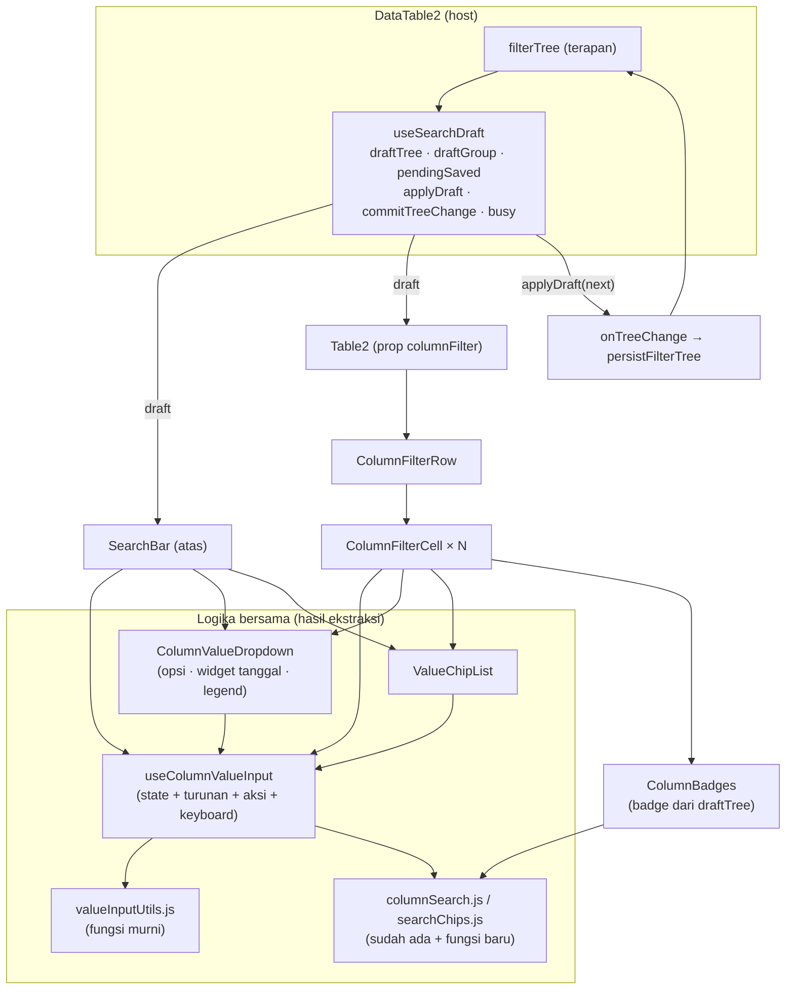

# Design Document: datatable2-column-search-row

## Overview

Fitur ini menambah **Baris Filter Kolom** (baris `<tr>` kedua di `<thead>` `Table2`) berisi satu **Sel Filter** per kolom. Sel Filter adalah input + Badge Nilai yang memakai logika input nilai yang SAMA dengan Search Bar atas. Untuk menjamin "sama" tanpa menyalin, logika itu **diekstrak dari `SearchBar.jsx`** (3.662 baris) menjadi hook + komponen bersama, lalu dipakai ulang oleh Search Bar atas dan Sel Filter.

Pola utama:

1. **Satu sumber state = draft Search Bar yang diangkat ke host.** `draftTree`/`draftGroup`/`pendingSaved` + `applyDraft` pindah dari `SearchBar` ke hook baru `useSearchDraft`, dipanggil di `DataTable2`. Search Bar atas dan Baris Filter Kolom membaca/menulis draft yang sama (Req 7.3-7.4). Badge dan chip hanyalah turunan dari `draftTree` (`treeToChips`).
2. **Ekstraksi logika nilai bertahap**: (a) fungsi murni → `valueInputUtils.js`; (b) state + turunan + aksi + keyboard value-mode → hook `useColumnValueInput`; (c) JSX daftar opsi/widget tanggal/chip nilai → komponen `ColumnValueDropdown` dan `ValueChipList`. Setelah tiap tahap seluruh tes `SearchBar` harus tetap hijau tanpa ubah assertion (Req 10.3).
3. **Satu instance hook per Sel Filter** (bukan satu controller bersama): ketikan sel yang belum di-Enter tetap hidup saat fokus pindah ke sel lain (Req 6.4). Hook murah saat idle karena fetch/turunan berat hanya jalan saat sesi aktif.
4. **`Table2` opt-in** lewat prop `columnFilter` (hanya `DataTable2` yang mengisi). `AdvanceSearchDialog`/`SelectModel` tidak berubah (Req 1.7).

Yang TIDAK berubah: semantik staged-apply Search Bar atas (kapan draft di-apply), backend (`DataTableScope`, `FilterEvaluator`, saved filter), tampilan mobile (kartu; `DataTable2` merender `Table2` hanya saat bukan mobile, jadi baris filter otomatis tidak muncul di mobile — Req 9.3), Advance Search Dialog `LinkModel` (memakai `SearchBar` mode tak terkontrol seperti sekarang).

## Architecture



### Data Flow: commit dari Sel Filter

```mermaid
sequenceDiagram
  actor U as User
  participant C as ColumnFilterCell
  participant H as useColumnValueInput (instance sel)
  participant D as useSearchDraft (DataTable2)
  participant P as persistFilterTree
  participant S as SearchBar (atas)

  U->>C: ketik "&gt;=100" + Enter
  C->>H: handleKeyDown(Enter)
  H->>H: absorbPendingText → chip nilai (Enter ke-1)
  U->>C: Enter (input kosong)
  C->>H: handleKeyDown(Enter)
  H->>C: onCommit(patch {k,o:">=",v:100}, {editId:null, apply:true})
  C->>D: commitTreeChange(draft => addLeafChip(draft, patch))
  D->>D: next = fn(draftRef.current); setDraftTree(next)
  D->>P: applyDraft(next) → onTreeChange(next) (Promise, busy=true)
  P-->>D: setFilterTree(next) setelah POST /saved-filters
  D-->>S: draft/tree baru → chip "Jumlah ≥ 100" muncul
  D-->>C: draft/tree baru → badge "≥ 100" di sel
```

Data Flow ringkas:

1. `DataTable2` membuat `draft = useSearchDraft({tree: filterTree, group, onTreeChange, onGroupChange, onPickSaved})`.
2. `SearchBar` menerima `draft` (mode terkontrol) — tanpa prop itu ia membuat draft internal lewat hook yang sama (mode tak terkontrol, perilaku lama; dipakai `AdvanceSearchDialog`).
3. `Table2` menerima `columnFilter = {columns: mapColumns, draft, onOpenBuilder}` dan merender `ColumnFilterRow`.
4. Tiap `ColumnFilterCell` menurunkan badge dari `draft.draftTree` dan memakai satu `useColumnValueInput` untuk sesi ketik/edit.
5. Commit → `draft.commitTreeChange(updater)` (menulis draft + meng-apply seluruh draft).
6. Perubahan `filterTree` dari sumber luar (Builder, saved filter, `addFilter`) → `useSearchDraft` mereset draft (`useEffect` seperti `setDraftTree(tree)` di SearchBar sekarang) → semua chip dan badge ikut.

## Components and Interfaces

### 1. `useSearchDraft` — `resources/js/Components/Table/Search/useSearchDraft.js` (baru, diekstrak dari SearchBar)

Memindahkan dari `SearchBar.jsx`: `draftTree`, `draftGroup`, `pendingSaved`, `commitTree` (busy), `applyDraft`, effect reset dari `tree`/`group`.

```js
/**
 * @param {object} p
 * @param {object|null} p.tree           filterTree terapan milik host
 * @param {Array}       p.group          Groups terapan
 * @param {(tree) => void|Promise<void>} p.onTreeChange
 * @param {(groups) => void} [p.onGroupChange]
 * @param {(saved) => void}  [p.onPickSaved]
 * @returns {{
 *   draftTree: object|null, setDraftTree: Function,
 *   draftGroup: Array,      setDraftGroup: Function,
 *   pendingSaved: object|null, setPendingSaved: Function,
 *   busy: boolean,
 *   commitTree: (tree) => Promise<void>,           // dipertahankan: chip Cari instant-apply
 *   applyDraft: (treeOverride?) => void,           // PERSIS logika applyDraft sekarang
 *   commitTreeChange: (updater: (draft) => object|null) => Promise<void>,
 *   isDraftDirty: boolean,
 * }}
 */
export default function useSearchDraft({ tree, group, onTreeChange, onGroupChange, onPickSaved })
```

- `commitTreeChange(updater)`: `next = updater(draftRef.current)`; `setDraftTree(next)`; `draftRef.current = next`; lalu `applyDraft(next)`. `draftRef` selalu menyalin `draftTree` terbaru (update sinkron di `setDraftTree` wrapper) agar dua commit beruntun dari dua sel tidak membaca closure basi (aturan yang sama dengan parameter `treeOverride` di `applyDraft` sekarang).
- `applyDraft` tidak berubah semantik: menolak bila `busyRef.current`, memanggil `onPickSaved(pendingSaved)` bila ada, selain itu bandingkan `isFilterTreeDirty(tree, next)`/`sameGroups` lalu `commitTree`/`onGroupChange`.
- Cell hanya menyentuh draft lewat `commitTreeChange`, bukan `setDraftTree` langsung.

`SearchBar` signature menambah prop opsional `draft`:

```js
const ownDraft = useSearchDraft({ tree, group, onTreeChange, onGroupChange, onPickSaved });
const draft = draftProp ?? ownDraft;   // hook selalu dipanggil (aturan hooks); yang tak dipilih idle
```

[Catatan: `ownDraft` yang tidak terpakai hanya punya satu `useEffect` reset; tidak ada I/O.]

### 2. `valueInputUtils.js` — `resources/js/Components/Table/Search/valueInputUtils.js` (baru)

Fungsi murni yang kini berupa konstanta/helper di kepala `SearchBar.jsx` (baris 118-264) dipindah apa adanya: `CHIP_CLASS`/`chipClass`, `SET_OPTIONS`, `leafCheckedList`, `leafExcluded`, `listOptionsFor`, `recordLabel`, `sameLabel`, `normalizeDatePayload`, `dateNoticeText`, `groupChipLabel` (tetap di SearchBar karena khusus group). Ditambah dua fungsi baru yang menggantikan potongan yang sekarang inline di `openEditorForChip` (SearchBar.jsx:2159-2263):

```js
/**
 * Apakah leaf bisa dibentuk ulang dari sintaks/picker sel (Req 8.5-8.6).
 * SATU-SATUNYA sumber keputusan; dipakai juga oleh openEditorForChip.
 * @returns {"edit"|"dotted"|"builder"}
 *   "edit"    → mode value untuk `column` (resolveValueMode != null & leaf representable)
 *   "dotted"  → leaf lama bertitik tanpa kolom ter-resolve (edit sbg teks polos)
 *   "builder" → buka Builder
 */
export const canEditLeafInCell = (column, leaf) => { ... }

/**
 * Opsi `enterValueMode` (initialText/initialChecked/initialRecords/
 * initialTextChips/initialDateChips/editId) untuk mengedit `leaf`.
 * Memindahkan logika prefill dari openEditorForChip apa adanya.
 */
export const buildEditorPrefill = (column, chip, ctx /* {t, monthsShort, isDatetime} */) => ({ ... })
```

`canEditLeafInCell` mengembalikan `"builder"` bila: `leaf.v?.mode === "column"` (leaf mode kolom); atau `column.type === "string"` bebas (tanpa opsi) dengan `o ∈ {"=","!=","starts_with","ends_with"}`; atau `column.type ∈ {number,currency}` dengan `o === "!between"`; selain itu `"edit"` bila `resolveValueMode(column)` ada. (Terverifikasi dari `operators.js` + `buildLeafFromText`: sintaks sel hanya menghasilkan `matches`/`!matches`/`in`/`!in` untuk string, dan `= != > >= < <= between in !in` untuk number — `!between` tidak punya sintaks.)

### 3. `useColumnValueInput` — `resources/js/Components/Table/Search/useColumnValueInput.js` (baru, diekstrak)

Memindahkan dari `SearchBar.jsx`:

| Kategori | Isi |
|---|---|
| State | `valueColumn`, `inputValue`, `valueError`, `editingLeafId`, `checkedValues`, `selectedRecords`, `textChips`, `dateChips`, `datePickerValue`, `editingValueChipKey`, `highlightedValueChipKey`, `optionNavigated`, `optionDismissed`, `highlightedKey`, `knownRecordsRef`, `latestRef`, `datePickerRef`, `widgetPointerRef` |
| Turunan | `vmode`, `excludeMode`, `isChipMode`, `isBooleanColumn`, `chipSeparators`, `multiParts`, `searchText`, `allListOptions`, `inlineValueOptions`, `listUncheckedOptions`, `datePresets`, `dateSuggestions`, `dateParseCtx`, `reuiDateValue`, `relationSearch` (`useLinkModelOptions`), `relationUncheckedOptions`, `valueChips`, `visibleValueChips`, `setOptions`, `visibleKeys`, `hasOptionIntent`, `optionClass`, `legendCtx` (bagian value) |
| Aksi | `enterValueMode`, `exitValueMode`, `pickListValue`, `pickBooleanValue`, `pickRecord`, `addDateValues`, `handleDatePickerChange`, `removeValueChip`, `startEditValueChip`, `absorbTypedText`, `absorbPendingText`, `computeCheckedLeafPatch`, `finishValueMode`, `pickSetOperator`, `commitCheckedSelectionSync`, `resolveRelationLabels`, `resolveSegments` |
| Event | `handleChange(e)` (bagian `isChipMode` dari `handleInputChange`), `handleKeyDown(e)` (cabang value-mode dari `handleInputKeyDown`) |

```js
/**
 * @param {object} p
 * @param {(patch: {k,o,v}, meta: {editId: string|null, apply: boolean}) => void|Promise} p.onCommit
 *        dipanggil setiap kali sesi menghasilkan leaf; host memutuskan cara menulis draft.
 *        Search Bar atas: apply=false → updateDraftLeaf(patch, editId); apply=true → commitLeafAndApply.
 *        Sel Filter: SELALU draft.commitTreeChange(...) (menulis + apply).
 * @param {(opts?) => void} p.onRequestOpen   minta host membuka dropdown nilai
 * @param {() => void}      p.onRequestClose  minta host menutup dropdown
 * @param {boolean}         p.busy            menolak commit saat host sibuk
 * @param {React.RefObject} p.inputRef        fokus programatik
 * @returns {ValueController}                 semua state/turunan/aksi di atas
 */
export default function useColumnValueInput({ onCommit, onRequestOpen, onRequestClose, busy, inputRef })
```

Perubahan perilaku dibanding kode sekarang: **nol**. Satu-satunya pelepasan ketergantungan:

- `commitLeafAndApply`, `updateDraftLeaf`, `closeDropdown`, `applyDraft` (yang sekarang dipanggil langsung di dalam `pickSetOperator`/`finishValueMode`/`commitCheckedSelectionSync`) diganti callback `onCommit`/`onRequestClose`. Untuk Search Bar atas, `onCommit` diisi persis dengan fungsi-fungsi lama.
- `handleKeyDown` mengembalikan `true` bila event ditangani. `SearchBar.handleInputKeyDown` mempertahankan urutan cabang lama: (1) navigasi chip utama mode key; (2) `Enter && !open` → `applyDraft`; (3) panah di Panel; (4) **delegasi ke `value.handleKeyDown(e)` bila `mode === "value"`**; (5) cabang key-mode yang tersisa (`Backspace` pada chip utama, `Escape` menutup dropdown, `Tab`/`:` melengkapi kolom). Sebelum delegasi, `setHighlightedChipId(null)` dipertahankan agar sorotan chip utama tetap bersih seperti sekarang.

Dua pengunaan:

- `SearchBar`: satu instance, `valueColumn` berganti sesuai kolom yang dipilih (pola lama).
- `ColumnFilterCell`: satu instance per sel; `enterValueMode(column, prefill)` dipanggil saat fokus input/klik badge; `valueColumn` selalu = kolom sel.

### 4. `ColumnValueDropdown` — `.../Search/ColumnValueDropdown.jsx` (baru, diekstrak)

Memindahkan JSX `CommandList` mode value (SearchBar.jsx:3295-3590): daftar opsi list/boolean (dengan `BadgeStatus` untuk status), preset + saran tanggal, record relasi (+ `LoadingIcon`), opsi `Diisi`/`Tidak diisi`, indikator "Kecualikan", widget `ReuiDateSelector` dua kolom, footer `SearchLegend`.

```jsx
<ColumnValueDropdown value={controller} column={column} t={t} />
```

Dibungkus pemanggil dengan `<Command shouldFilter={false} value={controller.highlightedKey} onValueChange={controller.setHighlightedKey}>` dan `<PopoverContent>` (cmdk butuh input sebagai keturunan DOM `Command` yang sama; aturan itu tetap, lihat komentar SearchBar.jsx:3067-3074).

### 5. `ValueChipList` — `.../Search/ValueChipList.jsx` (baru, diekstrak)

Memindahkan JSX chip nilai (SearchBar.jsx:3141-3184): chip `bg-secondary`, klik untuk edit (text/number/date), `×` dengan `onMouseDown preventDefault`, ring `destructive` saat tersorot.

### 6. `columnBadges.js` — `.../Search/columnBadges.js` (baru, fungsi murni)

```js
/** Apakah kunci leaf `k` milik kolom `column` (k === name, atau relasi: k diawali `${name}.`). */
export const leafBelongsToColumn = (k, column) => boolean

/**
 * Badge per kolom, diturunkan dari chip draft (treeToChips).
 * @param {Array} chips      hasil treeToChips(draftTree, columns, t, opts)
 * @param {object} column
 * @param {object} ctx       {t, columns, monthsShort}
 * @returns {Array<Badge>}
 */
export const badgesForColumn = (chips, column, ctx) => Badge[]

/** Set nama kolom yang dipakai di dalam chip advanced/search (Req 8.2) — penanda sel. */
export const columnsUsedInAdvanced = (chips) => Set<string>
```

`Badge` = `{ key, leafId, label, valueKey, negated, op, editable: "edit"|"dotted"|"builder", tooltip }`. Label **nilai saja**: `formatValueLabel`/`formatPeriodValue` yang sudah ada dipakai ulang lewat ekspor varian `leafValueBadges(node, column, t, opts)` di `searchChips.js` (menggantikan format `Kolom: nilai` yang menanam judul kolom, `searchChips.js:188`). Aturan label: `=`/`in`/`matches` → nilai; `!=`/`!in`/`!matches`/`!in_period` → `≠ nilai` + `negated`; `>`/`>=`/`<`/`<=` → `> 100` dst; `between` → `a..b`; `set`/`!set` → `Diisi`/`Tidak diisi`; leaf `in` multi-nilai → satu Badge per nilai (`valueKey` berbeda, `leafId` sama). Leaf `editable === "builder"` → Badge read-only berlabel operator penuh (label `leafToChip`).

Dua operasi tree baru di `searchChips.js` (murni, immutable, bersama `addLeafChip`/`updateChip`/`removeChip` yang ada):

```js
/** Hapus SATU nilai dari leaf `in`/`!in`/in_period-daftar; sisa 1 nilai → turun ke `=`/`!=`; sisa 0 → leaf dihapus. */
export const removeLeafValue = (tree, leafId, valueKey) => object|null
```

### 7. `ColumnFilterCell` — `.../Search/ColumnFilterCell.jsx` (baru)

Props: `{ column, draft, onOpenBuilder, advancedUsed }`. Perilaku:

- `isColumnSearchable(column)` salah → render sel kosong (tanpa input; Req 3.8).
- Badge idle dari `badgesForColumn(treeToChips(draft.draftTree, ...), column)`.
- Input mentah memakai kelas anti-`@tailwindcss/forms` (`border-0! shadow-none! focus:ring-0! focus-visible:ring-0!`), `aria-label = columnTitle(column, t)`.
- Fokus/klik input kosong → `controller.enterValueMode(column, {})` (sesi **baru**, `editId=null`) + buka popover. Klik Badge → `enterValueMode(column, buildEditorPrefill(...))` + `startEditValueChip(valueKey)` (sesi **edit** leaf itu; badge leaf itu disembunyikan selama sesi, pola `displayChips`).
- `×` pada Badge idle → `draft.commitTreeChange(t => removeLeafValue(t, leafId, valueKey))`.
- Badge `editable: "builder"` → klik memanggil `onOpenBuilder(draft.draftTree)`.
- `onCommit(patch, {editId})` → `draft.commitTreeChange(t => editId ? updateChip(t, editId, patch) : addLeafChip(t, patch))`. Selalu apply.
- Blur TIDAK meng-commit (Req 6.4): sesi dan ketikan dipertahankan; popover menutup.
- Escape: `exitValueMode()` (membuang ketikan/chip sesi yang belum di-Enter). **Berbeda dari Search Bar atas** yang meng-commit chip nilai saat Escape/klik-luar (Req 27.3 spec lama); sel sengaja tidak memakai jalur itu — `commitCheckedSelectionSync` tidak dipanggil dari sel.
- Indikator Req 8.2: ikon kecil + tooltip bila `advancedUsed.has(column.name)`.
- Overflow Badge: container `flex flex-wrap gap-1 max-h-[5.25rem] overflow-y-auto` (≈3 baris badge `text-xs`), sesuai Req 5.7.
- `busy` dari `draft.busy` → input `readOnly` + ikon `LoadingIcon` kecil (Req 6.7).
- Kolom relasi: kolom anak tidak pernah di-fetch (revisi 4 spec lama: leaf baru = record utuh); `useLinkModelOptions` hanya aktif saat sesi relasi aktif dan popover terbuka (`open` flag) → tidak ada request saat mount (Req 10.4 diselesaikan secara struktural).

### 8. `ColumnFilterRow` — `.../Search/ColumnFilterRow.jsx` (baru)

```jsx
<ColumnFilterRow
  showedColumns={showedColumns}   // dari Table2
  selectable actions               // untuk sel kosong pengisi
  columnFilter={columnFilter}      // {columns, draft, onOpenBuilder}
/>
```

Merender `<tr>` berisi: `<th aria-hidden/>` kosong bila `selectable`, `<th/>` kosong bila `actions`, lalu `ColumnFilterCell` per `showedColumns`. `treeToChips` dihitung SEKALI di sini (`useMemo` atas `draft.draftTree`, `columns`, `t`) dan `columnsUsedInAdvanced` dihitung sekali; keduanya diteruskan ke sel (bukan N× `treeToChips`).

### 9. Perubahan `Table2.jsx`

- Props baru: `columnFilter` (opsional).
- `<thead>`: setelah `<tr>` judul, `{columnFilter && <ColumnFilterRow .../>}`.
- Efek `--group-sticky-top` (Table2.jsx:599-619) diperluas: ukur baris 1 (`th` pada `tr:first-child`) dan baris 2 terpisah → set `--column-header-height` = tinggi terbesar baris 1; `--group-sticky-top` = baris1 + baris2. Observer di-attach ke SEMUA `th` kedua baris; deps tetap eksplisit `[selectable, actions, showedColumns, Boolean(columnFilter)]`. Sesuai catatan ResizeObserver di file itu (observe semua sel + ambil maks, bukan satu sel).

### 10. Perubahan `table.css`

```css
thead tr:first-child th { @apply bg-muted sticky top-0 z-3; }          /* tetap */
thead tr:nth-child(2) th {
  @apply bg-muted sticky z-3 border-b border-muted-foreground/25;
  top: var(--column-header-height, 0px);
}
```

Sel filter memakai `<th>` (agar tak terkena aturan `td`), `py-1 px-2`. Kelas `table.resizeable-table th span { display:block }` menimpa utilitas `span`: elemen `span` di dalam sel filter yang butuh `display` lain memakai `inline-flex!`/`flex-row!` (catatan `table.css td span`).

### 11. Perubahan `DataTable2.jsx`

```jsx
const draft = useSearchDraft({ tree: filterTree, group: options.group, onTreeChange, onGroupChange, onPickSaved });
<SearchBar ... draft={draft} />
<Table2 ... columnFilter={{ columns: mapColumns, draft, onOpenBuilder: (d) => { setBuilderDraftFilter(d ?? null); setBuilderOpen(true); } }} />
```

### 12. i18n

Kunci baru di `lang/en/core/datatable.php` dan `lang/id/core/datatable.php` (struktur mengikuti `core.datatable.search.*` yang ada): `core.datatable.column_search.placeholder.{text,number,list,date,relation}`, `...advanced_used` (tooltip indikator), `...readonly_builder` (tooltip badge → Builder), `...clear`. Tanpa placeholder yang saling berawalan; `LangPlaceholderPrefixTest` dijalankan.

## Data Models

```ts
// Draft host (useSearchDraft)
type Draft = {
  draftTree: FilterTree | null; setDraftTree(t): void;
  draftGroup: Group[];          setDraftGroup(g): void;
  pendingSaved: SavedFilter | null; setPendingSaved(s): void;
  busy: boolean;
  commitTree(t): Promise<void>;
  applyDraft(treeOverride?: FilterTree | null): void;
  commitTreeChange(updater: (d: FilterTree | null) => FilterTree | null): Promise<void>;
  isDraftDirty: boolean;
};

// Prop baru Table2
type ColumnFilterProp = {
  columns: Record<string, Column>;       // mapColumns
  draft: Draft;
  onOpenBuilder(draftTree: FilterTree | null): void;
};

// Badge turunan draftTree
type Badge = {
  key: string;                // `${leafId}:${valueKey}`
  leafId: string;
  valueKey: string;           // kunci nilai di dalam leaf
  label: string;              // nilai saja (+ awalan operator bila perlu)
  tooltip: string;            // label penuh `leafToChip`
  negated: boolean;
  op: string;
  editable: "edit" | "dotted" | "builder";
};

// Callback commit hook nilai
type CommitPatch = { k: string; o: string; v?: unknown };
type CommitMeta  = { editId: string | null; apply: boolean };
```

`FilterTree`/node tidak berubah: `{ root: { k: "and"|"or", c: { [id]: Node } } }`, leaf `{ k, o, v }`.

## Correctness Properties

Properti untuk property-based test (`fast-check`; `fc.pre()`/`.filter()` harus identik dengan validasi sumber).

- **P1 — Partisi badge (Req 5.1, 8.1).** Untuk tree `T` dan himpunan kolom `C`, setiap leaf anak langsung root AND muncul sebagai badge di **paling banyak satu** kolom (`leafBelongsToColumn`), dan chip bukan-leaf (`search`/`advanced`) tak pernah menghasilkan badge.
- **P2 — Commit sel menjaga node lain (Req 8.4, 7.4).** Untuk draft `D` dan patch `p`, `addLeafChip(D, p)` / `updateChip(D, id, p)` / `removeLeafValue(D, id, v)` tidak mengubah isi node anak-root lain selain target (kecuali merge `=`/`in` pada kolom yang sama), dan semua chip yang ada di `D` sebelum commit masih ada setelahnya (tidak ada kehilangan draft atas).
- **P3 — Round-trip teks ↔ leaf (Req 4.1).** Untuk kolom `c` bermode text/number dan teks `s` valid: `buildLeafFromText(c, leafToText(buildLeafFromText(c, s)))` ekuivalen dengan `buildLeafFromText(c, s)` (idempoten pada hasil kanonik).
- **P4 — Hapus nilai (Req 5.4).** `removeLeafValue` pada leaf `in` bernilai `n ≥ 2` menghasilkan leaf dengan `n−1` nilai (operator turun ke `=`/`!=` bila `n−1 = 1`); pada leaf bernilai tunggal menghapus leaf; urutan nilai sisa dipertahankan.
- **P5 — Konsistensi keputusan edit (Req 8.6).** Untuk setiap `(kolom, leaf)`, `canEditLeafInCell` yang dipakai `openEditorForChip` dan `ColumnFilterCell` adalah fungsi yang sama; jika hasilnya `"edit"`, `buildEditorPrefill` → `computeCheckedLeafPatch` (tanpa perubahan input) menghasilkan leaf yang ekuivalen dengan leaf asal (edit tanpa perubahan bersifat identitas, tidak diam-diam mengubah operator — pelajaran Requirement 25 spec lama).
- **P6 — Derivasi murni (Req 7.1).** `badgesForColumn(treeToChips(T))` hanya bergantung pada `T`, kolom, dan locale; dua tree yang sama secara struktural menghasilkan badge sama (tidak ada state tersembunyi).
- **P7 — Idempotensi merge (Req 6.6).** Meng-commit dua kali nilai yang sama pada kolom `=`/`in` tidak menambah nilai kedua (`mergeValues` unik).

## Error Handling

| Scenario | Behavior |
|----------|----------|
| Ketikan number bukan angka | Pesan `core.datatable.search.number_invalid` di bawah sel; tidak commit |
| Label list/relasi tak cocok | `core.datatable.search.option_not_found`; relasi: coba `resolveRelationLabels` dulu (endpoint `model`) |
| Periode tanggal tak terparse | `core.datatable.search.date_invalid`; daftar tanggal melanggar aturan → `chip_*`/`date_limit` seperti Search Bar |
| Host `busy` (commit sebelumnya masih jalan) | Sel `readOnly` + ikon sibuk; `commitTreeChange` menolak (`Promise.reject(new Error("busy"))` ditangkap, ketikan dipertahankan) |
| `persistFilterTree` gagal (422 `empty_tree`/jaringan) | Toast error dari host; `filterTree` tak berubah → draft di-reset ke tree lama oleh effect; badge kembali. Ketikan sel tak hilang (sesi masih ada) sehingga user bisa mengoreksi |
| Leaf tak bisa diedit di sel (`builder`) | Badge read-only; klik → `onOpenBuilder(draft.draftTree)` |
| Root OR multi-kondisi | Sel tetap aktif; `addLeafChip` membungkus OR jadi grup lalu AND dengan leaf baru; kolom di grup diberi indikator |
| Kolom bukan Kolom Searchable | Sel kosong, tak bisa difokus |
| Prop `columnFilter` tidak diberikan | Tidak ada baris filter; tampilan lama utuh |
| Tinggi badge melebihi 3 baris | Scroll vertikal internal sel; `--group-sticky-top` tetap menghitung tinggi baris |
| `localStorage`/`ResizeObserver` tak tersedia | Efek ukur dilewati (guard `typeof ResizeObserver === "undefined"` sudah ada); CSS var fallback `0px` |

## Testing Strategy

### Urutan kerja & jaring pengaman (Req 10.3)

Ekstraksi dilakukan bertahap; setelah **setiap** tahap jalankan: `SearchBar.rtl.test.jsx`, `SearchPanel.rtl.test.jsx`, `ChipEditor.rtl.test.jsx`, `DataTable2.rtl.test.jsx`, `columnSearch.test.js`, `searchChips.test.js` dengan assertion tidak diubah. Tahap: (0) baseline hijau + catat jumlah tes; (1) `valueInputUtils.js`; (2) `useSearchDraft` (SearchBar mode tak terkontrol identik); (3) `useColumnValueInput`; (4) `ColumnValueDropdown` + `ValueChipList`; (5) SearchBar mode terkontrol + pindah draft ke `DataTable2`; (6) `columnBadges.js` + `removeLeafValue`; (7) `ColumnFilterCell`/`ColumnFilterRow`; (8) `Table2` + CSS; (9) i18n; (10) verifikasi browser.

### Unit Tests (example-based, Vitest `.test.js`, environment node)

- `valueInputUtils.test.js`: `canEditLeafInCell` untuk matriks (tipe kolom × operator) termasuk leaf mode kolom, `!between`, `starts_with`; `buildEditorPrefill` ekuivalen dengan prefill lama untuk tiap mode.
- `columnBadges.test.js`: `leafBelongsToColumn` (relasi bertitik), `badgesForColumn` (label nilai-saja: `≥ 100`, `≠ Draft`, `a..b`, `Diisi`; `in` multi → banyak badge), `columnsUsedInAdvanced`.
- `searchChips.test.js` (tambah): `removeLeafValue` (n≥2, n=2→`=`, n=1, tak ada id), `leafValueBadges`.

### Property-Based Tests (`fast-check`, `*.property.test.js`)

P1-P7 di atas. Generator tree memakai kolom bertipe campuran; `fc.pre()` disamakan dengan validasi `isColumnSearchable`/`buildLeafFromText`.

### Component Tests (RTL, `*.rtl.test.jsx`, environment jsdom)

- `useSearchDraft.rtl.test.jsx`: apply menolak saat busy; reset dari `tree` luar; `commitTreeChange` beruntun tidak kehilangan perubahan (ref sinkron).
- `ColumnFilterCell.rtl.test.jsx` (render komponen sungguhan, query role/label): text dengan `!x`, `>=5`, `a|b`; list picker; badge edit (klik) dan hapus (×); Backspace dua langkah; Enter ke-1 jadi chip, Enter ke-2 commit; blur tidak commit; Escape membuang; badge read-only → `onOpenBuilder`; indikator "advanced used"; sel kosong untuk kolom non-searchable; `readOnly` saat busy.
- `ColumnFilterRow` + `Table2`: baris tampil hanya dengan `columnFilter`; sel kosong pengisi untuk `selectable`/`actions`; urutan sel mengikuti `showedColumns`.
- `SearchBar` mode terkontrol: draft dari prop; sinkron dua arah dengan sel (commit sel → chip atas muncul; hapus chip atas → badge sel hilang); draft atas yang belum di-apply ikut ter-apply saat commit sel (Req 7.4).
- `DataTable2.rtl.test.jsx` (tambah): baris filter ter-render; commit sel memanggil `onTreeChange` dengan tree yang benar.

### Verifikasi browser (production build, `npm run build`)

Hal yang tak terlihat di jsdom (catatan memory proyek): sticky dua baris + `--group-sticky-top` gabungan saat grouping aktif; handle resize (`z-1`, tinggi `tableHeight`) tidak menutupi tepi kanan Sel Filter; Radix Popover/cmdk dan fokus lintas sel; klik label ganda (`label htmlFor`) pada picker list; `POST /saved-filters` (tidak 422) untuk leaf baru tiap tipe (boolean hanya `=`/`!=`, `FilterTreeCleaner`); kolom relasi, tanggal, status, number, text; resize/reorder kolom saat sel punya ketikan; fokus saat reload data. Migrasi DB tidak diperlukan (tanpa perubahan backend).

### Di luar uji

Backend tidak berubah, sehingga tidak ada tes PHPUnit baru. `LangPlaceholderPrefixTest` dan `LocaleKeysTest` dijalankan untuk kunci i18n baru.

## Catatan Implementasi (deviasi dari rancangan awal)

Dicatat saat implementasi (semua diverifikasi lewat tes dan browser):

- **`handleKeyDown` hook tidak mengembalikan boolean.** `SearchBar` mendelegasikan seluruh cabang mode-value ke `value.handleKeyDown(e)` lalu `return`; tidak ada cabang yang perlu tahu apakah event "tertangani".
- **`canEditLeafInCell` memakai whitelist operator per mode** (`EDITABLE_OPERATORS` di `valueInputUtils.js`), bukan blacklist: operator di luar daftar yang bisa dibentuk ulang lewat sintaks/picker (mis. `starts_with`, `=`/`!=` string bebas, `!between`, `matches` pada kolom ber-opsi, leaf mode kolom) → `"builder"`. Konsekuensi untuk Search Bar atas: `openEditorForChip` kini membuka Builder untuk leaf tersebut alih-alih mengeditnya diam-diam sebagai `matches` (memperbaiki perubahan operator tak disengaja).
- **`columnsUsedInAdvanced` hanya menghitung chip `advanced`**, bukan Chip Cari: Chip Cari mencakup banyak kolom sehingga hampir semua sel akan bertanda.
- **`useSearchDraft.commitTreeChange` + `pendingSaved`:** bila saved filter dipilih tapi belum di-apply, commit dari sel melepas `pendingSaved` dan meng-apply tree draft sebagai tree biasa (filter ephemeral baru), bukan lewat `onPickSaved` (yang akan mengaktifkan fid asli dan membuang edit sel).
- **Edit-sesi vs sesi-baru saat blur di sel:** sesi edit leaf (klik badge) dibatalkan saat fokus meninggalkan sel (badge asli tampil lagi); sesi nilai BARU dipertahankan sehingga ketikan tetap di input sampai Enter/Escape (Requirement 6.4).
- **Host sibuk:** input TIDAK `readOnly` (ketikan user tidak boleh hilang saat reload); hanya Enter/commit yang ditolak dan sel diberi `aria-busy` + opacity. Ditemukan lewat verifikasi browser: klik sel saat draft atas masih ter-apply (klik-luar Search Bar) membuat host sibuk sesaat.
- **`gridTemplateRows` flat path `Table2`** perlu satu track `auto` tambahan untuk baris filter; tanpa itu baris data terakhir jatuh ke track implisit setelah filler `1fr`. Ditemukan saat membaca kode (bukan dari tes jsdom) dan dijaga tes `Table2.columnFilter.rtl.test.jsx`.
- **Chip nilai di dalam `<th>`:** `table.css` memaksa `th span { display:block; white-space: normal }`; `ValueChipList` memakai `inline-flex!` dan `whitespace-nowrap!` agar chip tidak pecah di sel filter.
- **`SearchBar` mengonsumsi draft lewat `draft ?? ownDraft`:** `useSearchDraft` selalu dipanggil (aturan hooks); catatan: `group` yang diteruskan ke `useSearchDraft` harus referensi stabil (state), array literal baru tiap render memicu effect reset tanpa henti.

### Draft langsung (Requirement 14) — `useLiveDraft.js`

Dua hook: `useLiveDraftState(draft)` (dipanggil SEBELUM controller nilai karena `onCommit` butuh `baseFor`/`markCommitted`) dan `useLiveDraftSync({live, value, enabled})` (efek tulis ke draft, dipanggil sesudah `useColumnValueInput`).

- Sesi baru: `computeCheckedLeafPatch({withTyped:true})` → `addLeafChip(cur, patch, {merge:false})` lalu diperbarui di tempat lewat `updateChip`; patch `null` → `removeChip`. Sesi edit: `updateChip(cur, editId, patch)`, node asli disimpan untuk dipulihkan.
- Dilacak lewat id leaf (bukan snapshot tree): dua sel yang mengetik bergantian tidak saling menimpa (pendekatan snapshot awal ditinggalkan karena Escape sel A bisa membuang/menyisakan tulisan sel B).
- `baseFor(current)`: sesi baru → `removeChip(current, leafId)` (commit menambahkan leaf final); sesi edit → apa adanya. `markCommitted` mencegah pemulihan saat sesi berakhir karena commit.
- Hanya aktif di Sel Filter dan di `SearchBar` bila prop `draft` ada. Klik di `[data-column-filter-row]` dikecualikan dari klik-luar Search Bar.
- Sinkron dua arah: ketikan sel → chip atas muncul; ketikan mode nilai Search Bar atas → badge di sel kolomnya muncul. Chip/badge milik sesi aktif disembunyikan lewat `liveLeafId`.
