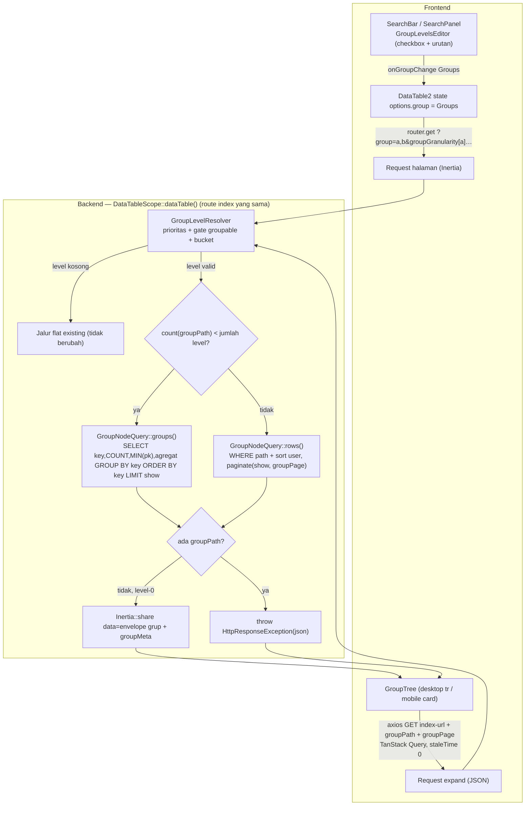
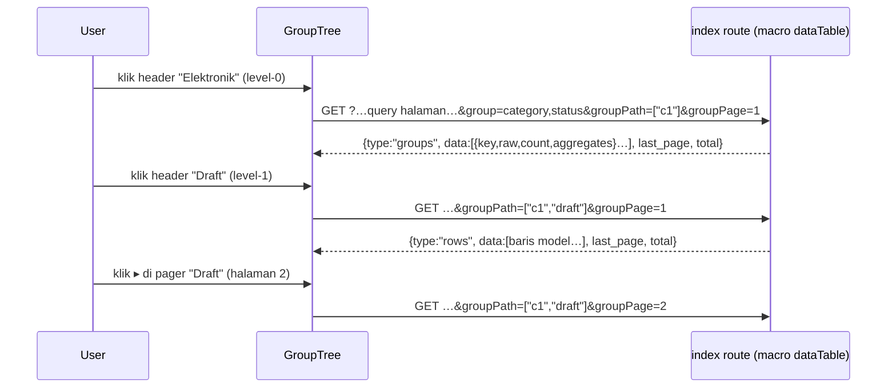

# Design Document: DataTable2 Group Tree

## Overview

`DataTable2` saat ini mendukung **1 kolom grup**: backend menjalankan satu query flat `paginate()` dengan `ORDER BY <kolom grup>, <sort>` plus satu query `COUNT(*) … GROUP BY` terpisah (`groupCounts`), lalu `Table2.jsx` memotong grup di client lewat *run-length* atas baris yang sudah terurut. Akibatnya grup bisa terpotong lintas halaman, semua grup terbuka sekaligus, dan tidak ada nesting.

Spec ini menggantinya dengan model **Odoo-style**:

1. **Nested group** — kontrak group berubah dari 1 kolom menjadi **daftar level berurutan** (`Groups`, maks 4) di *semua* lapisan: default model, saved filter, Filter Templates, Search Bar, URL, state FE.
2. **Lazy per node** — tidak ada lagi satu query yang mengambil semua baris. Level-0 hanya berisi **daftar nilai distinct + count** (+ agregat). Isi sebuah grup (sub-grup atau baris) baru di-fetch saat grup itu **dibuka**, satu request per node.
3. **Pagination independen** — `show` berlaku global sebagai batas tiap list; pager luar (`Pagination` existing) memaginasi daftar grup level-0, tiap grup punya pager sendiri untuk anak-anaknya.
4. **Agregat** — kolom `number`/`currency` yang dikonfigurasi lewat `configColumns` (`groupAggregate`: `sum|avg|min|max`) menampilkan hasil di baris header grup, di setiap level.
5. **Panel Group by** di Search Bar menjadi **checkbox** (aktif di atas + divider + sisanya, urutan aktif = urutan nesting, bisa diatur), chip tampil `Kategori > Status`.

**Keputusan brainstorming yang mengikat desain ini:**

| # | Keputusan | Alasan / alternatif yang ditolak |
|---|---|---|
| 1 | Transport lazy-fetch = **route index yang sama**; macro `dataTable()` mendeteksi `groupPath` lalu menjawab JSON via `HttpResponseException` | Controller (62 call-site) tak disentuh & scope per-controller (`scopeVisible`, `sharedListing`, `Unit::orderBy`, branch, permission middleware, cookie kolom) ikut jalan. Ditolak: Inertia partial reload (satu state halaman, visit saling cancel), endpoint generik `/datatable/group-node` (scope per-controller hilang → kebocoran data) |
| 2 | "Tidak pakai groupBy" = **tidak memuat baris**, bukan menghindari `GROUP BY` SQL | "Nilai distinct + count" *adalah* `GROUP BY key`; agregat juga butuh `GROUP BY`. Satu query per node mengembalikan `key + count + agregat` |
| 3 | **Mobile ikut grouping** | `GroupTree` dibuat render-prop (`renderRow`/`renderGroupHeader`) dipakai desktop & mobile. Ditolak: mobile tetap flat |
| 4 | Maks **4 level**, kolom **unik** per level (satu granularity/range per kolom) | Batas praktis untuk URL/SQL; Odoo memperbolehkan kolom sama dgn granularity beda — YAGNI |
| 5 | Kontrak `Groups` **satu-satunya** bentuk yang beredar; satu normalizer per sisi (BE `GroupLevels`, FE `groupLevels.js`) | Mencegah kontrak bercabang di 5 lapisan (audit menemukan ±18 titik sentuh) |
| 6 | Semua grup **default tertutup**; state terbuka reset saat halaman server berganti | Sesuai Odoo & prinsip lazy |
| 7 | Pager per node di **header node itu** (gaya Odoo), mengatur halaman *anak* node | Pager level-0 = `Pagination` existing, tak diubah |
| 8 | Agregat **hanya lewat kode** (`configColumns`), tanpa UI | Permintaan eksplisit user |
| 9 | Urutan grup selalu `key ASC` (relasi: menurut nilai FK, seperti sekarang) | Sort grup berdasarkan agregat/count dan urut-by-label relasi = di luar scope |
| 10 | Refactor **ekstrak** (`Services/Core/DataTable/Group/`, `TableRow`) dikerjakan *sebelum* perubahan perilaku | Test lama jadi jaring pengaman karakterisasi |

**Yang tidak berubah:** `FilterEvaluator`/`FilterTreeCleaner`, jalur `persistFilterTree`, semantik `null` = "saved filter tidak mengatur group", opt-in `groupable` per kolom (flag `groupable`, gate `sanitizeGroupableColumns`, `groupRangeOptions`), granularity `day|month|quarter|half|year`, konsumen `Table2` non-grup (`QuickListBlock`, `AdvanceSearchDialog`, `SelectModel`), dan semua konsumen XHR macro (`ModelController`, LinkModel, dashboard) — grouping tidak pernah aktif untuk mereka.

**Supersedes:** [`datatable2-grouping`](../datatable2-grouping/design.md) (v1: 1 kolom, flat-paginated, `groupCounts`, run-length) dan bagian group pada [`datatable2-advanced-search`](../datatable2-advanced-search/design.md) (bentuk `saved_filters.group`, prop `defaultGroup*`, `GroupPicker`, chip `Kolom › Bulan`). Spec lama **tidak diedit**; bagian yang digantikan tercantum di §Impact.

## Architecture



**Sequence: buka grup nested**



Poin penting: level-0 datang lewat **Inertia normal** (ikut filter/sort/page URL), sedangkan expand = **XHR JSON** ke URL yang sama. Semua query memakai constraint yang sama karena melewati macro yang sama, di titik yang sama dengan `clone $query` lama (setelah branch scope, saved filter, `searchScope`, submitable).

## Data Models

### Kontrak `Groups`

```
GroupLevel = { column: string, granularity: string|null, range: number|null }
Groups     = GroupLevel[]    // urutan = nesting (index 0 = terluar), maks 4, kolom unik
```

- `granularity` hanya bermakna untuk kolom `date|time|datetime` (`day|month|quarter|half|year`, default `month`); `range` hanya untuk `number|currency` (default = `groupRangeOptions[0]` kolom, fallback `[10,100,1000][0]`). Untuk tipe lain keduanya `null`.
- **Normalizer bersifat *struktural*, bukan *sanitasi nilai*:** ia mengubah berbagai bentuk masukan menjadi `Groups`, membuang duplikat kolom (yang pertama menang), tetapi **tidak** mengoreksi nilai `granularity`/`range` yang salah — supaya `FormRequest` tetap bisa menolaknya (422). Pemotongan ke 4 level dan koreksi nilai untuk jalur URL/default dilakukan resolver runtime, bukan normalizer.
- Bentuk masukan yang diterima normalizer: `null`/`''`/`[]` → `[]`; string `"a"` → 1 level; string CSV `"a,b"` (khusus URL) → 2 level; objek lama `{column, granularity?, range?}` → 1 level; list string; list objek; campuran list string/objek.

### Bentuk kawat (URL) — sinkron seperti `sort`/`page`/`fid`

| Param | Contoh | Catatan |
|---|---|---|
| `group` | `group=category,status` | CSV berurutan. `group=` **kosong** = "Tidak ada" eksplisit (menimpa filter/default). Param **tidak ada** = pakai filter aktif / default model |
| `groupGranularity[<kolom>]` | `groupGranularity[order_date]=month` | per kolom |
| `groupRange[<kolom>]` | `groupRange[amount]=100` | per kolom |
| `groupPath` | `groupPath=["c1","draft"]` | **hanya expand**; JSON array nilai `raw` leluhur (JSON string agar `null` tak hilang) |
| `groupPage` | `groupPage=2` | **hanya expand**; halaman anak node |

Kompat: bookmark lama `group=status&groupGranularity=month` (skalar) dianggap milik level pertama.

### Deskriptor grup & respons node

```jsonc
// item pada level-0 (data.data) dan pada respons expand type:"groups"
{
  "key": "draft",            // string ternormalisasi: 'null' utk NULL, 'true'/'false' utk boolean, JSON ringkas utk formStatuses
  "raw": "draft",            // nilai SQL mentah — dikirim balik sbg elemen groupPath, di-BIND sbg parameter (tak pernah diinterpolasi)
  "count": 12,
  "aggregates": { "grand_total": 1500000, "qty": 35 },   // hanya kolom groupAggregate valid; null bila semua nilai NULL
  "label": { /* objek relasi utuh — HANYA level bertipe relation */ }
}

// respons expand
{ "type": "groups"|"rows", "data": [...], "current_page": 1, "last_page": 3, "total": 250, "per_page": 100 }
```

- `raw` untuk kolom `formStatuses` = **daftar varian teks mentah** (`string[]`) yang menormalisasi ke `key` yang sama (MariaDB menyimpan teks verbatim; varian dijumlahkan, bukan saling timpa — perilaku existing dipertahankan). Semua tipe lain: skalar atau `null`.
- `type:"rows"` berisi baris model persis seperti `data.data` jalur flat (termasuk `applyAppends`).

### Prop Inertia (level-0)

| Prop | Sebelum | Sesudah |
|---|---|---|
| `data` | paginator baris | **grup aktif:** paginator berisi deskriptor grup level-0 (`LengthAwarePaginator`, bentuk sama: `current_page/last_page/total`). **Tidak aktif:** paginator baris (tidak berubah) |
| `groupCounts` | `{key: count}\|null` | **dihapus** |
| `groupMeta` | — | `{ levels: [{column, granularity, range, type}], aggregates: [{column, fn}] }` atau `null` bila grouping tidak aktif. `granularity/range` = nilai **efektif** yang dipakai SQL (default sudah terisi) → satu-satunya sumber untuk dekode label di FE |
| `defaultGroup` / `defaultGroupGranularity` / `defaultGroupRange` | skalar | **dihapus** → satu `defaultGroups: Groups` (grup efektif tanpa param: filter aktif ?? default model, sudah lolos gate `groupable`) |

### `saved_filters.group`

Kolom JSON (tipe tidak berubah) menyimpan `Groups` (list). `null` = "tidak mengatur group" (tidak menimpa group aktif saat filter diterapkan — semantik existing); `[]` disimpan sebagai `null`. Baris lama berbentuk objek dikonversi oleh migration data; accessor `SavedFilter::group` tetap menerima objek lama.

### Deklarasi default model & agregat (config kode)

```php
// Model — default group (opsional). Salah satu bentuk:
protected static array|string|null $defaultGroups = 'account_type';
protected static array|string|null $defaultGroups = ['category', 'status'];
protected static array|string|null $defaultGroups = [['column' => 'order_date', 'granularity' => 'month'], 'status'];

// $configColumns — agregat baris grup (hanya lewat kode)
'grand_total' => ['type' => 'currency', 'groupAggregate' => 'sum'],   // sum|avg|min|max
```

## Components and Interfaces

### 1. Backend

**File baru** — `app/Services/Core/DataTable/Group/` (nested Feature karena >1 file terkait, aturan `{Domain}/{Feature}` CLAUDE.md):

| File | Tanggung jawab | Sumber |
|---|---|---|
| `GroupLevels.php` | `normalize(mixed): array` (struktural, murni), konstanta `MAX_LEVELS = 4`, `GRANULARITIES`; `toWire()`/`fromWire(Request)` | baru |
| `GroupColumnGate.php` | `sanitizeColumns()` (gate `groupable` + validasi `groupAggregate`), resolusi kolom SQL relasi (`BelongsTo` → FK) | **dipindah** dari `DataTableScope` (`sanitizeGroupableColumns`, `resolveRelationGroupColumn`, `gateGroupColumn`) |
| `GroupBucket.php` | ekspresi SQL bucket date (`dateGroupExpression`) & number, predikat path untuk bucket | **dipindah** + predikat baru |
| `GroupLevelResolver.php` | rantai prioritas → `list<ResolvedLevel>` (kolom, tipe, kolom SQL, bucket, granularity/range efektif), potong ke 4 | baru (logika prioritas dari macro) |
| `GroupPath.php` | `parse(mixed $raw, array $levels): array` — validasi `groupPath` (JSON array skalar/`null`, level formStatuses list string, panjang ≤ jumlah level, number bucket wajib numerik); melempar 422 bila invalid | baru |
| `GroupNodeQuery.php` | `groups()` & `rows()`; predikat path per tipe; agregat; label relasi; total | baru |
| `GroupKeyNormalizer.php` | nilai SQL mentah ↔ `key` string (`'null'`, boolean, JSON status) | **dipindah** (blok normalisasi di macro) |

Pembagian file di atas adalah batas tanggung jawab yang diusulkan; implementer boleh menyesuaikan *di dalam folder ini* selama kontrak publik (`GroupLevels::normalize`, `GroupLevelResolver::resolve`, `GroupNodeQuery::groups/rows`) tetap.

#### 1.1 `Traits/DataTable.php`

`getDefaultGroupColumn(): ?string` dihapus (pemanggilnya hanya `DataTableScope`, 3 baris test, dan docs spec; **tidak ada model produksi** yang mengisi `$defaultGroupColumn`). Diganti:

```php
public static function getDefaultGroups(): array {
    return \property_exists(static::class, 'defaultGroups')
        ? GroupLevels::normalize(static::$defaultGroups)
        : [];
}
```

Pola `property_exists` **wajib** dipertahankan — properti statis yang dideklarasi di trait lalu dideklarasi ulang di model dengan nilai berbeda = PHP fatal (alasan sama dengan `getDefaultGroupColumn()`/`getSearchScope()`). PHPDoc trait diperbarui dengan 3 bentuk deklarasi.

#### 1.2 Lapisan Saved Filter / Filter Templates

| File | Perubahan |
|---|---|
| `Models/Core/SavedFilter.php` | cast `'group' => 'array'` diganti accessor `Attribute` (get: normalisasi → list, kosong → `null`; set: simpan list). `groupValidationRules()` jadi aturan list: `group` nullable array `max:4`; `group.*.column` required string; `group.*.granularity` nullable `Rule::in(GroupLevels::GRANULARITIES)`; `group.*.range` nullable numeric `gt:0`. Validasi **bentuk** saja — gate `groupable` tetap runtime di `GroupLevelResolver` |
| `Http/Requests/Core/UpdateSavedFilterRequest.php`, `StoreFilterTemplateRequest.php`, `UpdateFilterTemplateRequest.php` | `prepareForValidation()` menormalkan `group` masukan (menangkap klien basi yang masih mengirim objek) |
| `Http/Controllers/Core/SavedFilterController.php` | `index()`/`update()` mengembalikan `group` = list; `store()` (ephemeral) tak diubah |
| `Http/Controllers/Core/FilterTemplateController.php` | `store()`/`update()` menyimpan list (`$data['group']`) |
| migration baru `convert_saved_filters_group_to_list` | `chunkById` baris `group` non-null; objek `{column,…}` → `[objek]`. `down()`: ambil level pertama (lossy untuk >1 level, didokumentasikan) |

#### 1.3 `DataTableScope::addDataTable()` — orkestrasi

`DataTableScope` sudah 704 baris; logika grup dipindah ke folder `Group/`, macro tinggal orkestrasi:

```php
$levels = $resolver->resolve(
    request: $request,
    appliedGroups: $isInertia ? GroupLevels::normalize($appliedFilter?->group) : [],
    modelDefaults: $isInertia ? $model::getDefaultGroups() : [],
    columns: $dataTableColumns, model: $model,
);   // list<ResolvedLevel> (sudah lolos gate, maks 4)

$isExpand = $request->has('groupPath');            // BUKAN bergantung ajax()/header Inertia
if ($levels !== [] && ($isInertia || $isExpand)) {
    $path   = GroupPath::parse($request->input('groupPath'), $levels);   // 422 bila invalid
    $node   = new GroupNodeQuery($query /* setelah SEMUA constraint */, $levels, $aggregates, $show);
    $result = \count($path) < \count($levels)
        ? $node->groups($path, $page)
        : $node->rows($path, $page, $sort);
    if ($isExpand) {
        throw new HttpResponseException(response()->json($result->toArray()));
    }
    // level-0 (Inertia): result = paginator deskriptor → share `data`, `groupMeta`
}
// selain itu: jalur flat existing, byte-per-byte tidak berubah
```

**Prioritas grup efektif** (tidak berubah semantiknya): `?group` (ada; kosong = "Tidak ada") > `group` milik filter aktif > `getDefaultGroups()` model. Filter & default hanya untuk request Inertia (non-AJAX / `X-Inertia`) — aturan existing yang menjaga konsumen XHR (dropdown LinkModel, QuickList dashboard) tetap flat. Request expand **selalu membawa `group` eksplisit** sehingga tidak bergantung pada aturan itu.

**Gate per level** (dipindah, tidak berubah): kolom harus ada di `dataTableColumns` dengan `groupable` true setelah `sanitizeGroupableColumns` (menolak tipe tak didukung, kolom turunan/`dependsOn`, `MorphTo`, relasi non-`BelongsTo`). Level tak valid **dibuang diam-diam**; sisanya tetap berurutan. Level yang tersisa dipotong ke 4.

#### 1.4 `GroupNodeQuery::groups()`

Titik masuk sama dengan `clone $query` lama. Reset `orders`, `columns`, `bindings['order']`, `eagerLoads` (pelajaran existing: bindings `order` tidak ikut terhapus oleh `->orders = []`):

```sql
SELECT {expr level d} AS group_key,
       COUNT(*)        AS aggregate_count,
       MIN({t}.{pk})   AS sample_id,           -- hanya bila level bertipe relation
       SUM({t}.{col})  AS agg_0, AVG(...) AS agg_1, ...   -- per groupAggregate valid
FROM {t}
WHERE {semua constraint macro} AND {predikat groupPath}
GROUP BY group_key                             -- ALIAS, bukan ulang ekspresi (MySQL only_full_group_by, lihat eff9cf1)
ORDER BY group_key ASC                         -- NULL lebih dulu di SQLite & MySQL (konsisten)
LIMIT :show OFFSET (:page-1)*:show
```

- **Total grup:** dilewati bila `page == 1` dan `count(hasil) < show` (total = `count(hasil)`); selain itu `COUNT(*)` atas subquery yang sama tanpa `LIMIT`. Menghemat 1 query untuk mayoritas node.
- **Predikat path** (semua nilai di-**bind**; kolom berasal dari config tervalidasi, bukan dari request):

| Tipe level | Predikat untuk `raw` |
|---|---|
| scalar / enum / `formStatus` | `col = ?`; `raw` null → `col IS NULL` |
| relation (`BelongsTo`) | `fk = ?`; null → `fk IS NULL` |
| boolean | `col = ?` (bind `(int)`); null → `IS NULL` |
| date/time/datetime bucket | `{expr bucket} = ?`; null → `col IS NULL` |
| number/currency bucket | **`col >= ? AND col < ?`** (lower, lower+range); null → `col IS NULL`. Bukan `floor(col/r)*r = ?` — aman untuk `range` pecahan (kesamaan float rawan meleset) dan sargable (index kolom terpakai) |
| formStatuses (JSON) | `CAST(col AS CHAR) IN (?, …)` atas daftar varian `raw`. Dipilih karena portabel di SQLite/MySQL/MariaDB (sisi SELECT menerima serialisasi teks dari mesin yang sama) — **wajib diverifikasi manual di MySQL** (§Testing) |

- **Agregat:** `groupAggregate` ∈ whitelist `sum|avg|min|max`; kolom harus bertipe `number|currency` dan **kolom SQL riil** model (bukan `dependsOn`/append, bukan relasi) — kriteria sama dengan gate `groupable`. Alias `agg_{i}` (bukan nama kolom mentah). Dihitung di **setiap level**. Fungsi/kolom di luar whitelist diabaikan diam-diam. `AVG` dikonversi ke float; semua-NULL → `null`.
- **Label relasi:** untuk level `relation`, `sample_id` → `whereIn({t}.{pk}, sampleIds)->get()` lewat `$query` ber-`with()` yang sudah ada → `label` = objek relasi yang sudah ter-eager-load (bentuk identik dengan `row[groupBy]` yang dipakai FE sekarang: `withTrashed`, child-select `templateLink`). Nama aksesor relasi semua level dipaksa masuk `extraKeys` (seperti untuk 1 level sekarang).
- **Normalisasi key** (dipindah): NULL → `'null'`; boolean mentah 0/1 → `'true'/'false'`; formStatuses → decode/encode ulang JSON ringkas, varian yang sama key-nya dijumlahkan.

#### 1.5 `GroupNodeQuery::rows()`

`WHERE {semua constraint} AND {predikat path lengkap}` + sort user sebagai **satu-satunya** `ORDER BY` (sort-primer-grup lama dihapus — semua baris sudah satu grup) → `paginate($show, page: $groupPage)` + `DataTableColumnSelector::applyAppends`. Adaptive select/`with()` existing dipakai apa adanya (cookie kolom terbaca dari request yang sama).

#### 1.6 Guard request expand

- `groupPath` bukan JSON array, elemen bukan skalar/`null` (kecuali level `formStatuses`: list string), atau **lebih panjang** dari jumlah level → **422** `{message}` (ini panggilan API, bukan URL yang di-bookmark, jadi tak diam-diam seperti gate `group`).
- Nilai `raw` non-numerik untuk level number bucket → 422.
- `groupPage` non-integer / < 1 → 1.
- XHR **tanpa** `groupPath` → `group` diabaikan, jalur flat (konsumen lain tak terpengaruh).

### 2. Frontend

**File baru** — `resources/js/Components/Table/Group/` (nested Feature):

| File | Tanggung jawab |
|---|---|
| `groupLevels.js` | Modul murni: `normalizeGroupLevels`, `toggleGroupLevel` (tambah di akhir / hapus, maks 4), `moveGroupLevel`, `setLevelOption`, `sameGroups` (**urutan bermakna**), `groupsToQuery`, `groupsFromQuery`, `computeGroupDefaults`, `MAX_GROUP_LEVELS` |
| `GroupLevelsEditor.jsx` | Panel checkbox + urutan (§2.1) |
| `GroupTree.jsx` | Rekursif `GroupNode`, state terbuka, render-prop |
| `useGroupNode.js` | TanStack Query per node |
| `GroupPager.jsx` | Pager mini di header node |
| `GroupHeaderRow.jsx` | Header desktop (label + count + sel agregat) & kartu mobile |

#### 2.1 `GroupLevelsEditor` (satu komponen, tiga pemakai)

```
Group by
☑ ⋮⋮ Kategori
☑ ⋮⋮ Tgl Order   [Bulan ▾]      ← aktif: urutan = nesting, drag handle
────────────────────────────    ← divider (hanya bila ada aktif DAN non-aktif)
☐ Customer
☐ Gudang                         ← non-aktif: klik = tambah sbg level terdalam
```

- Props: `{ columns, options: [{value,label}], value: Groups, onChange(Groups), max = 4 }` — **controlled & presentasional** (pola `ChipEditor`): melapor lewat `onChange`, parent yang memutuskan.
- Klik baris = toggle. Setelah `max` level aktif, baris non-aktif `disabled` + keterangan batas.
- Reorder: `@dnd-kit/sortable` (`SortableContext` + `verticalListSortingStrategy`, **Pointer + Keyboard sensor** → bisa tanpa mouse). Hanya baris aktif punya handle.
- Kolom `date|time|datetime` aktif: `Select` kecil granularity inline; `number|currency` aktif: `Select` range (`column.groupRangeOptions ?? DEFAULT_NUMBER_GROUP_RANGE_OPTIONS`). Menggantikan deretan `Button` di `GroupPicker` lama karena tiap level punya opsinya sendiri.
- Tanpa kotak cari sendiri (kolom groupable per model sedikit; pencarian = tugas Search Bar — keputusan existing).
- **Jebakan yang pernah kena:** jangan `<label htmlFor>` + kontrol native (klik sintetis ganda, tak terlihat di jsdom); baris = satu target klik, `ui/checkbox` di dalamnya presentasional (`tabIndex={-1}`, `pointer-events-none`). `ui/checkbox` ber-`role="forminput"` (test: `getAllByRole("forminput")`/`getByLabelText`).
- Pemakai: (a) kolom Group by `SearchPanel`, (b) popover chip `group` di `ChipEditor`, (c) field Group by `FilterTemplate/Form.jsx` (`col.groupable && !col.parentCol`). Ketiganya membuang sentinel `NO_GROUP_VALUE` — "tidak ada" = `Groups` kosong.

#### 2.2 Search Bar

- `draftGroup` (`SearchBar.jsx`) menjadi `Groups`; `sameGroup` → `sameGroups` (urutan, granularity, range). Pola *draft* dipertahankan: perubahan panel hanya menyentuh draft, baru ke host lewat `onGroupChange(Groups)` saat apply.
- **Chip:** tetap **satu** chip `__group`. Label = level di-join `" > "`; level date/number `Kolom: Sub` (titik dua, agar `>` hanya berarti nesting): `Tgl Order: Bulan > Status`. Klik chip = popover `GroupLevelsEditor`; `×` = hapus semua level (`onGroupChange([])`); label panjang di-truncate + `title` penuh.
- **Saran seksi "group"** (`searchSuggestions.js`): memilih kolom = **toggle** (tambah sebagai level terakhir / hapus bila sudah aktif), bukan menimpa.
- Dirty-check saved filter: `sourceSaved.group != null && !sameGroups(sourceSaved.group, draftGroup)` (list vs list); `null` di sumber = tidak mengatur → tidak pernah dirty (semantik existing).
- `FilterTable2.jsx`: payload simpan/timpa `group` = `Groups` (atau `null` bila kosong).

#### 2.3 `DataTable2.jsx`

- `options.group: Groups` (canonical). `options.groupGranularity`/`groupRange` **dihapus** — dibawa di dalam tiap level. Inisialisasi: `groupsFromQuery(query) ?? defaultGroups`.
- Serialisasi hanya di `loadData()`: `groupsToQuery(groups, defaultGroups)` → `{group:'a,b', groupGranularity:{a:'month'}, groupRange:{b:100}}` dilebur ke `QueryString.stringify(…, {skipNulls:true})` (`qs` mendukung objek bersarang). `group=` kosong dikirim **hanya** bila `defaultGroups` tidak kosong dan user memilih "Tidak ada" (persis aturan sekarang — param yang hilang akan membuat BE memakai default lagi).
- Ganti level → `page: 1`.
- `onPickSaved`: `saved.group` (list) menimpa `options.group` bila non-null.
- `getViewSnapshot()`: `{ sort, group: options.group.length ? options.group : null }`.
- Mobile: cabang mobile merender `GroupTree` (kartu) bila `groupMeta` ada, selain itu daftar kartu flat seperti sekarang.

#### 2.4 `GroupTree` & `useGroupNode`

**Kontrak render-prop:**

```jsx
<GroupTree
  levels={groupMeta.levels} aggregates={groupMeta.aggregates}
  rootItems={data.data} rootLastPage={data.last_page}      // level-0 dari Inertia
  baseParams={expandBaseParams}                            // lihat bawah
  renderGroupHeader={({ item, depth, level, isOpen, onToggle, pager }) => …}
  renderRow={(row, { depth }) => …}
/>
```

- **State terbuka** dipegang `GroupTree` (Set kunci-path `JSON.stringify(rawPath)`), bukan state per node. **Default semua tertutup.** Direset saat halaman server berganti — diturunkan dari `usePage().props.ziggy.query` (URL yang benar-benar dirender server), **bukan** dari `options` (state pending yang di-debounce 500 ms; kalau memakai `options`, tabel lama akan menutup sebelum data baru tiba). Setelah hapus/redirect ke URL sama, `ziggy.query` tak berubah → grup tetap terbuka, tetapi `version` naik (di bawah) sehingga node terbuka di-refetch.
- **Parameter expand** (`expandBaseParams`) = `ziggy.query` (URL yang dirender) − `page`, + `group`/`groupGranularity`/`groupRange` **eksplisit** dari `groupMeta.levels` (nilai efektif; XHR mengabaikan default/filter, jadi harus eksplisit), + per-request `groupPath` (JSON) & `groupPage`. `fid`, `sort`, `show` yang tidak ada di URL tidak ditambahkan: BE me-resolve default filter/sort/`show` cookie secara identik untuk XHR (resolusi `$appliedFilter` dan `show` tidak di-gate Inertia; cookie ikut otomatis) → paritas dengan level-0 terjamin tanpa duplikasi logika di FE.
- **Query:** `useQuery({ queryKey: ["datatable-group-node", pathname, hashParams, rawPath, page, version], queryFn: axios.get(pathname, {params}), staleTime: 0, gcTime: 30_000, placeholderData: keepPreviousData, enabled: isOpen })`. **`staleTime: 0` override wajib** — default `QueryClient` app = 120 000 ms (dibuat untuk dashboard); data transaksi tidak boleh basi 2 menit. `retry` mengikuti default app (`false`).
- **`version`**: naik tiap identitas `data` level-0 berganti (mis. setelah `deleteItem` → redirect) dan saat tombol Reload (`loadData`) ditekan (`queryClient.invalidateQueries(["datatable-group-node"])`).
- **Pager per node:** page anak disimpan `GroupTree` (Map kunci-path → page, default 1). `GroupPager` tampil di sisi kanan header node hanya bila `total > per_page`: `1–100 / 189 ‹ ›`; klik pager `stopPropagation` (tidak men-toggle header). Ganti page → `keepPreviousData` menjaga isi lama sampai halaman baru tiba. Pager level-0 = `Pagination` outer existing (param `page`).
- **Loading** = baris skeleton berdenyut; **error** = baris pesan + tombol "Coba lagi" (hanya node itu; node lain tak terpengaruh).

#### 2.5 Render desktop — `Table2.jsx`

- Props lama `groupBy/groupCounts/groupGranularity/groupRange` → **satu prop `group`** (`{levels, aggregates, baseParams, …}`); bila ada, `<tbody>` merender `GroupTree`, selain itu jalur flat existing. `data` tetap = item level-0, sehingga logika "no data"/`isEmpty` Header tetap bekerja.
- **Dihapus:** run-length (`groupedRows`), `groupKeyOf`, `dateGroupBucketKey`, `numberGroupBucketKey`, `collapsedGroups`/`toggleGroup`. Dua yang terakhir adalah *mirror manual* ekspresi SQL backend yang harus identik agar run-length client cocok dengan `GROUP BY` server; kini batas grup datang dari server per node, jadi seluruh kelas bug "client & server beda bucket" hilang.
- `GroupLabel` dipertahankan tetapi sumber nilainya `descriptor.raw`/`label`/`key` (bukan `row[groupBy]`) dan granularity/range dari `groupMeta.levels[depth]` — nilai efektif SQL.
- `<tr>` baris data diekstrak ke komponen `TableRow` (memo), dipakai jalur flat & tree.
- **Header grup + agregat:** tabel = CSS grid (`table.resizeable-table`, `thead/tbody/tr { display: contents }`) sehingga semua `td` adalah grid item langsung. Header: `td` label dengan `gridColumn: span = (selectable?1:0)+(actions?1:0)+idx(kolom agregat tampil pertama)` dan indent `depth × 16px` (chevron, `GroupLabel`, `(count)`, pager); lalu **satu `td` per kolom tersisa** berisi agregat terformat (`formatNumber` + `numberFormat/decimalScale/currencyCode` kolom, sama dgn `GroupLabel`/`Cell`) atau kosong. Tanpa kolom agregat yang tampil → satu `td` span penuh seperti sekarang. Kolom agregat yang disembunyikan user (cookie) tak dirender. Tooltip nama fungsi (`aggregate.sum|avg|min|max`).
- `gridTemplateRows` saat ini memakai `data.length` (`["auto", ...data.map(→"auto"), "1fr"]`); baris tree dinamis → saat grouped baris dibuat `auto` dan filler `1fr` dihitung ulang. **Diverifikasi di browser** (§Risks).

#### 2.6 Render mobile

`renderRow` = `templateItem({ dataRow, deleteItem })` (`cloneElement` seperti sekarang); `renderGroupHeader` = kartu ringkas (chevron, label, count, agregat sebagai teks kecil `Nama: nilai`, pager), indent per depth. Layout & test mobile terpisah dari desktop, `GroupTree` sama.

### 3. i18n

Key baru di `lang/{id,en}/core/datatable.php` & `core/filterTemplate.php` (daftar final ditetapkan saat task; `LocaleKeysTest` id/en parity **wajib** lulus): batas level (`group_levels.max`), handle urut (`group_levels.drag_handle`), pager (`group_pager`), memuat/error/coba lagi, `aggregate.{sum,avg,min,max}`. Key existing dipakai ulang: `group_by`, `no_group_value`, `granularity.*`, `group_range`. `no_grouping` dipertahankan bila masih dipakai (mis. Filter Template "tidak diatur" = `filterTemplate.form.group.none`).

## Correctness Properties

**Property 1 — Count menjumlah.** *For any* grup induk dengan `count = N`, jumlah `count` seluruh anak (semua halaman) SHALL = N; jumlah `count` seluruh grup level-0 SHALL = total baris yang lolos filter aktif.

**Property 2 — Path membuat partisi.** *For any* baris yang lolos filter, SHALL ada tepat satu node daun (rangkaian `raw` dari level-0 s/d level terdalam) yang memuatnya, dan setiap baris pada node daun SHALL memenuhi seluruh predikat path-nya.

**Property 3 — Paritas constraint.** *For any* kombinasi filter (`?fid=`, default shared filter, `searchScope`, branch scope, submitable, scope kustom controller), himpunan baris yang dijangkau semua node SHALL sama dengan himpunan baris jalur flat tanpa grouping.

**Property 4 — Zero overhead.** *For any* request tanpa level grup valid, jumlah & isi query SHALL identik dengan sebelum spec ini; XHR tanpa `groupPath` SHALL mengabaikan `group`.

**Property 5 — Gate tak bisa dilewati.** *For any* level yang tak `groupable` (termasuk kolom turunan, `MorphTo`, tipe tak didukung) SHALL dibuang diam-diam; fungsi agregat di luar whitelist / kolom bukan SQL-riil SHALL diabaikan; `groupPath` invalid SHALL 422 (bukan 500, bukan SQL error); nilai `raw` SHALL selalu di-bind, tak pernah diinterpolasi.

**Property 6 — Normalizer idempoten & konsisten lintas bahasa.** `normalize(normalize(x)) == normalize(x)`; input yang sama SHALL menghasilkan `Groups` yang sama di PHP (`GroupLevels`) dan JS (`groupLevels.js`).

**Property 7 — Pagination independen.** Halaman node A SHALL tidak mempengaruhi isi node B; `show` SHALL membatasi tiap list (level-0, sub-grup, baris); `groupPage` di luar rentang SHALL mengembalikan `data: []` dengan `total` benar.

**Property 8 — Agregat benar.** *For any* node di level manapun, nilai agregat SHALL sama dengan `SUM/AVG/MIN/MAX` manual atas baris di bawah node itu (semua-NULL → `null`).

**Property 9 — Kompat data lama.** *For any* `saved_filters.group` berbentuk objek lama atau URL skalar lama, hasil SHALL setara dengan `Groups` satu level yang sama.

## Error Handling

| Skenario | Perilaku |
|---|---|
| `?group=` berisi kolom tak dikenal / tak groupable | Level itu dibuang diam-diam; sisanya dipakai; bila semua terbuang → jalur flat |
| >4 level lewat URL/default | Dipotong ke 4 diam-diam. Lewat `FormRequest` (saved filter/template) → **422** |
| Kolom duplikat | Dedupe (yang pertama menang) — normalizer |
| `groupPath` invalid / lebih panjang dari level | **422** JSON `{message}` |
| `raw` non-numerik pada level number bucket | 422 |
| `groupPage` invalid | dianggap 1 |
| Halaman node di luar rentang | `data: []`, `total` benar |
| Node gagal di-fetch (jaringan/500) | Baris error + "Coba lagi" di node itu saja; node lain & header utuh |
| Saved filter `group` berbentuk objek lama | Dibaca sebagai 1 level (accessor + migration) |
| Kolom group pada saved filter tak groupable lagi | Dibuang diam-diam (gate existing) |
| Level diganti saat ada node terbuka | Kunci-path berbeda → set terbuka direset; node lama tak dirender |
| Data berubah antara render level-0 dan expand | Count di header bisa sedikit basi sampai reload/`version` naik; diterima (perilaku Odoo sama) |
| Kolom agregat disembunyikan user | Tidak dirender di header; tetap dihitung backend |
| Kolom `groupAggregate` tak valid di config model | Diabaikan diam-diam; `AllModelsGroupableConfigTest` (diperluas) menangkap konfigurasi keliru saat CI |

## Testing Strategy

Prioritas FE mengikuti `docs/frontend.md#testing`: unit fungsi murni → RTL (`*.rtl.test.jsx`, suffix wajib) → hindari source-assertion.

**Backend (PHPUnit, SQLite `:memory:`)**
- `GroupLevelsTest` (unit): tabel masukan → `Groups`; idempoten; dedupe; objek lama; CSV; tanpa koreksi nilai.
- `DataTableScopeGroupingTest` (dirombak): resolver (prioritas `?group` > `?group=` > filter > default model; gate; potong 4; aturan XHR vs Inertia); node grup **per tipe** — string, relasi (label dari sample), boolean, formStatus/formStatuses (+ varian teks), date × 5 granularity, number/currency × range (termasuk `range` pecahan & nilai negatif), grup NULL; **nested 2–4 level**; total (skip query saat halaman 1 & < `show`, hitung saat >`show`); node daun (sort sekunder, `groupPage`, `show`); paritas constraint (filter, saved filter, default shared filter, branch scope, submitable, scope kustom); `groupPath` invalid; XHR tanpa `groupPath`; zero-overhead (`DB::listen` jumlah query tanpa grup).
- Agregat: fungsi whitelist, kolom non-SQL-riil/relasi ditolak, semua level, semua-NULL → `null`, avg float.
- `SavedFilterTest`, `FilterTemplateControllerTest`: list valid; objek lama dinormalkan; >4 → 422; kolom duplikat; granularity/range invalid; `index()` mengembalikan list; migration data mengonversi.
- `AllModelsGroupableConfigTest`: method `every_groupable_column_executes_its_group_query` saat ini mengasersi `groupCounts` array → **dirombak** ke kontrak baru (level-0 mengembalikan envelope deskriptor + `groupMeta`); tambah guard `groupAggregate` valid.
- Perhatikan jebakan environment yang pernah kena: user test butuh `branches()->attach()` ke branch utama (`HasBranch`); FK SQLite menolak ULID acak; `QueryDetectorMiddleware` false-positive → assertion jumlah query ditulis eksplisit per node. Suite besar dijalankan **paralel per-batch** (serial memicu OOM 128 MB).

**Frontend (Vitest)**
- `groupLevels.test.js` (unit): normalize, toggle (tambah/hapus/batas 4), move, sameGroups (urutan), round-trip URL, kompat skalar.
- `GroupLevelsEditor.rtl`: toggle, divider muncul/hilang, reorder via keyboard, `disabled` di batas, select granularity/range per level.
- `GroupTree.rtl`: default tertutup; expand → request dengan `groupPath` benar (mock `axios`); nested; pager node (halaman 2; `stopPropagation`); error + retry; reset saat `ziggy.query` berubah; refetch saat `version` naik; sel agregat sejajar kolom (termasuk kolom disembunyikan).
- `Table2.rtl` (diubah): jalur flat tak berubah (regresi); jalur `group`.
- `SearchBar`/`SearchPanel`/`ChipEditor`/`searchSuggestions`: chip `A > B`, dirty saat urutan berubah, saran toggle, `×` hapus semua.
- `FilterTemplate/Form.rtl`, `FilterTable2` snapshot, integrasi `DataTable2` (desktop & mobile).
- Tanpa `vi.useFakeTimers` (macet dengan Radix/cmdk) → real timers + `waitFor` dari `@testing-library/react` (act-aware). Deteksi warning `act()` akurat memakai `rtk proxy`.

**Manual (blind spot CI = SQLite vs produksi MySQL/MariaDB)**
- MySQL: `only_full_group_by` pada semua bentuk node; `CAST(col AS CHAR) IN (…)` untuk formStatuses (MySQL native JSON vs MariaDB teks); urutan NULL; `MIN(pk)` pada ULID; total grup via subquery.
- Browser (`npm run build`, bukan dev server; migrate DB lokal dulu): nested 3 level; expand + pager per node; agregat sejajar kolom saat kolom digeser/di-resize; mobile; saved filter lama berbentuk objek; reorder keyboard; klik ganda checkbox; filler `1fr` di dasar tabel.

## Out of Scope

- Mengurutkan grup berdasarkan agregat/count (klik header kolom agregat gaya Odoo).
- Urutan grup relasi menurut **label** (saat ini menurut nilai FK — sama seperti sekarang; butuh join).
- Kolom yang sama dua kali dengan granularity berbeda.
- Persist state terbuka/tertutup (cookie/localStorage/URL).
- UI konfigurasi agregat (hanya kode) dan agregat untuk kolom turunan/relasi.
- Grouping di host selain `DataTable2` (mis. Advance Search Dialog LinkModel), infinite scroll, ekspor data ber-grup, pilih-semua per grup.
- Pengisian `groupAggregate` ke model-model utama — mekanismenya wajib, pengisiannya task opsional.

## Impact pada spec & kode lama

| Yang digantikan | Keterangan |
|---|---|
| `datatable2-grouping` (seluruhnya) | 1 kolom, flat-paginated, `groupCounts`, run-length, sort dikunci — digantikan penuh |
| `datatable2-advanced-search` (bagian group: Requirement 7.3, 9.4, 11–13 terkait group) | bentuk `saved_filters.group`, `defaultGroup*`, `GroupPicker`, chip `Kolom › Bulan`, dirty-check group |
| Test lama | `DataTableScopeGroupingTest` (≈77 referensi), `AllModelsGroupableConfigTest`, `SavedFilterTest`, `FilterTemplateControllerTest`, `DataTableScopeSearchScopeTest` (fixture `$defaultGroupColumn`), `ChipEditor.rtl`, `Table2.rtl`, `DataTable2.rtl`, `FilterTemplate/Form.rtl`, `searchSuggestions.test` |

## Risks

1. **SQLite CI vs MySQL/MariaDB produksi** — commit `eff9cf1` pernah kena `only_full_group_by`. Mitigasi: `GROUP BY` alias (pola terbukti), test SQLite lengkap, checklist MySQL manual (tasks 11.2).
2. **`CAST(col AS CHAR) IN (…)` untuk formStatuses** — portabel secara teori, belum terbukti di MySQL/MariaDB nyata → verifikasi manual wajib; bila gagal, fallback = predikat `JSON_UNQUOTE`/`JSON_EXTRACT` per driver di `GroupBucket`.
3. **`gridTemplateRows` berbasis `data.length`** — baris tree dinamis; filler `1fr` bisa tak menempel ke dasar (masalah kosmetik yang sebenarnya sudah ada untuk header grup lama) → verifikasi browser.
4. **Interaksi Radix Popover/Dialog × dnd-kit × klik checkbox** — jsdom tidak menangkap klik ganda/pointer capture → wajib cek di build produksi.
5. **Blast radius 102 halaman `DataTable2`** — mitigasi: jalur flat tak disentuh (Property 4), refactor ekstrak lebih dulu dgn test lama sebagai jaring, dan karakterisasi `Table2`/`DataTableScope` sebelum ubah perilaku.
6. **Klien basi pasca-deploy** — tab lama masih mengirim objek `group` → `prepareForValidation` menormalkan; Inertia asset-version memaksa reload di navigasi berikutnya.
