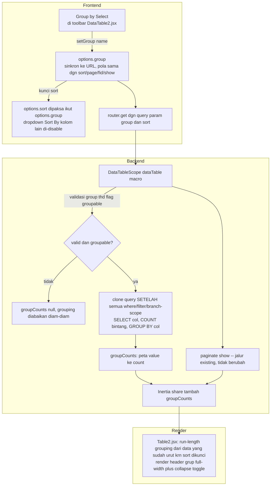

# Design Document: DataTable2 Grouping

## Overview

Fitur *group-by* pada `DataTable2`: user pilih 1 kolom (opt-in, ditandai `groupable: true` per model) untuk mengelompokkan baris tabel. Backend menghitung jumlah baris per grup lewat query `GROUP BY` terpisah — akurat lintas **semua** data yang match filter aktif, bukan cuma baris di halaman yang sedang tampil. Baris sendiri tetap diambil lewat pagination biasa yang sudah ada (`Builder::paginate()`); spec ini **tidak** mengubah mekanisme fetch data. Selama grouping aktif, sort dikunci ke kolom grup supaya baris se-grup saling menempel dalam satu halaman.

**Keputusan brainstorming (lihat sesi sebelumnya) yang mengikat desain ini:**
1. Cakupan: opt-in per kolom (bukan otomatis untuk semua kolom `sortable`).
2. Backend menghitung count per grup (query `GROUP BY` tambahan), baris tetap flat-paginated.
3. Agregat: count saja untuk v1 (tanpa SUM/AVG kolom numerik).
4. Nesting: 1 level (single column) untuk v1.
5. Sort dikunci ke kolom grup selama grouping aktif.
6. Pagination existing **dipertahankan** — infinite scroll eksplisit di luar scope, dibahas terpisah kalau ada kebutuhan nyata.
7. Tambahan hasil review design: backend juga digate untuk `sortable` — sebelumnya `?sort=` tidak divalidasi sama sekali terhadap `dataTableColumns`, kolom manapun (termasuk yang eksplisit `sortable: false`) bisa dipaksa lewat URL langsung ke `orderBy()`. Gate ini pola-nya disamakan dengan gate `groupable` (§2a).

**Batasan yang disengaja (bukan bug):** karena baris tetap flat-paginated, grup dengan jumlah baris lebih besar dari ukuran halaman (`show`) bisa "terpotong" — header grup yang sama muncul lagi di halaman berikutnya. Angka count di header tetap akurat (dari backend), hanya representasi visualnya yang terpisah antar halaman.

## Architecture



Poin penting: **dua query terpisah** dijalankan hanya ketika `?group=` valid dan groupable — untuk 73+ halaman yang tidak pakai grouping, tidak ada overhead tambahan sama sekali (early-return sebelum clone/count).

## Components and Interfaces

### 1. Opt-in kolom — tidak ada file baru, extension point existing

`app/Traits/LinkModel.php` (`computeColumnsFlat()`) **tidak diubah**. Flag `groupable` cukup dideklarasikan per model lewat `$configColumns`/`$defaultConfigColumns` yang sudah jadi extension point standar untuk override `sortable`/`ignore`/dll:

```php
// Contoh: app/Models/Finances/Account.php — entry 'account_type' SUDAH ADA
// di $configColumns (dipakai utk valueTrans), tinggal ditambah groupable.
protected array $configColumns = [
    // ...entry lain tidak berubah...
    'account_type' => [
        'valueTrans' => 'finances.account.columns.account_type.options',
        'groupable'  => true,
    ],
];
```

Kolom tanpa flag ini punya `groupable` = `undefined`/absent → falsy di FE, tidak muncul di dropdown "Group by". Scope v1 dibatasi ke kolom flat model sendiri (bukan kolom relasi/`type: relation`) — grouping by relasi butuh resolve FK→label tambahan, di-skip untuk v1.

### 2. Backend — `app/Models/Scopes/DataTableScope.php`

Dua perubahan terpisah di macro `dataTable()` — gate `sortable` (hardening, berlaku SELALU) dan hitung count grup (opt-in, cuma jalan saat `?group=` dipakai).

#### 2a. Gate validasi `sortable` (baru — celah existing, bukan bagian asli desain grouping)

**Temuan saat review design**: resolusi sort existing (baris ~164-168) pakai `$request->input('sort')` **langsung** ke `orderBy()` tanpa validasi apapun terhadap flag `sortable` di `$dataTableColumns` — kolom yang eksplisit di-set `sortable: false` (atau kolom relasi/nested yang FE sendiri tidak pernah expose sebagai opsi sort) tetap bisa dipaksa lewat `?sort=` manual di URL. Gate ini menutup celah itu, pola validasinya disamakan dengan gate `groupable` di bawah — validasi dulu SEBELUM dipakai di query, dan diam-diam **fallback ke default sort kolom model** kalau tidak valid (bukan 422 — supaya bookmark/link lama dgn kolom yang belakangan di-nonaktifkan sortable-nya tidak error, cuma fallback halus):

```php
// GATE sortable (baru) — sebelumnya $sort request masuk orderBy() tanpa
// validasi sama sekali. Cuma validasi sumber USER-FACING (?sort= eksplisit
// atau sort bawaan saved filter) -- default kolom sort model (fallback)
// dipercaya begitu saja (developer-controlled, bukan input luar).
$requestedSort = $request->input('sort') ?? $appliedFilter?->sort;
$fallbackSort  = '-' . $query->getModel()::getDefaultSortColumn();

$sort = $fallbackSort;
if ($requestedSort) {
    $reqDirection = \str_starts_with($requestedSort, '-') ? 'desc' : 'asc';
    $reqKeyRaw    = $reqDirection === 'desc' ? \substr($requestedSort, 1) : $requestedSort;

    $sortConfig = collect($dataTableColumns)->firstWhere('name', $reqKeyRaw);
    $isSortable = $sortConfig && ($sortConfig['sortable'] ?? true) !== false;

    if ($isSortable) {
        $sort = $requestedSort;
    }
    // Tidak dikenal / eksplisit sortable:false / dotted path relasi (tidak
    // pernah match top-level 'name') -> diam-diam pakai $fallbackSort.
}
$sortDirection = \str_starts_with($sort, '-') ? 'desc' : 'asc';
$sortKeyRaw    = $sortDirection === 'desc' ? \substr($sort, 1) : $sort;
$sortKey       = $this->isTableIncluded($sortKeyRaw) ? $sortKeyRaw : "$nameOfTable.$sortKeyRaw";
$query         = $query->orderBy($sortKey, $sortDirection);
```

Menggantikan resolusi sort existing apa adanya (behavior lain — konvensi prefix `-`, prioritas `?sort=` > filter default > default model — tidak berubah, cuma nambah gate di tengah).

#### 2b. Hitung count per grup (opt-in, groupable)

Disisipkan tepat sebelum `$paginator = $query->paginate($show);` (baris ~261), setelah semua constraint (branch scope, filter, submitable) sudah ter-apply ke `$query`:

```php
// Grouping (opt-in) — hitung count per grup lewat query TERPISAH, pakai
// WHERE/filter/branch-scope yang SAMA (clone $query di titik ini, setelah
// semua constraint di atas ter-apply). Validasi thd flag `groupable`
// eksplisit (bukan `sortable`) -- grouping mengubah bentuk query (GROUP BY),
// harus sengaja diaktifkan per kolom, beda dari sort yang cuma ORDER BY.
$groupCounts = null;
$groupColumn = $request->input('group');
if ($groupColumn) {
    $groupConfig = collect($dataTableColumns)->firstWhere('name', $groupColumn);
    $isGroupable = $groupConfig
        && ($groupConfig['groupable'] ?? false)
        && ($groupConfig['type'] ?? null) !== 'relation';

    if ($isGroupable) {
        $groupCol = $this->isTableIncluded($groupColumn) ? $groupColumn : "$nameOfTable.$groupColumn";

        $countQuery = clone $query;
        $countQuery->getQuery()->orders = [];
        $countQuery->setEagerLoads([]);

        $groupCounts = $countQuery
            ->select($groupCol)
            ->selectRaw('COUNT(*) as aggregate_count')
            ->groupBy($groupCol)
            ->pluck('aggregate_count', Str::afterLast($groupCol, '.'))
            ->all();
    }
}
$paginator = $query->paginate($show);
```

Lalu tambahkan `'groupCounts' => $groupCounts` ke array `Inertia::share([...])` (baris ~269-279) — `null` ketika grouping tidak aktif/tidak valid, tidak ada perubahan untuk pemakai existing.

> **Catatan implementasi (untuk fase task/coding):** perilaku `clone` pada `Illuminate\Database\Eloquent\Builder` (apakah query builder internal ikut ter-clone independen) perlu diverifikasi lewat test — bukan diasumsikan dari dokumentasi. Test di §Testing Strategy (group count query menghormati filter aktif) akan menangkap kalau asumsi ini salah.

### 3. Frontend state & toolbar — `resources/js/Pages/Core/DataTable2.jsx`

Tambah setter baru, sejajar `setSort`/`setShowNumber` yang sudah ada:

```js
const setGroup = useCallback((name) => {
  setOptions((prev) => ({
    ...prev,
    group: name || null,
    // Kunci sort ke kolom grup selama grouping aktif -- baris se-grup
    // harus nempel dalam satu halaman (lihat Architecture). Matikan
    // grouping (name falsy) TIDAK auto-reset sort, biar user lanjut
    // dari posisi sort terakhir.
    sort: name ? name : prev.sort,
    page: 1,
  }));
}, []);
```

`options.group` ikut ke `QueryString.stringify(options)` di `loadData()` otomatis (sudah generic, tidak perlu ubah). Destructure props tambahan `groupCounts` dari `usePage().props`.

UI: `Select` baru persis di sebelah "Sort By" existing (baris ~611-667), opsi dari `columns.filter(x => x.groupable)`, plus 1 opsi "Tidak ada" (value kosong) buat matikan grouping. Selama `options.group` truthy, `Select` Sort By (pemilih KOLOM, bukan tombol arah) diberi `disabled` — tombol arah asc/desc tetap aktif. Pola sama direplikasi di submenu mobile (`DropdownMenuSub` "Sorting" yang sudah ada, baris ~515-568) sebagai submenu "Group by" baru.

`<Table2 .../>` (baris ~707-717) dapat 2 prop baru: `groupBy={options.group}` dan `groupCounts={groupCounts}`.

### 4. Render grup — `resources/js/Components/Table/Table2.jsx`

Props baru: `groupBy` (nama kolom atau `null`), `groupCounts` (object `{value: count}`). State baru: `const [collapsedGroups, setCollapsedGroups] = useState(() => new Set())`.

Karena `data` sudah ter-urut per kolom grup (sort dikunci di §3), deteksi batas grup pakai **run-length** — bandingkan value grup baris sekarang vs baris sebelumnya, TIDAK re-sort di client:

```js
const groupedRows = useMemo(() => {
  if (!groupBy) return data.map((row) => ({ row }));
  let lastValue;
  return data.flatMap((row, i) => {
    const value = row[groupBy];
    const isNewGroup = i === 0 || value !== lastValue;
    lastValue = value;
    return isNewGroup
      ? [{ groupHeader: value, key: `group-${value}-${i}` }, { row }]
      : [{ row }];
  });
}, [data, groupBy]);
```

Baris header grup di-render full-width persis pola baris "no data"/footer yang sudah ada (`gridColumn: span N`, N = `showedColumns.length + (selectable?1:0) + (actions?1:0)`), dengan chevron toggle collapse dan label count dari `groupCounts[groupHeader]` (bukan dihitung dari rows di halaman ini — itu yang bikin count akurat meski grup terpotong pagination). Baris data yang grup-nya ada di `collapsedGroups` di-skip render-nya (tetap ada di DOM tree logic, cuma tidak di-map jadi `<tr>`).

Collapse state **tidak** persist ke cookie/localStorage untuk v1 — reset tiap reload/navigasi, cukup untuk kebutuhan sekarang (YAGNI).

## Data Models

Tidak ada migration/perubahan skema database. Perubahan murni di layer konfigurasi kolom (PHP `$configColumns` array, in-memory) dan response shape Inertia (`groupCounts` — prop baru, opsional, `null` ketika tidak dipakai).

| Prop/Field | Tipe | Sumber | Keterangan |
|---|---|---|---|
| `dataTableColumns[].groupable` | `bool` (opsional) | `$configColumns` per model | Default absent/false — opt-in eksplisit |
| `?group=` (query param) | `string` | URL, sinkron dgn `options.group` FE | Sama pola dgn `?sort=`/`?page=`/`?fid=`/`?show=` |
| `groupCounts` (Inertia shared prop) | `{[value: string]: number} \| null` | `DataTableScope::dataTable()` | `null` kalau grouping tidak aktif/tidak valid |

## Correctness Properties

**Property 1 — Count akurat lintas halaman**
_For any_ grup dengan total N baris yang match filter aktif (N boleh lebih besar dari `show`), `groupCounts[value]` SHALL sama dengan N, terlepas dari di halaman mana baris-baris grup itu muncul.

**Property 2 — Opt-in tervalidasi, bukan trust-the-client**
_For any_ request dengan `?group=<kolom>` di mana `<kolom>` TIDAK punya `groupable: true` di `dataTableColumns` model tsb (termasuk kolom relasi), `groupCounts` SHALL `null` dan query `GROUP BY` tambahan SHALL tidak dijalankan sama sekali — request diperlakukan seakan tidak ada `?group=`.

**Property 3 — Filter tetap konsisten antara rows dan count**
_For any_ kombinasi filter aktif (`?fid=` atau default shared filter) DAN branch scope aktif, `groupCounts` SHALL dihitung dari row-set yang SAMA persis dengan yang menghasilkan `data.data` (paginator) — tidak ada grup/baris yang ikut ter-count padahal sudah ter-filter-out, atau sebaliknya.

**Property 4 — Zero overhead untuk pemakai existing**
_For any_ request ke halaman DataTable2 TANPA `?group=`, tidak ada query `GROUP BY` tambahan yang dijalankan — behavior dan jumlah query identik dengan sebelum spec ini.

**Property 5 — Gate sortable tidak bisa dilewati**
_For any_ request dengan `?sort=<kolom>` di mana `<kolom>` TIDAK ada di `dataTableColumns` model tsb, ATAU ada tapi `sortable: false`, ATAU berupa dotted path relasi — query `orderBy()` SHALL memakai default sort kolom model (`Model::getDefaultSortColumn()`), TIDAK memakai `<kolom>` yang diminta. Berlaku juga untuk sort yang datang dari saved filter (`$appliedFilter->sort`), bukan cuma `?sort=` eksplisit.

## Error Handling

| Scenario | Behavior |
|---|---|
| `?sort=` menunjuk kolom yang tidak ada di `dataTableColumns`, atau `sortable: false`, atau dotted path relasi | Diam-diam fallback ke default sort kolom model (bukan 422) — sama filosofi dgn gate `groupable`: request user tidak pernah bikin error 500/422 untuk kesalahan link/bookmark |
| `?group=` menunjuk kolom yang tidak ada di `dataTableColumns` | `groupCounts = null`, grouping diabaikan diam-diam (bukan 422) — konsisten dengan cara `visibleKeys`/kolom tak dikenal ditangani di macro yang sama |
| `?group=` menunjuk kolom relasi (`type: relation`) meski developer keliru set `groupable: true` di config relasi | Ditolak di validasi (`$groupConfig['type'] !== 'relation'`) — grouping by relasi eksplisit out-of-scope v1 |
| User pilih kolom Sort By lain selagi grouping aktif | Tidak mungkin dari UI (dropdown kolom di-disable) — tapi kalau `?sort=` beda dikirim manual via URL, baris se-grup akan tampak tidak nempel (bukan crash, cuma visual kurang rapi) — didokumentasikan sebagai known edge-case, tidak di-enforce di backend |
| Grup terpotong ke halaman berikutnya (count > `show`) | Header grup sama muncul lagi — disengaja, lihat §Overview |

## Testing Strategy

**Backend (Feature test baru, mis. `tests/Feature/Models/Scopes/DataTableScopeGroupingTest.php`)**
- Gate sortable — `?sort=<kolom sortable:false>` → hasil TETAP terurut default sort model, bukan kolom yang diminta (Property 5).
- Gate sortable — `?sort=<kolom tidak dikenal / dotted path relasi>` → fallback default, TIDAK 500/422.
- Gate sortable — regression: `?sort=<kolom sortable>` normal (existing behavior) tetap bekerja seperti biasa.
- Request `?group=<kolom groupable>` → `groupCounts` akurat, mencocokkan `COUNT(*)` manual per grup di DB seed test.
- Request `?group=<kolom TIDAK groupable>` → `groupCounts` null, tidak ada query `GROUP BY` (assert via `DB::listen`/query count).
- Request `?group=<kolom relasi>` → ditolak (null), meski di-paksa `groupable: true` di config test.
- `?group=` dikombinasikan dengan `?fid=<filter>` aktif → `groupCounts` cuma menghitung baris yang lolos filter (Property 3).
- Request TANPA `?group=` → jumlah query SQL identik sebelum/sesudah perubahan (Property 4, regression guard).

**Frontend (`Table2.rtl.test.jsx` / `Table2.dom.test.js` — tambah kasus baru)**
- `groupBy` + `groupCounts` diberikan → render N header grup sesuai run-length data, label count dari `groupCounts` (bukan dihitung dari `data.length` per grup).
- Klik toggle collapse → baris grup itu hilang dari DOM, header tetap ada; toggle lagi → baris muncul kembali.
- `groupBy` null/absent → tidak ada baris header grup sama sekali (regression guard untuk 73+ halaman existing).
- Data dengan grup yang sama muncul di 2 "batch" terpisah (simulasi grup terpotong halaman) → 2 header grup terpisah dirender, keduanya pakai count yang SAMA dari `groupCounts` (bukan dihitung ulang per batch).

**Frontend (`DataTable2.rtl.test.jsx`)**
- Pilih kolom di dropdown "Group by" → `options.sort` ikut berubah ke kolom itu, dropdown Sort By (pemilih kolom) jadi `disabled`.
- Pilih "Tidak ada" di Group by → grouping mati, `options.sort` TIDAK auto-reset (tetap di posisi terakhir).
