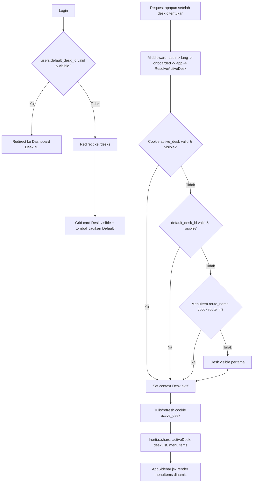
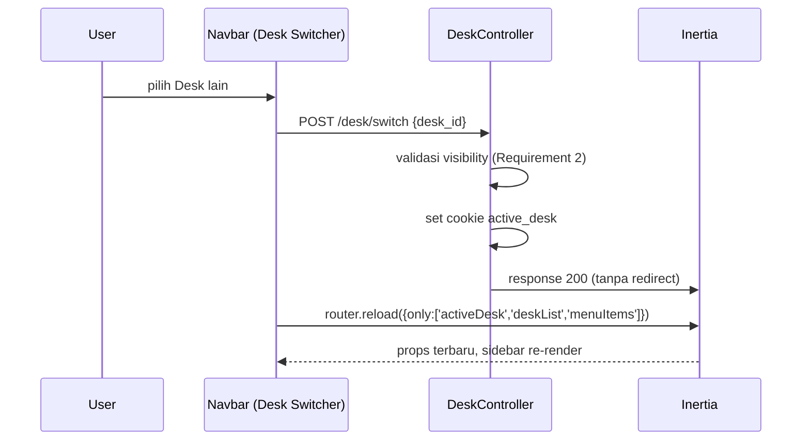

# Design Document: Desk-Based UI

## Overview

Solusi memperkenalkan entity **Desk** (workspace, mirip ERPNext) sebagai layer presentasi navigasi di atas struktur route/permission yang sudah ada. Tidak ada route existing yang berubah — Desk murni menentukan **apa yang ditampilkan di sidebar** dan **link mana dashboard**, disimpan sebagai preferensi lewat cookie `active_desk`.

Pola utama:
- Middleware baru `ResolveActiveDesk` (mengikuti pola `AppMiddleware`/`EnsureUserIsOnboarded` existing) menentukan Desk aktif per-request dan men-share hasilnya ke Inertia.
- `menu_items` & `desks` fully dynamic di DB (bukan config PHP) — `AppSidebar.jsx` berhenti membaca `navList` hardcoded, sebagai gantinya merender prop dari server.
- `checkPermission()` di client (`NavMain.jsx`) **tidak diubah** — tetap jalan sebagai filter, karena data yang dikirim server sudah dalam bentuk yang sama (`{ title, icon, url, model, items[] }`) seperti `navList` sekarang.
- Dashboard per Desk reuse model `Dashboard`/`DashboardWidget` existing (`app/Models/Core/Dashboard.php`), hanya menambah kolom penaut `desks.dashboard_id`.

## Architecture



### Desk Switch (manual)



## Components and Interfaces

### Backend — Models

**`app/Models/Core/Desk.php`** (baru)
```php
class Desk extends Model {
    use DataTable, HasUlids, SoftDeletes;

    protected $guarded = ['id'];
    protected $casts = ['type' => DeskType::class, 'domain' => Domain::class];

    public function menuItems() {
        return $this->belongsToMany(MenuItem::class, 'desk_menu_item')
            ->withPivot(['order', 'icon'])
            ->orderByPivot('order');
    }
    public function owner() { return $this->belongsTo(User::class, 'owner_id'); }
    public function dashboard() { return $this->belongsTo(Dashboard::class); }
    public function users() { return $this->belongsToMany(User::class, 'desk_user'); }
    public function roles() { return $this->belongsToMany(Role::class, 'desk_role'); }
}
```
`DeskType` enum: `System`, `Custom` (TitleCase key sesuai konvensi PHP project). `Domain` enum sudah perlu dibuat baru (`app/Enums/Domain.php`) — Core/Sales/Purchase/Inventory/Finances/Service/Helpdesk/User/Migration.

**`app/Models/Core/MenuItem.php`** (baru)
```php
class MenuItem extends Model {
    use HasUlids, SoftDeletes;

    protected $guarded = ['id'];

    public function parent() { return $this->belongsTo(MenuItem::class, 'parent_id'); }
    public function children() { return $this->hasMany(MenuItem::class, 'parent_id')->orderBy('order'); }
    public function primaryDesk() { return $this->belongsTo(Desk::class, 'primary_desk_id'); }
    public function desks() {
        return $this->belongsToMany(Desk::class, 'desk_menu_item')->withPivot(['order', 'icon']);
    }
}
```

`MenuItem` **tidak** memakai trait `DataTable` — bukan resource yang dikelola lewat CRUD generik `Core/DataTable.jsx`; dikelola lewat halaman admin Desk Builder (di luar scope UI CRUD generik, lihat Requirement 3).

### Backend — Service resolusi Desk

**`app/Services/Core/Desk/DeskResolverService.php`** (baru)

```php
class DeskResolverService {
    public function resolve(Request $request, User $user): Desk {
        return $this->fromCookie($request, $user)
            ?? $this->fromUserDefault($user)
            ?? $this->fromCurrentRoute($request, $user)
            ?? $this->firstVisible($user);
    }

    public function visibleDesksFor(User $user): Collection { /* Requirement 2 */ }

    private function fromCookie(Request $request, User $user): ?Desk { /* ... */ }
    private function fromUserDefault(User $user): ?Desk { /* ... */ }
    private function fromCurrentRoute(Request $request, User $user): ?Desk {
        $routeName = $request->route()?->getName();
        $menuItem = MenuItem::where('route_name', $routeName)->first();

        return $menuItem ? $this->visible($menuItem->primaryDesk, $user) : null;
    }
    private function firstVisible(User $user): Desk { /* ... */ }
}
```

Method `visibleDesksFor()` dipakai baik oleh `DeskResolverService::resolve()` (validasi visibility) maupun `DeskController::index()` (grid `/desks`) — satu sumber logic Requirement 2, tidak diduplikasi.

**Keputusan yang direvisi**: fallback "match by model dari route/controller" (opsi 4.3.4 di draf awal) **dihapus dari scope**. Base `Controller::$model` (FQCN model saat ini) hanya ter-isi SETELAH constructor controller selesai dieksekusi, sedangkan middleware `ResolveActiveDesk` (route middleware biasa) berjalan SEBELUM controller di-instantiate — deteksi model dari route tidak bisa dilakukan di titik itu tanpa mengubah middleware jadi pola "after" yang tidak konsisten dengan middleware lain (`app`, `onboarded`). Sebagai gantinya, **kelengkapan pendaftaran `MenuItem.route_name`** (termasuk route non-index seperti `.show`/`.edit`) menjadi tanggung jawab data seeder (Requirement 4 AC 4) — resolusi tetap murni berbasis `route_name`, tanpa deteksi model runtime.

### Backend — Middleware

**`app/Http/Middleware/ResolveActiveDesk.php`** (baru)

```php
class ResolveActiveDesk {
    public function __construct(private DeskResolverService $resolver) {}

    public function handle(Request $request, Closure $next): Response {
        $user = $request->user();
        if (! $user) {
            return $next($request);
        }

        $desk = $this->resolver->resolve($request, $user);
        Cookie::queue('active_desk', $desk->id, 60 * 24 * 30);

        Inertia::share([
            'activeDesk' => $desk->only(['id', 'name', 'icon', 'color']),
            'deskList'   => $this->resolver->visibleDesksFor($user)
                ->map->only(['id', 'name', 'icon', 'color']),
            'menuItems'  => $this->buildMenuTree($desk, $user),
        ]);

        return $next($request);
    }
}
```

Registrasi di `bootstrap/app.php` — tambah alias `'desk' => ResolveActiveDesk::class` lalu append ke grup middleware yang sama dengan `app`/`onboarded` pada `routes/web.php` (bukan `$middleware->web(append:...)` global, karena `ResolveActiveDesk` butuh user ter-autentikasi — mengikuti pola `app`/`onboarded` yang didaftarkan sebagai alias lalu dipakai per-grup route, bukan `HandleInertiaRequests` yang global).

`buildMenuTree($desk, $user)` menghasilkan struktur **identik bentuknya** dengan `navList` existing (`{ title, icon, url, urlPattern, model, items: [...] }`) agar `NavMain.jsx` tidak perlu diubah sama sekali — hanya sumber datanya (`AppSidebar.jsx`) yang berubah dari konstanta ke prop. Filter permission (Requirement 2 AC 4) dilakukan di sini: item yang modelnya tidak accessible oleh `PermissionChecker::forUser($request)` di-exclude sebelum dikirim.

**Resolusi `icon`**: `menu_items.icon` disimpan sebagai **nama string** (mis. `"PackageIcon"`), bukan JSX. `buildMenuTree()` mengirim string ini; frontend melakukan lookup ke map nama→komponen `lucide-react` (lihat bagian Frontend) — pola ini diperlukan karena `navList` saat ini menyimpan elemen JSX langsung di const JS, sedangkan data dari DB tidak bisa membawa JSX.

**Resolusi `route_name` → `url`**: `buildMenuTree()` memanggil `route($menuItem->route_name)` di server untuk menghasilkan `url` final yang dikirim ke frontend — `MenuItem` menyimpan nama route (stabil terhadap perubahan path), payload ke frontend tetap membawa URL absolut siap pakai seperti `navList` sekarang.

### Backend — Controller

**`app/Http/Controllers/Core/DeskController.php`** (baru) — TIDAK extends base `Controller` abstract (permission-check generiknya didesain untuk CRUD model standar `index/store/update/destroy`, tidak cocok untuk endpoint custom `switch`/`setDefault` yang aturan visibility-nya sendiri, bukan permission model biasa).
- `index()` — Inertia render `Core/DeskList`, props: `visibleDesksFor($request->user())` lengkap dengan flag `isDefault` per desk.
- `store(Request $request)` — `POST /desks`. Dua mode dalam satu endpoint (Requirement 3 AC 5): TANPA `role_id` → Desk personal (`owner_id` = user, tanpa gate). DENGAN `role_id` → Desk role-scoped (`owner_id` null, langsung `attach()` ke role), WAJIB gate `PermissionChecker->can(Desk::class, Permission::Create)` sebelum insert, gagal → 403.
- `switch(Request $request)` — `POST /desk/switch`, body `{desk_id}`. Validasi desk termasuk `visibleDesksFor()`, kalau tidak → 403 (Requirement 2 tidak boleh dilanggar lewat endpoint ini). Set cookie via `back()->withCookie(...)`.
- `setDefault(Request $request, Desk $desk)` — `POST /desk/{desk}/default`. Validasi visibility sama seperti `switch()`. Update `users.default_desk_id`.
- `storeRoleScoped(Request $request, Desk $desk)` — `POST /desk/{desk}/roles`. Assign Desk **existing** ke role tambahan (beda dari `store()` dengan `role_id` yang membuat Desk **baru**) — sama-sama wajib gate permission `create`.

**Modifikasi `app/Http/Controllers/Auth/AuthenticatedSessionController.php`** (lokasi persis dikonfirmasi saat implementasi — controller Breeze yang menangani `store()` login): setelah autentikasi berhasil, cek `default_desk_id` user (Requirement 5 AC 1-2) sebelum redirect ke `/dashboard-view` seperti sekarang — ganti target redirect kondisional.

### Backend — Permission gate Desk custom role-scoped

`Desk` memakai trait `DataTable`, terdaftar otomatis sebagai model permission — **fully otomatis**, tanpa kode tambahan: `PermissionSeeder::run()` men-scan seluruh class di namespace `App\Models` yang pakai trait `DataTable` (lewat `class_uses_recursive()`) dan memanggil `$className::initPermissions()` untuk tiap satu (`app/Traits/DataTable.php:464`) — begitu `Desk` pakai trait ini, `Desk` otomatis eligible diberi `RolePermission` seperti model lain, tanpa entri manual di seeder. Endpoint yang mengisi pivot `desk_role` (`store()` mode role-scoped, `storeRoleScoped()`) memanggil `new PermissionChecker(AppMiddleware::resolvePermissionsFor($user->id))->can(Desk::class, Permission::Create)` sebelum eksekusi — **bukan** `PermissionChecker::forUser($request)` (method itu resolve dari `$request->user()`/session aktif, cocok untuk request user yang sedang login memeriksa dirinya sendiri, tapi konstruksi manual lebih eksplisit di titik gate 403 ini); gagal → 403 (Requirement 3 AC 3-4). Endpoint pembuatan Desk personal **tidak** memanggil check ini sama sekali (Requirement 3 AC 1).

### Backend — Pengecualian resolusi untuk route Desk sendiri

`ResolveActiveDesk::handle()` mengecek `$request->route()?->getName()` di awal: bila nama route diawali `desk.` atau `desks.`, middleware langsung `return $next($request)` TANPA memanggil `DeskResolverService::resolve()` (Requirement 4 AC 2 pengecualian). Ini krusial untuk `desks.store` (Requirement 3 AC 5) — endpoint pembuatan Desk personal pertama harus tetap bisa diakses oleh user yang **belum** memiliki Desk visible sama sekali; mewajibkan resolusi di titik ini membuat `DeskResolverService::firstVisible()` melempar exception (lihat Error Handling) sebelum request sempat mencapai `DeskController::store()`.

### Frontend

**`resources/js/Pages/Core/DeskList.jsx`** (baru) — grid card, tiap card: icon (lookup dari map, sama seperti sidebar), nama, warna latar, badge "Default" bila `isDefault`, button "Jadikan Default" (`router.post(route('desk.setDefault', desk.id))`) disembunyikan/disabled bila sudah default. Klik card (selain button) → `router.post(route('desk.switch'), {desk_id})` lalu `router.visit()` ke dashboard desk tsb.

**`resources/js/lib/deskIcons.js`** (baru) — object map `{ PackageIcon, Boxes, HandCoins, ... } ` dari `lucide-react`, re-export nama yang sama dengan yang dipakai `AppSidebar.jsx` saat ini (lihat daftar import baris 4-15 file itu) supaya migrasi data seeder (Requirement 1 AC 8) tidak perlu memetakan ulang nama icon.

**`resources/js/Components/Sidebar/AppSidebar.jsx`** (modifikasi) — hapus const `navList`; ambil `menuItems` dari `usePage().props`, resolve tiap `item.icon` (string) lewat `deskIcons.js` jadi elemen sebelum diteruskan ke `NavMain`. `NavMain.jsx` **tidak diubah** (kontrak props sudah sama).

**`resources/js/Components/Sidebar/DeskSwitcher.jsx`** (baru) — dropdown (pola mirip `BranchSwitcher.jsx` existing yang sudah ada di folder Sidebar — reuse struktur komponennya), list `deskList` dari props, on-select → `switch()` + `router.reload({ only: ['activeDesk', 'deskList', 'menuItems'] })`. Ditempatkan di `Navbar.jsx`.

**`Navbar.jsx`** (modifikasi, tombol Home — Requirement 6 AC 5) — tambah `<Link href={route('desks.index')}>` berisi icon `Home` (lucide-react), ditempatkan sebelum `breadcrumbsMenu` (baris rendering breadcrumb di `Navbar.jsx:145`), di luar `BreadcrumbList` — bukan sebagai `BreadcrumbItem` pertama, karena secara semantik ini aksi "kembali ke Desk", bukan node hirarki breadcrumb halaman saat ini.

**Dashboard per Desk**: halaman dashboard existing (`resources/js/Pages/Dashboard/Dashboard.jsx`) menerima `dashboard` yang di-resolve dari `desk.dashboard_id` (dibuatkan Controller dashboard, bukan komponen baru) — tidak ada perubahan pada komponen widget itu sendiri.

## Data Models

```
desks
├─ id (ulid, PK)
├─ name (string)
├─ icon (string)                      -- nama komponen lucide-react
├─ color (string, nullable)
├─ domain (string enum, nullable)     -- Core|Sales|Purchase|Inventory|Finances|Service|Helpdesk|User|Migration
├─ type (string enum)                 -- system|custom
├─ owner_id (ulid FK users, nullable)
├─ dashboard_id (ulid FK dashboards, nullable)
├─ deleted_at, created_at, updated_at

menu_items
├─ id (ulid, PK)
├─ label (string)
├─ icon (string)
├─ route_name (string)
├─ model (string, nullable)           -- FQCN, mis. "App\Models\Inventory\Item"
├─ parent_id (ulid FK menu_items, nullable)
├─ order (integer)
├─ primary_desk_id (ulid FK desks)
├─ deleted_at, created_at, updated_at

desk_menu_item
├─ desk_id (ulid FK desks, cascade on delete)
├─ menu_item_id (ulid FK menu_items, cascade on delete)
├─ order (integer)
├─ icon (string, nullable)            -- override tampilan, fallback ke menu_items.icon

desk_user
├─ desk_id (ulid FK desks, cascade on delete)
├─ user_id (ulid FK users, cascade on delete)

desk_role
├─ desk_id (ulid FK desks, cascade on delete)
├─ role_id (ulid FK roles, cascade on delete)

users (tambah kolom)
├─ default_desk_id (ulid FK desks, nullable, nullOnDelete)
```

**Catatan `nullOnDelete` vs cascade**: `users.default_desk_id` pakai `nullOnDelete()` (Requirement 1 AC 7 — di-null-kan, bukan ikut terhapus/error). Pivot `desk_menu_item`/`desk_user`/`desk_role` pakai `cascade` penuh (Requirement 1 AC 6 — baris pivot memang harus lenyap bersama Desk-nya, beda konteks dari kolom FK di `users`).

## Correctness Properties

**Property 1 — Fallback chain deterministik dan berhenti di langkah pertama valid.**
_For any_ user U dan request R, `DeskResolverService::resolve(R, U)` SHALL selalu mengembalikan tepat satu `Desk` yang visible bagi U (per Requirement 2), dan Desk tersebut SHALL sama dengan Desk pada langkah pertama (cookie → default → route-name → first-visible) yang menghasilkan Desk valid & visible — tidak pernah melompat ke langkah berikutnya bila langkah lebih awal sudah valid.
**Validates: Requirement 4**

**Property 2 — Visibility Desk system derived, bukan disimpan.**
_For any_ Desk D bertipe `system` dan user U, U dapat melihat D **jika dan hanya jika** U memiliki permission terhadap minimal satu `MenuItem` yang `desks()`-nya memuat D — tidak ada state tersimpan lain yang menentukan ini (tidak ada baris `desk_user`/`desk_role` untuk Desk system).
**Validates: Requirement 2**

**Property 3 — Idempotensi penulisan cookie.**
_For any_ dua request berurutan R1, R2 dari user U yang sama tanpa aksi switch/setDefault di antaranya, `resolve(R1, U)` dan `resolve(R2, U)` SHALL menghasilkan Desk yang sama (cookie hasil R1 membuat R2 langsung valid di langkah pertama).
**Validates: Requirement 4**

**Property 4 — Gate permission tidak bisa dilewati lewat endpoint mana pun.**
_For any_ user U tanpa permission `create` pada model `Desk`, tidak ada endpoint (`DeskController::store`/`update` untuk role-scoped) yang menghasilkan baris baru pada pivot `desk_role` akibat aksi U — percobaan tersebut SHALL selalu berakhir 403 sebelum baris ditulis.
**Validates: Requirement 3**

## Error Handling

| Scenario | Behavior |
|---|---|
| Cookie `active_desk` menunjuk Desk yang sudah dihapus/soft-deleted | `fromCookie()` mengembalikan `null` (query exclude soft-deleted secara default) → lanjut ke langkah fallback berikutnya, transparan, tidak ada error ke user |
| `users.default_desk_id` menunjuk Desk yang dihapus atau assignment dicabut | Di-null-kan oleh observer/event `Desk` deleting & saat pivot `desk_user`/`desk_role` milik user tsb dihapus — bukan dicek ulang tiap request (Requirement 1 AC 7) |
| Tidak ada satu pun langkah fallback yang berhasil (termasuk `firstVisible()` kosong — user benar-benar tanpa Desk accessible) | `DeskResolverService::firstVisible()` tetap melempar `\RuntimeException` deskriptif (fail-fast di level service, membantu development/debugging saat setup role baru). **Namun di level middleware `ResolveActiveDesk`, exception ini di-catch** dan diperlakukan sebagai kondisi non-fatal — request tetap lanjut ke `$next()` TANPA konteks Desk (props `activeDesk`/`deskList`/`menuItems` tidak di-share). **Ditemukan selama implementasi**: karena middleware `desk` didaftarkan di grup route besar yang dipakai HAMPIR SEMUA route existing, melempar exception keras di titik ini akan memblokir seluruh test suite/fitur lain yang tidak setup data Desk — bukan hanya fitur Desk itu sendiri. Graceful-skip ini adalah fix untuk regresi tersebut, bukan desain awal |
| `POST /desk/switch` dengan `desk_id` yang tidak visible bagi user | 403 |
| `POST /desk/{desk}/default` dengan Desk yang tidak visible bagi user | 403 |
| User tanpa permission `Desk.create` mencoba assign `desk_role` | 403, tidak ada baris ditulis (Property 4) |
| `MenuItem` merujuk `route_name` yang sudah tidak terdaftar di `routes/web.php` (route dihapus tapi menu_item lupa dibersihkan) | `route($menuItem->route_name)` melempar exception Laravel standar (`RouteNotFoundException`) — item tersebut SHALL difilter dari `buildMenuTree()` (try/catch per-item, log warning), bukan menggagalkan seluruh render sidebar |

## Testing Strategy

- **Unit Tests**
  - `DeskResolverServiceTest` — tiap langkah fallback (Property 1, Property 3) diuji terisolasi dengan mock/fixture cookie, user, route.
  - `Desk`/`MenuItem` model — relasi pivot, `visibleDesksFor()` untuk kombinasi system/custom-personal/custom-role (Property 2).
- **Property-Based Tests**
  - Property 1 (fallback deterministik): generate kombinasi acak (cookie valid/invalid × default valid/invalid × route match/tidak) — hasil resolve harus selalu match langkah pertama yang valid.
  - Property 4 (gate permission): generate user dengan/tanpa permission `Desk.create`, pastikan tidak ada jalur yang menulis `desk_role` tanpa gate lolos.
- **Integration/Feature Tests**
  - `ResolveActiveDeskTest` — request end-to-end lewat middleware, assert cookie & Inertia shared props.
  - `DeskVisibilityTest` — Requirement 2 AC 1-4, termasuk filter `MenuItem` per-permission di payload.
  - `DeskSwitcherTest`, `DeskDefaultTest` — endpoint `switch`/`setDefault`, termasuk kasus 403.
  - `NavbarHomeButtonTest` (atau cakupan test komponen React setara) — tombol Home mengarah ke `route('desks.index')` (Requirement 6 AC 5).
  - `LoginRedirectDeskTest` — Requirement 5 AC 1-2, login dengan/tanpa `default_desk_id` valid.
  - `DeskCreatePermissionTest` — Requirement 3 AC 3-4.
  - `DashboardPerDeskTest` — Requirement 7 AC 1-2, auto-create dashboard kosong.
