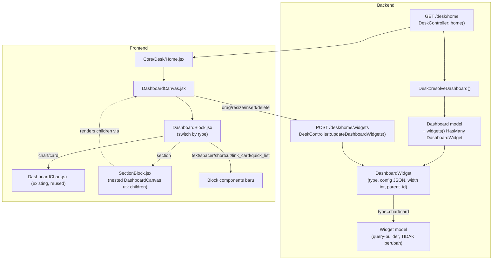

# Design Document: desk-dashboard-builder

## Overview

Spec ini melengkapi Desk-based UI dengan halaman *home* per-Desk berisi kanvas dashboard block-builder ala ERPNext Workspace. Tiga pilar perubahan:

1. **Skema**: `dashboard_widgets.type` diperluas dari 2 nilai implisit (`chart`/`card`, ditentukan lewat `Widget.type`) jadi 9 nilai eksplisit; `width` berubah dari enum `half`/`full` jadi integer grid-12; `parent_id` (sudah ada, idle) diaktifkan untuk nesting 2-level (`section` → `link_card` → `link_card_item`, ATAU `section` → block lain).
2. **Kanvas**: komponen React baru `DashboardCanvas` — grid CSS 12-kolom, drag-reorder + resize + drag-to-nest via `@dnd-kit` (pola yang sama persis dipakai di `DeskMenuItemManager.jsx` dan `Dashboard.jsx` existing), inserter "+" mengambang, config block inline (tanpa dialog terpisah).
3. **Wiring**: route baru `GET /desk/home` merender `Inertia::render('Core/Desk/Home', ...)` dengan `Desk::resolveDashboard()`, otorisasi edit mengikuti pola `hasWritePermission`/pemilik-Custom-Desk yang sudah dipakai `Desk/Form.jsx`.

Yang **tidak berubah**: model `Widget` dan query-builder-nya (`WidgetController::getChartData`), `DashboardChart.jsx` (dipakai apa adanya untuk render block `chart`/`card`), halaman `/dashboard-view` existing.

## Architecture



### Data Flow

1. User membuka Desk → middleware `ResolveActiveDesk` sudah men-share `activeDesk` (tidak berubah). User navigasi ke `/desk/home` (link baru di sidebar/header, di luar scope detail UI-nya — cukup route tersedia).
2. `DeskController::home()` ambil Desk aktif dari `activeDesk` (request attribute yang sudah di-set middleware, pola sama seperti method lain yang butuh Desk aktif), panggil `resolveDashboard()`, load `widgets` (eager load `widget` untuk baris `chart`/`card`).
3. Kanvas render tiap baris `DashboardWidget` lewat `DashboardBlock` — komponen switch tunggal yang mendelegasikan ke sub-komponen per `type`.
4. Perubahan (reorder/resize/insert/delete/nest) di-apply optimistic di client, lalu di-POST ke endpoint tunggal `updateDashboardWidgets` yang **full-replace** seluruh baris `DashboardWidget` milik Dashboard tersebut — pola yang sama dipakai `DeskController::store()/update()` untuk `menuItemPivots()` (delete lalu create ulang, lebih sederhana dari diff/upsert per baris).

## Components and Interfaces

### Backend

#### Migration 1 — perluas `dashboard_widgets`

```php
Schema::table('dashboard_widgets', function (Blueprint $table) {
    // width: 'half'/'full' (string) -> integer grid-12. Kolom baru dulu,
    // migrasi data, baru drop kolom lama — supaya downtime nol dan reversible.
    $table->unsignedTinyInteger('col_span')->default(12)->after('width');
});
```

Migration data (dalam migration yang sama, method `up()`):
```php
DB::table('dashboard_widgets')->where('width', 'half')->update(['col_span' => 6]);
DB::table('dashboard_widgets')->where('width', 'full')->update(['col_span' => 12]);
```

Migration 2 (terpisah, setelah data aman) — drop `width` lama, rename `col_span` → `width`:
```php
Schema::table('dashboard_widgets', function (Blueprint $table) {
    $table->dropColumn('width');
});
Schema::table('dashboard_widgets', function (Blueprint $table) {
    $table->renameColumn('col_span', 'width');
});
```
*(Dua migration terpisah karena SQLite/MySQL tidak selalu mengizinkan drop+rename dalam 1 `Schema::table` call yang sama secara aman lintas driver — ikuti pola migration existing di project yang memecah operasi destruktif.)*

`dashboard_widgets.type` tidak perlu migration terpisah (kolom `string` sudah ada sejak awal, nullable) — cukup validasi di `DashboardWidgetRequest` baru (lihat di bawah) dan dokumentasi enum di model.

#### Model: `DashboardWidget` (`app/Models/DashboardWidget.php`)

Tambahan:
```php
public function children(): HasMany {
    return $this->hasMany(DashboardWidget::class, 'parent_id')->orderBy('order');
}
```
`$casts['config']` sudah `Json::class` — tidak berubah, dipakai apa adanya untuk seluruh tipe baru.

Tambahkan konstanta tipe (dipakai validasi & guard nesting, hindari magic string tersebar). Karena aturan parent-child sekarang depth-aware (Requirement 1.6-1.11) — bukan lagi flag boolean tunggal "boleh jadi parent" — konstanta merepresentasikan tipe PARENT VALID untuk tiap tipe:

```php
public const TYPES_WITH_WIDGET = ['chart', 'card'];

/**
 * Requirement 1.7-1.10: peta tipe -> daftar tipe parent yang valid untuk
 * parent_id-nya. `null` di dalam array berarti root (parent_id kosong)
 * diperbolehkan. Array HANYA berisi [null] berarti WAJIB root (satu2nya
 * opsi valid) — BUKAN array kosong []: array kosong berarti TIDAK ADA
 * nilai parent_id yang valid sama sekali (termasuk root), yang salah
 * untuk section (ditemukan sebagai bug nyata saat test-driven
 * verification implementasi — lihat tasks.md 3.10-3.16).
 */
public const VALID_PARENTS = [
    'section'         => [null],             // Req 1.7: HANYA root, tidak ada opsi lain
    'link_card'       => [null, 'section'],  // Req 1.8: root ATAU child section
    'link_card_item'  => ['link_card'],      // Req 1.9: wajib child link_card
    'chart'           => [null, 'section'],
    'card'            => [null, 'section'],
    'text'            => [null, 'section'],
    'spacer'          => [null, 'section'],
    'shortcut'        => [null, 'section'],
    'quick_list'      => [null, 'section'],
];
```
`null` di dalam array `VALID_PARENTS[type]` berarti "root diperbolehkan" (bukan `null` sebagai nilai array itu sendiri) — dicek lewat `in_array(null, VALID_PARENTS[$type], true)`.

#### Model: `Desk` (`app/Models/Core/Desk.php`)

Tidak berubah — `resolveDashboard()` sudah ada, dipakai apa adanya (Requirement 4 AC 2).

#### Request baru: `App\Http\Requests\Core\DashboardWidgetRequest`

Menggantikan bagian `widgets.*` dari `DashboardRequest` KHUSUS untuk endpoint Desk Home (bukan mengubah `DashboardRequest` existing yang dipakai `Settings/Dashboard/Form.jsx` — dua form berbeda, dua request berbeda, agar perubahan skema tidak menyentuh CRUD Dashboard manual existing sampai spec lanjutan memutuskan menyatukannya).

```php
public function rules(): array {
    return [
        'widgets'                    => ['present', 'array'],
        'widgets.*.type'             => ['required', 'string', Rule::in([
            'chart', 'card', 'section', 'text', 'spacer', 'shortcut',
            'link_card', 'link_card_item', 'quick_list',
        ])],
        'widgets.*.widget.id'        => ['required_if:widgets.*.type,chart,card', 'nullable', new ExistsExcludingTrashed('widgets')],
        'widgets.*.config'           => ['nullable', 'array'],
        'widgets.*.width'            => ['required', 'integer', 'min:1', 'max:12'],
        'widgets.*.ref'              => ['nullable', 'string'], // id sementara row ini, dirujuk parent_ref row lain
        'widgets.*.parent_ref'       => ['nullable', 'string'], // ref milik row LAIN dalam payload yg sama (Requirement 1.6-1.11)
        'widgets.*.is_visible'       => ['nullable', 'boolean'],
    ];
}

/**
 * Requirement 1.6-1.11: validasi depth-aware, BUKAN sekadar 1 pasang
 * parent/child. Membangun peta ref->type dulu (butuh tau TIPE parent
 * untuk mengecek VALID_PARENTS row anaknya), lalu jalan sekali lagi
 * mengecek tiap row terhadap tabel DashboardWidget::VALID_PARENTS.
 */
public function withValidator($validator) {
    $validator->after(function ($validator) {
        $rows = $this->input('widgets', []);

        $typeByRef = collect($rows)
            ->filter(fn ($row) => ! empty($row['ref']))
            ->mapWithKeys(fn ($row) => [$row['ref'] => $row['type'] ?? null]);

        foreach ($rows as $idx => $row) {
            $type          = $row['type'] ?? null;
            $parentRef     = $row['parent_ref'] ?? null;
            $validParents  = DashboardWidget::VALID_PARENTS[$type] ?? [];
            $parentType    = $parentRef ? $typeByRef->get($parentRef) : null;
            $parentIsRoot  = $parentRef === null;

            $ok = $parentIsRoot
                ? in_array(null, $validParents, true)
                : in_array($parentType, $validParents, true);

            if (! $ok) {
                $validator->errors()->add(
                    "widgets.$idx.parent_ref",
                    "Block bertipe '$type' tidak boleh berada di dalam '" . ($parentType ?? 'root') . "'.",
                );
            }

            // Requirement 1.11: cegah rantai > 2 level — parent dari parent
            // (grandparent) HARUS root. Karena section (satu2nya tipe yg boleh
            // jadi grandparent lewat link_card) SUDAH divalidasi selalu root
            // (VALID_PARENTS['section'] = [null]), kombinasi ilegal manapun yang
            // mencoba bikin 3 level otomatis gagal di baris $ok di atas untuk
            // SALAH SATU baris dalam rantai tsb — tidak perlu walk eksplisit
            // terpisah, cukup pastikan setiap baris individual valid.
        }
    });
}
```

#### Controller: `DeskController` — 2 method baru

```php
/**
 * Requirement 4: Desk Home — landing page per-Desk, render Dashboard hasil
 * resolveDashboard(). Desk aktif diambil dari request attribute yang
 * di-set ResolveActiveDesk (pola sama seperti middleware men-share
 * activeDesk ke Inertia — di sini dipakai server-side langsung).
 */
public function home(Request $request) {
    $desk = $request->attributes->get('resolvedDesk'); // lihat catatan di ResolveActiveDesk di bawah
    $dashboard = $desk->resolveDashboard();
    // Eager-load 2 tingkat (Requirement 1.6: depth maksimal 2) — root ->
    // children (link_card / block lain di dalam section) -> grandchildren
    // (link_card_item di dalam link_card yang tadi ada di dalam section).
    $dashboard->load([
        'widgets' => fn ($q) => $q->whereNull('parent_id')
            ->with(['widget', 'children.widget', 'children.children.widget']),
    ]);

    $checker = PermissionChecker::forUser($request);
    $canEdit = ($desk->type === DeskType::Custom && $desk->owner_id === $request->user()->id)
        || $checker->can(Desk::class, Permission::Write);

    return Inertia::render('Core/Desk/Home', [
        'dashboard' => $dashboard,
        'canEdit'   => $canEdit,
    ]);
}

/**
 * Requirement 3, 5.3: full-replace seluruh baris DashboardWidget milik
 * Dashboard ini — pola sama seperti menuItemPivots() di store()/update()
 * DeskController (delete lalu create ulang, bukan diff/upsert).
 *
 * Requirement 1.6: kedalaman maksimal 2 level (section -> link_card ->
 * link_card_item, ATAU section -> block lain) berarti create HARUS 3
 * pass berurutan berdasar parent_ref — child pass-N butuh id hasil
 * create pass-(N-1) untuk resolve parent_id-nya sendiri via $refToId.
 */
public function updateDashboardWidgets(DashboardWidgetRequest $request) {
    $desk = $request->attributes->get('resolvedDesk');
    abort_unless($this->canEditDashboard($desk, $request), 403); // Requirement 5.3: validasi backend, bukan hanya sembunyikan kontrol FE

    $dashboard = $desk->resolveDashboard();
    $rows      = $request->validated('widgets');

    DB::beginTransaction();
    $dashboard->widgets()->delete();

    $refToId   = [];
    $createRow = function (array $row, int $order, ?string $parentId) use ($dashboard, &$refToId) {
        $created = $dashboard->widgets()->create([
            'type'       => $row['type'],
            'widget_id'  => $row['widget']['id'] ?? null,
            'config'     => $row['config'] ?? null,
            'width'      => $row['width'],
            'order'      => $order,
            'parent_id'  => $parentId,
            'is_visible' => $row['is_visible'] ?? true,
        ]);
        if (! empty($row['ref'])) {
            $refToId[$row['ref']] = $created->id;
        }
    };

    // Pass 1: root — section, dan block manapun yang tidak dinestingkan.
    foreach ($rows as $order => $row) {
        if (empty($row['parent_ref'])) {
            $createRow($row, $order, null);
        }
    }
    // Pass 2: level-1 — link_card di dalam section, ATAU block lain
    // (chart/text/shortcut/dst) di dalam section.
    foreach ($rows as $order => $row) {
        if (! empty($row['parent_ref']) && isset($refToId[$row['parent_ref']]) && ($row['type'] ?? null) !== 'link_card_item') {
            $createRow($row, $order, $refToId[$row['parent_ref']]);
        }
    }
    // Pass 3: level-2 — link_card_item. parent_ref-nya (menunjuk suatu
    // link_card) baru pasti tersedia di $refToId setelah pass 2 selesai,
    // karena link_card induknya bisa saja baru dibuat di pass 2 (kalau
    // link_card itu sendiri berada di dalam section).
    foreach ($rows as $order => $row) {
        if (($row['type'] ?? null) === 'link_card_item') {
            $createRow($row, $order, $refToId[$row['parent_ref']] ?? null);
        }
    }

    DB::commit();

    return response()->noContent();
}
```

*Catatan implementasi: `refToId` mem-resolve `ref` (string sementara dari client, mis. row id lokal sebelum tersimpan) ke ULID hasil `create()` — diperlukan karena payload dikirim flat dalam 1 request sementara child butuh id parent yang baru dibuat di request yang sama. 3-pass (bukan 2, karena kedalaman sekarang 2 level bukan 1) diperlukan KHUSUS untuk menangani `link_card` yang dirinya sendiri berada di dalam `section` — pass 2 membuat `link_card` tersebut, pass 3 baru bisa membuat `link_card_item`-nya. Pola id-sementara ini sama dengan yang dipakai `DeskMenuItemManager` untuk grup virtual baru, diperluas untuk depth 2.*

#### Middleware: `ResolveActiveDesk` — tambahan kecil

Tambahkan `$request->attributes->set('resolvedDesk', $desk);` setelah `$desk` di-resolve (baris tempat `Inertia::share` dipanggil) — supaya controller lain (termasuk `DeskController::home()`) bisa ambil Desk aktif tanpa re-resolve. Route `desk.*`/`desks.*` yang bypass middleware ini (baris awal method `handle()`) TIDAK terpengaruh karena `home()` bukan bagian dari grup itu (nama route barunya `desk.home`, tapi PATH `/desk/home` — perlu dicek tidak bentrok prefix bypass `str_starts_with($routeName, 'desk.')`; **karena memang akan match** prefix itu, route `desk.home` harus didaftarkan SEBELUM baris bypass di middleware, atau middleware perlu pengecualian eksplisit untuk `desk.home`). Keputusan: tambah pengecualian eksplisit di guard bypass:
```php
if ($routeName && $routeName !== 'desk.home' && (\str_starts_with($routeName, 'desk.') || \str_starts_with($routeName, 'desks.'))) {
    return $next($request);
}
```

#### Routes (`routes/web.php`, dalam grup `desk` middleware yang sudah ada)

```php
Route::get('/desk/home', [DeskController::class, 'home'])->name('desk.home');
Route::post('/desk/home/widgets', [DeskController::class, 'updateDashboardWidgets'])->name('desk.home.widgets');
```

### Frontend

#### `resources/js/Pages/Core/Desk/Home.jsx` (baru)

Halaman Inertia — terima `dashboard`, `canEdit` dari props. Bertanggung jawab state top-level (`widgets` array, optimistic update + rollback on error, pola identik `Dashboard.jsx` existing `handleWidgetReorder`).

#### `resources/js/Components/DashboardCanvas.jsx` (baru)

Props: `widgets`, `canEdit`, `onChange(widgets)`, `depth = 0` (baru — lihat catatan rekursi di bawah). Struktur:
- `DndContext` + `SortableContext` (`rectSortingStrategy`, sama seperti `Dashboard.jsx`) untuk drag-reorder blocks pada level ini (root ATAU di dalam satu `section`, tergantung siapa yang memanggil).
- Grid wrapper (Requirement 6): `<div className="grid grid-cols-1 gap-4 md:grid-cols-12">`, tiap block `<div className="col-span-1" style={{ '--col-span-md': block.width }}>` dengan CSS custom property yang di-apply lewat class Tailwind arbitrary-value `md:[grid-column:span_var(--col-span-md)]` — di bawah breakpoint `md`, `grid-cols-1` membuat SETIAP block otomatis 1 kolom penuh (Requirement 6.2, 6.5) terlepas dari `width` tersimpan, tanpa perlu logic JS kondisional terpisah (murni CSS, konsisten filosofi "native platform feature dulu"). Kontrol resize (`ResizeHandle`, lihat di bawah) di-render hanya `hidden md:flex` (Requirement 6.3) — reorder tetap aktif di semua breakpoint karena drag-handle terpisah dari resize-handle.
- Resize: handle drag di tepi kanan tiap block (native `pointerdown`/`pointermove`, bukan `@dnd-kit` — resize itu bukan drag-and-drop, cukup listener manual menghitung delta X terhadap lebar kolom grid, dibulatkan ke kelipatan `1/12`; pola serupa `resizer`/`init_drag` yang ada di source ERPNext `block.js`, diadaptasi native React tanpa jQuery).
- `InsertBlockButton` ("+", mengambang antar block on-hover) — buka `Popover` (bukan `Dialog`, karena pilihan cuma 9 tipe, cocok popover ringkas) berisi grid ikon 9 tipe block, pola visual mirip dropdown block-picker ERPNext yang sudah dilihat di riset (Section/Text/Card/dst). WHEN `depth = 1` (di dalam `section`), THE picker TIDAK menampilkan opsi `section` (Requirement 1.7: section selalu root) — daftar tipe yang ditawarkan di-filter memakai `DashboardWidget.VALID_PARENTS` yang sama dipakai backend, supaya UI dan validasi tidak bisa drift.
- Drag-to-nest: guard generik berbasis `DashboardWidget.VALID_PARENTS` (bukan hardcode `link_card` semata) — `link_card_item` → `link_card` (reuse pola persis `GroupDropZone` dari `DeskMenuItemManager.jsx`), dan block manapun yang diizinkan (`chart`/`card`/`text`/`spacer`/`shortcut`/`link_card`/`quick_list`) → `section`. Kedua kasus pakai komponen drop-zone yang sama, parametrized oleh tipe target.

**Rekursi untuk `section`**: `DashboardCanvas` dipanggil ULANG oleh `SectionBlock` (lihat di bawah) dengan `widgets = block.children`, `depth = 1` — inilah cara Requirement 3.12 (grid lokal nested di dalam section) diimplementasikan TANPA membuat komponen grid terpisah. `depth` dipakai HANYA untuk: (1) menyaring pilihan tipe di `InsertBlockButton` (section tidak boleh muncul di depth 1), (2) `DndContext` di `depth=1` diberi `id` unik per-section (mis. `dnd-section-${block.id}`) supaya drag di dalam satu section tidak menabrak drag di section lain atau di root — `@dnd-kit` mendukung multiple `DndContext` bersarang selama id konteksnya berbeda.

#### `resources/js/Components/DashboardBlock.jsx` (baru — router)

```jsx
function DashboardBlock({ block, canEdit, onUpdate, onDelete, depth }) {
  switch (block.type) {
    case "chart":
    case "card":
      return <DashboardChart widget={block.widget} />; // existing, tidak berubah
    case "section":
      return <SectionBlock block={block} canEdit={canEdit} onUpdate={onUpdate} />;
    case "text":
      return <TextBlock block={block} canEdit={canEdit} onUpdate={onUpdate} />;
    case "spacer":
      return <SpacerBlock canEdit={canEdit} />;
    case "shortcut":
      return <ShortcutBlock block={block} canEdit={canEdit} onUpdate={onUpdate} />;
    case "link_card":
      return <LinkCardBlock block={block} canEdit={canEdit} onUpdate={onUpdate} />;
    case "quick_list":
      return <QuickListBlock block={block} canEdit={canEdit} onUpdate={onUpdate} />;
    default:
      return null;
  }
}
```

Tiap sub-komponen (`SectionBlock`, `TextBlock`, dst) di file terpisah dalam `resources/js/Components/DashboardBlocks/` (folder baru — 7 file terkait erat, memenuhi ambang nested-feature sesuai aturan struktur folder project: >1 file saling terkait untuk 1 fitur). Pola tiap block: tampilan read-only default, `canEdit && isEditing` menampilkan form inline kecil (Input/Textarea/Select langsung di body block, bukan Dialog — Requirement 3.5).

`ShortcutBlock` dan baris dalam `LinkCardBlock` memakai komponen baru `LinkPicker.jsx` (lihat bagian "Validasi `link_to` bertipe url" di Data Models) — toggle `menu_item`/`url`, reuse `allMenuItems` yang sudah di-share ke halaman lewat `DeskMenuItemManager` untuk opsi `menu_item` (props sudah tersedia di halaman Desk Home lewat `usePage().props`, tidak perlu endpoint baru untuk itu).

#### `SectionBlock` — container universal (Requirement 1.7-1.11, 2.1-2.1d, 3.7, 3.9, 3.12)

```jsx
function SectionBlock({ block, canEdit, onUpdate }) {
  const [isEditingLabel, setIsEditingLabel] = useState(false);
  const hasDescription = !!block.config?.description?.html;

  return (
    <div className="rounded-lg border-2 border-dashed p-4">
      {/* Label: TiptapEditor mark-level only (Requirement 2.1a) */}
      {isEditingLabel && canEdit ? (
        <TiptapEditor
          value={block.config?.label?.json}
          onValueChange={(json, html) => onUpdate({ ...block, config: { ...block.config, label: { json, html } } })}
          extensions={[Bold, Italic, Underline, Strike, Color]} // TANPA StarterKit — lihat Requirement 2.1a
        />
      ) : (
        <div onClick={() => canEdit && setIsEditingLabel(true)} className="tiptap text-lg font-semibold" dangerouslySetInnerHTML={{ __html: block.config?.label?.html ?? "Section" }} />
      )}

      {/* Description: TiptapEditor FULL, opsional (Requirement 2.1c-2.1d) */}
      {(hasDescription || canEdit) && (
        <DescriptionField block={block} canEdit={canEdit} onUpdate={onUpdate} />
      )}

      {/* Grid lokal nested — rekursi DashboardCanvas (Requirement 3.12) */}
      <DashboardCanvas
        widgets={block.children ?? []}
        canEdit={canEdit}
        depth={1}
        onChange={(children) => onUpdate({ ...block, children })}
      />
    </div>
  );
}

function DescriptionField({ block, canEdit, onUpdate }) {
  const [isEditing, setIsEditing] = useState(false);
  const hasContent = !!block.config?.description?.html;

  if (!hasContent && !isEditing) {
    // Requirement 2.1d: TIDAK ada area kosong ditampilkan — hanya
    // tombol kecil "+ Tambah deskripsi" saat canEdit, TIDAK ADA APAPUN
    // (bahkan tombol) saat !canEdit dan deskripsi memang kosong.
    return canEdit ? (
      <button type="button" onClick={() => setIsEditing(true)} className="text-xs text-muted-foreground hover:text-foreground">
        + Tambah deskripsi
      </button>
    ) : null;
  }

  if (!canEdit || !isEditing) {
    return <div className="tiptap text-sm text-muted-foreground mt-1" dangerouslySetInnerHTML={{ __html: block.config.description.html }} />;
  }

  return (
    <TiptapEditor
      value={block.config?.description?.json}
      onValueChange={(json, html) => onUpdate({ ...block, config: { ...block.config, description: { json, html } } })}
      // FULL fitur — StarterKit penuh, sama seperti TextBlock (Requirement 2.1c)
    />
  );
}
```

`SectionBlock` adalah satu-satunya block yang memanggil `DashboardCanvas` secara rekursif — inilah mekanisme "container universal" (Requirement 1.10): apapun yang di-drop ke dalam `section` masuk ke `block.children`, dirender lagi lewat `DashboardCanvas` yang SAMA komponennya dengan root, cuma `depth` dan `widgets`-nya beda.

#### `LinkCardBlock` — bulk editor (Requirement 3.9-3.10)

```jsx
function LinkCardBlock({ block, canEdit, onUpdate, isDragActive }) {
  const columns = useMemo(() => [
    { name: "label", title: "Label", required: true, cell: ({ data, setData }) => (
        <Input value={data} onChange={(e) => setData("label", e.target.value)} />
    )},
    { name: "link", title: "Link", cell: ({ dataRow, setData }) => (
        <LinkPicker
          value={{ link_type: dataRow.link_type, link_to: dataRow.link_to }}
          onValueChange={(val) => { setData("link_type", val.link_type); setData("link_to", val.link_to); }}
        />
    )},
  ], []);

  return (
    <div className="rounded-lg border p-3">
      <Input value={block.config.label} onChange={(e) => onUpdate({ ...block, config: { ...block.config, label: e.target.value } })} placeholder="Judul grup" disabled={!canEdit} />
      <FormTable
        readOnly={!canEdit}
        columns={columns}
        value={block.children ?? []}
        onValueChange={(children) => onUpdate({ ...block, children })}
      />
      {/* Drop-zone drag-to-nest (Requirement 3.6) tetap tersedia sebagai
          cara alternatif menambah item — bulk editor DAN drag-to-nest
          keduanya menulis ke array `children` yang sama, tidak konflik. */}
      <GroupDropZone parentRowId={block.id} isActive={isDragActive} />
    </div>
  );
}
```
Pola `FormTable` di sini identik `NestedDeskAssignableFormTable` (`Desk/Form.jsx`) — kolom didefinisikan via `useMemo`, tiap `cell` menerima `data`/`setData` scoped ke baris itu. `GroupDropZone` di-reuse langsung dari `DeskMenuItemManager.jsx` (komponen sudah generik terhadap `parentRowId`, tidak perlu diduplikasi). `isDragActive` (true selama drag berlangsung di `DashboardCanvas` level manapun block ini berada) diteruskan turun dari `DashboardCanvas` → `DashboardBlock` → `LinkCardBlock`, sama seperti pola state drag `useState` yang sudah ada di `Dashboard.jsx`/`DeskMenuItemManager.jsx` — GroupDropZone hanya visible (opacity naik) saat `isDragActive`, tersembunyi (tapi tetap mounted supaya dnd-kit mendaftarkannya sebagai target valid) saat idle.

#### `QuickListBlock` — endpoint & sorting (Requirement 2.7, 2.12)

```php
// DashboardController — method baru
public function quickList(Request $request, string $modelClass) {
    $config = $request->validate([
        'filters'        => ['nullable', 'array'],
        'sort_by'        => ['nullable', 'string'],
        'sort_direction' => ['nullable', 'in:asc,desc'],
        'limit'          => ['nullable', 'integer', 'min:1', 'max:20'],
    ]);

    $checker = PermissionChecker::forUser($request);
    if (! $checker->can($modelClass, Permission::Select)) {
        return response()->json([]); // konsisten pola filter-diam, lihat Error Handling
    }

    $query = $modelClass::query();
    // filters: reuse konverter filter existing (App\Services\... — pola sama
    // dipakai DataTable trait untuk mengubah filter FE jadi where() aman),
    // BUKAN interpolasi string manual (cegah SQL injection via kolom bebas).
    $sortBy = in_array($config['sort_by'] ?? null, array_keys((new $modelClass)->configColumns ?? []), true)
        ? $config['sort_by']
        : 'created_at'; // fallback aman kalau sort_by tidak dikenali model (Requirement 2.12: dibatasi configColumns)

    return response()->json(
        $query->orderBy($sortBy, $config['sort_direction'] ?? 'desc')
            ->limit($config['limit'] ?? 5)
            ->get()
    );
}
```
```php
Route::post('/dashboard/quick-list/{modelClass}', [DashboardController::class, 'quickList'])->name('dashboard.quickList');
```
`sort_by` divalidasi terhadap `configColumns` model target (Requirement 2.12) — bukan kolom database mentah, mencegah pengguna memasukkan nama kolom yang tidak dimaksudkan untuk terlihat/di-sort dari UI. FE `QuickListBlock` konfigurasi (`Select` untuk `model`, `sort_by` dari `model.columns` endpoint yang sudah dipakai `Settings/Widget/Form.jsx`, `sort_direction`, `Input type="number"` untuk `limit` dibatasi `max=20`).

#### `TextBlock` — TipTap full-fitur (Requirement 2.2, 2a, 2b)

```jsx
function TextBlock({ block, canEdit, onUpdate }) {
  const [isEditing, setIsEditing] = useState(false);

  if (!canEdit || !isEditing) {
    return (
      <div onClick={() => canEdit && setIsEditing(true)} className={canEdit ? "cursor-text" : undefined}>
        <div className="tiptap" dangerouslySetInnerHTML={{ __html: block.config?.html ?? "" }} />
      </div>
    );
  }

  return (
    <TiptapEditor
      value={block.config?.json}
      onValueChange={(json, html) => onUpdate({ ...block, config: { json, html } })}
      // TANPA imageUploadUrl: block dashboard tidak butuh upload gambar per-teks
      // di rilis pertama (scope ditutup di bawah, opsional fase lanjutan).
      // TANPA mentionSource: block dashboard tidak py konteks "dokumen" untuk
      // di-mention (beda dari Comments/EmailTemplate yang attach ke record).
    />
  );
}
```

Reuse `TiptapEditor` **APA ADANYA** (props `value`/`onValueChange` sudah generik, tidak perlu modifikasi komponen) — bagian "full fitur" yang diminta berarti seluruh toolbar existing tetap aktif (Bold/Italic/Underline/Strike/Heading 1-3/Blockquote/CodeBlock/List/TextAlign/Link/ClearFormatting), BUKAN menambah ekstensi baru yang belum ada di komponen.

> **Bug pre-existing ditemukan saat implementasi (tasks.md 3.10-3.16)**: `HTMLSanitizerService::sanitize()` memanggil `processNode()` pada wrapper `<div>` pembungkus itu SENDIRI, bukan children-nya. Selama whitelist SELALU mengandung `div` (kondisi default Print Template), ini tidak pernah bermasalah — tapi begitu dipanggil dengan whitelist ketat yang TIDAK mengandung `div` (persis kasus `allowedTagsOverride` untuk label section di bawah), `processNode()` menghapus wrapper dan `return` LEBIH AWAL, sehingga SELURUH isi wrapper (termasuk tag berbahaya) lolos TANPA sanitasi sama sekali. Diperbaiki di `sanitize()`: proses `childNodes` wrapper, bukan wrapper itu sendiri. Non-regresi terhadap Print Template diverifikasi (36 test existing tetap lulus).

**Kritis — sanitasi HTML backend wajib diperluas** (Requirement 2a): `HTMLSanitizerService::$allowedTags` saat ini (`div,span,p,h1-h6,table,tr,td,th,ul,ol,li,a,img,strong,em,br`) TIDAK mencakup tag yang dihasilkan toolbar TipTap: `blockquote`, `pre`, `code`, `s`/`strike` (strikethrough), `u` (underline — TipTap `Underline` extension render `<u>`), `hr`. Dua opsi:
1. **Perluas whitelist service existing** — tapi service ini DIPAKAI JUGA oleh Print Template (`PrintTemplateRenderService`), menambah tag di situ mengubah perilaku sanitasi Print Template juga (blast radius lebih luas dari yang dimaksud spec ini).
2. **Subclass/parameterisasi** — tambah constructor param `array $extraAllowedTags = []` pada `HTMLSanitizerService`, dipanggil dari `DeskController::updateDashboardWidgets()` dengan tag tambahan khusus dashboard, TANPA mengubah default Print Template.

**Keputusan**: opsi 2 — `new HTMLSanitizerService(extraAllowedTags: [...])` dipanggil di titik penyimpanan, dengan whitelist BERBEDA sesuai konteksnya (Requirement 2.1b, 2.1c):

```php
// DeskController::updateDashboardWidgets(), sebelum create() per row
$textLikeSanitizer  = new HTMLSanitizerService(extraAllowedTags: ['blockquote', 'pre', 'code', 's', 'u', 'hr']);
$labelLiteSanitizer = new HTMLSanitizerService(extraAllowedTags: []); // default sudah cukup: span,strong,em,br + tambahan 'u','s' minimal
// label section HANYA mark-level (Requirement 2.1b): whitelist LEBIH KETAT
// dari default HTMLSanitizerService (yang sudah py div/table/img/a — semua
// itu TIDAK relevan/tidak diinginkan untuk teks satu-baris). Opsi paling
// aman: sanitasi manual strip-tags kecuali {span,strong,em,u,s,br} secara
// eksplisit, BUKAN reuse default HTMLSanitizerService apa adanya (defaultnya
// justru MENGIZINKAN tag yang untuk label section justru harus DITOLAK,
// mis. /<table>/<a> tidak masuk akal di dalam judul section).

if ($row['type'] === 'text') {
    $row['config']['html'] = $textLikeSanitizer->sanitize($row['config']['html'] ?? '')->sanitizedHTML;
}
if ($row['type'] === 'section') {
    if (! empty($row['config']['label']['html'] ?? null)) {
        $row['config']['label']['html'] = $this->sanitizeSectionLabel($row['config']['label']['html']);
    }
    if (! empty($row['config']['description']['html'] ?? null)) {
        $row['config']['description']['html'] = $textLikeSanitizer->sanitize($row['config']['description']['html'])->sanitizedHTML;
    }
}
```
`sanitizeSectionLabel()` (method baru kecil di `DeskController`, atau helper terpisah kalau dipakai >1 tempat): whitelist EKSPLISIT `{span, strong, em, u, s, br}` — TIDAK memakai `HTMLSanitizerService` default apa adanya, karena default itu punya `div`/`table`/`img`/`a` yang justru tidak masuk akal untuk teks judul satu-baris (Requirement 2.1b). Implementasi paling sederhana: `strip_tags($html, '<span><strong><em><u><s><br>')` sebagai first pass, lalu tetap lewat filter `dangerousAttributePatterns` yang sama (event handler `on*`, `javascript:`) — TIDAK boleh sekadar `strip_tags` polos tanpa filter atribut, karena `strip_tags` TIDAK membersihkan atribut berbahaya di dalam tag yang diizinkan (mis. `<span onclick="...">`).

Perubahan pada `HTMLSanitizerService` (constructor param `extraAllowedTags`) HARUS backward-compatible (opsional, default kosong) sehingga pemanggilan existing dari Print Template tidak terpengaruh sama sekali.

## Data Models

### `dashboard_widgets` (setelah migration)

| Kolom | Tipe | Keterangan |
|---|---|---|
| `id` | ulid | PK |
| `dashboard_id` | ulid FK | tidak berubah |
| `widget_id` | ulid FK nullable | wajib jika `type` in (chart, card) |
| `parent_id` | ulid FK nullable, self | aturan per-tipe lihat `DashboardWidget::VALID_PARENTS` (Requirement 1.6-1.11) — BUKAN lagi "wajib untuk 1 tipe saja", sekarang depth-aware 2 level |
| `type` | string | enum baru 9 nilai (lihat `DashboardWidget::VALID_PARENTS` keys) |
| `config` | json nullable | struktur berbeda per `type`, lihat tabel di bawah |
| `width` | integer (1-12) | pengganti `half`/`full` |
| `order` | tinyint | tidak berubah |
| `is_visible` | boolean | tidak berubah |

### Struktur `config` per tipe (Requirement 2)

Field link (`shortcut`, `link_card_item`) dinormalisasi jadi bentuk seragam `{ link_type: "menu_item"|"url", link_to: string }` — `link_to` berisi `menu_item_id` (ulid) jika `link_type = menu_item`, atau URL/path literal jika `link_type = url` (Requirement 2.4, 2.9-2.11).

| type | config shape |
|---|---|
| `section` | `{ label: { json, html }, description: { json, html } \| null }` — `label` rich-text-lite (mark-only), `description` opsional TipTap full (Requirement 2.1, 2.1c) |
| `text` | `{ json: object, html: string }` — `json` = ProseMirror JSON dari `TiptapEditor.getJSON()`, `html` = HASIL SANITASI BACKEND (bukan `getHTML()` mentah, lihat bagian TextBlock) |
| `spacer` | `null` |
| `shortcut` | `{ icon: string, link_type: "menu_item"\|"url", link_to: string, color: string\|null, stats_filter: object\|null }` |
| `link_card` | `{ label: string }` |
| `link_card_item` | `{ label: string, link_type: "menu_item"\|"url", link_to: string }` |
| `quick_list` | `{ model_id: ulid, model_class: string, filters: object\|null, sort_by: string\|null, sort_direction: "asc"\|"desc", limit: int }` (pola sama `Widget.model_id`/`model_class`) |

#### Validasi `link_to` bertipe `url` (Requirement 2.9)

Backend (`DashboardWidgetRequest`) menambah rule kustom pada `widgets.*.config.link_to` KHUSUS ketika `widgets.*.config.link_type = url`:
```php
'widgets.*.config.link_to' => [
    'required_if:widgets.*.config.link_type,url',
    'nullable',
    'string',
    'max:2048',
    function ($attr, $value, $fail) {
        if (! preg_match('#^(https?://|/)#i', (string) $value)) {
            $fail('Link harus diawali http://, https://, atau /');
        }
        // Tolak skema berbahaya eksplisit walau lolos regex di atas
        // (defense in depth — regex sudah menolak skema selain http(s)/relatif,
        // baris ini menjaga niat validasi tetap jelas terbaca).
        if (preg_match('#^\s*(javascript|data|vbscript):#i', (string) $value)) {
            $fail('Skema link tidak diizinkan.');
        }
    },
],
```
`link_type = menu_item`: `link_to` divalidasi `exists:menu_items,id` (tabel sudah ada, tidak ada rule baru selain existing `Rule::exists`).

FE (`LinkPicker.jsx`, komponen baru dipakai `ShortcutBlock`/`LinkCardItemRow`): toggle `Select` 2 opsi (`Menu Existing` / `URL Bebas`) — pilihan pertama pakai picker MenuItem (reuse pola `DeskMenuItemPickerDialog` versi flat-search tanpa grouping Modul), pilihan kedua `Input` teks biasa dengan validasi client `pattern` HTML5 sebagai bantuan UX (Requirement 2.11) — bukan penegak, backend tetap sumber kebenaran.

### Payload FE → BE (`updateDashboardWidgets`)

```js
{
  widgets: [
    { ref: "tmp0", type: "chart", widget: { id: "01..." }, width: 6, order: 0, is_visible: true },
    // section berisi 2 anak langsung (text campur link_card) — contoh depth 2:
    { ref: "tmp1", type: "section", config: { label: {...}, description: null }, width: 12, order: 1 },
    { type: "text", parent_ref: "tmp1", config: { json: {...}, html: "<p>Ringkasan</p>" }, width: 6, order: 0 },
    { ref: "tmp2", type: "link_card", parent_ref: "tmp1", config: { label: "Laporan" }, width: 6, order: 1 },
    { type: "link_card_item", parent_ref: "tmp2", config: { label: "PO Trend", link_type: "menu_item", link_to: "01..." }, width: 4, order: 0 },
  ]
}
```
`ref` opsional (hanya perlu diisi FE untuk row yang akan jadi induk row lain dalam payload yang sama — `section` dan `link_card` adalah satu-satunya tipe yang biasanya perlu `ref`) — pola id-sementara ini SAMA dengan yang sudah dipecahkan `DeskMenuItemManager` untuk grup virtual baru, diperluas untuk depth 2 (lihat 3-pass di `updateDashboardWidgets`).

**Bentuk state FE vs payload BE**: di state React (`Home.jsx`), `section` dan `link_card` direpresentasikan NESTED (`block.children = [...]`) — itulah bentuk yang dipakai `SectionBlock`/`LinkCardBlock`'s `FormTable` di atas, dan bentuk yang dikembalikan `home()` (query eager-load 2 tingkat: `widgets.children.children`, lihat method `home()` di bawah — DIPERBARUI dari versi awal yang cuma 1 tingkat `children`). Saat submit ke `updateDashboardWidgets`, `Home.jsx` melakukan FLATTEN REKURSIF sebelum kirim (setiap `block.children[i]`, di kedalaman berapapun, diubah jadi baris root-level dengan `parent_ref` menunjuk `ref` milik parent langsungnya) — transformasi satu arah nested→flat ini persis pola yang sudah dipakai `DeskMenuItemManager.addFromPicker`/`handleDragEnd`, diperluas rekursif untuk depth 2 (bukan lagi flatten 1 level saja). Response `home()` (nested 2 tingkat) di-load balik ke state nested tanpa transformasi tambahan.

## Correctness Properties

1. **Nesting depth ≤ 2, sesuai `VALID_PARENTS`**: untuk setiap baris `DashboardWidget`, tipe parent-nya (root/`null`, atau tipe baris `parent_id`-nya) HARUS termasuk dalam `DashboardWidget::VALID_PARENTS[$type]` (divalidasi backend `withValidator`, dan guard FE identik dipakai `InsertBlockButton`/drag-to-nest supaya UI tidak pernah menawarkan kombinasi yang backend tolak).
2. **`section` selalu root**: `type = 'section'` ⟺ `parent_id = null`. Tidak ada baris `section` yang pernah memiliki `parent_id` terisi.
3. **`link_card_item` selalu berparent `link_card`**: `type = 'link_card_item'` ⟺ `parent_id` menunjuk baris dengan `type = 'link_card'`.
4. **Tidak ada rantai > 2 level**: untuk baris manapun X dengan `parent_id` menunjuk Y, Y TIDAK PERNAH memiliki `parent_id` yang menunjuk baris Z (Z ada) — dijamin transitif oleh Property 2 (satu-satunya tipe yang boleh punya cucu, `section`, selalu root, jadi rantai apapun berhenti maksimal di kedalaman 2).
5. **Widget-reference invariant**: `type ∈ {chart, card}` ⟺ `widget_id` terisi. Semua tipe lain ⟺ `widget_id = null`.
6. **Full-replace idempoten**: memanggil `updateDashboardWidgets` dua kali dengan payload identik menghasilkan state akhir identik (delete+recreate, bukan upsert — tidak ada akumulasi baris orphan).
7. **Otorisasi simetris FE/BE**: `canEdit = false` di response `home()` SELALU berarti endpoint `updateDashboardWidgets` juga menolak (403) permintaan dari user yang sama — FE menyembunyikan kontrol HANYA sebagai UX, bukan satu-satunya gerbang (Requirement 5.3).

## Error Handling

| Scenario | Behavior |
|---|---|
| Baris dikirim dengan `parent_ref` yang tipe parent-nya tidak ada di `VALID_PARENTS[type]` | 422, pesan validasi per-index (`withValidator`) |
| `section` dikirim dengan `parent_ref` terisi (section mencoba jadi child) | 422 — `VALID_PARENTS['section'] = [null]` hanya mengizinkan root, menolak parent_ref apapun |
| `link_card_item` dikirim tanpa `parent_ref` valid dalam payload yang sama | 422 |
| User tanpa `canEdit` memanggil `updateDashboardWidgets` | 403 (`abort_unless`) |
| `widget.id` dikirim untuk tipe `chart`/`card` tapi Widget sudah soft-deleted | 422 via `ExistsExcludingTrashed` (pola existing) |
| `quick_list.model_id` merujuk model yang user tidak punya izin `select` | Endpoint `quickList` kembalikan array kosong (bukan 403) — konsisten pola existing `PermissionChecker` yang menyaring visibilitas data, bukan menolak seluruh request (sejalan `buildMenuItem()` yang men-`filter()` bukan `abort()`) |
| Drag block `link_card_item` ke luar `link_card` manapun (jadi root) | Diperbolehkan — `parent_id` di-null-kan, block jadi root-level standalone (tipe tetap `link_card_item`, akan tampil sebagai shortcut-lite berdiri sendiri; TIDAK divalidasi ulang jadi `shortcut` karena mengubah `type` saat drag menambah kompleksitas tanpa manfaat jelas — didokumentasikan sebagai perilaku yang disengaja) |
| Drag block dari dalam satu `section` ke `section` LAIN | Diperbolehkan — `parent_id` di-update ke `section` tujuan, tetap level-1 (tidak melanggar depth) |
| `section.config.description` kosong/null dikirim | Diterima apa adanya (nullable, Requirement 2.1c) — TIDAK error, TIDAK dipaksa terisi |

## Testing Strategy

- **Unit/Property**: `DashboardWidgetRequest` — property test kombinasi `type`×`parent tipe` (9 tipe block × beberapa kandidat parent: root, `section`, `link_card`, `link_card_item`) memverifikasi Correctness Property 1-4 untuk seluruh kombinasi via lookup `DashboardWidget::VALID_PARENTS`, bukan hanya contoh manual per tipe.
- **Feature**: `DeskDashboardHomeTest.php` (baru) —
  - Desk tanpa `dashboard_id` → akses `/desk/home` men-trigger `resolveDashboard()`, `dashboard_id` terisi setelahnya (Requirement 4.2).
  - `updateDashboardWidgets` full-replace 2-level: kirim payload `section` → `link_card` → 2×`link_card_item`, assert struktur 3-tingkat ter-load kembali sama persis via `home()` (Correctness Property 1, 4).
  - `updateDashboardWidgets` full-replace 1-level campur: kirim `section` berisi `text`+`shortcut`+`chart` langsung (bukan lewat `link_card`), assert children ter-load benar dengan tipe campuran.
  - Nesting depth guard — 3 kasus terpisah: (a) `link_card_item` dengan `parent_ref` menunjuk `link_card_item` lain → 422; (b) `section` dengan `parent_ref` terisi → 422; (c) `link_card` dengan `parent_ref` menunjuk `link_card` lain (bukan `section`) → 422.
  - Otorisasi: user tanpa write permission & bukan owner Custom Desk → 403 pada `updateDashboardWidgets`, `canEdit: false` pada `home()`.
  - Migration data: seed baris `width='half'`/`'full'` sebelum migration baru dijalankan (test migration terpisah atau assert lewat `RefreshDatabase` + raw query pasca-migrate) → assert `6`/`12`.
  - **Keamanan link bebas (Requirement 2.9-2.10)**: kirim `config.link_type = url` dengan `link_to` bernilai `javascript:alert(1)`, `data:text/html,...`, `vbscript:...` → 422 untuk setiap kasus (parametrized test, bukan satu contoh saja). Kirim `link_to = https://example.com` dan `link_to = /internal/page` → lolos (200/204).
  - `quick_list.sort_by` di luar `configColumns` model target → endpoint fallback ke `created_at`, TIDAK error 500 (Requirement 2.12 dependent behavior, dites eksplisit agar tidak regresi jadi raw SQL injection point di kemudian hari).
  - **Sanitasi text block (Requirement 2a)**: kirim `config.html` mengandung `<script>alert(1)</script>`, ``, `<a href="javascript:alert(1)">` → assert hasil tersimpan TIDAK mengandung tag/atribut berbahaya tersebut (baca ulang lewat `home()`, bukan hanya cek response POST). Kirim `config.html` mengandung `<blockquote>`/`<code>`/`<u>` (tag yang baru diizinkan lewat `extraAllowedTags`) → assert TETAP tersimpan utuh (bukti whitelist tambahan bekerja, bukan cuma whitelist default lama).
  - **Sanitasi section label (Requirement 2.1b)**: kirim `config.label.html` mengandung ``, `<table>`, `<a href="...">`, `<div onclick="...">` → assert SEMUANYA tersaring (whitelist label lebih ketat dari `text`, tidak boleh ada tag selain `span,strong,em,u,s,br`). Kirim `<span onclick="alert(1)">teks</span>` → assert tag `span` tetap ada TAPI atribut `onclick` HILANG (membuktikan filter atribut jalan, bukan cuma filter tag — lihat catatan `strip_tags` di Components).
  - **Section description opsional (Requirement 2.1c-2.1d)**: submit `section` tanpa `description` sama sekali → assert tersimpan `null`/tidak error. Submit dengan `description` terisi → assert tersanitasi dengan whitelist yang SAMA seperti `text` (bukan whitelist ketat ala `label`).
  - **Non-regresi Print Template**: `HTMLSanitizerServiceTest.php` (existing, jika ada) tetap lulus tanpa perubahan setelah constructor param `extraAllowedTags` ditambahkan — pemanggilan tanpa argumen (default kosong) HARUS identik perilaku sebelum perubahan.
- **Integration (browser, manual sesuai konvensi project)**: buka `/desk/home` sebagai owner Custom Desk → insert tiap 9 tipe block, insert `section` lalu drag beberapa block LAIN ke dalamnya (termasuk `link_card` yang lalu diisi `link_card_item`), drag-reorder di dalam section, resize, reload halaman → struktur 2-level persist utuh. Ulangi sebagai user tanpa write permission → kontrol edit tidak muncul, termasuk di dalam section.
