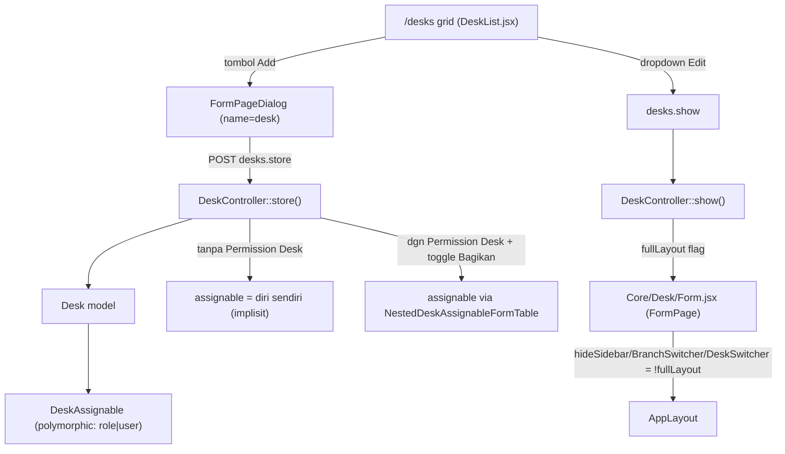

# Design Document: Desk Visual Colors + Custom Desk CRUD

## Overview

Implementasi dasar Desk (workspace grouping ala ERPNext, spec `desk-based-ui`) sudah berjalan — Desk model, MenuItem, sidebar dinamis per-desk, resolve desk aktif via cookie/default/route, dan grid `/desks` untuk switch desk. Dua gap tersisa:

1. **Visual**: warna icon Desk saat ini cuma 1 kolom `color` (background saja). Diganti `background_color` + `foreground_color` terpisah, dengan aturan kontras-tema (kosong = ikut tema + border; terisi = literal, tidak terpengaruh dark/light mode).
2. **Custom Desk CRUD**: belum ada UI untuk membuat/edit/hapus custom desk (backend `store()` sudah ada tapi tidak dipakai FE). Ditambahkan alur lengkap dengan percabangan permission: user biasa (custom desk personal, single-owner implisit) vs user berPermission Desk (kelola semua desk, opsional bagikan ke role/user lain via skema assignable baru, halaman show pakai layout penuh).

Keputusan arsitektur berikut dikonfirmasi eksplisit sepanjang brainstorming — termasuk migrasi Desk ke pola `Route::resourceDetail` yang sudah dipakai resource lain di codebase, dan penggantian total skema `desk_role`/`desk_user` (2 tabel pivot terpisah) menjadi 1 tabel polymorphic `desk_assignables`.

## Architecture



Permission granular (`Select/Read/Write/Create/Delete`) sudah auto-terdaftar untuk `Desk` lewat trait `DataTable` (tidak perlu setup tambahan — dikonfirmasi via `DeskControllerTest::grantDeskCreatePermission()` yang sudah bekerja tanpa registrasi eksplisit).

## Components and Interfaces

### A. Kolom warna: `background_color` + `foreground_color`

**Migration** — edit langsung `database/migrations/2026_08_18_193750_create_desks_table.php` (untracked git, aman diedit tanpa migration baru): ganti `$table->string('color')->nullable();` menjadi:
```php
$table->string('background_color')->nullable();
$table->string('foreground_color')->nullable();
```

**Render rule (FE)** — helper baru `getDeskColorStyle(desk)` di `resources/js/lib/deskIcons.jsx` (co-locate dengan `resolveIcon`):
- Kedua kosong ATAU salah satu kosong → treat sama: tidak ada inline style, container icon dapat `border` + style tema default (`bg-muted`/`text-foreground`, ikut dark/light).
- Keduanya terisi → `style={{backgroundColor: desk.background_color, color: desk.foreground_color}}` literal, tanpa className tema apa pun (tanpa `dark:` variant).

Diterapkan di semua tempat render desk icon: [DeskList.jsx:76](../../../resources/js/Pages/Core/DeskList.jsx#L76) (card grid) dan `Core/Desk/Form.jsx` baru. `only([...])` di 3 titik backend (`DeskController::index()`, `ResolveActiveDesk.php` x2) diubah dari `'color'` ke `'background_color','foreground_color'`.

**`ColorInput.jsx`** — komponen baru, model dari pola hex-input+swatch `PrintTemplate/Components/StyleFields/ColorField.jsx`, API disederhanakan jadi `value`/`onValueChange` generik.

**Seeder/Factory** — `DeskSeeder.php` (10 system desk, pasangan background/foreground eksplisit) dan `DeskFactory.php` (`hexColor()` + foreground hitam/putih acak) diupdate dari `color` tunggal.

### B. Permission Desk granular

Tidak ada perubahan tambahan — `Desk` model sudah pakai trait `DataTable`, auto-discovery seeder permission sudah mencakupnya. Section C memakai permission ini langsung.

### C. Migrasi `DeskController` ke `Route::resourceDetail`

**Keputusan kunci** (diverifikasi baris-demi-baris `app/Http/Controllers/Controller.php:114-199`): `DeskController` **extends base `Controller`**, override `exceptPermission()`:
```php
protected function exceptPermission(string $method) {
    if ($method === 'index') {
        return true; // visibility diatur query branching di index(), bukan guard permission
    }
    if (! in_array($method, ['show', 'update', 'destroy'])) {
        return null;
    }
    $desk = Route::getCurrentRoute()->parameter('desk');
    $desk = is_string($desk) ? Desk::find($desk) : $desk;

    return $desk && $desk->type === DeskType::Custom && $desk->owner_id === $request->user()->id ? true : null;
}
```
Diverifikasi: `exceptPermission($method)` dipanggil SEBELUM pengecekan `modelPermissions === null` di base constructor (baris 135 vs 140-142) — return `true` cukup untuk skip 403 tanpa trik lain.

**Route** (`routes/web.php`): hapus route manual `desks.index`/`desks.store`, ganti `Route::resourceDetail('desk', DeskController::class);`. `desk.switch`/`desk.setDefault` tetap manual (bukan CRUD standar). Route `desk.roles.store` **dihapus total**.

**`index()`** — tetap custom override (grid, bukan DataTable):
```php
public function index(Request $request) {
    $checker = PermissionChecker::forUser($request);
    $desks = $checker->can(Desk::class, Permission::Select)
        ? Desk::query()->get()
        : $this->resolver->visibleDesksFor($request->user(), $checker, $request);
}
```
`canManage` per desk (murni UI affordance, backend tetap re-guard): `$desk->type === Custom && ($desk->owner_id === $user->id || $checker->can(Desk::class, Permission::Delete))`.

**`create()`** — method wajib ada (macro selalu registrasi route-nya) tapi bukan jalur utama. Baik user tanpa maupun dengan permission, tombol "Add" di `/desks` membuka `FormPageDialog` yang POST langsung ke `desks.store` (pola `ManageUsers/Form.jsx:444-464`). `create()` cukup redirect fallback ke `desks.index`.

**`show()`** (baru):
```php
public function show(Request $request, Desk $desk) {
    $checker = PermissionChecker::forUser($request);
    $fullLayout = $desk->type === DeskType::System
        || ($checker->can(Desk::class, Permission::Select) && ! $desk->is_personal_only);

    return Inertia::render('Core/Desk/Form', ['desk' => [...], 'fullLayout' => $fullLayout]);
}
```

**`update()`/`destroy()`** — guard otomatis base Controller (`write`/`delete`) + `exceptPermission` owner-override. `update()` juga handle toggle personal↔shared (Section D).

### D. Skema baru `desk_assignables`

**Migration baru**:
```php
Schema::create('desk_assignables', function (Blueprint $table) {
    $table->ulid('id')->primary();
    $table->foreignUlid('desk_id')->references('id')->on('desks')->cascadeOnDelete();
    $table->string('assignable_type'); // 'role' | 'user'
    $table->ulid('assignable_id');     // tanpa FK constraint (polymorphic lintas tabel)
    $table->timestamps();
    $table->unique(['desk_id', 'assignable_type', 'assignable_id']);
});
```

**Kolom baru `desks.is_personal_only`** (boolean, default `false`, di migration yang sama dengan Section A). Keputusan: eksplisit kolom, bukan infer dari `count(assignables)===1` (rapuh — user berPermission Desk yang sengaja assign 1 role saja akan salah ke-detect).

**`DeskAssignable` model** (baru):
```php
class DeskAssignable extends Model {
    use HasUlids;
    protected $guarded = ['id'];
    public function desk() { return $this->belongsTo(Desk::class); }
}
```

**`Desk.php`** — hapus `users()`/`roles()`, tambah:
```php
public function assignables() { return $this->hasMany(DeskAssignable::class); }
protected function casts(): array {
    return ['type'=>DeskType::class, 'domain'=>Domain::class, 'is_personal_only'=>'boolean'];
}
```

**`DeskResolverService::visibleDesksFor()`** — ganti klausa role-scoped jadi 1 blok cover role-assigned DAN user-assigned langsung:
```php
->orWhere(function ($query) use ($roleIds, $user) {
    $query->where('type', DeskType::Custom)
        ->whereHas('assignables', function ($q) use ($roleIds, $user) {
            $q->where(fn ($qq) => $qq->where('assignable_type', 'role')->whereIn('assignable_id', $roleIds))
              ->orWhere(fn ($qq) => $qq->where('assignable_type', 'user')->where('assignable_id', $user->id));
        });
})
```

**`DetachDeskAssignments` listener** — `$event->desk->assignables()->delete();` menggantikan 2 baris `detach()`.

**Dihapus total** (semua untracked git, aman): `DeskRole.php`, `DeskUser.php`, `create_desk_user_table.php`, `create_desk_role_table.php`.

#### Aturan personal vs shared (krusial)

- **Custom desk personal biasa** (dibuat TANPA Permission Desk): assignable selalu 1 row implisit = pembuatnya sendiri. **Tidak ada field assignable di form.** Backend set otomatis di `store()`.
- **User berPermission Desk** — form punya **toggle checkbox "Bagikan ke Role/User"**:
  - OFF (default, termasuk kasus "buat desk eksklusif utk dirinya sendiri" walau formal punya permission luas): field assignable disembunyikan, dipaksa 1 row = diri sendiri.
  - ON: `NestedDeskAssignableFormTable` muncul (kolom `assignable_type` Select + `assignable` LinkModel dinamis — pola persis `NestedApproverFormTable` di `Settings/ApprovalScheme/Form.jsx:43-103`).
  - Bisa diubah kapan saja saat edit. Flip shared→personal: wipe semua assignable lama, ganti 1 row (diri sendiri).

```php
if ($request->boolean('is_personal_only') && ! $desk->is_personal_only) {
    $desk->assignables()->delete();
    $desk->assignables()->create(['assignable_type'=>'user','assignable_id'=>$desk->owner_id ?? $request->user()->id]);
}
$desk->update(['is_personal_only' => $request->boolean('is_personal_only')]);
if (! $request->boolean('is_personal_only')) {
    $desk->assignables()->delete();
    foreach ($request->input('assignables', []) as $row) {
        $desk->assignables()->create(['assignable_type'=>$row['assignable_type'],'assignable_id'=>$row['assignable']['id'] ?? $row['assignable_id']]);
    }
}
```

### E. Custom AppLayout untuk halaman show Desk

**Trace hasil verifikasi**: `AppLayout.jsx` cuma punya prop `hideSidebar` (diteruskan ke `Navbar`). `Navbar.jsx` hard-couple `BranchSwitcher`/`DeskSwitcher` 1:1 ke `hideSidebar`. Link "Home" breadcrumb render unconditional — tetap tampil di kedua mode. `FormPage.jsx` selalu render `<AppLayout>` tanpa `hideSidebar` (full layout).

**Perubahan additive, backward-compatible**:
1. `AppLayout.jsx` — tambah `hideBranchSwitcher=false`, `hideDeskSwitcher=false`, teruskan ke `Navbar`.
2. `Navbar.jsx` — decouple render `BranchSwitcher`/`DeskSwitcher` dari `hideSidebar` tunggal jadi independen per prop masing-masing.
3. `FormPage.jsx` — tambah 3 prop baru (default `false`), teruskan ke `<AppLayout>`. Default `false` = zero regression ke 60+ pemanggil existing.
4. `Core/Desk/Form.jsx` (baru, ikuti konvensi nested `Settings/ApprovalScheme/Form.jsx`):
```jsx
<FormPage name="desk" hideSidebar={!fullLayout} hideBranchSwitcher={!fullLayout} hideDeskSwitcher={!fullLayout} ...>
```

### F. Dropdown & Add button di `/desks`

- **Dropdown** `DeskList.jsx` — tambah "Edit" (navigasi `desks.show`) dan "Delete" (`router.delete` + confirm), muncul kalau `desk.canManage`. "Jadikan Default" tetap ada.
- **Tombol "Add"** — tile baru di grid (style `bg-muted` sama seperti card lain), buka `FormPageDialog` via ref.
- **Field dialog** bercabang dari `usePermission("App\\Models\\Core\\Desk").can("create")`:
  - Tanpa permission: `name`, `icon`, `background_color`, `foreground_color`, `is_default`, MenuItem checklist (1 level, icon per-assignment bisa di-override via kolom `icon` pivot `desk_menu_item` yang sudah ada). Tanpa field assignable.
  - Dengan permission: field sama + toggle "Bagikan ke Role/User" + `NestedDeskAssignableFormTable` kondisional.
- Visibilitas index sudah dicover Section C (branching `Permission::Select`), tanpa route/halaman index terpisah.

## Data Models

**`desks` table** (perubahan): `color` (dihapus) → `background_color` (string, nullable), `foreground_color` (string, nullable); tambah `is_personal_only` (boolean, default `false`).

**`desk_assignables` table** (baru): `id` (ulid PK), `desk_id` (FK→desks, cascadeOnDelete), `assignable_type` (string: `role`|`user`), `assignable_id` (ulid, tanpa FK constraint), timestamps, unique `(desk_id, assignable_type, assignable_id)`.

**Dihapus**: `desk_role`, `desk_user` (dan model `DeskRole`/`DeskUser`).

## Error Handling

- `exceptPermission()` untuk `show`/`update`/`destroy` fallback ke guard permission formal (`read`/`write`/`delete`) kalau bukan owner — 403 standar dari base Controller, tidak perlu custom handling tambahan.
- Toggle personal→shared→personal: operasi wipe+replace assignable dibungkus implisit dalam satu request `update()` — tidak butuh transaction eksplisit tambahan karena Eloquent single-request sudah atomik cukup untuk kasus ini (volume row kecil, tidak ada race-condition class khusus yang perlu digital dicegah selain retry manual biasa).
- MenuItem checklist di form: kalau user hapus centang MenuItem yang sedang dipakai desk aktifnya sendiri (skenario ekstrem), tidak ada guard khusus — behavior mengikuti `ResolveActiveDesk` existing (item tanpa children dan tanpa MenuItem valid otomatis hilang dari sidebar, bukan error).

## Testing Strategy

**Update test existing**: `DeskModelTest.php` (relasi `assignables()`), `DeskResolverServiceTest.php` (assignable query + kasus user-assigned langsung), `DeskControllerTest.php` (hapus test `desk.roles.store`, tambah show/update/destroy permission-branching), `ResolveActiveDeskTest.php` (assert kolom warna baru), `DeskSeederTest.php` (assert kolom warna baru).

**Test baru**: `DeskAssignable` model+relasi CRUD; toggle personal→shared→personal (wipe+replace); `store()` tanpa permission → 1 assignable=self + `is_personal_only=true`; `store()`/`update()` dgn permission+shared → N assignable sesuai payload; `show()` permission-branching (`fullLayout` benar utk semua 4 kombinasi: owner-tanpa-permission, System desk, permission-holder shared, permission-holder personal-desk-sendiri); `destroy()` (owner tanpa permission formal boleh hapus desk sendiri; stranger tanpa permission forbidden; permission-holder boleh hapus desk siapapun).

**Verifikasi manual browser**: desk tanpa warna custom (border+tema default) vs dengan warna custom (literal, konsisten light/dark); custom desk personal via `/desks` (tanpa field assignable); toggle "Bagikan" muncul FormTable, assign role → user lain dgn role itu bisa lihat desk; halaman show desk personal (tanpa sidebar/BranchSwitcher/DeskSwitcher, breadcrumb tetap ada) vs desk shared/System (layout penuh).

## Risiko

1. **Drop `desk_role`/`desk_user`**: aman — semua untracked git, belum pernah di-push.
2. **Rename `color`→2 kolom**: aman (untracked), tapi wajib audit semua titik pakai (`DeskController`, `ResolveActiveDesk` x2, `DeskList.jsx`).
3. **`exceptPermission` bypass untuk `index`**: scope-narrowing deliberate dari default-deny base Controller — access control sebenarnya ada di query branching `index()`. Test harus cover 2 kelas bug terpisah: guard permission salah (403 tak semestinya) vs query branching salah (lihat desk bukan haknya).
4. **`FormPage.jsx` prop forwarding**: purely additive, default `false` = 0 risiko regresi ke pemanggil existing.
