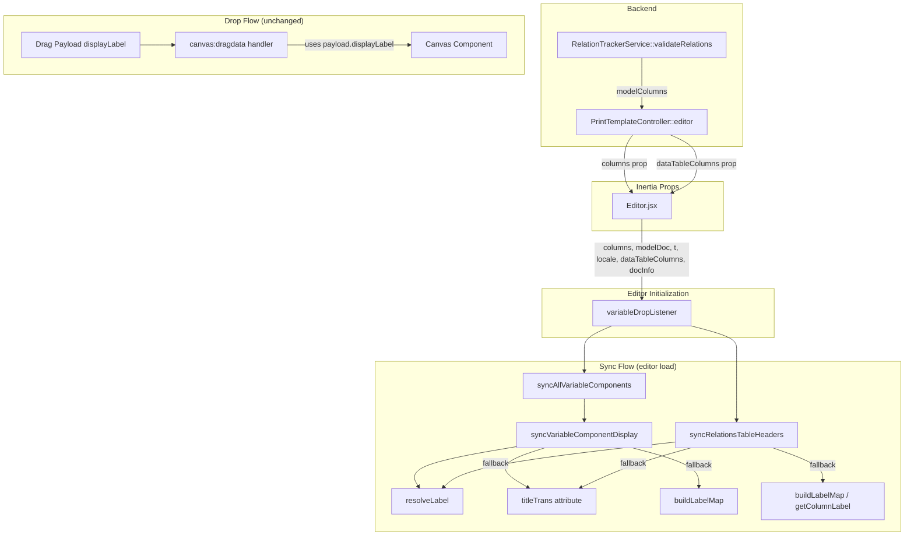
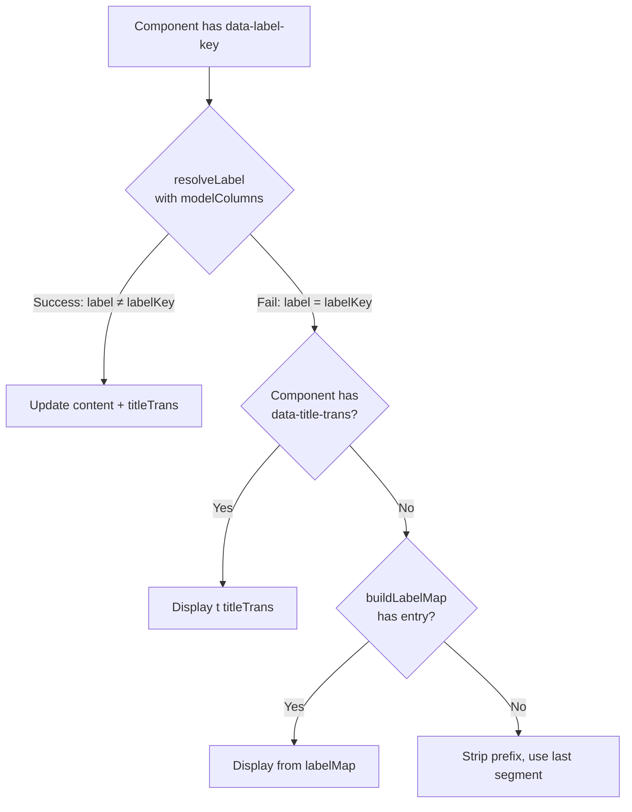

# Design Document: Editor Label Resolution

## Overview

This feature enhances the GrapeJS Print Template Editor's label resolution during sync (editor load) by introducing `modelColumns` as the primary label source. The `modelColumns` structure—provided by the backend via `RelationTrackerService::validateRelations()`—contains complete column definitions for all models used by the template, keyed by fully-qualified model class name. This solves the problem of missing labels for nested/lazy-loaded columns that `dataTableColumns` doesn't always contain.

The design follows a **fallback chain** pattern:

1. `resolveLabel()` using `modelColumns` (primary, most complete)
2. `titleTrans` attribute stored on the component (persisted fallback)
3. `buildLabelMap()` using `dataTableColumns` (legacy fallback)

Drop operations remain unchanged—they continue using the drag payload's `displayLabel` from `dataTableColumns`.

## Architecture



### Data Flow

1. **Backend → Frontend**: `PrintTemplateController::editor()` calls `validateRelations($model, $usedRelations, true)` which returns `modelColumns` keyed by model class. This is passed as the `columns` Inertia prop.

2. **Editor.jsx → variableDropListener**: The Editor component destructures the `columns` page prop and passes it along with `printTemplate.model` (as `modelDoc`) to `variableDropListener`.

3. **Sync (on editor load)**: After a 300ms delay, `syncAllVariableComponents()` and `syncRelationsTableHeaders()` execute. Each component's label is resolved using the fallback chain: `resolveLabel` → `titleTrans` → `buildLabelMap`.

4. **Drop (unchanged)**: The `canvas:dragdata` handler reads `displayLabel` from the drag payload and uses it directly. No `resolveLabel` or `modelColumns` involvement.

## Components and Interfaces

### Modified: `variableDropListener` (variableDropUtils.js)

**New parameters in options object:**

```javascript
/**
 * @param {object} editor - GrapesJS editor instance
 * @param {object} options
 * @param {Function} options.t - i18n translation function
 * @param {string} options.locale - Locale code
 * @param {Array} options.dataTableColumns - Columns for drag/drop and legacy fallback
 * @param {object} options.docInfo - Document info variables
 * @param {object|null} options.columns - modelColumns keyed by model class (new)
 * @param {string|null} options.modelDoc - Root model class string (new)
 */
export function variableDropListener(
  editor,
  { t, locale, dataTableColumns = [], docInfo = {}, columns = null, modelDoc = null }
)
```

### Modified: `syncVariableComponentDisplay` (internal to variableDropListener)

Updated resolution logic:

```javascript
const syncVariableComponentDisplay = (component) => {
  // ... existing component validation ...

  const labelKey = labelComponent.getAttributes()?.["data-label-key"] || "";

  // Step 1: Try resolveLabel with modelColumns
  let displayLabel = null;
  let resolvedTitleTrans = null;

  if (columns && modelDoc) {
    const result = resolveLabelWithMeta(labelKey, columns, modelDoc, t);
    if (result.label !== labelKey) {
      displayLabel = result.label;
      resolvedTitleTrans = result.titleTrans;
    }
  }

  // Step 2: Fallback to titleTrans attribute on component
  if (!displayLabel) {
    const storedTitleTrans = component.getAttributes()?.["data-title-trans"];
    if (storedTitleTrans) {
      displayLabel = t(storedTitleTrans);
    }
  }

  // Step 3: Fallback to buildLabelMap (legacy)
  if (!displayLabel) {
    const labelMap = buildLabelMap();
    displayLabel = labelMap[labelKey] || labelMap[variablePath];
  }

  // Step 4: Final fallback - strip prefix
  if (!displayLabel) {
    displayLabel =
      labelKey
        .replace(/^(relation\s+|doc\.|company\.|docInfo\.)/, "")
        .split(".")
        .pop() || variablePath;
  }

  // Update titleTrans attribute if resolved from modelColumns
  if (resolvedTitleTrans) {
    component.addAttributes({ "data-title-trans": resolvedTitleTrans });
  }

  // ... update label content ...
};
```

### Modified: `syncRelationsTableHeaders` (internal to variableDropListener)

Updated resolution logic for table header cells:

```javascript
const syncRelationsTableHeaders = () => {
  // ... existing table/thead traversal ...

  thCells.forEach((th) => {
    const attrs = th.getAttributes() || {};
    const labelKey = attrs["data-label-key"];
    if (!labelKey) return; // Skip "#" column

    let newLabel = null;
    let resolvedTitleTrans = null;

    // Step 1: Try resolveLabel with modelColumns
    if (columns && modelDoc) {
      const result = resolveLabelWithMeta(labelKey, columns, modelDoc, t);
      if (result.label !== labelKey) {
        newLabel = result.label;
        resolvedTitleTrans = result.titleTrans;
      }
    }

    // Step 2: Fallback to titleTrans attribute on header cell
    if (!newLabel) {
      const storedTitleTrans = attrs["data-title-trans"];
      if (storedTitleTrans) {
        newLabel = t(storedTitleTrans);
      }
    }

    // Step 3: Fallback to buildLabelMap / getColumnLabel (legacy)
    if (!newLabel) {
      const labelMap = buildLabelMap();
      newLabel = labelMap[labelKey];
      if (!newLabel) {
        const colName = attrs.name;
        const colConfig = colName
          ? columnsConfig.find((c) => c.name === colName)
          : null;
        if (colConfig) {
          newLabel = getColumnLabel(colConfig, t, locale);
        }
      }
    }

    // Update titleTrans if resolved from modelColumns
    if (resolvedTitleTrans) {
      th.addAttributes({ "data-title-trans": resolvedTitleTrans });
    }

    if (newLabel && newLabel !== th.get("content")) {
      th.set("content", newLabel);
    }
  });
};
```

### Modified: `resolveLabel` (variableTokenUtils.js)

Enhanced with robustness and metadata return:

```javascript
/**
 * Resolves a dot-notation path to a display label using modelColumns.
 * Returns the original path if resolution fails at any point.
 *
 * @param {string} path - Dot-notation path (e.g., "doc.customer.name")
 * @param {object|null} columns - modelColumns keyed by model class
 * @param {string|null} modelDoc - Root model class string
 * @param {Function} t - Translation function
 * @returns {string} Resolved label or original path
 */
export function resolveLabel(path, columns, modelDoc, t) {
  if (!path || !columns) return path ?? "";

  const firstDotIndex = path.indexOf(".");
  if (firstDotIndex === -1) return path;

  const prefix = path.slice(0, firstDotIndex);
  const segments = path.slice(firstDotIndex + 1).split(".");
  if (segments.length === 0) return path;

  let currentModel;
  if (prefix === "doc") {
    if (!modelDoc) return path;
    currentModel = modelDoc;
  } else if (prefix === "company" || prefix === "docInfo") {
    currentModel = prefix;
  } else {
    return path;
  }

  let result = path;
  for (const segment of segments) {
    const modelCols = columns[currentModel];
    if (!modelCols) return path;

    const col = modelCols[segment];
    if (!col) return path;

    // Navigate to related model if this is a relation column
    if ((col.type === "relation" || col.type === "relations") && col.related) {
      currentModel = col.related;
    }

    // Resolve label with priority: title → t(titleTrans) → name
    result =
      col.title || (col.titleTrans && t(col.titleTrans)) || col.name || path;
  }

  return result;
}

/**
 * Resolves a label and also returns the titleTrans metadata from the leaf column.
 * Used by sync functions to persist titleTrans back to the component.
 *
 * @param {string} path - Dot-notation path
 * @param {object|null} columns - modelColumns keyed by model class
 * @param {string|null} modelDoc - Root model class string
 * @param {Function} t - Translation function
 * @returns {{ label: string, titleTrans: string|null }}
 */
export function resolveLabelWithMeta(path, columns, modelDoc, t) {
  if (!path || !columns) return { label: path ?? "", titleTrans: null };

  const firstDotIndex = path.indexOf(".");
  if (firstDotIndex === -1) return { label: path, titleTrans: null };

  const prefix = path.slice(0, firstDotIndex);
  const segments = path.slice(firstDotIndex + 1).split(".");
  if (segments.length === 0) return { label: path, titleTrans: null };

  let currentModel;
  if (prefix === "doc") {
    if (!modelDoc) return { label: path, titleTrans: null };
    currentModel = modelDoc;
  } else if (prefix === "company" || prefix === "docInfo") {
    currentModel = prefix;
  } else {
    return { label: path, titleTrans: null };
  }

  let result = path;
  let titleTrans = null;

  for (const segment of segments) {
    const modelCols = columns[currentModel];
    if (!modelCols) return { label: path, titleTrans: null };

    const col = modelCols[segment];
    if (!col) return { label: path, titleTrans: null };

    if ((col.type === "relation" || col.type === "relations") && col.related) {
      currentModel = col.related;
    }

    titleTrans = col.titleTrans || null;
    result =
      col.title || (col.titleTrans && t(col.titleTrans)) || col.name || path;
  }

  return { label: result, titleTrans };
}
```

### Modified: `Editor.jsx`

Pass `columns` and `modelDoc` to `variableDropListener`:

```javascript
function PrintTemplate({
  printTemplate,
  csrfToken,
  dataTableColumns,
  preferences,
  docInfo,
  columns, // NEW: modelColumns from RelationTrackerService
}) {
  // ... existing code ...

  const onEditor = (editor) => {
    // ... existing setup ...

    variableDropListener(editor, {
      t,
      locale: printTemplate?.default_language,
      dataTableColumns,
      docInfo,
      columns, // NEW
      modelDoc: printTemplate?.model, // NEW
    });

    // ... rest of onEditor ...
  };
}
```

### Modified: Drop handler (`canvas:dragdata`)

The drop handler stores `titleTrans` from the payload when available:

```javascript
// In the single-variable drop branch:
result.content = {
  type: "gjsSubGrid",
  attributes: {
    "data-variable": varPath,
    "data-variable-type": payload.parentType || payload.type || "data",
    ...(payload.titleTrans ? { "data-title-trans": payload.titleTrans } : {}),
  },
  // ... components unchanged ...
};
```

## Data Models

### modelColumns Structure (from backend)

```typescript
// The `columns` Inertia prop structure
type ModelColumns = {
  [modelClass: string]: {
    [columnName: string]: ColumnDefinition;
  };
  // Special keys:
  // "company" → company preference columns
  // "docInfo" → document info columns
};

type ColumnDefinition = {
  name: string; // Column identifier (e.g., "customer_name")
  title?: string; // Static display title
  titleTrans?: string; // Translation key (e.g., "sales.fields.customer_name")
  type?: string; // Column type: "relation", "relations", "currency", "numeric", etc.
  related?: string; // For relation types: fully-qualified related model class
  typeRelation?: string; // Relation subtype: "basic", etc.
  // ... other properties (decimalScale, currency, formatOptions, etc.)
};
```

### Component Attributes (GrapeJS)

```typescript
// gjsSubGrid component attributes
type SubGridAttributes = {
  "data-variable": string; // Full variable path (e.g., "customer.name")
  "data-variable-type": string; // Variable type (e.g., "doc", "company")
  "data-title-trans"?: string; // NEW: Persisted titleTrans for fallback
};

// Label span attributes (child of gjsSubGrid)
type LabelSpanAttributes = {
  "data-label-key": string; // Label resolution key (e.g., "doc.customer.name")
  title: string; // Tooltip
  contenteditable: "false";
};

// Table header cell attributes
type HeaderCellAttributes = {
  "data-label-key": string; // Label resolution key
  name: string; // Column name for columnsConfig lookup
  "data-title-trans"?: string; // NEW: Persisted titleTrans for fallback
};
```

### Resolution Flow Diagram



## Correctness Properties

_A property is a characteristic or behavior that should hold true across all valid executions of a system—essentially, a formal statement about what the system should do. Properties serve as the bridge between human-readable specifications and machine-verifiable correctness guarantees._

### Property 1: resolveLabel returns original path when required context is missing

_For any_ path string, when `columns` is null/undefined OR when `modelDoc` is null/undefined and the path starts with "doc.", `resolveLabel` SHALL return the original path string without throwing an error.

**Validates: Requirements 6.1, 6.4**

### Property 2: resolveLabel returns original path for non-existent keys

_For any_ path string where the derived model key does not exist in the `columns` object, OR where a path segment does not exist as a column entry within the resolved model, `resolveLabel` SHALL return the original path string without throwing an error.

**Validates: Requirements 6.2, 6.5**

### Property 3: resolveLabel uses label priority chain for leaf columns

_For any_ valid path that resolves to a column in `modelColumns`, `resolveLabel` SHALL return the first non-empty value from the priority chain: `col.title` → `t(col.titleTrans)` → `col.name`, regardless of the column's `type` property value (including null/undefined).

**Validates: Requirements 6.3**

### Property 4: Successful modelColumns resolution updates component content and titleTrans

_For any_ `gjsSubGrid` component where `resolveLabel` returns a value different from the `data-label-key` input, the sync function SHALL update both the label span content to the resolved value AND the component's `data-title-trans` attribute to the leaf column's `titleTrans` value.

**Validates: Requirements 2.2, 2.3, 4.5**

### Property 5: Successful modelColumns resolution updates table header content and titleTrans

_For any_ `gjsRelationsTable` header cell where `resolveLabel` returns a value different from the `data-label-key` input, the sync function SHALL update both the cell content to the resolved value AND the cell's `data-title-trans` attribute to the leaf column's `titleTrans` value.

**Validates: Requirements 3.2, 3.3**

## Error Handling

### resolveLabel Error Cases

| Scenario                                         | Behavior                                        |
| ------------------------------------------------ | ----------------------------------------------- |
| `columns` is null/undefined                      | Return original path                            |
| `modelDoc` is null/undefined (doc-prefixed path) | Return original path                            |
| Model class key not found in `columns`           | Return original path                            |
| Column name not found in model's columns         | Return original path                            |
| Column has null `type` property                  | Still resolve label using title/titleTrans/name |
| Column has all label properties null             | Return original path                            |
| `related` property missing on relation column    | Stop traversal, return best label so far        |

### Sync Error Cases

| Scenario                                          | Behavior                                          |
| ------------------------------------------------- | ------------------------------------------------- |
| `columns` prop not passed to variableDropListener | Skip modelColumns resolution, use legacy fallback |
| Component missing `data-label-key`                | Skip label resolution for that component          |
| `buildLabelMap()` returns no match                | Use stripped/simplified fallback label            |
| GrapeJS component API throws                      | Catch silently, skip that component               |

### Drop Error Cases

No changes to existing error handling. Drop operations continue using payload data exclusively.

## Testing Strategy

### Unit Tests (Example-Based)

- **Editor.jsx integration**: Verify `columns` and `modelDoc` are passed to `variableDropListener`
- **Drop behavior preservation**: Verify drop handler uses `payload.displayLabel`, not `resolveLabel`
- **titleTrans serialization**: Verify `data-title-trans` persists across save/load
- **Fallback chain**: Verify each fallback step activates when the previous fails
- **Edge cases**: null columns, null modelDoc, missing translation keys

### Property-Based Tests

Property-based testing is appropriate for this feature because `resolveLabel` is a pure function with clear input/output behavior and a large input space (arbitrary path strings, arbitrary modelColumns structures).

**Library**: [fast-check](https://github.com/dubzzz/fast-check)

**Configuration**: Minimum 100 iterations per property test.

**Tag format**: `Feature: editor-label-resolution, Property {number}: {property_text}`

Tests to implement:

1. **Property 1**: Generate arbitrary paths and null/undefined columns/modelDoc → verify original path returned
2. **Property 2**: Generate paths with non-existent model/column keys → verify original path returned
3. **Property 3**: Generate valid paths with columns having various combinations of title/titleTrans/name → verify priority chain
4. **Property 4-5**: Generate mock components with modelColumns that resolve successfully → verify both content and titleTrans are updated

### Integration Tests

- Full editor load with real modelColumns data → verify labels display correctly
- Editor load with empty/null columns → verify graceful degradation to legacy behavior
- Drop + sync cycle → verify titleTrans is stored on drop and used on subsequent sync
