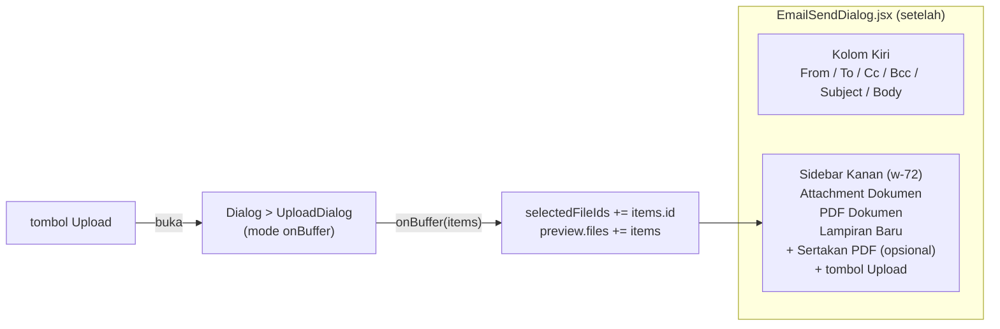

# Design Document: email-features-fixes

## Overview

Lima perubahan independen pada fitur email, tidak ada perubahan arsitektur besar:

1. **Sidebar entry** — tambah 1 object literal di `AppSidebar.jsx`, pola copy-paste dari entry "Print Templates" yang sudah ada.
2. **Lang key** — tambah key baru di 2 file JSON (`lang/php_id.json`, `lang/php_en.json`).
3. **Upload via UploadDialog** — hapus `handleUpload` + `fileInputRef` + `<input type="file">` manual, ganti dengan `<Dialog>` + `UploadDialog` (mode `onBuffer`), sama seperti pola di `Attachments.jsx`.
4. **Default Send From** — 1 baris di `Controller.php::emailPreview()`: `config('mail.from.name')` → `auth()->user()->name`.
5. **Layout 2 kolom + section attachment** — restrukturisasi JSX `EmailSendDialog.jsx` dari 1 kolom flat menjadi grid 2 kolom (kiri: form fields, kanan: attachment sections), lebar dialog `max-w-2xl` → `max-w-4xl`.

**Yang TIDAK berubah:**

- Kontrak API `emailPreview` (GET) dan `sendEmail` (POST) — payload `sendEmail` tetap sama persis (`to, cc, bcc, from_name, subject, body, fileIds, include_pdf`).
- Logic `includePdf`/`hasGeneratedPdf`/`canOfferPdf` — sudah benar, hanya dibungkus label section baru.
- `EmailTemplateController`, `EmailTemplateSendRequest`, `SendEmailWithPdfJob` — tidak disentuh.
- Route `resourceDetail('emailTemplate', ...)` di `web.php` — sudah lengkap, tidak perlu route baru untuk Requirement 1 (murni sidebar).

## Architecture



Data flow tidak berubah dari sisi network: `GET emailPreview` saat dialog dibuka → state lokal (`preview`, `to/cc/bcc/subject/bodyHtml/selectedFileIds/includePdf`) → `POST sendEmail` saat submit. Perubahan hanya pada _bagaimana_ file baru masuk ke `selectedFileIds` (lewat `UploadDialog.onBuffer` callback, bukan axios manual + refetch).

## Components and Interfaces

### 1. `resources/js/Components/Sidebar/AppSidebar.jsx`

Tambah object literal baru persis setelah entry "Print Templates" (baris ~320, sebelum "Widgets"):

```jsx
{
  title: "Print Templates",
  url: "/settings/printTemplates",
  urlPattern: "/settings/printTemplates/*",
  model: "App\\Models\\Core\\PrintTemplate",
},
{
  title: "Email Templates",
  url: "/settings/emailTemplates",
  urlPattern: "/settings/emailTemplates/*",
  model: "App\\Models\\Core\\EmailTemplate",
},
```

Title pakai key i18n jika entry lain di array yang sama sudah pakai `t(...)` — cek pola tepat di sekitar baris tsb sebelum commit (jika literal string biasa seperti contoh di atas, ikuti pola literal; jangan introduce i18n baru sendirian di 1 entry).

### 2. `lang/php_id.json` & `lang/php_en.json`

Tambah flat key (format project ini flat JSON per key, bukan nested object — cek pola existing key `core.emailTemplate.columns.subject` dkk sebagai referensi format). Key baru di bawah `core.emailTemplate.send.*`:

| Key                                           | ID                                      | EN                                  |
| --------------------------------------------- | --------------------------------------- | ----------------------------------- |
| `core.emailTemplate.send.title`               | "Kirim Email"                           | "Send Email"                        |
| `core.emailTemplate.send.from`                | "Dari"                                  | "From"                              |
| `core.emailTemplate.send.fromNamePlaceholder` | "Nama pengirim"                         | "Sender name"                       |
| `core.emailTemplate.send.to`                  | "Kepada"                                | "To"                                |
| `core.emailTemplate.send.cc`                  | "Cc"                                    | "Cc"                                |
| `core.emailTemplate.send.bcc`                 | "Bcc"                                   | "Bcc"                               |
| `core.emailTemplate.send.attachments`         | "Lampiran"                              | "Attachments"                       |
| `core.emailTemplate.send.attachmentsExisting` | "Attachment Dokumen"                    | "Document Attachments"              |
| `core.emailTemplate.send.attachmentsPdf`      | "PDF Dokumen"                           | "Document PDF"                      |
| `core.emailTemplate.send.attachmentsNew`      | "Lampiran Baru"                         | "New Attachments"                   |
| `core.emailTemplate.send.includePdf`          | "Sertakan PDF"                          | "Include PDF"                       |
| `core.emailTemplate.send.uploadFile`          | "Upload File"                           | "Upload File"                       |
| `core.emailTemplate.send.button`              | "Kirim"                                 | "Send"                              |
| `core.emailTemplate.send.queued`              | "Email sedang diantrekan untuk dikirim" | "Email has been queued for sending" |

`core.emailTemplate.columns.subject`/`body` — cek dulu apakah sudah ada (dipakai resource EmailTemplate untuk kolom tabel/form); requirement 2.2 hanya nambah kalau memang belum ada.

### 3. `app/Http/Controllers/Controller.php::emailPreview()`

```php
// sebelum
'fromName' => config('mail.from.name'),

// sesudah
'fromName' => auth()->user()->name,
```

`fromAddress` tidak berubah. Tidak perlu null-check tambahan (kolom `users.name` adalah `string` non-nullable di migration, dan route ini sudah di belakang middleware auth — `auth()->user()` tidak akan null di context controller ini).

### 4. `resources/js/Pages/Core/Components/EmailSendDialog.jsx`

**Dihapus:**

- `fileInputRef` (useRef)
- `handleUpload` function (baris 141-181)
- `<input ref={fileInputRef} type="file" ... />` manual (baris 310-315)
- Tombol upload yang trigger `fileInputRef.current?.click()`

**Ditambah:**

- State `const [uploadOpen, setUploadOpen] = useState(false)` untuk toggle `Dialog` pembungkus `UploadDialog`.
- Handler `onBuffer`:

```jsx
const handleNewFiles = (items) => {
  // items: array {id, name, ...} hasil files.store dari UploadDialog
  setPreview((prev) => ({ ...prev, files: [...(prev.files ?? []), ...items] }));
  setSelectedFileIds((prev) => [...prev, ...items.map((f) => f.id)]);
  setNewFileIds((prev) => [...prev, ...items.map((f) => f.id)]);
};
```

- State baru `const [newFileIds, setNewFileIds] = useState([])` — dipakai untuk membedakan section "Lampiran Baru" vs "Attachment Dokumen" (keduanya sama-sama masuk `selectedFileIds`/`preview.files`, tapi perlu ditampilkan di section terpisah sesuai Requirement 5.4). File dari `preview.files` awal (saat dialog dibuka) otomatis masuk "Attachment Dokumen"/"PDF Dokumen" karena `newFileIds` masih kosong; setelah upload baru, id-nya masuk `newFileIds` sehingga dirender di section "Lampiran Baru".

**Restrukturisasi JSX (return statement):**

```jsx
<DialogContent className="max-w-4xl flex flex-col max-h-[85vh] p-0 gap-0">
  <DialogHeader>...</DialogHeader>
  {loading ? (...) : (
    <div className="flex-1 min-h-0 overflow-y-auto px-6 grid lg:grid-cols-[1fr_18rem] gap-6">
      {/* Kolom kiri */}
      <div className="min-w-0 grid gap-y-4">
        {/* From, To, Cc, Bcc, Subject, Body — sama seperti sebelumnya */}
      </div>

      {/* Sidebar kanan */}
      <div className="min-w-0 border-t pt-4 lg:border-t-0 lg:pt-0 lg:border-l lg:pl-4 grid gap-y-4 content-start">
        <div className="grid gap-y-2">
          <Label>{t("core.emailTemplate.send.attachmentsExisting")}</Label>
          {existingNonPdfFiles.map((file) => (
            <FormCheckbox key={file.id} checked={selectedFileIds.includes(file.id)}
              onCheckedChange={() => toggleFile(file.id)} label={file.name} />
          ))}
          {existingNonPdfFiles.length === 0 && <EmptyHint />}
        </div>

        {preview.hasGeneratedPdf && (
          <div className="grid gap-y-2">
            <Label>{t("core.emailTemplate.send.attachmentsPdf")}</Label>
            {existingPdfFiles.map((file) => (
              <FormCheckbox key={file.id} checked={selectedFileIds.includes(file.id)}
                onCheckedChange={() => toggleFile(file.id)} label={file.name} />
            ))}
          </div>
        )}

        {!preview.hasGeneratedPdf && preview.canOfferPdf && (
          <FormCheckbox checked={includePdf} onCheckedChange={setIncludePdf}
            label={t("core.emailTemplate.send.includePdf")} />
        )}

        <div className="grid gap-y-2">
          <Label>{t("core.emailTemplate.send.attachmentsNew")}</Label>
          {newFiles.map((file) => (
            <FormCheckbox key={file.id} checked={selectedFileIds.includes(file.id)}
              onCheckedChange={() => toggleFile(file.id)} label={file.name} />
          ))}
        </div>

        <Dialog open={uploadOpen} onOpenChange={setUploadOpen}>
          <DialogTrigger asChild>
            <Button type="button" size="sm" variant="outline" className="w-fit">
              {t("core.emailTemplate.send.uploadFile")}
            </Button>
          </DialogTrigger>
          <UploadDialog open={uploadOpen} onBuffer={handleNewFiles} onClose={() => setUploadOpen(false)} />
        </Dialog>
      </div>
    </div>
  )}
  <DialogFooter>...</DialogFooter>
</DialogContent>
```

Derivasi list per section (menggantikan `otherFiles` lama):

```jsx
const allNonPdfFiles = (preview.files ?? []).filter((f) => !f.isGeneratedPdf);
const existingNonPdfFiles = allNonPdfFiles.filter(
  (f) => !newFileIds.includes(f.id),
);
const newFiles = allNonPdfFiles.filter((f) => newFileIds.includes(f.id));
const existingPdfFiles = (preview.files ?? []).filter((f) => f.isGeneratedPdf);
```

`handleSend` **tidak berubah** — tetap kirim `fileIds: selectedFileIds` (union dari existing + new, sesuai Requirement 3.4 & 5.6).

`useEffect` fetch preview saat dialog dibuka **tambah 1 baris**: `setNewFileIds([])` di awal `.then()` (reset saat dialog dibuka ulang), sejajar dengan `setIncludePdf(false)` yang sudah ada.

## Data Models

Tidak ada perubahan schema/database. Perubahan murni di layer presentasi (React state) dan 1 nilai response JSON (`fromName`) — tidak ada migration baru.

Struktur `preview.files[]` item (sudah ada, tidak berubah): `{ id: number, name: string, isGeneratedPdf: boolean }`.

Struktur item hasil `UploadDialog.onBuffer` (dari endpoint `files.store`, sudah ada, dipakai apa adanya): array of `{ id, name, ... }` — field lain (`size`, `mime`, dst.) diabaikan, hanya `id` dan `name` yang dipakai dialog ini.

## Correctness Properties

1. **Union invariant**: `selectedFileIds` setelah upload baru = `selectedFileIds_before ∪ {id file baru}` — tidak pernah ada file yang hilang dari seleksi akibat upload.
2. **Partisi section**: untuk setiap `f` di `preview.files` yang `!f.isGeneratedPdf`, `f` tampil di TEPAT SATU dari {`existingNonPdfFiles`, `newFiles`} — ditentukan murni oleh `newFileIds.includes(f.id)`, tidak ada duplikasi maupun file yang tidak tampil di manapun.
3. **PDF checkbox exclusivity**: checkbox "Sertakan PDF" (`includePdf`, generate baru) dan section "PDF Dokumen" (checkbox atas file existing) tidak pernah tampil bersamaan — `preview.hasGeneratedPdf` adalah boolean tunggal yang menentukan salah satu (sudah invariant existing, dipertahankan).
4. **Payload equivalence**: payload `handleSend` sebelum dan sesudah perubahan, untuk skenario user yang sama (pilihan file akhir identik), menghasilkan `fileIds` array dengan isi (as a set) yang identik — perubahan mekanisme upload tidak mengubah _apa_ yang bisa dikirim, hanya _bagaimana_ menambahkannya.

## Error Handling

| Scenario                                                                 | Behavior                                                                                                                                                                                         |
| ------------------------------------------------------------------------ | ------------------------------------------------------------------------------------------------------------------------------------------------------------------------------------------------ |
| Upload file gagal (network/validasi) di `UploadDialog`                   | Ditangani oleh `UploadDialog` sendiri (`toast.error(t("core.form.upload_failed"))`, sudah ada) — `EmailSendDialog` tidak perlu try/catch tambahan karena `onBuffer` hanya dipanggil saat sukses. |
| User login tidak punya `name` (secara teori DB constraint mencegah ini)  | Tidak ditangani secara eksplisit — `auth()->user()->name` dipakai apa adanya sesuai Requirement 4.2, tidak ada fallback karena skenario ini tidak dapat terjadi (kolom `NOT NULL`).              |
| Sidebar entry diklik tapi user tidak punya permission ke `EmailTemplate` | Ditangani oleh mekanisme permission-check sidebar yang sudah ada (sama seperti entry lain, mis. Print Templates) — tidak ada logic baru.                                                         |
| Lang key hilang di satu locale tapi ada di locale lain                   | Dicegah dengan menambahkan key secara simetris ke `php_id.json` DAN `php_en.json` dalam task yang sama (lihat tabel di Components #2).                                                           |

## Testing Strategy

- **Unit Tests (PHP)**: tidak ada logic baru yang butuh unit test terisolasi — perubahan `emailPreview()` adalah 1 baris substitusi nilai, dicover oleh Feature Test.
- **Feature Test (PHP)**: update/tambah assertion pada test existing yang menembak `emailPreview` (`tests/Feature/Core/EmailTemplateSendRequestTest.php` atau test terkait `emailPreview` endpoint di controller resource lain, mis. `SalesOrderControllerTest` bila ada) — assert response JSON `fromName` sama dengan `auth()->user()->name`, BUKAN `config('mail.from.name')`.
- **Manual/browser verification (frontend)**: task ini murni React — tidak ada test suite JS di project (cek `package.json` scripts sebelum asumsi). Verifikasi manual via dev server: buka dialog kirim email dari halaman dokumen (mis. Sales Order), cek (a) sidebar Email Templates muncul & bisa diakses, (b) semua label tampil benar di locale ID & EN, (c) upload lewat tombol baru → file muncul di section "Lampiran Baru" & otomatis tercentang, (d) attachment existing tetap di section terpisah, (e) Send From terisi nama user login, (f) lebar dialog & layout 2 kolom sesuai `FormPageDialog` pattern, (g) submit tetap berhasil (payload `fileIds` benar).
