# Design Document: Email Template Trigger

## Overview

Spec ini menambahkan **trigger manual** untuk mengirim email dari dokumen submitable (SalesOrder, PurchaseOrder, Invoice, dll) memakai `EmailTemplate` yang sudah dibangun di spec 1 (`email-template`). Pola tombolnya mengikuti tombol "Print" yang sudah ada: satu tombol utama kalau hanya ada 1 template untuk model tersebut, dropdown kalau lebih dari 1 — bedanya, mengklik tombol ini membuka **dialog** (bukan navigasi ke halaman baru), karena kirim email adalah aksi yang butuh input tambahan (penerima, isi final, attachment) sebelum benar-benar dieksekusi.

Yang **tidak berubah**: `EmailTemplateRenderService` (compile server-side, whitelist substitution — lihat spec 1), pola `enforcePermission`, infrastruktur queue (`SendEmailNotificationJob`).

Yang **baru**:
1. Kolom `recipient_path` di `email_templates` — dot-path relasi ke email penerima default (mis. `customer.email`), dipilih dari picker field yang sama seperti merge-tag.
2. Dialog trigger yang sepenuhnya editable sebelum kirim: **From Name** (alamat From sendiri tetap fixed dari config, tidak editable), **To**, **Cc**, **Bcc**, **Subject**, dan **Body** (`TiptapEditor`, one-shot — tidak menulis balik ke template). Subject dan body diisi awal dari hasil compile (data dokumen NYATA, bukan example data), lalu bisa diedit bebas termasuk menyisipkan field dokumen lain via mention (yang di dialog ini menyisipkan **nilai aktual**, bukan token placeholder).
3. Attachment: file yang sudah ter-*attach* ke dokumen (`Fileable` existing) + upload baru dari dialog + PDF hasil print — memakai lampiran `is_generated_pdf = true` yang sudah tersimpan kalau ada, atau digenerate saat itu juga (fallback on-the-fly) memakai infrastruktur render server-side yang sudah dibangun proyek prasyarat.

## Infrastruktur PDF yang Sudah Tersedia

Proyek prasyarat (spec `print-pdf-server-render-autoattach`, commit `0cc35cb` + `49c6c8e`, sudah ada di branch ini) sudah menyelesaikan render PDF server-side dan auto-attach. Kontraknya konkret dan dipakai langsung oleh spec ini:

- **Penanda PDF tersimpan**: `Fileable.is_generated_pdf` (boolean, bukan kolom `category` seperti asumsi draf awal). Query: `Fileable::where('fileable_id', $doc->getKey())->where('fileable_type', $doc::class)->where('is_generated_pdf', true)->with('file')->latest()->first()`. Setiap generate membuat row baru (tidak menimpa), jadi `latest()` mengambil versi paling baru.
- **Render server-side**: `App\Services\Core\PrintTemplate\PrintTemplateRenderService::render(Model $doc, PrintTemplate $template, array $columns, array $docInfo = []): string` — port PHP dari Handlebars (`zordius/lightncandy`), menghasilkan HTML final tanpa browser.
- **Convert ke PDF**: `App\Services\Core\PrintTemplate\PdfExportService::generate(string $html, PrintTemplate $template): string` — HTML ke PDF bytes (wkhtmltopdf, fallback dompdf).
- **Simpan sebagai lampiran**: `App\Services\Core\PrintTemplate\PdfAttachmentService::attach(string $pdfBytes, Model $document, ?string $userId = null): File` — membuat `File` + `Fileable` (dengan `is_generated_pdf = true`), tidak pernah menimpa lampiran lama.

Referensi pola pemanggilan yang sudah ada di codebase: `Controller::printPdf()` (sinkron — tombol Download PDF manual, generate+attach+response PDF dalam satu request) dan `AttachGeneratedPdfJob` (asinkron via queue — dipicu setelah approval commit, karena render+convert PDF terlalu berat untuk request approve yang harus responsif). Kegagalan attach pada KEDUANYA dicatat ke log tanpa menggagalkan aksi utamanya (approval tetap sukses, download tetap dapat PDF-nya) — pola itu **tidak** diikuti persis di spec ini; lihat di bawah.

### Generate PDF: Niat di Dialog, Eksekusi di Job Pengiriman

Berbeda dari draf sebelumnya (endpoint `generateEmailPdf()` sinkron dipicu klik terpisah di dialog), keputusan final: **tidak ada aksi generate manual di dialog sama sekali**. Checkbox "Sertakan PDF" di `EmailSendDialog` murni menyatakan **niat** (boolean `includePdf`), dikirim sebagai bagian dari payload `sendEmail`. Generate PDF (kalau diperlukan) dan pengiriman email dieksekusi **dalam satu job queue yang sama**, `SendEmailWithPdfJob`, alasan:

- Render Handlebars + convert PDF adalah operasi berat (detik, bukan milidetik) — tidak layak menahan request HTTP sinkron dari dialog, dan menghindarkan kebutuhan UI polling/loading-state untuk generate terpisah.
- Job tunggal (bukan dua job berantai) menghindari kompleksitas koordinasi antar-job untuk kasus yang sebenarnya sekuensial sederhana: "siapkan PDF dulu kalau perlu, baru kirim".

**Kebijakan kegagalan — sengaja BEDA dari pola auto-attach/printPdf**: jika `includePdf = true` tapi generate PDF gagal (template tidak ada, render/PDF-engine error) di dalam job, **seluruh pengiriman email dibatalkan** (job gagal, tidak ada fallback "kirim tanpa PDF"). Ini disengaja — kalau user secara eksplisit mencentang "Sertakan PDF", mengirim email tanpa lampiran itu tanpa sepengetahuan penerima maupun pengirim (job berjalan di background) lebih menyesatkan daripada tidak terkirim sama sekali. Kegagalan job dicatat ke `Log::error()` — belum ada infrastruktur notifikasi in-app di aplikasi ini, jadi tidak dibangun di spec ini (out of scope, lihat bawah); user yang curiga emailnya tidak terkirim perlu memeriksa log secara manual untuk saat ini.

Kegagalan generate (template tidak ada, render/PDF error) mengikuti pola yang sama: dicatat ke log, tidak menggagalkan pembukaan dialog atau pengiriman email — pengguna cukup melihat opsi PDF tidak tersedia untuk pengiriman kali ini.

## Architecture

### Data Flow — Trigger Manual

```mermaid
flowchart LR
    A[User klik tombol Kirim Email di FormPage] --> B{Lebih dari 1 EmailTemplate untuk model ini?}
    B -->|Ya| C[Dropdown pilih template]
    B -->|Tidak, ada 1| D[Pakai template itu langsung]
    B -->|Tidak ada sama sekali| E[emailTemplate = null]
    C --> F[GET emailTemplates-preview]
    D --> F
    E --> F
    F --> G["Server: compile subject/body via EmailTemplateRenderService<br/>(skip jika emailTemplate null -> string kosong)"]
    G --> H["Resolve recipient_path via data_get(doc, path) -> default To<br/>(kosong jika emailTemplate null atau path invalid)"]
    G --> I["Query Fileable existing dokumen + cek category=print_pdf"]
    H --> J[Dialog terbuka: To, TiptapEditor berisi body ter-compile, checklist attachment]
    I --> J
    J --> K[User edit To/body, centang attachment, opsional upload baru]
    K --> L[POST emailTemplates-send: to, subject, body final, fileIds]
    L --> M[Resolve path File dari fileIds -> attachments]
    M --> N["SendEmailNotificationJob::dispatch(to, EmailTemplateSendNotification)"]
    N --> O[Queue database]
```



### Kenapa dialog, bukan halaman terpisah seperti Print

Print menampilkan preview dokumen lalu unduh/cetak — aksi read-only sampai user memutuskan cetak. Email adalah aksi yang **mengirim ke pihak luar** dan butuh keputusan sebelum dieksekusi (siapa penerimanya, isi final apa) — dialog modal cocok karena tidak butuh navigasi keluar dari konteks dokumen yang sedang dilihat, dan mengikuti pola `AlertDialog` yang sudah ada (`Comments.jsx`).

## Components and Interfaces

### Backend

**Migration** `add_recipient_path_to_email_templates_table`

```php
Schema::table('email_templates', function (Blueprint $table) {
    $table->string('recipient_path')->nullable()->after('body_json');
});
```

**Request** `app/Http/Requests/Core/EmailTemplateSendRequest.php`

```php
public function rules(): array {
    return [
        'to' => ['required', 'email'],
        'cc' => ['nullable', 'array'],
        'cc.*' => ['email'],
        'bcc' => ['nullable', 'array'],
        'bcc.*' => ['email'],
        'from_name' => ['nullable', 'string', 'max:255'],
        'subject' => ['required', 'string', 'max:255'],
        'body' => ['required', 'string'],
        'fileIds' => ['nullable', 'array'],
        'fileIds.*' => ['string', 'exists:files,id'],
        'include_pdf' => ['nullable', 'boolean'],
    ];
}
```

Catatan: `include_pdf` adalah **niat**, bukan referensi ke file yang sudah ada — file PDF-nya sendiri (kalau sudah tersimpan) tetap dikirim lewat `fileIds` seperti attachment lain. `include_pdf = true` hanya relevan sebagai sinyal "kalau belum ada PDF tersimpan, generate dan sertakan" — job yang membaca dan mengeksekusinya (lihat di bawah).

Catatan: `cc`/`bcc` diterima sebagai array dari frontend (input dipisah-koma di-parse jadi array sebelum submit) — validasi per-elemen lebih ketat daripada validasi satu string gabungan.

**Controller** — tambahan di base `app/Http/Controllers/Controller.php` (dipakai semua resource submitable via `resourceDetail` macro, pola sama `print()`/`printPdf()`):

```php
public function emailPreview(Request $request, mixed $id, ?EmailTemplate $emailTemplate = null) {
    $data = $this->model::findOrFail($id);

    $compiled = $emailTemplate
        ? app(EmailTemplateRenderService::class)->render($emailTemplate, $data)
        : ['subject' => '', 'body' => ''];

    $recipient = $emailTemplate?->recipient_path
        ? data_get($data, $emailTemplate->recipient_path)
        : null;

    $attachableFiles = Fileable::where('fileable_id', $data->id)
        ->where('fileable_type', $this->model)
        ->with('file')
        ->get()
        ->map(fn ($f) => [
            'id' => $f->file->id,
            'name' => $f->file->fullname,
            'isGeneratedPdf' => $f->is_generated_pdf,
        ]);

    $hasGeneratedPdf = $attachableFiles->contains('isGeneratedPdf', true);

    // Nilai aktual (bukan nama field) untuk mention di dialog trigger —
    // beda dari emailTemplates.fields (spec 1) yang hanya kirim nama field
    // tanpa nilai, karena spec 1 untuk authoring template (belum ada dokumen nyata).
    $resolvedFields = collect($this->model::getColumns(2))->map(fn ($col) => [
        'id' => "doc.{$col['name']}",
        'label' => $col['titleTrans'] ?? $col['name'],
        'value' => (string) (data_get($data, $col['name']) ?? ''),
    ])->filter(fn ($f) => $f['value'] !== '')->values();

    return response()->json([
        'subject' => $compiled['subject'],
        'body' => $compiled['body'],
        'recipient' => $recipient,
        'fromAddress' => config('mail.from.address'),
        'fromName' => config('mail.from.name'),
        'files' => $attachableFiles,
        'hasGeneratedPdf' => $hasGeneratedPdf,
        // Syarat checkbox "Sertakan PDF" bisa ditampilkan sama sekali —
        // tanpa PrintTemplate default, tidak ada dasar untuk merender nanti.
        'canOfferPdf' => $hasGeneratedPdf || PrintTemplate::where('model', $this->model)->where('is_default', true)->exists(),
        'resolvedFields' => $resolvedFields,
    ]);
}

public function sendEmail(EmailTemplateSendRequest $request, mixed $id) {
    $data = $request->validated();

    SendEmailWithPdfJob::dispatch(
        $this->model,
        $id,
        $data['to'],
        $data['cc'] ?? [],
        $data['bcc'] ?? [],
        $data['subject'],
        $data['body'],
        $data['fileIds'] ?? [],
        (bool) ($data['include_pdf'] ?? false),
        $data['from_name'] ?? null,
    );

    return back()->with('success', __('core.emailTemplate.send.queued'));
}
```

Catatan: `sendEmail()` tidak lagi memuat `File`/attachment paths di controller — resolusi attachment (termasuk generate PDF kalau perlu) sepenuhnya berpindah ke dalam job, karena PDF yang baru digenerate belum tentu punya `File` id pada saat request `sendEmail` diterima.

**Job baru** `app/Jobs/Core/SendEmailWithPdfJob.php` — menyatukan generate-PDF-jika-perlu dan pengiriman dalam satu unit kerja queue:

```php
class SendEmailWithPdfJob implements ShouldQueue {
    use Dispatchable, InteractsWithQueue, Queueable, SerializesModels;

    public function __construct(
        public string $modelClass,
        public mixed $documentId,
        public string $to,
        public array $cc,
        public array $bcc,
        public string $subject,
        public string $body,
        public array $fileIds,
        public bool $includePdf,
        public ?string $fromName,
    ) {}

    public function handle(
        PrintTemplateRenderService $renderService,
        PdfExportService $pdfExportService,
        PdfAttachmentService $attachmentService,
    ): void {
        $document = $this->modelClass::findOrFail($this->documentId);
        $fileIds  = $this->fileIds;

        if ($this->includePdf) {
            $existing = Fileable::where('fileable_id', $document->getKey())
                ->where('fileable_type', $this->modelClass)
                ->where('is_generated_pdf', true)
                ->latest()
                ->first();

            if ($existing) {
                $fileIds[] = $existing->file_id;
            } else {
                // Sengaja TIDAK try-catch di sini — kegagalan generate PDF
                // ketika user secara eksplisit meminta "Sertakan PDF" harus
                // menggagalkan seluruh job (email TIDAK terkirim), berbeda
                // dari pola attachGeneratedPdf/printPdf yang membiarkan
                // aksi utama tetap sukses tanpa lampiran. Kegagalan di sini
                // otomatis tercatat oleh Laravel ke failed_jobs + log.
                $template = PrintTemplate::where('model', $this->modelClass)->where('is_default', true)->firstOrFail();
                $html     = $renderService->render($document, $template, $template->columns);
                $pdf      = $pdfExportService->generate($html, $template);
                $file     = $attachmentService->attach($pdf, $document);
                $fileIds[] = $file->id;
            }
        }

        $attachments = File::whereIn('id', $fileIds)
            ->get()
            ->map(fn ($file) => ['path' => Storage::path($file->path), 'name' => $file->fullname])
            ->toArray();

        Notification::send(
            new AnonymousEmailNotifiable($this->to, $this->cc, $this->bcc),
            new EmailTemplateSendNotification($this->subject, $this->body, $attachments, $this->fromName),
        );
    }

    public function failed(Throwable $e): void {
        Log::error('SendEmailWithPdfJob gagal — email tidak terkirim', [
            'model' => $this->modelClass,
            'document_id' => $this->documentId,
            'to' => $this->to,
            'include_pdf' => $this->includePdf,
            'error' => $e->getMessage(),
        ]);
    }
}
```

Catatan: job ini menggantikan pemakaian `SendEmailNotificationJob` generik (spec 1) untuk jalur trigger manual — `SendEmailNotificationJob` tetap dipakai apa adanya oleh Test Send (spec 1, tidak ada PDF/attachment kompleks di sana). `Notification::send()` dipanggil langsung di dalam `handle()` (bukan dispatch job lain) karena `SendEmailWithPdfJob` ITU SENDIRI sudah berjalan di worker queue — membungkusnya lagi dalam job terpisah hanya menambah latency tanpa manfaat.

**Revisi implementasi (ditemukan saat menulis test)**: draf awal memakai `app(MailChannel::class)->send($notifiable, $notification)` (pola yang sama dengan `SendEmailNotificationJob` spec 1), dengan `$notifiable` berupa objek anonim `(object) [...]`. Ternyata pola ini **tidak testable** — baik `Mail::fake()` maupun `Notification::fake()` tidak menangkap panggilan `MailChannel::send()` manual (0 mailables/notifications tercatat meski job berhasil jalan tanpa error). Diganti ke `Notification::send($notifiable, $notification)` (API standar Laravel), dan `$notifiable` diganti dari objek anonim ke class baru `App\Notifications\AnonymousEmailNotifiable` (`use Notifiable`, implementasi `routeNotificationForMail()` + `getKey()` — yang terakhir wajib ada karena `NotificationFake` di test mengindeks notifikasi berdasarkan itu, dan objek non-Eloquent tidak punya itu secara bawaan). `SendEmailNotificationJob`/pola `MailChannel::send()` manual di spec 1 **tidak diubah** (di luar scope, test-nya `Queue::fake()` sehingga tidak pernah benar-benar menjalankan `handle()` yang bermasalah ini).

**Routes** (dalam macro `resourceDetail`, khusus `$isSubmmitable = true`, ditambahkan sejajar `print`/`printPdf`):

```php
Route::get("/{{$name}}/{id}/email/{emailTemplate?}", 'emailPreview')->name("$uri.email.preview");
Route::post("/{{$name}}/{id}/email", 'sendEmail')->name("$uri.email.send");
```

**Notification** `app/Notifications/EmailTemplateSendNotification.php` — mirror `EmailTemplateTestNotification` (spec 1), tambah dukungan attachment, cc, bcc, dan from name kustom:

```php
public function __construct(
    protected string $subject,
    protected string $body,
    protected array $attachments = [],
    protected ?string $fromName = null,
) {}

public function toMail(object $notifiable): MailMessage {
    $mail = (new MailMessage)
        ->subject($this->subject)
        ->view('mail.email-template', ['body' => $this->body]);

    if ($this->fromName) {
        $mail->from(config('mail.from.address'), $this->fromName);
    }

    foreach ($notifiable->cc ?? [] as $ccAddress) {
        $mail->cc($ccAddress);
    }
    foreach ($notifiable->bcc ?? [] as $bccAddress) {
        $mail->bcc($bccAddress);
    }

    foreach ($this->attachments as $attachment) {
        $mail->attach($attachment['path'], ['as' => $attachment['name']]);
    }

    return $mail;
}
```

Catatan keamanan: alamat From (`config('mail.from.address')`) TIDAK PERNAH diambil dari input user — hanya `$fromName` (nama tampilan) yang berasal dari request. Ini menjaga SPF/DKIM tetap valid karena alamat pengirim aktual tidak pernah berubah, terlepas dari apa yang diketik user di field "From Name".

### Frontend

**FormPage.jsx** — tambah blok "Kirim Email", pola identik blok Print yang sudah ada:
- Deferred prop `emailTemplates` (share dari `DataTable::showDetail()`, sama pola `prints`) — prop ini sendiri hanya di-share oleh backend kalau user punya permission relevan (mengikuti pola `prints` yang juga permission-gated di titik share, bukan di titik render tombol). Tombol tidak dirender sama sekali kalau prop ini `undefined`/tidak di-share — beda dari kasus "0 template" (permission ada, tapi belum ada EmailTemplate) yang tombolnya tetap tampil aktif
- Jika `emailTemplates.length > 1`: dropdown pilih template, tiap opsi buka dialog dengan `emailTemplate.id` terpilih
- Jika `emailTemplates.length === 1`: klik langsung buka dialog dengan template itu
- Jika `emailTemplates.length === 0` (permission ADA, tapi belum ada EmailTemplate): tombol **tetap aktif** (beda dari Print), klik buka dialog dengan `emailTemplate = null` — subject/body kosong, user isi manual

**Dialog baru** `resources/js/Pages/Core/Components/EmailSendDialog.jsx`:
- Saat terbuka: `GET emailTemplates.preview` (atau route per-model, `{plural}.email.preview`), isi state awal (To, Cc, Bcc, From Name, subject, body, daftar file, DAN `resolvedFields` — lihat di bawah)
- Field From: alamat (`MAIL_FROM_ADDRESS` dari `.env`) **fixed, tidak editable** — ditampilkan read-only sebagai info, bukan input. Nama tampilan (**From Name**) **editable** (`Input type="text"`, default `MAIL_FROM_NAME`) — SPF/DKIM memvalidasi alamat pengirim, bukan nama tampilan, sehingga mengganti nama aman sementara mengganti alamat berisiko email ditolak/masuk spam (domain `ptpsn.co.id` perlu SPF/DKIM diverifikasi khusus di server SMTP yang benar-benar dipakai — cPanel atau Google Workspace — bukan sesuatu yang bisa "bypass" dari sisi aplikasi)
- Field To, Cc, Bcc: komponen baru `resources/js/Components/EmailChipInput.jsx` — input teks bebas, tekan Enter/koma/Tab mengubah teks menjadi chip beralamat dengan tombol hapus (×), styling chip mengadaptasi visual `Tags.jsx` (chip + tombol X) tapi tanpa search-to-server (murni free-text, tidak ada `axios.get` ke endpoint apa pun). Validasi format email dilakukan saat chip dibuat (regex sederhana) — alamat tidak valid ditolak dengan indikator visual, tidak menjadi chip. Value disimpan sebagai `string[]` (bukan string dipisah-koma), dikirim ke backend sebagai array (`cc[]`/`bcc[]`, cocok dengan rules `EmailTemplateSendRequest`). To pre-filled satu chip dari `recipient.email` (response) kalau ada; Cc/Bcc kosong secara default (tidak ada sumber data otomatis di iterasi awal), keduanya opsional (boleh kosong)
- Field Subject: `MentionsInput`/`Mention` (`Components/Mention.jsx`), pre-filled dari `subject` hasil compile, editable — mention tetap aktif karena user bisa menambah data dokumen lain (mis. nomor PO, tanggal jatuh tempo) yang tidak ada di template asli
- Body: `TiptapEditor` dengan `mentionSource` aktif, **tanpa** `mentionRenderMode="mergeTag"` (biarkan mode default `label`) — editor ini sekaligus berfungsi sebagai preview real-time, apa yang diketik/disisipkan user langsung menjadi isi email final
- **Beda krusial dari Form.jsx spec 1**: mention di sini menyisipkan **nilai aktual** yang sudah di-resolve (mis. `"PO-00123"`), bukan token placeholder (`{{ $doc->number }}`) — karena dialog ini one-shot untuk dokumen spesifik, bukan authoring template yang dipakai berulang. Sumber datanya adalah `resolvedFields` dari response `emailPreview` (server sudah resolve `data_get($doc, $path)` untuk tiap field yang tersedia via `getColumns(2)`, dikirim sebagai `[{id: "doc.number", label: "Nomor", value: "PO-00123"}]`), bukan endpoint `emailTemplates.fields` yang dipakai spec 1 (yang hanya mengembalikan nama field, tanpa nilai)
- Mention item dipilih → teks yang disisipkan ke editor/subject adalah `value` langsung (string biasa), bukan node/chip — karena tidak ada lagi kebutuhan re-compile, ini plain text insertion
- Checklist attachment (file existing/upload baru): daftar `files` dari response, checkbox tiap item, dikirim sebagai `fileIds` — tidak berubah dari draf sebelumnya.
- **Opsi PDF — murni niat, tidak ada aksi generate di dialog**: IF `hasGeneratedPdf` true: item PDF (ditandai `isGeneratedPdf`) sudah ada di daftar `files` seperti attachment biasa, tercentang otomatis — tidak butuh perlakuan khusus, ini bukan lagi checkbox terpisah. IF `hasGeneratedPdf` false DAN `canOfferPdf` true (ada PrintTemplate default): tampilkan checkbox terpisah **"Sertakan PDF (akan dibuat saat mengirim)"** — TIDAK memicu request apa pun saat dicentang, hanya menyalakan flag `includePdf` di state dialog, dikirim sebagai `include_pdf` bersama `sendEmail`. ELSE (tidak ada PDF tersimpan DAN tidak ada PrintTemplate default): opsi ini tidak ditampilkan sama sekali.
- Tombol upload baru: reuse `File::uploadFile()` pattern via endpoint `addFile` yang sudah ada di `Controller` dasar, hasil upload otomatis masuk daftar checklist tercentang
- Tombol "Kirim": POST `sendEmail` dengan `fileIds` + `include_pdf`, disabled saat To kosong/invalid. Karena pengiriman (dan generate PDF kalau perlu) berjalan di queue, respons sukses hanya berarti "job sudah diantre" — toast/flash message menyatakan itu secara eksplisit (mis. "Email sedang diproses"), bukan "Email terkirim", karena aplikasi tidak tahu hasil akhirnya secara sinkron

## Data Models

Perubahan pada `email_templates` (spec 1):

| Kolom baru | Tipe | Keterangan |
|---|---|---|
| `recipient_path` | string nullable | Dot-path relasi ke email penerima default, mis. `customer.email`. Dipilih dari picker field yang sama seperti merge-tag (endpoint `emailTemplates.fields`) |

Tidak ada tabel baru. Attachment memakai `Fileable`/`File` yang sudah ada — kolom `is_generated_pdf` sudah ditambahkan di proyek prasyarat (commit `49c6c8e`), tidak perlu migration tambahan di spec ini.

## Correctness Properties

1. **Dialog selalu bisa dibuka**: terlepas dari ada/tidaknya `EmailTemplate` untuk model, dialog trigger selalu bisa dibuka dan email selalu bisa dikirim (dengan subject/body kosong sebagai starting point kalau tidak ada template).
2. **Edit di dialog tidak menulis balik ke template**: mengedit body di `TiptapEditor` dalam dialog trigger tidak pernah memodifikasi `EmailTemplate.body_html`/`body_json` — perubahan hanya berlaku untuk pengiriman ini (one-shot).
3. **Generate PDF hanya terjadi di dalam job, tidak pernah sinkron di request**: tidak ada endpoint yang merender/meng-convert PDF secara langsung sebagai bagian dari response HTTP untuk trigger email — `include_pdf = true` hanya menyalakan flag yang dibaca `SendEmailWithPdfJob` saat job itu dieksekusi worker.
4. **Kegagalan generate PDF membatalkan seluruh pengiriman**: jika `includePdf` true dan generate PDF gagal di dalam `SendEmailWithPdfJob`, job tersebut gagal total (exception dilempar, tidak ditangkap) — `MailChannel::send()` tidak pernah dipanggil, email tidak terkirim sama sekali. Ini kebalikan dari pola `attachGeneratedPdf`/`printPdf` yang sengaja tidak pernah menggagalkan aksi utamanya.
5. **Recipient default tidak pernah crash**: `data_get($data, $emailTemplate->recipient_path)` pada path yang tidak valid (relasi tidak ada, field kosong) mengembalikan `null`, bukan exception — field To tetap kosong dan user mengisi manual.
6. **Mention di dialog trigger menyisipkan nilai, bukan token**: berbeda dari Form.jsx spec 1 (mention menghasilkan `{{ $doc->... }}`), mention di `EmailSendDialog` selalu menyisipkan nilai string aktual dari dokumen yang sedang dikirim — hasil akhirnya tidak pernah mengandung token merge-tag yang belum ter-resolve.
7. **Alamat From tidak pernah berasal dari input user**: `EmailTemplateSendRequest` tidak memiliki field untuk alamat From — hanya `from_name` (nama tampilan). Alamat pengirim aktual selalu `config('mail.from.address')`, terlepas dari apa pun yang dikirim client, sehingga validasi SPF/DKIM domain tidak pernah bisa dilanggar dari sisi aplikasi.

## Error Handling

| Scenario | Behavior |
|---|---|
| Model belum punya `EmailTemplate` sama sekali | Tombol tetap aktif, dialog tetap terbuka, subject/body kosong (compile di-skip) |
| `recipient_path` kosong atau resolve ke null | To kosong, user isi manual, validasi `required|email` tetap berlaku sebelum submit |
| Tidak ada `Fileable.is_generated_pdf = true` untuk dokumen ini, TAPI ada PrintTemplate default | Checkbox "Sertakan PDF (akan dibuat saat mengirim)" ditampilkan, belum tercentang — tidak ada request apa pun sampai tombol Kirim ditekan |
| Tidak ada `Fileable.is_generated_pdf = true` DAN tidak ada PrintTemplate default untuk Model ini | Opsi PDF tidak ditampilkan sama sekali — tidak ada dasar untuk generate |
| `includePdf = true` dan generate PDF gagal di dalam `SendEmailWithPdfJob` (render/PDF engine error, atau PrintTemplate default hilang setelah dialog dibuka) | Job gagal total, dicatat via `failed()` ke `Log::error()`, **email tidak terkirim** — user tidak mendapat notifikasi real-time (belum ada infra notifikasi in-app), perlu memeriksa log secara manual jika curiga |
| Upload attachment baru gagal | Toast error, dialog tetap terbuka, checklist tidak berubah |
| `sendEmail` (dispatch job) gagal karena validasi | 422, form tetap terbuka dengan pesan error per-field |
| User tanpa permission `print`/relevant mengakses `emailPreview`/`sendEmail` | 403 via `enforcePermission` (permission key `email` ditambahkan ke map `keyPermissions`, konsisten pola `print`/`printPdf`) |

## Testing Strategy

**Unit Tests (Vitest)**
- `EmailChipInput.test.js` — parsing input teks jadi chip saat Enter/koma/Tab, validasi format email (alamat valid jadi chip, tidak valid ditolak), hapus chip individual, serialisasi ke `string[]`.

**Feature Tests (PHPUnit)**
- `EmailTemplateSendRequestTest` — validasi `to` required+email, `cc.*`/`bcc.*` masing-masing harus format email, `subject`/`body` required, `fileIds.*` harus exists di `files`, `include_pdf` boolean opsional.
- `EmailPreviewControllerTest` (pada satu resource submitable contoh, mis. stub model) — compile dengan `EmailTemplate` ada vs `null` (subject/body kosong), resolve `recipient_path` valid vs invalid (null-safe), daftar Fileable dan flag `hasGeneratedPdf`/`canOfferPdf` benar tercermin dari data `is_generated_pdf` dan keberadaan PrintTemplate default, `resolvedFields` berisi nilai aktual (bukan nama field kosong).
- `EmailTemplateSendTest` (controller) — `Queue::fake()`, assert `sendEmail()` men-dispatch `SendEmailWithPdfJob` dengan payload lengkap (to/cc/bcc/subject/body/fileIds/includePdf/fromName) sesuai input request, TIDAK memuat File/attachment di controller (itu tanggung jawab job), permission gate 403.
- `SendEmailWithPdfJobTest` (unit/feature job, `Mail::fake()`) — `includePdf=false` → langsung kirim tanpa sentuh Fileable/PrintTemplate sama sekali; `includePdf=true` dengan `Fileable.is_generated_pdf` sudah ada → dipakai langsung (tidak generate ulang), masuk sebagai attachment; `includePdf=true` tanpa Fileable tapi ada PrintTemplate default → generate+attach terjadi (Fileable baru dengan `is_generated_pdf=true` tersimpan), email terkirim dengan lampiran itu; `includePdf=true` tanpa PrintTemplate default ATAU render/PDF gagal (mock exception) → job melempar exception (assert via `Queue::assertFailed` atau menjalankan `handle()` langsung dan expect exception), `MailChannel::send()` TIDAK PERNAH terpanggil (mock/spy), `from_name` custom diteruskan ke notification, alamat From tetap `config('mail.from.address')` terlepas input.

**Integration**
- Manual browser check (per project rule): buka dokumen submitable dengan EmailTemplate ada, klik tombol Kirim Email, verifikasi dialog terisi benar (recipient, body ter-compile), edit body, centang "Sertakan PDF" untuk dokumen yang belum punya PDF tersimpan, kirim, tunggu queue worker, cek email masuk dengan PDF terlampir dan `Fileable.is_generated_pdf=true` baru tersimpan di dokumen. Verifikasi kasus gagal: nonaktifkan/hapus PrintTemplate default sementara, kirim dengan PDF dicentang, pastikan job gagal (cek `failed_jobs` table / log) dan email TIDAK masuk. Ulangi untuk dokumen tanpa EmailTemplate (dialog kosong, tetap bisa kirim manual) dan dokumen yang sudah punya PDF tersimpan sebelumnya (dari approval, verifikasi langsung tercentang tanpa generate ulang).
