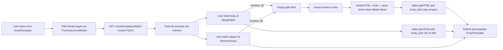

# Design Document: Email Template

## Overview

`EmailTemplate` adalah fitur baru yang mengikuti pola arsitektur `PrintTemplate` (asosiasi ke Model via kolom string `model`, `is_default` per Model, permission-gated CRUD) tetapi dengan dua perbedaan mendasar:

1. **Editor**: `TiptapEditor` (rich-text WYSIWYG) untuk body, `MentionsInput` (plain-text) untuk subject — bukan GrapeJS. Email tidak butuh layout bebas seperti dokumen cetak.
2. **Rendering**: server-side, bukan client-side via Handlebars.js. Penerima email tidak membuka aplikasi ini, sehingga compile harus selesai sebelum email dikirim, di server.

> **Revisi keamanan (pasca security review):** Rencana awal memakai `Blade::render()` untuk compile subject/body ditolak — itu mengeksekusi string sebagai kode PHP penuh (Server-Side Template Injection / RCE) jika template mengandung directive `@php` atau tag `<?php`, walau penulis template dibatasi permission. Implementasi final memakai **whitelist token substitution**: hanya pola `{{ $doc->a->b->c }}` / `{{ $docInfo->x }}` / `{{ $company->x }}` yang disubstitusi via `data_get()` (dot-notation, tidak pernah mengeksekusi kode) lalu di-escape HTML via `e()`. Apa pun di luar pola itu (directive, pemanggilan fungsi/method, tag PHP mentah) dibiarkan sebagai teks literal — tidak pernah masuk compiler PHP. Lihat `EmailTemplateRenderService::TOKEN_PATTERN`.

Yang **tidak berubah**: pola asosiasi Model (`model` string FQCN dicocokkan ke `Permission::model`), pola `is_default` per Model dengan `boot()` hook, pola `resourceDetail` route macro, pola `enforcePermission`, infrastruktur queue (`SendEmailNotificationJob` via koneksi `database`) yang sudah ada tapi belum dipakai siapa pun.

Scope dokumen ini: CRUD + editor + merge-tag + Test Send. Trigger manual (tombol di FormPage), attachment, dan trigger otomatis berbasis event ada di spec terpisah menyusul.

## Architecture

### Data Flow — Authoring



### Data Flow — Test Send (dan nanti: trigger manual/otomatis)

```mermaid
flowchart LR
    A[POST emailTemplates/id/test-send] --> B[EmailTemplateController::testSend]
    B --> C[ExampleDataService: generate data dummy dari Model]
    C --> D[EmailTemplateRenderService::render]
    D --> E["Scan token Blade di subject+body -> daftar relasi"]
    E --> F[Eager-load relasi pada data dummy]
    F --> G["Blade::render(subject, data) dan Blade::render(body_html, data)"]
    G --> H[Bentuk Notification dgn subject+body hasil compile]
    H --> I["SendEmailNotificationJob::dispatch(user login, notification)"]
    I --> J[Queue database]
    J --> K[MailChannel kirim ke email user login]
```



### Kenapa tidak reuse route `editor` terpisah seperti PrintTemplate

PrintTemplate butuh halaman editor terpisah (`printTemplates.editor`) karena GrapeJS adalah canvas full-page. TipTap adalah rich-text field biasa yang muat di form standar — jadi `EmailTemplate/Show.jsx` cukup satu halaman berisi field metadata + TiptapEditor + MentionsInput, mengikuti pola `FormPageContent`/`useFormPage` yang dipakai resource lain. Ini mengurangi 1 controller method, 1 route, dan 1 halaman React dibanding PrintTemplate.

## Components and Interfaces

### Backend

**Migration** `database/migrations/xxxx_create_email_templates_table.php`

```php
Schema::create('email_templates', function (Blueprint $table) {
    $table->ulid('id')->primary();
    $table->string('name');
    $table->foreignUlid('permission_id')->nullable()->constrained('permissions')->nullOnDelete();
    $table->string('model')->nullable();
    $table->string('name_model')->nullable();
    $table->boolean('is_default')->default(false);
    $table->string('subject');
    $table->longText('body_html');
    $table->json('body_json')->nullable();
    $table->string('default_language')->nullable();
    $table->timestamps();
    $table->softDeletes();

    $table->unique(['name', 'deleted_at']);
    $table->index(['model', 'is_default']);
});
```

**Model** `app/Models/Core/EmailTemplate.php`

```php
class EmailTemplate extends Model
{
    use DataTable, HasUlids, SoftDeletes;

    protected $casts = [
        'body_json' => 'array',
        'is_default' => 'boolean',
    ];

    protected $appends = ['title'];

    public string $translateKey = 'core.emailTemplate';

    public function permission(): BelongsTo
    {
        return $this->belongsTo(Permission::class);
    }

    protected static function boot(): void
    {
        parent::boot();

        static::saving(function (EmailTemplate $emailTemplate) {
            // replikasi logic PrintTemplate::boot() —
            // exactly one is_default=true per kolom `model`
        });

        static::saved(function (EmailTemplate $emailTemplate) {
            // demote sibling default jika perlu
        });
    }
}
```

Logic `boot()` disalin persis dari `App\Models\Core\PrintTemplate::boot()` (auto-promote jika ini satu-satunya template untuk `model` tersebut, auto-demote sibling saat template lain di-set default) — lihat Requirement 1.5–1.6.

**Request** `app/Http/Requests/Core/EmailTemplateRequest.php`

```php
public function rules(): array
{
    return [
        'name' => ['required', 'string', Rule::unique('email_templates', 'name')->ignore($this->route('emailTemplate'))->whereNull('deleted_at')],
        'model' => ['required', 'string'],
        'permission_id' => ['nullable', 'exists:permissions,id'],
        'subject' => ['required', 'string', 'max:255'],
        'body_html' => ['required', 'string'],
        'body_json' => ['nullable', 'array'],
        'is_default' => ['boolean'],
    ];
}
```

**Controller** `app/Http/Controllers/Core/EmailTemplateController.php`

```php
class EmailTemplateController extends Controller
{
    public function __construct(
        Request $request,
        protected EmailTemplateRenderService $renderService,
        protected ExampleDataService $exampleDataService,
    ) {
        parent::__construct($request, EmailTemplate::class);
    }

    public function index(): Response { /* Inertia::render('Core/EmailTemplate/Index', ...) */ }
    public function create(): Response { /* Inertia::render('Core/EmailTemplate/Show', ...) */ }
    public function store(EmailTemplateRequest $request): RedirectResponse { /* ... */ }
    public function show(EmailTemplate $emailTemplate): Response { /* ... */ }
    public function update(EmailTemplateRequest $request, EmailTemplate $emailTemplate): RedirectResponse { /* ... */ }
    public function destroy(EmailTemplate $emailTemplate): RedirectResponse { /* ... */ }

    public function fields(Request $request): JsonResponse
    {
        // validasi 'model' => required, string — harus FQCN valid & is_submitable
        // reuse pola $this->model::getColumns(2) milik PrintTemplateController
    }

    public function testSend(EmailTemplate $emailTemplate): RedirectResponse
    {
        $data = $this->exampleDataService->generate($emailTemplate->model);
        $rendered = $this->renderService->render($emailTemplate, $data);

        SendEmailNotificationJob::dispatch(
            auth()->user(),
            new EmailTemplateTestNotification($rendered['subject'], $rendered['body']),
        );

        return back()->with('success', __('core.emailTemplate.testSend.success'));
    }
}
```

`enforcePermission()` override tidak diperlukan tambahan khusus — `fields` dan `testSend` cukup permission `['write']`/`['read']` standar resource (beda dengan PrintTemplate yang butuh `editor`/`preview` khusus karena GrapeJS).

**Render Service** `app/Services/Core/EmailTemplate/EmailTemplateRenderService.php`

```php
class EmailTemplateRenderService
{
    /**
     * @return array{subject: string, body: string}
     */
    protected const string TOKEN_PATTERN = '/\{\{\s*\$(doc|docInfo|company)((?:->[a-zA-Z_][a-zA-Z0-9_]*)*)\s*\}\}/';

    public function render(EmailTemplate $emailTemplate, Model $doc): array
    {
        $relations = $this->extractRelationPaths($emailTemplate->subject . $emailTemplate->body_html);
        if ($relations !== [] && $emailTemplate->model) {
            $doc->loadMissing($this->relationTracker->validateRelations($emailTemplate->model, $relations));
        }

        $data = [
            'doc' => $doc,
            'docInfo' => ['doc_name' => $doc->translateKey . '.name'],
            'company' => $this->resolveCompanyDetails(), // Preference::withoutGlobalScope(...)->get(...)
        ];

        return [
            'subject' => $this->renderMergeTags($emailTemplate->subject, $data),
            'body' => $this->renderMergeTags($emailTemplate->body_html, $data),
        ];
    }

    /**
     * Whitelist substitution — TIDAK memakai Blade::render()/eval/compile.
     * Hanya token yang match TOKEN_PATTERN yang disubstitusi via data_get()
     * (dot-notation, tidak pernah eksekusi kode) lalu di-escape via e().
     * Apa pun di luar pola (directive @php, pemanggilan fungsi, tag PHP
     * mentah) dibiarkan sebagai teks literal.
     */
    private function renderMergeTags(string $template, array $data): string
    {
        return preg_replace_callback(self::TOKEN_PATTERN, function ($match) use ($data) {
            [, $root, $accessorChain] = $match;
            $path = $accessorChain === '' ? $root : $root . '.' . implode('.', explode('->', ltrim($accessorChain, '->')));
            $value = data_get($data, $path);

            if (is_array($value) || (is_object($value) && ! method_exists($value, '__toString'))) {
                return '';
            }

            return e((string) ($value ?? ''));
        }, $template) ?? '';
    }

    private function extractRelationPaths(string $template): array { /* regex scan TOKEN_PATTERN, root === 'doc' saja */ }
}
```

**Catatan keamanan (revisi pasca security review):** Draf awal desain ini memakai `Blade::render()` untuk compile subject/body dengan alasan "trust boundary sama seperti PrintTemplate (hanya user berpermission write/create EmailTemplate yang bisa menulis body)". Automated security review menandai ini sebagai celah Server-Side Template Injection / RCE tetap valid — `@php`/`<?php` dalam body akan tereksekusi sebagai kode PHP sungguhan di server saat email dikirim, bukan sekadar dirender ke browser penulisnya sendiri (beda dari PrintTemplate yang serupa tapi client-side, jadi payload cuma jalan di browser penulis). Diganti ke whitelist substitution di atas — tidak ada compiler PHP yang pernah menyentuh isi template.

**Routes** (`routes/web.php`)

```php
Route::resourceDetail('emailTemplate', EmailTemplateController::class);
Route::get('/emailTemplates/fields', [EmailTemplateController::class, 'fields'])->name('emailTemplates.fields');
Route::post('/emailTemplates/{emailTemplate}/test-send', [EmailTemplateController::class, 'testSend'])->name('emailTemplates.testSend');
```

**Notification** `app/Notifications/EmailTemplateTestNotification.php` — Notification sederhana `implements ShouldQueue` (opsional, karena sudah dibungkus `SendEmailNotificationJob`) dengan `toMail()` mengembalikan subject+body yang sudah di-compile (pakai `MyMailMessage` yang sudah ada bila cocok, atau `MailMessage::view()` custom).

### Frontend

**Merge-tag extension** `resources/js/Components/TiptapMergeTagExtension.js`

```js
import Mention from "@tiptap/extension-mention";

const dotToBladeAccessor = (id) => "$" + id.split(".").join("->");

export const MergeTagExtension = Mention.extend({
  name: "mergeTag",
  renderHTML({ node }) {
    return ["span", { "data-merge-tag": node.attrs.id }, `{{ ${dotToBladeAccessor(node.attrs.id)} }}`];
  },
});
```

Field `id` mention berupa dot-path (`doc.customer.name`), dikonversi ke Blade arrow-path (`$doc->customer->name`) saat `renderHTML` dipanggil oleh `editor.getHTML()`. Tidak ada tahap post-processing terpisah — konversi terjadi di titik serialize, satu tempat, gampang di-unit-test (lihat Testing Strategy).

**Pages** `resources/js/Pages/Core/EmailTemplate/`

- `Index.jsx` — wrapper `DataTable2` + `form={<Form />}`, pola sama `PrintTemplate/Index.jsx`.
- `Form.jsx` — field `name`, `PermissionLinkModel` (filter `is_submitable: true`), `is_default` switch, `MentionsInput` untuk subject, `TiptapEditor` (dgn `MergeTagExtension`) untuk body, tombol "Kirim Test" (POST `emailTemplates.testSend`, toast via `lib/inertiaToast.jsx`).
- `Show.jsx` — shell detail, ikuti pola split `Form.jsx`/`Show.jsx` resource submitable lain di codebase.

`mentionSource` pada kedua editor memanggil `GET emailTemplates/fields?model=<FQCN model terpilih>`, hasilnya dipetakan ke opsi `{ id: "doc.customer.name", display: "Nama Customer" }` sesuai kontrak `react-mentions`/Tiptap `Mention.suggestion.items`.

## Data Models

| Kolom | Tipe | Keterangan |
|---|---|---|
| `id` | ulid PK | |
| `name` | string | unique bersama `deleted_at` |
| `permission_id` | FK nullable → `permissions.id` | nullOnDelete |
| `model` | string nullable | FQCN target, dicocokkan `Permission::model` — bukan polymorphic |
| `name_model` | string nullable | display name model, mirror PrintTemplate |
| `is_default` | boolean | satu default per `model`, di-enforce `boot()` |
| `subject` | string | literal Blade tag di dalamnya |
| `body_html` | longText | HTML dengan token merge-tag literal, siap whitelist-substitution |
| `body_json` | json nullable | struktur TipTap mentah, untuk re-edit |
| `default_language` | string nullable | mirror PrintTemplate (i18n) |
| timestamps + `softDeletes` | | |

Index: unique `(name, deleted_at)`, index `(model, is_default)`.

## Correctness Properties

1. **Satu default per model**: untuk setiap nilai `model` yang dimiliki ≥1 EmailTemplate tidak soft-deleted, jumlah row dengan `is_default = true` selalu tepat 1 (baik model punya 1 atau N template).
2. **Round-trip body_json → editor → body_html**: memuat `body_json` ke TiptapEditor lalu memanggil `getHTML()` tanpa perubahan user harus menghasilkan `body_html` yang sama persis dengan yang tersimpan (idempoten).
3. **Token valid tersubstitusi**: setiap mention node yang di-insert menghasilkan token `{{ $doc->... }}` yang match `TOKEN_PATTERN` dan menghasilkan nilai non-kosong via `data_get()` ketika path relasi/atribut benar-benar ada di Model target.
4. **Render tidak pernah fatal, dan tidak pernah mengeksekusi kode**: `EmailTemplateRenderService::render()` tidak boleh melempar exception ke caller akibat token tunggal yang tidak valid — hasil render selalu berupa string (boleh mengandung token kosong), bukan crash. Lebih ketat lagi: apa pun isi `body_html`/`subject` (termasuk directive Blade, tag PHP, atau ekspresi pemanggilan fungsi), tidak pernah ada kode yang dieksekusi selain traversal `data_get()` — hanya string literal yang disubstitusi atau dibiarkan apa adanya.

## Error Handling

| Scenario | Behavior |
|---|---|
| `name` duplikat (belum soft-deleted) | 422, pesan validasi `EmailTemplateRequest` |
| `model` tidak diisi atau bukan FQCN valid | 422, pesan validasi |
| Token merujuk relasi/atribut yang sudah tidak ada | `data_get()` mengembalikan null, token dirender jadi string kosong, proses render tetap lanjut (Requirement 3.3) |
| Body/subject mengandung directive Blade, tag PHP, atau pemanggilan fungsi | Tidak match `TOKEN_PATTERN` → dibiarkan sebagai teks literal, tidak pernah dieksekusi (lihat Correctness Property 4) |
| `fields()` dipanggil dengan `model` yang bukan FQCN terdaftar sebagai `Permission::model` | Response kosong `[]`, tidak memanggil `::getColumns()` pada class sembarang |
| Test Send dipanggil pada template yang belum tersimpan (`id` null) | Route model binding gagal → 404 (route butuh `{emailTemplate}` yang sudah ada) |
| Queue/mail gagal saat Test Send (`SendEmailNotificationJob` throw) | Exception job ditangkap, flash message error Inertia ke user (Requirement 4.4) |
| User tanpa permission mengakses CRUD/testSend | 403 via `enforcePermission` (pola `Controller` dasar) |

## Testing Strategy

**Unit Tests**
- `EmailTemplateRenderServiceTest` — regex ekstraksi relasi, whitelist substitution dengan token valid vs token rusak (assert fallback string kosong, bukan exception), directive Blade/tag PHP/pemanggilan fungsi TIDAK tereksekusi (regression test RCE), nilai hasil substitusi ter-escape HTML (regression test XSS).
- `TiptapMergeTagExtension` (JS, Jest/Vitest jika tersedia infra testing frontend) — assert `renderHTML` menghasilkan token yang benar dari berbagai dot-path (nested relasi 2+ level).

**Feature Tests (PHPUnit)**
- `tests/Feature/Core/EmailTemplateCrudTest.php` — create/update/delete, unique `name`, `is_default` auto-promote pada template pertama & auto-demote sibling saat default baru di-set (Requirement 1.5–1.6), permission gate 403.
- `tests/Feature/Core/EmailTemplateRenderTest.php` — render dengan data dummy berelasi nested, assert output benar, assert query eager-load jalan (hitung query via `DB::listen`, bukan N+1).
- `tests/Feature/Core/EmailTemplateTestSendTest.php` — `Queue::fake()`, assert `SendEmailNotificationJob` di-dispatch dengan recipient = user login; assert flash error muncul saat job gagal (mock exception).

**Integration**
- End-to-end: buat EmailTemplate lewat Form.jsx (manual browser check per project rule "test UI di browser sebelum melaporkan selesai"), insert mention, submit, cek `body_html` tersimpan mengandung token Blade yang benar, klik Test Send, cek email masuk (log driver / Mailtrap sesuai `.env` lokal).
