# Design Document: Event/Listener Migration — Phase 1

## Overview

Migrasi ini memindahkan 4 kelompok side-effect (audit log — seluruh 6 aksi `logFor*` kecuali `restore`, approval decision side-effect, notifikasi Submitable, cross-domain kecil ModelConnection) dari pemanggilan inline di Controller/Service/Model boot hook ke pola Event/Listener Laravel. Pattern utama yang dipakai: **event dispatch dari titik commit/state-change**, **listener `ShouldQueue` untuk semua side-effect yang tidak punya dependency baca-balik dalam request yang sama**.

Yang berubah: 4 event baru (`AuditableModelSaved`, `ApprovalDecided`, `DocumentStatusChanged`, `DocumentSubmitted`), listener-listener terkait, penghapusan pemanggilan manual yang digantikannya.

Yang TIDAK berubah: struktur data (`Log`, notification classes, job classes tetap sama), isi/format audit log, isi notifikasi, urutan approval workflow, cascade `ApprovalInstanceStep` yang sudah ditangani `CancelPendingApprovalSteps` (listener ini di-extend tanggung jawabnya, bukan diganti).

**Di luar scope Fase 1** (lihat memory `project_event_listener_migration_phases.md`): `billed_quantity` (`SalesInvoiceService`/`PurchaseInvoiceService::onApproved()`) — method ini sudah tercatat sebagai kandidat Fase 3 karena transaction-entangled dengan GL posting; memisah `billed_quantity`-nya saja ke sini akan memecah satu unit transaksi yang seharusnya didesain ulang sekaligus saat Fase 3. `logForRestore()` juga di luar scope — sudah ditangani spec `global-log-viewer` (selesai) dan tidak dipanggil dari alur produksi aktif saat ini.

Precedent yang diikuti: `App\Events\Core\DocumentCanceled` + `App\Listeners\Core\Approval\CancelPendingApprovalSteps`, didispatch dari `Submitable::bootSubmitable()` `saved()` hook.

> **Prasyarat selesai**: spec `approval-system-rewrite` (`.kiro/specs/approval-system-rewrite/`, status: selesai, full regression PASS) sudah menyelesaikan rewrite arsitektur approval yang menjadi prasyarat Fase 1 ini — string-based dynamic dispatch (`app()->call("$controller@method")`) sudah dihapus, digantikan resolusi eksplisit lewat property `$service` pada Model dan `ApprovalService` generik. Perubahan yang relevan untuk desain di bawah: `ApprovalInstanceController::checkApproval()` **sudah dihapus** — logic-nya pindah ke `Submitable::checkApproval()` sendiri (lihat Requirement 1 titik dispatch #4); `ApprovalInstanceController::callDocumentCallback()` **sudah dihapus** — `approve()`/`reject()` sekarang resolve `$document::$service` dan panggil `onApproved()`/`onRejected()` langsung (lihat Requirement 2 Data Flow). Struktur lain (urutan approval workflow, cascade `ApprovalInstanceStep`) tidak berubah oleh rewrite tersebut.

## Architecture

```mermaid
flowchart TB
    subgraph DataTable["DataTable::bootDataTable()\n(~60 model, TERMASUK non-submitable)"]
        A3["created / updated"]
    end

    subgraph Submitable["Submitable::bootSubmitable()\n(~13 model dokumen)"]
        A1["creating/saving hooks\n(TIDAK BERUBAH)"]
        A2["saved: status → CANCELED"]
        A4["saved: notifyRolesOnStatus\nconfig ada utk status ini"]
    end

    subgraph BaseCtrl["Controller.php (base)"]
        F1["destroy()"]
        F2["cancel()"]
    end

    subgraph AIC["ApprovalInstanceController"]
        B1["approve() setelah DB::commit()"]
        B2["reject() setelah DB::commit()"]
        B3["checkApproval() — submit"]
    end

    subgraph AmendFlow["Submitable::amend()"]
        G1["amend berhasil"]
    end

    subgraph SubmitFlow["Service submit() — 6+ tempat"]
        D1["submit berhasil"]
    end

    A2 -->|event| E1((DocumentCanceled))
    A3 -->|event| E2((AuditableModelSaved: created/updated))
    A4 -->|event| E3((DocumentStatusChanged))
    B1 -->|event| E4((ApprovalDecided: approved))
    B2 -->|event| E4b((ApprovalDecided: rejected))
    B3 -->|event| E2b((AuditableModelSaved: submitted))
    F1 -->|event| E2c((AuditableModelSaved: deleted))
    F2 -->|event| E2d((AuditableModelSaved: cancelled))
    G1 -->|event| E2e((AuditableModelSaved: amended))
    D1 -->|event| E6((DocumentSubmitted))

    E1 --> L1["CancelPendingApprovalSteps\n(+ ApprovalCanceledNotification)"]
    E2 --> L2["RecordAuditLog\n(ShouldQueue)"]
    E2b --> L2
    E2c --> L2
    E2d --> L2
    E2e --> L2
    E3 --> L3["NotifyRoleOnStatusChange\n(ShouldQueue)"]
    E4 --> L4["AttachApprovalPdf\n(ShouldQueue, hanya jika fully-approved)"]
    E4 --> L5["NotifyApprovalDecision\n(ShouldQueue)"]
    E4 --> L6["NotifyNextApprover\n(ShouldQueue, hanya jika ada next-pending)"]
    E6 --> L8["CreateDocumentConnection\n(ShouldQueue)"]
```



> **Di luar diagram ini**: `OrderItemBilled` (billed_quantity) — dikeluarkan dari Fase 1, lihat Overview.

### Data Flow — contoh Requirement 2 (approve)

> **Prasyarat berubah**: spec `approval-system-rewrite` (selesai, lihat `.kiro/specs/approval-system-rewrite/`) sudah menghapus `callDocumentCallback()` dan `app()->call("$controller@method")`. `ApprovalInstanceController::approve()`/`reject()` sekarang resolve Service dokumen lewat property `$document::$service` dan memanggil `onApproved()`/`onRejected()` langsung (bukan lewat Controller). Urutan di bawah ini mengikuti struktur BARU tersebut.

1. User submit keputusan approve → `ApprovalInstanceController::approve()`.
2. Transaksi DB commit (status step + approval instance ter-update).
3. **Setelah** `DB::commit()`: `event(new ApprovalDecided($approval, 'approved'))`.
4. Laravel queue listener yang subscribe: `AttachApprovalPdf` (guard: hanya jalan jika `$approval->status === APPROVED`), `NotifyApprovalDecision` (kirim ke creator), `NotifyNextApprover` (guard: hanya jalan jika ada step next-pending — payload event menyertakan `nextPendingStep` nullable).
5. Controller lanjut resolve `$serviceClass = $approval->document::$service` dan panggil `app($serviceClass)->onApproved($document)` langsung (return value dipakai sebagai response HTTP) — TIDAK dipindah ke event/listener, karena return value-nya dipakai controller (lihat Requirement 4.3 `approval-system-rewrite`, alasan sama berlaku di sini: `event()` Laravel tidak resmi mendukung pengambilan return value dari listener).

## Components and Interfaces

### Requirement 1 — Audit log generik (6 aksi)

**Event**: `App\Events\Core\AuditableModelSaved`
```php
class AuditableModelSaved {
    use Dispatchable, SerializesModels;
    public function __construct(
        public readonly Model $model,
        public readonly string $action,      // 'created'|'updated'|'deleted'|'cancelled'|'submitted'|'amended'
        public readonly array $dataBefore = [],  // hanya diisi utk 'updated'; [] utk aksi lain
        public readonly array $dataAfter = [],   // hanya diisi utk 'created'/'updated'; [] utk aksi lain
    ) {}
}
```

`created`/`updated` menyertakan `dataBefore`/`dataAfter` (snapshot `logableFields()`, sama seperti `logForCreated()`/`logForUpdated()` saat ini). `deleted`/`cancelled`/`submitted`/`amended` TIDAK menyertakan before/after data — method `logFor*()` yang bersangkutan di `DataTable.php` saat ini juga hanya menulis `activity` + identitas, tanpa data snapshot (lihat kode `logForDeleted()`, `logForCancelled()`, dst).

**Titik dispatch** (4 lokasi berbeda, semua tepat sebelum atau setelah commit sesuai pola existing masing-masing):

1. **created/updated** — hook baru `static::created()`/`static::updated()` di **`DataTable::bootDataTable()`** (`app/Traits/DataTable.php:38-82`), BUKAN di `Submitable`. `logForCreated()`/`logForUpdated()` dipanggil oleh ~60 model yang memakai `DataTable` (mis. `User`, `Customer`, `Item`, `Role`, `Branch`, `Account`), sedangkan `Submitable` hanya dipakai ~13 model dokumen (yang memakai `DataTable, Submitable` bersamaan). Menaruh hook ini di `Submitable` akan membuat audit log created/updated mati total untuk ~47 model non-submitable yang saat ini masih memanggil `logForCreated()`/`logForUpdated()` manual. Guard yang dipakai BUKAN `isSubmitable()` — mengikuti pola guard existing di seluruh method `logFor*()` (skip hanya untuk `Log` model itu sendiri, mencegah rekursi):
   ```php
   static::created(function ($model) {
       if (get_class($model) === Log::class) { return; }
       $model->loadRelations();
       $keys = $model->logableFields();
       event(new AuditableModelSaved($model, 'created',
           dataAfter: \array_replace(\array_fill_keys($keys, null), \array_intersect_key($model->toArray(), array_flip($keys))),
       ));
   });
   static::updated(function ($model) {
       if (get_class($model) === Log::class || ! $model->dataBefore) { return; }
       $model->loadRelations();
       $keys = $model->logableFields();
       event(new AuditableModelSaved($model, 'updated',
           dataBefore: \array_replace(\array_fill_keys($keys, null), \array_intersect_key($model->dataBefore, array_flip($keys))),
           dataAfter: \array_replace(\array_fill_keys($keys, null), \array_intersect_key($model->toArray(), array_flip($keys))),
       ));
   });
   ```
   **`dataBefore`/`dataAfter` di-snapshot di titik dispatch (sync), bukan dibaca ulang di listener** — lihat Error Handling untuk alasan (race condition antar-job). `dataBefore` sendiri di-set oleh `recordLogs()` (`DataTable.php:239-242`, dipanggil dari `fillForUpdate()`) — mekanisme ini TIDAK berubah, hanya titik pemanggilan `logForUpdated()` yang berpindah jadi event.
2. **deleted** — `Controller::destroy()` (`app/Http/Controllers/Controller.php:553-569`), menggantikan `$data->logForDeleted();` (baris 560), tetap di dalam `DB::beginTransaction()`/`commit()` yang sama: `event(new AuditableModelSaved($data, 'deleted'));`
3. **cancelled** — `Controller::cancel()` (`Controller.php:510-526`), menggantikan `$data->logForCancelled();` (baris 517): `event(new AuditableModelSaved($data, 'cancelled'));`
4. **submitted** — `Submitable::checkApproval()` (`app/Traits/Submitable.php:215-221`, dalam closure `DB::transaction` — method ini PINDAH ke sini dari `ApprovalInstanceController::checkApproval()` yang sudah dihapus oleh spec `approval-system-rewrite`), menggantikan `$this->logForSubmitted();` (baris 217): `event(new AuditableModelSaved($this, 'submitted'));`
5. **amended** — `Submitable::amend()` (baris ~262) — TETAP di `Submitable` karena method `amend()` sendiri hanya ada di trait ini (hanya model submitable yang bisa di-amend), menggantikan `$this->logForAmended();`: `event(new AuditableModelSaved($this, 'amended'));`

**Listener**: `App\Listeners\Core\Audit\RecordAuditLog implements ShouldQueue`
```php
private const ACTIVITY = [
    'created'   => ['en' => ':user created this', 'id' => ':user telah membuat ini'],
    'updated'   => ['en' => ':user updated this', 'id' => ':user memperbarui ini'],
    'deleted'   => ['en' => ':user deleted this', 'id' => ':user menghapus ini'],
    'cancelled' => ['en' => ':user canceled this', 'id' => ':user telah membatalkan'],
    'submitted' => ['en' => ':user submitted this', 'id' => ':user telah mengajukan ini'],
    'amended'   => ['en' => ':user amended this', 'id' => ':user telah mengembalikan ini'],
];

public function handle(AuditableModelSaved $event): void {
    Log::create([
        'user_id'       => Auth::id(),
        'loggable_id'   => $event->model->getKey(),
        'loggable_type' => get_class($event->model),
        'action'        => $event->action,
        'activity'      => self::ACTIVITY[$event->action],
        'data_before'   => $event->dataBefore ?: null,
        'data_after'    => $event->dataAfter ?: null,
    ]);
}
```

Isi log TIDAK berubah dari 6 method `logFor*()` di `DataTable.php` saat ini untuk masing-masing aksi — hanya snapshot data (untuk created/updated) dipindah ke titik dispatch (sync, di request thread) sementara PENULISAN `Log::create()` dipindah ke listener (queued). Ini menghindari race condition: kalau model yang sama di-update 2x berurutan cepat (request A lalu B) dan job untuk request A telat diproses, listener tidak re-fetch `$model` dari database (yang sudah berisi hasil request B) — ia menulis persis snapshot yang dikirim event, sehingga urutan log tetap sesuai urutan kejadian meski job diproses out-of-order.

**Perubahan di 15+ service**: hapus baris `$model->logForCreated();` / `$model->logForUpdated();` di akhir method `create()`/`update()`. **Perubahan di 4 titik lain**: hapus `$data->logForDeleted()`/`logForCancelled()`/`logForSubmitted()`/`logForAmended()` di titik dispatch masing-masing (lihat daftar di atas), ganti dengan `event()`.

**`logForRestore()` TIDAK termasuk** — di luar scope (lihat Overview).

**Perbaikan bug duplikasi**: hapus panggilan manual `logForCreated()`/`logForUpdated()` di `PurchaseReceiptController.php:130` dan `SalesOrderController.php:132` — log sekarang hanya tercatat sekali lewat listener.

### Requirement 2 — ApprovalInstanceController approve/reject

**Event**: `App\Events\Core\ApprovalDecided`
```php
class ApprovalDecided {
    use Dispatchable, SerializesModels;
    public function __construct(
        public readonly ApprovalInstance $approvalInstance,
        public readonly string $decision, // 'approved' | 'rejected'
        public readonly ?ApprovalInstanceStep $nextPendingStep = null,
        public readonly ?string $notes = null,
    ) {}
}
```

Dispatch di `ApprovalInstanceController::approve()` setelah `DB::commit()` (`app/Http/Controllers/Core/ApprovalInstanceController.php:180`, menggantikan blok 182-196 — resolusi `$serviceClass`, `AttachGeneratedPdfJob::dispatch()`, notifikasi, dan pemanggilan `onApproved()`), dan di `reject()` setelah `DB::commit()` (baris ~271, menggantikan blok 273-285). **Urutan di kode saat ini**: resolve `$serviceClass` → `AttachGeneratedPdfJob::dispatch()` → notifikasi `ApprovalDecidedNotification` → panggil `onApproved($document)`. Event `ApprovalDecided` menggantikan dispatch PDF job + notifikasi (baris 185, 187-190) — pemanggilan `onApproved()`/`onRejected()` (baris 192-193/281-282) TETAP sebagai pemanggilan langsung setelah event di-dispatch, BUKAN bagian dari listener (lihat Data Flow di atas).

**Listener 1**: `App\Listeners\Core\Approval\AttachApprovalPdf implements ShouldQueue`
```php
public function handle(ApprovalDecided $event): void {
    if ($event->decision !== 'approved' || $event->approvalInstance->status !== FormStatus::APPROVED) {
        return;
    }
    AttachGeneratedPdfJob::dispatch($event->approvalInstance);
}
```
Catatan: listener ini men-dispatch job lain (`AttachGeneratedPdfJob`) — tetap job terpisah karena job itu sendiri sudah menangani generate PDF (unit terpisah, tidak digabung ke listener).

**Listener 2**: `App\Listeners\Core\Approval\NotifyApprovalDecision implements ShouldQueue`
```php
public function handle(ApprovalDecided $event): void {
    $creator = $event->approvalInstance->document?->createdBy;
    if (! $creator) { return; }
    app(NotifyUser::class)->send($creator, new ApprovalDecidedNotification(
        $event->approvalInstance, $event->decision, $event->notes,
    ));
}
```

**Listener 3**: `App\Listeners\Core\Approval\NotifyNextApprover implements ShouldQueue`
```php
public function handle(ApprovalDecided $event): void {
    if (! $event->nextPendingStep) { return; }
    $candidates = $event->nextPendingStep->resolveCandidateUsers();
    if ($candidates->isNotEmpty()) {
        app(NotifyUser::class)->send($candidates, new ApprovalPendingNotification($event->nextPendingStep));
    }
}
```

### Requirement 3 — Submitable partial migration

**3a. `ApprovalCanceledNotification` → listener existing**

Extend `CancelPendingApprovalSteps::handle()` menambahkan pengiriman notifikasi setelah cascade step (bukan listener terpisah — notifikasi ini secara langsung bergantung pada `$pendingSteps` hasil cascade yang sudah dihitung listener ini, memisahkannya jadi 2 listener akan menduplikasi query `whereIn('status', [PENDING, WAITING])`):

```php
class CancelPendingApprovalSteps implements ShouldQueue {
    public function handle(DocumentCanceled $event): void {
        $steps = /* ...cascade yang sudah ada... */;
        // ...update status step (tidak berubah)...

        $candidates = $steps->flatMap(fn ($step) => $step->resolveCandidateUsers())->unique('id')->values();
        if ($candidates->isNotEmpty()) {
            app(NotifyUser::class)->send(
                $candidates,
                new ApprovalCanceledNotification($event->approvalInstance, $steps->pluck('sequence')->all()),
            );
        }
    }
}
```

Perubahan: tambah `implements ShouldQueue` (saat ini sync — lihat Error Handling untuk alasan aman di-queue).

**3b. `DocumentStatusChanged` — event baru untuk role-based notification**

```php
class DocumentStatusChanged {
    use Dispatchable, SerializesModels;
    public function __construct(
        public readonly Model $document,
        public readonly array $roles, // hasil resolusi notifyRolesOnStatus() utk status saat ini
    ) {}
}
```

Dispatch dari `Submitable::bootSubmitable()`, menggantikan blok `self::saved()` kedua (baris ~150-172):
```php
self::saved(function ($model) {
    if (! ($model->isSubmitable() ?? false) || ! $model->wasChanged('status')) { return; }
    $config = static::notifyRolesOnStatus();
    $roles = [];
    foreach ($model->status as $statusValue) {
        $roles = [...$roles, ...($config[$statusValue->value] ?? [])];
    }
    $roles = array_unique($roles);
    if ($roles === []) { return; }
    event(new DocumentStatusChanged($model, $roles));
});
```

**Listener**: `App\Listeners\Core\Submission\NotifyRoleOnStatusChange implements ShouldQueue`
```php
public function handle(DocumentStatusChanged $event): void {
    $candidates = User::whereHas('roles', fn ($q) => $q->whereIn('name', $event->roles))->get();
    if ($candidates->isEmpty()) { return; }
    app(NotifyUser::class)->send($candidates, new DocumentSubmittedNotification($event->document, implode(',', $event->roles)));
}
```

### Requirement 4 — Cross-domain kecil: konsolidasi `ModelConnection::create()`

> `billed_quantity` (`OrderItemBilled`) TIDAK dibahas di sini — dikeluarkan dari Fase 1, lihat Overview. Akan didesain bersama seluruh isi `onApproved()` terkait saat Fase 3.

```php
class DocumentSubmitted {
    use Dispatchable, SerializesModels;
    public function __construct(
        public readonly Model $document,
        public readonly ?Model $reference = null, // dokumen sumber (mis. SalesOrder utk DeliveryNote)
        public readonly ?array $data = null,
    ) {}
}
```

**Listener**: `App\Listeners\Core\Submission\CreateDocumentConnection implements ShouldQueue`
```php
public function handle(DocumentSubmitted $event): void {
    if (! $event->reference) { return; }
    $event->document->attachConnections($event->reference, $event->data);
}
```

Dispatch ditambahkan di titik `submit()` pada 6 service (SalesOrder, DeliveryNote, PurchaseReceipt, PurchaseInvoice, SalesInvoice, PaymentEntry), menggantikan pemanggilan `attachConnections()`/`ModelConnection::create()` langsung.

## Data Models

Tidak ada perubahan skema database. Seluruh event menggunakan model Eloquent existing sebagai payload (`SerializesModels` untuk keperluan queue serialization).

## Correctness Properties

**Property 1 — Audit log tidak hilang, tidak duplikat, dan urut sesuai kejadian.**
_For any_ model submitable yang mengalami salah satu dari 6 aksi (created/updated/deleted/cancelled/submitted/amended), jumlah baris `Log` yang tercatat untuk aksi tersebut SHALL selalu tepat 1 (tidak 0, tidak 2+), dengan isi (`activity`, dan untuk created/updated juga `data_before`/`data_after`) identik dengan hasil method `logFor*()` versi sebelum migrasi. _For any_ dua update berurutan pada model yang sama, urutan `data_before`/`data_after` pada `Log` yang tercatat SHALL merepresentasikan urutan kejadian aslinya, bukan urutan job diproses queue worker.
**Validates: Requirement 1.1, 1.2, 1.3, 1.4, 1.6**

**Property 2 — Approval decision notification lengkap.**
_For any_ approval instance yang di-approve hingga fully-approved, THE creator SHALL menerima `ApprovalDecidedNotification`, DAN `AttachGeneratedPdfJob` SHALL ter-dispatch tepat 1 kali. _For any_ approval instance yang di-approve tapi masih ada step berikutnya, kandidat approver step tersebut SHALL menerima `ApprovalPendingNotification`, DAN `AttachGeneratedPdfJob` SHALL TIDAK ter-dispatch.
**Validates: Requirement 2.1-2.5**

**Property 3 — Submitable notification parity.**
_For any_ dokumen yang dibatalkan dengan step PENDING/WAITING tersisa, kandidat approver step tersebut SHALL menerima `ApprovalCanceledNotification` (perilaku ini sudah divalidasi test existing `CancelPendingApprovalStepsTest::test_cancel_notification_still_sent_alongside_cascade` — harus tetap PASS). _For any_ dokumen yang statusnya berubah ke status dengan `notifyRolesOnStatus()` terkonfigurasi, user dengan role tersebut SHALL menerima `DocumentSubmittedNotification`.
**Validates: Requirement 3.1-3.4**

**Property 4 — ModelConnection tetap terhubung setelah submit.**
_For any_ dokumen submitable yang berhasil disubmit dengan dokumen referensi (mis. DeliveryNote dari SalesOrder), `ModelConnection` cross-reference SHALL tetap terbentuk setara dengan perilaku `attachConnections()` sebelum migrasi.
**Validates: Requirement 4.1**

## Error Handling

| Scenario | Behavior |
|----------|----------|
| Listener `ShouldQueue` gagal (exception di queue worker) | Laravel default: masuk `failed_jobs` setelah retry habis. TIDAK mempengaruhi transaksi asal (sudah commit sebelum event didispatch) — konsisten dengan komentar existing di `ApprovalInstanceController.php:235-239` soal PDF attachment. |
| `AuditableModelSaved` didispatch tapi listener belum sempat jalan sebelum request selesai | Aman — audit log bersifat eventual, tidak ada bagian lain sistem yang baca log secara sync dalam request yang sama. |
| Model yang sama di-update 2x berurutan cepat (request A lalu B), job queue untuk request A diproses SETELAH job request B (out-of-order) | Aman — `dataBefore`/`dataAfter` di-snapshot ke payload event SAAT dispatch (sync, di titik `self::updated()`), bukan dibaca ulang dari `$model` di listener. Listener menulis persis snapshot yang dikirim, sehingga urutan `Log` yang tercatat tetap merepresentasikan urutan kejadian sebenarnya walau job diproses out-of-order oleh queue worker. |
| `DocumentSubmitted` — `reference` null | Listener `CreateDocumentConnection` no-op (guard `if (! $event->reference) return;`) — tidak error, konsisten dengan `attachConnections()` existing yang juga early-return bila `referenceable_type`/`referenceable_id` null. |
| Listener baru dipanggil pada model yang bukan submitable | Semua event dispatch dijaga guard `$model->isSubmitable() ?? false` di titik dispatch (trait) atau dispatch hanya terjadi di titik yang sudah pasti model submitable (`Controller::destroy()`/`cancel()` dioperasikan lewat base controller submitable), sehingga listener tidak pernah menerima model non-submitable. |

## Testing Strategy

- **Unit Tests**: satu test class per listener baru, memanggil `$listener->handle($event)` langsung (pola dari `CancelPendingApprovalStepsTest::test_listener_is_idempotent_when_called_multiple_times`) — verifikasi side-effect terisolasi tanpa HTTP request.
- **Integration/Feature Tests**: gunakan `Event::fake()` untuk assert event ter-dispatch dari titik yang benar (mis. `Event::assertDispatched(ApprovalDecided::class, fn ($e) => $e->decision === 'approved')`), dan `Queue::fake()` + `Notification::fake()` untuk memverifikasi listener `ShouldQueue` ter-queue tanpa benar-benar menjalankan side-effect di test yang tidak fokus ke situ.
- **Regression**: jalankan ulang test existing tanpa mengubah assertion bisnis — `ApprovalNotificationTest`, `ApprovalPdfAutoAttachTest`, `ApprovalAutoApproveTest`, `CancelPendingApprovalStepsTest`, `RoleBasedNotificationTest`, `SubmitableSnapshotFormatTest`. Modifikasi yang diperbolehkan: menambah `Event::fake()`/`Queue::fake()` bila test sebelumnya mengandalkan eksekusi sync yang sekarang jadi queued.
- **Bug fix verification**: test baru yang eksplisit assert `Log::where('loggable_id', $id)->where('action', 'created')->count() === 1` untuk dokumen yang dibuat lewat `PurchaseReceiptController`/`SalesOrderController` — memverifikasi bug duplikasi (Requirement 1.4) benar-benar hilang.
