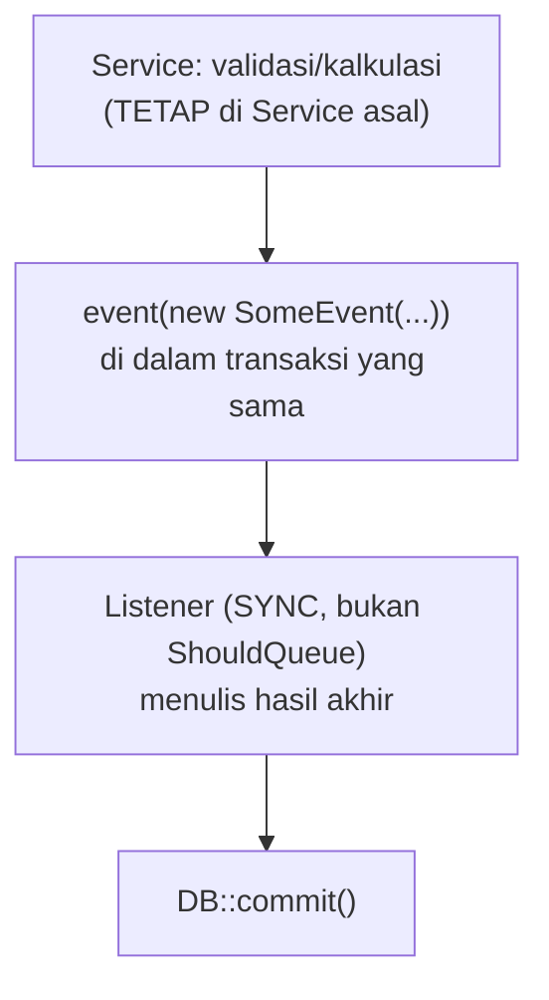
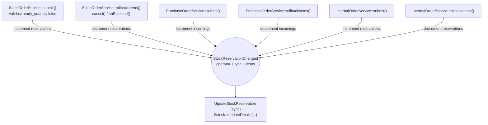
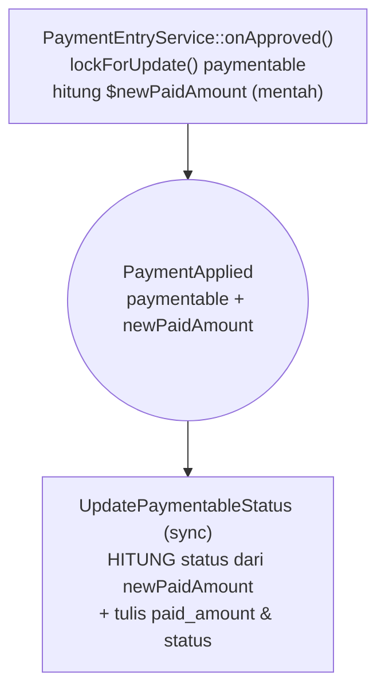
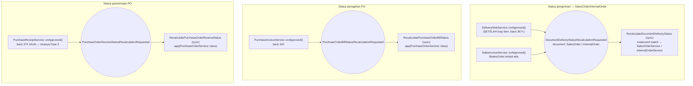
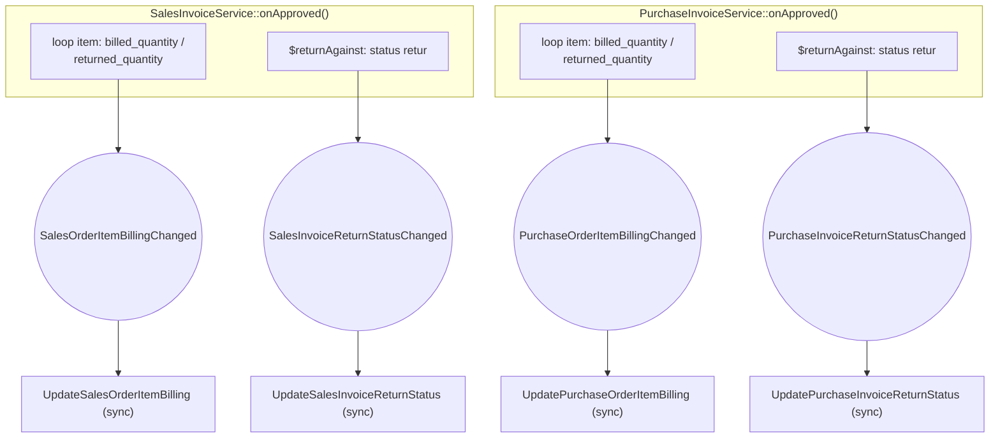

# Design Document: Event/Listener Migration — Phase 2

## Overview

Migrasi ini memindahkan 4 kelompok cross-domain mutation (reservasi stok, update status `paymentable`, sinkronisasi status dokumen sumber pengiriman/penagihan, jalur retur SalesInvoice/PurchaseInvoice) dari pemanggilan langsung di dalam Service ke pola Event/Listener, plus mengoreksi 3 listener Fase 1 yang seharusnya sync, dan menutup 2 celah konkurensi baru yang ditemukan saat audit. Pattern utama: **semua listener di fase ini SYNC** (bukan `ShouldQueue`) — beda dari Fase 1 yang seluruhnya queued — karena setiap kandidat punya dependency baca-balik dalam request yang sama atau butuh konsistensi transaksional immediate.

Yang berubah: 9 event baru (`StockReservationChanged`, `PaymentApplied`, `DocumentDeliveryStatusRecalculationRequested`, `PurchaseOrderBillStatusRecalculationRequested`, `PurchaseOrderReceiveStatusRecalculationRequested`, plus 4 event retur pada Requirement 7) dengan listener sync masing-masing; 3 listener Fase 1 kehilangan `ShouldQueue`; rename `rolllbackItems`→`rollbackItems` di 2 Service; `lockForUpdate()` ditambahkan di 2 titik read-modify-write yang sebelumnya tidak terkunci; 3 method status-sync di-extract/dipindah jadi method publik di `PurchaseOrderService`/`InternalOrderService` (`InternalOrderService::updateInternalOrderStatus()` baru — extract dari inline; `PurchaseOrderService::updatePurchaseOrderBillStatus()` dipindah dari `PurchaseInvoiceService`; `PurchaseOrderService::updatePurchaseOrderReceiveStatus()` dipindah dari `PurchaseReceiptService`); kalkulasi status `paymentable` (Requirement 3) dipindah dari Service ke listener.

Yang TIDAK berubah: logic validasi bisnis (guard `is_stock_item`, `ready_quantity`, dsb — tetap di Service asal, event hanya membawa hasil akhir yang sudah divalidasi), `lockForUpdate()` existing pada `Stock` di titik submit (kode lama, dipertahankan apa adanya), struktur `SubmitableService` dari `approval-system-rewrite`, SELURUH GL posting (`GeneralLedgerEntry::create()`) di setiap Service yang disentuh fase ini — GL tetap kode langsung, tidak pernah dipindah ke event/listener, `delivered_quantity` pada `DeliveryNoteService` (tetap pemanggilan langsung, lihat exclusion di bawah).

**Scope yang SENGAJA DIKELUARKAN (dibuktikan via audit, bukan diasumsikan)**: `DeliveryNoteService::onApproved()` SELURUHNYA (bukan hanya jalur retur seperti audit awal — audit lanjutan menemukan jalur rental baris 218-254 dan forward-normal baris 297-364 SAMA-SAMA interleaved dengan `Stock`/`StockLedgerEntry`, termasuk operasi Stock jenis `'rents'` yang sebelumnya tidak teridentifikasi) dan `PurchaseReceiptService::onApproved()` (forward maupun retur) SELURUHNYA — kedua method ini mencampur mutasi item dengan `Stock`/`StockLedgerEntry` mutation dalam satu iterasi loop yang saling bergantung variabel. PENGECUALIAN: dispatch `DocumentDeliveryStatusRecalculationRequested` dari `DeliveryNoteService::onApproved()` (Requirement 4) TETAP masuk Fase 2 karena posisinya di luar loop yang entangled (lihat Requirement 5 di bawah untuk detail). Baik `DeliveryNoteService` (sisa method) maupun `PurchaseReceiptService` tetap dikategorikan Fase 3.

**Struktur folder `App\Events\{Domain}\{Feature}` (revisi 2026-08-08)**: draft awal spec ini menaruh SEMUA event flat (`App\Events\{Domain}\`), TIDAK konsisten dengan aturan proyek yang sudah tercatat di memory `feedback_domain_feature_folder_structure.md` — nested `{Feature}` dipicu jumlah file Event yang berhubungan di domain yang sama (>1, atau diprediksi tumbuh), bukan otomatis mengikuti Listener-nya. Setelah audit ulang tiap event secara independen:
- `App\Events\Inventory\StockReservationChanged` dan `App\Events\Finances\PaymentApplied` — TETAP flat, masing-masing satu-satunya event di domainnya, tidak diprediksi bertambah.
- `App\Events\Sales\Order\DocumentDeliveryStatusRecalculationRequested` — DINESTED preemptif ke `Order\` (bukan karena sudah ada event lain saat ini, tapi domain "status recalculation" diprediksi bertambah di Fase 3 kalau `DeliveryNote`/`PurchaseReceipt` didesain ulang) — juga membuatnya SIMETRIS dengan listener-nya yang sudah `App\Listeners\Sales\Order\`.
- `App\Events\Purchase\Order\` (2 event: `PurchaseOrderBillStatusRecalculationRequested`, `PurchaseOrderReceiveStatusRecalculationRequested`) — DINESTED karena keduanya nyata ADA sekarang, sama-sama soal status `PurchaseOrder`, dipicu Service berbeda.
- `App\Events\Sales\Invoice\` (2 event: `SalesOrderItemBillingChanged`, `SalesInvoiceReturnStatusChanged`) dan `App\Events\Purchase\Invoice\` (2 event setara) — DINESTED karena masing-masing pasangan SELALU dispatch dari `onApproved()` Service yang sama (`SalesInvoiceService`/`PurchaseInvoiceService`), sesuai Requirement 7.

## Architecture

Pola umum yang berulang di seluruh Requirement fase ini:



Diagram detail per Requirement ada di masing-masing section `Components and Interfaces` di bawah (dipecah per-Requirement, bukan satu diagram besar, agar tetap terbaca).

### Ringkasan pemetaan Event → Listener

| Requirement | Event | Listener | Dipicu dari |
|---|---|---|---|
| 2 | `StockReservationChanged` | `UpdateStockReservation` | `SalesOrderService`/`PurchaseOrderService`/`InternalOrderService` — `submit()` & `rollbackItems()` |
| 3 | `PaymentApplied` | `UpdatePaymentableStatus` | `PaymentEntryService::onApproved()` |
| 4 | `DocumentDeliveryStatusRecalculationRequested` | `RecalculateDocumentDeliveryStatus` | `DeliveryNoteService`/`SalesInvoiceService::onApproved()` |
| 4 | `PurchaseOrderBillStatusRecalculationRequested` | `RecalculatePurchaseOrderBillStatus` | `PurchaseInvoiceService::onApproved()` |
| 4 | `PurchaseOrderReceiveStatusRecalculationRequested` | `RecalculatePurchaseOrderReceiveStatus` | `PurchaseReceiptService::onApproved()` (1 titik saja, sisanya Fase 3) |
| 7 | `SalesOrderItemBillingChanged` | `UpdateSalesOrderItemBilling` | `SalesInvoiceService::onApproved()` |
| 7 | `SalesInvoiceReturnStatusChanged` | `UpdateSalesInvoiceReturnStatus` | `SalesInvoiceService::onApproved()` (jalur retur) |
| 7 | `PurchaseOrderItemBillingChanged` | `UpdatePurchaseOrderItemBilling` | `PurchaseInvoiceService::onApproved()` |
| 7 | `PurchaseInvoiceReturnStatusChanged` | `UpdatePurchaseInvoiceReturnStatus` | `PurchaseInvoiceService::onApproved()` (jalur retur) |

### Data Flow — contoh Requirement 2 (submit SalesOrder)

1. `SalesOrderService::submit()` — `DB::beginTransaction()`, generate code, buat `ModelConnection` referensi.
2. `Stock::...->lockForUpdate()->get()` (kode existing, TIDAK berubah) — kunci row Stock yang relevan.
3. Loop item: guard `is_stock_item`, hitung `$quantity`, validasi `ready_quantity` — kumpulkan hasil yang lolos validasi ke array (bukan langsung `$stock->updateDetails(...)`).
4. Jika ada `$errorItems`: `DB::rollBack()`, `throw ValidationException` (TIDAK BERUBAH — event belum sempat didispatch, tidak ada listener yang jalan).
5. Jika lolos semua: `event(new StockReservationChanged($salesOrder, 'increment', 'reservations', $validatedItems))` — listener `UpdateStockReservation` jalan SYNC di titik ini, di dalam transaksi yang sama (masih sebelum `DB::commit()`).
6. Jika listener throw (mis. race — walau `lockForUpdate()` seharusnya mencegah ini dalam kondisi normal): exception propagate, transaksi ROLLBACK (behavior sama seperti sebelum migrasi, exception dari `updateDetails()` dulu juga akan rollback transaksi yang sama).
7. `DB::commit()`, `$salesOrder->checkApproval()`.

## Components and Interfaces

### Requirement 1 — Koreksi 3 listener Fase 1

Perubahan mekanis, hapus `implements ShouldQueue` dari:
- `App\Listeners\Core\Approval\CancelPendingApprovalSteps`
- `App\Listeners\Core\Submission\CreateDocumentConnection`
- `App\Listeners\Core\Audit\RecordAuditLog`

Tidak ada perubahan pada `handle()` method masing-masing — hanya interface yang dihapus. `EventServiceProvider::$listen` tidak berubah (registrasi listener sama, Laravel otomatis menjalankan sync bila listener tidak `ShouldQueue`).

### Requirement 2 — `StockReservationChanged`



**Event**: `App\Events\Inventory\StockReservationChanged`
```php
class StockReservationChanged {
    use Dispatchable;

    /**
     * @param  list<array{itemVariantId:string,warehouseId:string,quantity:float}>  $items
     */
    public function __construct(
        public readonly Model $document,
        public readonly string $operator,  // 'increment' | 'decrement'
        public readonly string $type,      // 'reservations' | 'incomings'
        public readonly array $items,
    ) {}
}
```
Tidak pakai `SerializesModels` — event ini sync, tidak pernah diserialisasi ke queue.

**Listener**: `App\Listeners\Inventory\Stock\UpdateStockReservation` (TIDAK `ShouldQueue`)
```php
public function handle(StockReservationChanged $event): void {
    $stocks = Stock::whereIn('item_variant_id', collect($event->items)->pluck('itemVariantId'))
        ->whereIn('warehouse_id', collect($event->items)->pluck('warehouseId'))
        ->lockForUpdate()
        ->get()
        ->keyBy(fn ($s) => "{$s->item_variant_id}-{$s->warehouse_id}");

    foreach ($event->items as $item) {
        $stock = $stocks->get("{$item['itemVariantId']}-{$item['warehouseId']}");
        if (! $stock) {
            throw new \RuntimeException("Stock not found for item {$item['itemVariantId']} in warehouse {$item['warehouseId']}");
        }
        $stock->updateDetails($event->operator, $event->type, $event->document->code, $item['quantity']);
    }
}
```
Catatan: listener melakukan `lockForUpdate()` SENDIRI atas item yang diterima — ini REDUNDAN secara lock (row sudah terkunci oleh `lockForUpdate()` existing di Service pemanggil dalam transaksi yang sama), tapi aman (re-lock row yang sudah dipegang transaksi sendiri adalah no-op di MySQL/PostgreSQL) dan membuat listener AMAN dipanggil mandiri di unit test tanpa bergantung pada state lock Service.

**Titik dispatch** (6 lokasi — submit dan rollback pada 3 Service):

1. `SalesOrderService::submit()` (`app/Services/Sales/SalesOrderService.php:247`) — ganti `$stock->updateDetails('increment', 'reservations', $salesOrder->code, $quantity);` di dalam loop menjadi akumulasi ke array `$validatedItems[] = ['itemVariantId' => $item->item_id, 'warehouseId' => $item->source_warehouse_id, 'quantity' => $quantity];`, dispatch SETELAH loop validasi selesai tanpa error: `event(new StockReservationChanged($salesOrder, 'increment', 'reservations', $validatedItems));`
2. `SalesOrderService::rollbackItems()` (rename dari `rolllbackItems`, baris 540-564) — pola sama, operator `decrement`.
3. `PurchaseOrderService::submit()` (baris ~243) — pola sama, tipe `incomings`.
4. `PurchaseOrderService::rollbackItems()` (rename dari `rolllbackItems`) — pola sama, operator `decrement`, tipe `incomings`.
5. `InternalOrderService::submit()` (baris ~118) — pola sama, tipe `reservations`.
6. `InternalOrderService::rollbackItems()` (baris 144-161) — DITAMBAH parameter `$quantity` eksplisit (kriteria 2.10) sebelum dipindah ke event: `$quantity = $item->quantity * $item->conversion_factor / $stock->conversion_factor;` dihitung ulang seperti pola di `SalesOrderService`/`PurchaseOrderService`.

### Requirement 3 — `PaymentApplied`



Payload event membawa `$newPaidAmount` MENTAH (hasil `$paymentable->paid_amount + $totalPaid`, dihitung di Service karena butuh state in-memory sebelum `save()`), BUKAN `$status` yang sudah dihitung — kalkulasi status dipindah ke listener, konsisten dengan pola Requirement 4 (listener yang "resolve logic", bukan "tulis hasil jadi").

**Event**: `App\Events\Finances\PaymentApplied`
```php
class PaymentApplied {
    use Dispatchable;

    public function __construct(
        public readonly Model $paymentable,  // SalesInvoice | PurchaseInvoice
        public readonly float $newPaidAmount,
    ) {}
}
```

**Listener**: `App\Listeners\Finances\Payment\UpdatePaymentableStatus`
```php
public function handle(PaymentApplied $event): void {
    $paymentable = $event->paymentable;

    if ($event->newPaidAmount >= $paymentable->amount) {
        $status = Utils::replaceStatus($paymentable->status, [FormStatus::UNPAID, FormStatus::PARTIALLY_PAID], FormStatus::PAID);
    } elseif ($event->newPaidAmount > 0) {
        $status = Utils::replaceStatus($paymentable->status, [FormStatus::UNPAID, FormStatus::PAID], FormStatus::PARTIALLY_PAID);
    } else {
        $status = Utils::replaceStatus($paymentable->status, [FormStatus::UNPAID, FormStatus::PARTIALLY_PAID], FormStatus::PARTIALLY_PAID);
    }

    $paymentable->paid_amount = $event->newPaidAmount;
    $paymentable->status = $status;
    $paymentable->save();
}
```
Logic kalkulasi status IDENTIK dengan `PaymentEntryService::onApproved()` baris 106-124 saat ini — dipindah apa adanya, bukan ditulis ulang.

**Titik dispatch**: `PaymentEntryService::onApproved()` (`app/Services/Finances/PaymentEntryService.php:74-126`) — logic alokasi `paymentSchedules` (baris 89-102) TETAP di Service (independen, tidak baca/tulis `paid_amount`/`status`). Baris 104 (`$paymentable->paid_amount += $totalPaid;`) DIUBAH jadi hitung `$newPaidAmount` sebagai variabel lokal TANPA assign ke `$paymentable`. Baris 106-126 (SELURUH blok kalkulasi status `if/elseif/else` dan `$paymentable->save()`) DIHAPUS, diganti `event(new PaymentApplied($paymentable, $newPaidAmount));` — lihat Requirement 6 untuk perubahan cara `$paymentable` di-load (lock ditambahkan sebelum titik ini dieksekusi).

### Requirement 4 — `DocumentDeliveryStatusRecalculationRequested` + `PurchaseOrderBillStatusRecalculationRequested` + `PurchaseOrderReceiveStatusRecalculationRequested`

Tiga event terpisah karena tiga konteks berbeda: status pengiriman (SalesOrder/InternalOrder, dipicu DeliveryNote/SalesInvoice), status penagihan PO (dipicu PurchaseInvoice), dan status penerimaan PO (dipicu PurchaseReceipt — ditemukan lewat audit lanjutan, lihat bawah). Event pertama GENERIK lintas dua tipe dokumen (SalesOrder/InternalOrder) — sama filosofinya dengan Requirement 2, karena `DeliveryNote::referenceable` memang polymorphic ke keduanya. Dua event PurchaseOrder TIDAK digabung jadi satu meski sama-sama menyasar `PurchaseOrder` — aspek status yang dihitung berbeda ("bill" vs "receive"), masing-masing dari method Service yang sebelumnya benar-benar terpisah.



**Event**: `App\Events\Sales\Order\DocumentDeliveryStatusRecalculationRequested`
```php
class DocumentDeliveryStatusRecalculationRequested {
    use Dispatchable;
    public function __construct(public readonly Model $document) {}  // SalesOrder | InternalOrder
}
```

**Listener**: `App\Listeners\Sales\Order\RecalculateDocumentDeliveryStatus`
```php
public function handle(DocumentDeliveryStatusRecalculationRequested $event): void {
    match (true) {
        $event->document instanceof SalesOrder => app(SalesOrderService::class)->updateSalesOrderStatus($event->document),
        $event->document instanceof InternalOrder => app(InternalOrderService::class)->updateInternalOrderStatus($event->document),
        default => throw new \RuntimeException('Unsupported document type: ' . get_class($event->document)),
    };
}
```

**Method baru**: `InternalOrderService::updateInternalOrderStatus(InternalOrder $internalOrder): void` — EXTRACT dari logic inline `DeliveryNoteService::onApproved()` baris 370-396 (blok `else` pada percabangan `instanceof SalesOrder`), dipindah apa adanya (baca `undelivered_quantity`/`quantity` agregat, `Utils::replaceStatus()`) sebagai method baru, TIDAK ada perubahan logic kalkulasi.

**Titik dispatch**:
- `DeliveryNoteService::onApproved()` (`app/Services/Inventory/DeliveryNoteService.php:367-396`) — ganti SELURUH percabangan `if ($toReference instanceof SalesOrder) { ... } else { ... }` menjadi:
  ```php
  event(new DocumentDeliveryStatusRecalculationRequested($toReference));
  $status = $toReference->fresh()->status;  // baca ulang status hasil listener sync
  ```
  Catatan: kode existing memakai `$status` hasil kalkulasi SEGERA setelah percabangan (baris 398+, untuk logic `$isRent`) — karena listener sync menulis status ke DB dalam transaksi yang sama, `$toReference->fresh()->status` (atau `$toReference->refresh(); $toReference->status`) memberikan nilai yang identik dengan sebelum migrasi.
- `SalesInvoiceService::onApproved()` (`app/Services/Finances/SalesInvoiceService.php:301`) — pola sama untuk `$salesOrder`.

**Event kedua**: `App\Events\Purchase\Order\PurchaseOrderBillStatusRecalculationRequested`
```php
class PurchaseOrderBillStatusRecalculationRequested {
    use Dispatchable;
    public function __construct(
        public readonly PurchaseOrder $purchaseOrder,
        public readonly mixed $returnAgainst,  // sama tipe parameter method asli
    ) {}
}
```

**Listener**: `App\Listeners\Purchase\Order\RecalculatePurchaseOrderBillStatus`
```php
public function handle(PurchaseOrderBillStatusRecalculationRequested $event): void {
    app(PurchaseOrderService::class)->updatePurchaseOrderBillStatus($event->purchaseOrder, $event->returnAgainst);
}
```

**Method dipindahkan**: `updatePurchaseOrderBillStatus()` DIPINDAH dari `PurchaseInvoiceService` (private, baris 498-520) menjadi method PUBLIK di `PurchaseOrderService`, isi logic TIDAK berubah — hanya lokasi dan visibility.

**Titik dispatch**: `PurchaseInvoiceService::onApproved()` (baris 342) — ganti `$this->updatePurchaseOrderBillStatus($purchaseOrder, $returnAgainst);` menjadi `event(new PurchaseOrderBillStatusRecalculationRequested($purchaseOrder, $returnAgainst));`

**Event ketiga (revisi 2026-08-08)**: `App\Events\Purchase\Order\PurchaseOrderReceiveStatusRecalculationRequested` — ditemukan lewat audit lanjutan `PurchaseReceiptService`, method `updatePurchaseOrderReceiveStatus()` (private, baris 428-450) berpola identik dengan `updatePurchaseOrderBillStatus()` tapi untuk aspek "receive" (`received_quantity` vs `quantity`), dan dipanggil (baris 374) SETELAH loop item entangled selesai (baris 371) dan SEBELUM blok GL posting (baris 376+) — berdiri sendiri secara struktural meski method induknya (`PurchaseReceiptService::onApproved()`) tetap sepenuhnya Fase 3.
```php
class PurchaseOrderReceiveStatusRecalculationRequested {
    use Dispatchable;
    public function __construct(public readonly PurchaseOrder $purchaseOrder) {}
}
```

**Listener**: `App\Listeners\Purchase\Order\RecalculatePurchaseOrderReceiveStatus`
```php
public function handle(PurchaseOrderReceiveStatusRecalculationRequested $event): void {
    app(PurchaseOrderService::class)->updatePurchaseOrderReceiveStatus($event->purchaseOrder);
}
```

**Method dipindahkan**: `updatePurchaseOrderReceiveStatus()` DIPINDAH dari `PurchaseReceiptService` (private, baris 428-450) menjadi method PUBLIK di `PurchaseOrderService`, isi logic TIDAK berubah.

**Titik dispatch**: `PurchaseReceiptService::onApproved()` (baris 374) — ganti `$this->updatePurchaseOrderReceiveStatus($purchaseOrder);` menjadi `event(new PurchaseOrderReceiveStatusRecalculationRequested($purchaseOrder));`. **PENTING**: ini SATU-SATUNYA baris yang diubah di `PurchaseReceiptService::onApproved()` pada Fase 2 — loop item (baris 185-371) dan blok GL posting (baris 376+) TETAP sepenuhnya tidak disentuh (Fase 3, lihat Requirement 7.9).

### Requirement 5 — `DeliveryNoteService::onApproved()` DIKECUALIKAN (tidak ada komponen baru)

Audit lanjutan (2026-08-08) menemukan bahwa `DeliveryNoteService::onApproved()`, dilihat SECARA UTUH, memiliki tiga percabangan (rental baris 218-254 — termasuk operasi Stock jenis BARU `'rents'` yang belum tercakup audit sebelumnya, retur baris 266-296, forward-normal baris 297-364) yang SEMUANYA melakukan mutasi `Stock`/`StockLedgerEntry` interleaved dalam iterasi `foreach($items)` yang sama. `delivered_quantity` (baris 194-198) semula direncanakan sebagai event terpisah (`DeliveredQuantityChanged`) karena secara sintaks berdiri sendiri (di luar percabangan, tidak membaca/menulis variabel Stock/SLE) — TAPI keputusan final (lihat `requirements.md` Requirement 5) adalah mengeluarkan SELURUH method ini dari Fase 2, termasuk baris yang secara sintaks bersih, agar `onApproved()` didesain ulang sebagai satu unit utuh pada Fase 3 (konsisten dengan perlakuan `PurchaseReceiptService`, Requirement 7.9).

**Tidak ada event/listener baru untuk Requirement ini pada Fase 2.** `delivered_quantity` TETAP sebagai pemanggilan langsung `$item->referenceable->increment(...)`/`decrement(...)` sampai Fase 3.

**Pengecualian tetap berlaku pada Requirement 4**: dispatch `DocumentDeliveryStatusRecalculationRequested` dari `DeliveryNoteService::onApproved()` TETAP masuk Fase 2 — titik dispatch-nya (baris 367+) berada SETELAH `foreach($items)` selesai (baris 365 penutup), bukan di dalam iterasi yang entangled, sehingga tidak terpengaruh keputusan exclusion ini.

### Requirement 6 — `lockForUpdate()` pada 2 titik race condition

**PaymentEntryService::onApproved()** — ganti:
```php
$paymentEntry->load(['paymentable', 'paymentable.paymentSchedules', 'accountPaidFrom', 'accountPaidTo']);
$paymentable = $paymentEntry->paymentable;
```
menjadi query eksplisit dengan lock pada `paymentable` SEBELUM baca `paid_amount`:
```php
$paymentEntry->load(['accountPaidFrom', 'accountPaidTo']);
$paymentableClass = $paymentEntry->paymentable_type;
$paymentable = $paymentableClass::where('id', $paymentEntry->paymentable_id)
    ->lockForUpdate()
    ->firstOrFail();
$paymentable->load('paymentSchedules');
```

**`SalesOrderService::updateSalesOrderStatus()`** — tambah lock saat load sebelum agregat dihitung:
```php
public function updateSalesOrderStatus(SalesOrder $salesOrder): void {
    $salesOrder = SalesOrder::where('id', $salesOrder->id)->lockForUpdate()->firstOrFail();
    $salesOrder->loadMissing('items');
    // ... sisanya tidak berubah (sum, replaceStatus, update)
}
```
Perlu diverifikasi saat implementasi bahwa method ini SELALU dipanggil di dalam transaksi (`DB::beginTransaction()` aktif) — `lockForUpdate()` di luar transaksi eksplisit tidak memberi proteksi yang diharapkan (Laravel/MySQL default autocommit akan melepas lock segera). `DeliveryNoteService::onApproved()` dan `SalesInvoiceService::onApproved()` (dua pemanggil lewat listener Requirement 4) SUDAH berjalan di dalam transaksi masing-masing berdasarkan struktur `SubmitableService::onApproved()` — perlu dikonfirmasi eksplisit saat implementasi Task terkait.

### Requirement 7 — Jalur retur SalesInvoice/PurchaseInvoice

Berbeda dari Requirement 2-5, migrasi ini TIDAK memakai satu event generik lintas-service — `billed_quantity`/`returned_quantity` pada SalesInvoice dan PurchaseInvoice adalah operasi yang cukup mirip untuk berbagi POLA tapi menyentuh model berbeda (`SalesOrderItem` vs `PurchaseOrderItem`, `SalesOrder` vs `PurchaseOrder`), mengikuti keputusan yang sama seperti Requirement 2 (event generik) TIDAK cocok di sini karena payload event butuh tipe model spesifik untuk `returnAgainst`/`returnAgainstItem`. Dua event terpisah, satu per domain, masing-masing menggabungkan kedua mutasi (billing + return) yang SELALU terjadi bersamaan pada baris kode yang sama (Requirement 7.3 di `requirements.md`, keputusan desain: satu event cukup, bukan dipecah dua).


GL posting (garis putus konseptual — TIDAK ada di diagram karena TIDAK pernah lewat event) tetap sebagai kode langsung di Service, dijalankan setelah loop item selesai, terpisah dari kedua event di atas.

**Event**: `App\Events\Sales\Invoice\SalesOrderItemBillingChanged`
```php
class SalesOrderItemBillingChanged {
    use Dispatchable;
    public function __construct(
        public readonly Model $salesOrderItem,
        public readonly float $quantity,
        public readonly string $operator,           // 'increment' | 'decrement'
        public readonly ?Model $returnAgainstItem = null,  // null jika bukan jalur retur
    ) {}
}
```

**Listener**: `App\Listeners\Sales\Invoice\UpdateSalesOrderItemBilling`
```php
public function handle(SalesOrderItemBillingChanged $event): void {
    $event->salesOrderItem->{$event->operator}('billed_quantity', $event->quantity);
    $event->returnAgainstItem?->increment('returned_quantity', $event->quantity);
}
```

**Titik dispatch**: `SalesInvoiceService::onApproved()` (`app/Services/Finances/SalesInvoiceService.php:266-275`) — ganti seluruh isi loop `if/else` (baris 269-274) menjadi:
```php
foreach ($items as $item) {
    $basicAmount += $item->basic_amount;
    $taxAmount += $item->tax_amount;
    event(new SalesOrderItemBillingChanged(
        $item->salesOrderItem,
        $item->quantity,
        $returnAgainst ? 'decrement' : 'increment',
        $returnAgainst ? $item->returnAgainstItem : null,
    ));
}
```
`$basicAmount`/`$taxAmount` (dipakai GL setelah loop, baris 276+) TETAP diakumulasi di Service — TIDAK masuk event, karena GL tetap kode langsung (lihat Overview).

**Event kedua**: `App\Events\Sales\Invoice\SalesInvoiceReturnStatusChanged` — menggantikan baris 309-332 (`$returnAgainst->update(['status' => $status])`), payload `$returnAgainst` (SalesOrder-terkait-retur, sebenarnya adalah `SalesInvoice` original yang di-retur) dan `$status` yang sudah dihitung. Listener `UpdateSalesInvoiceReturnStatus` menulis `status` ke `returnAgainst`. Perhitungan `$countReturnedItems`/`$sumQuantity`/logic `replaceStatus()` TETAP di Service — event hanya membawa hasil akhir.

**Pola identik untuk PurchaseInvoice**: `App\Events\Purchase\Invoice\PurchaseOrderItemBillingChanged` + `App\Listeners\Purchase\Invoice\UpdatePurchaseOrderItemBilling`, dan `App\Events\Purchase\Invoice\PurchaseInvoiceReturnStatusChanged` + `App\Listeners\Purchase\Invoice\UpdatePurchaseInvoiceReturnStatus`, dispatch dari `PurchaseInvoiceService::onApproved()` pada baris yang setara (lihat hasil audit di `requirements.md` Requirement 7 untuk baris pasti — perlu diverifikasi ulang persis saat implementasi karena baris bisa bergeser).

## Data Models

Tidak ada perubahan skema database. Seluruh event menggunakan model Eloquent existing sebagai payload; tidak memakai `SerializesModels` karena tidak ada satupun listener di fase ini yang `ShouldQueue`.

## Correctness Properties

**Property 1 — Reservasi stok idempoten terhadap validasi.**
_For any_ submit dokumen (SalesOrder/PurchaseOrder/InternalOrder) yang lolos validasi stok, jumlah `Stock.reservations`/`Stock.incomings` yang bertambah SHALL identik dengan hasil `updateDetails()` versi sebelum migrasi (event tidak mengubah angka, hanya titik pemanggilan). _For any_ submit yang GAGAL validasi (item tidak ditemukan atau `ready_quantity` kurang), `Stock` SHALL TIDAK berubah sama sekali (event belum didispatch).
**Validates: Requirement 2.1-2.8**

**Property 2 — Exception listener menyebabkan rollback total.**
_For any_ listener `UpdateStockReservation` yang melempar exception, transaksi Service pemanggil SHALL rollback total — dokumen sumber (SalesOrder/PurchaseOrder/InternalOrder) SHALL TIDAK tersimpan dengan status submitted, dan TIDAK ADA perubahan `Stock` yang persist.
**Validates: Requirement 2.8, 7.4**

**Property 3 — Konsistensi status paymentable.**
_For any_ `PaymentEntry` yang di-approve, `paid_amount` dan `status` pada `paymentable` terkait SHALL sama persis dengan hasil kalkulasi `PaymentEntryService::onApproved()` sebelum migrasi.
**Validates: Requirement 3.1-3.4**

**Property 4 — Tidak ada lost update pada paid_amount konkuren.**
_For any_ dua `PaymentEntry` yang menargetkan `paymentable` yang sama dan di-approve secara konkuren (dalam skenario test yang mensimulasikan overlap transaksi), `paid_amount` akhir SHALL merefleksikan AKUMULASI kedua pembayaran, bukan hanya salah satu (lost update dicegah oleh `lockForUpdate()`).
**Validates: Requirement 6.1, 6.3**

**Property 5 — Resolusi Service lewat container, bukan hard-instantiate.**
_For any_ dispatch `DocumentDeliveryStatusRecalculationRequested`, `PurchaseOrderBillStatusRecalculationRequested`, atau `PurchaseOrderReceiveStatusRecalculationRequested`, listener SHALL me-resolve Service (`SalesOrderService`/`InternalOrderService`/`PurchaseOrderService`) lewat `app()` container, BUKAN `new ...Service()` — dapat diverifikasi lewat container binding override di test (bind mock, assert dipanggil).
**Validates: Requirement 4.2, 4.7, 4.12**

**Property 6 — Jalur retur tidak menyentuh GL/Stock lewat event.**
_For any_ approval SalesInvoice/PurchaseInvoice dengan `returnAgainst`, event `SalesOrderItemBillingChanged`/`PurchaseOrderItemBillingChanged` dan listener-nya SHALL HANYA memutasi `billed_quantity`/`returned_quantity` — TIDAK ADA `Stock`, `StockLedgerEntry`, atau `GeneralLedgerEntry` yang dibuat/diubah oleh listener manapun di Requirement 7. GL tetap tercatat identik dengan versi sebelum migrasi, tapi lewat kode langsung di Service, bukan event.
**Validates: Requirement 7.6, 7.8, 7.9**

**Property 7 — Status InternalOrder/PurchaseOrder identik hasil kalkulasi sebelum migrasi.**
_For any_ approval DeliveryNote dengan `$toReference instanceof InternalOrder`, status akhir `InternalOrder` (via `InternalOrderService::updateInternalOrderStatus()`, method hasil extract) SHALL identik dengan hasil logic inline sebelum migrasi (kalkulasi tidak berubah, hanya lokasi kode). _For any_ approval PurchaseInvoice, status akhir `PurchaseOrder` (via `PurchaseOrderService::updatePurchaseOrderBillStatus()`, method hasil pindah dari `PurchaseInvoiceService`) SHALL identik dengan hasil sebelum migrasi. _For any_ approval PurchaseReceipt, status akhir `PurchaseOrder` (via `PurchaseOrderService::updatePurchaseOrderReceiveStatus()`, method hasil pindah dari `PurchaseReceiptService`) SHALL identik dengan hasil sebelum migrasi.
**Validates: Requirement 4.4, 4.8, 4.9**

## Error Handling

| Scenario | Behavior |
|----------|----------|
| `UpdateStockReservation` tidak menemukan `Stock` untuk item dalam payload (race sangat sempit antara validasi Service dan eksekusi listener, meski dilindungi `lockForUpdate()`) | Listener throw `\RuntimeException`. Propagate ke Service pemanggil, transaksi ROLLBACK total (lihat Property 2). Ini BUKAN kondisi yang seharusnya terjadi dalam operasi normal — validasi Service sudah mengonfirmasi `Stock` ada sebelum dispatch; exception ini adalah safety net, bukan expected path. |
| `PaymentApplied` didispatch dengan `paymentable` yang sudah di-lock tapi query `firstOrFail()` gagal (row terhapus antara load awal dan lock) | `firstOrFail()` melempar `ModelNotFoundException` SEBELUM event didispatch — approval `PaymentEntry` gagal total, konsisten dengan perilaku Laravel standar untuk record hilang. |
| `RecalculateDocumentDeliveryStatus` dipanggil tapi `SalesOrderService::updateSalesOrderStatus()`/`InternalOrderService::updateInternalOrderStatus()` dijalankan DI LUAR transaksi aktif (bug implementasi) | `lockForUpdate()` (khusus `SalesOrder`, lihat Requirement 6) tidak memberi proteksi (autocommit). Ini KEGAGALAN DESAIN yang harus dicegah saat implementasi — Task terkait WAJIB memverifikasi listener dipanggil di dalam transaksi `onApproved()` Service pemanggil, bukan hanya percaya urutan kode. |
| `RecalculateDocumentDeliveryStatus` menerima payload `Model` yang bukan `SalesOrder` maupun `InternalOrder` | Listener throw `\RuntimeException` eksplisit (lihat pseudocode Requirement 4, cabang `default`) — bukan silent no-op, karena ini indikasi bug di titik dispatch (tipe dokumen tak terduga). |
| Listener Fase 1 (`CancelPendingApprovalSteps`, `CreateDocumentConnection`, `RecordAuditLog`) throw setelah kehilangan `ShouldQueue` | Sebelumnya (queued): exception masuk `failed_jobs`, tidak mempengaruhi request asal. SEKARANG (sync): exception propagate ke request asal — PERUBAHAN PERILAKU yang disengaja (konsisten dengan alasan migrasi ke sync: efek ini punya dependency baca-balik, jadi kegagalannya HARUS terlihat oleh pemanggil, bukan diam-diam gagal di background). |
| `SalesOrderItemBillingChanged`/`PurchaseOrderItemBillingChanged` didispatch dengan `returnAgainstItem` null padahal `$returnAgainst` ada (data tidak konsisten) | Tidak ditangani khusus oleh listener — `$event->returnAgainstItem?->increment(...)` pakai null-safe operator, silently no-op. Ini MEWARISI perilaku existing (kode asli juga akan fatal error kalau `returnAgainstItem` null saat `$returnAgainst` ada, karena relasi wajib ada — bukan regresi, tapi juga bukan perbaikan; kondisi ini seharusnya tidak mungkin terjadi berdasarkan integritas data `return_against_item_id`). |

## Testing Strategy

- **Unit Tests**: satu test class per listener baru (pola `$listener->handle($event)` langsung), termasuk skenario exception (`UpdateStockReservation` dengan `Stock` sengaja dihapus dari payload yang tidak match).
- **Concurrency Tests** (Requirement 6, Property 4): test yang mensimulasikan dua panggilan `PaymentEntryService::onApproved()` berurutan pada `paymentable` yang sama TANPA lock (baseline gagal) vs DENGAN lock (assert `paid_amount` akumulasi benar). Laravel test environment (SQLite in-memory, single-connection) tidak bisa mensimulasikan lock contention konkuren sungguhan — test ini memverifikasi KORESTNESS KALKULASI dan bahwa `lockForUpdate()` dipanggil (lewat query log/assertion), bukan menguji lock sungguhan menahan thread lain.
- **Rollback Tests** (Property 2): assert bahwa `SalesOrder::where('id', $id)->exists()` dengan status DRAFT (bukan submitted) setelah listener `UpdateStockReservation` dipaksa throw (mock/partial bind), dan `Stock.reservations` tidak berubah dari nilai awal.
- **Regression**: `SalesDualFlowTest`, `PurchaseDualFlowTest`, test submit/cancel/reject per dokumen (SalesOrder, PurchaseOrder, InternalOrder), `PaymentEntry`-terkait, `DeliveryNoteService`/`SalesInvoiceService` approval test, `CancelPendingApprovalStepsTest` (tanpa `Queue::fake()` untuk assertion yang sekarang sync), test approval SalesInvoice/PurchaseInvoice jalur retur (assert `billed_quantity`, `returned_quantity`, status `returnAgainst`, DAN assert GL entry tetap tercatat identik — Property 6).
- **Naming Migration Test**: assert tidak ada pemanggilan `rolllbackItems` (3-L) tersisa di codebase (grep-based test atau reflection check), memverifikasi Requirement 2.9 benar-benar diterapkan di kedua Service.
- **Extract Method Regression** (Property 7): test approval DeliveryNote dengan `referenceable` berupa `InternalOrder` (bukan cuma `SalesOrder` yang sudah ter-cover test existing) — assert status `InternalOrder` hasil `updateInternalOrderStatus()` identik dengan hasil logic inline sebelum migrasi, untuk seluruh kombinasi `undelivered_quantity` (nol, sebagian, penuh). Test approval PurchaseInvoice — assert status `PurchaseOrder` hasil `updatePurchaseOrderBillStatus()` (sekarang di `PurchaseOrderService`) identik dengan sebelum migrasi, untuk kombinasi `TO_BILL`/`PARTIALLY_BILLED`/`BILLED`/`OVER_BILLED`. Test approval PurchaseReceipt — assert status `PurchaseOrder` hasil `updatePurchaseOrderReceiveStatus()` (sekarang di `PurchaseOrderService`) identik dengan sebelum migrasi, untuk kombinasi `TO_RECEIVE`/`PARTIALLY_RECEIVED`/`RECEIVED`/`OVER_RECEIVED`.
- **PaymentApplied Listener Test** (Requirement 3): assert `UpdatePaymentableStatus::handle()` menghasilkan `status` yang identik dengan hasil `Utils::replaceStatus()` versi sebelum migrasi, untuk seluruh kombinasi `newPaidAmount` vs `amount` (nol, sebagian, penuh, lebih dari `amount`) — memverifikasi pemindahan logic kalkulasi dari Service ke listener tidak mengubah hasil.
- **Exclusion Regression** (Requirement 5): test approval DeliveryNote — jalur rental (`is_rent` + item `type == 'vehicle'`), retur, dan forward-normal — assert `delivered_quantity`, `Stock` (termasuk tipe `'rents'`), dan `StockLedgerEntry` TIDAK BERUBAH perilakunya dari sebelum migrasi (tidak ada event/listener baru yang menyentuh area ini di Fase 2). Test approval PurchaseReceipt — assert loop item (`received_quantity`, `Stock`, `StockLedgerEntry`, GL) TIDAK BERUBAH, HANYA titik dispatch status-sync (baris 374) yang berubah mekanismenya. Test ini memverifikasi negatif: memastikan pekerjaan Fase 2 tidak menyentuh area lain di luar titik dispatch status-sync yang eksplisit disebut di Requirement 4.
