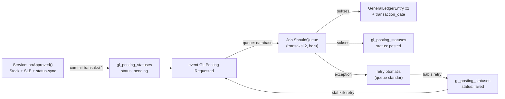

# Design Document: Event/Listener Migration — Phase 3

## Overview

Fase 3 memindahkan GL (General Ledger) posting di 3 service (`PurchaseReceiptService`, `DeliveryNoteService`, `PurchaseInvoiceService`) dari eksekusi sync-inline menjadi `ShouldQueue` Job — satu-satunya titik di codebase yang benar-benar async terhadap DB (semua listener Fase 1/2 tetap sync). Perubahan ini didahului perbaikan `lockForUpdate()` di titik race condition yang ditemukan lewat audit menyeluruh (independen dari desain queue), dan ditopang fondasi generik baru: kolom `transaction_date` di `general_ledgers`/`stock_ledger_entries`, tabel tracking `gl_posting_statuses` (polymorphic, dipakai module manapun ke depan), dan halaman monitoring lintas-dokumen dengan aksi retry manual.

**Yang TIDAK berubah**: kondisi kapan GL dibuat, formula debit/credit, jumlah entry per posting — semua identik logic lama. Fase 3 murni memindahkan LOKASI EKSEKUSI (sync inline → queued Job) dan menambah OBSERVABILITY (status tracking), bukan mengubah hasil akhir GL.

**Prasyarat infrastruktur**: `QUEUE_CONNECTION=database` (dikonfirmasi dari `.env`) — queue Laravel jalan lewat tabel `jobs`, bukan Redis/SQS. Semua desain di bawah mengasumsikan ini; kalau connection berubah ke driver lain, perilaku retry/timing bisa berbeda (di luar scope spec ini).

## Architecture

### Ringkasan alur (generik, berlaku 3 service)



Titik penting: `gl_posting_statuses` dibuat `pending` **di dalam transaksi 1** (bersama Stock/SLE), BUKAN di dalam Job — supaya kalau transaksi 1 sendiri rollback (mis. validasi gagal sebelum commit), baris `pending` tidak pernah tercipta sama sekali (konsisten, tidak ada baris "pending" yang dokumennya sendiri gagal diapprove).

### Pemetaan Event → Listener → Service (3 titik migrasi)

| Service | Event baru | Listener (Job) | GL entry dibuat |
|---|---|---|---|
| `PurchaseReceiptService::onApproved()` | `PurchaseReceiptGeneralLedgerPostingRequested` | `PostPurchaseReceiptGeneralLedger` | 2 (Stock/SRNB, arah tergantung retur) |
| `DeliveryNoteService::onApproved()` | `DeliveryNoteGeneralLedgerPostingRequested` | `PostDeliveryNoteGeneralLedger` | 2 (Stock/COGS), HANYA jika `$totalPicked > 0` |
| `PurchaseInvoiceService::onApproved()` | `PurchaseInvoiceGeneralLedgerPostingRequested` | `PostPurchaseInvoiceGeneralLedger` | 2-4 (Stock/SRNB kondisional + Expense/Credit selalu) |

Semua listener di atas **wajib** `implements ShouldQueue` — satu-satunya kategori listener di seluruh codebase yang begini. Namespace mengikuti aturan folder proyek: karena masing-masing service cuma punya 1 event GL (tidak ada event GL lain yang berpasangan dalam domain sama), event-event ini **flat** per domain: `App\Events\Purchase\PurchaseReceiptGeneralLedgerPostingRequested`, `App\Events\Inventory\DeliveryNoteGeneralLedgerPostingRequested`, `App\Events\Finances\PurchaseInvoiceGeneralLedgerPostingRequested`. Listener nested di bawah `Ledger/` (>1 listener sejenis diprediksi tumbuh — pola GL posting akan dipakai module lain ke depan sesuai Requirement 3): `App\Listeners\Purchase\Ledger\PostPurchaseReceiptGeneralLedger`, `App\Listeners\Inventory\Ledger\PostDeliveryNoteGeneralLedger`, `App\Listeners\Finances\Ledger\PostPurchaseInvoiceGeneralLedger`.

## Components and Interfaces

### Requirement 1 — lockForUpdate() (tidak ada komponen baru)

Perubahan inline di 3 file existing, menambah `lockForUpdate()` di titik yang sudah teridentifikasi (lihat requirements.md Requirement 1 untuk daftar lengkap file:line). Tidak ada class/event baru.

Pola locking `PurchaseInvoiceItem` (Requirement 1.2) — `findInvoiceItemsForPoItem()` di `PurchaseReceiptService` perlu diubah query-nya:
```php
// SEBELUM
PurchaseInvoiceItem::where('purchase_order_item_id', $poItem->id)-&gt;get();
// SESUDAH
PurchaseInvoiceItem::where('purchase_order_item_id', $poItem->id)-&gt;lockForUpdate()-&gt;get();
```

### Requirement 2 — Kolom `transaction_date`

Migration baru (2 file, satu per tabel — konsisten pola 1-migration-1-perubahan-skema di codebase):
```php
Schema::table('general_ledgers', function (Blueprint $table) {
    $table-&gt;dateTime('transaction_date')-&gt;nullable()-&gt;after('credit');
});
// backfill: DB::table('general_ledgers')->whereNull('transaction_date')->update(['transaction_date' => DB::raw('created_at')]);
Schema::table('general_ledgers', function (Blueprint $table) {
    $table-&gt;dateTime('transaction_date')-&gt;nullable(false)-&gt;change();
});
```
Pola sama untuk `stock_ledger_entries`. Kolom dibuat `nullable()` dulu → backfill → `nullable(false)` — standar Laravel untuk menambah kolom NOT NULL ke tabel berisi data (menghindari error constraint saat `ALTER TABLE` pada MySQL/PostgreSQL).

`GeneralLedger`/`StockLedgerEntry` model: tambah `transaction_date` ke `$casts` (`'datetime'`).

**Audit laporan existing (Requirement 2.4)** — perlu Task tersendiri saat implementasi untuk grep semua query yang `orderBy('created_at')`/`where('created_at', ...)` pada kedua tabel ini dan ganti ke `transaction_date`. Scope pastinya baru diketahui saat implementasi (butuh grep menyeluruh, bukan ditebak di sini).

### Requirement 3 — `GlPostingStatus` model + tabel

```php
// database/migrations/xxxx_create_gl_posting_statuses_table.php
Schema::create('gl_posting_statuses', function (Blueprint $table) {
    $table-&gt;ulid('id')-&gt;primary();
    $table-&gt;ulidMorphs('referenceable');
    $table-&gt;string('status')-&gt;default('pending'); // GlPostingStatusEnum
    $table-&gt;unsignedInteger('retry_count')-&gt;default(0);
    $table-&gt;text('last_error')-&gt;nullable();
    $table-&gt;dateTime('posted_at')-&gt;nullable();
    $table-&gt;timestamps();
});
```

Enum baru `App\Enums\GlPostingStatus` (pola sama `FormStatus` — native PHP backed enum):
```php
enum GlPostingStatus: string {
    case PENDING = 'pending';
    case POSTED  = 'posted';
    case FAILED  = 'failed';

    public function label() { return __("status.{$this->value}"); }
}
```

Model `App\Models\Core\GlPostingStatus` (domain `Core` — generik lintas-module, konsisten `Log` yang juga di `Core`):
```php
class GlPostingStatus extends Model {
    use HasUlids;
    protected $casts = ['status' =&gt; GlPostingStatus::class, 'posted_at' =&gt; 'datetime'];

    public function referenceable(): MorphTo { return $this-&gt;morphTo(); }

    public function scopePending(Builder $query): Builder { return $query-&gt;where('status', GlPostingStatusEnum::PENDING); }
    public function scopeFailed(Builder $query): Builder { return $query-&gt;where('status', GlPostingStatusEnum::FAILED); }
}
```

**Helper pembuatan baris `pending`** — dipakai 3 Service (menghindari duplikasi):
```php
// dipanggil di dalam transaksi 1, sebelum dispatch event
GlPostingStatus::create([
    'referenceable_type' =&gt; get_class($document),
    'referenceable_id'   =&gt; $document-&gt;id,
    'status'              =&gt; GlPostingStatusEnum::PENDING,
]);
```

**Update status dari dalam Job** — pola generik dipakai ketiga Job:
```php
// sukses (di akhir handle(), setelah GL entry dibuat, transaksi 2 commit)
$this-&gt;glPostingStatus-&gt;update(['status' =&gt; GlPostingStatusEnum::POSTED, 'posted_at' =&gt; now()]);

// method failed() Job — dipanggil Laravel otomatis setelah retry habis
public function failed(Throwable $e): void {
    $this-&gt;glPostingStatus-&gt;update([
        'status'      =&gt; GlPostingStatusEnum::FAILED,
        'retry_count' =&gt; $this-&gt;glPostingStatus-&gt;retry_count + 1,
        'last_error'  =&gt; $e-&gt;getMessage(),
    ]);
}
```

Catatan desain: Job Laravel punya `$tries`/`$backoff` bawaan untuk retry otomatis SEBELUM `failed()` dipanggil — `retry_count` di tabel HANYA naik saat retry benar-benar habis (masuk `failed()`), bukan tiap percobaan individual. Ini cukup untuk Requirement 3.4-3.5 (retry "otomatis di job berikutnya" adalah retry bawaan queue Laravel, transparan, tidak perlu logic manual).

### Requirement 4 — Halaman monitoring

Mengikuti pola `LogController`/`Log::dataTable()` (trait `DataTable` sudah generik untuk listing+filter):
```php
// app/Http/Controllers/Core/GlPostingStatusController.php
class GlPostingStatusController extends Controller {
    public function index(Request $request) {
        GlPostingStatus::dataTable($request-&gt;merge(['status' =&gt; ['pending', 'failed']]));
        return Inertia::render('Core/GlPostingStatuses/Index');
    }

    public function retry(GlPostingStatus $glPostingStatus) {
        abort_unless($glPostingStatus-&gt;status === GlPostingStatusEnum::FAILED, 422);
        $glPostingStatus-&gt;update(['status' =&gt; GlPostingStatusEnum::PENDING, 'retry_count' =&gt; 0]);
        event(self::resolveRetryEvent($glPostingStatus-&gt;referenceable));
        return back();
    }
}
```

`resolveRetryEvent()` — resolusi event yang benar berdasar tipe `referenceable` (match instanceof PurchaseReceipt/DeliveryNote/PurchaseInvoice → event yang sesuai), pola sama seperti `RecalculateDocumentDeliveryStatus` di Fase 2 (`match(true)` + `default => throw`).

Halaman React `resources/js/Pages/Core/GlPostingStatuses/Index.jsx` — tabel dengan kolom: tipe dokumen, kode dokumen (link ke halaman detail), status (badge warna), retry_count, last_error, created_at. Tombol "Retry" muncul HANYA baris `status = failed` (Requirement 4.5).

### Requirement 5-7 — Event + Job per service

Pola identik ketiganya, cuma beda payload dan formula GL. Contoh `PurchaseReceiptService`:

```php
// app/Events/Purchase/PurchaseReceiptGeneralLedgerPostingRequested.php
class PurchaseReceiptGeneralLedgerPostingRequested {
    use Dispatchable;
    public function __construct(
        public readonly PurchaseReceipt $purchaseReceipt,
        public readonly float $totalRatesForGL,
        public readonly bool $isReturn,
        public readonly \DateTimeInterface $transactionDate,
    ) {}
}
```

Dispatch di `PurchaseReceiptService::onApproved()`, menggantikan blok GL L377-407 (lihat requirements.md Catatan Audit untuk baris persis):
```php
// SETELAH loop item (L371) dan event status-sync (L374), SEBELUM DB::commit()
if ($returnAgainst || $totalRatesForGL &gt; 0) {
    GlPostingStatus::create([...]); // Requirement 3.2
    event(new PurchaseReceiptGeneralLedgerPostingRequested(
        $purchaseReceipt, $totalRatesForGL, (bool) $returnAgainst, now()
    ));
}
DB::commit();
```

Listener (Job):
```php
// app/Listeners/Purchase/Ledger/PostPurchaseReceiptGeneralLedger.php
class PostPurchaseReceiptGeneralLedger implements ShouldQueue {
    use InteractsWithQueue, Queueable, SerializesModels;

    public function handle(PurchaseReceiptGeneralLedgerPostingRequested $event): void {
        DB::transaction(function () use ($event) {
            $debitAccount  = Account::lockForUpdate()-&gt;where('root_type', 'asset')-&gt;where('account_type', 'stock')-&gt;latest()-&gt;first();
            $creditAccount = Account::lockForUpdate()-&gt;where('root_type', 'liability')-&gt;where('account_type', 'stock_received_but_not_billed')-&gt;latest()-&gt;first();
            // ... identik formula lama (L392-406), tambah 'transaction_date' =&gt; $event-&gt;transactionDate
        });

        GlPostingStatus::forReferenceable($event-&gt;purchaseReceipt)-&gt;update([...]); // Requirement 3.3
    }

    public function failed(Throwable $e): void { /* Requirement 3.4-3.5 */ }
}
```

`DeliveryNoteGeneralLedgerPostingRequested`/`PostDeliveryNoteGeneralLedger` dan `PurchaseInvoiceGeneralLedgerPostingRequested`/`PostPurchaseInvoiceGeneralLedger` mengikuti pola sama, payload disesuaikan (`PurchaseInvoiceService` bawa 2 angka: `$totalStockGL` dan `$totalAmount`/arah retur, karena 2 blok GL digabung 1 event sesuai keputusan "1 titik posting = 1 event").

## Data Models

| Tabel | Perubahan |
|---|---|
| `general_ledgers` | + `transaction_date` (datetime, NOT NULL setelah backfill) |
| `stock_ledger_entries` | + `transaction_date` (datetime, NOT NULL setelah backfill) |
| `gl_posting_statuses` (baru) | `id` (ulid), `referenceable_type`/`referenceable_id` (morphs), `status` (string, enum-cast), `retry_count` (int), `last_error` (text nullable), `posted_at` (datetime nullable), timestamps |

## Correctness Properties

**Property 1**: _For any_ dokumen yang GL-nya sudah tercatat SEBELUM Fase 3 (data lama), `transaction_date` SHALL sama persis dengan `created_at` baris tersebut (backfill 1:1, tidak ada transformasi).

**Property 2**: _For any_ approval dokumen (PurchaseReceipt/DeliveryNote/PurchaseInvoice) yang memenuhi kondisi GL dibuat (existing: `$totalPicked > 0` / `$returnAgainst || $totalRatesForGL > 0` / dst), SATU baris `gl_posting_statuses` SHALL selalu dibuat dalam transaksi yang sama dengan Stock/SLE — TIDAK PERNAH ada dokumen yang lolos approval (Stock/SLE ter-commit) tapi tidak ada baris tracking status GL-nya.

**Property 3**: _For any_ Job GL posting yang sukses, jumlah dan formula debit/credit `GeneralLedgerEntry` yang dihasilkan SHALL identik dengan hasil kode lama (sync-inline) untuk input yang sama — validasi via regression test membandingkan snapshot sebelum/sesudah migrasi.

**Property 4**: _For any_ Job yang gagal setelah retry habis, `gl_posting_statuses.status` SHALL menjadi `failed` — TIDAK PERNAH diam-diam hilang/stuck di `pending` selamanya tanpa sinyal.

**Property 5**: _For any_ klik retry pada baris `failed`, sistem SHALL dispatch ulang event yang MEMBAWA DATA SEGAR (bukan payload lama yang mungkin stale) — perlu keputusan implementasi: apakah retry re-query `$totalRatesForGL` dkk dari dokumen sumber saat ini, atau re-dispatch payload asli. **Direkomendasikan re-query saat implementasi**, dibahas di Error Handling di bawah.

**Property 6**: _For any_ perubahan Requirement 1 (lockForUpdate), hasil kalkulasi/urutan operasi SHALL identik dengan sebelum perubahan — regression test existing (Fase 1/2) tetap PASS tanpa modifikasi ekspektasi.

## Error Handling

| Skenario | Perilaku |
|---|---|
| Job GL posting throw exception (mis. Account tidak ketemu) | Laravel retry otomatis sesuai `$tries`/`$backoff` Job; `gl_posting_statuses` tetap `pending` selama masih dalam window retry |
| Retry habis, masih gagal | `failed()` dipanggil otomatis Laravel → `gl_posting_statuses.status = failed`, `last_error` diisi |
| Staf klik retry pada baris `failed` | Status di-reset `pending`, `retry_count = 0`, event di-dispatch ulang — **payload di-re-query dari dokumen sumber saat klik retry** (bukan dari snapshot lama), supaya kalau ada data terkait berubah sejak kegagalan pertama, GL yang di-post tetap akurat |
| Staf klik retry pada baris `pending` (belum failed) | Ditolak (Requirement 4.5) — `abort_unless` di controller |
| Dokumen sumber (`referenceable`) sudah dihapus (soft-delete) sebelum Job sempat jalan | [CATATAN IMPLEMENTASI] Job harus toleran terhadap `referenceable` null/trashed — query ulang dengan `withTrashed()` jika perlu, TIDAK boleh throw fatal yang bikin retry percuma. Detail exact behavior diputuskan saat implementasi berdasar apakah dokumen submitable BISA dihapus setelah approved (perlu dicek terhadap `Submitable` trait) |
| Migration `transaction_date` NOT NULL dijalankan di tabel dengan jutaan baris (produksi) | Backfill dalam 1 statement `UPDATE` bisa lambat/lock table lama — [CATATAN IMPLEMENTASI] pertimbangkan chunking saat migration jika volume data produksi besar, diverifikasi saat implementasi bukan diasumsikan di sini |

## Testing Strategy

- **Unit Tests**: tiap Job (`PostPurchaseReceiptGeneralLedger` dkk) diuji terisolasi — mock event, assert `GeneralLedgerEntry` yang dibuat identik formula lama, assert `gl_posting_statuses` ter-update benar (posted/failed).
- **Regression Tests**: `PurchaseDualFlowTest`/`SalesDualFlowTest`/existing approval tests — setelah migrasi ke Job, jalankan job sync di test (`Queue::fake()` lalu `assertPushed()` untuk existence, ATAU jalankan job langsung tanpa fake untuk memverifikasi HASIL GL identik — pilih sesuai kebutuhan test, tapi minimal satu test PER SERVICE yang menjalankan Job sungguhan dan membandingkan `GeneralLedgerEntry` yang dihasilkan terhadap baseline sebelum migrasi).
- **Concurrency Tests** (Property 6 / Requirement 1): simulasi 2 approval paralel pada `PurchaseOrderItem`/`PurchaseInvoiceItem` yang sama, assert tidak ada lost-update pada `billed_quantity`/`allocated_qty`.
- **Backfill Migration Test**: jalankan migration di database seed dengan data `general_ledgers`/`stock_ledger_entries` existing, assert `transaction_date` terisi = `created_at` untuk semua baris.
- **Retry Flow Test**: buat `gl_posting_statuses` `failed` secara manual, panggil endpoint retry, assert status jadi `pending`, assert event ter-dispatch ulang (`Event::fake()`/`assertDispatched`).
- **Exclusion Regression**: pastikan kondisi kapan GL dibuat (mis. rental TIDAK bikin GL di `DeliveryNoteService`) tetap sama — assert TIDAK ADA `gl_posting_statuses` dibuat untuk kasus tersebut.
