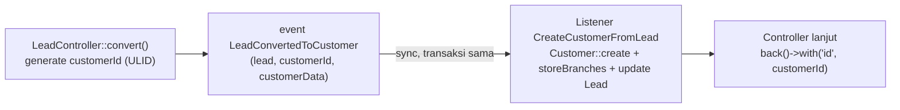

# Design Document: Event/Listener Migration — Phase 4

## Overview

Fase 4 memindahkan `LeadService::convertToCustomer()` ke `App\Events\CRM\LeadConvertedToCustomer` + `App\Listeners\CRM\CreateCustomerFromLead` (sync). Domain `CRM` BARU di `app/Events`/`app/Listeners` — belum pernah ada event/listener di domain ini sebelumnya (Fase 1-3 semua di `Core`/`Finances`/`Inventory`/`Purchase`/`Sales`).

**Karakter migrasi ini beda dari Fase 1-3**: bukan soal transaction-entangled (Fase 3) atau cross-domain status-sync (Fase 2), tapi soal Controller BUTUH return value (`Customer::id`) dari operasi yang dipindah ke event — sesuatu yang pola event/listener standar (void return) tidak mendukung langsung. Solusinya: ID di-generate SEBELUM dispatch, dikirim sebagai payload, bukan dibaca dari hasil listener.

## Architecture



Titik kunci: `customerId` sudah diketahui Controller SEBELUM listener jalan sama sekali — tidak ada dependency baca-balik dari listener ke Controller. Ini beda dari SEMUA event Fase 1-3 (yang polanya "Service mutasi dulu, baru dispatch event", di sini justru "dispatch duluan dengan data siap pakai, listener eksekusi").

## Components and Interfaces

### Event: `App\Events\CRM\LeadConvertedToCustomer`

```php
namespace App\Events\CRM;

use App\Models\CRM\Lead;
use Illuminate\Foundation\Events\Dispatchable;

class LeadConvertedToCustomer {
    use Dispatchable;

    public function __construct(
        public readonly Lead $lead,
        public readonly string $customerId,
        public readonly array $customerData,
    ) {}
}
```

`customerData` — array snapshot (BUKAN `$lead` dibaca ulang oleh listener), disiapkan di titik dispatch:
```php
[
    'name'       => $lead->company_name,
    'email'      => $lead->email,
    'phone'      => $lead->phone,
    'street'     => $lead->street,
    'city'       => $lead->city,
    'province'   => $lead->province,
    'zip_code'   => $lead->zip_code,
    'country_id' => $lead->country_id,
]
```
Identik field lama `Customer::create([...])` di `LeadService.php:47-56`, hanya dipindah lokasi pembuatan array-nya.

### Listener: `App\Listeners\CRM\CreateCustomerFromLead` (sync)

```php
namespace App\Listeners\CRM;

use App\Events\CRM\LeadConvertedToCustomer;
use App\Models\Sales\Customer;
use App\Services\Sales\CustomerService;

class CreateCustomerFromLead {
    public function handle(LeadConvertedToCustomer $event): void {
        $customer = Customer::create([
            'id' => $event->customerId,
            ...$event->customerData,
        ]);

        app(CustomerService::class)->storeBranches($customer, []);

        $event->lead->update([
            'status'                => 'converted',
            'converted_customer_id' => $event->customerId,
            'converted_at'          => now(),
        ]);
    }
}
```

TIDAK `implements ShouldQueue` — sync, dipanggil langsung dalam transaksi `LeadController::convert()` (`DB::beginTransaction()`/`DB::commit()` existing, tidak berubah).

**Verifikasi `Customer::create(['id' => ..., ...])` tidak konflik `HasUlids`**: trait `HasUlids::newUniqueId()` (Laravel core) hanya dipanggil dalam `creating()` hook JIKA `$model->{$model->getKeyName()}` masih kosong. Karena `id` sudah eksplisit diisi di array `create()`, trait tidak override — perilaku standar, tidak perlu override method apapun di model `Customer`.

### Controller: `App\Http\Controllers\CRM\LeadController::convert()`

```php
public function convert(Lead $lead) {
    if ($lead->converted_customer_id) {
        return back()->with('id', $lead->converted_customer_id);
    }

    DB::beginTransaction();

    $customerId = (string) Str::ulid();
    event(new LeadConvertedToCustomer($lead, $customerId, [
        'name'       => $lead->company_name,
        'email'      => $lead->email,
        'phone'      => $lead->phone,
        'street'     => $lead->street,
        'city'       => $lead->city,
        'province'   => $lead->province,
        'zip_code'   => $lead->zip_code,
        'country_id' => $lead->country_id,
    ]));

    DB::commit();

    return back()->with('id', $customerId);
}
```

Perubahan dari kode lama: guard idempotent (`converted_customer_id` sudah ada) dipindah KE ATAS transaksi (early return, tidak buka transaksi sama sekali kalau lead sudah dikonversi) — sebelumnya guard ini ada DI DALAM `LeadService::convertToCustomer()` (baris 43-45), setelah transaksi Controller sudah terbuka. Perilaku akhir identik (idempotent), cuma titik pengecekan lebih awal — sedikit lebih efisien (tidak buka transaksi percuma).

## Data Models

Tidak ada perubahan skema. `Customer`/`Lead` tabel tetap sama, hanya cara `id` Customer ditentukan yang berubah (manual pre-generate vs auto pada `create()`).

## Correctness Properties

**Property 1**: _For any_ pemanggilan `convert()` pada Lead yang BELUM dikonversi, hasil akhir (Customer baru dengan field identik, Lead ter-update `status`/`converted_customer_id`/`converted_at`, `CustomerService::storeBranches()` terpanggil dengan array kosong) SHALL identik dengan hasil `LeadService::convertToCustomer()` versi lama — migrasi murni pindah lokasi eksekusi.

**Property 2**: _For any_ pemanggilan `convert()` pada Lead yang SUDAH dikonversi, sistem SHALL TIDAK membuat Customer baru, TIDAK dispatch event — idempotent, `back()->with('id', ...)` langsung pakai `converted_customer_id` existing.

**Property 3**: _For any_ exception yang terjadi di dalam listener `CreateCustomerFromLead::handle()` (mis. `Customer::create()` gagal constraint), transaksi DB yang dibuka `LeadController::convert()` SHALL ter-rollback (tidak ada Customer/Lead update parsial tersimpan) — karena listener sync jalan di transaksi yang sama, exception propagate normal ke `try/catch` atau uncaught handler Controller.

**Property 4**: `Customer::create(['id' => $customerId, ...])` dengan ID pre-generate SHALL menghasilkan Customer dengan `id` PERSIS `$customerId` (bukan ID lain yang di-generate ulang oleh `HasUlids`).

## Error Handling

| Skenario | Perilaku |
|---|---|
| `Customer::create()` gagal (constraint, dsb) di listener | Exception propagate, `DB::rollBack()` di Controller (perlu tambah `try/catch` eksplisit KECUALI sudah ada exception handler global — verifikasi saat implementasi apakah `convert()` perlu dibungkus `try/catch` seperti pola Controller lain, atau cukup uncaught + Laravel exception handler default) |
| Lead sudah dikonversi (`converted_customer_id` terisi), dipanggil `convert()` lagi | Idempotent — return `converted_customer_id` existing, tidak ada mutasi baru (Property 2) |
| `CustomerService::storeBranches()` throw | Sama seperti `Customer::create()` gagal — propagate, rollback transaksi yang sama |

## Testing Strategy

- **Unit Test listener**: `CreateCustomerFromLeadTest` — assert `Customer::create()` dipanggil dengan `id` sesuai `$event->customerId`, assert field lain identik payload, assert `Lead` ter-update (`status`, `converted_customer_id`, `converted_at`), assert `CustomerService::storeBranches()` terpanggil (mock/spy dengan array kosong).
- **Regression test Controller**: assert `LeadController::convert()` pada Lead baru menghasilkan response dengan `id` yang SAMA dengan `Customer::id` yang benar-benar tersimpan di DB (Property 4) — bukan cuma cek response, tapi cross-check dengan query DB.
- **Idempotent test**: panggil `convert()` 2x pada Lead sama — assert Customer HANYA dibuat sekali, assert `event()` (via `Event::fake()`) TIDAK dipatch pada panggilan kedua (Property 2).
- **Rollback test**: paksa `Customer::create()` gagal (mock/partial), assert Lead TIDAK ter-update `status`/`converted_customer_id` (Property 3).
- **Non-regression `storeActivities()`**: pastikan test existing untuk method ini (jika ada) tetap PASS tanpa modifikasi.
