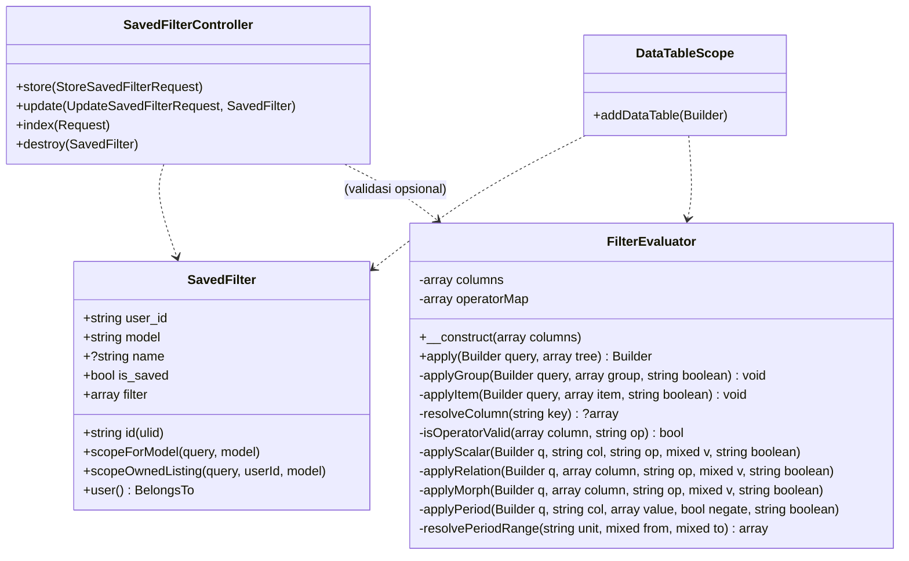
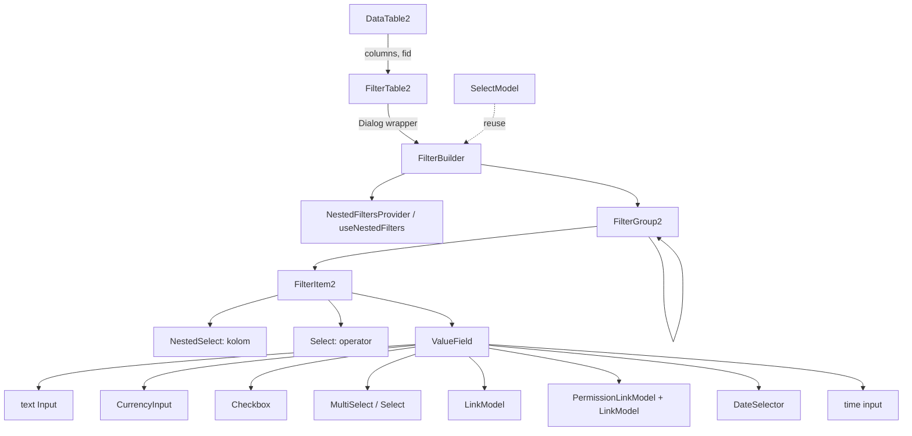

# Design Document: filtertable-nested-saved

## Overview

Fitur ini membuat `FilterTable2` (nested filter ala Odoo di `DataTable2`) berfungsi end-to-end dengan empat pilar:

1. **Transport saved-filter** — filter tree disimpan sebagai row DB; URL hanya membawa `?fid=<ulid>`. Hybrid: apply ad-hoc → row *ephemeral* (`is_saved=false`, TTL cleanup); "Simpan" → *named* (`is_saved=true`). Listing private (per-user), akses by-id terbuka.
2. **`FilterEvaluator` (backend, reusable)** — class DI murni yang mengkonsumsi filter tree → Eloquent `Builder` secara rekursif. Pasangan *consume* dari `FilterBuilder`. Tidak bergantung Request/cookie/Inertia.
3. **`FilterBuilder` (frontend, reusable)** — komponen presentational yang menghasilkan filter tree. `FilterTable2` = `FilterBuilder` + Dialog + wiring saved-filter. `useNestedFilters` tetap headless.
4. **`ValueField` context-aware** — input value menyesuaikan `(type, operator)`: text, CurrencyInput, Checkbox, MultiSelect/Select, LinkModel, morph two-step (`PermissionLinkModel`→`LinkModel`), `DateSelector` (period), input time, multi-grow untuk `in/!in`.

**Pattern utama:** filter tree adalah mini-DSL/AST; `FilterBuilder` (produce) dan `FilterEvaluator` (consume) berbagi *grammar* identik (operator + value shape).

**Yang TIDAK berubah:** struktur `useNestedFilters` (tree `{k,c}` + item `{k,o,v}`), komponen input existing (`CurrencyInput`, `DatetimePicker`, `MultiSelect`, `Select`, `Checkbox`, `LinkModel`, `NestedSelect`), `LinkModel::getColumns()`, alur paginate/submitable di `DataTableScope`. PK seluruh app memakai **ULID** — `saved_filters` mengikuti.

## Architecture

### Alur data (sequence)

```mermaid
sequenceDiagram
    participant U as User
    participant FB as FilterBuilder (React)
    participant SFC as SavedFilterController
    participant DB as saved_filters
    participant DTS as DataTableScope (dataTable macro)
    participant FE as FilterEvaluator
    participant Q as Eloquent Builder

    U->>FB: susun filter tree (nested AND/OR)
    U->>FB: Apply
    FB->>SFC: POST /saved-filters { model, filter: tree }
    SFC->>DB: insert ephemeral (is_saved=false)
    SFC-->>FB: { id }
    FB->>DTS: router.get(index, { fid: id })  (preserveState)
    DTS->>DB: SavedFilter::find(fid)  (cek model match, TANPA cek owner)
    DTS->>FE: new FilterEvaluator(columns)->apply(query, tree)
    FE->>Q: where/orWhere closures (rekursif)
    DTS->>Q: paginate(show)
    Q-->>U: hasil tabel

    Note over U,DB: "Simpan filter" → PATCH /saved-filters/{id} { name } → is_saved=true
    Note over DB: scheduled command hapus ephemeral > TTL
```



### Class diagram backend



### Komponen frontend



## Components and Interfaces

### Backend

#### `App\Services\Core\FilterEvaluator` (baru — reusable, DI murni)

```php
namespace App\Services\Core;

use Illuminate\Database\Eloquent\Builder;

class FilterEvaluator
{
    /** @param array<string,array> $columns hasil Model::getColumns() (keyed by name) */
    public function __construct(private array $columns) {}

    /** Konsumsi filter tree → query. Chainable, tidak mengeksekusi. */
    public function apply(Builder $query, array $tree): Builder
    {
        $root = $tree['root'] ?? $tree;          // dukung {root:{...}} atau langsung group
        if (! $this->isGroup($root)) { return $query; }
        $query->where(fn (Builder $q) => $this->applyGroup($q, $root, 'and'));
        return $query;
    }

    private function applyGroup(Builder $query, array $group, string $boolean): void
    {
        $children = $group['c'] ?? $group['children'] ?? [];
        $inner = $group['k'] ?? 'and';           // 'and' | 'or'
        $first = true;
        foreach ($children as $node) {
            $nodeBoolean = $first ? 'and' : $inner;   // node pertama selalu 'and' relatif ke grup
            $first = false;
            if ($this->isGroup($node)) {
                $query->where(fn (Builder $q) => $this->applyGroup($q, $node, 'and'), null, null, $nodeBoolean);
            } else {
                $this->applyItem($query, $node, $nodeBoolean);
            }
        }
    }

    private function applyItem(Builder $query, array $item, string $boolean): void
    {
        $key = $item['k'] ?? null; $op = $item['o'] ?? null; $value = $item['v'] ?? null;
        $column = $this->resolveColumn($key);
        if (! $column || ! ($column['searchable'] ?? true)) { return; }     // whitelist kolom
        if (! $this->isOperatorValid($column, $op)) { return; }            // whitelist operator
        // dispatch per kategori type → applyScalar / applyRelation / applyMorph / applyPeriod
    }

    // resolveColumn: dukung dot-notation relasi (mis. "permission.name") via $column['columns']
    // resolvePeriodRange(unit, from, to): month/quarter/half-year/year → [start, end] Carbon
    private function isGroup(array $n): bool { return isset($n['c']) || isset($n['children']); }
}
```

**`set`/`!set` type-aware** (selaras Req 3.8 — kosong = NULL atau string kosong):

```php
// string: deteksi NULL DAN ''
// set  → where(fn($q) => $q->whereNotNull($col)->where($col, '!=', ''))
// !set → where(fn($q) => $q->whereNull($col)->orWhere($col, '=', ''))
// non-string (number/date/time/relation FK): cukup whereNotNull / whereNull
```

**Deteksi negasi via prefix `!`** (selaras Req 8): `applyItem` strip prefix `!` → ambil handler operator positif → bungkus dalam negasi. Satu code path:

```php
$negate = str_starts_with($op, '!');
$base   = $negate ? substr($op, 1) : $op;          // !in → in, !has → has, !set → set
// terapkan handler $base; jika $negate, gunakan varian whereNot* atau whereNot(closure)
```

Karakteristik (Req 7): konstruktor hanya `$columns`; `apply(Builder,$tree):Builder`; tanpa Request/cookie/Inertia; chainable; pemanggil tetap kontrol paginate/with/scope.

#### `App\Models\Core\SavedFilter` (baru)

```php
class SavedFilter extends Model {
    use HasUlids;                                  // konsisten dgn app
    protected $guarded = ['id'];
    protected $casts = ['filter' => 'array', 'is_saved' => 'boolean'];

    public function user() { return $this->belongsTo(\App\Models\User\User::class); }
    public function scopeForModel($q, string $model) { return $q->where('model', $model); }
    public function scopeOwnedListing($q, $userId, string $model) {
        return $q->where('is_saved', true)->where('user_id', $userId)->where('model', $model);
    }
}
```

#### `App\Http\Controllers\Core\SavedFilterController` (baru)

| Method | Route | Akses | Aksi |
|---|---|---|---|
| `store` | `POST /saved-filters` | auth | Buat row ephemeral (`is_saved=false`, `user_id=auth`, `model`, `filter`). Balas `{ id }`. |
| `update` | `PATCH /saved-filters/{savedFilter}` | **owner-only** | Set `name` + `is_saved=true` (promosikan named). |
| `index` | `GET /saved-filters?model=` | auth | Listing **private**: `ownedListing(auth, model)`. |
| `destroy` | `DELETE /saved-filters/{savedFilter}` | **owner-only** | Hapus named filter milik user. |

Owner-only via **inline check** `abort_if($savedFilter->user_id !== auth()->id(), 403)` di `update`/`destroy` — mengikuti konvensi app yang TIDAK memakai Policy class (tak ada `app/Policies/` maupun `$this->authorize` di codebase). `store`/by-id load **tidak** owner-gated.

#### `App\Models\Scopes\DataTableScope` (ubah)

Ganti blok `if ($request->has('f'))` → :

```php
if ($request->filled('fid')) {
    $saved = \App\Models\Core\SavedFilter::find($request->input('fid'));
    $modelClass = \get_class($query->getModel());
    if ($saved && $saved->model === $modelClass) {           // cek model match, TANPA cek owner
        (new \App\Services\Core\FilterEvaluator($dataTableColumns))
            ->apply($query, $saved->filter ?? []);
    }
}
```

Bug `whereIn`/`whereBetween` negasi (`== '!like'`) dihapus karena logika pindah ke `FilterEvaluator` (negasi via operator eksplisit `!in`/`!between`).

#### `App\Http\Requests\Core\StoreSavedFilterRequest` / `UpdateSavedFilterRequest` (baru)

Extends `BaseFormRequest`. `Store`: `model` (string, harus class valid yang `use DataTable`), `filter` (array — validasi struktur tree: tiap node group `{k,c}` atau item `{k,o,v}`). `Update`: `name` (string required).

#### `App\Console\Commands\PruneEphemeralFilters` (baru) + schedule

```php
// command: saved-filters:prune
SavedFilter::where('is_saved', false)->where('created_at', '<', now()->subDays(7))->delete();
```
Daftarkan di `routes/console.php`: `Schedule::command('saved-filters:prune')->dailyAt('02:00')->withoutOverlapping();`

#### Migration `create_saved_filters_table`

```php
Schema::create('saved_filters', function (Blueprint $t) {
    $t->ulid('id')->primary();
    $t->foreignUlid('user_id')->index();
    $t->string('model')->index();
    $t->string('name')->nullable();
    $t->boolean('is_saved')->default(false)->index();
    $t->json('filter');
    $t->timestamps();
    $t->index(['user_id', 'model']);
    $t->index(['is_saved', 'created_at']);     // untuk prune
});
```

### Frontend

#### `FilterBuilder.jsx` (baru, presentational)

```jsx
// props: { columns, value, onChange }  — tanpa Dialog, tanpa saved-filter
function FilterBuilder({ columns, value, onChange }) {
  return (
    <NestedFiltersProvider initialFilters={value} columns={columns}>
      <FilterBuilderInner onChange={onChange} />   {/* render root FilterGroup2 + subscribe ke filters */}
    </NestedFiltersProvider>
  );
}
```
`FilterBuilderInner` memanggil `onChange(filters)` saat tree berubah. `SelectModel` (out-of-scope) cukup `<FilterBuilder columns value onChange/>`.

#### `FilterTable2.jsx` (ubah)

= `FilterBuilder` + `Dialog` + tombol Apply / Simpan. `applyFilters` **mengirim tree utuh** (bukan `flattenFilters`) ke `onApply(tree)`. `DataTable2.onApplyFilters` POST ke `SavedFilterController@store` → terima `id` → `router.get(?fid=id)`.

#### `ValueField.jsx` (baru)

```jsx
// props: { column, operator, value, onChange }
// switch (kategori type, operator) → komponen:
//  set/!set                    → null (no input)
//  boolean                     → Checkbox
//  string TANPA options        → text Input      (in/!in → multi-grow text)
//  string DENGAN options       → Select(=,!=) | MultiSelect(in,!in)  (matches/starts_with/ends_with tetap text)
//  number|currency             → CurrencyInput  (between → 2; in/!in → multi-grow)
//  time                        → time input     (between → 2; in/!in → multi-grow)
//  relation|relations basic    → LinkModel(model=column.related)  (in → multi)
//  relation|relations morph    → PermissionLinkModel → LinkModel(model=pilihan) ; value {type,id}
//  formStatus|formStatuses|enum→ Select | MultiSelect (options=column.options)
//  date|datetime + in_period   → DateSelector
```
Multi-grow (`in/!in`): util array value — auto-append field saat field terakhir terisi, tombol delete per field.

**Label option (Select/MultiSelect)** — `ValueField` memetakan `column.options` menjadi `{ value, label }`. Label memakai `column.valueTrans` sebagai prefix lang key: `label = valueTrans ? t(valueTrans + "." + value) : String(value)`. Konsisten dengan `Table2` yang merender sel via `t(valueTrans + "." + value)`. Node kolom (`buildColumnNode` di `FilterItem2`) wajib meneruskan `options` **dan** `valueTrans` dari `getColumns()` ke `selectedColumn` agar mengalir ke `ValueField`.

#### `DateSelector.jsx` (baru — adapter reui.io date-selector)

- Granularity: `day, month, quarter, half-year, year`. Sub-operator internal: `=,!=,>,>=,<,<=,between,!between`. Single/range. Tampilan diselaraskan `DatetimePicker`.
- Field **time** muncul untuk type `datetime` saat sub-op exact (`=,!=,>,>=,<,<=`) + granularity `day`. Type `date` & granularity non-`day` → tanpa time.
- Adapter: map shape internal komponen → value item `{ op, unit, from, to?, time? }`.

#### `operators.js` (ubah)

- `getOperators(type, { typeRelation, hasOptions })` — `hasOptions` (boolean) menandai kolom string punya `column.options`. Helper `columnHasOptions(column)` (di-export) menghitung flag dari `column.options` (array/object non-kosong); dipakai `FilterItem2` (dropdown operator) **dan** `ValueField` (resolve `valueInput`) agar sinkron.
- date/datetime → dropdown FilterItem hanya `in_period, !in_period, set, !set`.
- tambah `time` (case operator set lengkap), `starts_with`/`ends_with` (string).
- **string + `hasOptions`** → `valueInput` untuk `=`/`!=` menjadi `select`, untuk `in`/`!in` menjadi `multiselect`; `matches`/`!matches`/`starts_with`/`ends_with` tetap `text`. String tanpa options tetap text + multi-grow.
- `set/!set` global; `in/!in` semua kecuali boolean & date/datetime.
- Negasi konsisten prefix `!` (`!matches`, `!in`, `!between`, `!has`, `!set`, `!in_period`). Map selaras `FilterEvaluator::$operatorMap`.

#### i18n (Req 9 — sering terlewat saat implementasi)

Seluruh teks baru/berubah memakai `useLaravelReactI18n` `t(...)`, key ditambah di **kedua** locale `lang/en/core/datatable.php` + `lang/id/core/datatable.php`. Tidak ada string hardcode.

- **Rename key operator** (selaras value prefix `!`): `not_set`→`!set`, `not_matches`→`!matches`, `not_in`→`!in`, `not_between`→`!between`, `not_has`→`!has` (di kedua locale).
- **Key baru**: `operator.starts_with`, `operator.ends_with`, `operator.in_period`, `operator.!in_period`; `period.unit.{day,month,quarter,half-year,year}`; `dateselector.subop.*`; `saved.save` ("Simpan filter"), `saved.list` ("Filter Tersimpan"), `saved.name_placeholder`, dll.
- Label kolom via `titleTrans` existing; label options (formStatus/enum/string-with-options) via `column.valueTrans` → `t(valueTrans + "." + value)`, fallback nilai mentah (selaras `Table2`).

## Data Models

### Filter tree (grammar — produce FilterBuilder = consume FilterEvaluator)

```ts
type Tree  = { root: Group }
type Group = { k: "and" | "or", c: Record<string, Group | Item> }
type Item  = { k: string /*column*/, o: Operator, v: Value }

type Value =
  | string | number | boolean            // scalar
  | Array<string|number>                 // in / !in (multi)
  | { type: string, id: string|number }  // morph (relation/relations morph)
  | Array<{ type, id }>                   // morph multi
  | { op: SubOp, unit: Unit, from: string, to?: string, time?: string }  // in_period
type Unit  = "day" | "month" | "quarter" | "half-year" | "year"
type SubOp = "=" | "!=" | ">" | ">=" | "<" | "<=" | "between" | "!between"
```

### Operator → SQL map (Req 8 — FE `operators.js` ↔ BE `FilterEvaluator`)

| operator | SQL |
|---|---|
| `=` `!=` | `= ?` / `!= ?` |
| `>` `>=` `<` `<=` | komparasi langsung |
| `matches` `!matches` | `LIKE %?%` / `NOT LIKE %?%` |
| `starts_with` `ends_with` | `LIKE ?%` / `LIKE %?` |
| `in` `!in` | `whereIn` / `whereNotIn` |
| `between` `!between` | `whereBetween` / `whereNotBetween` |
| `in_period` `!in_period` | resolve `{op,unit,from,to,time}` → range + sub-op; `!` = `whereNot(fn)` |
| `has` `!has` | `whereHas` / `whereDoesntHave` |
| `set` `!set` (string) | `set`: `whereNotNull AND != ''` · `!set`: `whereNull OR = ''` (deteksi NULL **dan** string kosong) |
| `set` `!set` (non-string) | `whereNotNull` / `whereNull` (string kosong tak relevan untuk number/date/relation) |

### Period value: canonical (disimpan) vs display (UI)

Nilai `from`/`to` di JSON value disimpan dalam **format canonical** yang parseable mesin & locale-independent. UI menampilkan bentuk **ringkas human-readable** (i18n) yang diturunkan dari canonical — bukan disimpan literal (hindari parse nama bulan multi-locale "Jan" vs "Januari").

| unit | canonical (disimpan) | display (UI, contoh) |
|---|---|---|
| `month` | `2025-01` | `Jan 2025` |
| `quarter` | `2025-Q2` | `Q2 2025` |
| `half-year` | `2026-H1` | `H1 2026` |
| `year` | `2026` | `2026` |
| `day` | `2026-06-12` (datetime: + `time`) | `12 Jun 2026` |

### Period resolver (`resolvePeriodRange`) — canonical → rentang

| unit | from canonical | range |
|---|---|---|
| `month` | `2026-06` | `2026-06-01 00:00` – `2026-06-30 23:59:59` |
| `quarter` | `2026-Q2` | `2026-04-01` – `2026-06-30` |
| `half-year` | `2026-H1` | `2026-01-01` – `2026-06-30` (H2: Jul–Des) |
| `year` | `2026` | `2026-01-01` – `2026-12-31` |
| range (`to` ada) | from..to | awal periode `from` – akhir periode `to` |

## Correctness Properties

1. **Round-trip grammar:** tree apa pun yang dihasilkan `FilterBuilder` dapat dikonsumsi `FilterEvaluator` tanpa item ter-skip karena operator/shape tak dikenal (Req 8).
2. **Nesting fidelity:** struktur AND/OR + kedalaman tree tercermin tepat sebagai closure `where`/`orWhere` bersarang (Req 1).
3. **Whitelist soundness:** tak ada item dengan kolom non-`searchable` atau operator tak valid yang menghasilkan klausa SQL (Req 6.1).
4. **Binding safety:** setiap value masuk sebagai parameter binding, tak pernah interpolasi string (Req 6.2).
5. **Period correctness:** `resolvePeriodRange(unit,from,to)` selalu menghasilkan `[start ≤ end]` yang menutup tepat periode tsb (batas inklusif).
6. **Negation symmetry:** operator ber-prefix `!` (`!in`, `!between`, `!in_period`, `!has`, `!matches`, `!set`) = komplemen logis dari versi positifnya pada dataset yang sama. Deteksi negasi seragam via prefix `!` (kecuali `!=` yang atomik).
7. **Chainability:** `apply` mengembalikan Builder identik (tak ter-eksekusi); paginate/with setelahnya tetap berfungsi (Req 7.6).
8. **Empty/null partition (string):** untuk kolom string, `set` dan `!set` mempartisi dataset sempurna — setiap baris masuk tepat salah satu (NULL & `''` → `!set`; selain itu → `set`). `count(set) + count(!set) == total`.

## Error Handling

| Scenario | Behavior |
|---|---|
| `fid` tidak ada / tak ditemukan | Abaikan, tabel tampil tanpa filter (tanpa error) |
| `saved_filter.model` ≠ model halaman | Abaikan `fid` (integritas) |
| Item: kolom tak ada / non-`searchable` | Skip item, lanjut item lain |
| Item: operator tak valid utk type | Skip item |
| Item: operator tanpa handler backend | Skip item (tak error) |
| Value shape tak sesuai operator (mis. morph tanpa `type`) | Skip item |
| Group kosong / tree kosong | Query tanpa filter |
| `update`/`destroy` oleh non-owner | 403 (inline `abort_if` cek `user_id`) |
| Period unit tak dikenal | Skip item |
| `store` payload tree invalid | 422 (Form Request) |

## Testing Strategy

### Unit (PHPUnit) — `FilterEvaluatorTest`
- Group AND/OR rekursif (nested 2–3 level) → assert SQL/`toSql()` + hasil pada data factory.
- Tiap operator (parametrik): `=,!=,>,>=,<,<=,matches,!matches,starts_with,ends_with,in,!in,between,!between,has,!has,set,!set,in_period,!in_period`.
- `in_period` per unit (`month/quarter/half-year/year`) single + range; datetime + time.
- relation (basic), relations (`has/!has`), morph (`{type,id}` → `whereHasMorph`).
- Whitelist: kolom non-searchable → skip; operator salah type → skip.
- `set`/`!set` string: data dengan baris NULL, `''`, dan berisi → `set` hanya baris berisi; `!set` baris NULL + `''`; `count(set)+count(!set)==total`. Non-string: hanya cek NULL.
- Binding safety: assert bindings parameterized (tak ada nilai di SQL string).
- Chainability: `apply` lalu `->paginate()` tetap jalan.

### Feature (PHPUnit) — `SavedFilterTest`
- `store` ephemeral → `?fid=` memfilter hasil index.
- promote `update` → named; muncul di `index` owner; **tak** muncul utk user lain.
- **by-id terbuka**: user B buka `?fid=` milik A → filter tetap apply.
- model-mismatch → diabaikan.
- `update`/`destroy` non-owner → 403.
- prune command menghapus ephemeral > TTL, menyisakan named.

### Property-based (opsional)
- `resolvePeriodRange`: untuk unit & periode acak → `start ≤ end` dan `start..end` menutup tepat periode.
- Negation symmetry: `count(in) + count(!in) == total` pada kolom non-null.

### Frontend (manual/Inertia)
- Model dengan type campuran (relation + formStatus + date): susun nested AND/OR, beragam type → Apply → URL `?fid=` → hasil sesuai; reload konsisten; "Simpan" → muncul di daftar.
- `ValueField` per type: render input benar; `between` 2 field; `in` multi-grow + delete; morph two-step; DateSelector granularity + time conditional.
- **i18n**: ganti locale en↔id → semua label operator/periode/sub-op/tombol berubah bahasa; tak ada raw key (`core.datatable.filter...`) atau teks hardcode yang bocor. Verifikasi key ada di kedua `lang/en` & `lang/id`.
```
