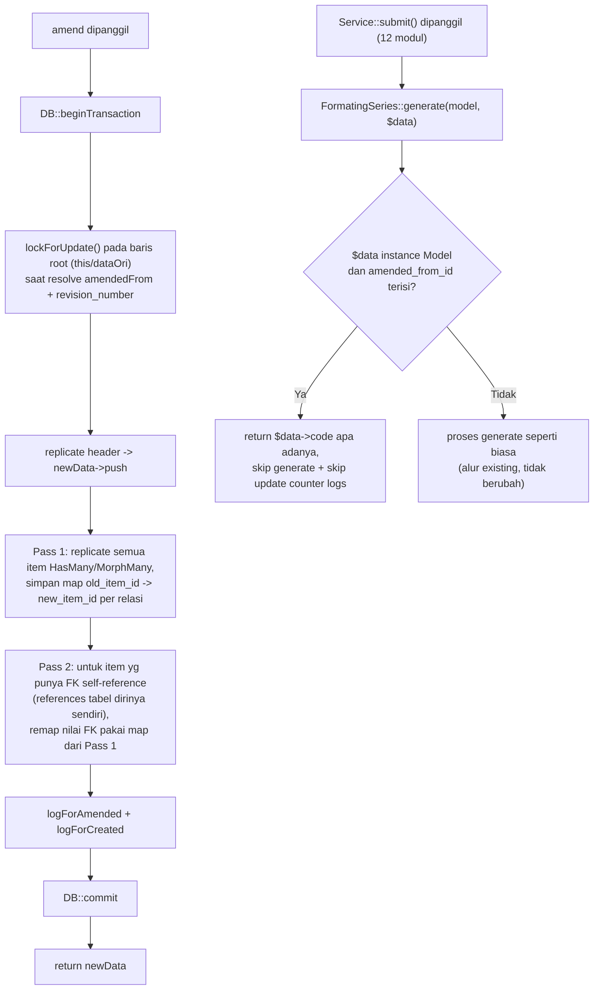

# Design Document: Fix Amend Item Remapping, Code Collision & Code Overwrite saat Submit

## Overview

`Submitable::amend()` (`app/Traits/Submitable.php`) dan alur submit di 12 service modul punya 3 bug:

1. **Item self-reference (`parent_item_id`) tidak ke-remap.** Saat amend me-replicate item-item relasi (`PurchaseOrderItem`, `SalesOrderItem`), tiap item di-replicate satu-per-satu tanpa menyimpan mapping id-lama → id-baru. Item yang punya `parent_item_id` menunjuk ke item lain (hasil split quantity) tetap menunjuk ke id item pada dokumen **lama** (yang sudah di-cancel), bukan ke id item barunya sendiri pada dokumen hasil amend. Silent — tidak ada error, tapi relasi parent-child rusak.

2. **Race condition pada `revision_number` bikin amend gagal kasar saat concurrent.** `revision_number` di-increment via Eloquent `increment()` tanpa row-lock eksplisit. Dua amend concurrent yang menunjuk root yang sama bisa membentuk `$newCode` yang sama sebelum salah satu commit.

   **Koreksi terhadap audit awal**: kolom `code` di semua 12 tabel submitable (`sales_orders`, `purchase_orders`, `internal_orders`, `purchase_receipts`, `stock_entries`, `delivery_notes`, `sales_invoices`, `purchase_invoices`, `payment_entries`, `quotations`, `work_orders`, `purchase_requests`) **sudah** punya unique constraint — diverifikasi langsung ke live MySQL schema (`SHOW INDEX ... non_unique=0` di semua 12 tabel). Constraint ini ditambahkan runtime lewat `DataTable::initPermissions()` (`app/Traits/DataTable.php:397-401`), bukan lewat migration file statis — itu sebabnya audit awal (yang cuma grep migration files) salah menyimpulkan tidak ada unique constraint.

   Konsekuensinya: race condition **tidak** menghasilkan `code` duplikat diam-diam (DB akan menolak). Tapi tetap bug — user amend kedua yang collide akan dapat **query exception mentah / HTTP 500**, bukan pesan error yang jelas atau retry otomatis. Ini bug UX/robustness, bukan data-integrity silent-corruption seperti dugaan awal.

3. **Suffix revisi hilang saat dokumen hasil amend di-submit ulang.** Ditemukan user secara langsung (bukan dari audit awal). Setiap service modul (`SalesOrderService::submit()`, `PurchaseOrderService::submit()`, dst — 12 modul) memanggil `$model->update(['code' => FormatingSeries::generate(...)])` di titik submit, yang **selalu** meregenerate `code` penuh dari template format (`@[branch_code]/SO-@[iiii]/@[yy]`), tanpa peduli apakah `code` sebelumnya sudah punya suffix revisi (`-1`, `-2`, dst) hasil amend. Dokumen amend yang code-nya `SO-001/07/26-1` setelah disubmit ulang berubah jadi `SO-XXX/07/26` baru (nomor urut dari counter formating series saat itu, bisa beda dari nomor asli) — suffix revisi lenyap, dan `code` jadi tidak konsisten dengan `revision_number`/`amended_from_id` yang tetap tercatat di kolom lain.

Scope dibatasi ke 3 bug ini — gap desain lain dari audit sebelumnya (ModelConnection, GL/SLE, ApprovalInstance, canDelete guard) sengaja **di luar scope**, karena butuh keputusan produk (apakah harus otomatis atau tetap manual) yang belum diputuskan.

## Root Cause

### Bug 1: Item remapping

`app/Traits/Submitable.php` method `amend()`, blok `foreach ($this->getRelations() as $key => $value)`:

```php
foreach ($value as $item) {
    $item = $item->replicate([
        'id', 'created_at', 'updated_at', 'deleted_at',
        ...$item->getGuarded(),
        ...static::generatedColumnsOf($item->getTable()),
        $foreignKey,
    ]);
    $item->$foreignKey = $newData->id;
    $item->save();
}
```

`parent_item_id` bukan bagian dari `$guarded` di `PurchaseOrderItem`/`SalesOrderItem`, jadi ikut ter-replicate mentah (nilai lama). Tidak ada array `$oldId => $newId` yang dipertahankan lintas iterasi item dalam collection yang sama, sehingga tidak ada cara untuk tahu id baru item parent pada saat item anak diproses.

Tantangan urutan: item anak bisa diproses sebelum item parent-nya sendiri selesai di-replicate (urutan collection tidak dijamin parent-dulu), jadi remapping harus dua-pass: (1) replicate semua item dulu sambil catat mapping id lama→baru, (2) baru update kolom self-reference pada item baru berdasarkan mapping itu.

### Bug 2: Race condition revision_number

`app/Traits/Submitable.php` method `amend()`:

```php
if ($this->amended_from_id == null) {
    $this->increment('revision_number');
    $newCode = $this->code . "-{$this->revision_number}";
    $amendedFromId = $this->id;
} else {
    $dataOri = $this->amendedFrom;
    $dataOri->increment('revision_number');
    $newCode = $dataOri->code . "-{$dataOri->revision_number}";
    $amendedFromId = $dataOri->id;
}
```

`increment('revision_number')` atomic di level SQL, tapi tidak ada row-lock (`lockForUpdate()`) yang menahan baris `$dataOri`/`$this` selama transaksi amend berjalan. Dua transaksi concurrent yang membaca baris yang sama sebelum salah satu commit bisa membentuk `$newCode` yang identik. Insert kedua akan gagal kena unique constraint `code` yang sudah ada di DB — tapi tanpa penanganan, error itu bocor sebagai `QueryException` mentah ke user (lewat exception handler generik `bootstrap/app.php`, bukan pesan yang actionable).

### Bug 3: Code overwrite saat submit dokumen hasil amend

Pola identik di 12 file service, contoh `app/Services/Sales/SalesOrderService.php:189-191`:

```php
public function submit(SalesOrder $salesOrder) {
    DB::beginTransaction();

    $salesOrder->update([
        'code' => FormatingSeries::generate(SalesOrder::class, $salesOrder),
    ]);
    // ...
}
```

Terverifikasi ada di 12 dari 12 service submitable: `SalesOrderService`, `PurchaseOrderService`, `PurchaseReceiptService`, `PurchaseRequestService`, `PurchaseInvoiceService`, `SalesInvoiceService`, `DeliveryNoteService`, `StockEntryService`, `InternalOrderService`, `WorkOrderService`, `PaymentEntryService`, `QuotationService`.

`FormatingSeries::generate()` (`app/Models/Core/FormatingSeries.php:151-258`) murni menyusun ulang `code` dari template format + counter internal (`logs` per periode) — sama sekali tidak sadar konsep amend/revisi. Tidak ada satupun referensi ke `amended_from_id`/`revision_number` di `FormatingSeries.php` maupun di 12 service tersebut (diverifikasi via grep, nol hasil).

Konsekuensi konkret: dokumen dengan `code = "SO-001/07/26-1"` (hasil amend) setelah disubmit ulang, `code`-nya di-overwrite total jadi hasil `generate()` baru — kehilangan suffix `-1`, dan base code-nya sendiri bisa jadi nomor urut yang berbeda dari code asli (tergantung posisi counter formating series saat submit dilakukan, bukan reuse nomor code asli).

**Keputusan (dikonfirmasi user)**: base code dokumen hasil amend harus **tetap identik** dengan yang sudah terbentuk saat `amend()` (base + suffix `-N`) — submit ulang **tidak** boleh meregenerate `code` sama sekali untuk dokumen yang `amended_from_id`-nya terisi.

## Architecture

Perbaikan di `Submitable::amend()` (bug 1 & 2) plus 1 titik terpusat di `FormatingSeries::generate()` (bug 3) — bukan 12 file service. Tidak ada migration baru (unique constraint `code` sudah ada), tidak ada perubahan kontrak publik (signature `amend()` dan signature `FormatingSeries::generate()` tetap sama), tidak ada perubahan route/controller/frontend.



## Components and Interfaces

### 1. `Submitable::amend()` — row-lock saat resolve revision

Query ulang baris root (`$this` atau `$dataOri`, tergantung cabang `amended_from_id`) dengan `lockForUpdate()` di dalam transaksi yang sudah dibuka (`DB::beginTransaction()` di awal `amend()`), sebelum `increment('revision_number')` dipanggil. Ini membuat transaksi amend concurrent lain yang menyasar root yang sama menunggu (blocking row-lock) alih-alih membaca nilai `revision_number` yang stale — menghilangkan window race, bukan cuma menangani errornya setelah kejadian.

Sebagai pengaman kedua (defense in depth, bukan pengganti lock): bungkus insert `$newData` dengan penanganan `QueryException` unique-violation → lempar ulang sebagai exception/pesan yang jelas ("Amend gagal, ada proses amend lain yang bersamaan — coba lagi"), bukan biarkan lolos sebagai 500 generik. Ini jaring pengaman untuk skenario yang lolos dari row-lock (mis. transaksi di connection/replica berbeda — tidak diharapkan terjadi di setup MySQL single-primary saat ini, tapi murah untuk ditangani).

### 2. `Submitable::amend()` — two-pass item remapping

Ganti single-pass replicate jadi two-pass per relasi:

- **Pass 1**: replicate tiap item seperti sekarang, simpan `$idMap[$oldItem->id] = $newItem->id` per relasi.
- **Pass 2**: setelah semua item dalam relasi itu selesai di-replicate, untuk tiap kolom pada tabel item yang merupakan FK self-reference (kolom yang `references` tabel dirinya sendiri — dideteksi generic lewat `Schema::getColumns($table)` dan/atau `Schema::getForeignKeys($table)`, pola yang sama dengan `generatedColumnsOf()` yang sudah ada di trait ini untuk exclude kolom generated), update nilai kolom itu pakai `$idMap` kalau id lama-nya ada di map. Kalau tidak ditemukan di map, biarkan apa adanya (item parent di luar batch — seharusnya tidak terjadi karena satu dokumen hanya replicate item miliknya sendiri, tapi harus aman/tidak error).

**Keputusan: deteksi generic, bukan hardcode nama kolom `parent_item_id`.** Alasan: `generatedColumnsOf()` sudah membuktikan pola ini murah (satu query schema per tabel, di-cache) dan otomatis menutup tabel baru di masa depan tanpa perlu diingat manual saat menambah modul — persis kelas bug yang sama yang membuat masalah ini luput sebelumnya (kolom baru yang lupa didaftarkan manual).

### 3. `FormatingSeries::generate()` — guard code untuk dokumen hasil amend

Tambah pengecekan di awal method `generate(string $model, mixed $data, bool $isDraft = false)` (`app/Models/Core/FormatingSeries.php:151`):

```php
if ($data instanceof \App\Models\Model && $data->amended_from_id !== null) {
    return $data->code;
}
```

Ditaruh sebagai baris pertama di dalam method, sebelum `$ref = FormatingSeries::where(...)` dan sebelum increment counter (`$refKey[$selectKey]['current'] += 1`) dijalankan — supaya submit dokumen amend juga **tidak** memakan/menaikkan nomor urut counter formating series milik dokumen non-amend berikutnya (kalau counter ikut naik padahal code tidak dipakai, nomor urut dokumen normal berikutnya akan meloncat/bolong tanpa alasan).

Titik ini dipilih (bukan mengubah 12 file service) karena satu-satunya jalur yang dilalui **semua** pemanggilan `generate()` saat submit — perubahan di sini otomatis berlaku ke 12 modul yang sudah ada dan modul submitable baru di masa depan tanpa perlu diingat manual. Guard ini hanya aktif kalau `$data` adalah instance model yang sudah persisted dan bertipe amend (bukan array — jalur create baru selalu kirim array `$data` sebelum record punya `id`, jadi tidak mungkin false-positive kena guard ini).

Catatan cakupan: 12 pemanggilan `generate()` di titik *submit* (baris kedua tiap service, yang menerima instance model) semuanya perlu skip; 12 pemanggilan di titik *create* (baris pertama tiap service, `$isDraft = true`, menerima array) tidak relevan dengan guard ini karena dokumen baru tidak mungkin sudah punya `amended_from_id` saat pertama dibuat.

### 4. Test

- Feature/unit test: amend PO/SO yang punya item dengan `parent_item_id` (split-item) — assert item hasil amend punya `parent_item_id` menunjuk ke item baru pada dokumen hasil amend (bukan item pada dokumen lama).
- Test: amend item yang `parent_item_id`-nya null (item biasa, bukan hasil split) — assert tetap null setelah amend, tidak ke-assign nilai yang salah.
- Test row-lock/race: dua panggilan `amend()` konkuren pada revisi berbeda dari root yang sama menghasilkan 2 dokumen baru dengan `code` berbeda (tidak collide) — kalau simulasi race asli sulit reliable di test suite, minimal test bahwa exception unique-violation ditangani dengan pesan yang jelas (bukan raw `QueryException`).
- Feature test: submit dokumen hasil amend (minimal 1 modul representatif, mis. SalesOrder — pertimbangkan tambah 1-2 modul lain seperti PurchaseOrder untuk cakupan lintas-modul) — assert `code` setelah submit **identik** dengan `code` sebelum submit (suffix `-N` tidak hilang, base code tidak berubah).
- Test: submit dokumen **normal** (bukan hasil amend, `amended_from_id` null) — assert `code` tetap ter-generate seperti biasa (guard baru tidak meregresi alur existing).
- Test: submit dokumen amend tidak menaikkan counter `logs` milik `FormatingSeries` (assert nilai `current` sebelum dan sesudah submit dokumen amend tidak berubah).

## Out of Scope

Ditegaskan ulang, TIDAK termasuk spec ini (dari audit sebelumnya, butuh keputusan produk terpisah):

- `ModelConnection`/dokumen turunan tidak ikut ter-link ke hasil amend.
- GL/StockLedgerEntry tidak otomatis dibuat ulang setelah amend.
- ApprovalInstance tidak otomatis dibuat, histori approval tidak diwariskan.
- `canDelete` guard untuk dokumen yang sudah pernah di-amend bergantung kebetulan pada status DRAFT, bukan proteksi eksplisit berbasis keberadaan child-amend.
- Perilaku `FormatingSeries::generate()` untuk skenario lain di luar amend (mis. edit manual `code` oleh user sebelum submit) — guard hanya menyasar kasus `amended_from_id` terisi, tidak mengubah behavior existing untuk dokumen non-amend.
- Migration/perubahan skema kolom `code` — sudah unique di semua 12 tabel submitable, tidak perlu disentuh.
