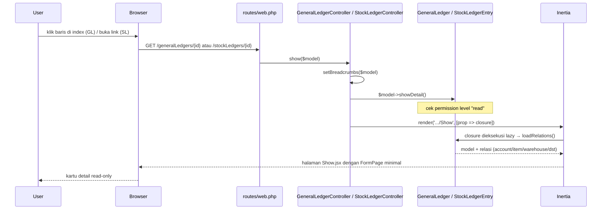

# Design Document: fix-general-ledger-stock-ledger-show

## Overview

Dua controller (`GeneralLedgerController`, `StockLedgerController`) menambahkan method `show()` mengikuti pola persis `AccountController::show()` / `StockEntryController::show()` — tidak ada pola baru di backend. Dua halaman frontend baru dibuat di `Finances/GeneralLedgers/Show.jsx` dan `Inventory/StockLedgers/Show.jsx`, keduanya reuse komponen `FormPage` yang sudah ada (bukan komponen baru), dikonfigurasi minimal untuk berperilaku sebagai kartu detail baca-saja: tanpa tombol save/submit/delete/print/email, tanpa sidebar (attachments/tags), tanpa bottombar (comments).

**Yang berubah:**
- `app/Http/Controllers/Finances/GeneralLedgerController.php` — tambah method `show()`
- `app/Http/Controllers/Inventory/StockLedgerController.php` — tambah method `show()`
- `resources/js/Pages/Finances/GeneralLedgers/Show.jsx` (baru) + `Form.jsx` (baru)
- `resources/js/Pages/Inventory/StockLedgers/Show.jsx` (baru) + `Form.jsx` (baru)

**Yang TIDAK berubah:**
- `routes/web.php` — route `show` sudah terdaftar lewat `resourceDetail` macro, tidak perlu route baru
- `GeneralLedger` / `StockLedgerEntry` model — `configColumns`, relasi, `loadRelationsOnShow()` dipakai apa adanya
- `FormPage.jsx`, `FormInput.jsx`, `LinkModel.jsx` — tidak ada modifikasi komponen generik; hanya dikonsumsi dengan kombinasi prop yang sudah didukung
- Index page kedua modul (`GeneralLedger.jsx`, `StockLedger.jsx`) — tetap seperti sekarang

Riset arsitektur (lihat catatan investigasi) mengonfirmasi tidak ada komponen "read-only detail card" siap pakai di codebase ini — semua halaman `Show.jsx` yang ada memakai `FormPage`. Opsi yang dipertimbangkan:

| Opsi | Keterangan | Keputusan |
|---|---|---|
| A. `FormPage` dikonfigurasi minimal | Reuse pola teruji (`deleteable={false}`, `sidebarContent={false}`, `bottombarContent={false}`, `disabled`, tanpa `submitable`) — kombinasi belum pernah dipakai bertiga sekaligus, tapi tiap flag individual sudah ada presedennya (`ShowVariant.jsx` pakai `deleteable={false}`, `Company.jsx` pakai `bottombarContent={false}`) | **Dipilih** |
| B. Pola baru mirip `FormPageDiff` | Lebih ringan (tanpa Tabs/draft-form), tapi `FormPageDiff` didesain untuk shape data `dataAfter`/`dataBefore`/`log`, bukan record tunggal — perlu adaptasi struktur, bukan reuse langsung | Ditolak — effort adaptasi lebih besar dari manfaat, dan menyimpang dari konvensi `Show.jsx` yang konsisten di seluruh app |

Opsi A dipilih karena konsisten dengan konvensi 8+ modul lain (satu pola `Show.jsx` + `Form.jsx` per model), walau `FormPage` tetap memuat mesin Tabs/draft-form yang secara teknis tidak diperlukan untuk data read-only — trade-off ini diterima demi konsistensi arsitektur, bukan optimasi bundle size.

## Architecture



**Data Flow**: identik dengan `AccountController::show()` — permission check terjadi di dalam `showDetail()` (trait `DataTable`), bukan di middleware terpisah, sehingga 403 otomatis didapat dari mekanisme yang sudah ada tanpa kode tambahan.

## Components and Interfaces

### Backend — `GeneralLedgerController::show()`

```php
public function show(GeneralLedger $generalLedger) {
    $this->setBreadcrumbs($generalLedger);
    $generalLedger->showDetail();

    return Inertia::render('Finances/GeneralLedgers/Show', [
        'generalLedger' => function () use ($generalLedger) {
            $generalLedger->loadRelations();

            return $generalLedger;
        },
    ]);
}
```

### Backend — `StockLedgerController::show()`

```php
public function show(StockLedgerEntry $stockLedger) {
    $this->setBreadcrumbs($stockLedger);
    $stockLedger->showDetail();

    return Inertia::render('Inventory/StockLedgers/Show', [
        'stockLedger' => function () use ($stockLedger) {
            $stockLedger->loadRelations();

            return $stockLedger;
        },
    ]);
}
```

Route model binding otomatis resolve `{generalLedger}` / `{stockLedger}` ke instance model karena nama parameter route (dari `resourceDetail` macro) match dengan nama variabel — pola sama seperti `Account $account` di `AccountController::show()`. Tidak perlu perubahan di `routes/web.php`.

### Frontend — `Finances/GeneralLedgers/Show.jsx`

```jsx
import Form from "./Form";
import { FormPage } from "@/Pages/Core/FormPage";

export default function Show({ generalLedger }) {
  return (
    <FormPage
      isCreate={false}
      name="generalLedger"
      disabled
      deleteable={false}
      sidebarContent={false}
      bottombarContent={false}
    >
      <Form />
    </FormPage>
  );
}
```

### Frontend — `Finances/GeneralLedgers/Form.jsx`

```jsx
import { FormPageContent, useFormPage } from "@/Pages/Core/FormPage";

import AccountLinkModel from "../Accounts/AccountLinkModel";
import BranchLinkModel from "@/Pages/Settings/Branches/BranchLinkModel";
import FormInput from "@/Components/FormInput";
import { Input } from "@/Components/ui/input";
import NumberInput from "@/Components/NumberInput";
import { useLaravelReactI18n } from "laravel-react-i18n";

export default function Form() {
  const { t } = useLaravelReactI18n();
  const { data } = useFormPage();

  return (
    <FormPageContent value="detail" title={t("finances.generalLedger.detail")}>
      <div className="grid gap-x-4 gap-y-4 md:grid-cols-2">
        <FormInput name="code" label={t("finances.generalLedger.columns.code")}>
          <Input value={data?.code} readOnly />
        </FormInput>
        <FormInput name="account" label={t("finances.generalLedger.columns.account")}>
          <AccountLinkModel value={data?.account} readOnly disabledAddButton />
        </FormInput>
        <FormInput name="against_account" label={t("finances.generalLedger.columns.against_account")}>
          <AccountLinkModel value={data?.against_account} readOnly disabledAddButton />
        </FormInput>
        <FormInput name="branch" label={t("finances.generalLedger.columns.branch")}>
          <BranchLinkModel value={data?.branch} readOnly disabledAddButton />
        </FormInput>
        <FormInput name="debit" label={t("finances.generalLedger.columns.debit")}>
          <NumberInput value={data?.debit} readOnly decimalScale={2} />
        </FormInput>
        <FormInput name="credit" label={t("finances.generalLedger.columns.credit")}>
          <NumberInput value={data?.credit} readOnly decimalScale={2} />
        </FormInput>
        <FormInput name="created_at" label={t("finances.generalLedger.columns.created_at")}>
          <Input value={data?.created_at} readOnly />
        </FormInput>
      </div>
    </FormPageContent>
  );
}
```

Catatan: nama prop relasi (`account` vs `against_account` vs `againstAccount`) mengikuti konvensi accessor Inertia — Eloquent me-serialize relasi camelCase (`againstAccount()`) menjadi snake_case di JSON (`against_account`), konsisten dengan pola `parent_account` di `Accounts/Form.jsx:67`.

### Frontend — `Inventory/StockLedgers/Show.jsx`

Struktur identik dengan `GeneralLedgers/Show.jsx`, `name="stockLedger"`.

### Frontend — `Inventory/StockLedgers/Form.jsx`

```jsx
import { FormPageContent, useFormPage } from "@/Pages/Core/FormPage";

import FormInput from "@/Components/FormInput";
import { Input } from "@/Components/ui/input";
import ItemVariantLinkModel from "@/Pages/Inventory/Items/ItemVariantLinkModel";
import ItemUnitLinkModel from "@/Pages/Inventory/Items/ItemUnitLinkModel";
import LinkModel from "@/Components/LinkModel";
import NumberInput from "@/Components/NumberInput";
import WarehouseLinkModel from "@/Pages/Inventory/Warehouses/WarehouseLinkModel";
import { useLaravelReactI18n } from "laravel-react-i18n";

export default function Form() {
  const { t } = useLaravelReactI18n();
  const { data } = useFormPage();

  return (
    <FormPageContent value="detail" title={t("inventory.stockLedger.detail")}>
      <div className="grid gap-x-4 gap-y-4 md:grid-cols-2">
        <FormInput name="code" label={t("inventory.stockLedger.columns.code")}>
          <Input value={data?.code} readOnly />
        </FormInput>
        <FormInput name="item" label={t("inventory.stockLedger.columns.item")}>
          <ItemVariantLinkModel value={data?.item} readOnly disabledAddButton />
        </FormInput>
        <FormInput name="unit" label={t("inventory.stockLedger.columns.unit")}>
          <ItemUnitLinkModel value={data?.unit} readOnly disabledAddButton />
        </FormInput>
        <FormInput name="warehouse" label={t("inventory.stockLedger.columns.warehouse")}>
          <WarehouseLinkModel value={data?.warehouse} readOnly disabledAddButton />
        </FormInput>
        <FormInput name="quantity_change" label={t("inventory.stockLedger.columns.quantity_change")}>
          <NumberInput value={data?.quantity_change} readOnly decimalScale={2} />
        </FormInput>
        <FormInput name="quantity_after_transaction" label={t("inventory.stockLedger.columns.quantity_after_transaction")}>
          <NumberInput value={data?.quantity_after_transaction} readOnly decimalScale={2} />
        </FormInput>
        <FormInput name="valuation_rate" label={t("inventory.stockLedger.columns.valuation_rate")}>
          <NumberInput value={data?.valuation_rate} readOnly decimalScale={2} />
        </FormInput>
        <FormInput name="balance_stock_value" label={t("inventory.stockLedger.columns.balance_stock_value")}>
          <NumberInput value={data?.balance_stock_value} readOnly decimalScale={2} />
        </FormInput>
        <FormInput name="change_in_stock_value" label={t("inventory.stockLedger.columns.change_in_stock_value")}>
          <NumberInput value={data?.change_in_stock_value} readOnly decimalScale={2} />
        </FormInput>
        <FormInput name="referenceable" label={t("inventory.stockLedger.columns.referenceable")}>
          <LinkModel
            readOnly
            disabledAddButton
            value={data?.referenceable}
            customNavigation={
              data?.referenceable
                ? (val) => window.open(route(`${val.route}.show`, val.id), "_blank")
                : undefined
            }
          />
        </FormInput>
      </div>
    </FormPageContent>
  );
}
```

`referenceable` pakai `LinkModel` generik (bukan wrapper per-model) karena relasi ini polimorfik (`morphTo()`) — pola sama seperti `amended_from` di `FormPage.jsx:1594-1607`. Jika `data?.referenceable` bernilai `null` (dokumen sumber sudah dihapus permanen), `LinkModel` menampilkan state kosong bawaan komponen (tidak crash) — memenuhi Requirement 4.4 tanpa logic tambahan.

## Data Models

Tidak ada perubahan struktur data. Prop yang dikirim ke frontend:

**`GeneralLedgers/Show.jsx`** menerima prop `generalLedger`:
```
{
  id, code, debit, credit, created_at,
  account: { id, account_name, account_number, ... } | null,
  against_account: { id, account_name, account_number, ... } | null,
  branch: { id, name, ... } | null
}
```

**`StockLedgers/Show.jsx`** menerima prop `stockLedger`:
```
{
  id, code, quantity_change, quantity_after_transaction,
  valuation_rate, balance_stock_value, change_in_stock_value, created_at,
  item: { id, ... } | null,
  unit: { id, ... } | null,
  warehouse: { id, ... } | null,
  referenceable: { id, route, ... } | null
}
```

## Correctness Properties

1. **Tidak ada tombol mutasi tampil**: untuk kedua halaman, DOM yang dirender tidak mengandung elemen dengan `role="save"`, tombol delete, tombol submit/cancel/amend, tombol print, atau tombol email — karena `disabled`, `deleteable={false}`, tanpa `submitable`, dan tanpa `printable` prop dikirim ke `FormPage`.
2. **Permission Enforcement (baca ulang dari pola existing, bukan baru)**: `GET /generalLedgers/{id}` dan `GET /stockLedgers/{id}` mengembalikan 403 untuk user tanpa permission `read` pada model terkait, 200 untuk user dengan permission `read` — properti ini otomatis berlaku karena `showDetail()` (trait `DataTable`, tidak diubah) melakukan pengecekan ini untuk semua model, sama seperti `Account`/`StockEntry`.
3. **Relasi ter-load lengkap**: response `show()` untuk kedua model memuat semua key dari `loadRelationsOnShow()` masing-masing tanpa N+1 query tambahan di luar yang sudah didefinisikan `loadRelations()` (trait bawaan, tidak diubah).
4. **No Mutation**: tidak ada request POST/PUT/PATCH/DELETE baru yang terdaftar untuk `/generalLedgers/{id}` atau `/stockLedgers/{id}` — perubahan spec ini murni menambah handler untuk route `show` yang sudah ada di macro.

## Error Handling

| Scenario | Behavior |
|----------|----------|
| User tanpa permission `read` akses `GET /generalLedgers/{id}` atau `/stockLedgers/{id}` | 403, ditangani `showDetail()` (trait `DataTable`), tidak berubah dari mekanisme existing |
| `{generalLedger}` / `{stockLedger}` id tidak ditemukan | 404, ditangani route model binding Laravel bawaan (implicit binding), tidak berubah |
| `referenceable` (Stock Ledger) merujuk dokumen yang sudah dihapus permanen | `referenceable` bernilai `null` dari backend (morphTo tidak melempar exception untuk row yang hilang); frontend `LinkModel` menampilkan state kosong bawaan, tidak crash |
| `account` / `against_account` (General Ledger) null (data lama sebelum kolom wajib, atau akun terhapus) | `AccountLinkModel` menampilkan state kosong bawaan, tidak crash — pola sama seperti field opsional lain yang sudah dipakai di form existing |

## Testing Strategy

- **Feature Tests** (`tests/Feature/Finances/GeneralLedgerControllerTest.php`, baru):
  - `GET /generalLedgers/{id}` mengembalikan 200 dan prop `generalLedger` berisi relasi `account`, `against_account`, `branch` untuk user dengan permission `read`
  - `GET /generalLedgers/{id}` mengembalikan 403 untuk user tanpa permission `read`
  - Tidak ada regresi pada `GeneralLedgerController::index()` (assert route `generalLedgers.index` tetap 200)
- **Feature Tests** (`tests/Feature/Inventory/StockLedgerControllerTest.php`, baru):
  - `GET /stockLedgers/{id}` mengembalikan 200 dan prop `stockLedger` berisi relasi `item`, `unit`, `warehouse`, `referenceable` untuk user dengan permission `read`
  - `GET /stockLedgers/{id}` mengembalikan 403 untuk user tanpa permission `read`
  - `GET /stockLedgers/{id}` dengan `referenceable_id` mengarah ke row yang sudah dihapus permanen tetap mengembalikan 200 (tidak fatal error), `referenceable` bernilai `null` di response
- Tidak ada Unit Test terpisah — kedua method `show()` adalah komposisi tipis dari method trait (`setBreadcrumbs`, `showDetail`, `loadRelations`) yang sudah diuji lewat controller lain; Feature Test di level HTTP sudah cukup membuktikan pengkabelan benar.
- Verifikasi manual browser (di luar automated test, dicatat eksplisit di tasks.md mengikuti presedan spec `global-log-viewer`): klik baris General Ledger dari index harus membuka halaman detail tanpa error; buka `/stockLedgers/{id}` langsung via URL harus menampilkan detail.
