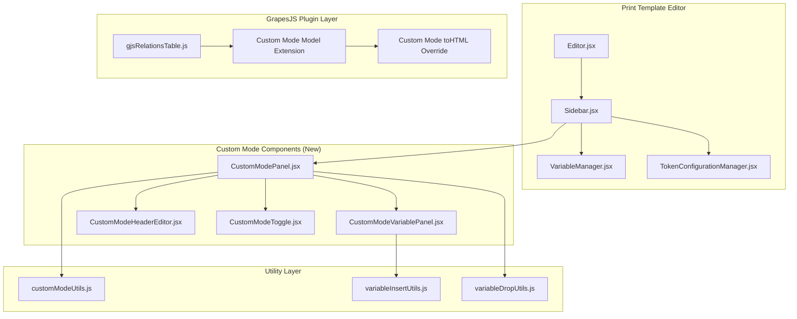
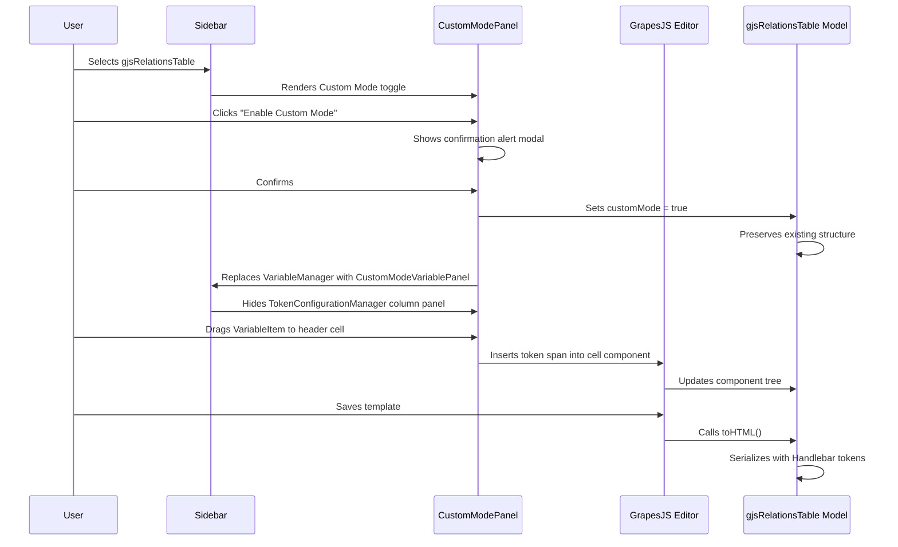

# Design Document: Custom Mode for gjsRelationsTable

## Overview

This design introduces a **Custom Mode** to the existing `gjsRelationsTable` GrapesJS component type in the Print Template Editor. Custom Mode replaces the standard column management panel with a dedicated editor that gives template designers full control over table header and body layout — including multi-row headers with colspan/rowspan grouping, drag-and-drop variable insertion, static HTML content, and per-component CSS styling.

The feature integrates into the existing GrapesJS plugin architecture by extending the `gjsRelationsTable` component type with a new `customMode` property, adding a new React panel component for the sidebar, and overriding the `toHTML()` serialization method to produce correct Handlebar token output for custom layouts.

### Key Design Decisions

1. **Component-level flag over separate component type**: Custom Mode is a property on the existing `gjsRelationsTable` rather than a new component type. This preserves backward compatibility and allows toggling between modes.
2. **Sidebar panel replacement over modal editor**: The Custom Mode variable panel replaces the default VariableManager content in the sidebar when a Custom Mode table is selected, keeping the editing workflow consistent with the existing pattern.
3. **GrapesJS native persistence**: All custom layout data is stored as child components within the GrapesJS component tree, leveraging the existing project data serialization without requiring a separate data store.
4. **Validation at the model level**: Header row limits, body constraints, and span overlap detection are enforced in the GrapesJS component model layer, preventing invalid states regardless of how the user attempts to modify the structure.

## Architecture



### Component Interaction Flow



## Components and Interfaces

### 1. CustomModeToggle (New Component)

**Path**: `resources/js/Pages/Core/PrintTemplate/Components/CustomModeToggle.jsx`

Renders the toggle button and manages the confirmation/deactivation alert modals.

```typescript
interface CustomModeToggleProps {
  editor: GrapesJSEditor;
  selectedComponent: GrapesJSComponent; // gjsRelationsTable component
  isCustomMode: boolean;
  onModeChange: (enabled: boolean) => void;
}
```

**Responsibilities:**

- Render toggle switch showing current mode state
- Show confirmation alert modal on activation (warns about disabling column management)
- Show deactivation alert modal (warns about discarding custom layout)
- Call `onModeChange` callback after user confirms

### 2. CustomModePanel (New Component)

**Path**: `resources/js/Pages/Core/PrintTemplate/Components/CustomModePanel.jsx`

The main container panel displayed in the sidebar when a Custom Mode table is selected.

```typescript
interface CustomModePanelProps {
  editor: GrapesJSEditor;
  selectedComponent: GrapesJSComponent;
}
```

**Responsibilities:**

- Coordinate between CustomModeToggle, CustomModeVariablePanel, and CustomModeHeaderEditor
- Manage header row add/remove operations
- Enforce header row count limits (1–5)
- Provide colspan/rowspan configuration UI for header cells

### 3. CustomModeVariablePanel (New Component)

**Path**: `resources/js/Pages/Core/PrintTemplate/Components/CustomModeVariablePanel.jsx`

Displays the filtered VariableItem list scoped to the bound relation's columns.

```typescript
interface CustomModeVariablePanelProps {
  editor: GrapesJSEditor;
  relationName: string; // e.g., "items"
  relationColumns: Column[]; // Filtered columns for the relation
}
```

**Responsibilities:**

- Filter columns from `dataTableColumns` to show only the bound relation's columns
- Exclude columns of type `"relations"` (many-relation)
- Include columns of type `"relation"` (single-relation) as expandable items
- Include all basic columns (non-relation types)
- Support lazy-loading of nested columns via existing VariableItem mechanism
- Display empty-state message when no displayable columns exist

### 4. CustomModeHeaderEditor (New Component)

**Path**: `resources/js/Pages/Core/PrintTemplate/Components/CustomModeHeaderEditor.jsx`

Provides the UI for managing header rows, colspan/rowspan configuration.

```typescript
interface CustomModeHeaderEditorProps {
  editor: GrapesJSEditor;
  tableComponent: GrapesJSComponent;
  headerRows: number;
  onAddRow: () => void;
  onRemoveRow: (rowIndex: number) => void;
}
```

**Responsibilities:**

- Display current header row count and add/remove buttons
- Provide colspan/rowspan input fields for selected header cells
- Validate span configurations against overlap rules
- Display error messages for invalid configurations

### 5. customModeUtils.js (New Utility)

**Path**: `resources/js/Pages/Core/PrintTemplate/utils/customModeUtils.js`

Pure utility functions for Custom Mode logic.

```typescript
// Column filtering
function filterRelationColumns(
  dataTableColumns: Column[],
  relationName: string,
): Column[];

// Header row management
function canAddHeaderRow(currentRowCount: number): boolean;
function canRemoveHeaderRow(currentRowCount: number): boolean;

// Span validation
function validateSpan(
  grid: HeaderGrid,
  rowIndex: number,
  colIndex: number,
  colspan: number,
  rowspan: number,
): { valid: boolean; error?: string };

// Overlap detection
function detectOverlap(
  grid: HeaderGrid,
  rowIndex: number,
  colIndex: number,
  colspan: number,
  rowspan: number,
  excludeSelf?: boolean,
): boolean;

// Body section validation
function isValidBodyDropTarget(component: GrapesJSComponent): boolean;
function canAddBodyRow(currentRowCount: number): boolean;
function canApplyBodySpan(colspan: number, rowspan: number): boolean;

// Serialization helpers
function serializeCustomModeHeader(
  theadComponent: GrapesJSComponent,
  relationName: string,
): string;

function serializeCustomModeBody(
  tbodyComponent: GrapesJSComponent,
  relationName: string,
): string;
```

### 6. gjsRelationsTable Plugin Extension

**Path**: `resources/js/lib/gjsRelationsTable.js` (modified)

The existing plugin is extended with Custom Mode support:

```javascript
// New component property
defaults: {
  // ... existing defaults
  customMode: false,  // New: Custom Mode flag
}

// Extended toHTML() method
toHTML() {
  const isCustomMode = this.get('customMode');
  if (isCustomMode) {
    return this.toCustomModeHTML();
  }
  // ... existing standard mode serialization
}

// New method for Custom Mode serialization
toCustomModeHTML() {
  // Serialize header rows as-is with {{label}} tokens
  // Wrap body row with {{#each}} / {{/each}}
  // Output body tokens as {{this.<col>}} or {{relation this.<col>}}
  // Preserve colspan/rowspan attributes
  // Serialize inline styles
}
```

### Integration with Existing Sidebar

The `Sidebar.jsx` component is modified to detect when a Custom Mode `gjsRelationsTable` is selected and conditionally render the `CustomModePanel` instead of the standard `VariableManager` and `TokenConfigurationManager` column panel:

```javascript
// In Sidebar.jsx - conditional rendering logic
const isCustomModeTableSelected = useMemo(() => {
  if (!selectedComponent) return false;
  return (
    selectedComponent.getType?.() === "gjsRelationsTable" &&
    selectedComponent.get("customMode") === true
  );
}, [selectedComponent]);
```

## Data Models

### Component Properties (GrapesJS Model)

```typescript
interface GjsRelationsTableCustomModeProps {
  // Existing properties
  tagName: "table";
  columnsConfig: ColumnConfig[];
  "data-relations": string;

  // New Custom Mode properties
  customMode: boolean; // Flag indicating Custom Mode is active
}
```

### Header Grid Model (Internal)

Used for span validation and overlap detection:

```typescript
interface HeaderCell {
  rowIndex: number;
  colIndex: number;
  colspan: number; // 1 to totalColumns
  rowspan: number; // 1 to totalRows
  content: CellContent[];
}

interface CellContent {
  type: "token" | "static-html" | "text";
  value: string; // Token string or HTML content
  labelKey?: string; // For token type: the label key path
  style?: Record<string, string>; // Inline CSS properties
}

interface HeaderGrid {
  rows: HeaderCell[][]; // 2D array of cells
  totalRows: number; // 1 to 5
  totalColumns: number; // Determined by body row cell count
}
```

### Column Filter Output

```typescript
interface FilteredColumn {
  name: string;
  type: string; // 'string' | 'number' | 'currency' | 'relation' | etc.
  title?: string;
  titleTrans?: string;
  related?: string; // Model class for lazy-loading nested columns
  typeRelation?: string; // 'basic' | 'morph'
  columns?: FilteredColumn[]; // Nested columns for single-relation types
}
```

### Serialization Output Structure

Custom Mode `toHTML()` produces:

```html
<table
  class="table table-bordered w-100"
  data-relations="items"
  data-custom-mode="true"
>
  <thead>
    <tr>
      <th colspan="2" style="text-align:center">
        {{label "doc.items.product_name"}}
      </th>
      <th rowspan="2">{{label "doc.items.quantity"}}</th>
    </tr>
    <tr>
      <th>Static Header Text</th>
      <th>{{label "doc.items.unit"}}</th>
    </tr>
  </thead>
  <tbody>
    {{#each doc.items}}
    <tr>
      <td style="font-weight:bold">{{this.product_name}}</td>
      <td>{{this.unit}}</td>
      <td>{{this.quantity}}</td>
    </tr>
    {{/each}}
  </tbody>
</table>
```

## Correctness Properties

_A property is a characteristic or behavior that should hold true across all valid executions of a system — essentially, a formal statement about what the system should do. Properties serve as the bridge between human-readable specifications and machine-verifiable correctness guarantees._

### Property 1: Column Filtering Correctness

_For any_ set of relation columns containing a mix of basic types, single-relation types, and many-relation types, the `filterRelationColumns` function SHALL return all basic columns and single-relation columns while excluding all many-relation (type "relations") columns.

**Validates: Requirements 2.1, 2.2, 2.3, 2.4**

### Property 2: Header Row Count Invariant

_For any_ sequence of add/remove row operations on a Custom Mode header section, the header row count SHALL always remain between 1 and 5 inclusive — additions are rejected when count equals 5, and removals are rejected when count equals 1.

**Validates: Requirements 3.1, 3.2, 3.3**

### Property 3: Span Validation and Overlap Detection

_For any_ header grid configuration and any proposed colspan/rowspan values, the `validateSpan` function SHALL accept the configuration if and only if the span values are within bounds (1 ≤ colspan ≤ totalColumns, 1 ≤ rowspan ≤ totalRows) AND the spanned cells do not overlap with any other occupied cell in the grid.

**Validates: Requirements 3.4, 3.5, 3.6**

### Property 4: Body Section Structural Invariant

_For any_ Custom Mode body section, the body SHALL contain exactly one row, no colspan/rowspan greater than 1 SHALL be permitted on any body cell, and no additional rows SHALL be addable regardless of the method attempted.

**Validates: Requirements 5.1, 5.2, 5.3, 5.4, 5.5**

### Property 5: Drop Target Validation

_For any_ component within a Custom Mode table, a VariableItem drop SHALL be accepted if and only if the target is a direct cell (`<th>` or `<td>`) within the header or body section — drops onto non-cell targets (nested subgrid components, the table itself, or components outside the table) SHALL be rejected.

**Validates: Requirements 4.5, 6.2**

### Property 6: Custom Mode toHTML Serialization Structure

_For any_ Custom Mode `gjsRelationsTable` with a relation name R, N header rows, and M body columns, the `toHTML()` output SHALL: (a) contain exactly N `<tr>` elements within `<thead>`, (b) preserve all `colspan` and `rowspan` attributes on `<th>` elements, (c) render header variable tokens as `{{label "<labelRelationPrefix>.<columnName>"}}`, (d) place `{{#each doc.<R>}}` immediately before the body `<tr>` and `{{/each}}` immediately after, and (e) render body tokens as `{{this.<columnName>}}` for basic columns and `{{relation this.<columnName>}}` for relation columns.

**Validates: Requirements 7.1, 7.2, 7.3, 7.6**

### Property 7: Custom Mode Content Serialization Fidelity

_For any_ Custom Mode table cell containing a combination of variable tokens, static HTML content, and inline CSS styles, the `toHTML()` output SHALL: (a) render static HTML verbatim at its DOM position, (b) serialize CSS as inline `style` attributes on the respective elements, and (c) preserve the DOM order of all content elements.

**Validates: Requirements 7.4, 7.5, 7.7**

### Property 8: Custom Mode Persistence Round-Trip

_For any_ Custom Mode `gjsRelationsTable` configuration (including the `customMode` flag, header row structure, body row content, cell styles, and variable tokens), serializing to GrapesJS project data and deserializing back SHALL produce an equivalent component tree where the `customMode` flag is preserved and the rendered table structure matches the state at serialization time.

**Validates: Requirements 1.5, 8.1, 8.2**

## Error Handling

| Scenario                               | Behavior                                                | User Feedback                                                       |
| -------------------------------------- | ------------------------------------------------------- | ------------------------------------------------------------------- |
| Attempt to add 6th header row          | Operation rejected                                      | Toast error: "Maximum 5 header rows allowed"                        |
| Attempt to remove last header row      | Operation rejected                                      | Toast error: "At least one header row is required"                  |
| Colspan/rowspan causes overlap         | Operation rejected                                      | Toast error: "Cell span conflicts with existing cells"              |
| Attempt to add body row                | Operation rejected                                      | Toast error: "Body section is limited to a single template row"     |
| Attempt to apply body colspan/rowspan  | Operation rejected                                      | Toast error: "Column grouping is not permitted in the body section" |
| Attempt to delete body row             | Operation rejected                                      | Toast error: "Body section must contain exactly one template row"   |
| Drop on invalid target                 | Drop rejected, component removed                        | Toast error: "Invalid drop target for variable component"           |
| Custom layout cannot be parsed on load | Fallback to empty table with Custom Mode flag preserved | Toast error: "Custom layout could not be restored"                  |
| Deactivation confirmed                 | Regenerate table from columnsConfig                     | Toast info: "Table reverted to standard mode"                       |
| Relation has zero displayable columns  | Empty state shown                                       | Inline message: "No variables available for this relation"          |

All error messages use the existing `toast` (sonner) notification system and are translatable via `useLaravelReactI18n`.

## Testing Strategy

### Unit Tests (Example-Based)

Unit tests cover specific UI interactions and edge cases:

- **Activation/Deactivation flow**: Modal display, confirm/cancel behavior, mode toggling
- **Panel switching**: Correct panel displayed based on selection state
- **Variable insertion**: Click and drag-and-drop into header/body cells
- **Static HTML insertion**: Modal interaction and content placement
- **CSS application**: Style manager integration with cell components
- **Edge cases**: Zero columns, corrupted layout data, deselection behavior

### Property-Based Tests

Property-based tests verify universal correctness properties using **fast-check** (already available in the project's test infrastructure via Vitest).

**Configuration:**

- Minimum 100 iterations per property test
- Each test tagged with: `Feature: gjs-table-relation-custom-mode, Property {N}: {title}`

**Test files:**

- `resources/js/Pages/Core/PrintTemplate/utils/customModeUtils.property.test.js` — Properties 1–5
- `resources/js/lib/gjsRelationsTable.customMode.property.test.js` — Properties 6–8

**Property test targets:**

1. `filterRelationColumns()` — pure function, generates random column arrays
2. `canAddHeaderRow()` / `canRemoveHeaderRow()` — pure functions, generates random counts
3. `validateSpan()` / `detectOverlap()` — pure functions, generates random grid configurations
4. Body validation functions — pure functions, generates random operation attempts
5. `isValidBodyDropTarget()` — pure function, generates random component type mocks
6. `toCustomModeHTML()` — generates random table configurations, verifies output structure
7. Content serialization — generates random cell contents, verifies output fidelity
8. Persistence round-trip — generates random configurations, verifies serialize/deserialize equivalence

### Integration Tests

- Template save/load cycle with Custom Mode tables
- GrapesJS editor initialization with persisted Custom Mode data
- Variable panel scoping on component selection changes
