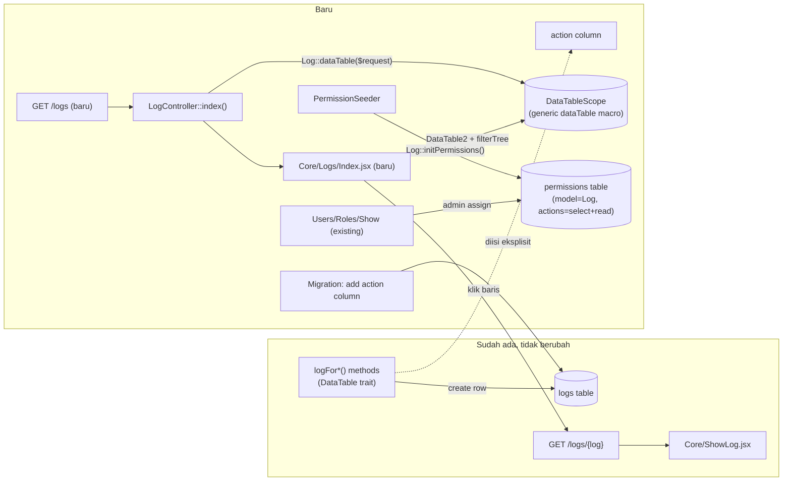

# Design Document: Global Log Viewer

## Overview

Fitur ini menambahkan halaman index global (`GET /logs`) yang menampilkan seluruh record tabel `logs` lintas modul. Pendekatannya **mengikuti pola arsitektur DataTable yang sudah ada** dan sengaja tidak membangun mekanisme baru:

- **Server-side listing, sorting, pagination, filtering** dipakai apa adanya dari macro `Model::dataTable($request)` (`DataTableScope`) — sudah generik untuk semua model, termasuk `Log`. Filter (modul/user/tanggal/aksi) dari Requirement 4 **tidak butuh endpoint atau logic khusus**: begitu kolom-kolom itu terdaftar di `$configColumns` milik `Log`, filter builder di `DataTable2.jsx` (mekanisme `filterTree` + `SavedFilter`) otomatis bisa memfilter berdasarkan kolom tersebut.
- **Permission** didaftarkan otomatis lewat `PermissionSeeder` → `Log::initPermissions()` (sudah berjalan untuk semua model yang pakai trait `DataTable`) — yang perlu diubah hanyalah override method `permissions()` pada `Log` supaya hanya expose `select` dan `read` (bukan 8 default: `select, read, write, create, delete, import, export, share`).
- **Yang benar-benar baru**: (1) migration kolom `action`, (2) pengisian kolom `action` di 7 method `logFor*()`, (3) route `GET /logs` + `LogController::index()`, (4) halaman React `Core/Logs/Index.jsx`, (5) penyesuaian `$configColumns` pada `Log.php`, (6) override `permissions()` pada `Log`.
- **Yang TIDAK berubah**: mekanisme pencatatan log itu sendiri (kapan `logFor*()` dipanggil), halaman detail log (`Core/ShowLog.jsx`, `LogController::show()`), struktur `data_before`/`data_after`, dan tidak ada endpoint create/update/delete baru untuk `Log`.

## Architecture



### Data Flow — mengakses halaman index

1. User membuka `/logs`.
2. `Controller::__construct()` (base, sudah ada) mengecek `session('permissions')[Log::class]` untuk aksi `select` → 403 jika tidak ada (Requirement 2.3).
3. `LogController::index()` memanggil `Log::dataTable($request)` — macro generik menangani sort/paginate/filter (via `?fid=` saved filter) tanpa kode tambahan.
4. Halaman `Core/Logs/Index.jsx` merender `DataTable2` dengan kolom dari `Log::$configColumns` (baru: `loggable_type`, `action`; existing: `activity`, `user`, `loggable`, `created_at`).
5. User membangun filter lewat filter builder bawaan `DataTable2` (mis. `action = created` AND `created_at BETWEEN ...`) — tersimpan sebagai `SavedFilter` per Requirement 4.5 (kombinasi filter), memakai mekanisme yang sudah ada.
6. Klik baris → navigasi ke `logs.show` (route existing, tidak berubah).

## Components and Interfaces

### 1. Migration: tambah kolom `action`

File baru: `database/migrations/{timestamp}_add_action_to_logs_table.php`

```php
Schema::table('logs', function (Blueprint $table) {
    $table->string('action')->nullable()->after('type')->index();
});
```

Nullable karena log lama tidak akan di-backfill (lihat Out of Scope requirements.md). Index ditambah karena kolom ini jadi target filter utama (Requirement 4.4).

### 2. `App\Traits\DataTable` — isi kolom `action` di setiap `logFor*()`

Setiap method menambah satu key `'action' => '...'` pada payload `Log::create([...])` yang sudah ada. Tidak ada perubahan signature/behavior lain.

```php
public function logForCreated() {
    // ...existing code...
    Log::create([
        'user_id'       => Auth::user()->id,
        'loggable_id'   => $this->getKey(),
        'loggable_type' => get_class($this),
        'action'        => 'created',   // BARU
        'activity'      => [...],
        'data_before'   => $this->dataBefore ?? null,
        'data_after'    => $this->dataAfter,
    ]);
}
```

Nilai `action` per method (Requirement 1.2–1.8):

| Method | `action` |
|---|---|
| `logForCreated()` | `created` |
| `logForUpdated()` | `updated` |
| `logForDeleted()` | `deleted` |
| `logForRestore()` | `restored` |
| `logForSubmitted()` | `submitted` |
| `logForCancelled()` | `cancelled` |
| `logForAmended()` | `amended` |

`Controller::addComment()` (baris terpisah, bukan lewat `logFor*()`) tetap membuat `Log::create()` tanpa kolom `action` — otomatis `NULL` karena tidak disentuh (Requirement 1.10 terpenuhi tanpa perubahan tambahan).

### 3. `App\Models\Core\Log` — override `permissions()`, `$canDelete`, dan `$configColumns`

**Koreksi ditemukan saat implementasi:** `Log` sebelumnya HANYA memakai `HasUlids, SoftDeletes` — TIDAK memakai trait `DataTable` sama sekali, sehingga `initPermissions()`, macro `dataTable()`, dan `getColumns()` belum pernah aktif untuknya. Menambahkan `use DataTable` adalah prasyarat mutlak yang tidak eksplisit tercatat di draft desain awal.

```php
class Log extends Model {
    use DataTable, HasUlids, SoftDeletes;

    public bool $canDelete = false; // pola sama dgn Ticket.php — cegah tombol delete tampil di UI manapun

    protected static function permissions(): array {
        return ['select', 'read']; // override default 8 permission (Requirement 5.2)
    }

    protected array $configColumns = [
        'code' => [
            'isLink'    => true,
            'dependsOn' => ['created_at', 'user.name'],
            'order'     => 0,
        ],
        'action' => [
            'valueTrans' => 'core.log.action.options', // label diterjemahkan (Requirement 3.5)
            'show'       => true,
            'order'      => 1,
        ],
        'activity' => [
            'show'  => true,
            'order' => 2,
        ],
        'loggable_type' => [
            'show'  => true,
            'order' => 3,
            // Label ditampilkan lewat accessor getLoggableTypeLabelAttribute() di
            // bawah, BUKAN valueTrans statis — bersumber dari Permission::name
            // (lookup by model FQCN) supaya konsisten dgn nama modul yang sama
            // dipakai di seluruh sistem RBAC (Requirement 3.1).
        ],
        'loggable' => [
            'show'               => true,
            'order'              => 4,
            'disabledNavigation' => true, // link diarahkan manual di frontend, bukan auto-navigate model lain
        ],
        'user' => [
            'show'  => true,
            'order' => 5,
        ],
        'created_at' => [
            'type'  => 'datetime',
            'show'  => true,
            'order' => 6,
        ],
        'data_before' => ['ignore' => true],
        'data_after'  => ['ignore' => true],
    ];
}
```

Catatan desain:
- `permissions()` sudah ada sebagai method **protected static** di trait `DataTable` (default: 8 permission standar) — `Log` meng-override untuk mempersempit sesuai Requirement 5.2. `PermissionSeeder`/`initPermissions()` tidak perlu diubah sama sekali; ia sudah membaca `static::permissions()` secara polymorphic (lihat `DataTable.php` baris 529: `'permissions' => (is_submitable) ? [...] : static::permissions()`).
- Label modul untuk `loggable_type` **reuse dari tabel `permissions`** (kolom `name`, mis. "Work Orders") — bukan mapping baru di file lang. Ditambahkan accessor:

  ```php
  protected function loggableTypeLabel(): Attribute {
      return Attribute::get(fn () => Permission::where('model', $this->loggable_type)->value('name')
          ?? class_basename($this->loggable_type)); // fallback kalau model belum/tidak permission-aware
  }
  ```

  Accessor ini di-append (`protected $appends = [..., 'loggable_type_label']`) dan dirujuk di `$configColumns` lewat `dependsOn: ['loggable_type']` pada kolom tampilan — konsisten dengan pola `code` yang sudah pakai `dependsOn` untuk computed attribute. Konsekuensi: setiap baris log butuh satu lookup ke tabel `permissions` (di-cache per request via keying `loggable_type`, bukan query per baris, supaya tidak N+1 saat menampilkan halaman berisi puluhan baris log dengan `loggable_type` campuran).
- `loggable` tetap relasi `morphTo()` yang sudah ada (`Log.php` baris 67-69) — tidak berubah. Requirement 3.3 (dokumen terhapus) ditangani di frontend: render fallback text jika `loggable` resolve ke `null`.

### 4. Route baru: `GET /logs`

`routes/web.php`, ditambah tepat sebelum baris `Route::get('/logs/{log}', ...)` yang sudah ada:

```php
Route::get('/logs', [LogController::class, 'index'])->name('logs.index');
Route::get('/logs/{log}', [LogController::class, 'show'])->name('logs.show'); // existing, tidak berubah
```

Route ini **tidak** memakai macro `resourceDetail()` (yang men-generate create/store/update/destroy) — didaftarkan manual sebagai single route, konsisten dengan sifat read-only (Requirement 2.4).

### 5. `LogController::index()` — method baru

```php
class LogController extends Controller {
    public function __construct(Request $request) {
        parent::__construct($request, Log::class); // aktifkan permission check constructor
    }

    public function index(Request $request) {
        $this->setBreadcrumbs();
        Log::dataTable($request);

        return Inertia::render('Core/Logs/Index');
    }

    public function show(Log $log) { /* ...existing, tidak berubah... */ }
}
```

**Keputusan (dikonfirmasi user):** `LogController` saat ini **tidak** memanggil `parent::__construct()` dengan model (constructor kosong) — `show()` saat ini tidak melalui permission check apa pun. Setelah perubahan ini, `parent::__construct($request, Log::class)` mengaktifkan permission check untuk **kedua** method:

- `index()` → di-map ke aksi `select` (default mapping `Controller::__construct()`, baris `'index' => 'select'`) — perlu `select` pada model Log.
- `show()` → di-map ke aksi `read` (default mapping `'show' => 'read'`) — perlu `read` pada model Log.

Ini sudah **otomatis benar tanpa override tambahan**, karena kedua mapping tersebut sudah jadi default di `Controller::__construct()` (lihat `app/Http/Controllers/Controller.php`, method `__construct`) — tidak perlu `exceptPermission()`/`enforcePermission()` khusus di `LogController`. Konsekuensi: user yang sebelumnya bisa membuka link `/logs/{log}` dari halaman dokumen manapun (tanpa permission Log eksplisit) sekarang butuh permission `read` pada model Log — **perubahan behavior yang disengaja**, sesuai keputusan user.

### 6. Frontend: `resources/js/Pages/Core/Logs/Index.jsx` (baru)

Mengikuti pola paling minimal (`Todos/Index.jsx`), tanpa form create:

```jsx
import DataTable2 from "@/Pages/Core/DataTable2";

function Index() {
  return <DataTable2 />;
}

export default Index;
```

**Verifikasi (`DataTable2.jsx` baris 647, 732):** tombol "Create" dirender hanya jika `form && canCreate` — dua syarat, bukan satu. Karena tidak ada prop `form` yang dikirim (tidak ada komponen Form untuk Log), tombol Create otomatis tidak pernah muncul, terlepas dari nilai `canCreate`. Tidak perlu prop `hideCreateButton`/`forceCanCreate` (prop tersebut tidak ada di komponen ini) — cukup tidak memberikan prop `form`.

## Data Models

### Perubahan skema: `logs` table

| Kolom | Tipe | Nullable | Index | Keterangan |
|---|---|---|---|---|
| `action` | `varchar(255)` | ya | ya | **Baru.** Kode aksi baku: `created`, `updated`, `deleted`, `restored`, `submitted`, `cancelled`, `amended`, atau `NULL` (log lama / log tipe `comment`). |

Tidak ada perubahan pada kolom lain (`activity`, `data_before`, `data_after`, `loggable_type`, `loggable_id`, `user_id`, `type`).

### Permission baru: baris `permissions` table

Dibuat otomatis oleh `initPermissions()` saat `php artisan db:seed --class=PermissionSeeder` (atau migrate fresh) dijalankan:

| Field | Value |
|---|---|
| `model` | `App\Models\Core\Log` |
| `module` | `Core` |
| `name` | `Logs` |
| `route` | `logs` |
| `permissions` | `{"select": true-slot, "read": true-slot}` (hanya 2 key, sesuai override `permissions()`) |
| `is_submitable` | `false` |

## Correctness Properties

1. **Kelengkapan aksi**: untuk setiap pemanggilan salah satu dari 7 method `logFor*()`, row `logs` yang dihasilkan memiliki `action` non-null yang sesuai tabel mapping di atas — tidak pernah `NULL` untuk log baru bertipe audit (bukan comment).
2. **Isolasi permission**: user tanpa baris permission `Log` (atau dengan `select=false`) selalu menerima HTTP 403 saat `GET /logs`, terlepas dari permission apa pun yang dimiliki pada model lain — konsisten dengan mekanisme `Controller::__construct()` yang sudah diverifikasi berlaku generik untuk semua model.
3. **Tidak ada mutasi**: tidak ada kombinasi request (method HTTP + payload apa pun) yang dapat mengubah/menghapus row `logs` melalui route `/logs*` — hanya `GET` yang terdaftar.
4. **Konsistensi filter**: hasil filter `action = X` pada halaman index harus sama persis dengan hasil pencarian manual `SELECT * FROM logs WHERE action = 'X'` — tidak ada transformasi/normalisasi tersembunyi antara nilai yang difilter user dan nilai yang disimpan di database.

## Error Handling

| Scenario | Behavior |
|----------|----------|
| User tanpa permission `select` pada `Log` mengakses `GET /logs` | HTTP 403 (dari `Controller::__construct()`) |
| User tanpa permission `read` pada `Log` mengakses `GET /logs/{log}` (show) | HTTP 403 — **perubahan behavior yang disengaja** (dikonfirmasi user): sebelumnya `show()` bisa diakses siapa pun yang punya link, sekarang butuh permission `read` eksplisit pada model Log. |
| `loggable` (dokumen asal) sudah dihapus permanen / morph target tidak valid | Baris log tetap tampil; kolom `loggable` menampilkan teks fallback (mis. "Dokumen tidak tersedia") alih-alih error/crash |
| Filter `action` dikombinasikan dengan filter lain (mis. `loggable_type` + rentang tanggal) | Filter builder existing (`FilterEvaluator`) menangani AND antar kondisi secara generik — tidak ada logic tambahan yang bisa membuatnya gagal secara spesifik untuk `Log` |
| Migration dijalankan di database dengan jutaan baris `logs` existing | `ALTER TABLE ... ADD COLUMN action VARCHAR(255) NULL` — operasi metadata-only di MySQL 8 (tidak rebuild seluruh tabel), risiko downtime minimal |

## Testing Strategy

- **Unit/Feature Tests**:
  - Test tiap `logFor*()` method menghasilkan row dengan `action` yang benar (7 test, satu per method).
  - Test `Controller::addComment()` tetap menghasilkan `action = NULL`.
  - Test `GET /logs` mengembalikan 403 untuk user tanpa permission `Log`.
  - Test `GET /logs` mengembalikan 200 + daftar log untuk user dengan permission `select` pada `Log`, mencakup log dari lebih dari satu `loggable_type` sekaligus (membuktikan tidak ada scoping tersembunyi).
  - Test `Log::permissions()` mengembalikan tepat `['select', 'read']`, dan `Log::initPermissions()` menghasilkan baris `permissions` dengan hanya 2 key tersebut.
- **Integration Test**: skenario penuh — buat beberapa dokumen (WorkOrder, User) yang memicu log dengan action berbeda, akses `/logs` dengan filter `action=updated`, assert hanya log `updated` yang muncul.
- **Manual/Browser Verification**: buka `/logs` sebagai user dengan permission, verifikasi kolom tampil sesuai Requirement 3, coba filter builder untuk keempat filter (modul, user, tanggal, aksi), klik baris → verifikasi navigasi ke halaman detail existing tidak rusak.
- Test tambahan: `show()` mengembalikan 403 untuk user tanpa permission `read` pada `Log` (perubahan behavior yang disengaja, lihat Error Handling), dan 200 untuk user dengan permission `read`.
