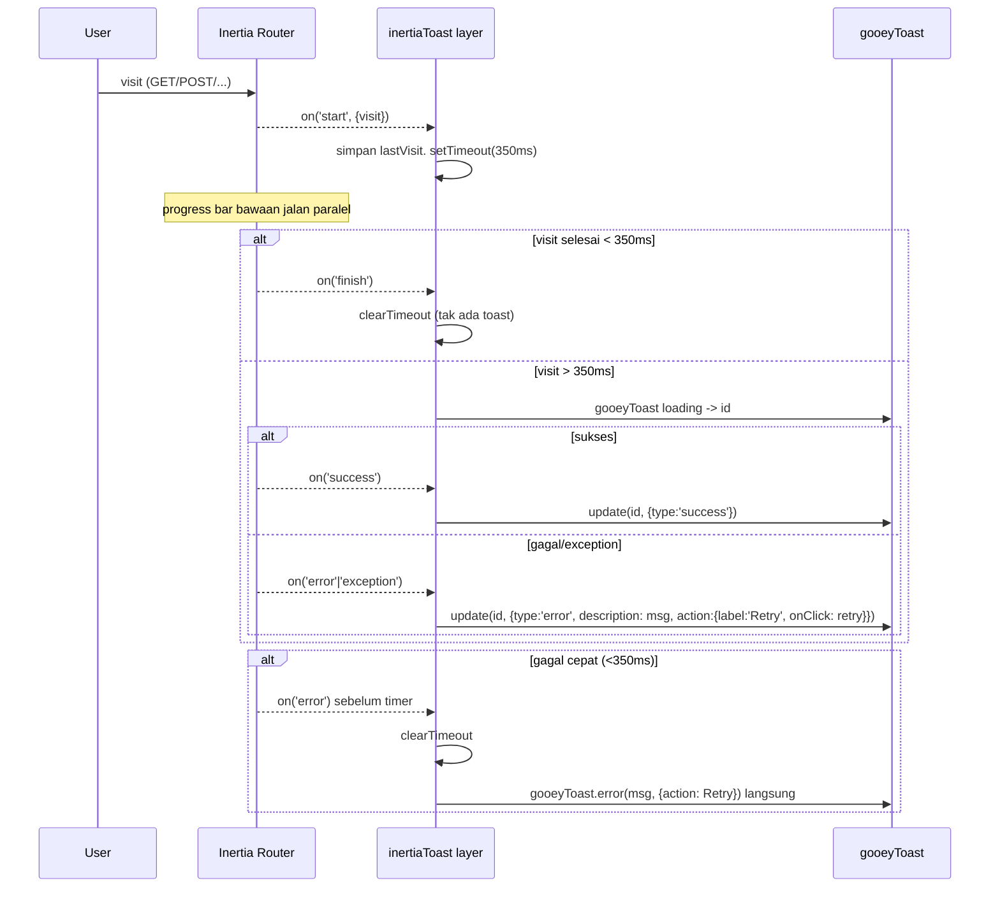

# Design Document: goey-toast-migration

## Overview

Migrasi lapisan notifikasi dari **Sonner** ke **goey-toast** dengan strategi **shim/wrapper** agar perubahan call site minimal dan terkontrol. Tiga pilar solusi:

1. **Provider + shim** — `<GooeyToaster />` menggantikan `<Toaster />` Sonner di `MasterLayout`, dibungkus wrapper yang membaca `currentTheme` dan menerapkan konfigurasi wajib (spring, preset smooth, duration 5000, top-center). Sebuah modul shim meng-export `gooeyToast` sehingga call site cukup mengganti **sumber import**, bukan menulis ulang logika.
2. **Lapisan loading Inertia** — util `setupInertiaToast()` memasang listener `router.on(...)` untuk seluruh visit (termasuk navigasi GET), memunculkan loading toast dengan **delay-threshold**, lalu meng-`update()` toast yang sama menjadi sukses/error + tombol **Retry**. Progress bar bawaan tetap dipertahankan.
3. **Audit async** — operasi async yang saat ini silent diberi toast sesuai kebutuhan (mis. `LinkModel` → error-only).

**Yang TIDAK berubah:** logika bisnis, alur form (`useFormPage`), routing, progress bar bawaan Inertia (`app.jsx` `progress.color`), mekanisme i18n, dan hook `useTheme`.

> Catatan API goey-toast (dari skill): provider `<GooeyToaster theme position spring preset duration ...>`; helper `gooeyToast(.success/.error/.warning/.info/.promise/.update/.dismiss)`. **Tidak ada** `gooeyToast.custom` — itulah alasan R4 memaksa custom→standard. `update(id, { title, type, description, icon, action })` mengubah toast in-place. `import 'goey-toast/styles.css'` wajib (gotcha utama).

## Architecture

### Struktur modul baru/berubah

```
resources/js/
├── app.jsx                         (+ import 'goey-toast/styles.css')
├── lib/
│   ├── gooeyToast.js               (BARU) re-export gooeyToast + helper konversi
│   └── inertiaToast.js             (BARU) setupInertiaToast(): loading-promise layer
├── Components/ui/
│   └── goey-toaster.jsx            (BARU) wrapper <GooeyToaster/> + theme + config R2
└── Layouts/
    └── MasterLayout.jsx            (UBAH) mount <GooeyToaster/>, panggil setupInertiaToast(),
                                            selaraskan listener inertia:invalid/exception
```

Call site lama tinggal mengganti `import { toast } from "sonner"` → `import { gooeyToast as toast } from "@/lib/gooeyToast"` (alias `toast` menekan diff), KECUALI yang `toast.custom` (harus ditulis ulang ke `gooeyToast.error/...`).

### Flow loading toast Inertia (delay-threshold)



### Data Flow tema

`useTheme()` (Zustand) → `currentTheme` (`'light'|'dark'`) → prop `theme` di `<GooeyToaster/>`. Wrapper adalah komponen React yang men-subscribe store, jadi re-render otomatis saat tema berubah (R2.6). Tak perlu perubahan di `MasterLayout` theme effect yang sudah ada.

## Components and Interfaces

### 1. `Components/ui/goey-toaster.jsx` (BARU)

```jsx
import { GooeyToaster as Base } from "goey-toast";
import useTheme from "@/Hooks/useTheme";

export function GooeyToaster(props) {
  const { currentTheme } = useTheme(); // 'light' | 'dark'
  return (
    <Base
      theme={currentTheme}
      position="top-center"
      spring
      preset="smooth"
      duration={5000}
      {...props}
    />
  );
}
```

### 2. `lib/gooeyToast.js` (BARU) — shim + helper konversi

```js
import { gooeyToast } from "goey-toast";

// Helper untuk meniru semantik toast.custom(<Alert variant>) lama → standard goey.
// variant: 'destructive' -> error, 'warning' -> warning, 'success' -> success, default -> info
export function toastAlert(variant, title, options = {}) {
  const type = variant === "destructive" ? "error" : variant; // map ke tipe goey
  const fn = gooeyToast[type] ?? gooeyToast.info;
  return fn(title, options);
}

export { gooeyToast };
export default gooeyToast;
```

### 3. `lib/inertiaToast.js` (BARU) — loading-promise layer

```js
import { router } from "@inertiajs/react";
import { gooeyToast } from "@/lib/gooeyToast";

const DELAY_MS = 350;

export function setupInertiaToast({ t }) {
  let timer = null;
  let toastId = null;
  let lastVisit = null; // { url, method, data, ... } untuk Retry

  const clear = () => {
    clearTimeout(timer);
    timer = null;
  };

  const offStart = router.on("start", (e) => {
    lastVisit = e.detail.visit;
    timer = setTimeout(() => {
      toastId = gooeyToast(t("core.toast.loading"), { icon: <Spinner /> });
    }, DELAY_MS);
  });

  const offSuccess = router.on("success", () => {
    clear();
    if (toastId != null) {
      gooeyToast.update(toastId, {
        title: t("core.toast.success"),
        type: "success",
        icon: null,
      });
      toastId = null;
    }
  });

  const fail = (msg) => {
    clear();
    const action = {
      label: t("core.toast.retry"),
      onClick: () => router.visit(lastVisit.url, lastVisit),
    };
    if (toastId != null) {
      gooeyToast.update(toastId, {
        title: t("core.toast.error"),
        type: "error",
        description: msg,
        action,
        icon: null,
      });
      toastId = null;
    } else {
      gooeyToast.error(t("core.toast.error"), { description: msg, action });
    }
  };

  const offError = router.on("error", (e) => fail(extractError(e, t)));
  const offException = router.on("exception", (e) => fail(extractError(e, t)));

  return () => {
    clear();
    offStart();
    offSuccess();
    offError();
    offException();
  };
}
```

> `extractError` memetakan status/exception ke pesan i18n yang sudah ada (`core.errors.http.*`, `core.errors.network.*`). Detail Retry memakai `lastVisit` (url + opsi visit) yang ditangkap di `start`.

### 4. `MasterLayout.jsx` (UBAH)

- Ganti `<Toaster />` (baris 324) → `<GooeyToaster />` dari `Components/ui/goey-toaster`.
- Di dalam `useEffect` setup, panggil `const teardown = setupInertiaToast({ t })` dan `return teardown` untuk cleanup.
- **Selaraskan duplikasi**: listener `inertia:invalid` / `inertia:exception` saat ini (baris 192–245) memunculkan error toast. Karena lapisan baru juga menangani `error`/`exception`, salah satu harus jadi sumber tunggal. **Keputusan:** pindahkan seluruh penanganan error HTTP/network ke `setupInertiaToast` (memakai `router.on`), lalu **hapus** listener `inertia:invalid`/`inertia:exception` lama agar tidak ada toast ganda (R5.10). `showHttpErrorToast`/`getHttpErrorMessage` dipindah jadi `extractError` di `inertiaToast.js`.

### 5. Konversi call site `toast.custom` → standard (R4)

| File:line (lama)                             | variant Alert | Konversi                                                 |
| -------------------------------------------- | ------------- | -------------------------------------------------------- |
| `MasterLayout.jsx:196`                       | destructive   | dihapus → ditangani `extractError` di inertiaToast layer |
| `Components/InputBarcode.jsx:143`            | destructive   | `gooeyToast.error(title, { description })`               |
| `Components/InputBarcode.jsx:209`            | warning       | `gooeyToast.warning(title, { description })`             |
| `Components/InputBarcode.jsx:234`            | success       | `gooeyToast.success(title, { description })`             |
| `Pages/Users/Roles/Form.jsx:22`              | destructive   | `gooeyToast.error(title)`                                |
| `Pages/Core/FormPage.jsx:922`                | destructive   | `gooeyToast.error(title)`                                |
| `Pages/Finances/PaymentEntries/Form.jsx:189` | success       | `gooeyToast.success(title)`                              |

Title/description diambil dari `<AlertTitle>`/`<AlertDescription>` lama. `onClose`/`toast.dismiss` manual dihapus (goey punya auto-dismiss `duration` + `closeButton`).

### 6. Audit async — jenis toast per lokasi (R6)

| Lokasi                                                        | Operasi                               | Jenis toast                                           |
| ------------------------------------------------------------- | ------------------------------------- | ----------------------------------------------------- |
| `Components/LinkModel.jsx:458`                                | `axios.post(route("model"))` `.catch` | **error-only** (tanpa loading/success)                |
| `Components/SelectModel.jsx` (columns/datatable)              | `axios.get/post` catch→console        | **error-only**                                        |
| `Pages/Dashboard/Dashboard.jsx:203/214`                       | simpan/reorder widget                 | **error-only** (sukses sudah terlihat di UI)          |
| `Pages/Core/Components/Comments.jsx:103`                      | fetch mention users                   | **error-only** (silent acceptable bila kosong)        |
| `Pages/Core/Components/Tags.jsx:104`                          | `axios.get` catch→console             | **error-only**                                        |
| `lib/utils.js:442 getDataModel`                               | `axios.post(route("model"))`          | propagate/`error-only` di pemanggil                   |
| `lib/htmlSanitizer.js:278`                                    | sanitize                              | **error-only** (fallback tetap jalan)                 |
| `AlertDialogs/DeleteDialog.jsx:49`                            | `router.delete`                       | ditangani lapisan Inertia (mutasi) — tak perlu manual |
| `GlobalCommandPalette.jsx` tracking (`commands.recent.track`) | analitik non-blocking                 | **tanpa toast** (sengaja silent, R6.4)                |

LinkModel mengubah `.catch(() => {})` → `.catch((e) => gooeyToast.error(t("core.errors.fetch_failed"), { description: ... }))`.

## Data Models

Tak ada perubahan skema DB / type backend. Type konseptual frontend:

```ts
type InertiaToastState = {
  timer: ReturnType<typeof setTimeout> | null;
  toastId: string | number | null;
  lastVisit: { url: string; method: string; data?: unknown } | null;
};

type ToastAlertVariant = "destructive" | "warning" | "success"; // → error|warning|success
```

i18n keys baru (di `lang/*.json`, namespace `core.toast`): `loading`, `success`, `error`, `retry`. Plus `core.errors.fetch_failed` untuk LinkModel.

## Correctness Properties

1. **Single mount**: tepat satu `<GooeyToaster />` di tree (tak ada `<Toaster />` Sonner tersisa).
2. **No double-toast**: satu kegagalan visit menghasilkan **tepat satu** toast error (lapisan Inertia satu-satunya sumber; listener lama dihapus).
3. **Threshold invariant**: jika `finish/success/error` terjadi < `DELAY_MS`, tak ada loading toast yang pernah dibuat (timer di-clear) — kecuali pada cabang error-cepat yang sengaja memunculkan error langsung.
4. **In-place update**: loading→success/error memakai `toastId` yang sama; tak membuat toast kedua.
5. **Retry idempotent-target**: Retry memvisit ulang `lastVisit` yang sama (url + opsi), bukan visit lain.
6. **Theme parity**: `<GooeyToaster theme>` selalu == `currentTheme` saat ini.

## Error Handling

| Scenario                                 | Behavior                                                                            |
| ---------------------------------------- | ----------------------------------------------------------------------------------- |
| Visit GET lambat (>350ms) lalu sukses    | Loading toast muncul → update jadi success                                          |
| Visit cepat (<350ms)                     | Tidak ada toast (hanya progress bar bawaan)                                         |
| Visit gagal setelah loading tampil       | Update toast jadi error + pesan + Retry                                             |
| Visit gagal sebelum threshold            | Tampilkan error toast langsung + Retry                                              |
| HTTP 4xx/5xx (inertia error)             | Pesan dari `core.errors.http.*`; ditangani di lapisan Inertia (bukan listener lama) |
| Network/exception                        | Pesan `core.errors.network.*`; Retry tersedia                                       |
| LinkModel fetch gagal                    | `gooeyToast.error` saja; opsi tetap kosong, UI tidak crash                          |
| `styles.css` belum import                | Toast tampil unstyled — dicegah dengan import wajib di `app.jsx`                    |
| goey-toast/framer-motion belum terpasang | Build gagal — install jadi prasyarat (butuh approval)                               |

## Testing Strategy

- **Build verification**: `npm run build` harus sukses tanpa error terkait toast (R7.2).
- **PHP suite tak terdampak**: jalankan `php artisan test --compact` ringan untuk pastikan tak ada regresi backend (R7.3) — terutama tidak menyentuh `CompanyNumberFormatTest`.
- **Manual integration (frontend)**:
  - Trigger sukses (mis. simpan filter di DataTable) → toast success goey muncul, posisi top-center.
  - Trigger error HTTP (mis. submit invalid) → satu toast error + Retry; klik Retry mengulang visit.
  - Navigasi GET cepat vs lambat → verifikasi delay-threshold (tak berkedip saat cepat).
  - Ganti tema light↔dark → toast ikut berubah (R2.6).
  - LinkModel saat server error → hanya toast error, tak ada loading/success.
- **Property-based (opsional)**: `extractError(status)` pure → mapping status→pesan dapat diuji per range (400–499, 500–599, non-numeric).
- Tidak ada test yang dihapus.
