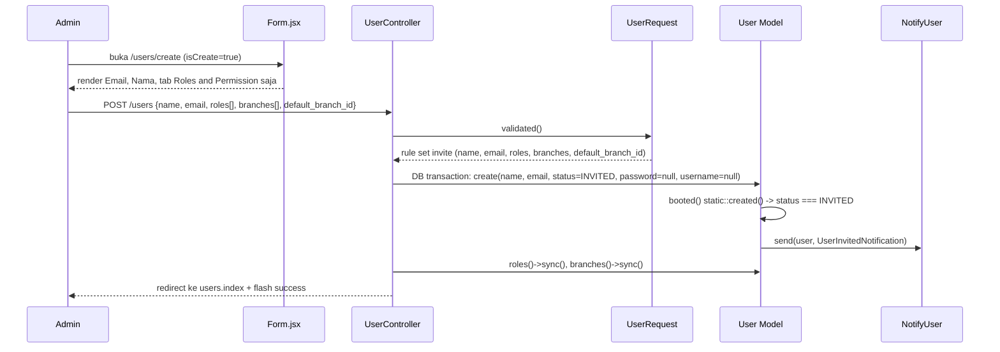

# Design Document: Invite User

## Overview

Mengimplementasikan `UserController::store()` (saat ini stub kosong) sebagai alur **Invite User**: admin hanya mengisi Email, Nama, dan tab Roles and Permission (Roles + Branches). User dibuat dengan `status = FormStatus::INVITED`, tanpa password/username, memicu `UserInvitedNotification` lewat mekanisme `User::booted()` yang sudah ada — tidak ada perubahan pada notifikasi/mailer.

Pattern utama:

- **Split validation rule** di `UserRequest` — `store` pakai rule set terbatas (name, email, roles, branches, default_branch_id saja), `update` tetap pakai rule set penuh yang sudah ada. Laravel `FormRequest` mendukung ini via override `rules()` dengan pengecekan `$this->isMethod('post')` atau route name, mengikuti pola yang sudah ada di project (`Rule::requiredIf` berdasarkan konteks request).
- **Form.jsx dibuat context-aware terhadap `isCreate`** (dari `useFormPage()`, bukan hanya `authUser.id != data?.id` yang saat ini dipakai) — field non-invite (username, gender, phone, birthdate) disembunyikan total saat create, bukan sekadar di-disable.
- **Reuse penuh** tab Roles and Permission yang sudah ada — tidak ada komponen UI baru, hanya penyesuaian kondisi render.

Yang TIDAK berubah: `UserInvitedNotification`, `NotifyUser` service, `SetupUserController`, struktur tabel `users`, route `resourceDetail('user', ...)`.

## Architecture



### Data Flow

1. Admin buka form create (`GET /users/create` → `UserController::create()`, tidak berubah).
2. `Form.jsx` render kondisional berdasar `isCreate` dari `useFormPage()`: field identitas hanya Email + Nama; tab Roles and Permission tetap tampil mengikuti permission `manage_roles`/`manage_branches` yang sudah ada.
3. Submit → `POST /users` (`UserController::store()`, baru diimplementasi) menerima `UserRequest` dengan rule set khusus create.
4. Dalam transaksi DB: `User::create()` dengan `status = FormStatus::INVITED`; lalu sync roles/branches jika dikirim.
5. `User::booted()` `static::created()` mendeteksi status INVITED, kirim notifikasi — tidak ada kode baru di sini.
6. Response redirect ke `users.index` dengan flash message sukses.

## Components and Interfaces

### `app/Http/Requests/User/UserRequest.php`

Tambah method `rules()` yang bercabang berdasar apakah request ini create (POST, tanpa route-model `user`) atau update:

```php
public function rules(): array {
    if ($this->isMethod('post')) {
        return [
            'name'              => ['required', 'string', 'min:3', 'max:255'],
            'email'             => ['required', 'string', 'email:rfc', Rule::unique('users', 'email')],
            'roles'             => ['nullable', 'array', 'min:1'],
            'roles.*'           => ['required', 'string', new ExistsExcludingTrashed('roles')],
            'branches'          => ['nullable', 'array', 'min:1'],
            'branches.*'        => ['required', 'string', new ExistsExcludingTrashed('branches')],
            'default_branch_id' => ['nullable', 'string', new ExistsExcludingTrashed('branches')],
        ];
    }

    return [
        // rule set existing untuk update, tidak berubah
    ];
}
```

Catatan: `Rule::unique('users', 'email')` otomatis exclude soft-deleted TIDAK terjadi by default — perlu `->where(fn ($q) => $q->whereNull('deleted_at'))` supaya email milik user yang sudah dihapus bisa dipakai ulang, konsisten dengan pattern unique index migration (`unique(['email', 'deleted_at'])`).

Field di luar whitelist (`username`, `gender`, `birthdate`, `phone`, `password`) otomatis tidak muncul di `validated()` karena tidak terdaftar di `rules()` — ini sudah cukup untuk Requirement 2.2 tanpa perlu rule `prohibited` eksplisit (Laravel `FormRequest::validated()` hanya mengembalikan key yang didefinisikan di `rules()`).

### `app/Http/Controllers/User/UserController.php`

```php
public function store(UserRequest $request) {
    $data = $request->validated();
    DB::beginTransaction();
    try {
        $user = User::create([
            'name'   => $data['name'],
            'email'  => $data['email'],
            'status' => FormStatus::INVITED,
            'default_branch_id' => $data['default_branch_id'] ?? null,
        ]);
        if (! empty($data['roles'])) {
            $user->roles()->sync($data['roles']);
        }
        if (! empty($data['branches'])) {
            $user->branches()->sync($data['branches']);
        }
        $user->logForCreated();
        DB::commit();
    } catch (\Throwable $e) {
        DB::rollBack();
        throw $e;
    }

    return redirect()->route('users.index');
}
```

Ikuti pola try/catch + rollback yang sudah dipakai di `destroy()` (L162-188), bukan pola `update()` yang tanpa try/catch — supaya Requirement 4.2 (tidak ada record parsial) terpenuhi.

`$request->user()` guard di `exceptPermission()`/permission check existing tidak perlu berubah — `store` sudah otomatis dilindungi permission `create` bawaan `resourceDetail` macro (perlu konfirmasi macro `resourceDetail` menerapkan middleware permission per method — di luar scope investigasi ini, ikuti pola `update`/`destroy` yang sudah protected).

### `resources/js/Pages/Users/ManageUsers/Form.jsx`

Tambah `isCreate` dari `useFormPage()`:

```jsx
const { data, setData, isCreate } = useFormPage();
```

Field non-invite (`username`, `gender`, `phone`, `birthdate`) dibungkus kondisi `!isCreate` agar hilang total dari DOM saat create — bukan cuma `disabled`. Field Email dan Nama tetap tampil, tapi kondisi `disabled={authUser.id != data?.id}` yang sekarang membuatnya ke-disable saat create (karena `data?.id` undefined) perlu diubah jadi `disabled={!isCreate && authUser.id != data?.id}`.

Tab Roles and Permission (`canUser("manage_roles")` / `canUser("manage_branches")`) tidak berubah kondisinya — sudah otomatis muncul di create jika admin punya permission tersebut, karena kondisinya cuma bergantung permission bukan `isCreate`.

`default_branch_id` di UI tetap `required={true}` (L343) — sesuai jawaban user bahwa Branches tab ikut ditampilkan; namun karena Requirement 3.4 branches opsional, ubah jadi conditional: `required={!isCreate}` agar tidak memblokir submit saat admin memilih tidak assign branch saat invite.

## Data Models

Tidak ada perubahan skema. `User` model dan migration existing sudah cukup:

- `status` → `FormStatus::INVITED` (existing enum value)
- `password`, `username` → tetap nullable, diisi `null` implisit dari `$guarded = ['id']` mass-assignment (tidak dikirim di `data`)

**Kenapa `username = null` tidak melanggar `unique(['username', 'deleted_at'])`:** project pakai MySQL (`.env.example` L25: `DB_CONNECTION=mysql`). Di MySQL (InnoDB), unique index memperlakukan tiap `NULL` sebagai nilai yang berbeda satu sama lain — banyak baris dengan `username = NULL` semua lolos constraint yang sama, termasuk kombinasi composite `(username, deleted_at)` = `(NULL, NULL)` berulang kali. Ini perilaku standar MySQL/PostgreSQL (beda dari SQL Server yang memperlakukan NULL sebagai satu nilai unik dalam unique index — tidak relevan di sini karena driver project MySQL). Tidak perlu kode tambahan; `username` cukup diisi `null` seperti field lain, constraint DB sudah otomatis mengizinkan banyak invited user tanpa username.

## Correctness Properties

### Property 1: Invite hanya menerima field whitelist

_For any_ POST request ke `/users` dengan payload berisi field di luar `{name, email, roles, branches, default_branch_id}`, hasil `$request->validated()` SHALL hanya berisi key dari whitelist tersebut.
**Validates: Requirements 2.1, 2.2**

### Property 2: User baru selalu berstatus INVITED tanpa password/username

_For any_ create User yang berhasil melalui `store()`, record yang tersimpan SHALL memiliki `status = FormStatus::INVITED`, `password = null`, `username = null`, dan SHALL tidak melanggar unique index `(username, deleted_at)` walau banyak invited user dibuat berurutan.
**Validates: Requirements 3.1**

### Property 3: Notifikasi terkirim tepat satu kali per invite

_For any_ create User dengan status INVITED, `NotifyUser::send()` dengan `UserInvitedNotification` SHALL terpanggil tepat satu kali (via `static::created()`, bukan `static::updated()` karena ini create pertama).
**Validates: Requirements 3.2**

### Property 4: Atomicity create + sync roles/branches

_For any_ create User yang gagal di tengah proses (mis. sync roles/branches throw), SHALL tidak ada record `User` yang tersimpan permanen (rollback penuh).
**Validates: Requirements 4.2**

## Error Handling

| Scenario                                                        | Behavior                                                                                             |
| ----------------------------------------------------------------- | ------------------------------------------------------------------------------------------------------ |
| Email sudah terdaftar (user aktif, belum soft-delete)            | `UserRequest` validasi gagal pada field `email`, response 422 dengan pesan validasi standar Laravel  |
| Email pernah dipakai user yang sudah soft-delete                 | Diizinkan (unique check scoped ke `deleted_at IS NULL`, sesuai desain index existing)                |
| Dua atau lebih invited user dibuat tanpa username                | Diizinkan — `unique(['username','deleted_at'])` tidak terpicu karena MySQL memperlakukan tiap NULL berbeda |
| `roles`/`branches` berisi ID yang tidak ada / sudah di-soft-delete | Ditolak oleh `ExistsExcludingTrashed` rule (rule existing, reused)                                   |
| Error saat `roles()->sync()` atau `branches()->sync()`            | Transaksi di-rollback, `User` yang baru dibuat tidak tersimpan, exception dilempar ulang (500)        |
| Admin tanpa permission `create` pada User                        | Ditolak oleh permission middleware `resourceDetail` (existing, tidak berubah)                        |

## Testing Strategy

- **Unit Tests**: `UserRequest` — assert rule set create hanya validasi whitelist field, assert field di luar whitelist tidak muncul di `validated()`.
- **Feature Tests** (`tests/Feature/User/UserControllerTest.php` atau serupa):
  - Submit invite valid (name + email saja) → user tercipta dengan status INVITED, password null, username null.
  - Submit invite dengan roles + branches → relasi `user_role`/`user_branch` tersimpan sesuai.
  - Submit invite dengan email duplikat (user aktif) → 422, tidak ada record baru.
  - Submit invite dengan field asing (`username`, `password` di payload) → field tersebut tidak berpengaruh ke record yang tersimpan.
  - Assert `UserInvitedNotification` terkirim (`Notification::fake()` + `assertSentTo`).
  - Assert kegagalan di tengah proses (mock exception pada sync) → tidak ada record `User` tersisa (rollback verified).
- **Manual/browser check**: buka `/users/create`, pastikan hanya Email, Nama, dan tab Roles and Permission yang tampil; submit dan cek email undangan terkirim (log/mailtrap sesuai konfigurasi `.env`).
