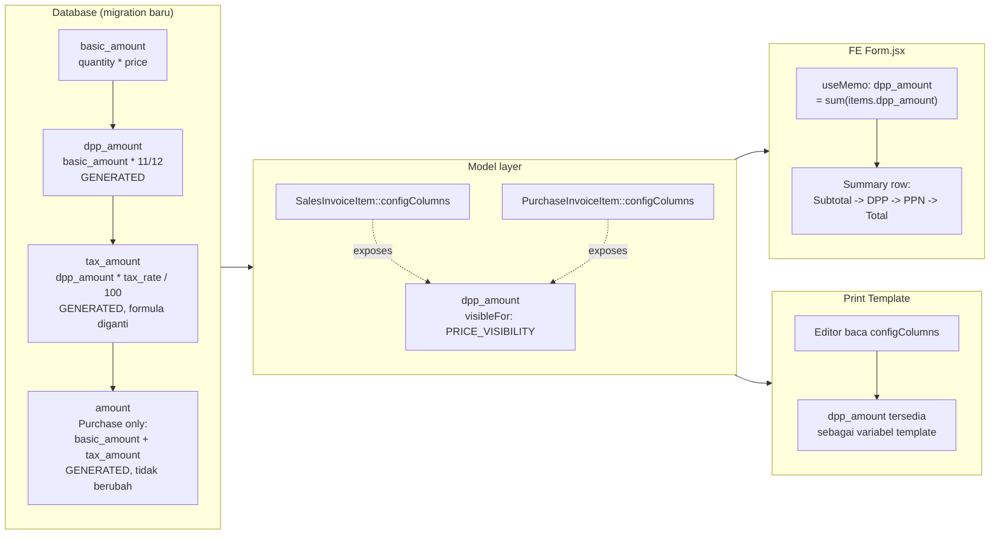

# Design Document: invoice-dpp-adjustment

## Overview

Menambahkan kolom `dpp_amount` (Dasar Pengenaan Pajak) pada `sales_invoice_items` dan `purchase_invoice_items`, dihitung otomatis sebagai `basic_amount × 11/12`, lalu mengubah basis perhitungan `tax_amount` dari `basic_amount` menjadi `dpp_amount`.

**Pattern utama:** mengikuti pola yang sudah dipakai `basic_amount`/`tax_amount` di kedua tabel secara penuh — baik `dpp_amount` maupun `tax_amount` tetap kolom **generated/stored** di level database (`storedAs()`), bukan dihitung/diisi di PHP. Ini konsisten 100% dengan konvensi existing, tidak menyimpang ke pola baru, dan tidak butuh perubahan apapun di service layer.

**Yang berubah:**
- Migration: tambah kolom `dpp_amount` (stored generated, formula `basic_amount * 11 / 12`), lalu ubah formula `tax_amount` (tetap generated) dari `basic_amount * tax_rate / 100` menjadi `dpp_amount * tax_rate / 100`.
- Model `SalesInvoiceItem`, `PurchaseInvoiceItem`: cast + `configColumns` entry baru untuk `dpp_amount` (pakai `PRICE_VISIBILITY` yang sudah ada, konsisten dengan `basic_amount`/`tax_amount`).
- FE `Form.jsx` (Sales & Purchase Invoice): tambah `useMemo` untuk agregasi `dpp_amount`, sisipkan baris DPP di summary antara Basic Amount dan Tax Amount.
- Lang file: tambah key `dpp_amount` di `lang/en|id/finances/salesInvoice.php` dan `purchaseInvoice.php`.
- Migrasi data lama: `dpp_amount` dan `tax_amount` (formula baru) ter-backfill **otomatis** oleh DB untuk seluruh baris existing saat kolom generated ditambahkan/diubah — tidak ada script backfill manual.

### Keputusan: `tax_amount` historis ikut bergeser mengikuti formula baru

**Keputusan (dikonfirmasi pengguna, merevisi draf desain sebelumnya):** `tax_amount` tetap generated column. Karena generated column MySQL menghitung ulang **seluruh baris** saat formula diubah, tidak ada cara mempertahankan nilai `tax_amount` lama sambil memberi baris baru formula berbeda dalam satu generated column — draf sebelumnya sempat mengusulkan mengubah `tax_amount` jadi kolom biasa yang dihitung service layer untuk mengakali ini, tapi pendekatan itu dibatalkan karena menyimpang dari pola existing dan menambah risiko regresi (3 titik service layer yang wajib diberi kalkulasi manual).

Resolusi final: `tax_amount` **tetap generated**, formula diganti ke basis DPP, dan **seluruh baris (lama & baru) ikut memakai formula baru**. Nilai `tax_amount` pada invoice historis boleh bergeser — pergeseran ini murni penyesuaian basis perhitungan (`basic_amount` → `dpp_amount`, faktor `11/12`), bukan perubahan kebijakan pajak. Ini juga sudah direfleksikan sebagai revisi eksplisit di Requirement 4.3.

**Konsekuensi:**
- Desain jauh lebih sederhana dari draf sebelumnya — tidak ada perubahan service layer sama sekali, tidak ada kolom `tax_amount_legacy` sementara, tidak ada 3-titik-wajib-diisi-manual.
- Satu-satunya downside: nominal `tax_amount` pada invoice/laporan lama yang sudah dicetak/dikirim ke pihak eksternal (customer, supplier, atau dilaporkan ke otoritas pajak) akan **berbeda** setelah migration dibanding sebelum migration. Ini adalah trade-off yang sudah disetujui secara sadar oleh pengguna — bukan efek samping yang tidak terduga.

**Yang TIDAK berubah:**
- `basic_amount` tetap `quantity * price` (Sales) / `quantity * rate` (Purchase) — tidak disentuh.
- Service layer (`SalesInvoiceService`, `PurchaseInvoiceService`, `SalesOrderService`, `PurchaseOrderService`) — tidak disentuh sama sekali. `fillItemRelations` dan alur `create()`/`update()` tetap seperti sekarang.
- Struktur `PrintTemplate` model/service — karena field template diambil otomatis dari `configColumns` model target (dikonfirmasi di `PrintTemplate::title()` yang membaca `translateKey` dinamis dari `$this->model`), menambah entry `dpp_amount` ke `configColumns` sudah cukup agar field itu muncul sebagai variabel yang bisa dipakai di editor print template — tidak perlu migrasi/kode tambahan di modul PrintTemplate itu sendiri.
- Sales Order / Purchase Order — tidak tersentuh sama sekali (scope hanya Invoice, sesuai requirements).
- `sales_order_items`/`purchase_order_items.tax_amount` — tetap generated dengan formula lama (`basic_amount * tax_rate / 100`), karena DPP scope-nya eksplisit hanya Invoice.

## Architecture



**Data flow:**
1. Saat item invoice dibuat/diperbarui lewat service layer yang **tidak berubah** (`SalesInvoiceService::fillItemRelations` dkk.), `basic_amount` dihitung DB sebagai generated column seperti sekarang.
2. `dpp_amount` dihitung DB, generated dari `basic_amount` — murni migration-level, tidak ada sentuhan PHP.
3. `tax_amount` generated dari `dpp_amount` (bukan `basic_amount` lagi) — hanya formulanya yang diganti, mekanismenya (generated column) tetap sama persis seperti sebelumnya.
4. FE `Form.jsx` menghitung agregat (`net_amount`, `dpp_amount` total, `tax_amount`, `total`) via `useMemo` dari array items yang sudah membawa field `dpp_amount` dan `tax_amount` (nilai baru) dari backend, lalu merender baris tambahan di summary.
5. Print template membaca `dpp_amount` sebagai field baru di `configColumns` — sudah otomatis tersedia di editor tanpa kode tambahan.

## Components and Interfaces

### 1. Migration — `add_dpp_amount_to_sales_invoice_items_table`

```php
Schema::table('sales_invoice_items', function (Blueprint $table) {
    // dpp_amount: generated column baru, backfill otomatis untuk baris existing.
    $table->double('dpp_amount')->storedAs('basic_amount * 11 / 12')->after('basic_amount');
});

// Mengubah formula generated column existing (tax_amount) butuh drop + re-add
// (MySQL/MariaDB tidak mengizinkan ALTER pada ekspresi generated column secara langsung).
// Drop+re-add generated column MENGHITUNG ULANG seluruh baris existing dengan formula
// baru secara otomatis -- inilah backfill untuk tax_amount, sesuai keputusan bahwa
// nilai historis boleh ikut bergeser (lihat Requirement 4.3 & "Keputusan" di Overview).
Schema::table('sales_invoice_items', function (Blueprint $table) {
    $table->dropColumn('tax_amount');
});
Schema::table('sales_invoice_items', function (Blueprint $table) {
    $table->double('tax_amount')->storedAs('dpp_amount * tax_rate / 100')->after('dpp_amount');
});
```

Migration terpisah serupa untuk `purchase_invoice_items`, dengan satu perbedaan penting yang **ditemukan saat implementasi** (bukan asumsi di awal): kolom `amount` (`storedAs('basic_amount + tax_amount')`) mereferensikan `tax_amount`, sehingga **wajib di-drop terlebih dahulu sebelum `tax_amount` di-drop**, lalu di-re-add setelah `tax_amount` selesai dibuat ulang. Draf desain awal berasumsi rantai generated-mereferensikan-generated yang sudah ada sejak migration awal tabel ini berarti `amount` tidak perlu disentuh — asumsi ini **terbukti keliru untuk SQLite**: `DROP COLUMN` di SQLite melakukan table-rebuild, dan rebuild gagal (`no such column: tax_amount`) jika ada generated column lain (`amount`) yang masih mereferensikan kolom yang sedang di-drop. Urutan `up()` yang benar: (1) tambah `dpp_amount`, (2) drop `amount`, (3) drop `tax_amount`, (4) re-add `tax_amount` dengan formula baru, (5) re-add `amount` (formula tidak berubah). `down()` simetris terbalik: drop `amount` → drop `tax_amount` → re-add `tax_amount` formula lama → re-add `amount` → drop `dpp_amount`.

Diverifikasi lewat `tests/Feature/InvoiceDppMigrationTest.php::test_purchase_invoice_item_dpp_tax_and_amount_are_generated_correctly` — 3 test, 9 assertions, PASSED.

**Catatan driver DB:** `.env.example` menetapkan `DB_CONNECTION=mysql` sebagai default produksi, sedangkan `phpunit.xml` memaksa `DB_CONNECTION=sqlite` (`:memory:`) khusus untuk test. Migration harus ditulis memakai Schema Builder Laravel standar (`$table->dropColumn()`, `$table->double()->storedAs()`) — bukan raw SQL — agar keduanya otomatis kompatibel. Representasi floating point `11/12` bisa sedikit berbeda antar engine (MySQL vs SQLite) — test harus toleran terhadap perbedaan presisi kecil (gunakan `assertEqualsWithDelta`, bukan `assertEquals` mentah, untuk nilai `dpp_amount`/`tax_amount`).

### 2. Model — `app/Models/Finances/SalesInvoiceItem.php`

Tambah ke `$casts`:
```php
'dpp_amount' => 'float',
```

Tambah ke `$configColumns`, disisipkan antara `basic_amount` (order 4) dan `tax` (order 5) — geser order field setelahnya:
```php
'dpp_amount' => [
    'type'       => 'currency',
    'show'       => true,
    'order'      => 5,
    'linkable'   => true,
    'visibleFor' => self::PRICE_VISIBILITY,
],
// 'tax' order jadi 6, 'tax_rate' jadi 7, 'tax_amount' jadi 8, dst — geser +1
```

Perubahan identik untuk `app/Models/Finances/PurchaseInvoiceItem.php` (disisipkan antara `basic_amount` order 4 dan `tax` order 5, dengan `PRICE_VISIBILITY` milik Purchase).

### 3. FE — `resources/js/Pages/Finances/SalesInvoice/Form.jsx`

Tambah `useMemo` baru setelah `net_amount` (baris ~75-77 saat ini):
```jsx
const dpp_amount = useMemo(() => {
  return calculateArray(data.items, "dpp_amount", "+");
}, [data.items]);
```

Sisipkan `FormInput` baru (pola sama seperti `basic_amount`/`tax_amount` di baris ~584-621) di antara baris Basic Amount dan Tax Amount, menampilkan `dpp_amount` read-only dengan currency formatting yang sama.

Perubahan paralel di `resources/js/Pages/Sales/...` (Sales Order) **tidak berlaku** — DPP hanya untuk Invoice, bukan Sales Order (dikonfirmasi di requirements: "Di luar scope: perubahan pada Sales Order/Purchase Order").

**Catatan `Show.jsx`:** `resources/js/Pages/Finances/SalesInvoice/Show.jsx` (dan `PurchaseInvoice/Show.jsx`) dikonfirmasi hanyalah wrapper tipis di atas `Form.jsx` (menampilkan `<Form />` di dalam `FormPage` dengan `disabled={salesInvoice?.submitted_at}` untuk mode read-only) — bukan komponen rendering terpisah dengan summary sendiri. Perubahan cukup dilakukan sekali di `Form.jsx`, otomatis terlihat di kedua mode create/edit dan view.

Perubahan identik diterapkan ke `resources/js/Pages/Finances/PurchaseInvoice/Form.jsx` (dikonfirmasi ada, ukuran 22.3K, struktur folder setara Sales — `Form.jsx`, `Show.jsx`, `Index.jsx`, `ItemForm.jsx`).

### 4. Lang files

`lang/en/finances/salesInvoice.php` dan `lang/id/finances/salesInvoice.php`, di array `columns`, sisipkan setelah `basic_amount`:
```php
'dpp_amount' => 'DPP (Dasar Pengenaan Pajak)', // en
'dpp_amount' => 'DPP (Dasar Pengenaan Pajak)', // id — sudah dalam Bahasa Indonesia
```
Perubahan identik di `purchaseInvoice.php` (en & id).

### 5. Migrasi data existing

`dpp_amount` dan `tax_amount` (formula baru) **keduanya** ter-backfill **otomatis** oleh DB — `dpp_amount` saat kolom generated ditambahkan, `tax_amount` saat kolom generated di-drop+re-add dengan formula baru. Tidak ada script backfill manual sama sekali; seluruh proses murni migration-level, konsisten dengan cara `basic_amount`/`tax_amount` sudah bekerja sejak awal di kedua tabel ini.

## Data Models

**`sales_invoice_items` (setelah migration):**

| Kolom | Tipe | Formula | Keterangan |
|---|---|---|---|
| `basic_amount` | double, stored (generated) | `quantity * price` | Tidak berubah |
| `dpp_amount` | double, stored (generated) | `basic_amount * 11 / 12` | **Baru** |
| `tax_amount` | double, stored (generated) | `dpp_amount * tax_rate / 100` | Formula berubah (basis `dpp_amount`, bukan `basic_amount`); tetap generated seperti sebelumnya |

**`purchase_invoice_items` (setelah migration):**

| Kolom | Tipe | Formula | Keterangan |
|---|---|---|---|
| `basic_amount` | double, stored (generated) | `quantity * rate` | Tidak berubah |
| `dpp_amount` | double, stored (generated) | `basic_amount * 11 / 12` | **Baru** |
| `tax_amount` | double, stored (generated) | `dpp_amount * tax_rate / 100` | Formula berubah; tetap generated |
| `amount` | double, stored (generated) | `basic_amount + tax_amount` | Formula tidak berubah, tapi nilainya ikut bergeser mengikuti `tax_amount` baru |

## Correctness Properties

1. **Konsistensi formula DPP:** untuk setiap item invoice (baru maupun lama, setelah migration), `dpp_amount == basic_amount * 11 / 12` selalu benar — dijamin DB generated column, tidak perlu dicek aplikasi.
2. **Konsistensi tax:** untuk setiap item invoice (baru maupun lama, setelah migration), `tax_amount == dpp_amount * tax_rate / 100` selalu benar — dijamin DB generated column.
3. **Non-negatif:** `dpp_amount >= 0` bila `basic_amount >= 0` (properti aritmetik trivial, perkalian dengan konstanta positif `11/12`).
4. **Idempotensi migrasi:** menjalankan migration dua kali (`up()` lalu rollback lalu `up()` lagi) tidak menghasilkan data berbeda untuk baris yang sama.
5. **Perubahan data historis by design (Requirement 4.3, direvisi):** `tax_amount` invoice yang dibuat **sebelum** migration **boleh berbeda** sebelum & sesudah migration, dan nilainya harus **konsisten mengikuti formula baru** (`dpp_amount * tax_rate / 100`) setelah migration — bukan lagi "harus byte-identik" seperti draf sebelumnya. Test yang memverifikasi properti ini harus assert bahwa nilai *berubah sesuai formula baru*, bukan assert bahwa nilai *tidak berubah*.

## Error Handling

| Scenario | Behavior |
|---|---|
| Migration dijalankan di DB yang berbeda presisi floating point (`11/12` bisa berbeda sedikit antar MySQL/SQLite) | Test harus toleran (`assertEqualsWithDelta`) dan idealnya diverifikasi juga di driver produksi aktual, bukan hanya SQLite test. |
| `basic_amount` null/0 (item tanpa quantity/price) | `dpp_amount` otomatis 0 (perkalian dengan 0), `tax_amount` otomatis 0 — konsisten dengan perilaku `tax_amount` existing saat `basic_amount` 0. |
| Rollback migration setelah data production sudah berjalan lama | `down()` harus drop+re-add `tax_amount` kembali ke formula lama (`basic_amount * tax_rate / 100`, ikut menghitung ulang seluruh baris lagi — simetris dengan `up()`), lalu drop `dpp_amount`. |
| `amount` (Purchase) generated mereferensikan `tax_amount` yang juga generated | Sudah terkonfirmasi berjalan di produksi (pola existing sejak migration awal `purchase_invoice_items`) — tidak perlu penanganan khusus, `amount` otomatis ikut terhitung ulang tanpa drop+re-add terpisah. |

## Testing Strategy

- **Unit Tests**: verifikasi formula `dpp_amount` dan `tax_amount` (keduanya generated) lewat factory + assertion nilai kolom setelah `SalesInvoiceItem::create()` / `PurchaseInvoiceItem::create()`, mengikuti pola `SalesOrderItemCastsTest.php` yang sudah ada (cast-level/generated-column testing) — gunakan `assertEqualsWithDelta` untuk toleransi floating point.
- **Feature Tests**: submit Sales Invoice & Purchase Invoice lewat controller store, assert `dpp_amount` dan `tax_amount` pada response/DB sesuai formula baru.
- **Migration Test**: mengikuti pola `tests/Feature/MigrationCheckpointResumeTest.php` yang sudah ada di project — verifikasi migration idempotent, dan yang paling penting: **`tax_amount` pada baris seed berubah sesuai formula baru setelah migration** (bukan lagi tetap sama) — assert `tax_amount_after == dpp_amount_after * tax_rate / 100` pada data yang dibuat sebelum migration, untuk membuktikan Requirement 4.3 (versi revisi) terpenuhi.
- **Regression**: jalankan ulang `tests/Feature/Sales`, `tests/Unit/Sales`, dan test suite Purchase (`tests/Feature/Purchase`, jika ada) setelah migration untuk pastikan tidak ada test lain yang hardcode nilai `tax_amount` lama (formula basis `basic_amount`) — test semacam itu akan gagal by design setelah migration ini dan perlu diperbarui ke formula baru, bukan dianggap regresi.
