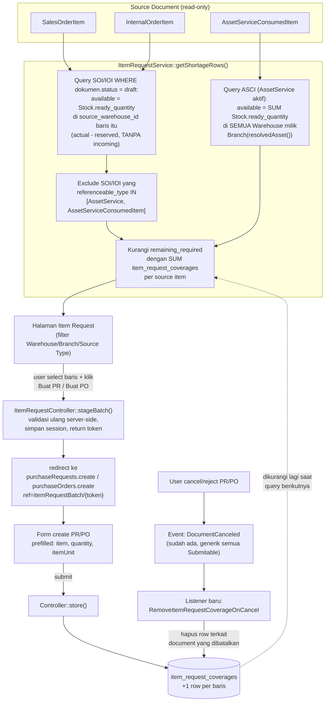

# Design Document: Item Request Auto-Detect

## Overview

Fitur ini TIDAK memperkenalkan tabel "shortage" tersendiri — daftar Item Request dihitung **on-demand** (query, bukan materialized) dari tiga Source Document yang sudah ada: `SalesOrderItem`, `InternalOrderItem`, `AssetServiceConsumedItem`. Satu-satunya tabel baru adalah `item_request_coverages`, log yang mencatat "quantity berapa dari baris Source Document X sudah di-cover oleh baris PR/PO Y" — dipakai untuk mengurangi shortage yang ditampilkan tanpa mengubah struktur `SalesOrderItem`/`InternalOrderItem`/`AssetServiceConsumedItem` sama sekali.

**Premis inti (kritis, ditemukan saat riset):** `SalesOrderService`/`InternalOrderService` memblokir submit dengan `DB::rollBack()` + `ValidationException` kalau `Stock.ready_quantity` kurang dari kebutuhan baris manapun — jadi dokumen yang kekurangan stock **tidak pernah mencapai status `submitted`**, tetap `draft` selamanya. Karena itu Source Document SO/IO yang relevan untuk fitur ini adalah yang berstatus **`draft`** (dokumen yang gagal/akan gagal submit), BUKAN yang sudah `submitted`. `AssetServiceConsumedItem` beda cerita — Work Order tidak pernah cek stock sendiri (lihat bagian AssetService di bawah), jadi filter status draft tidak relevan untuk source ini; yang dicek adalah AssetService yang masih aktif (belum `completed`/`canceled`).

Pola "create dari referensi" (`ref=type/id` di `PurchaseRequestController::create()`/`PurchaseOrderController::create()`) sudah ada dan dipakai ulang — di-extend dengan satu case baru (`itemRequestBatch`) untuk menangani multi-select lintas banyak Source Document sekaligus (kasus existing `ref=workOrder/{id}` cuma menangani SATU parent, sedangkan user Item Request bisa pilih baris dari banyak dokumen berbeda dalam satu klik).

**Yang TIDAK berubah:** struktur `SalesOrderItem`, `InternalOrderItem`, `AssetServiceConsumedItem`, `AssetService`, `Stock`, `StockReservationChanged`/`UpdateStockReservation` — semua dipakai apa adanya, read-only dari sudut pandang fitur ini.

## Architecture



### Data Flow (narasi)

1. User buka halaman Item Request, filter Warehouse/Branch/Source Type.
2. `ItemRequestService::getShortageRows()` menjalankan dua query terpisah — SO/IO **berstatus `draft`** (warehouse-spesifik), AssetService **aktif** (branch-agregat) — gabungkan hasilnya, kurangi tiap baris dengan total `item_request_coverages` yang masih berlaku (join ke PR/PO yang belum `canceled`/`rejected`), buang baris dengan `shortage_quantity <= 0`.
3. User centang beberapa baris (bisa campur dari SO, IO, AssetService berbeda), klik **Buat PR** atau **Buat PO**.
4. FE POST ke `ItemRequestController::stageBatch()` dengan payload baris terpilih. Server **validasi ulang** shortage tiap baris (mencegah race condition/tampering client), simpan payload tervalidasi ke session dengan token ULID single-use, redirect ke halaman create dengan `ref=itemRequestBatch/{token}`.
5. `PurchaseRequestController::create()`/`PurchaseOrderController::create()` — case baru `itemRequestBatch` baca token dari session (sekali pakai, langsung dihapus), bangun `defaultData['items']` persis pola case `workOrder`/`purchaseRequest` yang sudah ada.
6. User submit form PR/PO seperti biasa. Setelah `store()` sukses, untuk tiap baris yang `referenceable_type`/`referenceable_id`-nya mengarah ke Source Document (SOI/IOI/ASCI), insert satu baris `item_request_coverages`.
7. Baris shortage yang sudah fully covered otomatis hilang dari query berikutnya (langkah 2) — tanpa perlu flag "hidden" eksplisit, karena murni hasil pengurangan angka.
8. Kalau PR/PO itu di-cancel/reject kemudian, listener pada event `DocumentCanceled` (sudah ada, generik) menghapus baris `item_request_coverages` terkait — baris shortage otomatis muncul lagi.

## Components and Interfaces

### `App\Services\Purchase\ItemRequestService` (baru)

```php
class ItemRequestService {
    /** @return Collection<ItemRequestRow DTO> */
    public function getShortageRows(array $filters): Collection {
        // $filters: warehouse_ids[], branch_ids[], source_types[] (subset dari
        // ['sales_order', 'internal_order', 'asset_service'])
    }

    /**
     * Validasi ulang tiap selection terhadap shortage TERKINI (bukan percaya
     * angka dari client), simpan ke session, return token.
     * @param  array<array{source_type:string, source_id:string, quantity:float}>  $selections
     */
    public function stageBatch(array $selections): string { /* return $token */ }

    /** Dipanggil dari Controller::create() case 'itemRequestBatch'. Single-use — session key dihapus setelah dibaca. */
    public function resolveBatch(string $token): array { /* return defaultData['items'] */ }

    /** Dipanggil dari PurchaseRequestService/PurchaseOrderService setelah store() sukses. */
    public function recordCoverage(Model $coveringItem, string $sourceType, string $sourceId, float $quantity): void {}
}
```

### `App\Http\Controllers\Purchase\ItemRequestController` (baru)

- `index(Request $request)` — `Inertia::render('Purchase/ItemRequests/Index')`. **[KOREKSI saat implementasi — ASUMSI semula SALAH]** `Model::dataTable()` (macro di `DataTableScope::addDataTable()`) TERNYATA sangat spesifik untuk 1 Eloquent Builder fisik: column-pruning berbasis cookie (`DataTableColumnSelector`), integrasi `SavedFilter`, branch scope, resolusi `templateLink` rekursif, `with()` relasi dinamis. `getShortageRows()` adalah UNION dari 3 tabel berstruktur beda (SalesOrderItem/InternalOrderItem/AssetServiceConsumedItem) — TIDAK bisa & TIDAK BOLEH dipaksa masuk mekanisme itu. `index()` SHALL mengirim response custom sederhana: `Illuminate\Pagination\LengthAwarePaginator` manual yang membungkus hasil `getShortageRows()` (filter dulu, baru `forPage()` + `count()`), bukan lewat macro `dataTable()`. FE Index page SHALL jadi komponen custom (tabel + filter dasar), BUKAN reuse komponen `<DataTable>`/`Table2` generik yang bergantung pada shape macro itu — merevisi NFR3 (lihat requirements.md).
- `stageBatch(Request $request)` — validasi payload, panggil `ItemRequestService::stageBatch()`, redirect ke `route('purchaseRequests.create', ['ref' => "itemRequestBatch/{$token}"])` atau padanan `purchaseOrders.create` tergantung tombol yang diklik.

### Extend `PurchaseRequestController::create()` & `PurchaseOrderController::create()`

Tambah satu `case 'itemRequestBatch':` di switch `$modelOri` yang sudah ada (sejajar dengan case `workOrder`, `purchaseRequest`, `assetService` existing), memanggil `ItemRequestService::resolveBatch($split[1])` untuk mengisi `$defaultData['items']`. Format tiap item mengikuti pola case `workOrder` yang sudah ada:

```php
case 'itemRequestBatch':
    $defaultData = ['items' => app(ItemRequestService::class)->resolveBatch($split[1])];
    break;
```

Tiap baris item di `resolveBatch()` diberi `referenceable_type`/`referenceable_id` mengarah ke Source Document ASLI (`SalesOrderItem`, `InternalOrderItem`, atau `AssetServiceConsumedItem`) — bukan ke `AssetService` header — supaya `recordCoverage()` setelah submit tahu persis baris mana yang harus dikurangi.

### Extend `PurchaseRequestService`/`PurchaseOrderService`

Setelah dokumen berhasil dibuat (`onCreated()` atau titik setara existing), untuk tiap item yang punya `referenceable_type` termasuk salah satu dari 3 Source Document, panggil `ItemRequestService::recordCoverage()`.

### Restore coverage saat cancel — **[KOREKSI saat implementasi: TIDAK PAKAI listener/event]**

Rencana awal (listener pada event `DocumentCanceled`) DIBATALKAN setelah verifikasi kode: `DocumentCanceled` **kondisional** — `Submitable::bootSubmitable()` hanya `event(new DocumentCanceled(...))` kalau `$model->approvalable` ada, dan `ApprovalInstance::makeInstance()` (`app/Models/Core/ApprovalInstance.php` baris 78-82) **return `null` kalau tidak ada `ApprovalScheme` aktif** untuk model+trigger itu. Artinya event ini TIDAK PERNAH terpicu untuk PurchaseRequest/PurchaseOrder yang dibatalkan tanpa approval scheme dikonfigurasi — listener di atasnya jadi gak reliable.

**Solusi yang benar-benar dipakai — TIDAK BUTUH listener sama sekali**: `ItemRequestService::isCoveringActive()` (dipanggil dari `coveredQuantityMap()`, jadi bagian dari `getShortageRows()`) sudah mengecek status covering document **live** setiap kali dipanggil — bukan nilai ter-cache. Begitu `PurchaseRequest`/`PurchaseOrder` berubah status jadi `canceled`/`rejected` (lewat `PurchaseRequestService::cancel()`/`PurchaseOrderService::cancel()` yang sudah ada), panggilan `getShortageRows()` BERIKUTNYA otomatis mengecualikan coverage itu dari SUM — baris shortage muncul lagi TANPA perlu menghapus row `item_request_coverages` apa pun. Property 3 (§Correctness Properties) TERBUKTI valid lewat mekanisme ini, sudah divalidasi test (`coverage_from_a_canceled_purchase_request_is_ignored`, Task 3.5) — bukan lewat listener/deletion.

Row `item_request_coverages` yang covering-nya sudah lama canceled TETAP ada di database (bukan dihapus) — murni soal data hygiene jangka panjang (row menumpuk), BUKAN soal correctness. Kalau nanti volume jadi masalah, cleanup job terpisah (scheduled command) bisa ditambah — di luar scope v1 (lihat Out of Scope requirements.md).

## Data Models

### Migration baru: `create_item_request_coverages_table`

Mengikuti konvensi migration project (lihat `create_purchase_request_items_table`, `create_sales_order_items_table`): ULID primary, `nullableUlidMorphs` untuk relasi polymorphic, `softDeletes()`.

```php
Schema::create('item_request_coverages', function (Blueprint $table) {
    $table->ulid('id')->primary();
    $table->nullableUlidMorphs('source');    // SalesOrderItem | InternalOrderItem | AssetServiceConsumedItem
    $table->nullableUlidMorphs('covering');  // PurchaseRequestItem | PurchaseOrderItem
    $table->double('quantity_covered')->default(0);
    $table->foreignUlid('created_by_id')->nullable()->references('id')->on('users')->nullOnDelete();
    $table->timestamps();
    $table->softDeletes();

    $table->index(['source_type', 'source_id']); // query "total covered per source item"
});
```

### Model baru: `App\Models\Purchase\ItemRequestCoverage`

```php
class ItemRequestCoverage extends Model {
    use HasUlids, SoftDeletes;
    protected $guarded = ['id'];
    protected $casts = ['quantity_covered' => 'float'];

    public function source(): MorphTo { return $this->morphTo(); }
    public function covering(): MorphTo { return $this->morphTo(); }
}
```

### DTO baris shortage (hasil query, BUKAN Eloquent model — union dari 3 Source Document)

| Field | Asal |
|---|---|
| `source_type`, `source_id` | `SalesOrderItem` \| `InternalOrderItem` \| `AssetServiceConsumedItem` |
| `item_variant_id`, `item_name` | `item()` relasi Source Document |
| `warehouse_id`(s), `warehouse_name`(s) | SO/IO: 1 warehouse (`source_warehouse_id`). AssetService: banyak warehouse (semua milik Branch hasil resolusi) |
| `branch_id`, `branch_name` | SO/IO: dari dokumen induk. AssetService: `resolvedAsset()->branch()` |
| `required_quantity` | SO/IO: `quantity` baris (dokumen masih `draft` — `undelivered_quantity` belum bermakna, belum ada delivery). AssetService: `quantity` (tidak ada tracking delivered di ASCI) |
| `covered_quantity` | `SUM item_request_coverages.quantity_covered WHERE source match AND covering.status NOT IN [canceled, rejected]` |
| `available_quantity` | Formula di bawah |
| `shortage_quantity` | `max(0, (required_quantity - covered_quantity) - available_quantity)` |

**Filter status Source Document:**
- SO/IO: HANYA dokumen induk berstatus `draft` (`FormStatus::DRAFT`) — dokumen `submitted` dipastikan TIDAK shortage saat submit-nya lolos (validasi block sudah menjamin itu); shortage baru pada dokumen submitted (mis. stock diserobot dokumen lain belakangan) di luar scope v1, lihat Out of Scope. **Catatan teknis [KOREKSI saat implementasi]**: kolom `status` di `sales_orders`/`internal_orders` adalah JSON array (multi-status), bukan enum tunggal. `SalesOrderService` existing pakai `whereRaw('json_overlaps(status, ?)', ...)`, TAPI `json_overlaps` adalah fungsi MySQL-only — TIDAK tersedia di SQLite (`no such function: json_overlaps`, diverifikasi empiris lewat test probe saat implementasi), yang dipakai test suite project ini (`phpunit.xml` → `DB_CONNECTION=sqlite`, `:memory:`). Baris itu di kode existing adalah **bug laten tak-tertest** (lolos karena tidak ada test SQLite yang mengeksekusi jalur itu). `ItemRequestService` (kode baru) SHALL pakai `whereJsonContains('status', FormStatus::DRAFT->value)` — helper Laravel native, cross-database (MySQL/PostgreSQL/SQLite), semantik identik untuk kasus "array JSON mengandung 1 value ini".
- AssetServiceConsumedItem: AssetService induk berstatus aktif (bukan `completed`/`canceled`) — tidak ada dependensi ke status draft/submit karena Work Order memang tidak submit-block terhadap stock.

**Formula `available_quantity`** — HARUS identik dengan kriteria validasi submit di `SalesOrderService`/`InternalOrderService` (`$stock->ready_quantity < $quantity`), supaya baris yang hilang dari Item Request benar-benar berarti "SO/IO ini sekarang bisa disubmit":
- SO/IO: `Stock.ready_quantity` (`actual_quantity - reserved_quantity`, generated column — lihat `database/migrations/2025_03_12_061639_create_stocks_table.php`) pada `(item_variant_id, source_warehouse_id)`. **BUKAN** `projected_quantity` — itu ikut menghitung `incoming_quantity` (PO belum diterima), yang tidak dianggap "tersedia" oleh validasi submit yang sebenarnya.
- AssetServiceConsumedItem: `SUM Stock.ready_quantity` pada `(item_variant_id, warehouse_id)` untuk SEMUA `warehouse_id` di mana `Warehouse.branch_id = AssetService->resolvedAsset()->branch()->id`.

## Correctness Properties

**Property 1 — Shortage tidak pernah negatif.**
_For any_ baris Source Document, `shortage_quantity` SHALL selalu `>= 0` (di-clamp, bukan boleh minus).

**Property 2 — Baris hilang setelah fully covered.**
_For any_ baris dengan `shortage_quantity_awal = S`, WHEN total `covered_quantity` (dari PR/PO berstatus non-cancelled) mencapai/lebihi `required_quantity - available_quantity`, THE baris tersebut SHALL tidak muncul lagi di `getShortageRows()`.
**Validates:** Requirement 4.2

**Property 3 — Coverage dikembalikan saat cancel.**
_For any_ `item_request_coverages` row yang `covering` mengarah ke item PR/PO yang dokumennya di-cancel/reject, THE row tersebut SHALL dihapus (atau di-exclude dari SUM), sehingga baris shortage terkait muncul kembali dengan `covered_quantity` yang sudah dikurangi.
**Validates:** Requirement 4.5

**Property 4 — Tidak ada double-count AssetService.**
_For any_ `SalesOrderItem`/`InternalOrderItem` dengan `referenceable_type IN [AssetService::class, AssetServiceConsumedItem::class]`, baris tersebut SHALL tidak pernah muncul sebagai Source Document terpisah di `getShortageRows()`.
**Validates:** Requirement 1.5

## Error Handling

| Scenario | Behavior |
|---|---|
| `stageBatch()` menerima quantity > shortage terkini (race condition: user lain sudah cover duluan sejak halaman di-load) | Validasi ulang server-side terhadap `getShortageRows()` real-time; kalau quantity diminta melebihi shortage aktual, clamp ke shortage aktual dan kembalikan warning ke FE (bukan 422 keras — biar user tetap bisa lanjut dengan quantity yang sudah disesuaikan) |
| Token batch di `ref=itemRequestBatch/{token}` sudah dipakai/expired/tidak ditemukan saat `create()` dipanggil | Fallback ke `create()` kosong normal (tanpa prefill) — jangan 500, jangan blank page |
| `AssetService->resolvedAsset()` return `null` (data tidak lengkap) | Baris `AssetServiceConsumedItem` terkait di-skip dari hasil query (tidak bisa hitung shortage tanpa Asset/Branch), bukan error fatal |
| Branch hasil resolusi AssetService tidak punya Warehouse sama sekali | `available_quantity = 0` — seluruh `quantity` dianggap shortage |

## Testing Strategy

- **Unit test** `ItemRequestService::getShortageRows()`: kombinasi Stock cukup/kurang, multi-warehouse per Branch (AssetService), baris SO/IO yang di-exclude karena `referenceable_type` AssetService.
- **Unit test** formula `available_quantity` kedua varian (warehouse-spesifik vs branch-agregat).
- **Feature test** alur penuh: `stageBatch()` → redirect dengan token → `create()` prefill benar → `store()` → assert `item_request_coverages` tercatat → baris hilang dari `getShortageRows()` panggilan berikutnya.
- **Feature test** cancel PR/PO yang barusan dibuat dari Item Request → assert baris shortage muncul lagi dengan `covered_quantity` terkoreksi (Property 3).
- **Feature test** race condition: dua `stageBatch()` berurutan dari baris shortage yang sama, quantity gabungan melebihi shortage awal → request kedua ter-clamp.
- **Regression:** `SalesOrderRequest`/`InternalOrderRequest`/`PurchaseRequestController`/`PurchaseOrderController` test existing tetap lulus tanpa perubahan (case baru di switch tidak mengubah case lain).
