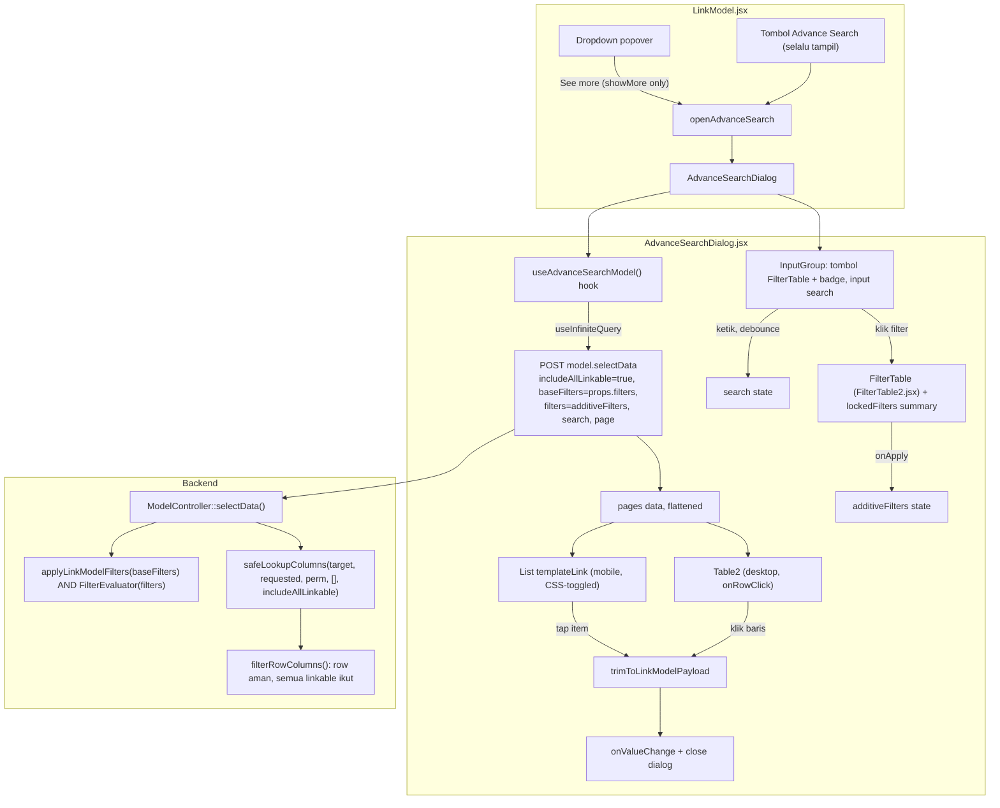

# Design Document: LinkModel Advanced Search

## Overview

Dialog "Advance Search / See More" untuk `LinkModel.jsx`, dipicu dari dua entry point independen (Requirement 1). Dialog menampilkan hasil browse model target dalam tabel (desktop) / list (mobile) dengan infinite scroll, kolom dibatasi ke kolom aman LinkModel (bukan raw schema seperti `SelectModel`), filter tambahan lewat `FilterTable` (`FilterTable2.jsx`) yang juga menampilkan filter dasar (`filters` prop) secara read-only, dan payload seleksi yang tetap dipangkas sesuai kontrak `fields` yang ada sekarang.

Pattern utama: **reuse maksimal, extend minimal**. Semua building block sudah ada di codebase (`Table2`, `FilterTable2`/`FilterBuilder`, `linkModelToFilterTree`, `ColumnsFilter`, `InputGroup`, TanStack Query). Yang baru hanya:
- 2 file baru: dialog orchestrator + hook fetch (infinite scroll + kolom aman lengkap).
- 3 extension kecil (opt-in, backward-compatible) ke komponen shared: `Table2` (`onRowClick`), `ColumnsFilter` (`locked` per-kolom), `FilterTable2`/`FilterTableContent` (`lockedFilters` — summary read-only).
- 1 perubahan backend: `ModelController::selectData()` thread param `includeAllLinkable` ke `safeLookupColumns()` (parameter itu SUDAH ADA di signature, cuma belum pernah diisi `true` dari jalur ini — `__invoke()` sudah mengisinya utk `cacheMode`).

**Yang TIDAK berubah**: dropdown utama LinkModel (Tab-autocomplete, exact-match on close, `ADD_VALUE`), `SelectModel`/`useSelectModel.js` (pola berbeda, dipakai sbg referensi visual saja), `Table/FilterTable.jsx` legacy (tidak disentuh), skema `linkable`/`visibleFor` itu sendiri.

## Architecture



### Data Flow

1. User klik "See more" (kondisional) atau tombol "Advance Search" (selalu ada) → `LinkModel.jsx` set `open=false`, `openAdvanceSearch=true`, teruskan `search` (state lokal LinkModel saat ini) sebagai `initialSearch` ke `AdvanceSearchDialog`.
2. `AdvanceSearchDialog` mount → `useAdvanceSearchModel` fetch halaman pertama via `useInfiniteQuery` ke `model.selectData` dengan `includeAllLinkable: true`, `baseFilters: props.filters` (dikirim APA ADANYA, tree `LinkModelFilterTree`, sama seperti `SelectModel`), `filters: additiveFilters` (tree `FilterBuilder`, dari `FilterTable`), `search`, `page`.
3. Response `{ columns, data: { data, current_page, last_page, total } }` — `columns` dipakai bangun `columnMap` (filter ke kolom aman, lihat §Components), `data.data` di-append ke daftar akumulasi (infinite scroll).
4. Scroll mendekati baris terakhir → sentinel intersect → `fetchNextPage()`.
5. User klik baris/item → ambil row penuh (SEMUA kolom linkable, hasil browse) → **pangkas** ke bentuk payload dropdown biasa (Requirement 7) → `onValueChange` → tutup dialog.
6. Filter: `additiveFilters` (state lokal dialog, tree `FilterBuilder`) dikirim sbg `filters`; `props.filters` (non-editable) dikirim sbg `baseFilters` — backend sudah AND keduanya (`applyLinkModelFilters` + `FilterEvaluator`, dua `$query->where()` terpisah, lihat `ModelController::selectData` — TIDAK perlu perubahan backend utk pengabungan ini, sudah begitu adanya).

## Components and Interfaces

### 1. `resources/js/Components/LinkModel.jsx` (modifikasi)

- State baru: `openAdvanceSearch` (boolean).
- Baris `MORE_VALUE` `onSelect`: isi `setOpen(false); setOpenAdvanceSearch(true);` (Requirement 1 AC1, 1 AC5).
- Tombol baru "Advance Search" — selalu dirender (Requirement 1 AC3), disembunyikan bareng dropdown saat `disabled`/`readOnly` (AC4). Ditaruh berdekatan dgn tombol X/navigasi yang sudah ada di dalam trigger.
- Render `<AdvanceSearchDialog>` (lazy — hanya mount logic berat saat `openAdvanceSearch` true, `Dialog` dari shadcn sudah unmount content saat closed by default) dengan props: `model`, `filters` (diteruskan APA ADANYA, non-editable), `fields`, `joins`, `with`, `translate`, `order`, `initialSearch={search}` (state `search` LinkModel saat ini, Requirement 6), `onSelect={(row) => { setOption(row); setOpenAdvanceSearch(false); }}`, `open={openAdvanceSearch}`, `onOpenChange={setOpenAdvanceSearch}`.
  > Pemangkasan payload (Requirement 7 / `trimToLinkModelPayload`) TERJADI DI DALAM `AdvanceSearchDialog` (§2, `handlePick`) — BUKAN di `onSelect` LinkModel.jsx ini. `LinkModel.jsx` tidak punya akses ke `templateLinkColumnNames` (state internal hook §3), jadi `onSelect` di sini murni penerima row yang SUDAH terpangkas.

### 2. `resources/js/Components/LinkModel/AdvanceSearchDialog.jsx` (BARU)

Orkestrator dialog. Struktur mengikuti `SelectModel.jsx` (Dialog/DialogContent/TooltipProvider) tapi single-select langsung-commit (bukan checkbox+tombol konfirmasi).

```jsx
export default function AdvanceSearchDialog({
  open, onOpenChange, model, filters, fields, joins, with: withParam,
  translate, order, initialSearch, onSelect, titleDialog,
}) {
  const [search, setSearch] = useState(initialSearch ?? "");
  const [additiveFilters, setAdditiveFilters] = useState(null); // tree FilterBuilder

  // Reset search ke initialSearch tiap kali dialog DIBUKA (Requirement 6 AC3)
  useEffect(() => { if (open) setSearch(initialSearch ?? ""); }, [open]);

  const { columnMap, filterColumnMap, lockedColumnNames, rows, isLoading, isFetchingNextPage,
          hasNextPage, fetchNextPage, total } =
    useAdvanceSearchModel({ model, baseFilters: filters, additiveFilters, search, joins, with: withParam, order, translate, open });

  const activeAdditiveCount = useMemo(
    () => flattenFilters(additiveFilters?.root?.c ?? {}).length,
    [additiveFilters],
  );

  const handlePick = (row) => {
    onSelect(trimToLinkModelPayload(row, { fields, templateLinkColumnNames: lockedColumnNames }));
  };

  return (
    <Dialog open={open} onOpenChange={onOpenChange}>
      <DialogContent className="max-w-(--breakpoint-2xl)! w-auto! p-0">
        <DialogHeader className="px-6 pt-6">
          <DialogTitle>{titleDialog ?? t("core.form.linkmodel.advance_search")}</DialogTitle>
        </DialogHeader>
        <div className="px-6">
          <InputGroup>
            <InputGroupAddon align="inline-start">
              <FilterTable
                columns={filterColumnMap}        // <- SEMUA kolom schema, BUKAN columnMap (lihat catatan filterColumnMap)
                initialFilters={additiveFilters}
                lockedFilters={filters}          // <- extension baru, read-only summary
                onApply={setAdditiveFilters}
                model={model}
                asChild
              >
                <InputGroupButton variant={activeAdditiveCount > 0 ? "secondary" : "ghost"}>
                  <Filter />
                  {activeAdditiveCount > 0 && <Badge>{activeAdditiveCount}</Badge>}
                </InputGroupButton>
              </FilterTable>
            </InputGroupAddon>
            <InputGroupInput value={search} onChange={(e) => setSearch(e.target.value)} placeholder={t("core.form.search")} />
          </InputGroup>
        </div>

        {/* Desktop */}
        <div className="hidden lg:block px-6">
          <Table2
            columns={columnMap}
            data={rows}
            isLoading={isLoading}
            isDynamicData
            persistColumns={false}
            onRowClick={handlePick}           // <- extension baru di Table2
          />
          <InfiniteScrollSentinel onIntersect={fetchNextPage} enabled={hasNextPage} loading={isFetchingNextPage} />
        </div>

        {/* Mobile */}
        <div className="lg:hidden flex flex-col px-6">
          {rows.map((row) => (
            <button key={row.id} onClick={() => handlePick(row)} className="text-left py-2 border-b">
              <span dangerouslySetInnerHTML={{ __html: convertTemplateLink(row) }} />
            </button>
          ))}
          <InfiniteScrollSentinel onIntersect={fetchNextPage} enabled={hasNextPage} loading={isFetchingNextPage} />
        </div>
      </DialogContent>
    </Dialog>
  );
}
```

Catatan implementasi:
- `FilterTable` dipakai dengan prop baru `trigger={<InputGroupButton>...}` (Requirement 4 AC2: tombol filter DI DALAM `InputGroup`, di kiri). **Resolusi verifikasi** (sempat ditandai "perlu dicek" — sudah dikonfirmasi & diimplementasi task 8.1): `FilterTable` TERNYATA tidak menerima children/custom trigger sama sekali (hardcode Button/div sendiri, tidak ada slot). Ditambah prop opsional `trigger?: ReactNode` — saat diisi, `AlertDialogTrigger asChild` merender `trigger` alih-alih Button bawaan; badge count jadi tanggung jawab konsumen (dihitung sendiri dari `additiveFilters`, BUKAN dari `activeCount` internal `FilterTable` yang hanya dipakai jalur trigger bawaan).
- `InfiniteScrollSentinel` — komponen kecil baru (bukan reuse `useInViewport` langsung, lihat §4) diletakkan di baris terakhir, memicu `fetchNextPage()`.
- **`filterColumnMap` ≠ `columnMap`** (koreksi pasca-implementasi): `columnMap` (tabel) tetap linkable-gated — itu yang menentukan kolom yang di-SELECT & tampil. Tapi kolom FilterTable memakai `filterColumnMap` = SEMUA kolom schema mentah, karena backend mengevaluasi `filters` terhadap schema penuh (`$target::getColumns(1)` di `ModelController::selectData()`, `FilterEvaluator($columns)`) — gate `linkable` tak pernah membatasi kolom yang boleh difilter, jadi membatasinya di FE cuma memangkas UX. `FilterItem2` sendiri sudah menyaring `searchable===false`/`hidden`/`ignore`/`parentCol`. Preseden: `SelectModel` (`buildColumnMap`) juga tidak men-gate kolom filter dgn linkable. Catatan keamanan: efek samping (pre-existing di level API, sekarang terlihat di UI) — kolom bergate `visibleFor` bisa dipakai sbg kriteria filter walau nilainya tak ditampilkan (oracle), lihat task 15.

### 3. `resources/js/Components/LinkModel/useAdvanceSearchModel.js` (BARU)

Hook fetch. Reuse `@tanstack/react-query` (`useInfiniteQuery` — sudah dependency, dipakai `useLinkModelOptions.js` via `useQuery`).

```js
export default function useAdvanceSearchModel({
  model, baseFilters, additiveFilters, search, joins, with: withParam, order, translate, open,
}) {
  const [debouncedSearch] = useDebounce(search, 300); // pola sama useLinkModelOptions (500ms; di sini 300ms sesuai Requirement 4 AC6)

  const query = useInfiniteQuery({
    queryKey: ["linkModel", "advanceSearch", model, stableStringify(baseFilters), stableStringify(additiveFilters), debouncedSearch, order],
    queryFn: async ({ pageParam = 1 }) => {
      const res = await axios.post(window.route("model.selectData"), {
        model,
        includeAllLinkable: true,        // <- param baru, lihat §5 Backend
        baseFilters: baseFilters ?? undefined,
        filters: additiveFilters ?? undefined,
        search: debouncedSearch,
        joins, with: withParam, order, translate,
        page: pageParam,
        show: 25,
      });
      return res.data; // { model, route, translateKey, columns, parentColumn, data: {data, current_page, last_page, total} }
    },
    getNextPageParam: (lastPage) =>
      lastPage.data.current_page < lastPage.data.last_page ? lastPage.data.current_page + 1 : undefined,
    enabled: open && !!model,
  });

  const templateLinkColumnNames = query.data?.pages?.[0]?.templateLinkColumns ?? [];
  const columnMap = useMemo(
    () => buildAdvanceSearchColumnMap(query.data?.pages?.[0]?.columns ?? [], templateLinkColumnNames),
    [query.data],
  );
  // Kolom FILTER: semua kolom schema (bukan linkable-gated seperti columnMap tabel).
  const filterColumnMap = useMemo(
    () => buildAdvanceSearchFilterColumnMap(query.data?.pages?.[0]?.columns),
    [query.data],
  );
  const rows = useMemo(() => (query.data?.pages ?? []).flatMap((p) => p.data.data), [query.data]);
  const total = query.data?.pages?.[0]?.data.total ?? 0;

  return {
    columnMap, filterColumnMap, lockedColumnNames: templateLinkColumnNames, rows, total,
    isLoading: query.isPending,
    isFetchingNextPage: query.isFetchingNextPage,
    hasNextPage: query.hasNextPage,
    fetchNextPage: query.fetchNextPage,
  };
}
```

`buildAdvanceSearchColumnMap(rawColumns, templateLinkColumnNames)` — pure function, TIDAK butuh request tambahan (kolom aman sudah didapat lewat filter di atas `rawColumns` yang dikembalikan `selectData()`; ingat: `selectData()` TIDAK menggating metadata `columns` — jadi fungsi ini yang melakukan gating client-side utk TUJUAN TAMPILAN column-picker saja, bukan keamanan data). `templateLinkColumnNames` datang langsung dari field response `templateLinkColumns` (§5, Opsi B) — bukan heuristik:

```js
export function buildAdvanceSearchColumnMap(rawColumns, templateLinkColumnNames = []) {
  const isTemplateLinkSource = (c) => templateLinkColumnNames.includes(c.name);
  return rawColumns
    .filter((c) => !c.hidden && !c.ignore && c.type !== "relations" && c.type !== "mixed" && c.type !== "json")
    .filter((c) => c.linkable === true || isTemplateLinkSource(c)) // Requirement 2 AC3/AC6
    .map((c) => ({ ...c, locked: isTemplateLinkSource(c), show: c.show ?? isTemplateLinkSource(c) }));
}
```

> ⚠️ **Klarifikasi keamanan penting**: filter `linkable === true` di atas HANYA mengontrol kolom mana yang jadi HEADER TABEL (UX). Keamanan sesungguhnya (kolom mana yang benar-benar berisi data, bukan `undefined`/kosong) ditentukan SERVER via `filterRowColumns()` + `safeLookupColumns($includeAllLinkable=true)` — jadi walau FE salah hitung filter ini, row data tetap tidak pernah bocor kolom non-`linkable` (fail-safe berlapis, sama prinsip `linkmodel-column-security`).

### 4. `resources/js/Components/LinkModel/trimToLinkModelPayload.js` (BARU, pure function)

Implementasi Requirement 7.

```js
export function trimToLinkModelPayload(row, { fields, templateLinkColumnNames }) {
  const allowed = new Set([
    "id", "route", "canDelete", "canUpdate", "keyModel", "appendStatus",
    "thisModel", "templateLink", "disabledOn",
    ...(templateLinkColumnNames ?? []),
    ...(fields ?? []),
  ]);
  return Object.fromEntries(Object.entries(row).filter(([k]) => allowed.has(k)));
}
```

Unit-testable murni (tanpa render) — kandidat test prioritas utama sesuai konvensi testing FE project ini.

### 5. Backend: `app/Http/Controllers/ModelController.php` — `selectData()`

> ⚠️ **Revisi pasca-implementasi**: draft awal desain ini ("satu baris", cuma thread param ke `safeLookupColumns()`) TERBUKTI TIDAK CUKUP saat dijalankan lewat PHPUnit — lihat kotak di bawah. Bagian ini sudah diperbarui mengikuti fix yang benar-benar dipakai.

`safeLookupColumns()` (`ModelController.php:163`) sudah menerima parameter `$includeAllLinkable` (dipakai `__invoke()` utk `cacheMode`) — method itu sendiri TIDAK diubah. Yang diubah: `selectData()` men-thread `$request->boolean('includeAllLinkable')` ke situ, PLUS (temuan implementasi) reorder + `addSelect()` eksplisit:

```php
$includeAllLinkable = $request->boolean('includeAllLinkable');
$safe               = $this->safeLookupColumns($target, $requested, $perm, [], $includeAllLinkable);
// ...
if ($includeAllLinkable) {
    $targetTable = (new $target)->getTable();
    $extraSelect = [];
    foreach (array_keys($safe) as $name) {
        if (in_array($name, self::ALWAYS_ALLOWED_ATTRIBUTES, true)) continue; // computed attr, bukan kolom DB
        if (in_array($columns[$name]['type'] ?? null, ['relation', 'relations'], true)) continue;
        $extraSelect[] = "{$targetTable}.{$name}";
    }
    if ($extraSelect !== []) $query->addSelect($extraSelect);
}
$result = $query->dataTable($request, $showedColumns); // macro dipanggil SETELAH addSelect di atas
```

> **Gap yang ketauan cuma lewat test run sungguhan, bukan review kode statis**: `dataTable()` (macro Eloquent, didaftarkan `DataTableScope::addDataTable()`) punya adaptive-select-nya SENDIRI — `DataTableColumnSelector::safeColumnsFromVisible($dataTableColumns, $visibleKeys, $extraKeys)`, di mana `$visibleKeys` berasal MURNI dari cookie `datatable_columns_<path>` (fallback ke `col.show===true` bila tak ada cookie). Macro ini SAMA SEKALI TIDAK TAHU soal flag `linkable` — dia didesain utk UI DataTable klasik (toggle kolom + persist via cookie), bukan utk gate keamanan LinkModel. Parameter `$showedColumns` yang dioper ke macro ini bahkan TIDAK PERNAH DIBACA di dalam closure-nya (dead parameter) — jadi kolom hasil query `columns`/`fields` TIDAK otomatis memengaruhi SQL SELECT lewat jalur itu.
>
> Akibatnya: `filterRowColumns()` (row-level, jalan SETELAH `dataTable()` selesai fetch) cuma bisa MEMANGKAS kolom yang SUDAH ter-`SELECT` — tidak bisa memunculkan kolom yang tak pernah diminta ke DB. `safeLookupColumns($includeAllLinkable=true)` doang, TANPA `addSelect()` eksplisit di atas, bikin kolom linkable yang gak kebetulan `show:true`/ada di cookie tetap `null` di response (dibuktikan test gagal saat pertama kali dicoba, root-cause ditelusuri sampai `DataTableScope.php:184` sebelum fix ditulis).
>
> Fix: `addSelect()` eksplisit SEBELUM `dataTable()` dipanggil — ADDITIVE (bukan `select()` yang replace), pola SAMA seperti `addSelect` FK `parentColumn` yang SUDAH ADA beberapa baris di atasnya di method yang sama (komentar existing: "addSelect akumulatif dgn macro"). Macro tetap menambah select-nya sendiri di atas tanpa konflik. Dua kategori key `$safe` DIKECUALIKAN dari `addSelect` (bukan kolom DB): `ALWAYS_ALLOWED_ATTRIBUTES` (computed/appended Eloquent attribute) dan relasi (`type` relation/relations, ditangani `with`, bukan SELECT).

Konsekuensi akhir (sama seperti draft awal, cuma jalur teknisnya beda): saat `includeAllLinkable=true`, SEMUA kolom `linkable===true` (scalar, non-relasi) benar-benar berisi data di response, tanpa perlu ada di `$requested` (`columns`/`fields`) — persis kebutuhan Requirement 2 AC3. Saat `includeAllLinkable` absen/`false` (SEMUA caller existing — `SelectModel`, dst), TIDAK ADA `addSelect` tambahan dipanggil sama sekali → SQL SELECT identik 1:1 dgn sebelum perubahan ini.

**Kolom sumber templateLink dari sisi backend** — untuk `isTemplateLinkSource()` FE (§3), dua opsi dipertimbangkan:
- **Opsi A (DITOLAK)**: backend tidak berubah, FE menghitung ulang nama kolom templateLink dari string template secara heuristik. Tidak feasible — `$model::templateLink()` (string mentah) tidak pernah dikirim ke client lewat endpoint manapun, tidak ada bahan utk heuristik itu.
- **Opsi B (DIPILIH — keputusan user)**: `selectData()` menyertakan field baru `templateLinkColumns: string[]` di response top-level, hasil pemanggilan method PRIVATE yang SUDAH ADA `templateLinkColumns($target)` (`ModelController.php:132`) — method itu sendiri TIDAK diubah (tetap private, tetap logic sama), hanya ditambah satu call-site baru dari dalam `selectData()`.

  ```php
  return response()->json([
      'model' => $target,
      'route' => ...,
      'translateKey' => ...,
      'columns' => $columns,
      'templateLinkColumns' => $this->templateLinkColumns($target), // BARU
      'parentColumn' => $parentColumn,
      'data' => $paginated,
  ]);
  ```

  Field ini metadata struktural (nama kolom yang membentuk label tampilan), BUKAN data sensitif — aman ikut response tanpa gating permission (senada dgn `columns()` endpoint yang juga tanpa gating, per komentar existing di `ModelController.php:973-979`).

#### Kompatibilitas mundur — diverifikasi (bukan diasumsikan)

Sebelum Opsi B difinalkan, ditelusuri langsung semua pemakai fungsi/endpoint yang tersentuh — bukan cuma dibaca dari nama fungsinya:

| Yang disentuh | Pemakai lain yang ditemukan | Risiko | Status |
|---|---|---|---|
| `templateLinkColumns()` (private method) | **Satu-satunya** call-site existing: `safeLookupColumns()` (`ModelController.php:189`). Tidak dipanggil di tempat lain manapun di `app/`. | Nihil — method itu sendiri (signature, return value, logic) TIDAK diubah sama sekali; hanya ditambah 1 call-site baru yang independen. | ✅ Aman |
| Response `selectData()` (key baru `templateLinkColumns`) | FE: `useSelectModel.js` (destructure `d.model`/`d.columns`/`d.parentColumn`/`d.translateKey`/`d.data`), `SelectModel.jsx` (`loadFromModel`, destructure `res.data?.data?.data` & `res.data?.model`). Keduanya baca property spesifik by-name — key baru yang tak disebut otomatis diabaikan JS, bukan error. | Nihil — tidak ada satupun consumer yang melakukan validasi shape ketat (tidak ada schema/zod, tidak ada `Object.keys(res.data).length` check). | ✅ Aman |
| Response `selectData()` (test PHPUnit) | `tests/Feature/Http/ModelSelectDataTest.php:96` — `assertJsonStructure(['model','route','translateKey','columns','parentColumn','data'=>[...]])`. Laravel `assertJsonStructure` memverifikasi key YANG DISEBUT ada dgn shape benar — TIDAK menolak key tambahan di luar yang disebut (bukan strict/exact match). Tidak ada `assertExactJson` di file ini. | Nihil — test tetap hijau tanpa modifikasi. | ✅ Aman, diverifikasi baca test langsung |
| Request `selectData()` (param baru `includeAllLinkable`) | `$request->boolean('includeAllLinkable')` — default `false` bila key absen di request (perilaku standar Laravel `Request::boolean()`). SEMUA caller existing (`SelectModel`/`useSelectModel.js`, kedua file test di atas, `PurchaseOrderCanUpdateScopeTest.php`) TIDAK PERNAH mengirim field ini. | Nihil — behavior identik 1:1 dgn sebelum perubahan utk semua caller yang sudah ada; hanya jalur BARU (`useAdvanceSearchModel.js`, mengirim `includeAllLinkable:true` eksplisit) yang kena perilaku baru. | ✅ Aman |
| `PurchaseOrderCanUpdateScopeTest.php` (menyebut `selectData` di komentar docblock) | Baca isinya (`:17-20`, `:144-146`) — test itu MEMBAHAS `selectData()` tapi assertion-nya soal `canUpdate`/`disabledOn` tidak boleh muncul di payload, TIDAK assert shape/key lengkap response. `safeLookupColumns()` dgn `$includeAllLinkable` tetap TIDAK memasukkan `visibleFor`-gagal-izin apapun (parameter itu cuma memperluas linkable-branch, gate `visibleFor` di akhir fungsi tetap jalan tanpa syarat) — jadi properti yang divalidasi test ini (canUpdate/disabledOn tak bocor) tidak bisa dilanggar oleh perubahan ini. | Nihil | ✅ Aman, diverifikasi baca kode `safeLookupColumns()` (urutan operasi: linkable-branch dulu, `visibleFor` gate SETELAHNYA & tanpa syarat — lihat `ModelController.php:248-255`) |

**Kesimpulan**: perubahan backend (§5) murni ekstensi non-breaking — dua opt-in baru (`templateLinkColumns` di response, `includeAllLinkable` di request) yang tidak diminta/dikirim caller manapun yang sudah ada.

### 6. `resources/js/Components/Table/Table2.jsx` (extension kecil)

Prop baru opsional `onRowClick?: (row) => void`. Saat diisi:
- Baris `<tr>` (line ~699) dapat `onClick={() => onRowClick(row)}` + `className="cursor-pointer hover:bg-accent/50"`.
- `selectable` (checkbox mode, dipakai `SelectModel`) dan `onRowClick` (klik-langsung, dipakai Advance Search Dialog) bersifat **mutually exclusive di level konsumen** — tidak ada konsumen yang memakai keduanya bersamaan; tidak perlu guard eksplisit di Table2 sendiri (kedua props independen, tidak saling override).
- Default `undefined` → **tidak ada perubahan perilaku untuk semua konsumen Table2 yang sudah ada** (SelectModel, DataTable2, dst).

### 7. `resources/js/Components/Table/ColumnsFilter.jsx` (extension kecil)

Kolom dgn `locked: true` (di-set oleh `buildAdvanceSearchColumnMap`, §3) dirender checkbox `checked disabled` (bukan interaktif), bukan checkbox normal:

```jsx
<FormCheckbox
  checked={locked ? true : show}
  disabled={locked}
  onCheckedChange={locked ? undefined : (val) => { /* ... existing ... */ }}
  label={title ?? t(titleTrans)}
/>
```

Analog dengan exclusion `primaryKey` yang SUDAH ADA di baris yang sama (`if (hidden || ignore || name === primaryKey) return;`) — pola serupa, bukan konsep baru bagi file ini.

### 8. `resources/js/Components/Table/Filter/FilterTable2.jsx` (extension: prop `lockedFilters`)

Prop baru opsional `lockedFilters?: LinkModelFilterTree`. Saat diisi, `FilterTableContent` merender section read-only DI ATAS `<FilterBuilderBody />`:

```jsx
{lockedFilters && (
  <LockedFiltersSummary tree={linkModelToFilterTree(lockedFilters, columns)} columns={columns} />
)}
<FilterBuilderBody />
```

`LockedFiltersSummary` (komponen privat baru di file yang sama, pola sama `SavedFilterBar`/`SaveFilterControl` yang sudah privat di file ini) — walks tree HASIL `linkModelToFilterTree()` (helper existing, reuse penuh — Requirement 5 AC7).

> ⚠️ **Revisi pasca-implementasi**: draft awal ("`NestedSelect`(disabled)+`Select`(disabled)+`ValueField`(disabled)") TERNYATA lebih invasif dari perlu — `ValueField.jsx` TIDAK punya prop `disabled` sama sekali di SEMUA case-nya (Input/Select/LinkModel/DateSelector/dst), jadi "reuse ValueField disabled" butuh menambah prop itu ke setiap case (perubahan lebih besar dari extension minimal yang diinginkan); `NestedSelect` utk kolom kiri juga butuh replikasi `buildColumnNode` (tree kolom rekursif) dari `FilterItem2.jsx`. Diganti implementasi lebih sederhana yang tetap penuhi requirement literalnya: label kolom + operator sbg TEKS statis (`resolveColumn(columns, k)` → `title`/`titleTrans`, reuse existing, bukan NestedSelect interaktif), dan KHUSUS kondisi relasi match-by-id (operator `=`, kolom bertipe relation — inilah satu-satunya kasus yang Requirement 5 AC8 secara eksplisit minta bentuk `LinkModel`) dirender `<LinkModel model={related} value={v} disabled onValueChange={()=>{}} />` — `LinkModel.jsx` SUDAH punya dukungan `disabled` penuh (tak perlu extend apapun di sana). Value non-relasi lain ditampilkan sbg teks polos. Hasil fungsional sama (Requirement 5.6-5.8 terpenuhi), TANPA menyentuh `ValueField.jsx`/`FilterItem2.jsx` sama sekali. Group AND/OR direnderkan sbg label statis, bukan interaktif.

**Kenapa TIDAK inject sbg node `locked` ke `useNestedFilters` tree yang sama** (alternatif yang dipertimbangkan): akan butuh extend `useNestedFilters`/`FilterItem2`/`FilterGroup2` (dipakai bersama `DataTable2` di luar spec ini) dgn konsep `locked` yang menyebar ke banyak fungsi (`removeNode`/`updateItem`/`wrapItemWithGroup` semua perlu guard). Section terpisah (read-only, `NestedFiltersProvider` sendiri via `linkModelToFilterTree` yang stateless) mencapai hasil visual yang sama (Requirement 5 AC6) dengan blast radius jauh lebih kecil — TIDAK menyentuh state management filter yang dipakai `DataTable2`.

**Bonus otomatis**: karena `lockedFilters` sama sekali TERPISAH dari tree `additiveFilters`/`filters` yang di-`flattenFilters()` untuk badge count, Requirement 4 AC4 (badge exclude locked) **terpenuhi tanpa kode tambahan** — badge hanya pernah menghitung tree additive.

## Data Models

```ts
// Response POST model.selectData (field BARU: templateLinkColumns)
type SelectDataResponse = {
  model: string;
  route: string;
  translateKey: string | null;
  columns: ColumnMeta[];              // RAW getColumns(1), show-flag disesuaikan `columns` request
  templateLinkColumns: string[];      // BARU — nama kolom sumber templateLink, mis. ["code","name"]
  parentColumn: string | null;
  data: { data: Row[], current_page: number, last_page: number, per_page: number, total: number };
};

// Request POST model.selectData (field BARU: includeAllLinkable)
type SelectDataRequest = {
  model: string;
  includeAllLinkable?: boolean;  // BARU — default false (backward compatible, SelectModel tak terpengaruh)
  baseFilters?: LinkModelFilterTree;
  filters?: FilterBuilderTree;
  columns?: string[];
  search?: string;
  page?: number;
  show?: number;
  // ...field existing lainnya (joins, with, order, translate) tak berubah
};

// ColumnMeta (existing, dipakai buildAdvanceSearchColumnMap) — field relevan:
type ColumnMeta = {
  name: string;
  type: "string" | "number" | "date" | "relation" | "relations" | "mixed" | "json" | ...;
  linkable?: boolean;
  hidden?: boolean;
  ignore?: boolean;
  primaryKey?: boolean; // flag di level row Table2, bukan per-kolom -- lihat catatan ColumnsFilter
  title?: string;
  titleTrans?: string;
  show?: boolean;
};

// Column setelah diproses buildAdvanceSearchColumnMap — field BARU: locked
type AdvanceSearchColumnMeta = ColumnMeta & { locked: boolean };
```

## Correctness Properties

**Property 1 — Kolom aman independen dari `fields`.**
_For any_ instance LinkModel dengan `fields = F` dan model `M`, himpunan kolom yang tampil sbg opsi column-picker di Advance Search Dialog SELALU sama dengan `{ c ∈ getColumns(M) | c.linkable === true } ∪ templateLinkColumns(M)`, terlepas dari isi `F`.
**Validates: Requirement 2 AC3, Requirement 3 (implisit via sumber data sama)**

**Property 2 — Payload seleksi ⊆ payload dropdown biasa.**
_For any_ row `R` terpilih dari Advance Search Dialog dgn `fields = F`, `trimToLinkModelPayload(R, F)` menghasilkan objek yang key-nya adalah subset dari `{id} ∪ ALWAYS_ALLOWED_ATTRIBUTES ∪ templateLinkColumns(M) ∪ F` — dan superset dari `templateLinkColumns(M)` (SELALU ada, Requirement 7 AC2).
**Validates: Requirement 7 AC1-AC3**

**Property 3 — Filter locked tidak pernah masuk hitungan badge.**
_For any_ state `additiveFilters` (independen dari `lockedFilters`/`props.filters`), badge count SELALU sama dengan `flattenFilters(additiveFilters).length` — tidak pernah bertambah akibat perubahan `props.filters`.
**Validates: Requirement 4 AC3-AC5**

**Property 4 — AND, bukan replace.**
_For any_ `baseFilters = props.filters` dan `filters = additiveFilters`, query yang dikirim ke `selectData()` SELALU menyertakan KEDUA field tsb tanpa salah satu meng-null-kan yang lain (backend meng-AND via 2 `$query->where()` terpisah — invariant transport, bukan invariant baru yang perlu di-assert FE, tapi WAJIB di-test regresi krn ini titik paling gampang salah kalau developer lain "menyederhanakan" jadi 1 field di masa depan).
**Validates: Requirement 5 AC2-AC3**

## Error Handling

| Scenario | Behavior |
|----------|----------|
| `model.selectData` gagal (network/500) saat fetch halaman pertama | Toast `core.errors.fetch_failed` (pola existing `useSelectModel.js`/`useLinkModelOptions.js`), dialog tetap terbuka, tabel kosong + `NoDataImg`/pesan kosong. |
| Gagal saat `fetchNextPage()` (halaman ke-N, N>1) | Toast error, sentinel infinite-scroll TIDAK retry otomatis (hindari retry-loop); halaman yang sudah termuat tetap tampil. `hasNextPage` tetap true agar user bisa scroll ulang men-trigger retry manual. |
| User pilih baris yang ternyata kolom `fields`-nya sudah tak valid lagi (race: data berubah antara fetch & klik) | Tidak divalidasi ulang di sini — sama seperti dropdown biasa saat ini (LinkModel tidak re-validate row dari server saat pilih, hanya saat `filters` prop berubah lewat effect existing di `LinkModel.jsx:271-281`). Di luar scope perubahan. |
| `props.filters` (locked) berisi kondisi yang kolomnya sudah tak ada/berubah tipe (`resolveColumn` gagal) | `linkModelToFilterTree()` SUDAH menangani ini (skip item yang operatornya tak match `getOperators(type)` — invarian renderability yang didokumentasikan di file itu) — `LockedFiltersSummary` mewarisi perilaku aman ini otomatis, tanpa guard tambahan. |
| Infinite scroll sentinel intersect berkali-kali sebelum request sebelumnya selesai | `useInfiniteQuery` dari TanStack Query sudah menangani ini secara built-in (`fetchNextPage()` no-op bila `isFetchingNextPage` true) — tidak perlu guard manual. |
| Dialog ditutup di tengah fetch berjalan | `enabled: open && !!model` di `useInfiniteQuery` — query otomatis nonaktif saat `open=false`; TanStack Query membatalkan/mengabaikan response yang telat datang (default behavior, sama pola `useLinkModelOptions.js`). |

## Testing Strategy

- **Unit test murni** (prioritas utama, `.test.js`, node env):
  - `trimToLinkModelPayload()` — kasus: `fields` kosong, `fields` sebagian, kolom templateLink selalu ikut walau tak di `fields`, kolom non-linkable-non-fields terbuang (Property 2).
  - `buildAdvanceSearchColumnMap()` — filter `linkable`/`hidden`/`ignore`/relasi, `locked` ter-set benar utk kolom templateLink (Property 1).
  - Backend PHPUnit: `ModelController::selectData` dgn `includeAllLinkable=true` vs `false` (default) — assert kolom linkable TANPA di `columns` request tetap ikut row saat `true`, TIDAK ikut saat `false`/absen (regresi `SelectModel` tak berubah). Assert response menyertakan `templateLinkColumns`.
  - Backend PHPUnit: `baseFilters` + `filters` bersamaan di `selectData()` — assert hasil AND (bukan salah satu diabaikan) — Property 4.
- **Component test RTL** (`.rtl.test.jsx`, jsdom, `@testing-library/user-event`):
  - `AdvanceSearchDialog`: buka via "See more" (hanya saat `showMore`) vs tombol "Advance Search" (selalu ada) — Requirement 1.
  - Carry-over search text dari LinkModel ke dialog saat dibuka (Requirement 6), dan TIDAK ter-carry-over ulang saat dialog dibuka kedua kali dgn search LinkModel yang sudah berubah lagi (AC3 — re-init tiap open, bukan sekali seumur hidup komponen).
  - `Table2` dgn `onRowClick` — klik baris memanggil callback dgn row yang benar, TIDAK merender checkbox (mode `selectable` tak dipakai bareng).
  - `ColumnsFilter` dgn kolom `locked` — checkbox disabled+checked, `onApply` tidak pernah mengirim `show:false` utk kolom itu walau disimulasikan klik (guard `disabled` mencegah event).
  - `FilterTable2` dgn `lockedFilters` — baris locked tampil non-interaktif, badge count TIDAK naik saat `lockedFilters` berisi kondisi (Property 3), kondisi relasi match-by-id di `lockedFilters` merender `<LinkModel disabled>` (Requirement 5 AC8).
- **Integration/regresi wajib**: `SelectModel.rtl.test.jsx`/`DataTable2.rtl.test.jsx`/existing `FilterTable2.rtl.test.jsx`/`Table2.rtl.test.jsx` tetap hijau tanpa modifikasi assertion (membuktikan semua extension backward-compatible, prop baru selalu opt-in).
- **Manual verification** (browser): buka form manapun yang pakai LinkModel dgn `total > limit` (mis. Item lookup di form apapun dgn dataset besar) → verifikasi "See more" & tombol "Advance Search" dua-duanya bisa buka dialog yang sama; test filter locked+additive; test infinite scroll sampai `last_page`; test pilih row → payload di `onValueChange` (console.log sementara / React DevTools) cuma berisi kolom sesuai `fields`.
