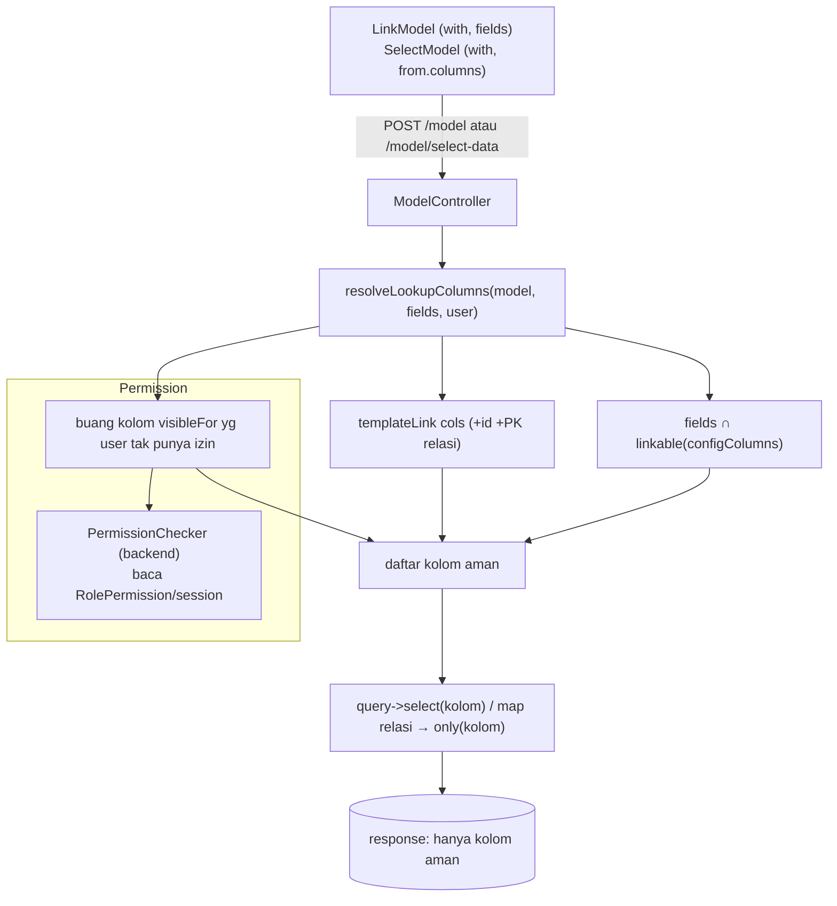

# Design Document: LinkModel Column Security

## Overview

Endpoint lookup model — `POST /model` (`ModelController::__invoke`) & `POST /model/select-data`
(`ModelController::selectData`) — mengembalikan **seluruh kolom non-hidden + relasi `with` penuh** apa adanya
(`$query->get()->toArray()`). Komponen `LinkModel`/`SelectModel` (dropdown referensi) memakai ini. Akibatnya:

1. **Over-fetch**: kolom yang tak dibutuhkan form tetap terkirim ke browser (mis. DeliveryNote lookup
   SalesOrder ikut bawa `price`).
2. **Kebocoran kolom sensitif (terverifikasi)**: `sales_order_items.price`, `purchase_order_items.rate`
   (harga transaksi), `stocks.valuation_rate` (harga modal) ikut keluar via `with`/kolom penuh. `templateLink`
   model order = `:code` saja — harga BUKAN bagian tampilan, tapi tetap keluar.
3. **IDOR laten**: endpoint generik menerima `with`/`model` dari client → user mana pun bisa POST
   `with=["stocks"]` ke `/model?model=Item` lalu menarik `valuation_rate`, walau tak ada form yang melakukannya.

> Catatan verifikasi: `items`/`item_variants` TIDAK punya kolom harga (ItemVariantLinkModel aman). Kolom
> sensitif nyata: `sales_order_items.price`, `*_base_currency`, `purchase_order_items.rate`, `stocks.valuation_rate`.

**Solusi: tiga lapis pembatasan kolom, semua dievaluasi SERVER-SIDE.**

```
kolom keluar saat lookup =
    templateLink                          // selalu (untuk tampilan dropdown) + id + PK relasi
  + (fields ∩ linkable)                    // form MINTA (fields) ∩ whitelist server (linkable)
  − kolom ber-izin yang user-nya tak punya izinnya   // visibleFor (kasus per-peran)
```

- **`linkable`** (flag `configColumns`, server): kolom yang BOLEH diminta lewat lookup. Keamanan, global.
- **`fields`** (prop frontend per-form): kolom yang form ini BUTUH. Hemat, per-konteks. TIDAK menentukan
  keamanan (client bisa di-tamper) — hanya menyaring dari yang sudah `linkable`.
- **`visibleFor`** (flag `configColumns`, type-safe): kolom sensitif butuh izin. Keluar bila user punya
  SALAH SATU izin `[Model::class, Permission::ACTION]` pada daftar.

## Prinsip Keamanan (anti-mismatch)

- **`fields` BUKAN gerbang keamanan** — yang menjaga = `linkable` (server). Attacker abaikan `fields`, minta
  `valuation_rate` → ditolak karena tak `linkable`. `fields` hanya untuk hemat/over-fetch.
- **Izin kolom diikat ke DOKUMEN-TUJUAN yang sah memakai kolom, BUKAN model sumber.** Mis. `price` SO terlihat
  bila user boleh `write` Invoice/Order — TIDAK butuh izin `read` SalesOrder. (Menjawab: user tanpa izin SO
  tetap bisa buat SalesInvoice dengan harga.)
- **Fail-safe**: default lookup HANYA `templateLink` + id + PK relasi. Kolom baru yang lupa ditandai → TIDAK
  bocor (tak keluar sampai sengaja di-`linkable`).
- **Lookup ≠ fitur ber-izin.** `/model` hanya melayani data referensi aman. Field sensitif untuk laporan
  khusus (mis. margin manajer-only) tetap lewat controller domain + authorize, bukan `/model`. (Di luar scope
  spec ini — spec ini hanya mengamankan jalur lookup.)

## Architecture



## Components and Interfaces

> **Penempatan (tanpa folder `Support/` baru — konvensi app):** `app/Support` & `app/Enums` belum ada.
> `PermissionChecker` → `app/Services/Core/` (sebelah `FilterEvaluator`). Konstanta aksi → `app/Enums/Permission.php`
> (PHP enum). Grup izin terpusat `ColumnVisibility` **DIBUANG** — `visibleFor` ditulis inline di `configColumns`
> (hanya 2 model `price` + 2 model `rate` yang berbagi aturan → indirection tak sepadan).

### 1. `app/Enums/Permission.php` (BARU) — enum aksi (anti-typo verb)

Mirror `$defaultPermissions` di `PermissionSeeder` (`select/read/write/create/delete/submit/cancel/amend/print/import/export/share`).
Enum string-backed agar bisa dibandingkan dgn key `permissions` (yang berbentuk string).

```php
enum Permission: string {
    case Select = 'select';
    case Read   = 'read';
    case Write  = 'write';
    case Create = 'create';
    // ... semua 12 aksi
}
```

### 2. `app/Services/Core/PermissionChecker.php` (BARU) — cek izin backend

Backend BELUM punya helper cek permission (hanya FE `checkPermission` di `lib/utils.js`; `AppMiddleware`
resolve permission ke session tapi tak ada `$user->can(model, action)`). Mirror logika FE `checkPermission`:
baca permission user (dari session yang sudah di-resolve `AppMiddleware`, atau query `RolePermission` bila
session kosong mis. konteks non-web).

```php
class PermissionChecker {
    /** @param array<string,mixed> $permissions hasil resolve (model→level→list) */
    public function __construct(private array $permissions) {}

    public static function forUser(Request $request): self;  // ambil dari session/resolve

    /** True bila user punya aksi pada model di level. Mirror checkPermission FE. */
    public function can(string $model, Permission $action, int $level = 0): bool;

    /**
     * Evaluasi pohon visibleFor (any/all bersarang, di level node MAUPUN aksi).
     * node = { any: node[] } | { all: node[] } | leaf.
     * leaf = [Model::class, actionNode] — actionNode juga pohon any/all (lihat grammar).
     */
    public function satisfies(array $node): bool;
}
```

**Grammar `visibleFor` (any/all bersarang — node DAN aksi):**

```
visibleFor := node
node       := { any: node[] }                 // OR: true bila ADA anak true
            | { all: node[] }                 // AND: true bila SEMUA anak true
            | leaf
leaf       := [ Model::class, actionNode ]    // izin pada satu model

actionNode := Permission                       // satu aksi
            | { any: actionNode[] }            // OR antar-aksi
            | { all: actionNode[] }            // AND antar-aksi
            | [ Permission, Permission, ... ]  // shorthand = { any: [...] } (WRITE|CREATE)

(list datar node [leaf, leaf, ...] = shorthand { any: [...] })
```

Evaluator `satisfies($node)` rekursif (any/all sama di kedua level):
- `{any: [...]}` → `true` bila SALAH SATU anak true.
- `{all: [...]}` → `true` bila SEMUA anak true.
- leaf `[Model, actionNode]` → `satisfiesAction(Model, actionNode)`:
  - `Permission` → `can(Model, Permission)`.
  - `{any}`/`{all}` aksi → rekursi (OR/AND antar-aksi pada model itu).
  - list datar aksi → `{any}`.
- list datar node → `{any: list}`.

> **`INVOICE:WRITE|CREATE`** (OR aksi) = `[SalesInvoice::class, [Permission::Write, Permission::Create]]`.
> **`INVOICE:WRITE&READ`** (AND aksi) = `[SalesInvoice::class, ['all' => [Permission::Write, Permission::Read]]]`.
> **AND lintas model** = `{all: [leaf, leaf]}`. **Bersarang penuh** = `{all: [{any:[...]}, [Model, {all:[...]}]]}`.

### 3. `configColumns` model — flag `linkable` & `visibleFor` (inline, type-safe)

Gabung ke `configColumns` yang SUDAH ADA (bukan property baru). `visibleFor` ditulis **inline** memakai
`[Model::class, Permission::Action]` (atau array aksi untuk OR) dan `any`/`all` bersarang — TANPA string
FQCN/aksi mentah (typo ketahuan compile, refactor-safe). Contoh `SalesOrderItem`:

```php
protected array $configColumns = [
    'quantity' => ['linkable' => true],

    // list datar = { any: [...] } (OR antar-klausa). price terlihat bila punya SALAH SATU.
    'price'    => ['linkable' => true, 'visibleFor' => [
        [SalesInvoice::class,    [Permission::Write, Permission::Create]],  // WRITE|CREATE (OR antar-aksi)
        [PurchaseInvoice::class, [Permission::Write, Permission::Create]],
        [SalesOrder::class,      Permission::Write],
        [PurchaseOrder::class,   Permission::Write],
    ]],

    // contoh nested any/all (bila perlu): boleh salah satu invoice DAN punya Finance:read.
    // AND antar-aksi pada satu model: Invoice butuh write DAN read → ['all' => [Write, Read]].
    // 'margin' => ['linkable' => true, 'visibleFor' => ['all' => [
    //     ['any' => [[SalesInvoice::class, Permission::Write], [PurchaseInvoice::class, Permission::Write]]],
    //     [Finance::class, ['all' => [Permission::Read, Permission::Write]]],  // AND aksi
    // ]]],

    // price_base_currency: TIDAK linkable → tak pernah keluar
];
```

- Kolom `templateLink` otomatis ikut (tak perlu `linkable`).
- `linkable: true` → boleh diminta via `fields`/`columns`.
- `visibleFor: <node>` → hanya keluar bila `PermissionChecker::satisfies($visibleFor)` (pohon any/all).
- Tanpa flag → tak keluar (fail-safe).

### 5. `ModelController` — terapkan pembatasan

Method helper privat (atau service) `resolveLookupColumns($model, array $fields, PermissionChecker $perm): array`
menghitung daftar kolom aman untuk model & tiap relasi `with`. Diterapkan di KEDUA jalur:

- `__invoke` (`:281-289`): ganti `$query->get()->toArray()` → select hanya kolom aman; map relasi `with`
  → `only(kolom aman relasi)`.
- `selectData` (`:354`): batasi `columns` metadata + data ke kolom aman (sebelum/saat macro).

Algoritma `resolveLookupColumns` (`$requested` = `fields` dari LinkModel ATAU `columns` dari SelectModel):
1. Mulai dari kolom `templateLink` (parse `:token`) + `id` + PK relasi.
2. Tambah `$requested ∩ {kolom configColumns ber-linkable}`.
3. Buang kolom yang punya `visibleFor` bila `! $perm->satisfies($col['visibleFor'])` (evaluasi pohon any/all).
4. Relasi `with`: rekursi aturan sama pada model relasi (pakai `FilterColumnResolver`/`getColumns` metadata).

### 6. Frontend — "kolom yang form butuh" (LinkModel `fields` vs SelectModel `columns`)

Konsep sama (kolom yg form butuh di luar templateLink), nama beda sesuai komponen:

- **`LinkModel.jsx`**: tambah prop **`fields`** (array nama kolom). Kirim ke `/model`. Default `[]` (hanya
  templateLink). Konsumen butuh kolom ekstra (Invoice) → `fields={["price","tax_rate","quantity"]}`;
  DeliveryNote → `fields={["quantity"]}` atau kosong.
- **`SelectModel`**: **REUSE `from.columns` / `selects[].columns`** yang SUDAH ADA (spec rewrite §5.1). Itu
  PERSIS peran `fields`. `selectData` sudah menerima `columns` (untuk show/order) — backend pakai `columns`
  itu sebagai `fields` (filter `columns ∩ linkable`). **Tidak ada prop baru untuk SelectModel.**

Backend memperlakukan `fields` (LinkModel) dan `columns` (SelectModel) secara seragam = "kolom diminta".

### File yang Disentuh

| File | Perubahan |
|------|-----------|
| `app/Enums/Permission.php` | **BARU** — enum aksi (string-backed) |
| `app/Services/Core/PermissionChecker.php` | **BARU** — cek izin backend (mirror FE checkPermission) |
| `app/Http/Controllers/ModelController.php` | `resolveLookupColumns()`; batasi output `__invoke` + `selectData` |
| `app/Models/**` (model dgn kolom sensitif) | tandai `linkable`/`visibleFor` INLINE di `configColumns` (SalesOrderItem, SalesInvoiceItem, PurchaseOrderItem, PurchaseInvoiceItem; `valuation_rate` cukup TIDAK-linkable) |
| `resources/js/Components/LinkModel.jsx` | prop `fields` |
| `resources/js/Components/SelectModel*` | REUSE `from.columns` (tanpa prop baru) |
| `resources/js/Pages/**/Form.jsx` (konsumen) | set `fields` (LinkModel) / `columns` (SelectModel) sesuai kebutuhan form |

Reuse: `getColumns`/`templateLink`/`configColumns` (LinkModel trait), `FilterColumnResolver`, `RolePermission`
+ session permission (`AppMiddleware`), FE `checkPermission` (acuan logika).

## Testing Strategy

- **PHPUnit** `tests/Feature/Http/LinkModelColumnSecurityTest.php`:
  - lookup default → hanya kolom templateLink (+id) keluar; kolom non-linkable TIDAK ada.
  - `fields=[linkable]` → kolom itu keluar; `fields=[non-linkable]` → dibuang (uji IDOR: minta `valuation_rate` → tak ada).
  - `visibleFor`: user dgn izin (mis. SalesInvoice:write) → `price` keluar; user tanpa izin → `price` TIDAK keluar; assert row yang sama.
  - relasi `with`: kolom relasi juga tersaring (mis. `with=[items]`, item `price` ikut aturan).
  - `PermissionChecker::satisfies` unit test: leaf, OR antar-aksi (`[Write,Create]`), AND antar-aksi (`{all:[Write,Read]}`), node `{any}`/`{all}`, nested `{all:[{any},leaf]}`, aksi-bersarang-dalam-node, list-datar=any (backward-compat).
- **Frontend (manual)**: Invoice form (butuh price) tetap dapat harga; DeliveryNote tak bawa price; ItemVariant lookup tak berubah (sudah aman).
- **Regresi**: `ModelSelectDataTest`, `ModelControllerFilterTest`, `FilterEvaluatorTest` tetap pass (sesuaikan bila perlu set `fields`).
- **Lint akhir**: `vendor/bin/pint --dirty --format agent` + eslint.

## Risiko & Mitigasi

| Risiko | Mitigasi |
|--------|----------|
| Form existing rusak (kolom yg dipakai jadi hilang) | Audit tiap konsumen LinkModel: kolom yg dibaca `onValueChange` → set `fields` + tandai `linkable`. Default templateLink saja → harus eksplisit. |
| Kolom sensitif baru lupa ditandai | Fail-safe: default TIDAK keluar. Aman by default. |
| `PermissionChecker` beda hasil dgn FE | Mirror logika `checkPermission` persis; unit test paritas. |
| Over-restrict relasi `with` memutus fitur | Test tiap form yg pakai `with`; relasi item ikuti aturan kolom model relasi. |
| String permission typo | Pakai enum `Permission::Write` + `Model::class`; tanpa string FQCN/aksi mentah (typo ketahuan compile). |

## Open Questions

[TODO konfirmasi saat implementasi] Daftar lengkap kolom sensitif per model yang perlu `visibleFor` vs cukup
TIDAK-linkable (mis. `valuation_rate` cukup tak-linkable; `price` butuh `visibleFor`). Ditetapkan saat audit
konsumen (fase tasks).
