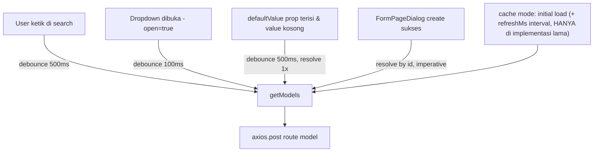

# Design Document: LinkModel Fetch Optimization

## Overview

`LinkModel.jsx` ([resources/js/Components/LinkModel.jsx](resources/js/Components/LinkModel.jsx)) adalah komponen combobox async yang dipakai luas di seluruh form aplikasi untuk memilih relasi model (Item, Account, Customer, dst). Saat ini fetch ke `route("model")` dilakukan manual via `axios` + kombinasi `useState`/`useEffect`, dengan cache custom yang mendukung 4 storage mode (`memory`, `localStorage`, `sessionStorage`, `indexedDB`) yang diimplementasikan tangan sendiri.

Masalah yang ingin diselesaikan:

1. **Tidak ada dedup request** — dua instance `LinkModel` dengan `model`+`filters` sama yang mount bersamaan (mis. dua baris `FormTable` yang identik) masing-masing fire request sendiri ke backend.
2. **Tidak ada race-condition guard** — response request lama bisa resolve setelah response request baru (network jitter saat user mengetik cepat), meng-overwrite `options` dengan data usang. Tidak ada `AbortController`/request-id check.
3. **Refetch berulang tanpa perlu** — effect "on open" ([LinkModel.jsx:570-598](resources/js/Components/LinkModel.jsx:570)) selalu fetch ulang tiap dropdown dibuka (bila `cache` mode nonaktif — default), walau `search`+`filters` identik dengan fetch sebelumnya.
4. **Cache manual reimplement fungsi yang sudah disediakan library** — `memoryCacheRef`, `readCache`/`writeCache`/`removeCache`, `setInterval` refresh ([LinkModel.jsx:188-283](resources/js/Components/LinkModel.jsx:188), [LinkModel.jsx:508-520](resources/js/Components/LinkModel.jsx:508)) melakukan hal yang built-in di TanStack Query (`staleTime`, `gcTime`, `refetchInterval`, dedup lintas-instance by `queryKey`).

Proyek ini **sudah** memakai TanStack Query untuk pola serupa di `DashboardBlocks` (`QuickListBlock.jsx`, `NumberCardDisplay.jsx`, `ChartDisplay.jsx`) dengan `QueryClientProvider` sudah terpasang global di [app.jsx:41](resources/js/app.jsx:41) / [ssr.jsx:43](resources/js/ssr.jsx:43), dan `staleTime`/`retry` default sudah dikonfigurasi di [lib/queryClient.js](resources/js/lib/queryClient.js:11) (`staleTime: 120_000`, `retry: false`, `refetchOnWindowFocus: false`). Spec ini mengevaluasi migrasi `LinkModel` ke pola yang sama — TANPA mengubah kontrak props publik komponen (semua konsumen existing, mis. `CurrencyLinkModel.jsx`, `CountryLinkModel.jsx`, `PermissionLinkModel.jsx`, tidak boleh berubah cara pakai).

## Architecture

### Pemicu fetch saat ini (4 jalur berbeda, semua manggil `getModels()`)

Empat jalur ini punya semantik BEDA yang perlu dipetakan hati-hati ke `useQuery`:

- **A (search debounce)** dan **B (on open)** — ini yang paling jelas cocok jadi SATU `useQuery` dengan `queryKey: ["linkModel", model, filtersKey, searchDebounced, joins, with, order, keywords]`. Dedup + cache otomatis menyelesaikan masalah #1-#3 di atas.
- **C (resolve defaultValue)** — fetch dengan `filters` override (`filterForDefaultValue`), hasilnya dipakai untuk **mengisi `option`**, bukan untuk daftar dropdown. Ini query TERPISAH secara semantik dari (A/B), meski memanggil endpoint yang sama.
- **D (resolve by id setelah create)** — imperative one-shot fetch (`onSuccessFormPageDialog`, [LinkModel.jsx:621-638](resources/js/Components/LinkModel.jsx:621)), bukan bagian dari "daftar opsi" — cocoknya tetap `axios` biasa atau `queryClient.fetchQuery()` sekali pakai, BUKAN `useQuery` reaktif.
- **E (cache mode existing)** — `cacheConfig.enabled` saat ini punya semantik "load semua data sekali, filter di client (`filteredOptions`, [LinkModel.jsx:651-675](resources/js/Components/LinkModel.jsx:651))" — dipakai untuk referensi data kecil/statis (Currency, Country, LeadSource, Permission). Ini jadi `useQuery` dengan `queryKey` TANPA `search` (karena filtering-nya di client), yang secara alami menggantikan seluruh sistem cache manual (#4).

  **Perubahan dari konsep awal (keputusan user)**: prop `cache` DISEDERHANAKAN jadi **boolean-only** (`cache` / `cache={true}` / `cache={false}`) — bentuk object `cache={{ enabled, refreshMs }}` DIHAPUS SELURUHNYA, bukan cuma sub-opsi `refreshMs`. Di-grep: nol konsumen existing memakai bentuk object ini sama sekali (baik `enabled` maupun `refreshMs` — satu-satunya kemunculan `refreshMs` di codebase adalah definisi API-nya sendiri di `LinkModel.jsx`). Setelah `refreshMs` dibuang, `{enabled}` doang jadi 100% redundan dengan boolean (`{enabled:true}` ≡ `true`), jadi cabang parsing `typeof cache === "object"` di `cacheConfig` ([LinkModel.jsx:117-128](resources/js/Components/LinkModel.jsx:117)) ikut dihapus. `staleTime` (stale-while-revalidate — lihat bawah) jadi SATU-SATUNYA mekanisme kesegaran data, baik untuk jalur A/B maupun E. Konsekuensi: cache mode TIDAK lagi auto-refresh secara aktif selama komponen tetap mounted tanpa remount — hanya revalidate saat query di-observe ulang (mount baru/`queryKey` berubah) dan data sudah lewat `staleTime`. Untuk 4 konsumen existing (dropdown pilih Currency/Country/dst., biasanya mount-pilih-selesai dalam durasi pendek), ini cukup — polling aktif tidak pernah benar-benar dibutuhkan.

### Storage persistence untuk cache mode — DIPUTUSKAN: dipertahankan

`cacheStorage="sessionStorage"` dipakai aktif di 4 konsumen: `CurrencyLinkModel.jsx:17`, `CountryLinkModel.jsx:17`, `LeadSourceLinkModel.jsx:17`, `PermissionLinkModel.jsx:24`. TanStack Query default HANYA in-memory (hilang saat reload halaman) — beda dari `sessionStorage` yang bertahan antar reload dalam tab yang sama. Keputusan user: fitur `cacheStorage` (`localStorage`/`sessionStorage`/`indexedDB`) yang sudah ada TETAP DIPERTAHANKAN, bukan disederhanakan jadi in-memory-only.

**KOREKSI teknis (ditemukan saat implementasi Task 3.3, menggantikan rencana awal di atas)**: paket resmi `@tanstack/query-sync-storage-persister`/`@tanstack/query-async-storage-persister` (via `persistQueryClient(queryClient, {persister})`) beroperasi di level SELURUH `QueryClient` — satu persister, satu storage, untuk SEMUA query sekaligus. Ini tidak cocok dengan kebutuhan kita: tiap instance `LinkModel` boleh punya `cacheStorage` BERBEDA (`sessionStorage` utk Currency, `localStorage` utk lainnya, sebagian tanpa persist sama sekali) dalam SATU `QueryClient` yang sama (yang sengaja dishare seluruh app demi dedup). Verifikasi lewat `node_modules/@tanstack/query-sync-storage-persister/build/modern/index.d.ts`: `createSyncStoragePersister` bahkan sudah **deprecated**, digantikan `createAsyncStoragePersister` — makin menegaskan API ini didesain untuk 1 storage per client, bukan per-query. Kedua dependency ini SUDAH DI-UNINSTALL kembali.

**Implementasi final (manual, tanpa dependency tambahan)**: `useLinkModelOptions` membaca snapshot tersimpan dari `cacheStorage` yang dikonfigurasi (localStorage/sessionStorage via Storage API langsung, indexedDB via helper kecil — reuse pola `readCache`/`writeCache`/`removeCache` yang SUDAH ADA dan teruji di `LinkModel.jsx:207-283` versi lama) dan mengoper hasilnya sebagai `initialData`+`initialDataUpdatedAt` ke `useQuery`. Saat fetch sukses, hasil baru ditulis-balik (write-through) ke storage yang sama. TanStack Query TETAP yang menentukan kesegaran (`staleTime` vs `initialDataUpdatedAt`) — persis semantik stale-while-revalidate yang direncanakan, cuma jalur penyimpanannya manual, bukan lewat plugin resmi.

Mode `memory` (default `cache=false`/`cacheStorage="memory"`) TIDAK butuh baca/tulis storage — cukup `staleTime`/`gcTime` bawaan `QueryClient` yang sudah ada (state `useQuery` sendiri sudah "memory cache").

**Wiring staleTime ke data yang dipulihkan dari storage**: `initialDataUpdatedAt` yang dioper ke `useQuery` adalah timestamp ASLI kapan data itu terakhir di-fetch (disimpan bareng datanya di storage) — BUKAN `Date.now()` saat restore. Ini krusial: kalau pakai `Date.now()`, TanStack akan selalu menganggap data "baru saja fresh" pada setiap restore, padahal bisa jadi sudah berjam-jam basi. Dengan timestamp asli, `staleTime` dihitung dengan benar sejak fetch ASLI terjadi, bukan sejak restore:
- Kalau belum lewat `staleTime` → dipakai langsung, TANPA fetch (menutup masalah awal: query gak dobel-fetch tiap kali).
- Kalau sudah lewat `staleTime` → tetap ditampilkan INSTAN (tidak ada loading flicker), TAPI otomatis refetch di background dan meng-update begitu response baru datang — inilah yang menjawab concern "data basi di storage" TANPA butuh endpoint version-check baru.

## Known Bugs Fixed by This Migration

### `filters` diabaikan total saat `cache` mode aktif

**Root cause** (2 lapis):
1. **Payload strip `filters`** — `getModels()` ([LinkModel.jsx:454-481](resources/js/Components/LinkModel.jsx:454)) hanya menyertakan `filters`/`fields`/`with`/`search`/`order` ke payload saat `!isCacheRequest`. Saat `cacheMode: true`, payload cuma `{model, cacheMode, joins}` — backend SELALU balikin dataset penuh TANPA filter, padahal `cacheKey` ([LinkModel.jsx:157-177](resources/js/Components/LinkModel.jsx:157)) sudah menghitung `filters` sebagai bagian hash (mengasumsikan tiap kombinasi filter dapat cache sendiri — asumsi yang saat ini gak pernah terpenuhi).
2. **Tidak ada fallback client-side** — `filteredOptions` ([LinkModel.jsx:651-675](resources/js/Components/LinkModel.jsx:651)) cuma memanggil `validate(opt, model)`, dan `validate()` ([linkModelUtils.js:183-186](resources/js/lib/linkModelUtils.js:183)) HANYA mengecek `opt.thisModel === model` — tidak ada logic filter sama sekali. Ada `validateWithOperators()` ([linkModelUtils.js:3-182](resources/js/lib/linkModelUtils.js:3)) yang tampak dibuat untuk mengisi gap ini (mendukung operator `in`/`between`/`like`/`and`/`or`/dst, cocok dengan shape `filters` yang dipakai consumer lain seperti `filters={{ item_id: { in: [...] } }}`) — tapi TIDAK PERNAH di-export atau dipanggil dari luar dirinya sendiri. Dead code, fitur setengah jadi yang tidak pernah selesai disambungkan.

**Kenapa fix-nya BUKAN "sambungkan `validateWithOperators`"**: `filters` bisa menunjuk ke KOLOM APA SAJA di model target, sedangkan row yang sudah di-fetch cuma punya kolom yang memang ikut ter-`select`/`with` di response (dibentuk untuk kebutuhan `templateLink`/tampilan dropdown, bukan untuk keperluan filter generik). Kalau `filters` mengacu kolom yang tidak ikut terbawa di payload cache-mode, validasi client-side TIDAK MUNGKIN benar apa pun implementasinya — datanya sendiri tidak ada di row. Filter di level SQL (backend) tidak punya keterbatasan ini.

**Fix (Strategy A — server-side, minimal)**: selalu sertakan `filters` (+`filterForDefaultValue`) di payload `useLinkModelOptions`, TERLEPAS dari cache mode aktif atau tidak — cukup hapus pengecualian `!isCacheRequest` khusus untuk `filters`. Backend `route("model")` sudah mendukung param ini di jalur non-cache, tinggal berhenti disembunyikan di jalur cache. `cacheKey`/`queryKey` TIDAK perlu berubah (sudah benar menghitung `filters`). Efek samping: kalau `filters` berubah runtime saat `cache` aktif, terjadi fetch baru per kombinasi filter — ini BUKAN trade-off baru, sudah jadi asumsi existing di reset-effect [LinkModel.jsx:406-420](resources/js/Components/LinkModel.jsx:406).

**Dead code dihapus**: `validateWithOperators()` ([linkModelUtils.js:3-182](resources/js/lib/linkModelUtils.js:3)) dihapus dari `linkModelUtils.js` sebagai bagian spec ini — tidak dipanggil dari luar dirinya sendiri, tidak di-export, dan Strategy A di atas membuatnya tidak akan pernah dibutuhkan (filtering tetap 100% di backend). `validate()` ([linkModelUtils.js:183-186](resources/js/lib/linkModelUtils.js:183)) TIDAK ikut terdampak — tetap dipakai apa adanya untuk cek `thisModel === model`, fungsi berbeda yang masih relevan.

## Components and Interfaces

- **`resources/js/Components/LinkModel.jsx`** — refactor internal fetch logic (jalur A/B/E) untuk konsumsi `useLinkModelOptions`; jalur C/D tetap imperative. Props publik LAMA tidak berubah KECUALI `cache` disederhanakan jadi `boolean` (JSDoc [LinkModel.jsx:54](resources/js/Components/LinkModel.jsx:54) `cache boolean | { enabled?: boolean, refreshMs?: number }` → `cache boolean`, bentuk object dihapus), tambah 1 prop baru: `staleTime` (number, ms, default `120_000` — samakan dengan default global [lib/queryClient.js:18](resources/js/lib/queryClient.js:18), override per-instance untuk field yang datanya sering berubah, mis. stok Item).
- **Hook baru `resources/js/Hooks/useLinkModelOptions.js`** (nama file mengikuti konvensi `Hooks/` yang sudah ada, mis. `useDidMountEffect`, `usePermission`) — bungkus `useQuery` untuk jalur A/B/E, dipisah dari `LinkModel.jsx` supaya bisa ditest independen dari UI combobox (pola sama `useModelColumns` di [QuickListBlock.jsx:47](resources/js/Components/DashboardBlocks/QuickListBlock.jsx:47)).
  - Terima `search` (raw, untuk `<Input>` — update tiap keystroke) DAN mengelola `debouncedSearch` secara internal (delay 500ms, pola sama yang sudah ada di [LinkModel.jsx:528-542](resources/js/Components/LinkModel.jsx:528)).
  - `queryKey: ["linkModel", model, filtersKey, debouncedSearch, joins, with, order, keywords]` — HANYA `debouncedSearch` yang masuk key, bukan `search` mentah. Ini mencegah cache TanStack numpuk entry per-keystroke ("I", "It", "Ite", ...) yang tak pernah kepakai ulang, dan menghindari fetch tiap huruf diketik.
  - `staleTime` diteruskan dari prop `LinkModel` ke opsi `useQuery`.
- **`resources/js/lib/linkModelUtils.js`** — hapus `validateWithOperators()` (dead code, [linkModelUtils.js:3-182](resources/js/lib/linkModelUtils.js:3)). `validate()`, `convertTemplateLink()` tidak berubah. Sudah dicek: tidak ada test (`linkModelUtils.test.js`) yang menyentuh fungsi ini — aman dihapus tanpa update test terpisah.
- Test yang terdampak: `LinkModel.rtl.test.jsx` dan seluruh `*LinkModel.rtl.test.jsx` turunan (Currency/Country/LeadSource/Permission) — perlu `QueryClientProvider` wrapper di test setup (pola sama `QuickListBlock.rtl.test.jsx:289-300`), plus unit test baru khusus `useLinkModelOptions.js` (test murni hook, tanpa render UI).

## Out of Scope

- Perubahan endpoint backend `route("model")` / `LinkModel.php` trait — spec ini murni sisi frontend fetch-layer.
- Perubahan UI/UX combobox (styling, keyboard nav, dsb).
